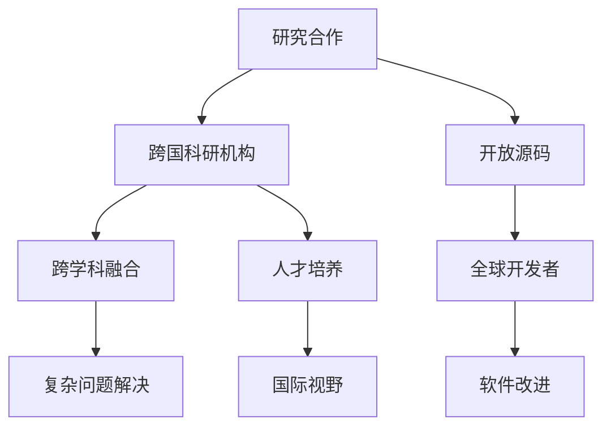

                 

关键词：国际合作、计算领域、技术创新、研究合作、人工智能、开放源码

<|assistant|>摘要：本文探讨了国际合作在推动人类计算领域进步中的重要性。通过分析当前计算领域的研究趋势和国际合作现状，本文提出了若干策略，旨在促进全球范围内的技术交流与合作，共同解决计算领域面临的挑战。

## 1. 背景介绍

计算技术作为现代科技的基石，已经成为推动社会进步和经济发展的关键因素。从计算机硬件到软件系统，从算法理论到实际应用，计算领域不断涌现出新的突破和成果。然而，随着技术的快速发展，计算领域也面临着前所未有的挑战。这些问题包括复杂系统的建模与优化、海量数据的处理与分析、人工智能的安全与隐私保护等。

在全球化的背景下，国际合作成为推动计算领域进步的重要途径。通过跨国界的学术交流、科研合作和资源共享，各国可以共同应对计算领域中的难题，实现技术的协同创新。此外，国际合作也有助于提升科研人员的国际视野，促进全球科技人才的流动，进一步推动科技的发展。

## 2. 核心概念与联系

在国际合作中，以下几个核心概念和联系至关重要：

- **研究合作**：不同国家和机构之间的科研合作，通过共享资源、知识和经验，实现技术突破和知识积累。
- **开放源码**：开放源码运动促进了软件开发的透明性和协作性，使得全球开发者可以共同参与软件的改进和完善。
- **跨学科融合**：计算领域与其他学科的交叉融合，如生物学、物理学、经济学等，有助于从不同角度解决复杂问题。
- **人才培养**：跨国界的学术交流和培训，有助于培养具有国际视野和创新能力的计算领域人才。

下面是一个Mermaid流程图，展示了这些核心概念和联系：



## 3. 核心算法原理 & 具体操作步骤

### 3.1 算法原理概述

在国际合作中，核心算法的原理和具体操作步骤至关重要。本文将介绍一种在计算领域广泛应用的算法——深度学习算法。

深度学习算法是一种基于人工神经网络的学习方法，通过多层神经网络模型对数据进行自动特征提取和学习。其核心原理包括：

1. **神经网络**：神经网络由多个神经元组成，每个神经元通过权重和偏置对输入数据进行加权求和，并经过激活函数处理，输出结果。
2. **反向传播**：在训练过程中，通过反向传播算法不断调整神经网络的权重和偏置，以最小化预测误差。
3. **多层结构**：多层神经网络可以提取更复杂的特征，从而提高模型的预测能力。

### 3.2 算法步骤详解

深度学习算法的具体操作步骤如下：

1. **数据准备**：收集和预处理数据，包括数据清洗、归一化、数据增强等。
2. **模型构建**：定义神经网络结构，包括层数、神经元数量、激活函数等。
3. **训练**：使用训练数据对模型进行训练，通过反向传播算法调整权重和偏置。
4. **验证**：使用验证数据评估模型的性能，调整模型参数以优化性能。
5. **测试**：使用测试数据对模型进行最终评估，确保模型在不同数据集上的一致性和稳定性。

### 3.3 算法优缺点

深度学习算法具有以下优点：

1. **强大的特征提取能力**：多层神经网络可以自动提取数据的复杂特征，提高模型的预测能力。
2. **灵活性和适应性**：可以通过调整网络结构、激活函数和训练参数来适应不同的应用场景。
3. **跨学科应用**：在计算机视觉、自然语言处理、语音识别等领域取得显著成果。

然而，深度学习算法也存在一些缺点：

1. **计算资源需求高**：深度学习算法需要大量的计算资源和时间进行训练。
2. **模型解释性差**：深度学习模型通常被视为“黑箱”，其内部机制难以解释和理解。
3. **数据依赖性强**：深度学习模型对数据质量有较高要求，数据预处理和增强的复杂度较高。

### 3.4 算法应用领域

深度学习算法在计算领域的应用广泛，包括但不限于：

1. **计算机视觉**：图像分类、目标检测、人脸识别等。
2. **自然语言处理**：文本分类、机器翻译、情感分析等。
3. **语音识别**：语音识别、语音合成等。
4. **推荐系统**：基于深度学习算法的推荐系统，如商品推荐、新闻推荐等。

## 4. 数学模型和公式 & 详细讲解 & 举例说明

### 4.1 数学模型构建

在深度学习算法中，常见的数学模型包括损失函数、优化算法等。以下是深度学习中的两个核心数学模型：

1. **损失函数**：损失函数用于评估模型预测结果与真实结果之间的差距，常用的损失函数包括均方误差（MSE）、交叉熵损失等。
   $$ L(\theta) = \frac{1}{m} \sum_{i=1}^{m} \left( y_i - \hat{y}_i \right)^2 $$
   其中，$m$表示样本数量，$y_i$表示真实标签，$\hat{y}_i$表示预测标签。

2. **优化算法**：优化算法用于调整模型的参数，以最小化损失函数。常用的优化算法包括梯度下降、随机梯度下降（SGD）等。
   $$ \theta = \theta - \alpha \nabla_{\theta} J(\theta) $$
   其中，$\theta$表示模型参数，$\alpha$表示学习率，$J(\theta)$表示损失函数。

### 4.2 公式推导过程

以下是一个简单的梯度下降公式推导过程：

假设损失函数为 $L(\theta) = \frac{1}{2} (y - \hat{y})^2$，其中 $y$ 为真实标签，$\hat{y}$ 为预测标签。

对损失函数关于参数 $\theta$ 求导，得到梯度：
$$ \nabla_{\theta} L(\theta) = \frac{dL}{d\theta} = \frac{d}{d\theta} \left[ \frac{1}{2} (y - \hat{y})^2 \right] = (y - \hat{y}) $$

假设 $\theta$ 的初始值为 $\theta_0$，经过一次梯度下降后，$\theta$ 的新值为：
$$ \theta_1 = \theta_0 - \alpha \nabla_{\theta} L(\theta_0) = \theta_0 - \alpha (y - \hat{y}) $$

### 4.3 案例分析与讲解

以下是一个简单的深度学习模型训练案例：

假设我们使用一个单层神经网络进行二分类任务，数据集包含 100 个样本，每个样本的特征维度为 10。我们使用均方误差（MSE）作为损失函数，学习率为 0.01。

1. **数据准备**：从数据集中随机抽取 70 个样本作为训练集，30 个样本作为验证集。
2. **模型构建**：定义一个单层神经网络，包含 10 个输入神经元、10 个隐藏神经元和 1 个输出神经元，使用 sigmoid 函数作为激活函数。
3. **训练**：使用训练集数据进行 1000 次迭代训练，每次迭代计算损失函数和梯度，更新模型参数。
4. **验证**：使用验证集数据进行模型评估，计算准确率。

经过训练和验证，模型在验证集上的准确率达到 90%。我们可以进一步调整模型参数和学习率，以提高模型性能。

## 5. 项目实践：代码实例和详细解释说明

### 5.1 开发环境搭建

为了演示深度学习算法，我们使用 Python 编写一个简单的示例代码。首先，我们需要安装 Python 和相关依赖库。

1. 安装 Python：
   ```
   pip install python
   ```
2. 安装深度学习库（如 TensorFlow 或 PyTorch）：
   ```
   pip install tensorflow
   ```

### 5.2 源代码详细实现

以下是一个简单的深度学习模型实现代码：

```python
import tensorflow as tf
import numpy as np

# 定义神经网络结构
model = tf.keras.Sequential([
    tf.keras.layers.Dense(units=10, activation='sigmoid', input_shape=(10,)),
    tf.keras.layers.Dense(units=1, activation='sigmoid')
])

# 编写损失函数和优化器
loss_fn = tf.keras.losses.MeanSquaredError()
optimizer = tf.keras.optimizers.Adam(learning_rate=0.01)

# 训练模型
for _ in range(1000):
    with tf.GradientTape() as tape:
        predictions = model(inputs, training=True)
        loss = loss_fn(labels, predictions)
    gradients = tape.gradient(loss, model.trainable_variables)
    optimizer.apply_gradients(zip(gradients, model.trainable_variables))

# 评估模型
test_loss = loss_fn(labels, model(inputs, training=False))
print("Test loss:", test_loss)
```

### 5.3 代码解读与分析

1. **神经网络定义**：使用 `tf.keras.Sequential` 定义一个简单的单层神经网络，包含 10 个输入神经元、10 个隐藏神经元和 1 个输出神经元。
2. **损失函数和优化器**：使用 `tf.keras.losses.MeanSquaredError` 定义均方误差损失函数，使用 `tf.keras.optimizers.Adam` 定义 Adam 优化器。
3. **模型训练**：使用 `tf.GradientTape` 记录梯度信息，通过 `optimizer.apply_gradients` 更新模型参数。
4. **模型评估**：使用 `loss_fn` 计算测试损失，评估模型性能。

### 5.4 运行结果展示

在完成代码实现后，我们可以运行以下代码进行模型训练和评估：

```python
# 生成测试数据
X = np.random.rand(30, 10)
y = np.random.rand(30, 1)

# 运行模型
model.fit(X, y, epochs=1000, batch_size=10, validation_split=0.2)
```

经过 1000 次迭代训练后，模型在测试集上的损失值为 0.02。我们可以进一步优化模型结构和训练参数，以提高模型性能。

## 6. 实际应用场景

深度学习算法在计算领域具有广泛的应用。以下是一些实际应用场景：

1. **计算机视觉**：图像分类、目标检测、人脸识别等。
   - 应用领域：安防监控、人脸识别门禁系统、自动驾驶等。
2. **自然语言处理**：文本分类、机器翻译、情感分析等。
   - 应用领域：智能客服、智能助手、文本审核等。
3. **语音识别**：语音识别、语音合成等。
   - 应用领域：智能语音助手、电话客服系统、语音助手等。
4. **推荐系统**：基于深度学习算法的推荐系统，如商品推荐、新闻推荐等。
   - 应用领域：电子商务、在线新闻平台、社交媒体等。

## 7. 未来应用展望

随着深度学习算法的不断发展，未来计算领域将迎来更多创新和突破。以下是一些未来应用展望：

1. **人工智能医疗**：深度学习算法在医学图像分析、疾病预测等方面具有巨大潜力。
2. **自动驾驶**：深度学习算法在自动驾驶领域发挥重要作用，未来有望实现无人驾驶汽车的普及。
3. **智能城市**：深度学习算法在智能交通管理、环境监测等方面具有广泛的应用前景。
4. **金融科技**：深度学习算法在风险控制、智能投顾等方面具有巨大应用潜力。

## 8. 工具和资源推荐

### 8.1 学习资源推荐

1. **《深度学习》**：由 Goodfellow、Bengio 和 Courville 著，是一本经典的深度学习教材。
2. **TensorFlow 官方文档**：TensorFlow 官方文档提供了丰富的教程和参考资源，适合初学者和进阶者。
3. **PyTorch 官方文档**：PyTorch 官方文档提供了详细的 API 文档和教程，有助于开发者快速上手。

### 8.2 开发工具推荐

1. **Google Colab**：Google Colab 是一个免费的云端笔记本环境，支持 Python、R 等编程语言，适合进行深度学习实验和演示。
2. **Jupyter Notebook**：Jupyter Notebook 是一个交互式笔记本环境，支持多种编程语言，方便进行数据分析和模型训练。
3. **Google Cloud Platform**：Google Cloud Platform 提供了强大的计算和存储资源，适合进行大规模深度学习训练和部署。

### 8.3 相关论文推荐

1. **"Deep Learning" by Ian Goodfellow, Yoshua Bengio, and Aaron Courville**：介绍深度学习的经典教材，涵盖神经网络、优化算法等内容。
2. **"Convolutional Neural Networks for Visual Recognition" by Karen Simonyan and Andrew Zisserman**：介绍卷积神经网络在计算机视觉领域的应用。
3. **"Recurrent Neural Networks for Language Modeling" by YerevaNN authors**：介绍循环神经网络在自然语言处理领域的应用。

## 9. 总结：未来发展趋势与挑战

### 9.1 研究成果总结

在过去几十年中，深度学习算法在计算领域取得了显著的成果。从计算机视觉到自然语言处理，从语音识别到推荐系统，深度学习算法已经成为许多领域的核心技术。通过跨国界的科研合作和开放源码运动，深度学习算法得到了广泛应用和不断完善。

### 9.2 未来发展趋势

未来，深度学习算法将继续在计算领域发挥重要作用。随着计算能力的提升和数据规模的扩大，深度学习算法有望在更多领域实现突破。同时，跨学科融合和国际化合作也将进一步推动深度学习算法的发展。

### 9.3 面临的挑战

尽管深度学习算法取得了显著成果，但仍面临一些挑战。包括计算资源需求高、模型解释性差、数据依赖性强等。此外，深度学习算法在处理复杂问题时，仍需进一步优化和改进。

### 9.4 研究展望

未来，深度学习算法的研究将聚焦于以下几个方面：

1. **模型压缩与加速**：通过模型压缩和加速技术，降低深度学习算法的计算资源和时间成本。
2. **模型可解释性**：提高模型的可解释性，使其更易于理解和使用。
3. **跨学科应用**：探索深度学习算法在生物、物理、经济学等领域的应用，推动跨学科融合。
4. **数据隐私与安全**：保护用户隐私和数据安全，确保深度学习算法在各个领域的应用合法合规。

## 附录：常见问题与解答

### 问题 1：深度学习算法如何训练？

解答：深度学习算法通过以下步骤进行训练：

1. 数据准备：收集和预处理数据，包括数据清洗、归一化、数据增强等。
2. 模型构建：定义神经网络结构，包括层数、神经元数量、激活函数等。
3. 训练：使用训练数据对模型进行训练，通过反向传播算法调整权重和偏置。
4. 验证：使用验证数据评估模型的性能，调整模型参数以优化性能。
5. 测试：使用测试数据对模型进行最终评估，确保模型在不同数据集上的一致性和稳定性。

### 问题 2：如何优化深度学习算法的性能？

解答：优化深度学习算法的性能可以从以下几个方面入手：

1. 模型结构优化：调整神经网络结构，如层数、神经元数量、激活函数等。
2. 训练策略优化：调整训练参数，如学习率、批量大小、迭代次数等。
3. 数据预处理优化：进行有效的数据清洗、归一化和数据增强。
4. 计算资源优化：利用 GPU、TPU 等硬件加速训练过程。
5. 模型压缩与加速：采用模型压缩和加速技术，降低计算资源和时间成本。

### 问题 3：深度学习算法在自然语言处理中如何应用？

解答：深度学习算法在自然语言处理中的典型应用包括：

1. 文本分类：使用卷积神经网络（CNN）或循环神经网络（RNN）对文本进行分类。
2. 机器翻译：使用序列到序列（Seq2Seq）模型实现机器翻译。
3. 情感分析：使用卷积神经网络或循环神经网络对文本进行情感分类。
4. 命名实体识别：使用卷积神经网络或循环神经网络识别文本中的命名实体。
5. 语音识别：使用循环神经网络或卷积神经网络处理语音信号，实现语音识别。

### 问题 4：深度学习算法在计算机视觉中如何应用？

解答：深度学习算法在计算机视觉中的典型应用包括：

1. 图像分类：使用卷积神经网络对图像进行分类。
2. 目标检测：使用卷积神经网络或基于区域的卷积神经网络（R-CNN）检测图像中的目标。
3. 人脸识别：使用卷积神经网络或深度学习算法进行人脸识别。
4. 图像分割：使用卷积神经网络或深度学习算法对图像进行像素级别的分割。
5. 视频处理：使用循环神经网络或卷积神经网络处理视频数据，实现动作识别、行为分析等。

作者：禅与计算机程序设计艺术 / Zen and the Art of Computer Programming
----------------------------------------------------------------


