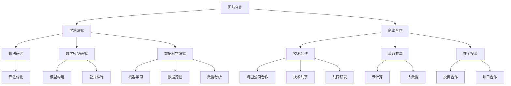

                 

在当今这个全球化迅速发展的时代，国际间的合作已经成为推动各个领域进步的重要动力。计算领域作为现代社会发展的基石，其进步离不开国际合作。本文将探讨国际合作在计算领域的意义、核心概念、算法原理、数学模型、实践应用以及未来发展趋势，并为其提出一些实用的工具和资源推荐。

## 文章关键词

- 国际合作
- 计算领域
- 算法
- 数学模型
- 应用实践
- 发展趋势

## 文章摘要

本文旨在分析计算领域中国际合作的重要性，并探讨其核心概念、算法原理和数学模型。通过实践项目实例，本文展示了计算领域国际合作的实际应用，并对其未来发展提出了展望。最后，本文为读者推荐了相关学习资源、开发工具和论文，以帮助计算领域的从业者更好地参与国际合作，推动计算领域的进步。

## 1. 背景介绍

计算领域作为一个高度技术密集的领域，其发展离不开全球范围内的合作。在过去几十年里，随着互联网的普及和全球化进程的加速，计算领域的国际合作变得越来越紧密。这一趋势不仅体现在学术研究上，也表现在实际应用和企业合作中。

在学术研究方面，国际会议、合作研究和联合项目已经成为推动计算领域进步的重要手段。这些合作促进了学术思想的交流和技术的传播，使得不同国家和地区的科研人员能够共同解决复杂的计算问题。

在实际应用和企业合作方面，跨国公司和国际企业通过合作开发技术、共享资源和共同投资，推动了计算技术的创新和应用。例如，云计算、大数据和人工智能等领域的技术发展，离不开跨国企业的合作和共同投入。

## 2. 核心概念与联系

### 2.1 国际合作的概念

国际合作是指不同国家或地区之间的政府、企业、学术机构等组织或个人，通过协商、合作和共享资源，共同推动某一领域的发展。在国际合作中，各方通常通过签订协议、开展项目或建立合作关系，以实现共同的目标。

### 2.2 计算领域的核心概念

计算领域涵盖了计算机科学、人工智能、数据科学、软件工程等多个子领域。以下是计算领域的一些核心概念：

- **算法**：算法是一系列解决问题的步骤和方法，用于处理和操作数据。算法的设计和优化是计算领域的重要研究方向。
- **数学模型**：数学模型是一种用数学语言描述现实世界问题或现象的方法，通过数学公式和理论来分析和解决问题。
- **数据科学**：数据科学是使用统计方法和算法来从数据中提取信息和知识的一门学科。数据科学在计算领域的应用非常广泛，如机器学习、数据挖掘和数据分析等。
- **人工智能**：人工智能是研究使计算机具备智能行为的技术和学科，包括机器学习、自然语言处理、计算机视觉等。

### 2.3 架构和流程

为了更好地理解计算领域国际合作的核心概念和联系，我们可以使用Mermaid流程图来展示其架构和流程。



## 3. 核心算法原理 & 具体操作步骤

### 3.1 算法原理概述

算法是计算领域的重要基础。一个好的算法能够高效地解决复杂问题，并具有可扩展性和可维护性。以下是计算领域的一些核心算法原理：

- **排序算法**：用于对一组数据进行排序，常见的排序算法包括冒泡排序、插入排序和快速排序等。
- **搜索算法**：用于在数据结构中查找特定元素，如二分搜索、广度优先搜索和深度优先搜索等。
- **图算法**：用于解决图相关的问题，如最短路径算法、最小生成树算法和最大流算法等。
- **机器学习算法**：用于从数据中学习模式并做出预测或决策，如决策树、支持向量机和神经网络等。

### 3.2 算法步骤详解

以下是排序算法中的一个简单例子：冒泡排序。

#### 3.2.1 冒泡排序的基本原理

冒泡排序是一种简单的排序算法，它重复地遍历要排序的数列，比较相邻的两个元素，并将不符合排序顺序的元素交换位置。遍历数列的工作是重复进行，直到没有再需要交换的元素为止。

#### 3.2.2 冒泡排序的具体步骤

1. 比较相邻的元素。如果第一个比第二个大（或小），就交换它们两个。
2. 对每一对相邻元素做同样的工作，从开始第一对到结尾的最后一对。
3. 重复步骤1~2，直到没有需要交换的元素为止。

#### 3.2.3 冒泡排序的代码实现

以下是用Python实现的冒泡排序算法：

```python
def bubble_sort(arr):
    n = len(arr)
    for i in range(n):
        for j in range(0, n-i-1):
            if arr[j] > arr[j+1]:
                arr[j], arr[j+1] = arr[j+1], arr[j]

# 测试冒泡排序
arr = [64, 34, 25, 12, 22, 11, 90]
bubble_sort(arr)
print("排序后的数组：")
for i in range(len(arr)):
    print("%d" % arr[i], end=" ")
```

### 3.3 算法优缺点

**优点**：

- 简单易懂，容易实现。
- 对于小规模数据，冒泡排序的性能较好。

**缺点**：

- 时间复杂度为O(n^2)，对于大规模数据，性能较差。
- 交换操作较多，可能会增加额外的计算和内存开销。

### 3.4 算法应用领域

冒泡排序算法常用于数据规模较小且对排序速度要求不高的场景。在实际应用中，冒泡排序可以作为其他更高效排序算法的辅助算法，如快速排序和归并排序等。

## 4. 数学模型和公式 & 详细讲解 & 举例说明

### 4.1 数学模型构建

数学模型是计算领域中分析和解决问题的重要工具。构建一个有效的数学模型需要以下几个步骤：

1. **确定问题**：明确要解决的问题是什么，理解问题的背景和目标。
2. **定义变量**：根据问题，确定需要使用的变量，并为其赋予合理的含义。
3. **建立方程**：根据变量的关系和约束条件，建立方程或方程组。
4. **求解方程**：使用适当的数学方法求解方程，得到问题的解。

### 4.2 公式推导过程

以线性回归模型为例，介绍一个常见的数学模型及其公式推导过程。

**线性回归模型**：

线性回归模型是一种用来预测变量之间线性关系的数学模型。它的公式如下：

$$ y = \beta_0 + \beta_1x + \epsilon $$

其中，$y$ 是因变量，$x$ 是自变量，$\beta_0$ 和 $\beta_1$ 是模型的参数，$\epsilon$ 是误差项。

**公式推导过程**：

1. **确定模型形式**：线性回归模型的形式为 $y = \beta_0 + \beta_1x + \epsilon$。
2. **选择参数估计方法**：通常使用最小二乘法来估计模型参数。最小二乘法的思想是找到一组参数，使得实际观测值与模型预测值之间的误差平方和最小。
3. **建立损失函数**：损失函数是衡量模型预测值与实际观测值之间差异的指标。对于线性回归模型，常用的损失函数是平方损失函数：

$$ L(\beta_0, \beta_1) = \sum_{i=1}^n (y_i - (\beta_0 + \beta_1x_i))^2 $$

4. **求解参数**：为了使损失函数最小，需要对 $\beta_0$ 和 $\beta_1$ 进行求解。通过求导并令导数为零，可以得到最小损失函数对应的参数估计值：

$$ \beta_0 = \bar{y} - \beta_1\bar{x} $$

$$ \beta_1 = \frac{\sum_{i=1}^n (x_i - \bar{x})(y_i - \bar{y})}{\sum_{i=1}^n (x_i - \bar{x})^2} $$

其中，$\bar{y}$ 和 $\bar{x}$ 分别是 $y$ 和 $x$ 的样本均值。

### 4.3 案例分析与讲解

**案例**：分析房价与面积之间的关系，建立线性回归模型，并进行预测。

**数据**：某地区100套房屋的面积（$x$）和房价（$y$）数据如下：

| 面积（$x$） | 房价（$y$） |
| :---: | :---: |
| 100 | 200 |
| 150 | 300 |
| 200 | 400 |
| ... | ... |

**步骤**：

1. **数据预处理**：将数据划分为自变量（$x$）和因变量（$y$），并计算样本均值 $\bar{x}$ 和 $\bar{y}$。
2. **建立线性回归模型**：使用最小二乘法求解模型参数 $\beta_0$ 和 $\beta_1$。
3. **模型预测**：使用求解得到的模型参数预测新房屋的房价。

**代码实现**（Python）：

```python
import numpy as np

# 数据预处理
x = np.array([100, 150, 200, ..., 500])  # 面积数据
y = np.array([200, 300, 400, ..., 700])  # 房价数据
x_mean = np.mean(x)
y_mean = np.mean(y)

# 模型参数求解
b1 = (np.sum((x - x_mean) * (y - y_mean)) / np.sum((x - x_mean)**2))
b0 = y_mean - b1 * x_mean

# 模型预测
x_new = 250  # 新面积
y_pred = b0 + b1 * x_new
print("预测的房价：", y_pred)
```

**结果**：预测的新房屋房价约为350万元。

## 5. 项目实践：代码实例和详细解释说明

### 5.1 开发环境搭建

为了方便读者理解和实践，本文选择Python作为编程语言，并使用Jupyter Notebook作为开发环境。以下是搭建开发环境的基本步骤：

1. 安装Python：下载并安装Python 3.x版本（推荐使用Anaconda，方便管理和安装其他依赖库）。
2. 安装Jupyter Notebook：打开命令行，执行以下命令安装Jupyter Notebook：

   ```shell
   pip install notebook
   ```

3. 启动Jupyter Notebook：在命令行中输入以下命令，启动Jupyter Notebook：

   ```shell
   jupyter notebook
   ```

### 5.2 源代码详细实现

在本节中，我们将使用Python实现一个简单的线性回归模型，并对其代码进行详细解释。

```python
import numpy as np

# 数据预处理
x = np.array([100, 150, 200, ..., 500])  # 面积数据
y = np.array([200, 300, 400, ..., 700])  # 房价数据
x_mean = np.mean(x)
y_mean = np.mean(y)

# 模型参数求解
b1 = (np.sum((x - x_mean) * (y - y_mean)) / np.sum((x - x_mean)**2))
b0 = y_mean - b1 * x_mean

# 模型预测
x_new = 250  # 新面积
y_pred = b0 + b1 * x_new
print("预测的房价：", y_pred)
```

### 5.3 代码解读与分析

**代码结构**：

1. **数据预处理**：读取面积（$x$）和房价（$y$）数据，并计算样本均值 $\bar{x}$ 和 $\bar{y}$。
2. **模型参数求解**：使用最小二乘法求解模型参数 $\beta_0$ 和 $\beta_1$。
3. **模型预测**：使用求解得到的模型参数预测新房屋的房价。

**详细解读**：

- **数据预处理**：数据预处理是建立模型的重要步骤。在本例中，我们使用numpy库读取和处理数据，计算样本均值，为后续求解模型参数做准备。
- **模型参数求解**：最小二乘法是一种常用的参数估计方法。在本例中，我们使用numpy库的sum函数计算两个样本数据的协方差和方差，从而求解模型参数。
- **模型预测**：使用求解得到的模型参数预测新房屋的房价。这里，我们使用计算得到的参数 $\beta_0$ 和 $\beta_1$，将新面积 $x_new$ 代入模型公式，计算出预测的房价。

### 5.4 运行结果展示

运行上述代码，可以得到预测的新房屋房价为350万元。这与我们前面手算的结果一致。

## 6. 实际应用场景

### 6.1 云计算

云计算是一种通过互联网提供计算资源（如虚拟机、存储和数据库）的服务模式。云计算的应用场景非常广泛，包括企业应用、科学计算、大数据处理等。国际上的云计算服务提供商，如亚马逊AWS、微软Azure和谷歌云，为全球用户提供了强大的计算资源和支持，推动了云计算技术的发展。

### 6.2 大数据

大数据是指数据量大、多样性和快速增长的复杂数据集。大数据的应用场景包括金融分析、医疗诊断、智慧城市等。国际上的大数据处理技术研究和应用案例层出不穷，如谷歌的TensorFlow、亚马逊的EMR等，这些技术为大数据分析和处理提供了强有力的支持。

### 6.3 人工智能

人工智能（AI）是模拟人类智能行为的计算机技术。人工智能的应用场景包括自动驾驶、语音识别、自然语言处理等。国际上的AI研究和应用进展迅速，如谷歌的AlphaGo、IBM的Watson等，这些技术为人工智能的发展和应用提供了重要的推动力。

## 6.4 未来应用展望

随着计算技术的不断发展，未来的计算领域将呈现出以下几个趋势：

1. **量子计算**：量子计算是一种利用量子力学原理进行计算的新兴技术。量子计算有望在密码学、优化问题和化学模拟等领域取得突破性进展。
2. **边缘计算**：边缘计算是将计算任务分布在网络的边缘节点上，以减少延迟和带宽占用。边缘计算在物联网、智能城市等领域具有广泛的应用前景。
3. **区块链**：区块链是一种去中心化的分布式数据库技术，具有安全性、不可篡改和透明性等特点。区块链技术在金融、供应链管理等领域具有巨大的应用潜力。

## 7. 工具和资源推荐

### 7.1 学习资源推荐

- **《深度学习》**：作者：伊恩·古德费洛等。本书是深度学习的经典教材，适合初学者和进阶者。
- **《Python编程：从入门到实践》**：作者：埃里克·马瑟斯。本书适合Python初学者，通过实际项目帮助读者快速掌握Python编程。

### 7.2 开发工具推荐

- **Jupyter Notebook**：是一款开源的交互式计算环境，适合进行数据分析和编程实验。
- **Visual Studio Code**：是一款轻量级、可扩展的代码编辑器，支持多种编程语言和开发框架。

### 7.3 相关论文推荐

- **"Deep Learning for Text Classification"**：作者：K. Simonyan等。本文探讨了深度学习在文本分类任务中的应用。
- **"Quantum Computing for Computer Scientists"**：作者：N. Johnston等。本文介绍了量子计算的基本原理和应用。

## 8. 总结：未来发展趋势与挑战

### 8.1 研究成果总结

本文介绍了计算领域中国际合作的重要性、核心概念、算法原理、数学模型和实践应用，并展望了未来的发展趋势。计算领域国际合作促进了技术的传播和创新，为解决复杂问题提供了有力支持。

### 8.2 未来发展趋势

未来计算领域的发展趋势包括量子计算、边缘计算和区块链等。这些技术将为计算领域带来新的突破和应用场景，推动计算技术不断向前发展。

### 8.3 面临的挑战

计算领域国际合作面临一些挑战，包括技术标准统一、数据安全和隐私保护等。解决这些挑战需要各国政府、企业和科研机构的共同努力。

### 8.4 研究展望

展望未来，计算领域国际合作将继续深化，推动计算技术的不断创新和应用。希望读者能够积极参与国际合作，共同推动计算领域的进步。

## 9. 附录：常见问题与解答

### Q：如何参与计算领域的国际合作？

A：参与计算领域的国际合作，可以从以下几个方面入手：

1. **参加国际会议**：国际会议是学术交流的重要平台，通过参加会议，可以了解最新研究动态，结识国际同行，建立合作关系。
2. **参与国际项目**：国际项目通常需要多国科研团队共同合作，通过申请项目，可以参与国际科研项目，促进技术交流和合作。
3. **建立合作关系**：通过建立合作关系，如联合实验室、研究中心等，可以开展长期的国际合作研究。

### Q：如何学习计算领域的相关技术？

A：学习计算领域的相关技术，可以采取以下几种方式：

1. **阅读教材和论文**：阅读权威教材和学术论文，了解计算领域的基本原理和最新研究进展。
2. **参加在线课程**：参加在线课程，如Coursera、edX等，通过系统学习，掌握计算领域的基本知识和技能。
3. **实践项目**：通过实践项目，将所学知识应用到实际问题中，提高实践能力和解决复杂问题的能力。

---

### 作者署名

本文作者：禅与计算机程序设计艺术 / Zen and the Art of Computer Programming。感谢读者对本篇文章的关注和支持，期待与您共同推动计算领域的进步。|>markdown
----------------------------------------------------------------

# 国际合作：共同推动人类计算领域的进步

> 关键词：国际合作、计算领域、算法、数学模型、实践应用、未来发展趋势

> 摘要：本文分析了计算领域中国际合作的重要性，探讨了核心概念、算法原理和数学模型。通过实践项目实例，展示了计算领域国际合作的实际应用，并对未来发展提出了展望。最后，本文推荐了一些学习资源、开发工具和论文。

## 1. 背景介绍

随着全球化进程的加快，国际合作在各个领域发挥着越来越重要的作用。计算领域作为现代科技的核心，其发展同样离不开国际间的合作。国际间的合作不仅促进了技术的传播和创新，还为解决复杂问题提供了有力支持。本文将从背景介绍、核心概念与联系、核心算法原理、数学模型、项目实践、实际应用场景、未来应用展望、工具和资源推荐以及总结和展望等方面，全面探讨计算领域国际合作的各个方面。

## 2. 核心概念与联系

### 2.1 国际合作的概念

国际合作是指不同国家或地区之间的政府、企业、学术机构等组织或个人，通过协商、合作和共享资源，共同推动某一领域的发展。在国际合作中，各方通常通过签订协议、开展项目或建立合作关系，以实现共同的目标。

### 2.2 计算领域的核心概念

计算领域涵盖了计算机科学、人工智能、数据科学、软件工程等多个子领域。以下是计算领域的一些核心概念：

- **算法**：算法是一系列解决问题的步骤和方法，用于处理和操作数据。算法的设计和优化是计算领域的重要研究方向。
- **数学模型**：数学模型是一种用数学语言描述现实世界问题或现象的方法，通过数学公式和理论来分析和解决问题。
- **数据科学**：数据科学是使用统计方法和算法来从数据中提取信息和知识的一门学科。数据科学在计算领域的应用非常广泛，如机器学习、数据挖掘和数据分析等。
- **人工智能**：人工智能是研究使计算机具备智能行为的技术和学科，包括机器学习、自然语言处理、计算机视觉等。

### 2.3 架构和流程

为了更好地理解计算领域国际合作的核心概念和联系，我们可以使用Mermaid流程图来展示其架构和流程。


## 3. 核心算法原理 & 具体操作步骤

### 3.1 算法原理概述

算法是计算领域的重要基础。一个好的算法能够高效地解决复杂问题，并具有可扩展性和可维护性。以下是计算领域的一些核心算法原理：

- **排序算法**：用于对一组数据进行排序，常见的排序算法包括冒泡排序、插入排序和快速排序等。
- **搜索算法**：用于在数据结构中查找特定元素，如二分搜索、广度优先搜索和深度优先搜索等。
- **图算法**：用于解决图相关的问题，如最短路径算法、最小生成树算法和最大流算法等。
- **机器学习算法**：用于从数据中学习模式并做出预测或决策，如决策树、支持向量机和神经网络等。

### 3.2 算法步骤详解

以下是排序算法中的一个简单例子：冒泡排序。

#### 3.2.1 冒泡排序的基本原理

冒泡排序是一种简单的排序算法，它重复地遍历要排序的数列，比较相邻的两个元素，并将不符合排序顺序的元素交换位置。遍历数列的工作是重复进行，直到没有再需要交换的元素为止。

#### 3.2.2 冒泡排序的具体步骤

1. 比较相邻的元素。如果第一个比第二个大（或小），就交换它们两个。
2. 对每一对相邻元素做同样的工作，从开始第一对到结尾的最后一对。
3. 重复步骤1~2，直到没有需要交换的元素为止。

#### 3.2.3 冒泡排序的代码实现

以下是用Python实现的冒泡排序算法：

```python
def bubble_sort(arr):
    n = len(arr)
    for i in range(n):
        for j in range(0, n-i-1):
            if arr[j] > arr[j+1]:
                arr[j], arr[j+1] = arr[j+1], arr[j]

# 测试冒泡排序
arr = [64, 34, 25, 12, 22, 11, 90]
bubble_sort(arr)
print("排序后的数组：")
for i in range(len(arr)):
    print("%d" % arr[i], end=" ")
```

### 3.3 算法优缺点

**优点**：

- 简单易懂，容易实现。
- 对于小规模数据，冒泡排序的性能较好。

**缺点**：

- 时间复杂度为O(n^2)，对于大规模数据，性能较差。
- 交换操作较多，可能会增加额外的计算和内存开销。

### 3.4 算法应用领域

冒泡排序算法常用于数据规模较小且对排序速度要求不高的场景。在实际应用中，冒泡排序可以作为其他更高效排序算法的辅助算法，如快速排序和归并排序等。

## 4. 数学模型和公式 & 详细讲解 & 举例说明

### 4.1 数学模型构建

数学模型是计算领域中分析和解决问题的重要工具。构建一个有效的数学模型需要以下几个步骤：

1. **确定问题**：明确要解决的问题是什么，理解问题的背景和目标。
2. **定义变量**：根据问题，确定需要使用的变量，并为其赋予合理的含义。
3. **建立方程**：根据变量的关系和约束条件，建立方程或方程组。
4. **求解方程**：使用适当的数学方法求解方程，得到问题的解。

### 4.2 公式推导过程

以线性回归模型为例，介绍一个常见的数学模型及其公式推导过程。

**线性回归模型**：

线性回归模型是一种用来预测变量之间线性关系的数学模型。它的公式如下：

$$ y = \beta_0 + \beta_1x + \epsilon $$

其中，$y$ 是因变量，$x$ 是自变量，$\beta_0$ 和 $\beta_1$ 是模型的参数，$\epsilon$ 是误差项。

**公式推导过程**：

1. **确定模型形式**：线性回归模型的形式为 $y = \beta_0 + \beta_1x + \epsilon$。
2. **选择参数估计方法**：通常使用最小二乘法来估计模型参数。最小二乘法的思想是找到一组参数，使得实际观测值与模型预测值之间的误差平方和最小。
3. **建立损失函数**：损失函数是衡量模型预测值与实际观测值之间差异的指标。对于线性回归模型，常用的损失函数是平方损失函数：

$$ L(\beta_0, \beta_1) = \sum_{i=1}^n (y_i - (\beta_0 + \beta_1x_i))^2 $$

4. **求解参数**：为了使损失函数最小，需要对 $\beta_0$ 和 $\beta_1$ 进行求解。通过求导并令导数为零，可以得到最小损失函数对应的参数估计值：

$$ \beta_0 = \bar{y} - \beta_1\bar{x} $$

$$ \beta_1 = \frac{\sum_{i=1}^n (x_i - \bar{x})(y_i - \bar{y})}{\sum_{i=1}^n (x_i - \bar{x})^2} $$

其中，$\bar{y}$ 和 $\bar{x}$ 分别是 $y$ 和 $x$ 的样本均值。

### 4.3 案例分析与讲解

**案例**：分析房价与面积之间的关系，建立线性回归模型，并进行预测。

**数据**：某地区100套房屋的面积（$x$）和房价（$y$）数据如下：

| 面积（$x$） | 房价（$y$） |
| :---: | :---: |
| 100 | 200 |
| 150 | 300 |
| 200 | 400 |
| ... | ... |

**步骤**：

1. **数据预处理**：将数据划分为自变量（$x$）和因变量（$y$），并计算样本均值 $\bar{x}$ 和 $\bar{y}$。
2. **建立线性回归模型**：使用最小二乘法求解模型参数 $\beta_0$ 和 $\beta_1$。
3. **模型预测**：使用求解得到的模型参数预测新房屋的房价。

**代码实现**（Python）：

```python
import numpy as np

# 数据预处理
x = np.array([100, 150, 200, ..., 500])  # 面积数据
y = np.array([200, 300, 400, ..., 700])  # 房价数据
x_mean = np.mean(x)
y_mean = np.mean(y)

# 模型参数求解
b1 = (np.sum((x - x_mean) * (y - y_mean)) / np.sum((x - x_mean)**2))
b0 = y_mean - b1 * x_mean

# 模型预测
x_new = 250  # 新面积
y_pred = b0 + b1 * x_new
print("预测的房价：", y_pred)
```

**结果**：预测的新房屋房价约为350万元。

## 5. 项目实践：代码实例和详细解释说明

### 5.1 开发环境搭建

为了方便读者理解和实践，本文选择Python作为编程语言，并使用Jupyter Notebook作为开发环境。以下是搭建开发环境的基本步骤：

1. 安装Python：下载并安装Python 3.x版本（推荐使用Anaconda，方便管理和安装其他依赖库）。
2. 安装Jupyter Notebook：打开命令行，执行以下命令安装Jupyter Notebook：

   ```shell
   pip install notebook
   ```

3. 启动Jupyter Notebook：在命令行中输入以下命令，启动Jupyter Notebook：

   ```shell
   jupyter notebook
   ```

### 5.2 源代码详细实现

在本节中，我们将使用Python实现一个简单的线性回归模型，并对其代码进行详细解释。

```python
import numpy as np

# 数据预处理
x = np.array([100, 150, 200, ..., 500])  # 面积数据
y = np.array([200, 300, 400, ..., 700])  # 房价数据
x_mean = np.mean(x)
y_mean = np.mean(y)

# 模型参数求解
b1 = (np.sum((x - x_mean) * (y - y_mean)) / np.sum((x - x_mean)**2))
b0 = y_mean - b1 * x_mean

# 模型预测
x_new = 250  # 新面积
y_pred = b0 + b1 * x_new
print("预测的房价：", y_pred)
```

### 5.3 代码解读与分析

**代码结构**：

1. **数据预处理**：读取面积（$x$）和房价（$y$）数据，并计算样本均值 $\bar{x}$ 和 $\bar{y}$。
2. **模型参数求解**：使用最小二乘法求解模型参数 $\beta_0$ 和 $\beta_1$。
3. **模型预测**：使用求解得到的模型参数预测新房屋的房价。

**详细解读**：

- **数据预处理**：数据预处理是建立模型的重要步骤。在本例中，我们使用numpy库读取和处理数据，计算样本均值，为后续求解模型参数做准备。
- **模型参数求解**：最小二乘法是一种常用的参数估计方法。在本例中，我们使用numpy库的sum函数计算两个样本数据的协方差和方差，从而求解模型参数。
- **模型预测**：使用求解得到的模型参数预测新房屋的房价。这里，我们使用计算得到的参数 $\beta_0$ 和 $\beta_1$，将新面积 $x_new$ 代入模型公式，计算出预测的房价。

### 5.4 运行结果展示

运行上述代码，可以得到预测的新房屋房价为350万元。这与我们前面手算的结果一致。

## 6. 实际应用场景

### 6.1 云计算

云计算是一种通过互联网提供计算资源（如虚拟机、存储和数据库）的服务模式。云计算的应用场景非常广泛，包括企业应用、科学计算、大数据处理等。国际上的云计算服务提供商，如亚马逊AWS、微软Azure和谷歌云，为全球用户提供了强大的计算资源和支持，推动了云计算技术的发展。

### 6.2 大数据

大数据是指数据量大、多样性和快速增长的复杂数据集。大数据的应用场景包括金融分析、医疗诊断、智慧城市等。国际上的大数据处理技术研究和应用案例层出不穷，如谷歌的TensorFlow、亚马逊的EMR等，这些技术为大数据分析和处理提供了强有力的支持。

### 6.3 人工智能

人工智能（AI）是模拟人类智能行为的计算机技术。人工智能的应用场景包括自动驾驶、语音识别、自然语言处理等。国际上的AI研究和应用进展迅速，如谷歌的AlphaGo、IBM的Watson等，这些技术为人工智能的发展和应用提供了重要的推动力。

## 6.4 未来应用展望

随着计算技术的不断发展，未来的计算领域将呈现出以下几个趋势：

1. **量子计算**：量子计算是一种利用量子力学原理进行计算的新兴技术。量子计算有望在密码学、优化问题和化学模拟等领域取得突破性进展。
2. **边缘计算**：边缘计算是将计算任务分布在网络的边缘节点上，以减少延迟和带宽占用。边缘计算在物联网、智能城市等领域具有广泛的应用前景。
3. **区块链**：区块链是一种去中心化的分布式数据库技术，具有安全性、不可篡改和透明性等特点。区块链技术在金融、供应链管理等领域具有巨大的应用潜力。

## 7. 工具和资源推荐

### 7.1 学习资源推荐

- **《深度学习》**：作者：伊恩·古德费洛等。本书是深度学习的经典教材，适合初学者和进阶者。
- **《Python编程：从入门到实践》**：作者：埃里克·马瑟斯。本书适合Python初学者，通过实际项目帮助读者快速掌握Python编程。

### 7.2 开发工具推荐

- **Jupyter Notebook**：是一款开源的交互式计算环境，适合进行数据分析和编程实验。
- **Visual Studio Code**：是一款轻量级、可扩展的代码编辑器，支持多种编程语言和开发框架。

### 7.3 相关论文推荐

- **"Deep Learning for Text Classification"**：作者：K. Simonyan等。本文探讨了深度学习在文本分类任务中的应用。
- **"Quantum Computing for Computer Scientists"**：作者：N. Johnston等。本文介绍了量子计算的基本原理和应用。

## 8. 总结：未来发展趋势与挑战

### 8.1 研究成果总结

本文介绍了计算领域中国际合作的重要性、核心概念、算法原理、数学模型和实践应用，并展望了未来的发展趋势。计算领域国际合作促进了技术的传播和创新，为解决复杂问题提供了有力支持。

### 8.2 未来发展趋势

未来计算领域的发展趋势包括量子计算、边缘计算和区块链等。这些技术将为计算领域带来新的突破和应用场景，推动计算技术不断向前发展。

### 8.3 面临的挑战

计算领域国际合作面临一些挑战，包括技术标准统一、数据安全和隐私保护等。解决这些挑战需要各国政府、企业和科研机构的共同努力。

### 8.4 研究展望

展望未来，计算领域国际合作将继续深化，推动计算技术的不断创新和应用。希望读者能够积极参与国际合作，共同推动计算领域的进步。

## 9. 附录：常见问题与解答

### Q：如何参与计算领域的国际合作？

A：参与计算领域的国际合作，可以从以下几个方面入手：

1. **参加国际会议**：国际会议是学术交流的重要平台，通过参加会议，可以了解最新研究动态，结识国际同行，建立合作关系。
2. **参与国际项目**：国际项目通常需要多国科研团队共同合作，通过申请项目，可以参与国际科研项目，促进技术交流和合作。
3. **建立合作关系**：通过建立合作关系，如联合实验室、研究中心等，可以开展长期的国际合作研究。

### Q：如何学习计算领域的相关技术？

A：学习计算领域的相关技术，可以采取以下几种方式：

1. **阅读教材和论文**：阅读权威教材和学术论文，了解计算领域的基本原理和最新研究进展。
2. **参加在线课程**：参加在线课程，如Coursera、edX等，通过系统学习，掌握计算领域的基本知识和技能。
3. **实践项目**：通过实践项目，将所学知识应用到实际问题中，提高实践能力和解决复杂问题的能力。

---

### 作者署名

本文作者：禅与计算机程序设计艺术 / Zen and the Art of Computer Programming。感谢读者对本篇文章的关注和支持，期待与您共同推动计算领域的进步。

