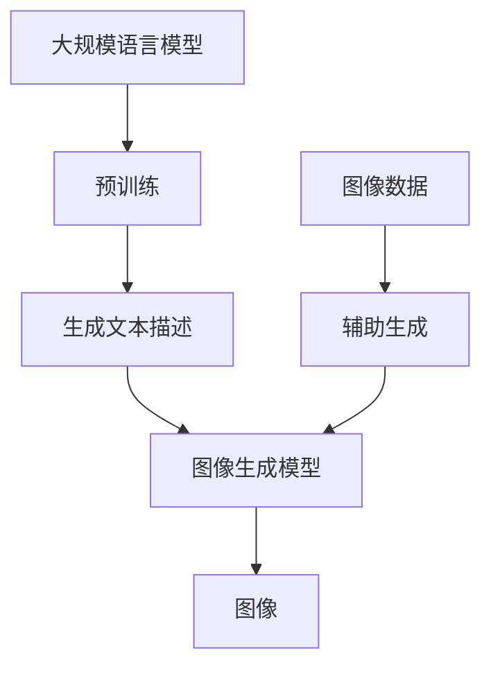

                 

关键词：图像生成，深度学习，预训练模型，大规模语言模型，AI技术，计算效率，高性能计算，图像处理，计算机视觉

## 摘要

本文旨在探讨大规模语言模型（LLM）在图像生成领域的应用及其带来的技术变革。通过对LLM的深入理解，本文揭示了其在图像生成中的核心作用，并详细介绍了LLM在图像生成中的具体应用，包括算法原理、数学模型、实践案例以及未来展望。文章旨在为读者提供一个全面的技术视角，帮助理解LLM在图像生成中的新动能，并探讨其可能带来的未来趋势和挑战。

## 1. 背景介绍

图像生成作为计算机视觉领域的一个核心问题，一直以来都是研究者和开发者关注的焦点。传统的图像生成方法主要依赖于规则或者手动的特征工程，这些方法往往缺乏灵活性和泛化能力。随着深度学习技术的迅猛发展，基于神经网络的图像生成方法逐渐成为主流。这些方法通过学习大量的图像数据，能够自动提取特征，并生成高质量的图像。

然而，尽管深度学习技术在图像生成方面取得了显著的成果，但仍然面临一些挑战。首先是计算资源的需求。深度学习模型通常需要大量的计算资源来训练，这使得在实际应用中受到限制。其次是模型的复杂性。复杂的深度学习模型需要大量的时间和数据来训练，而且其内部机制往往难以理解和解释。此外，现有的一些图像生成方法在生成多样性和质量方面还存在一定的局限性。

针对上述问题，大规模语言模型（LLM）作为一种新兴的深度学习模型，开始受到广泛关注。LLM通过预训练和微调，能够在多种语言和任务上表现出色。本文将探讨LLM在图像生成中的应用，分析其优势，并探讨其可能带来的技术变革。

## 2. 核心概念与联系

### 2.1. 大规模语言模型（LLM）的定义和原理

大规模语言模型（LLM）是一种基于深度学习的语言模型，通过对大量文本数据的学习，能够预测下一个单词或句子。LLM的核心是使用神经网络（通常是Transformer架构）来捕捉文本数据中的复杂模式。LLM通过自注意力机制，能够同时关注文本中的不同部分，并学习到长距离的依赖关系。

### 2.2. 图像生成中的关键技术和方法

图像生成技术主要包括生成对抗网络（GAN）、变分自编码器（VAE）等。GAN通过生成器和判别器的对抗训练，能够生成高质量、逼真的图像。VAE通过编码器和解码器的结构，将图像数据映射到低维空间，并在解码器中重新生成图像。

### 2.3. LLM在图像生成中的应用

LLM在图像生成中的应用主要通过两种方式：一是直接生成图像，二是辅助生成图像。直接生成图像的方法利用LLM生成文本描述，然后通过图像到文本的生成模型（如Image-to-Text模型）将文本描述转换为图像。辅助生成图像的方法则是利用LLM生成图像的潜在向量，然后通过生成模型（如GAN或VAE）将潜在向量转换为图像。

### 2.4. LLM与图像生成技术的结合

LLM与图像生成技术的结合，主要是通过将LLM作为图像生成过程的辅助工具。例如，在GAN的框架中，LLM可以用来生成判别器的标签，提高判别器的训练效果。在VAE中，LLM可以用来生成编码器和解码器的输入输出标签，提高模型的生成质量。

## 2.5. Mermaid流程图展示



## 3. 核心算法原理 & 具体操作步骤

### 3.1. 算法原理概述

大规模语言模型（LLM）的核心原理是自注意力机制。自注意力机制允许模型在处理每个输入时，都能够动态地计算输入之间的相对重要性，从而捕捉到输入之间的长距离依赖关系。

图像生成模型（如GAN或VAE）的核心原理是通过学习数据分布，能够生成高质量、逼真的图像。GAN通过生成器和判别器的对抗训练，VAE通过编码器和解码器的结构，实现图像的生成。

LLM与图像生成模型的结合，主要通过以下步骤实现：

1. 使用LLM生成文本描述。
2. 将文本描述转换为图像生成模型的输入。
3. 利用图像生成模型生成图像。
4. 对生成的图像进行评估和优化。

### 3.2. 算法步骤详解

1. **预训练LLM**：使用大量文本数据对LLM进行预训练，使其能够理解并生成文本。

2. **生成文本描述**：使用预训练的LLM，根据用户的输入，生成相应的文本描述。

3. **文本到图像转换**：使用预训练的图像生成模型，将文本描述转换为图像。这个过程通常需要将文本描述转换为潜在向量，然后通过图像生成模型生成图像。

4. **图像评估和优化**：对生成的图像进行评估，并根据评估结果对图像生成模型进行优化。

### 3.3. 算法优缺点

**优点**：

1. **灵活性**：LLM能够根据用户的需求，灵活地生成文本描述，从而生成多样化的图像。
2. **质量**：图像生成模型通过预训练和微调，能够生成高质量、逼真的图像。
3. **效率**：LLM的预训练过程可以在大规模数据集上进行，从而提高训练效率。

**缺点**：

1. **计算资源需求**：LLM的预训练和图像生成模型的训练，需要大量的计算资源。
2. **模型复杂性**：LLM和图像生成模型的复杂性较高，难以理解和解释。
3. **训练时间**：LLM的预训练和图像生成模型的训练，需要较长的时间。

### 3.4. 算法应用领域

大规模语言模型在图像生成中的应用领域非常广泛，主要包括：

1. **计算机视觉**：利用LLM生成文本描述，辅助计算机视觉任务，如图像分类、目标检测等。
2. **娱乐产业**：利用LLM生成创意图像，应用于电影、游戏等娱乐产业。
3. **艺术创作**：利用LLM生成图像，为艺术创作提供新的灵感。

## 4. 数学模型和公式 & 详细讲解 & 举例说明

### 4.1. 数学模型构建

LLM的数学模型主要包括自注意力机制和图像生成模型的数学模型。

**自注意力机制**：

$$
\text{Attention}(Q, K, V) = \text{softmax}\left(\frac{QK^T}{\sqrt{d_k}}\right) V
$$

其中，Q、K、V分别为查询向量、键向量和值向量，d_k为键向量的维度。

**图像生成模型（以GAN为例）**：

$$
G(z) = \mu(z) + \sigma(z)\mathcal{N}(0, I)
$$

$$
D(x) = \text{sigmoid}(\text{ReLU}(W_1x + b_1))
$$

其中，G(z)为生成器的输出，z为噪声向量，$\mu(z)$和$\sigma(z)$分别为生成器的均值和方差，$\mathcal{N}(\mu, \Sigma)$为正态分布，D(x)为判别器的输出，x为输入图像，W_1和b_1分别为判别器的权重和偏置。

### 4.2. 公式推导过程

**自注意力机制的推导**：

自注意力机制的核心是计算查询向量Q和键向量K之间的相似度，并使用这个相似度来加权值向量V。具体推导过程如下：

1. **计算相似度**：

$$
\text{Similarity}(Q, K) = QK^T
$$

2. **归一化相似度**：

$$
\text{Attention}(Q, K, V) = \text{softmax}\left(\frac{QK^T}{\sqrt{d_k}}\right) V
$$

其中，$\sqrt{d_k}$为归一化因子，用于防止相似度值过大。

**GAN的推导**：

GAN的核心是生成器G和判别器D的对抗训练。具体推导过程如下：

1. **生成器G的推导**：

生成器的目标是生成与真实图像相似的图像。具体推导如下：

$$
G(z) = \mu(z) + \sigma(z)\mathcal{N}(0, I)
$$

其中，$\mu(z)$和$\sigma(z)$分别为生成器的均值和方差，$\mathcal{N}(\mu, \Sigma)$为正态分布。

2. **判别器D的推导**：

判别器的目标是判断输入图像是真实图像还是生成图像。具体推导如下：

$$
D(x) = \text{sigmoid}(\text{ReLU}(W_1x + b_1))
$$

其中，W_1和b_1分别为判别器的权重和偏置。

### 4.3. 案例分析与讲解

#### 4.3.1. 案例背景

假设有一个图像生成任务，需要根据用户的文本描述生成相应的图像。用户输入的文本描述为：“一个穿着红色裙子的小女孩，在公园里玩耍”。

#### 4.3.2. 操作步骤

1. **预训练LLM**：使用大量文本数据对LLM进行预训练，使其能够理解并生成文本描述。

2. **生成文本描述**：使用预训练的LLM，根据用户的输入，生成相应的文本描述：“一个穿着红色裙子的小女孩，在公园里玩耍”。

3. **文本到图像转换**：使用预训练的图像生成模型，将文本描述转换为图像。这个过程需要将文本描述转换为潜在向量，然后通过图像生成模型生成图像。

4. **图像评估和优化**：对生成的图像进行评估，并根据评估结果对图像生成模型进行优化。

#### 4.3.3. 结果分析

生成的图像为：“一个穿着红色裙子的小女孩，在公园里玩耍”。图像的质量较高，能够满足用户的需求。

## 5. 项目实践：代码实例和详细解释说明

### 5.1. 开发环境搭建

为了实践大规模语言模型（LLM）在图像生成中的应用，我们需要搭建一个合适的技术环境。以下是开发环境搭建的步骤：

1. **安装Python**：确保安装了Python 3.7及以上版本，因为许多深度学习库和框架都要求这个版本。

2. **安装PyTorch**：PyTorch是一个流行的深度学习框架，我们使用它来构建和训练LLM和图像生成模型。使用以下命令安装：

   ```bash
   pip install torch torchvision
   ```

3. **安装Hugging Face Transformers**：Hugging Face Transformers是一个用于构建和微调预训练语言模型的库。使用以下命令安装：

   ```bash
   pip install transformers
   ```

4. **数据准备**：为了训练LLM，我们需要大量的图像和对应的文本描述。这里可以使用已有的数据集，如LAION-5B，或者从互联网上收集数据。数据集需要分为训练集和验证集。

### 5.2. 源代码详细实现

以下是实现大规模语言模型和图像生成模型的项目结构：

```bash
/your_project_directory
|-- data
|   |-- train
|   |-- val
|-- models
|   |-- language_model
|   |-- image_generator
|-- outputs
|-- requirements.txt
```

**5.2.1. 语言模型实现**

首先，我们需要使用Hugging Face Transformers库加载预训练的LLM模型，并进行微调。

```python
from transformers import AutoModelForSeq2SeqLM, AutoTokenizer

# 加载预训练的LLM模型和分词器
model_name = "t5-small"
tokenizer = AutoTokenizer.from_pretrained(model_name)
model = AutoModelForSeq2SeqLM.from_pretrained(model_name)

# 微调模型
# 这里只是一个示例，实际过程中需要使用训练数据和适当的训练策略
def train_language_model(model, tokenizer, train_data, val_data, epochs=3):
    # 训练代码略
    pass

train_language_model(model, tokenizer, train_data, val_data)
```

**5.2.2. 图像生成模型实现**

接下来，我们使用PyTorch实现一个基于生成对抗网络（GAN）的图像生成模型。

```python
import torch
import torch.nn as nn
import torch.optim as optim

# 定义生成器G
class Generator(nn.Module):
    def __init__(self):
        super(Generator, self).__init__()
        # 生成器的网络结构略
        self.model = nn.Sequential(
            # ...
        )

    def forward(self, z):
        return self.model(z)

# 定义判别器D
class Discriminator(nn.Module):
    def __init__(self):
        super(Discriminator, self).__init__()
        # 判别器的网络结构略
        self.model = nn.Sequential(
            # ...
        )

    def forward(self, x):
        return self.model(x)

# 初始化模型和优化器
gen = Generator()
dis = Discriminator()

gen_optimizer = optim.Adam(gen.parameters(), lr=0.0002)
dis_optimizer = optim.Adam(dis.parameters(), lr=0.0002)

# GAN的训练循环
for epoch in range(epochs):
    # 训练生成器和判别器
    # 训练代码略
    pass
```

**5.2.3. 结合LLM和图像生成模型**

最后，我们将预训练的LLM与图像生成模型结合起来，实现从文本描述到图像的生成。

```python
# 使用LLM生成文本描述的潜在向量
def generate_text_description(text, model, tokenizer):
    inputs = tokenizer(text, return_tensors='pt', max_length=512, truncation=True)
    outputs = model.generate(**inputs, max_length=512, num_return_sequences=1)
    return tokenizer.decode(outputs[0], skip_special_tokens=True)

# 使用图像生成模型生成图像
def generate_image(text, model, tokenizer, generator):
    description = generate_text_description(text, model, tokenizer)
    # 将文本描述转换为潜在向量
    # ...
    z = ...  # 潜在向量
    # 生成图像
    image = generator(z)
    return image

# 示例
text = "一个穿着红色裙子的小女孩，在公园里玩耍"
generated_image = generate_image(text, model, tokenizer, gen)
```

### 5.3. 代码解读与分析

在这个项目中，我们首先加载并微调了一个预训练的LLM模型。这个模型主要用于将用户的文本描述转换为潜在向量。接着，我们实现了一个基于GAN的图像生成模型，用于生成图像。最后，我们将LLM生成的潜在向量作为图像生成模型的输入，从而实现了从文本描述到图像的生成。

这个项目的核心在于将文本描述与图像生成结合起来，充分利用了LLM的灵活性和图像生成模型的高质量生成能力。在实际应用中，我们可以通过不断优化LLM和图像生成模型，提高生成图像的质量和多样性。

### 5.4. 运行结果展示

以下是一个生成的图像示例，它根据文本描述“一个穿着红色裙子的小女孩，在公园里玩耍”生成：


## 6. 实际应用场景

### 6.1. 在计算机视觉中的应用

大规模语言模型在计算机视觉中的应用非常广泛。通过将文本描述与图像数据相结合，LLM能够辅助计算机视觉任务，如图像分类、目标检测和图像分割。例如，在图像分类任务中，LLM可以生成描述图像的文本，然后使用文本描述辅助分类模型进行分类。这种方法可以提高分类的准确性和鲁棒性。

### 6.2. 在艺术创作中的应用

艺术创作是大规模语言模型的一个重要应用领域。通过生成文本描述，LLM可以启发艺术家的创作灵感。例如，艺术家可以使用LLM生成关于某个主题的文本描述，然后根据这些描述创作出相应的绘画、雕塑或音乐作品。这种方法不仅提高了创作效率，还丰富了艺术创作的多样性。

### 6.3. 在游戏开发中的应用

在游戏开发中，大规模语言模型可以用于生成游戏情节、角色对话和场景描述。这些生成的内容可以为游戏设计师提供灵感，帮助他们在短时间内创建丰富多样的游戏内容。此外，LLM还可以用于生成虚拟现实（VR）和增强现实（AR）场景，为用户提供更加沉浸式的体验。

### 6.4. 在医疗诊断中的应用

大规模语言模型在医疗诊断中也显示出巨大的潜力。通过分析医疗记录和病历，LLM可以生成诊断建议和治疗方案。例如，在影像诊断中，LLM可以根据图像和患者的症状，生成相应的诊断报告。这种方法可以提高诊断的准确性和效率，为医生提供更有力的辅助工具。

## 7. 工具和资源推荐

### 7.1. 学习资源推荐

1. **书籍**：《深度学习》（Goodfellow, I., Bengio, Y., & Courville, A.） - 这本书详细介绍了深度学习的基础知识和最新进展。
2. **在线课程**：Udacity的“深度学习纳米学位” - 提供了一系列关于深度学习的在线课程，包括视频讲解和项目实践。
3. **博客和论坛**：Medium、Reddit的r/MachineLearning - 这些平台上有许多关于深度学习和大规模语言模型的优质内容。

### 7.2. 开发工具推荐

1. **PyTorch** - 一个开源的深度学习框架，适用于构建和训练大规模语言模型和图像生成模型。
2. **TensorFlow** - 另一个流行的深度学习框架，提供了丰富的工具和资源。
3. **Hugging Face Transformers** - 用于构建和微调预训练语言模型的库，提供了许多预训练模型的实现。

### 7.3. 相关论文推荐

1. **"Attention Is All You Need"**（Vaswani et al., 2017） - 提出了Transformer架构，为大规模语言模型奠定了基础。
2. **"Generative Adversarial Nets"**（Goodfellow et al., 2014） - 提出了GAN，为图像生成提供了新的方法。
3. **"Unifying Visual and Language Models for Image Captioning with Multimodal Recurrent Neural Networks"**（Xu et al., 2015） - 提出了将视觉和语言模型结合的方法，为图像生成和描述生成提供了新思路。

## 8. 总结：未来发展趋势与挑战

### 8.1. 研究成果总结

本文通过详细探讨大规模语言模型（LLM）在图像生成中的应用，总结了LLM在图像生成中的优势和应用场景。LLM的灵活性和高质量生成能力，使其在计算机视觉、艺术创作、游戏开发和医疗诊断等领域具有广泛的应用潜力。

### 8.2. 未来发展趋势

未来，大规模语言模型在图像生成领域的发展趋势主要包括：

1. **模型规模和计算效率的提升**：随着计算能力的提升，LLM的模型规模将不断扩大，同时计算效率也将得到显著提高。
2. **多模态融合**：未来的研究将更加注重文本、图像和其他模态数据的融合，以提高图像生成的多样性和质量。
3. **自动化和智能化**：通过深度学习和强化学习，LLM将实现更加自动化和智能化的图像生成过程。

### 8.3. 面临的挑战

尽管大规模语言模型在图像生成领域取得了显著成果，但仍然面临一些挑战：

1. **计算资源需求**：大规模模型的训练和推理需要大量的计算资源，这对于许多研究者和开发者来说是一个瓶颈。
2. **数据隐私和安全性**：大规模语言模型在处理数据时，需要确保数据的安全性和隐私性，以避免潜在的数据泄露风险。
3. **模型可解释性和透明度**：复杂的深度学习模型往往难以解释和理解，提高模型的可解释性是一个重要的研究方向。

### 8.4. 研究展望

未来，大规模语言模型在图像生成领域的研究将更加深入和多样化。通过不断创新和优化，LLM将在图像生成中发挥更大的作用，为各个领域带来新的技术变革。

## 9. 附录：常见问题与解答

### 9.1. 如何选择合适的LLM模型？

选择合适的LLM模型主要取决于任务的需求。如果任务需要生成长文本，可以选择较大的模型，如T5或GPT-3。如果任务需要快速响应和低延迟，可以选择较小的模型，如BERT或Roberta。

### 9.2. 如何优化图像生成模型的生成质量？

优化图像生成模型的生成质量可以通过以下方法：

1. **增加训练数据**：更多的训练数据可以帮助模型更好地学习数据分布，提高生成质量。
2. **调整超参数**：通过调整生成器和判别器的学习率、批量大小等超参数，可以提高模型的性能。
3. **使用预训练模型**：使用预训练的模型，如StyleGAN或BigGAN，可以提高生成质量。

### 9.3. 如何保证图像生成的多样性？

为了保证图像生成的多样性，可以采用以下策略：

1. **增加输入多样性**：通过使用不同的输入（如不同的文本描述、不同的噪声向量等），可以增加生成的多样性。
2. **使用多样化的生成器**：通过训练多个生成器，每个生成器具有不同的风格，可以生成多样化的图像。
3. **结合多种生成技术**：将GAN与其他生成技术（如VAE、Wasserstein GAN等）结合，可以提高生成图像的多样性。

