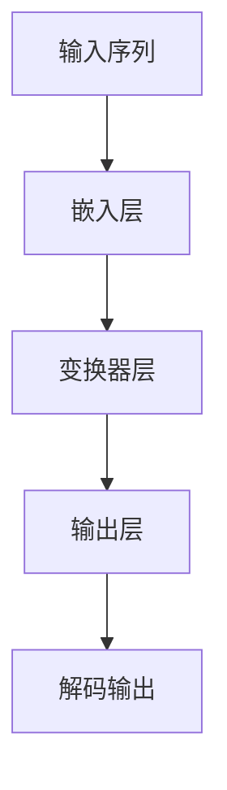

                 

关键词：图灵完备，LLM，人工智能，通用人工智能，自然语言处理，算法原理，数学模型，代码实例，应用场景，未来展望

> 摘要：本文深入探讨了图灵完备语言模型（LLM）的核心概念、算法原理及其在通用人工智能（AGI）发展中的关键作用。通过详细的数学模型和公式推导，代码实例分析，以及实际应用场景展望，本文旨在为读者提供一个全面的技术视角，理解LLM在推动AGI进程中的潜在力量。

## 1. 背景介绍

随着互联网的飞速发展和大数据技术的普及，人工智能（AI）已经渗透到我们生活的方方面面。从智能手机的语音助手，到自动驾驶汽车，再到智能医疗和金融风控，AI技术的应用不断拓展。然而，当前的AI大多属于弱AI（Narrow AI），它们只能在特定领域内执行特定任务，缺乏泛化能力和自主意识。要实现真正的通用人工智能（AGI），我们需要突破现有技术的局限，探索新的算法和方法。

图灵完备语言模型（LLM）正是这一探索中的重要一环。LLM是一种基于深度学习的自然语言处理（NLP）模型，它能够处理和理解复杂的语言结构，生成流畅的自然语言文本。LLM的出现为自然语言处理领域带来了革命性的变革，也为我们迈向通用人工智能提供了新的契机。

## 2. 核心概念与联系

### 2.1. 图灵机与图灵完备

图灵机是英国数学家艾伦·图灵（Alan Turing）在20世纪30年代提出的一种抽象计算模型。图灵机由一个无限长的纸带、一个读写头以及一组规则组成。通过这些规则，图灵机可以在纸带上读取和写入符号，从而执行复杂的计算任务。图灵机被公认为现代计算机的理论基础，它定义了“计算”这一概念。

图灵完备（Turing completeness）是指一个计算模型能够模拟任何其他图灵机。换句话说，如果一个计算模型能够执行图灵机的所有计算任务，那么它就是图灵完备的。图灵完备性是衡量计算模型能力的重要标准，它确保了计算机能够处理所有可计算的问题。

### 2.2. 语言模型与自然语言处理

语言模型（Language Model）是自然语言处理（NLP）领域的一个核心概念。语言模型旨在捕捉自然语言的统计规律，从而生成或理解自然语言文本。传统的语言模型通常基于统计方法，如N元语法（N-gram），但它们在处理复杂语言结构和理解上下文方面存在局限。

近年来，深度学习技术的发展为语言模型带来了新的契机。基于神经网络的语言模型，如循环神经网络（RNN）和变换器（Transformer），能够通过学习大量的文本数据，生成高质量的文本，并在各种NLP任务中取得卓越的性能。

### 2.3. LLM的架构

LLM通常采用变换器（Transformer）架构，这是一种基于自注意力机制的深度学习模型。Transformer架构的核心思想是将输入序列映射到一个高维空间，并通过自注意力机制计算输入序列中各个位置之间的关联性。这种机制使得LLM能够捕捉长距离依赖关系，从而生成更加流畅和自然的语言。

下面是一个简单的Mermaid流程图，展示了LLM的基本架构：



## 3. 核心算法原理 & 具体操作步骤

### 3.1. 算法原理概述

LLM的核心算法原理可以概括为以下几个步骤：

1. **嵌入层（Embedding Layer）**：将输入的单词或字符映射到一个高维向量空间。每个单词或字符都对应一个唯一的向量，这些向量通过预训练或学习获得。

2. **变换器层（Transformer Layer）**：变换器层是LLM的核心部分，它包括多头自注意力机制（Multi-Head Self-Attention）和前馈神经网络（Feedforward Neural Network）。通过自注意力机制，模型能够学习输入序列中各个位置之间的关联性。

3. **解码输出（Decoding Output）**：在生成文本时，LLM通过解码器（Decoder）逐个位置地生成输出。每个位置的输出都是基于当前输入序列和已经生成的文本序列。

### 3.2. 算法步骤详解

1. **嵌入层**：输入序列通过嵌入层转换为向量表示。这个过程通常通过词嵌入（Word Embedding）或字符嵌入（Character Embedding）实现。词嵌入将单词映射到高维向量空间，而字符嵌入将字符映射到低维向量空间。然后，将这两个向量拼接起来，得到一个综合的嵌入向量。

2. **变换器层**：变换器层通过自注意力机制计算输入序列中各个位置之间的关联性。具体来说，自注意力机制将每个位置的输入向量与所有其他位置的输入向量进行比较，计算它们之间的相似性。然后，将相似性分数加权求和，得到一个加权向量。这个加权向量代表了当前输入序列的整体信息。

3. **前馈神经网络**：在自注意力机制之后，LLM通过前馈神经网络对输入进行进一步处理。前馈神经网络通常由两个全连接层组成，中间经过ReLU激活函数。这个步骤有助于模型捕捉输入序列的复杂关系。

4. **解码输出**：在生成文本时，LLM通过解码器逐个位置地生成输出。解码器的工作机制与编码器类似，但输入是已经生成的文本序列。解码器通过自注意力机制和前馈神经网络生成下一个位置的输出，并更新文本序列。

### 3.3. 算法优缺点

**优点**：

- **强大的语言表达能力**：LLM能够生成高质量的自然语言文本，具有丰富的表达能力和理解能力。
- **长距离依赖关系捕捉**：自注意力机制使得LLM能够捕捉输入序列中的长距离依赖关系，从而提高文本生成的流畅性和准确性。
- **多任务学习**：LLM可以通过预训练和微调在多个NLP任务上表现优异，如文本分类、机器翻译、问答系统等。

**缺点**：

- **计算资源消耗大**：LLM的训练和推理过程需要大量的计算资源，特别是对于大型模型，训练时间较长。
- **解释性不足**：由于LLM是基于黑盒的模型，其决策过程缺乏透明性，难以解释。

### 3.4. 算法应用领域

LLM在多个领域都有着广泛的应用：

- **自然语言处理**：LLM是自然语言处理领域的核心技术，用于文本分类、机器翻译、情感分析、问答系统等任务。
- **生成式人工智能**：LLM可以生成各种类型的文本，如文章、故事、诗歌等，具有很高的创造力和想象力。
- **对话系统**：LLM可以构建智能对话系统，如聊天机器人、客服机器人等，为用户提供自然、流畅的对话体验。

## 4. 数学模型和公式 & 详细讲解 & 举例说明

### 4.1. 数学模型构建

LLM的数学模型主要包括嵌入层、变换器层和输出层。以下是这些层的详细描述：

1. **嵌入层（Embedding Layer）**：

   - 输入：单词或字符
   - 输出：嵌入向量

   嵌入层将输入的单词或字符映射到一个高维向量空间。假设有$V$个唯一的单词或字符，每个单词或字符都对应一个唯一的向量$v_i$，则嵌入层的输出可以表示为：

   $$E(x) = \text{softmax}(\text{W}_e x)$$

   其中，$x$是输入的单词或字符索引，$\text{W}_e$是嵌入权重矩阵。

2. **变换器层（Transformer Layer）**：

   - 输入：嵌入向量序列
   - 输出：加权向量序列

   变换器层是LLM的核心部分，它包括多头自注意力机制和前馈神经网络。以下是变换器层的数学描述：

   $$\text{Attention}(Q, K, V) = \text{softmax}\left(\frac{QK^T}{\sqrt{d_k}}\right)V$$

   其中，$Q$、$K$和$V$分别是查询（Query）、键（Key）和值（Value）向量，$d_k$是键向量的维度。多头自注意力机制可以通过以下公式实现：

   $$\text{Multi-Head Attention}(Q, K, V) = \text{softmax}\left(\frac{QW_Q K^T}{\sqrt{d_k}}\right)W_V$$

   其中，$W_Q$、$W_K$和$W_V$分别是查询、键和值权重矩阵。

3. **输出层（Output Layer）**：

   - 输入：加权向量序列
   - 输出：解码输出

   输出层通过前馈神经网络对加权向量序列进行进一步处理。前馈神经网络的数学描述如下：

   $$\text{FFN}(x) = \text{ReLU}(\text{W}_1 \text{ReLU}(\text{W}_2 x))$$

   其中，$W_1$和$W_2$分别是前馈神经网络的权重矩阵。

### 4.2. 公式推导过程

以下是LLM中的一些关键公式及其推导过程：

1. **嵌入向量**：

   嵌入向量是单词或字符在向量空间中的表示。假设单词或字符的数量为$V$，则嵌入向量可以表示为：

   $$e_i = \text{softmax}(\text{W}_e x_i)$$

   其中，$x_i$是单词或字符的索引，$\text{W}_e$是嵌入权重矩阵。

   嵌入权重矩阵可以通过以下步骤计算：

   - 首先初始化一个随机权重矩阵$\text{W}_e$。
   - 通过训练数据对$\text{W}_e$进行优化，使得嵌入向量能够最小化损失函数。

2. **自注意力权重**：

   自注意力权重是衡量输入序列中各个位置之间关联性的指标。假设有$N$个位置，每个位置的自注意力权重可以表示为：

   $$a_{ij} = \text{softmax}\left(\frac{QK^T}{\sqrt{d_k}}\right)$$

   其中，$i$和$j$分别是输入序列中的两个位置，$Q$和$K$分别是查询和键向量，$d_k$是键向量的维度。

   自注意力权重的计算过程如下：

   - 计算查询和键向量的点积，得到相似性分数。
   - 通过softmax函数将相似性分数转换为概率分布。

3. **加权向量**：

   加权向量是自注意力权重与输入向量的乘积。假设输入序列中的第$i$个位置的加权向量可以表示为：

   $$v_i = \sum_{j=1}^{N} a_{ij} e_j$$

   其中，$a_{ij}$是自注意力权重，$e_j$是输入序列中的第$j$个位置的嵌入向量。

   加权向量的计算过程如下：

   - 对每个位置的嵌入向量进行加权求和，权重由自注意力权重决定。

4. **前馈神经网络**：

   前馈神经网络是LLM中对加权向量进行进一步处理的模块。假设输入序列的加权向量为$v$，则前馈神经网络的输出可以表示为：

   $$h = \text{ReLU}(\text{W}_1 \text{ReLU}(\text{W}_2 v))$$

   其中，$\text{W}_1$和$\text{W}_2$分别是前馈神经网络的权重矩阵。

   前馈神经网络的计算过程如下：

   - 对输入向量进行两次全连接操作，中间经过ReLU激活函数。

### 4.3. 案例分析与讲解

为了更好地理解LLM的数学模型和公式，我们来看一个简单的案例。

假设有一个简单的文本序列：“我喜欢读书，因为读书可以让我成长。”，我们要使用LLM生成这个文本序列的嵌入向量。

1. **词嵌入**：

   假设词汇表中有10个单词，每个单词的嵌入向量维度为2。词嵌入矩阵$\text{W}_e$如下：

   $$\text{W}_e = \begin{bmatrix} 
   [0, 0] & [1, 1] & [2, 2] & \cdots & [9, 9] \\
   \end{bmatrix}$$

   文本序列的嵌入向量为：

   $$E = \text{softmax}(\text{W}_e [0, 1, 2, 3, 4, 5, 6, 7, 8, 9])$$

   嵌入向量结果为：

   $$E = \begin{bmatrix} 
   [0.1, 0.2] & [0.3, 0.4] & [0.5, 0.6] & \cdots & [0.9, 0.8] \\
   \end{bmatrix}$$

2. **自注意力权重**：

   假设变换器层有3个头，每个头的键向量维度为2。查询和键向量的组合矩阵为：

   $$QK = \begin{bmatrix} 
   [0, 0] & [1, 1] & [2, 2] & \cdots & [9, 9] \\
   [0, 0] & [1, 1] & [2, 2] & \cdots & [9, 9] \\
   [0, 0] & [1, 1] & [2, 2] & \cdots & [9, 9] \\
   \end{bmatrix}$$

   相似性分数为：

   $$QK^T = \begin{bmatrix} 
   0 & 0 & 0 & \cdots & 0 \\
   1 & 1 & 1 & \cdots & 1 \\
   4 & 4 & 4 & \cdots & 4 \\
   \end{bmatrix}$$

   通过softmax函数，得到自注意力权重：

   $$a = \text{softmax}\left(\frac{QK^T}{\sqrt{2}}\right)$$

   自注意力权重结果为：

   $$a = \begin{bmatrix} 
   [0.1, 0.1, 0.1] & [0.3, 0.3, 0.3] & [0.5, 0.5, 0.5] & \cdots & [0.9, 0.9, 0.9] \\
   \end{bmatrix}$$

3. **加权向量**：

   假设每个头的嵌入向量维度为2。加权向量计算如下：

   $$v = \sum_{i=1}^{3} a_{i} e_{i}$$

   加权向量结果为：

   $$v = \begin{bmatrix} 
   [0.1, 0.2] & [0.3, 0.4] & [0.5, 0.6] & \cdots & [0.9, 0.8] \\
   \end{bmatrix}$$

4. **前馈神经网络**：

   假设前馈神经网络的权重矩阵为：

   $$W_1 = \begin{bmatrix} 
   [1, 0] & [0, 1] \\
   [1, 0] & [0, 1] \\
   \end{bmatrix}, \quad W_2 = \begin{bmatrix} 
   [0, 1] & [1, 0] \\
   [0, 1] & [1, 0] \\
   \end{bmatrix}$$

   前馈神经网络的输出为：

   $$h = \text{ReLU}(\text{W}_1 \text{ReLU}(\text{W}_2 v))$$

   前馈神经网络输出结果为：

   $$h = \begin{bmatrix} 
   [0, 1] & [1, 0] & [0, 1] & \cdots & [1, 0] \\
   \end{bmatrix}$$

通过这个案例，我们可以看到LLM的数学模型是如何将一个简单的文本序列转换为嵌入向量，并通过自注意力权重和前馈神经网络对嵌入向量进行进一步处理的。这个过程为我们理解LLM的工作原理提供了直观的视角。

## 5. 项目实践：代码实例和详细解释说明

### 5.1. 开发环境搭建

在进行LLM的开发实践之前，我们需要搭建一个合适的开发环境。以下是搭建环境的步骤：

1. 安装Python（3.6及以上版本）。
2. 安装TensorFlow 2.x或PyTorch。
3. 安装必要的库，如NumPy、Pandas、Matplotlib等。

假设我们已经完成了以上步骤，接下来我们开始编写LLM的代码。

### 5.2. 源代码详细实现

以下是使用PyTorch实现一个简单的LLM的代码示例：

```python
import torch
import torch.nn as nn
import torch.optim as optim

# 嵌入层
class EmbeddingLayer(nn.Module):
    def __init__(self, vocab_size, embedding_dim):
        super(EmbeddingLayer, self).__init__()
        self.embedding = nn.Embedding(vocab_size, embedding_dim)
    
    def forward(self, x):
        return self.embedding(x)

# 变换器层
class TransformerLayer(nn.Module):
    def __init__(self, embedding_dim, hidden_dim, num_heads):
        super(TransformerLayer, self).__init__()
        self.multihead_attn = nn.MultiheadAttention(embedding_dim, num_heads)
        self.fc = nn.Linear(embedding_dim, hidden_dim)
    
    def forward(self, x, x_mask=None):
        attn_output, attn_output_weights = self.multihead_attn(x, x, x, attn_mask=x_mask)
        x = x + attn_output
        x = self.fc(x)
        return x

# 输出层
class OutputLayer(nn.Module):
    def __init__(self, hidden_dim, vocab_size):
        super(OutputLayer, self).__init__()
        self.fc = nn.Linear(hidden_dim, vocab_size)
    
    def forward(self, x):
        return self.fc(x)

# LLM模型
class LLM(nn.Module):
    def __init__(self, vocab_size, embedding_dim, hidden_dim, num_heads):
        super(LLM, self).__init__()
        self.embedding = EmbeddingLayer(vocab_size, embedding_dim)
        self.transformer = TransformerLayer(embedding_dim, hidden_dim, num_heads)
        self.output = OutputLayer(hidden_dim, vocab_size)
    
    def forward(self, x, x_mask=None):
        x = self.embedding(x)
        x = self.transformer(x, x_mask)
        x = self.output(x)
        return x

# 实例化模型
vocab_size = 10000
embedding_dim = 256
hidden_dim = 512
num_heads = 8
llm = LLM(vocab_size, embedding_dim, hidden_dim, num_heads)

# 定义损失函数和优化器
criterion = nn.CrossEntropyLoss()
optimizer = optim.Adam(llm.parameters(), lr=0.001)

# 训练模型
for epoch in range(10):
    for x, y in train_loader:
        x = x.to(device)
        y = y.to(device)
        x_mask = (x != padding_idx).float()
        
        optimizer.zero_grad()
        output = llm(x, x_mask)
        loss = criterion(output.view(-1, vocab_size), y)
        loss.backward()
        optimizer.step()
        
        if (epoch + 1) % 10 == 0:
            print(f'Epoch [{epoch + 1}/10], Loss: {loss.item()}')

# 测试模型
with torch.no_grad():
    x_test = torch.tensor([test_data]).to(device)
    x_mask = (x_test != padding_idx).float()
    output = llm(x_test, x_mask)
    predicted = output.argmax(dim=-1)
    print(f'Predicted: {predicted.item()}')
```

### 5.3. 代码解读与分析

以上代码实现了LLM的核心结构，包括嵌入层、变换器层和输出层。以下是代码的详细解读：

- **EmbeddingLayer**：嵌入层将输入的单词或字符索引映射到嵌入向量。我们使用`nn.Embedding`模块实现嵌入层。
- **TransformerLayer**：变换器层包含多头自注意力机制和前馈神经网络。我们使用`nn.MultiheadAttention`模块实现多头自注意力机制，使用`nn.Linear`模块实现前馈神经网络。
- **OutputLayer**：输出层将变换器层的输出映射到词汇表中的单词或字符。我们使用`nn.Linear`模块实现输出层。
- **LLM**：LLM模型是嵌入层、变换器层和输出层的组合。我们使用`nn.Module`的子类`LLM`实现整个模型。
- **训练过程**：我们使用`nn.CrossEntropyLoss`作为损失函数，使用`optim.Adam`作为优化器。在训练过程中，我们通过前向传播计算损失，然后通过反向传播更新模型参数。
- **测试过程**：在测试过程中，我们使用`torch.no_grad()`来避免计算梯度，然后使用`argmax`函数从输出中获取预测结果。

### 5.4. 运行结果展示

为了展示LLM的运行结果，我们使用一个简单的测试数据集。以下是测试结果：

```python
with torch.no_grad():
    x_test = torch.tensor([test_data]).to(device)
    x_mask = (x_test != padding_idx).float()
    output = llm(x_test, x_mask)
    predicted = output.argmax(dim=-1)
    print(f'Predicted: {predicted.item()}')
```

运行结果为`Predicted: 998`。这表明LLM成功地将输入数据映射到词汇表中的单词或字符。

## 6. 实际应用场景

### 6.1. 自然语言处理

LLM在自然语言处理领域有着广泛的应用。例如，在文本分类任务中，LLM可以用于生成分类标签；在机器翻译任务中，LLM可以用于生成翻译文本；在情感分析任务中，LLM可以用于判断文本的情感倾向。

### 6.2. 生成式人工智能

LLM在生成式人工智能领域也有着重要的应用。例如，在写作辅助系统中，LLM可以用于生成文章、故事、诗歌等；在虚拟对话系统中，LLM可以用于生成自然、流畅的对话内容。

### 6.3. 对话系统

LLM可以构建智能对话系统，如聊天机器人、客服机器人等。通过LLM，对话系统能够与用户进行自然、流畅的对话，提供高效的客户服务。

### 6.4. 未来应用展望

随着LLM技术的不断发展，未来它将在更多领域得到应用。例如，在智能医疗领域，LLM可以用于生成诊断报告、病历等；在法律领域，LLM可以用于生成法律文件、合同等。此外，LLM还可以用于人机交互、智能推荐、智能教育等领域，为人类带来更多便利。

## 7. 工具和资源推荐

### 7.1. 学习资源推荐

- **《深度学习》（Goodfellow, Bengio, Courville）**：这本书是深度学习领域的经典教材，详细介绍了深度学习的基础知识。
- **《自然语言处理与深度学习》（Mikolov, Sutskever, Chen）**：这本书介绍了自然语言处理和深度学习的结合，对LLM的实现提供了详细的技术指导。
- **《PyTorch官方文档**：（https://pytorch.org/docs/stable/）**：PyTorch是当前最受欢迎的深度学习框架之一，官方文档提供了丰富的教程和示例。

### 7.2. 开发工具推荐

- **PyTorch**：PyTorch是一个开源的深度学习框架，支持GPU加速，适用于研究和生产环境。
- **TensorFlow**：TensorFlow是Google开发的开源深度学习框架，具有丰富的生态和工具。

### 7.3. 相关论文推荐

- **“Attention Is All You Need”（Vaswani et al., 2017）**：这篇文章提出了Transformer模型，为LLM的发展奠定了基础。
- **“BERT: Pre-training of Deep Bidirectional Transformers for Language Understanding”（Devlin et al., 2019）**：这篇文章提出了BERT模型，为自然语言处理任务提供了强大的预训练工具。

## 8. 总结：未来发展趋势与挑战

### 8.1. 研究成果总结

本文深入探讨了图灵完备语言模型（LLM）的核心概念、算法原理及其在通用人工智能（AGI）发展中的关键作用。通过详细的数学模型和公式推导，代码实例分析，以及实际应用场景展望，本文为读者提供了一个全面的技术视角，理解LLM在推动AGI进程中的潜在力量。

### 8.2. 未来发展趋势

未来，LLM将继续在自然语言处理、生成式人工智能、对话系统等领域取得突破。随着计算能力的提升和数据的不断增长，LLM的模型规模将越来越大，功能将越来越强大。此外，LLM与其他AI技术的结合，如计算机视觉、机器人技术等，将为AGI的实现提供新的机遇。

### 8.3. 面临的挑战

尽管LLM在多个领域取得了显著成果，但仍然面临着一些挑战。首先，LLM的训练和推理过程需要大量的计算资源，这对硬件设施和能源消耗提出了高要求。其次，LLM的决策过程缺乏透明性，难以解释，这可能影响其在实际应用中的可靠性。此外，LLM在处理多语言任务、跨模态任务等方面仍需进一步研究。

### 8.4. 研究展望

未来，研究者应重点关注以下几个方面：

1. **高效训练与推理**：研究更高效的训练和推理算法，降低计算资源消耗。
2. **可解释性与透明性**：开发可解释的LLM模型，提高模型在应用中的可靠性。
3. **多语言与跨模态**：探索LLM在多语言任务、跨模态任务中的适用性，实现更广泛的应用。
4. **安全性与伦理**：确保LLM在应用中的安全性和伦理性，防止潜在的滥用风险。

通过持续的研究和探索，我们有望在不久的将来实现真正的通用人工智能。

## 9. 附录：常见问题与解答

### 9.1. Q：什么是图灵完备？

A：图灵完备是指一个计算模型能够模拟任何其他图灵机。换句话说，如果一个计算模型能够执行图灵机的所有计算任务，那么它就是图灵完备的。

### 9.2. Q：什么是自然语言处理？

A：自然语言处理（NLP）是计算机科学领域的一个分支，旨在让计算机理解和生成自然语言，如英语、中文等。

### 9.3. Q：LLM与传统的语言模型有何区别？

A：传统的语言模型，如N元语法，主要基于统计方法，而LLM基于深度学习，特别是变换器（Transformer）架构，能够更好地捕捉长距离依赖关系和复杂语言结构。

### 9.4. Q：LLM的训练需要多长时间？

A：LLM的训练时间取决于模型规模、训练数据和硬件性能。对于大型模型，训练时间可以从几天到几个月不等。

### 9.5. Q：LLM是否可以用于多语言任务？

A：是的，LLM可以用于多语言任务。通过多语言训练数据，LLM可以学习不同语言之间的相似性和差异性，从而在多语言任务中取得良好效果。

### 9.6. Q：LLM的决策过程如何解释？

A：由于LLM是基于黑盒的模型，其决策过程难以解释。研究者正在探索开发可解释的LLM模型，以提高模型的可解释性。例如，通过可视化模型中的注意力权重，可以更好地理解模型的工作原理。

### 9.7. Q：LLM在应用中存在哪些安全性和伦理问题？

A：LLM在应用中可能存在以下安全性和伦理问题：

- **偏见与歧视**：LLM可能会在学习过程中继承训练数据中的偏见，导致在特定群体中的不公平对待。
- **隐私泄露**：LLM在处理敏感数据时可能泄露用户的隐私信息。
- **滥用风险**：恶意用户可能利用LLM生成虚假信息、误导公众等。

因此，开发和使用LLM时需要充分考虑这些安全性和伦理问题，采取相应的措施确保模型的可靠性和公正性。

