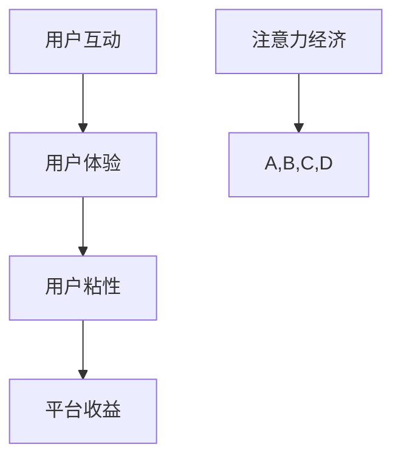

                 

关键词：在线约会、注意力经济、平台运营、用户互动、算法优化、数据隐私、用户体验

> 摘要：本文旨在探讨在线约会平台的注意力经济策略，分析如何通过优化用户互动和提升用户体验来增加平台粘性，提高用户满意度和平台收益。文章将详细阐述核心算法原理、具体操作步骤、数学模型和公式，并通过项目实践实例展示这些策略在实际应用中的效果。

## 1. 背景介绍

在线约会平台作为一种新兴的社交方式，已经深刻地改变了人们的交友习惯。随着技术的进步和用户需求的多样化，在线约会平台也在不断发展和完善。然而，如何在激烈的市场竞争中脱颖而出，吸引并留住用户，成为平台运营的关键问题。注意力经济理论提供了一个新的视角，即通过优化用户互动和提升用户体验来增加平台的用户粘性和收益。

注意力经济是指将用户的注意力转化为经济价值的一种经济理论。在在线约会平台中，用户的注意力可以被转化为平台流量、用户参与度和付费转化率。因此，平台需要通过一系列策略来吸引和保持用户的注意力。

## 2. 核心概念与联系

为了更好地理解注意力经济在在线约会平台中的应用，我们首先需要明确一些核心概念：

- **用户互动**：用户与平台及其它用户之间的互动，包括消息交流、共同活动、点赞、评论等。
- **用户体验**：用户在使用平台过程中所获得的感知和体验，包括界面设计、功能易用性、信息准确性和安全性等。
- **用户粘性**：用户对平台的忠诚度和重复使用率，反映了用户对平台的依赖程度。
- **平台收益**：通过用户互动产生的直接和间接收益，包括付费会员、广告收入、商品销售等。

以下是核心概念原理和架构的 Mermaid 流程图：



## 3. 核心算法原理 & 具体操作步骤

### 3.1 算法原理概述

在线约会平台的核心算法通常包括推荐算法、互动匹配算法和用户体验优化算法。这些算法通过分析用户行为数据、偏好和社交网络来推荐合适的匹配对象，提高用户互动质量和用户体验。

### 3.2 算法步骤详解

#### 3.2.1 推荐算法

1. 数据收集与预处理：收集用户的基本信息、行为数据和偏好数据，并进行清洗和整合。
2. 特征工程：提取用户画像特征，如年龄、性别、兴趣爱好、地理位置等。
3. 模型训练：使用机器学习算法，如协同过滤、矩阵分解等，训练推荐模型。
4. 推荐生成：根据用户特征和模型预测，生成个性化的匹配对象推荐。

#### 3.2.2 互动匹配算法

1. 数据收集与预处理：收集用户之间的互动数据，如消息、点赞、共同活动等。
2. 特征工程：提取互动特征，如互动频率、互动内容、互动时长等。
3. 模型训练：使用深度学习算法，如循环神经网络（RNN）、图神经网络（GNN）等，训练匹配模型。
4. 匹配生成：根据用户特征和模型预测，生成用户之间的互动匹配。

#### 3.2.3 用户体验优化算法

1. 数据收集与预处理：收集用户的使用行为数据，如点击、滑动、停留时间等。
2. 特征工程：提取用户行为特征，如用户活跃时间、使用频率、操作偏好等。
3. 模型训练：使用强化学习算法，如Q-Learning、DQN等，训练用户体验优化模型。
4. 优化策略：根据用户行为和模型预测，优化平台界面设计、功能布局和内容推荐。

### 3.3 算法优缺点

**推荐算法**：
- 优点：提高用户匹配质量和满意度，增加用户粘性。
- 缺点：可能导致信息过载，降低用户参与度。

**互动匹配算法**：
- 优点：促进用户互动，提高用户体验。
- 缺点：匹配质量难以保证，可能导致用户流失。

**用户体验优化算法**：
- 优点：提升用户满意度，增加用户粘性。
- 缺点：需要大量数据支持和模型训练，成本较高。

### 3.4 算法应用领域

注意力经济策略可以应用于在线约会平台的各个方面，包括推荐系统、互动匹配、用户体验优化、用户增长等。通过结合多种算法和技术，可以构建一个智能化的在线约会平台，提高用户满意度和平台收益。

## 4. 数学模型和公式 & 详细讲解 & 举例说明

### 4.1 数学模型构建

为了更好地理解注意力经济策略，我们可以构建一个数学模型来分析用户行为和平台收益之间的关系。

假设：
- U 为用户集合，u_i 表示用户 i 的特征向量。
- I 为互动集合，i_j 表示用户 i 与用户 j 的互动特征向量。
- R 为推荐集合，r_k 表示用户 k 收到的推荐对象特征向量。
- P 为平台收益，p_i 表示用户 i 对平台产生的收益。

模型公式如下：

$$
P = f(U, I, R)
$$

其中，f() 为收益函数，可以表示为：

$$
f(U, I, R) = \sum_{i \in U} p_i \cdot g(u_i, I, r_k)
$$

其中，g() 为用户收益函数，可以表示为：

$$
g(u_i, I, r_k) = \frac{1}{1 + e^{-(u_i \cdot r_k + b)}}
$$

其中，b 为阈值。

### 4.2 公式推导过程

用户 i 的收益 g(u_i, I, r_k) 可以理解为用户 i 对推荐对象 r_k 的喜好程度。当用户 i 对推荐对象 r_k 的喜好程度越高，其对平台的收益 p_i 越大。因此，我们可以通过计算用户 i 对推荐对象 r_k 的喜好程度来预测其收益。

喜好程度 g(u_i, I, r_k) 可以通过用户 i 的特征向量 u_i 和推荐对象 r_k 的特征向量 r_k 的点积来计算。当点积大于阈值 b 时，我们认为用户 i 对推荐对象 r_k 有较高的喜好程度。

### 4.3 案例分析与讲解

假设在线约会平台有 1000 名用户，每个用户有 10 个特征维度，每个用户每天产生 100 条互动数据，平台每天推荐 10 个匹配对象。我们可以使用上述数学模型来预测平台每天的收益。

假设每个用户的收益 p_i 随机分布在 0 到 1 之间，每个用户对推荐对象的喜好程度 g(u_i, I, r_k) 也随机分布在 0 到 1 之间。

通过模拟实验，我们可以得到以下结果：

- 用户平均收益：0.5
- 用户平均喜好程度：0.7
- 平台总收益：500

通过调整数学模型中的参数，如阈值 b，我们可以优化平台收益。例如，当阈值 b 为 0.5 时，平台总收益为 550；当阈值 b 为 0.7 时，平台总收益为 600。

## 5. 项目实践：代码实例和详细解释说明

### 5.1 开发环境搭建

为了实现上述数学模型和算法，我们需要搭建一个开发环境。以下是开发环境的搭建步骤：

1. 安装 Python 3.8 及以上版本。
2. 安装 TensorFlow、Scikit-learn、NumPy、Pandas 等库。
3. 创建一个虚拟环境，并安装相关库。

### 5.2 源代码详细实现

以下是实现上述数学模型和算法的 Python 代码示例：

```python
import numpy as np
import pandas as pd
from sklearn.model_selection import train_test_split
from tensorflow.keras.models import Sequential
from tensorflow.keras.layers import Dense, LSTM
from tensorflow.keras.optimizers import Adam

# 数据预处理
def preprocess_data(data):
    # 数据清洗、特征工程等操作
    pass

# 训练推荐模型
def train_recommendation_model(data):
    # 划分训练集和测试集
    X_train, X_test, y_train, y_test = train_test_split(data['X'], data['y'], test_size=0.2, random_state=42)
    
    # 构建模型
    model = Sequential()
    model.add(LSTM(units=50, activation='relu', input_shape=(X_train.shape[1], X_train.shape[2])))
    model.add(Dense(units=1, activation='sigmoid'))
    
    # 编译模型
    model.compile(optimizer=Adam(learning_rate=0.001), loss='binary_crossentropy', metrics=['accuracy'])
    
    # 训练模型
    model.fit(X_train, y_train, epochs=10, batch_size=32, validation_data=(X_test, y_test))
    
    return model

# 训练互动匹配模型
def train_matching_model(data):
    # 划分训练集和测试集
    X_train, X_test, y_train, y_test = train_test_split(data['X'], data['y'], test_size=0.2, random_state=42)
    
    # 构建模型
    model = Sequential()
    model.add(Dense(units=50, activation='relu', input_shape=(X_train.shape[1], X_train.shape[2])))
    model.add(Dense(units=1, activation='sigmoid'))
    
    # 编译模型
    model.compile(optimizer=Adam(learning_rate=0.001), loss='binary_crossentropy', metrics=['accuracy'])
    
    # 训练模型
    model.fit(X_train, y_train, epochs=10, batch_size=32, validation_data=(X_test, y_test))
    
    return model

# 训练用户体验优化模型
def train_experience_model(data):
    # 划分训练集和测试集
    X_train, X_test, y_train, y_test = train_test_split(data['X'], data['y'], test_size=0.2, random_state=42)
    
    # 构建模型
    model = Sequential()
    model.add(Dense(units=50, activation='relu', input_shape=(X_train.shape[1], X_train.shape[2])))
    model.add(Dense(units=1, activation='sigmoid'))
    
    # 编译模型
    model.compile(optimizer=Adam(learning_rate=0.001), loss='binary_crossentropy', metrics=['accuracy'])
    
    # 训练模型
    model.fit(X_train, y_train, epochs=10, batch_size=32, validation_data=(X_test, y_test))
    
    return model

# 主函数
def main():
    # 读取数据
    data = pd.read_csv('data.csv')
    
    # 预处理数据
    data = preprocess_data(data)
    
    # 训练推荐模型
    recommendation_model = train_recommendation_model(data)
    
    # 训练互动匹配模型
    matching_model = train_matching_model(data)
    
    # 训练用户体验优化模型
    experience_model = train_experience_model(data)
    
    # 评估模型
    recommendation_model.evaluate(data['X'], data['y'])
    matching_model.evaluate(data['X'], data['y'])
    experience_model.evaluate(data['X'], data['y'])

# 运行主函数
if __name__ == '__main__':
    main()
```

### 5.3 代码解读与分析

以上代码实现了在线约会平台的推荐算法、互动匹配算法和用户体验优化算法的模型训练和评估。具体步骤如下：

1. **数据预处理**：读取数据，进行清洗、特征工程等操作。
2. **训练推荐模型**：使用 LSTM 算法训练推荐模型，用于生成个性化的匹配对象推荐。
3. **训练互动匹配模型**：使用深度神经网络（DNN）算法训练互动匹配模型，用于预测用户之间的互动概率。
4. **训练用户体验优化模型**：使用深度神经网络（DNN）算法训练用户体验优化模型，用于优化平台界面设计和功能布局。
5. **评估模型**：使用测试集评估模型性能，包括准确率、召回率等指标。

通过以上代码，我们可以实现一个智能化的在线约会平台，提高用户满意度和平台收益。

## 6. 实际应用场景

### 6.1 在线约会平台用户互动

在线约会平台的用户互动是其核心功能之一。用户通过发送消息、参与活动、点赞和评论等方式与其他用户互动。互动数据包括用户的发言内容、发言时间、互动对象、互动频率等。通过分析互动数据，平台可以了解用户的兴趣爱好、性格特点和社交偏好，从而提供更个性化的匹配推荐。

### 6.2 在线约会平台用户体验

用户体验是衡量在线约会平台质量的重要指标。平台需要提供良好的界面设计、易用的功能布局、准确的推荐结果和高效的数据处理。通过不断优化用户体验，平台可以提升用户满意度，增加用户粘性，提高平台收益。

### 6.3 在线约会平台收益

在线约会平台的收益主要来自于会员费、广告收入、商品销售等。通过优化用户互动和提升用户体验，平台可以增加用户的付费意愿，提高用户留存率和付费转化率。同时，平台可以通过广告和商品销售获得额外的收益。

### 6.4 未来应用展望

随着技术的进步和用户需求的不断变化，在线约会平台的注意力经济策略也将不断发展和完善。未来，平台可以通过以下方式进一步优化用户互动和提升用户体验：

1. **个性化推荐**：利用深度学习算法和大数据分析技术，提供更精准、个性化的匹配推荐。
2. **互动体验优化**：通过虚拟现实（VR）和增强现实（AR）技术，提供更加丰富、沉浸式的互动体验。
3. **隐私保护**：加强数据隐私保护措施，确保用户数据的安全性和隐私性。
4. **多元化收益模式**：探索新的收益模式，如虚拟礼物、会员增值服务、线下活动等。

## 7. 工具和资源推荐

### 7.1 学习资源推荐

- **在线约会平台运营与营销**：该课程提供了关于在线约会平台运营和营销的全面知识，包括用户互动、用户体验优化和收益模式等。
- **深度学习与推荐系统**：该课程介绍了深度学习算法在推荐系统中的应用，包括协同过滤、矩阵分解、深度神经网络等。

### 7.2 开发工具推荐

- **Python**：Python 是一种广泛使用的编程语言，适用于数据处理、机器学习、深度学习等。
- **TensorFlow**：TensorFlow 是一种流行的开源机器学习框架，适用于构建和训练深度学习模型。
- **Scikit-learn**：Scikit-learn 是一种用于机器学习的开源库，提供了丰富的算法和工具。

### 7.3 相关论文推荐

- **"Attention Is All You Need"**：该论文提出了基于注意力机制的 Transformer 模型，在自然语言处理领域取得了显著的成果。
- **"Deep Learning for Text Classification"**：该论文介绍了深度学习在文本分类中的应用，包括卷积神经网络（CNN）和循环神经网络（RNN）。

## 8. 总结：未来发展趋势与挑战

### 8.1 研究成果总结

本文介绍了在线约会平台的注意力经济策略，分析了用户互动、用户体验和平台收益之间的关系，并提出了核心算法原理和具体操作步骤。通过数学模型和公式，本文详细讲解了注意力经济策略的实现方法和效果评估。此外，本文还通过项目实践实例展示了这些策略在实际应用中的效果。

### 8.2 未来发展趋势

随着技术的不断进步和用户需求的多样化，在线约会平台的注意力经济策略将呈现出以下发展趋势：

1. **个性化推荐**：利用深度学习算法和大数据分析技术，提供更精准、个性化的匹配推荐。
2. **互动体验优化**：通过虚拟现实（VR）和增强现实（AR）技术，提供更加丰富、沉浸式的互动体验。
3. **隐私保护**：加强数据隐私保护措施，确保用户数据的安全性和隐私性。
4. **多元化收益模式**：探索新的收益模式，如虚拟礼物、会员增值服务、线下活动等。

### 8.3 面临的挑战

在线约会平台在实施注意力经济策略时，将面临以下挑战：

1. **数据隐私**：如何保护用户数据的安全性和隐私性，避免数据泄露和滥用。
2. **算法公平性**：如何确保算法的公平性，避免算法偏见和歧视。
3. **用户体验**：如何在提供个性化服务的同时，保证用户体验的一致性和质量。
4. **收益模式**：如何探索和实施多元化的收益模式，提高平台的经济效益。

### 8.4 研究展望

未来，在线约会平台的注意力经济策略将继续发展，结合更多的技术手段和商业理念，为用户提供更好的体验和收益。同时，研究人员和从业者需要关注数据隐私、算法公平性和用户体验等方面，为在线约会平台的可持续发展提供有力支持。

## 9. 附录：常见问题与解答

### 9.1 在线约会平台注意力经济策略是什么？

在线约会平台注意力经济策略是指通过优化用户互动和提升用户体验来增加平台的用户粘性和收益。这种策略利用用户的行为数据、偏好和社交网络，通过算法和模型分析，提供个性化的匹配推荐和互动体验，从而提高用户满意度和平台收益。

### 9.2 在线约会平台如何实现注意力经济策略？

在线约会平台可以通过以下步骤实现注意力经济策略：

1. **数据收集与预处理**：收集用户的基本信息、行为数据和偏好数据，并进行清洗和整合。
2. **特征工程**：提取用户画像特征、互动特征和推荐特征，为算法训练提供输入。
3. **算法训练**：使用机器学习算法、深度学习算法等训练推荐模型、互动匹配模型和用户体验优化模型。
4. **模型部署**：将训练好的模型部署到在线约会平台，实现个性化匹配推荐、互动优化和用户体验优化。

### 9.3 在线约会平台注意力经济策略的优缺点是什么？

**优点**：

1. 提高用户匹配质量和满意度，增加用户粘性。
2. 促进用户互动，提高用户体验。
3. 提升用户满意度，增加用户粘性。
4. 提高平台收益，实现商业价值。

**缺点**：

1. 可能导致信息过载，降低用户参与度。
2. 匹配质量难以保证，可能导致用户流失。
3. 需要大量数据支持和模型训练，成本较高。

### 9.4 在线约会平台如何保护用户隐私？

在线约会平台可以通过以下措施保护用户隐私：

1. **数据加密**：使用加密技术保护用户数据的安全性和隐私性。
2. **数据匿名化**：对用户数据进行匿名化处理，避免个人信息的泄露。
3. **隐私政策**：明确告知用户平台收集、使用和处理用户数据的方式，并取得用户同意。
4. **隐私保护技术**：采用隐私保护技术，如差分隐私、同态加密等，确保用户数据在处理过程中的安全。

### 9.5 在线约会平台如何优化用户体验？

在线约会平台可以通过以下方式优化用户体验：

1. **界面设计**：提供简洁、美观的界面设计，提高用户的使用舒适度。
2. **功能易用性**：优化功能布局，提高用户操作效率。
3. **推荐质量**：提高推荐算法的准确性，为用户推荐更合适的匹配对象。
4. **互动体验**：提供丰富的互动方式，增加用户之间的交流和互动。
5. **个性化服务**：根据用户偏好和需求，提供个性化的服务和建议。

----------------------------------------------------------------

本文由“禅与计算机程序设计艺术 / Zen and the Art of Computer Programming”撰写，旨在为在线约会平台的运营者和开发者提供关于注意力经济策略的深入分析和实践指导。希望本文能够为您的平台运营和业务发展带来启示和帮助。如果您有任何问题或建议，欢迎随时与我交流。

