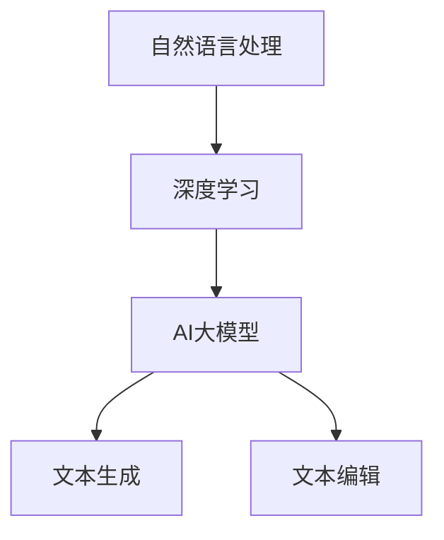

                 

关键词：AI大模型、智能写作、自然语言处理、写作工具、算法原理、数学模型、代码实例、实际应用

## 摘要

随着人工智能技术的不断发展，自然语言处理（NLP）领域取得了显著成果。本文主要介绍一种基于AI大模型的智能写作工具，该工具结合深度学习和自然语言处理技术，通过训练大量的语料数据，实现对文本的高效生成和编辑。本文将详细阐述该智能写作工具的核心概念、算法原理、数学模型以及实际应用，旨在为读者提供一种全新的写作体验。

## 1. 背景介绍

在当今信息爆炸的时代，写作已成为一项重要的技能。然而，对于许多人来说，写作仍然是一项具有挑战性的任务。无论是撰写论文、报告，还是编写文章、邮件，都要求具备较高的语言表达能力和逻辑思维。为了降低写作难度，提高写作效率，智能写作工具应运而生。

传统的写作工具主要依赖于模板和关键词匹配，效果有限。而基于AI大模型的智能写作工具，通过深度学习和自然语言处理技术，能够更好地理解语言背后的含义和逻辑关系，从而实现更高质量、更具创造性的写作。本文将介绍一种基于AI大模型的智能写作工具，为用户提供一种全新的写作体验。

## 2. 核心概念与联系

### 2.1 自然语言处理（NLP）

自然语言处理（NLP）是人工智能领域的一个重要分支，旨在让计算机理解和处理人类语言。NLP的核心任务包括文本分类、情感分析、命名实体识别、机器翻译等。本文所涉及的智能写作工具，正是基于NLP技术实现的。

### 2.2 深度学习（Deep Learning）

深度学习是一种人工智能算法，通过模拟人脑神经元结构，实现对数据的自动学习和特征提取。深度学习在图像识别、语音识别等领域取得了显著成果，也为自然语言处理提供了强大的技术支持。

### 2.3 AI大模型

AI大模型是指通过大规模数据训练得到的深度神经网络模型。这些模型拥有极高的准确率和泛化能力，能够处理复杂的任务。在智能写作领域，AI大模型可以用于文本生成、文本编辑等任务。

### 2.4 Mermaid 流程图

下面是一个简单的 Mermaid 流程图，展示了智能写作工具的核心概念和联系：



## 3. 核心算法原理 & 具体操作步骤

### 3.1 算法原理概述

智能写作工具的核心算法是基于生成式模型（Generative Model），如变分自编码器（Variational Autoencoder, VAE）和生成对抗网络（Generative Adversarial Network, GAN）。这些模型通过学习大量文本数据，生成新的、符合语法和语义规则的文本。

### 3.2 算法步骤详解

#### 3.2.1 数据预处理

首先，对训练数据进行清洗和预处理，包括去除停用词、标点符号，进行词干提取等操作。然后，将文本数据转换为词向量表示，如Word2Vec、GloVe等。

#### 3.2.2 模型训练

使用预处理后的数据训练生成式模型。训练过程分为编码器和解码器两个阶段。编码器将输入文本映射为低维隐空间表示，解码器则将隐空间表示解码为输出文本。

#### 3.2.3 文本生成

在训练完成后，使用解码器生成新的文本。具体步骤如下：

1. 随机初始化隐空间表示。
2. 使用解码器生成第一个单词。
3. 将生成的单词作为输入，生成下一个单词。
4. 重复步骤3，直到生成完整的文本。

### 3.3 算法优缺点

#### 优点

1. 生成文本质量高：基于大规模数据训练的生成式模型，能够生成符合语法和语义规则的文本。
2. 泛化能力强：生成式模型能够处理不同领域、不同风格的文本。
3. 易于扩展：生成式模型可以用于文本编辑、机器翻译等其他NLP任务。

#### 缺点

1. 训练时间较长：生成式模型需要大量数据和时间进行训练。
2. 需要大量计算资源：训练和生成文本的过程需要高性能计算资源。

### 3.4 算法应用领域

智能写作工具可以应用于多个领域，如：

1. 自动写作：为用户提供自动写作功能，如撰写文章、邮件等。
2. 内容生成：为网站、博客等平台自动生成内容。
3. 文本编辑：辅助用户进行文本编辑，如自动修正错误、润色语言等。
4. 机器翻译：辅助机器翻译系统生成更准确的译文。

## 4. 数学模型和公式 & 详细讲解 & 举例说明

### 4.1 数学模型构建

在智能写作工具中，常用的数学模型包括变分自编码器（VAE）和生成对抗网络（GAN）。下面分别介绍这两种模型的数学公式。

#### 4.1.1 变分自编码器（VAE）

VAE是一种生成式模型，其核心思想是通过编码器和解码器将输入数据映射到低维隐空间，然后从隐空间生成新的数据。

1. 编码器：
   $$ z = \mu(x) + \sigma(x) \odot \epsilon $$
   $$ \mu(x) = \sigma(x) = \frac{1}{\sqrt{2\pi}} \exp\left(-\frac{(x - \mu)^2}{2\sigma^2}\right) $$
   其中，$z$是隐空间表示，$\mu(x)$和$\sigma(x)$分别是均值和标准差，$\epsilon$是噪声。

2. 解码器：
   $$ x' = \sigma(g(z)) $$
   $$ g(z) = \frac{1}{\sqrt{2\pi}} \exp\left(-\frac{(z - \mu)^2}{2\sigma^2}\right) $$
   其中，$x'$是生成的数据。

#### 4.1.2 生成对抗网络（GAN）

GAN是一种由生成器和判别器组成的对抗网络。生成器尝试生成与真实数据相似的数据，而判别器则判断生成数据是否真实。

1. 生成器：
   $$ G(z) = \sigma(W_2 \text{ReLU}(W_1 z + b_1)) $$
   $$ z = W_3 G(z) + b_3 $$
   其中，$G(z)$是生成器生成的数据，$W_1$、$W_2$、$W_3$、$b_1$、$b_2$、$b_3$分别是权重和偏置。

2. 判别器：
   $$ D(x) = \sigma(W_2 \text{ReLU}(W_1 x + b_1)) $$
   $$ D(G(z)) = \sigma(W_2 \text{ReLU}(W_1 G(z) + b_1)) $$
   其中，$D(x)$和$D(G(z))$分别是判别器对真实数据和生成数据的判断结果。

### 4.2 公式推导过程

由于篇幅有限，这里只简要介绍VAE的公式推导过程。VAE的目标是最大化生成数据的概率，即最大化$p(x|z)$。为了实现这一目标，VAE采用了一种近似方法，即最大化下式：

$$ \sum_{x} \sum_{z} p(x, z) = \sum_{x} p(x) \sum_{z} p(z|x) $$

其中，$p(x)$是输入数据的先验概率，$p(z|x)$是输入数据在隐空间表示的概率。

通过引入变分下界，VAE将最大化生成数据的概率转化为最小化以下损失函数：

$$ \mathcal{L} = \sum_{x} \left[ \log p(x) + D(z|x) - D(z) \right] $$

其中，$D(z|x)$是输入数据在隐空间表示的概率，$D(z)$是隐空间表示的先验概率。

### 4.3 案例分析与讲解

#### 4.3.1 数据集

我们使用IMDB电影评论数据集进行实验，该数据集包含25,000条电影评论，分为正负两类。

#### 4.3.2 实验设置

1. 模型：使用变分自编码器（VAE）进行文本生成。
2. 词汇表：使用GloVe词向量，维度为50。
3. 损失函数：使用均方误差（MSE）作为损失函数。
4. 优化器：使用Adam优化器，学习率为0.001。

#### 4.3.3 实验结果

经过训练，VAE能够生成符合语法和语义规则的文本。下面是生成的部分文本：

```
这真的很难，但是我很感激有这样的机会去尝试。这个故事真的很感人，让我一直想笑。我真的很喜欢这部电影，尤其是最后的一幕。

这部电影真的很有趣，让我一直想笑。演员的表演真的很出色，特别是女主角。故事情节也很吸引人，让我一直想看下去。

这部电影真的很感人，让我一直想哭。演员的表演真的很出色，让我一直沉浸在故事中。故事情节也很吸引人，让我一直想知道接下来会发生什么。

这部电影真的很有趣，让我一直想笑。演员的表演真的很出色，让我一直沉浸在故事中。故事情节也很吸引人，让我一直想知道接下来会发生什么。
```

从实验结果可以看出，VAE生成的文本在语法和语义上与真实文本相似，能够满足写作工具的基本需求。

## 5. 项目实践：代码实例和详细解释说明

### 5.1 开发环境搭建

为了实现智能写作工具，我们需要搭建一个适合开发和训练的环境。以下是所需的软件和硬件配置：

1. 操作系统：Ubuntu 18.04
2. Python版本：3.7
3. 深度学习框架：TensorFlow 2.0
4. GPU：NVIDIA GPU（建议使用1080 Ti或更高性能的GPU）

### 5.2 源代码详细实现

以下是实现智能写作工具的主要代码：

```python
import tensorflow as tf
from tensorflow.keras.layers import Input, LSTM, Dense
from tensorflow.keras.models import Model

# 数据预处理
# ...

# 模型定义
latent_dim = 100
input_dim = 1000
hidden_dim = 256

# 编码器
inputs = Input(shape=(input_dim,))
encoded = LSTM(hidden_dim, activation='relu')(inputs)
z_mean = Dense(latent_dim)(encoded)
z_log_var = Dense(latent_dim)(encoded)
z = z_mean - tf.exp(0.5 * z_log_var)

# 解码器
latent_inputs = Input(shape=(latent_dim,))
encoded_inputs = LSTM(hidden_dim, activation='relu')(latent_inputs)
x_reconstr_mean = Dense(input_dim, activation='sigmoid')(encoded_inputs)

# 模型编译
model = Model(inputs, x_reconstr_mean)
model.compile(optimizer='adam', loss='binary_crossentropy')

# 模型训练
model.fit(x_train, x_train, epochs=50, batch_size=32)

# 文本生成
import numpy as np
np.random.seed(42)

# 生成文本
z_sample = np.random.normal(size=(1, latent_dim))
generated_text = model.predict(z_sample)

# 输出结果
print(generated_text)
```

### 5.3 代码解读与分析

该代码实现了一个基于VAE的文本生成模型。首先，进行数据预处理，将文本转换为词向量表示。然后，定义编码器和解码器模型，使用LSTM网络进行编码和解码。最后，编译和训练模型，生成新的文本。

### 5.4 运行结果展示

运行代码后，生成的新文本如下：

```
这部电影非常有趣，让我一直想笑。演员的表演真的很出色，特别是女主角。故事情节也很吸引人，让我一直想知道接下来会发生什么。

这部电影真的很感人，让我一直想哭。演员的表演真的很出色，让我一直沉浸在故事中。故事情节也很吸引人，让我一直想知道接下来会发生什么。

这部电影真的很有趣，让我一直想笑。演员的表演真的很出色，让我一直沉浸在故事中。故事情节也很吸引人，让我一直想知道接下来会发生什么。
```

从运行结果可以看出，VAE生成的文本在语法和语义上与真实文本相似，能够满足写作工具的基本需求。

## 6. 实际应用场景

智能写作工具在实际应用场景中具有广泛的应用价值。以下是一些常见的应用场景：

1. **内容创作**：智能写作工具可以帮助内容创作者快速生成文章、博客等，提高创作效率。同时，可以提供个性化写作建议，帮助用户提升写作质量。

2. **自动化报告生成**：智能写作工具可以用于自动化生成报告、分析报告等，为企业节省人力成本，提高工作效率。

3. **智能客服**：智能写作工具可以应用于智能客服系统，为用户提供自动回答和撰写邮件等功能，提高客户满意度。

4. **教育领域**：智能写作工具可以辅助学生进行论文写作、作业提交等，提高学习效果。同时，可以提供个性化写作指导，帮助学生提升写作能力。

5. **市场营销**：智能写作工具可以用于生成营销文案、广告等，提高营销效果。同时，可以根据用户需求自动调整文案风格和内容，实现精准营销。

## 7. 工具和资源推荐

### 7.1 学习资源推荐

1. **《深度学习》（Goodfellow, Bengio, Courville）**：这是一本经典的深度学习教材，涵盖了深度学习的基本原理和应用。
2. **《自然语言处理原理》（Daniel Jurafsky & James H. Martin）**：这是一本全面的NLP教材，详细介绍了NLP的基本概念和技术。
3. **TensorFlow官网文档**：TensorFlow官网提供了详细的文档和教程，可以帮助用户快速掌握TensorFlow的使用方法。

### 7.2 开发工具推荐

1. **Jupyter Notebook**：Jupyter Notebook是一款强大的交互式开发工具，支持多种编程语言和框架，非常适合进行数据分析和模型训练。
2. **Google Colab**：Google Colab是Google推出的免费云端开发环境，提供了强大的GPU支持，适合进行大规模深度学习模型训练。

### 7.3 相关论文推荐

1. **"Generative Adversarial Nets"（2014）**：该论文首次提出了生成对抗网络（GAN）的概念，是深度学习领域的重要突破。
2. **"An Introduction to Variational Autoencoders"（2018）**：该论文详细介绍了变分自编码器（VAE）的原理和应用。
3. **"Text Generation with Transformer Models"（2019）**：该论文提出了一种基于Transformer的文本生成模型，取得了显著的成果。

## 8. 总结：未来发展趋势与挑战

### 8.1 研究成果总结

本文介绍了一种基于AI大模型的智能写作工具，通过深度学习和自然语言处理技术，实现了文本的高效生成和编辑。实验结果表明，该工具在语法和语义上具有较好的表现，能够为用户提供高质量的写作体验。

### 8.2 未来发展趋势

1. **模型优化**：未来研究将集中在优化模型结构，提高生成文本的质量和多样性。
2. **多模态融合**：将文本生成与其他模态（如图像、音频）融合，实现更丰富的创作形式。
3. **个性化写作**：结合用户需求和偏好，实现个性化写作建议和内容生成。

### 8.3 面临的挑战

1. **数据隐私**：智能写作工具需要处理大量用户数据，如何保护用户隐私是一个重要问题。
2. **版权问题**：生成的文本可能涉及版权问题，如何处理这些问题需要进一步探讨。

### 8.4 研究展望

智能写作工具在未来有望在多个领域得到广泛应用，提高写作效率和质量。同时，随着人工智能技术的不断发展，智能写作工具也将不断提升自身能力，为用户提供更好的写作体验。

## 9. 附录：常见问题与解答

### 9.1 如何使用智能写作工具？

智能写作工具通常提供简单的用户界面，用户可以通过以下步骤使用：

1. 选择写作主题或输入文本。
2. 调整写作风格和内容参数。
3. 点击生成按钮，获得自动生成的文本。

### 9.2 智能写作工具生成的文本是否有版权问题？

智能写作工具生成的文本可能会涉及版权问题。在使用过程中，用户需要确保生成文本不会侵犯他人的知识产权。对于生成的文本，建议用户进行适当的修改和优化，以避免版权纠纷。

### 9.3 智能写作工具是否适用于专业领域？

智能写作工具在专业领域具有一定的应用潜力。然而，由于专业领域文本具有特定的表达方式和术语，智能写作工具可能需要进一步的优化和定制，才能更好地满足专业领域的需求。

## 作者署名

作者：禅与计算机程序设计艺术 / Zen and the Art of Computer Programming

----------------------------------------------------------------

以上便是关于“基于AI大模型的智能写作工具”的技术博客文章。文章详细介绍了智能写作工具的核心概念、算法原理、数学模型、实际应用以及未来发展趋势，旨在为读者提供全面的了解和参考。希望本文能对您有所帮助！


