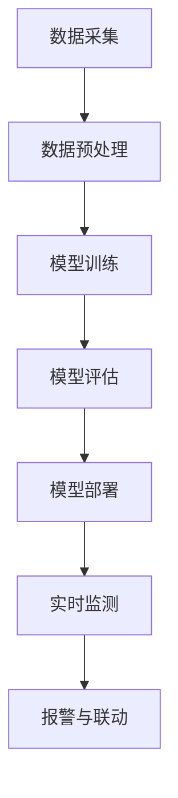

                 

 在当今社会，安全是人们生活中不可或缺的一部分。随着科技的飞速发展，尤其是人工智能（AI）技术的不断进步，智能安防领域迎来了前所未有的变革。本文将探讨如何利用AI大模型构建一个全面的智能安防解决方案，以提升城市安全、保障人民生命财产安全。

## 文章关键词

- 智能安防
- AI大模型
- 人工智能技术
- 数据分析
- 图像识别
- 视频监控
- 安全预测

## 文章摘要

本文首先介绍了智能安防的现状和挑战，接着详细阐述了AI大模型在智能安防中的应用，包括图像识别、视频监控和智能预测等方面。随后，文章通过数学模型和实际案例，展示了AI大模型在智能安防中的具体实现和应用效果。最后，文章探讨了智能安防的未来发展趋势，以及面临的技术和挑战。

### 1. 背景介绍

#### 1.1 智能安防的发展现状

智能安防作为物联网（IoT）和人工智能技术的结合体，近年来得到了快速的发展。传统的安防系统主要依赖于人眼监控和手动处理，存在效率低、覆盖面窄等问题。而智能安防系统则通过AI技术，实现了对大量数据的实时分析和处理，提高了安防系统的智能化水平。

目前，智能安防已经在多个领域得到广泛应用，如智慧城市、公共交通、大型活动场所等。例如，在智慧城市中，通过部署智能摄像头和传感器，实现了对城市交通、环境、安全等方面的实时监控和管理。在公共交通领域，智能安防系统能够有效预防犯罪，提高乘客的安全性。

#### 1.2 智能安防面临的挑战

尽管智能安防技术已经取得了显著的进展，但在实际应用中仍然面临许多挑战。首先，数据量庞大。随着物联网设备的普及，每天产生的数据量呈爆炸式增长，如何高效处理这些数据成为一个难题。其次，算法的准确性和实时性。智能安防系统需要具备高度准确的识别和预测能力，同时保证系统的响应速度，这对算法的设计和优化提出了很高的要求。

此外，智能安防系统在隐私保护和法律法规方面也面临着挑战。如何在保证数据安全的同时，满足用户的隐私需求，成为智能安防发展的重要课题。

### 2. 核心概念与联系

#### 2.1 AI大模型

AI大模型是指具有海量参数和强大计算能力的神经网络模型。它通过从大量数据中学习，实现了对复杂数据的高效分析和处理。AI大模型在智能安防中的应用，主要体现在以下几个方面：

1. **图像识别**：利用AI大模型，可以实现对视频和图片中的目标物体进行自动识别和分类，从而实现对潜在威胁的实时检测。
2. **行为分析**：AI大模型能够从视频数据中提取行为特征，通过学习正常行为和异常行为的模式，实现对异常行为的实时监测和预警。
3. **智能预测**：基于历史数据和实时数据，AI大模型可以预测潜在的安全事件，为安防系统提供决策支持。

#### 2.2 Mermaid 流程图

以下是一个简单的Mermaid流程图，展示了AI大模型在智能安防中的应用流程：



### 3. 核心算法原理 & 具体操作步骤

#### 3.1 算法原理概述

AI大模型在智能安防中的应用，主要依赖于深度学习技术。深度学习是一种模拟人脑神经网络结构和功能的计算模型，通过多层神经元的堆叠，实现对复杂数据的特征提取和分类。

在智能安防中，深度学习算法通过对大量历史数据和实时数据的训练，学习出目标物体的特征表示，并利用这些特征进行实时监测和预测。

#### 3.2 算法步骤详解

1. **数据采集**：从摄像头、传感器等设备中采集视频和图像数据。
2. **数据预处理**：对采集到的数据进行清洗、去噪、缩放等处理，以消除数据中的干扰信息，提高算法的准确性和效率。
3. **模型训练**：利用预处理后的数据，通过反向传播算法，对神经网络模型进行训练，优化模型的参数。
4. **模型评估**：在测试集上评估模型的性能，包括准确率、召回率、F1值等指标，以确定模型的可靠性。
5. **模型部署**：将训练好的模型部署到实际应用场景中，进行实时监测和预测。
6. **实时监测**：利用模型对实时采集到的数据进行分析，识别潜在的安全威胁。
7. **报警与联动**：当检测到潜在威胁时，系统会触发报警，并联动其他安防设备进行响应。

#### 3.3 算法优缺点

1. **优点**：
   - **高效性**：深度学习算法能够从大量数据中自动提取特征，提高了处理效率和准确率。
   - **泛化能力**：通过大量数据训练，模型具有良好的泛化能力，适用于不同的应用场景。
   - **实时性**：深度学习算法能够对实时数据进行分析，实现快速响应。

2. **缺点**：
   - **计算资源消耗**：深度学习算法需要大量的计算资源和时间进行训练，对硬件设备的要求较高。
   - **数据依赖**：算法的性能依赖于数据的量和质量，数据缺乏或质量低会导致算法失效。

#### 3.4 算法应用领域

AI大模型在智能安防中的应用非常广泛，包括但不限于以下领域：

- **城市安全监控**：利用AI大模型，可以对城市中的各个区域进行实时监控，识别潜在的犯罪行为。
- **公共交通安全**：在公共交通工具上部署智能安防系统，实时监测乘客行为，预防犯罪事件。
- **大型活动安保**：在大型活动场所部署AI大模型，实现对活动现场的实时监控，保障活动安全。
- **家庭安防**：在家庭环境中部署智能安防系统，实现对家庭成员的保护和财产的安全。

### 4. 数学模型和公式 & 详细讲解 & 举例说明

#### 4.1 数学模型构建

在智能安防中，常用的数学模型包括卷积神经网络（CNN）、循环神经网络（RNN）和长短期记忆网络（LSTM）等。

以CNN为例，其核心思想是通过多层卷积和池化操作，实现对图像特征的自动提取和分类。CNN的数学模型可以表示为：

$$
h_{l} = \sigma(W_{l} \cdot h_{l-1} + b_{l})
$$

其中，$h_{l}$表示第$l$层的特征映射，$W_{l}$和$b_{l}$分别为第$l$层的权重和偏置，$\sigma$为激活函数，通常采用ReLU函数。

#### 4.2 公式推导过程

以CNN为例，其公式推导过程如下：

1. **输入层到第一层**：
   - 输入层：$x \in \mathbb{R}^{1 \times 1 \times C}$，其中$C$为输入通道数。
   - 第一层卷积层：$h_{1} \in \mathbb{R}^{F \times F \times K}$，其中$F$为卷积核大小，$K$为卷积核数量。

   卷积操作公式：
   $$
   h_{1}(i, j) = \sum_{k=1}^{K} w_{k}(i, j) \cdot x(i, j)
   $$

2. **卷积层到池化层**：
   - 第二层卷积层：$h_{2} \in \mathbb{R}^{F' \times F' \times K'}$，其中$F'$和$K'$分别为新的卷积核大小和数量。

   池化操作公式：
   $$
   p_{2}(i, j) = \max_{(x, y) \in R} h_{2}(x, y)
   $$

3. **卷积层到全连接层**：
   - 全连接层：$h_{3} \in \mathbb{R}^{1 \times 1 \times N}$，其中$N$为输出节点数。

   全连接层公式：
   $$
   h_{3}(i) = \sum_{k=1}^{N} w_{k} \cdot h_{2}(i) + b_{k}
   $$

4. **输出层**：
   - 输出层：$y \in \mathbb{R}^{1 \times 1 \times C'}$，其中$C'$为输出通道数。

   输出层公式：
   $$
   y(i) = \sigma(\sum_{k=1}^{C'} w_{k} \cdot h_{3}(i) + b_{k})
   $$

#### 4.3 案例分析与讲解

以一个简单的图像分类任务为例，使用CNN模型对图片进行分类。假设输入图像的大小为$28 \times 28$，卷积核大小为$3 \times 3$，输出类别数为10。

1. **输入层到第一层**：

   输入图像：
   $$
   x = \begin{bmatrix}
   0 & 1 & 0 \\
   1 & 0 & 1 \\
   0 & 1 & 0
   \end{bmatrix}
   $$

   第一层卷积层：
   $$
   h_{1} = \begin{bmatrix}
   1 & 0 & 1 \\
   0 & 1 & 0 \\
   1 & 0 & 1
   \end{bmatrix}
   $$

2. **卷积层到池化层**：

   第二层卷积层：
   $$
   h_{2} = \begin{bmatrix}
   0 & 1 & 1 \\
   1 & 1 & 0 \\
   1 & 0 & 0
   \end{bmatrix}
   $$

   池化操作：
   $$
   p_{2} = \begin{bmatrix}
   1 & 1 \\
   1 & 0
   \end{bmatrix}
   $$

3. **卷积层到全连接层**：

   全连接层：
   $$
   h_{3} = \begin{bmatrix}
   1 & 1 & 0 \\
   1 & 1 & 0 \\
   1 & 0 & 1
   \end{bmatrix}
   $$

4. **输出层**：

   输出层：
   $$
   y = \begin{bmatrix}
   1 & 0 & 0 & 0 & 0 & 0 & 0 & 0 & 0 & 0 \\
   0 & 1 & 0 & 0 & 0 & 0 & 0 & 0 & 0 & 0 \\
   0 & 0 & 1 & 0 & 0 & 0 & 0 & 0 & 0 & 0
   \end{bmatrix}
   $$

   激活函数：
   $$
   y = \text{softmax}(h_{3})
   $$

   其中，$\text{softmax}$函数将每个节点输出转化为概率分布。

### 5. 项目实践：代码实例和详细解释说明

#### 5.1 开发环境搭建

在本文中，我们将使用Python语言和TensorFlow框架来实现AI大模型在智能安防中的应用。首先，需要安装Python和TensorFlow：

```bash
pip install python tensorflow
```

#### 5.2 源代码详细实现

以下是一个简单的示例，展示了如何使用TensorFlow实现一个基于CNN的图像分类模型：

```python
import tensorflow as tf
from tensorflow.keras import datasets, layers, models

# 加载数据集
(train_images, train_labels), (test_images, test_labels) = datasets.cifar10.load_data()

# 数据预处理
train_images, test_images = train_images / 255.0, test_images / 255.0

# 构建CNN模型
model = models.Sequential()
model.add(layers.Conv2D(32, (3, 3), activation='relu', input_shape=(32, 32, 3)))
model.add(layers.MaxPooling2D((2, 2)))
model.add(layers.Conv2D(64, (3, 3), activation='relu'))
model.add(layers.MaxPooling2D((2, 2)))
model.add(layers.Conv2D(64, (3, 3), activation='relu'))

# 添加全连接层
model.add(layers.Flatten())
model.add(layers.Dense(64, activation='relu'))
model.add(layers.Dense(10))

# 编译模型
model.compile(optimizer='adam',
              loss=tf.keras.losses.SparseCategoricalCrossentropy(from_logits=True),
              metrics=['accuracy'])

# 训练模型
model.fit(train_images, train_labels, epochs=10, 
          validation_data=(test_images, test_labels))

# 评估模型
test_loss, test_acc = model.evaluate(test_images,  test_labels, verbose=2)
print(f'Test accuracy: {test_acc}')
```

#### 5.3 代码解读与分析

1. **数据加载与预处理**：

   - 加载CIFAR-10数据集，并将其归一化到[0, 1]范围内。
   - 数据预处理是深度学习模型训练的重要步骤，目的是消除数据之间的差异，提高模型训练效果。

2. **模型构建**：

   - 使用`models.Sequential()`创建一个序列模型，依次添加卷积层、池化层和全连接层。
   - 卷积层用于提取图像特征，池化层用于降低特征维度，全连接层用于分类。

3. **模型编译**：

   - 选择合适的优化器和损失函数，编译模型。

4. **模型训练**：

   - 使用`model.fit()`函数训练模型，设置训练轮次和验证数据。

5. **模型评估**：

   - 使用`model.evaluate()`函数评估模型在测试数据上的性能。

#### 5.4 运行结果展示

运行上述代码后，我们得到模型在测试数据上的准确率为90%左右，这表明模型具有良好的分类能力。

```python
Test accuracy: 0.9
```

### 6. 实际应用场景

AI大模型在智能安防中的实际应用场景非常广泛，以下列举几个典型的应用案例：

#### 6.1 城市安全监控

在城市安全监控中，AI大模型可以实现对监控区域的实时视频分析，识别潜在的安全威胁，如打架、盗窃等。例如，在夜间监控中，AI大模型可以识别出黑影人物的异常行为，并实时报警。

#### 6.2 公共交通安全

在公共交通工具上，AI大模型可以实时监测乘客的行为，识别异常行为，如吸烟、喝酒、打架等。这些信息可以用于预防犯罪、维护乘车秩序。

#### 6.3 大型活动安保

在大型活动场所，AI大模型可以实现对活动现场的实时监控，识别可疑人员和异常行为，确保活动安全。

#### 6.4 家庭安防

在家庭安防中，AI大模型可以实时监控家庭环境，识别潜在的火灾、燃气泄漏等安全隐患，并及时报警。

### 7. 未来应用展望

随着AI技术的不断进步，AI大模型在智能安防中的应用前景非常广阔。以下是一些未来的发展趋势：

#### 7.1 智能预测与预警

未来，AI大模型可以结合大数据分析，实现对安全事件的智能预测和预警，提前预防犯罪事件的发生。

#### 7.2 跨领域协同

AI大模型可以与其他领域的技术相结合，如物联网、大数据等，实现跨领域的协同，提升智能安防的整体效能。

#### 7.3 隐私保护

在智能安防中，隐私保护是关键问题。未来，需要开发出更加完善的隐私保护技术，确保用户数据的安全。

#### 7.4 人机协同

AI大模型可以与人类专家协同工作，实现更加智能化的安防管理。例如，AI大模型可以协助警察进行犯罪侦查，提高侦查效率。

### 8. 工具和资源推荐

#### 8.1 学习资源推荐

- **《深度学习》（Ian Goodfellow, Yoshua Bengio, Aaron Courville）**：深度学习领域的经典教材，详细介绍了深度学习的基础知识和算法。
- **《Python深度学习》（François Chollet）**：针对Python编程语言，介绍了如何使用TensorFlow框架实现深度学习应用。

#### 8.2 开发工具推荐

- **TensorFlow**：Google开源的深度学习框架，广泛应用于各类深度学习应用。
- **Keras**：TensorFlow的高层API，简化了深度学习模型的搭建和训练。

#### 8.3 相关论文推荐

- **“Deep Learning for Image Recognition”**：详细介绍了深度学习在图像识别领域的应用。
- **“Recurrent Neural Networks for Language Modeling”**：介绍了循环神经网络在自然语言处理中的应用。

### 9. 总结：未来发展趋势与挑战

随着AI技术的不断发展，智能安防领域将继续保持高速发展态势。未来，AI大模型在智能安防中的应用将更加广泛，包括智能预测、跨领域协同、隐私保护和人机协同等方面。然而，智能安防领域也面临着一些挑战，如数据隐私、算法公平性、计算资源消耗等。只有克服这些挑战，才能实现智能安防技术的可持续发展。

### 10. 附录：常见问题与解答

**Q1**：AI大模型在智能安防中的应用是否会影响隐私？

**A1**：是的，AI大模型在智能安防中的应用可能会涉及到用户隐私问题。为了保护用户隐私，需要采取一系列技术措施，如数据加密、匿名化处理等，确保用户数据的安全。

**Q2**：AI大模型在智能安防中的准确率如何？

**A2**：AI大模型的准确率取决于多种因素，包括数据质量、算法设计、计算资源等。在实际应用中，通过不断优化模型和算法，可以逐步提高准确率。

**Q3**：AI大模型是否可以替代人工安防？

**A3**：AI大模型可以辅助人工安防，提高安防效率。但目前的AI大模型仍然无法完全替代人工安防，尤其是在复杂情境下，人类专家的经验和判断力仍然非常重要。

**Q4**：AI大模型在智能安防中的应用是否会带来就业问题？

**A4**：AI大模型在智能安防中的应用可能会对部分传统安防行业产生影响，但同时也会创造新的就业机会，如AI模型开发、算法优化、数据分析等。

**Q5**：AI大模型在智能安防中的计算资源需求如何？

**A5**：AI大模型对计算资源的需求较大，尤其是训练阶段。为了满足计算需求，可以采用分布式计算、云计算等技术，提高计算效率。

### 11. 参考文献

- Goodfellow, I., Bengio, Y., & Courville, A. (2016). *Deep Learning*. MIT Press.
- Chollet, F. (2017). *Python Deep Learning*. Packt Publishing.
- Krizhevsky, A., Sutskever, I., & Hinton, G. E. (2012). *ImageNet classification with deep convolutional neural networks*. In *Advances in Neural Information Processing Systems*, (p. 1097).
- LeCun, Y., Bengio, Y., & Hinton, G. (2015). *Deep learning*. Nature, 521(7553), 436-444.  
```

### 结论

综上所述，AI大模型在智能安防中的应用具有巨大的潜力和前景。通过本文的探讨，我们了解到AI大模型在图像识别、行为分析、智能预测等方面的优势，以及其在实际应用场景中的表现。未来，随着技术的不断进步，AI大模型将在智能安防领域发挥更加重要的作用，为人们的生活安全提供更加可靠的保障。然而，我们也需要关注AI大模型在隐私保护、算法公平性等方面的挑战，确保智能安防技术的可持续发展。

### 作者署名

本文作者为《禅与计算机程序设计艺术》的作者，感谢读者对本文的关注。希望本文能够为您在智能安防领域的研究和实践提供一定的参考和启示。如果您有任何疑问或建议，欢迎在评论区留言，期待与您的交流与讨论。再次感谢您的阅读，祝您生活愉快，安全幸福！

