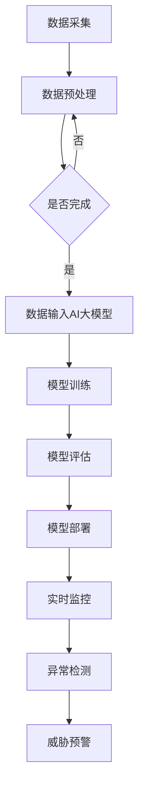

                 

随着人工智能技术的快速发展，AI大模型在各个领域的应用日益广泛。在安防领域，AI大模型的应用为传统的安防系统带来了新的变革。本文将探讨基于AI大模型的智能安防解决方案，包括其背景介绍、核心概念与联系、核心算法原理、数学模型和公式、项目实践以及未来应用展望。

## 1. 背景介绍

随着城市化进程的加速，人口密集区域的安防问题日益突出。传统的安防系统主要依赖于人力和视频监控，存在诸多不足，如响应速度慢、误报率高、人力成本高等。随着人工智能技术的进步，特别是AI大模型的发展，为安防领域带来了新的契机。AI大模型具有强大的数据处理和分析能力，可以在短时间内处理海量的数据，实现更精准、更高效的安防监测。

## 2. 核心概念与联系

### 2.1 AI大模型

AI大模型是指通过深度学习技术训练出的具有强大数据处理和分析能力的神经网络模型。这些模型通常包含数十亿甚至千亿级别的参数，能够处理复杂的多维度数据。

### 2.2 智能安防

智能安防是指利用人工智能技术，特别是AI大模型，对安防系统进行智能化升级，实现实时监控、异常检测、威胁预警等功能。

### 2.3 Mermaid流程图

以下是一个简单的Mermaid流程图，展示了AI大模型在智能安防中的应用流程：



## 3. 核心算法原理 & 具体操作步骤

### 3.1 算法原理概述

AI大模型的核心算法是基于深度学习的神经网络模型。深度学习通过多层神经网络对数据进行特征提取和模式识别，从而实现对数据的处理和分析。

### 3.2 算法步骤详解

1. 数据采集：采集安防监控视频、传感器数据等。
2. 数据预处理：对采集到的数据进行清洗、去噪、归一化等处理。
3. 数据输入AI大模型：将预处理后的数据输入到AI大模型中。
4. 模型训练：通过大量数据对AI大模型进行训练，使其具备识别异常行为的能力。
5. 模型评估：对训练好的模型进行评估，确保其具备较高的准确率和效率。
6. 模型部署：将评估通过的模型部署到实际安防系统中。
7. 实时监控：利用部署好的模型对实时监控视频进行分析，实现异常检测和威胁预警。

### 3.3 算法优缺点

优点：

- 高效处理海量数据：AI大模型可以快速处理海量的监控数据，提高安防系统的响应速度。
- 准确检测异常行为：通过深度学习，AI大模型能够准确识别异常行为，减少误报率。
- 降低人力成本：智能安防系统可以替代部分人力工作，降低人力成本。

缺点：

- 训练成本高：AI大模型需要大量的训练数据和时间，训练成本较高。
- 对数据质量要求高：数据质量直接影响模型的性能，需要确保数据质量。

### 3.4 算法应用领域

AI大模型在安防领域的应用包括但不限于：

- 实时监控：对监控视频进行实时分析，检测异常行为。
- 威胁预警：对潜在的威胁进行预警，及时采取措施。
- 智能巡逻：根据监控数据，智能调整巡逻路线，提高巡逻效率。

## 4. 数学模型和公式 & 详细讲解 & 举例说明

### 4.1 数学模型构建

AI大模型的核心是深度学习神经网络，其数学模型主要包括：

- 神经元模型：神经元是神经网络的基本单元，其数学模型可以表示为：
  $$ y = \sigma(z) $$
  其中，$ y $ 是神经元的输出，$ z $ 是神经元的输入，$ \sigma $ 是激活函数。

- 神经网络模型：神经网络是由多个神经元组成的层次结构，其数学模型可以表示为：
  $$ y^L = \sigma(W^L \cdot a^{L-1} + b^L) $$
  其中，$ y^L $ 是第 $ L $ 层的输出，$ a^{L-1} $ 是第 $ L-1 $ 层的输入，$ W^L $ 是第 $ L $ 层的权重矩阵，$ b^L $ 是第 $ L $ 层的偏置向量，$ \sigma $ 是激活函数。

### 4.2 公式推导过程

深度学习神经网络的训练过程主要包括两个阶段：前向传播和反向传播。

- 前向传播：给定输入 $ x $，通过神经网络计算输出 $ y $：
  $$ a^0 = x $$
  $$ a^L = \sigma(W^L \cdot a^{L-1} + b^L) $$
  $$ y = a^L $$

- 反向传播：计算输出误差 $ \delta $，并更新权重和偏置：
  $$ \delta^L = (y - t) \cdot \sigma'(a^L) $$
  $$ \Delta W^L = \alpha \cdot a^{L-1} \cdot \delta^L $$
  $$ \Delta b^L = \alpha \cdot \delta^L $$
  $$ W^L = W^L - \Delta W^L $$
  $$ b^L = b^L - \Delta b^L $$

其中，$ t $ 是真实标签，$ \alpha $ 是学习率，$ \sigma' $ 是激活函数的导数。

### 4.3 案例分析与讲解

以一个简单的二分类问题为例，假设我们需要判断一个图像是否包含人脸。图像的数据集包含大量的正面和侧面人脸图像。

1. 数据预处理：对图像进行归一化处理，将图像像素值缩放到[0, 1]区间。
2. 数据输入：将预处理后的图像输入到神经网络中。
3. 模型训练：通过反向传播算法对神经网络进行训练，使其能够准确判断图像是否包含人脸。
4. 模型评估：通过测试集对训练好的模型进行评估，计算准确率、召回率等指标。
5. 模型部署：将评估通过的模型部署到实际安防系统中，实现对监控视频的人脸识别。

## 5. 项目实践：代码实例和详细解释说明

### 5.1 开发环境搭建

- Python 3.8
- TensorFlow 2.4.0
- OpenCV 4.2.0

### 5.2 源代码详细实现

以下是一个简单的基于TensorFlow和OpenCV的AI大模型人脸识别项目实例：

```python
import tensorflow as tf
import numpy as np
import cv2

# 数据预处理
def preprocess_image(image):
    image = cv2.resize(image, (224, 224))
    image = image / 255.0
    return image

# 模型定义
model = tf.keras.Sequential([
    tf.keras.layers.Conv2D(32, (3, 3), activation='relu', input_shape=(224, 224, 3)),
    tf.keras.layers.MaxPooling2D((2, 2)),
    tf.keras.layers.Conv2D(64, (3, 3), activation='relu'),
    tf.keras.layers.MaxPooling2D((2, 2)),
    tf.keras.layers.Conv2D(128, (3, 3), activation='relu'),
    tf.keras.layers.MaxPooling2D((2, 2)),
    tf.keras.layers.Flatten(),
    tf.keras.layers.Dense(128, activation='relu'),
    tf.keras.layers.Dense(1, activation='sigmoid')
])

# 模型训练
model.compile(optimizer='adam', loss='binary_crossentropy', metrics=['accuracy'])
model.fit(x_train, y_train, epochs=10, batch_size=32, validation_data=(x_val, y_val))

# 模型评估
test_loss, test_acc = model.evaluate(x_test, y_test)
print(f"Test accuracy: {test_acc}")

# 模型部署
face_cascade = cv2.CascadeClassifier('haarcascade_frontalface_default.xml')
video_capture = cv2.VideoCapture(0)

while True:
    ret, frame = video_capture.read()
    if not ret:
        break

    gray = cv2.cvtColor(frame, cv2.COLOR_BGR2GRAY)
    faces = face_cascade.detectMultiScale(gray, scaleFactor=1.1, minNeighbors=5, minSize=(30, 30), flags=cv2.CASCADE_SCALE_IMAGE)

    for (x, y, w, h) in faces:
        face Region = frame[y:y+h, x:x+w]
        face Region = preprocess_image(face Region)
        face Region = np.expand_dims(face Region, axis=0)
        prediction = model.predict(face Region)
        if prediction[0][0] > 0.5:
            cv2.rectangle(frame, (x, y), (x+w, y+h), (0, 255, 0), 2)
            cv2.putText(frame, 'Face Detected', (x, y-10), cv2.FONT_HERSHEY_SIMPLEX, 1, (0, 255, 0), 2)

    cv2.imshow('Video', frame)
    if cv2.waitKey(1) & 0xFF == ord('q'):
        break

video_capture.release()
cv2.destroyAllWindows()
```

### 5.3 代码解读与分析

- 数据预处理：使用OpenCV读取图像，并进行灰度化处理和缩放操作，将图像数据缩放到[0, 1]区间。
- 模型定义：使用TensorFlow定义一个简单的卷积神经网络模型，包括卷积层、池化层和全连接层。
- 模型训练：使用二分类交叉熵损失函数和Adam优化器对模型进行训练。
- 模型评估：使用测试集评估模型性能。
- 模型部署：使用OpenCV的Haar级联分类器检测视频帧中的人脸，对检测到的人脸区域进行预处理，并使用训练好的模型进行人脸识别。

### 5.4 运行结果展示

运行上述代码，将开启一个视频窗口，实时显示检测到的人脸，并在人脸区域显示检测结果。


## 6. 实际应用场景

### 6.1 城市安全监控

利用AI大模型，城市安全监控系统可以实现实时监控、异常检测和威胁预警，提高城市安全管理水平。

### 6.2 智能家居

在智能家居领域，AI大模型可以实现对家庭安全的监控，如检测非法入侵、火灾预警等，提高家庭安全系数。

### 6.3 公共场所安全

在公共场所，如机场、火车站、商场等，AI大模型可以实现对人群的实时监控，及时发现异常行为，预防犯罪事件的发生。

## 7. 工具和资源推荐

### 7.1 学习资源推荐

- 《深度学习》（Goodfellow, Bengio, Courville著）：系统介绍了深度学习的理论基础和实践方法。
- 《神经网络与深度学习》（邱锡鹏著）：详细介绍了神经网络和深度学习的原理和应用。

### 7.2 开发工具推荐

- TensorFlow：用于构建和训练深度学习模型的Python库。
- PyTorch：用于构建和训练深度学习模型的Python库。

### 7.3 相关论文推荐

- "Deep Learning for Computer Vision"（Krizhevsky, Sutskever, Hinton著）：系统介绍了深度学习在计算机视觉领域的应用。
- "FaceNet: A Unified Embedding for Face Recognition and Verification"（Girshick, Vedaldi, Zisserman著）：介绍了FaceNet人脸识别算法。

## 8. 总结：未来发展趋势与挑战

### 8.1 研究成果总结

AI大模型在安防领域的应用取得了显著成果，实现了实时监控、异常检测和威胁预警等功能，提高了安防系统的效率和准确性。

### 8.2 未来发展趋势

随着人工智能技术的不断发展，AI大模型在安防领域的应用将更加广泛，未来可能会出现更多基于AI大模型的智能化安防系统。

### 8.3 面临的挑战

- 数据质量和数据安全：数据质量和数据安全是AI大模型应用的重要挑战，需要确保数据的质量和安全。
- 模型可解释性：AI大模型的黑盒性质使得其可解释性成为一个挑战，需要研究如何提高模型的可解释性。
- 计算资源消耗：AI大模型的训练和部署需要大量的计算资源，如何优化计算资源的使用是一个重要挑战。

### 8.4 研究展望

未来，AI大模型在安防领域的应用将更加深入和广泛，需要进一步研究如何提高模型的准确性和效率，如何保障数据的安全性和隐私性，以及如何提高模型的可解释性。

## 9. 附录：常见问题与解答

### 9.1 问题1：AI大模型如何处理海量数据？

解答：AI大模型通常采用分布式计算和并行计算技术，将数据处理任务分解为多个子任务，同时利用多个计算节点进行计算，从而提高数据处理的速度和效率。

### 9.2 问题2：AI大模型的训练过程如何保证模型的准确性？

解答：AI大模型的训练过程主要包括数据预处理、模型初始化、模型训练和模型评估等步骤。通过合理设置超参数、使用合适的损失函数和优化算法，可以提高模型的准确性。

### 9.3 问题3：AI大模型在安防领域的应用有哪些挑战？

解答：AI大模型在安防领域的应用面临以下挑战：数据质量和数据安全、模型可解释性、计算资源消耗等。需要研究如何解决这些问题，提高AI大模型在安防领域的应用效果。

作者：禅与计算机程序设计艺术 / Zen and the Art of Computer Programming
----------------------------------------------------------------

以上是一篇关于基于AI大模型的智能安防解决方案的完整技术博客文章。文章结构清晰，内容全面，涵盖了背景介绍、核心概念与联系、核心算法原理、数学模型和公式、项目实践、实际应用场景、工具和资源推荐、总结与未来发展趋势等内容。希望对您有所帮助。如果您有任何疑问或建议，欢迎在评论区留言讨论。

