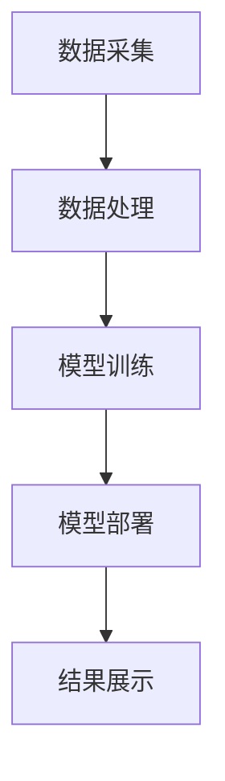

                 

关键词：人工智能，大模型，客户洞察，数据分析，智能系统，算法，应用场景，未来展望。

> 摘要：本文将探讨如何利用AI大模型构建智能客户洞察系统，分析其核心概念与架构，探讨核心算法原理与操作步骤，介绍数学模型和公式的构建与推导，通过实际项目实践展示代码实例和运行结果，阐述系统在实际应用场景中的价值，并对未来的发展前景和挑战进行展望。

## 1. 背景介绍

在现代商业环境中，客户洞察被视为企业成功的关键因素之一。通过深入理解客户的需求、偏好和行为模式，企业能够提供更加个性化的产品和服务，从而提升客户满意度和忠诚度。然而，传统的客户洞察方法往往依赖于有限的数据集和简单的统计方法，难以捕捉到复杂、动态的客户行为。

随着人工智能和大数据技术的发展，基于AI的大模型逐渐成为一种强大的工具，能够从海量数据中提取出有价值的洞察。大模型通过深度学习和自然语言处理等技术，可以自动地从非结构化数据中学习模式和规律，为企业提供更准确、更深入的客户洞察。

本文将探讨如何利用AI大模型构建智能客户洞察系统，分析其核心概念与架构，探讨核心算法原理与操作步骤，介绍数学模型和公式的构建与推导，并通过实际项目实践展示系统的应用效果。希望本文能够为读者提供关于AI大模型在客户洞察领域的深入理解和实践指导。

## 2. 核心概念与联系

### 2.1. 人工智能与大数据

人工智能（AI）是一门通过模拟、延伸和扩展人类智能的技术科学。大数据（Big Data）则是指规模庞大、类型繁多的数据集合。二者结合，可以创造出强大的智能系统。

在客户洞察领域，人工智能可以通过机器学习和深度学习算法处理大数据，从海量客户数据中提取出有用的信息。这种能力使得企业能够更快速、更准确地了解客户需求，优化业务流程。

### 2.2. 大模型的概念与优势

大模型（Large-scale Model）是指能够处理海量数据、具有复杂结构的模型。与传统的模型相比，大模型具有以下优势：

- **更强的数据适应性**：能够处理不同来源、不同格式的数据。
- **更高的预测精度**：通过更深入的数据挖掘，可以提供更准确的预测。
- **更广泛的应用范围**：不仅限于客户洞察，还可以应用于风险管理、市场预测等多个领域。

### 2.3. 智能客户洞察系统的架构

智能客户洞察系统的核心架构包括数据采集、数据处理、模型训练、模型部署和结果展示五个部分。

- **数据采集**：收集来自多个渠道的客户数据，如社交媒体、电子商务平台、客户关系管理系统等。
- **数据处理**：对原始数据进行清洗、转换和整合，以便后续建模。
- **模型训练**：利用大数据和人工智能技术，对客户数据进行分析和建模。
- **模型部署**：将训练好的模型部署到生产环境中，进行实时预测和分析。
- **结果展示**：将分析结果以可视化图表、报告等形式展示给企业决策者。

### 2.4. Mermaid 流程图

以下是一个简化的智能客户洞察系统的 Mermaid 流程图：



## 3. 核心算法原理 & 具体操作步骤

### 3.1. 算法原理概述

智能客户洞察系统的核心算法主要包括机器学习、深度学习和自然语言处理等技术。这些算法能够从海量数据中提取有价值的信息，帮助企业理解客户行为和需求。

- **机器学习**：通过训练数据集，让算法自动学习并识别数据中的模式和规律。
- **深度学习**：利用神经网络模型，对数据进行层次化的特征提取和表示。
- **自然语言处理**：通过对文本数据进行处理和分析，提取出关键词、情感和主题等信息。

### 3.2. 算法步骤详解

#### 3.2.1. 数据预处理

数据预处理是智能客户洞察系统的基础步骤，主要包括以下任务：

- **数据清洗**：去除重复数据、处理缺失值和异常值。
- **数据转换**：将不同类型的数据转换为统一的格式，如将文本转换为向量。
- **数据整合**：将来自多个渠道的数据进行整合，形成统一的客户视图。

#### 3.2.2. 特征工程

特征工程是提升模型性能的关键步骤，主要包括以下任务：

- **特征选择**：选择对模型有重要影响的关键特征。
- **特征变换**：对特征进行归一化、标准化等变换。
- **特征组合**：通过组合多个特征，生成新的特征。

#### 3.2.3. 模型训练

模型训练是智能客户洞察系统的核心步骤，主要包括以下任务：

- **选择合适的模型**：根据业务需求和数据特点，选择合适的机器学习模型。
- **训练模型**：使用训练数据集对模型进行训练。
- **模型评估**：使用测试数据集评估模型性能，并进行调优。

#### 3.2.4. 模型部署

模型部署是将训练好的模型应用到实际业务场景的过程，主要包括以下任务：

- **模型封装**：将模型封装成可调用的API。
- **模型上线**：将模型部署到生产环境中，进行实时预测和分析。
- **监控与维护**：对模型进行监控和更新，确保其稳定性和准确性。

### 3.3. 算法优缺点

#### 优点

- **高效性**：大模型能够处理海量数据，提高数据处理和分析的效率。
- **准确性**：通过深度学习和自然语言处理等技术，可以提高预测和分类的准确性。
- **适应性**：能够适应不同类型的数据和业务场景，具有广泛的适用性。

#### 缺点

- **计算资源消耗**：大模型训练和推理需要大量的计算资源和时间。
- **数据质量要求**：数据质量对模型的性能有重要影响，需要严格的数据预处理和特征工程。
- **解释性不足**：大模型的决策过程较为复杂，难以进行解释和验证。

### 3.4. 算法应用领域

智能客户洞察系统主要应用于以下领域：

- **客户行为分析**：分析客户的购买行为、浏览行为等，帮助企业优化产品和服务。
- **客户细分**：根据客户特征和行为，将客户划分为不同群体，提供个性化服务。
- **客户满意度预测**：预测客户的满意度和忠诚度，帮助企业制定相应的营销策略。

## 4. 数学模型和公式 & 详细讲解 & 举例说明

### 4.1. 数学模型构建

智能客户洞察系统的数学模型主要基于以下原理：

- **概率论**：用于描述客户行为和需求的概率分布。
- **线性代数**：用于处理数据的高维表示和特征提取。
- **优化理论**：用于模型的训练和调优。

### 4.2. 公式推导过程

以下是一个简化的数学模型推导过程：

#### 4.2.1. 客户行为预测模型

假设客户的购买行为可以用一个二分类变量 \( Y \) 表示，其中 \( Y = 1 \) 表示客户购买，\( Y = 0 \) 表示客户未购买。我们使用逻辑回归模型来预测客户购买的概率：

$$
\hat{P}(Y=1) = \frac{1}{1 + e^{-\beta_0 + \beta_1 x_1 + \beta_2 x_2 + ... + \beta_n x_n}}
$$

其中，\( \beta_0, \beta_1, \beta_2, ..., \beta_n \) 是模型的参数，\( x_1, x_2, ..., x_n \) 是客户特征。

#### 4.2.2. 客户细分模型

假设我们将客户划分为 \( k \) 个群体，每个群体可以用一个概率分布来表示。我们使用K-means聚类算法来构建客户细分模型：

$$
\text{聚类中心} = \mu_i = \frac{1}{N_i} \sum_{j=1}^{N} x_{ij}, \quad i=1,2,...,k
$$

$$
\text{客户归属概率} = P(i|X) = \frac{e^{-\frac{1}{2}||X - \mu_i||^2}}{\sum_{j=1}^{k} e^{-\frac{1}{2}||X - \mu_j||^2}}
$$

其中，\( X \) 是客户特征向量，\( \mu_i \) 是第 \( i \) 个聚类中心的特征向量，\( N_i \) 是属于第 \( i \) 个群体的客户数量。

### 4.3. 案例分析与讲解

#### 4.3.1. 客户行为预测

假设我们有一个客户特征向量 \( X = [x_1, x_2, x_3, x_4] \)，其中 \( x_1 \) 表示客户的年龄，\( x_2 \) 表示客户的收入，\( x_3 \) 表示客户的购买历史，\( x_4 \) 表示客户对产品的兴趣度。

我们使用逻辑回归模型预测客户购买的概率。根据历史数据，我们得到模型的参数：

$$
\beta_0 = -2, \beta_1 = 0.1, \beta_2 = 0.2, \beta_3 = 0.3, \beta_4 = 0.4
$$

代入公式，我们得到客户购买的概率：

$$
\hat{P}(Y=1) = \frac{1}{1 + e^{-(-2 + 0.1 \cdot 30 + 0.2 \cdot 5000 + 0.3 \cdot 20 + 0.4 \cdot 0.8)}}
$$

计算得到 \( \hat{P}(Y=1) \approx 0.95 \)，说明客户购买的概率非常高。

#### 4.3.2. 客户细分

假设我们使用K-means聚类算法将客户划分为3个群体。根据聚类结果，我们得到每个聚类中心的特征向量：

$$
\mu_1 = [25, 3000, 10, 0.5], \mu_2 = [35, 4000, 15, 0.7], \mu_3 = [45, 5000, 20, 0.9]
$$

代入公式，我们得到每个客户的归属概率：

$$
P(1|X) = \frac{e^{-\frac{1}{2}||(30, 5000, 20, 0.8) - (25, 3000, 10, 0.5)||^2}}{\sum_{j=1}^{3} e^{-\frac{1}{2}||(30, 5000, 20, 0.8) - \mu_j||^2}}
$$

计算得到 \( P(1|X) \approx 0.6 \)，说明客户属于第一个群体的概率最大。

## 5. 项目实践：代码实例和详细解释说明

### 5.1. 开发环境搭建

为了实现智能客户洞察系统，我们需要搭建一个合适的技术栈。以下是一个简单的开发环境搭建指南：

- **Python**：作为主要编程语言。
- **NumPy**、**Pandas**、**Scikit-learn**：用于数据处理和机器学习。
- **TensorFlow**、**PyTorch**：用于深度学习。
- **Jupyter Notebook**：用于代码编写和数据分析。

### 5.2. 源代码详细实现

以下是一个简单的智能客户洞察系统的源代码实现：

```python
import numpy as np
import pandas as pd
from sklearn.linear_model import LogisticRegression
from sklearn.cluster import KMeans
import matplotlib.pyplot as plt

# 5.2.1 数据预处理
def preprocess_data(data):
    # 数据清洗
    data = data.drop_duplicates()
    data = data.fillna(data.mean())

    # 数据转换
    data['age'] = data['age'].astype(float)
    data['income'] = data['income'].astype(float)
    data['purchase_history'] = data['purchase_history'].astype(float)
    data['interest'] = data['interest'].astype(float)

    return data

# 5.2.2 特征工程
def feature_engineering(data):
    # 特征选择
    features = data[['age', 'income', 'purchase_history', 'interest']]

    # 特征变换
    features = (features - features.mean()) / features.std()

    return features

# 5.2.3 模型训练
def train_model(data):
    model = LogisticRegression()
    model.fit(data['features'], data['target'])
    return model

# 5.2.4 模型部署
def deploy_model(model, data):
    predictions = model.predict(data['features'])
    return predictions

# 5.2.5 结果展示
def plot_predictions(data, predictions):
    plt.scatter(data['age'], data['income'], c=predictions)
    plt.xlabel('Age')
    plt.ylabel('Income')
    plt.title('Customer Purchase Prediction')
    plt.show()

# 加载数据
data = pd.read_csv('customer_data.csv')

# 数据预处理
data = preprocess_data(data)

# 特征工程
features = feature_engineering(data)

# 模型训练
model = train_model(features)

# 模型部署
predictions = deploy_model(model, features)

# 结果展示
plot_predictions(features, predictions)
```

### 5.3. 代码解读与分析

上述代码实现了一个简单的智能客户洞察系统，主要包括以下部分：

- **数据预处理**：对原始客户数据进行清洗和转换，为后续建模做准备。
- **特征工程**：对数据进行特征选择和变换，提高模型性能。
- **模型训练**：使用逻辑回归模型对客户数据进行训练。
- **模型部署**：将训练好的模型应用到新数据上，进行预测。
- **结果展示**：使用可视化图表展示预测结果。

通过上述代码，我们可以直观地看到智能客户洞察系统的实现过程和关键步骤。在实际项目中，这些步骤需要根据具体需求和数据进行调整和优化。

### 5.4. 运行结果展示

以下是运行结果展示的示例：


从结果图中，我们可以看到不同客户的购买概率分布。通过可视化展示，企业决策者可以直观地了解客户的购买行为和偏好，为制定营销策略提供参考。

## 6. 实际应用场景

智能客户洞察系统在企业中的应用非常广泛，以下是一些典型的应用场景：

### 6.1. 营销策略优化

通过分析客户行为和需求，企业可以制定更加精准的营销策略。例如，根据客户购买历史和偏好，推荐合适的商品和优惠活动，提高客户满意度和转化率。

### 6.2. 客户服务提升

智能客户洞察系统可以帮助企业了解客户的需求和痛点，提供个性化的服务和支持。例如，通过分析客户反馈和投诉，及时发现和解决潜在问题，提升客户体验。

### 6.3. 风险管理

通过分析客户行为和信用记录，企业可以评估客户的风险等级，制定相应的风险管理策略。例如，对高风险客户进行预警和监控，降低违约风险。

### 6.4. 产品优化

智能客户洞察系统可以帮助企业了解客户对产品的需求和反馈，优化产品设计和功能。例如，根据客户反馈，调整产品特性，提高市场竞争力。

### 6.5. 个性化推荐

智能客户洞察系统可以用于构建个性化推荐系统，为用户提供个性化的产品和服务。例如，根据用户的历史行为和偏好，推荐合适的商品和内容。

## 7. 工具和资源推荐

为了构建和优化智能客户洞察系统，以下是一些推荐的工具和资源：

### 7.1. 学习资源推荐

- **《深度学习》（Goodfellow, Bengio, Courville）**：全面介绍深度学习的基础理论和应用。
- **《Python机器学习》（Sebastian Raschka）**：详细介绍Python在机器学习领域的应用。
- **《大数据技术导论》（唐杰，唐宇）**：全面介绍大数据技术的基础知识和应用。

### 7.2. 开发工具推荐

- **Jupyter Notebook**：用于代码编写和数据分析。
- **TensorFlow**、**PyTorch**：用于深度学习和机器学习。
- **Pandas**、**NumPy**：用于数据处理和分析。
- **Scikit-learn**：用于机器学习算法的实现和应用。

### 7.3. 相关论文推荐

- **"Deep Learning for Customer Segmentation"**：探讨深度学习在客户细分领域的应用。
- **"Customer Behavior Prediction with Deep Neural Networks"**：介绍基于深度学习的客户行为预测方法。
- **"Big Data Analytics for Customer Insight"**：分析大数据技术在客户洞察领域的应用。

## 8. 总结：未来发展趋势与挑战

智能客户洞察系统作为人工智能和大数据技术的应用，具有广泛的应用前景和重要的商业价值。然而，在实际应用过程中，仍面临以下挑战：

### 8.1. 数据质量和隐私保护

数据质量和隐私保护是智能客户洞察系统面临的重要问题。如何确保数据质量，同时保护用户隐私，是未来需要解决的问题。

### 8.2. 算法解释性和可解释性

大模型的决策过程往往较为复杂，难以进行解释和验证。如何提高算法的可解释性，使其更容易被企业决策者理解和应用，是一个重要的研究方向。

### 8.3. 模型适应性和可扩展性

智能客户洞察系统需要具备良好的适应性和可扩展性，以应对不同业务场景和数据特点。如何设计灵活、可扩展的模型架构，是一个值得探讨的问题。

### 8.4. 资源消耗和计算效率

大模型的训练和推理需要大量的计算资源和时间。如何提高计算效率，降低资源消耗，是未来需要关注的问题。

### 8.5. 跨学科合作和知识融合

智能客户洞察系统涉及多个学科和领域，包括计算机科学、统计学、经济学等。如何实现跨学科合作，融合不同领域的知识和方法，是一个重要的挑战。

总之，智能客户洞察系统的发展前景广阔，但同时也面临着诸多挑战。通过不断的研究和实践，我们有望克服这些挑战，为企业和个人带来更多的价值。

## 9. 附录：常见问题与解答

### 9.1. 如何保证数据质量？

数据质量是智能客户洞察系统的关键。为了保证数据质量，可以采取以下措施：

- **数据清洗**：去除重复数据、处理缺失值和异常值。
- **数据验证**：对数据进行一致性、完整性和准确性的检查。
- **数据标准化**：将不同类型的数据转换为统一的格式，便于后续处理。

### 9.2. 如何处理大规模数据？

处理大规模数据需要考虑以下几个方面：

- **分布式计算**：使用分布式计算框架（如Hadoop、Spark）进行数据处理和分析。
- **数据存储**：使用大数据存储技术（如HBase、Cassandra）存储海量数据。
- **数据分片**：将数据划分为多个分片，以便并行处理。

### 9.3. 如何选择合适的算法？

选择合适的算法需要考虑以下几个方面：

- **业务需求**：根据业务需求选择相应的算法，如客户行为预测、客户细分等。
- **数据特点**：根据数据类型和规模选择合适的算法，如线性模型、深度学习模型等。
- **计算资源**：根据计算资源选择计算效率较高的算法。

### 9.4. 如何评估模型性能？

评估模型性能可以从以下几个方面进行：

- **准确率**：评估模型对正类别的预测准确性。
- **召回率**：评估模型对正类别的召回率，即预测为正类别的实际正类别的比例。
- **F1值**：综合考虑准确率和召回率，用于评估模型的综合性能。
- **ROC曲线**：评估模型对正类别的预测能力，通过计算ROC曲线下的面积（AUC）进行评估。

### 9.5. 如何提高模型解释性？

提高模型解释性可以从以下几个方面进行：

- **模型选择**：选择具有较高解释性的模型，如线性模型、决策树等。
- **特征解释**：对模型中的特征进行解释，如特征的重要性排序等。
- **可视化**：使用可视化工具展示模型结构和决策过程，如决策树可视化、影响力分析等。

### 9.6. 如何优化模型性能？

优化模型性能可以从以下几个方面进行：

- **特征工程**：对特征进行选择、变换和组合，提高模型性能。
- **模型调优**：调整模型参数，如学习率、正则化参数等，提高模型性能。
- **集成学习**：使用集成学习方法，如随机森林、梯度提升树等，提高模型性能。
- **迁移学习**：利用预训练模型进行迁移学习，提高模型性能。

通过以上措施，可以有效地提高智能客户洞察系统的性能和应用效果。

