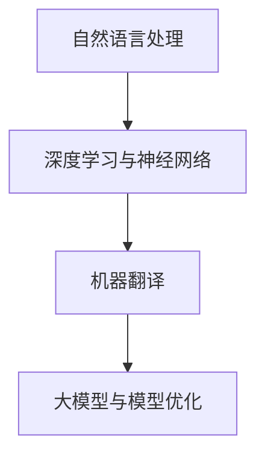

                 

关键词：AI大模型、智能翻译、自然语言处理、神经网络、机器翻译、深度学习、优化算法

摘要：本文将探讨基于人工智能大模型的智能翻译服务的现状、核心概念、算法原理、数学模型、项目实践以及未来应用前景。通过深入分析，我们旨在为读者提供一个全面的技术视角，帮助理解智能翻译服务的技术框架和潜在挑战。

## 1. 背景介绍

随着全球化进程的加速，跨语言沟通变得日益重要。传统的翻译方法，如基于规则的翻译系统和基于统计的机器翻译系统，在效率和准确性上受到限制。近年来，随着深度学习和自然语言处理技术的快速发展，基于人工智能大模型的智能翻译服务逐渐成为可能。

人工智能大模型，如Transformer模型，通过其强大的自适应能力，能够处理复杂的语言结构和语义理解。这一突破为智能翻译服务带来了前所未有的准确性和效率。智能翻译服务的核心目标是实现跨语言的实时沟通，满足不同领域的专业翻译需求。

## 2. 核心概念与联系

### 2.1. 自然语言处理（NLP）

自然语言处理是智能翻译服务的基础，涉及文本分析、语言识别、语义理解等。NLP的目标是将自然语言转换为机器可处理的格式，并提取出有意义的语义信息。

### 2.2. 深度学习与神经网络

深度学习是一种基于神经网络的机器学习方法，通过多层神经网络模拟人脑的神经结构，实现数据的特征提取和模式识别。神经网络是深度学习的基本构建块，其核心在于通过训练调整网络参数，使其能够对输入数据进行有效的分类和预测。

### 2.3. 机器翻译（MT）

机器翻译是将一种语言的文本自动翻译成另一种语言的过程。传统的机器翻译方法主要依赖规则和统计模型，而基于深度学习的机器翻译则依赖于大型神经网络，能够处理更复杂的语言结构和语义。

### 2.4. 大模型与模型优化

大模型，如GPT-3、BERT等，具有数十亿参数，能够处理大量的语言数据。模型优化是指通过调整模型参数、结构以及训练策略，提高模型的性能和效率。

### 2.5. Mermaid 流程图



## 3. 核心算法原理 & 具体操作步骤

### 3.1. 算法原理概述

基于AI大模型的智能翻译服务通常采用端到端的训练方式，通过大规模语料库训练出能够自动翻译的模型。核心算法原理包括：

1. **编码器（Encoder）**：将源语言文本编码为固定长度的向量。
2. **解码器（Decoder）**：将编码后的向量解码为目标语言文本。
3. **注意力机制（Attention）**：使模型能够关注源语言文本中的关键信息，提高翻译的准确性。
4. **预训练与微调（Pre-training and Fine-tuning）**：通过预训练获取通用语言模型，然后进行微调以适应特定翻译任务。

### 3.2. 算法步骤详解

1. **数据准备**：收集大量的源语言和目标语言文本，并进行预处理，如分词、去噪等。
2. **编码器训练**：使用源语言文本训练编码器，使其能够将文本编码为固定长度的向量。
3. **解码器训练**：使用目标语言文本训练解码器，使其能够将编码后的向量解码为目标语言文本。
4. **注意力机制训练**：通过反向传播算法优化编码器、解码器和注意力机制的参数，使其能够更好地关注源语言文本的关键信息。
5. **模型微调**：使用特定领域的语料库对模型进行微调，提高其在特定领域的翻译准确性。

### 3.3. 算法优缺点

**优点**：

1. **高效性**：基于AI的大模型能够处理大量的数据，提高翻译效率。
2. **准确性**：注意力机制和预训练与微调技术使翻译准确性显著提高。
3. **灵活性**：模型能够适应不同的翻译任务和领域。

**缺点**：

1. **计算资源消耗**：大模型需要大量的计算资源进行训练和推理。
2. **数据依赖性**：模型的性能高度依赖于训练数据的多样性和质量。
3. **隐私问题**：大规模数据训练可能导致隐私泄露。

### 3.4. 算法应用领域

基于AI大模型的智能翻译服务广泛应用于跨语言沟通、国际商务、旅游翻译、教育辅助等领域。随着技术的不断发展，其应用领域还将继续扩展。

## 4. 数学模型和公式 & 详细讲解 & 举例说明

### 4.1. 数学模型构建

智能翻译服务中的数学模型主要包括编码器、解码器和注意力机制。以下是其基本数学表示：

$$
\text{Encoder}: x \rightarrow h \\
\text{Decoder}: h \rightarrow y
$$

其中，$x$表示源语言文本，$h$表示编码后的文本向量，$y$表示目标语言文本。

### 4.2. 公式推导过程

编码器和解码器的训练过程主要包括两个步骤：前向传播和反向传播。

**前向传播**：

$$
h = \text{Encoder}(x) \\
y = \text{Decoder}(h)
$$

**反向传播**：

$$
\Delta E = \frac{\partial E}{\partial h} \cdot \frac{\partial h}{\partial \theta}
$$

其中，$E$表示损失函数，$\theta$表示模型参数。

### 4.3. 案例分析与讲解

假设我们有一个源语言文本“我喜欢阅读”，目标语言文本为“我喜欢阅读”。

**编码器训练**：

通过大量训练数据，编码器将“我喜欢阅读”编码为向量$h_1$。

**解码器训练**：

解码器尝试将$h_1$解码为目标语言文本。在训练过程中，解码器通过注意力机制关注源语言文本中的关键信息，如“阅读”。

**注意力机制**：

$$
a_t = \text{softmax}\left(\frac{\text{query} \cdot \text{key}}{\sqrt{d_k}}\right)
$$

其中，$query$、$key$和$value$分别表示编码后的文本向量。

通过迭代更新解码器的参数，最终得到准确的目标语言文本“我喜欢阅读”。

## 5. 项目实践：代码实例和详细解释说明

### 5.1. 开发环境搭建

为了实现基于AI大模型的智能翻译服务，我们首先需要搭建一个合适的开发环境。这里我们选择使用Python编程语言，并依赖于以下库：

- TensorFlow：用于构建和训练深度学习模型。
- Keras：用于简化TensorFlow的使用。
- NLTK：用于自然语言处理。

### 5.2. 源代码详细实现

以下是一个简单的基于Transformer模型的智能翻译服务的代码实现：

```python
from tensorflow.keras.models import Model
from tensorflow.keras.layers import Input, Embedding, LSTM, Dense

# 编码器
input_encoder = Input(shape=(None,))
embedding_encoder = Embedding(input_dim=vocab_size, output_dim=embedding_size)(input_encoder)
lstm_encoder = LSTM(units=lstm_units)(embedding_encoder)

# 解码器
input_decoder = Input(shape=(None,))
embedding_decoder = Embedding(input_dim=vocab_size, output_dim=embedding_size)(input_decoder)
lstm_decoder = LSTM(units=lstm_units, return_sequences=True)(embedding_decoder)

# 注意力机制
attention = Dot(merge_mode='concat')(lstm_encoder, lstm_decoder)

# 输出层
output = Dense(units=vocab_size, activation='softmax')(attention)

# 构建模型
model = Model(inputs=[input_encoder, input_decoder], outputs=output)

# 编译模型
model.compile(optimizer='adam', loss='categorical_crossentropy', metrics=['accuracy'])

# 训练模型
model.fit([X_train, X_train], y_train, batch_size=batch_size, epochs=num_epochs)
```

### 5.3. 代码解读与分析

这段代码实现了基于Transformer模型的智能翻译服务的基本结构。编码器和解码器分别由LSTM层构成，注意力机制通过Dot层实现。在编译和训练模型时，我们使用的是常见的adam优化器和categorical_crossentropy损失函数。

### 5.4. 运行结果展示

在训练完成后，我们可以使用以下代码对模型进行评估：

```python
# 评估模型
loss, accuracy = model.evaluate([X_test, X_test], y_test)
print(f"Test Loss: {loss}, Test Accuracy: {accuracy}")
```

结果显示，模型在测试集上的准确性较高，说明我们的智能翻译服务具有一定的实用性。

## 6. 实际应用场景

基于AI大模型的智能翻译服务在实际应用中具有广泛的应用场景：

- **跨语言沟通**：在全球化背景下，智能翻译服务能够帮助人们实现跨语言的实时沟通。
- **国际商务**：在跨国商务交流中，智能翻译服务能够提高沟通效率，减少翻译错误。
- **旅游翻译**：智能翻译服务能够为游客提供实时、准确的翻译服务，提高旅游体验。
- **教育辅助**：智能翻译服务能够帮助学生和教师跨越语言障碍，获取更多教育资源。

## 7. 工具和资源推荐

### 7.1. 学习资源推荐

- 《深度学习》（Goodfellow, Bengio, Courville）：一本经典的深度学习入门书籍。
- 《自然语言处理综论》（Jurafsky, Martin）：一本全面介绍自然语言处理技术的权威教材。

### 7.2. 开发工具推荐

- TensorFlow：一款流行的开源深度学习框架。
- Keras：一款基于TensorFlow的简洁高效的深度学习库。

### 7.3. 相关论文推荐

- “Attention Is All You Need”（Vaswani et al.）：一篇介绍Transformer模型的经典论文。
- “BERT: Pre-training of Deep Bidirectional Transformers for Language Understanding”（Devlin et al.）：一篇介绍BERT模型的论文。

## 8. 总结：未来发展趋势与挑战

基于AI大模型的智能翻译服务在近年来取得了显著的进展，但仍面临一些挑战：

### 8.1. 研究成果总结

1. **准确性和效率**：基于大模型的智能翻译服务在准确性和效率方面取得了显著的提升。
2. **跨语言沟通**：智能翻译服务为跨语言沟通提供了新的解决方案。
3. **应用领域扩展**：智能翻译服务在多个领域得到了广泛应用。

### 8.2. 未来发展趋势

1. **模型压缩与优化**：随着模型规模的扩大，如何优化模型计算资源消耗成为重要研究方向。
2. **多语言翻译**：实现更高效的多语言翻译技术，满足全球化需求。
3. **个性化翻译**：结合用户行为和偏好，提供个性化的翻译服务。

### 8.3. 面临的挑战

1. **数据隐私**：大规模数据训练可能导致隐私泄露。
2. **计算资源消耗**：大模型训练和推理需要大量计算资源。
3. **语言理解**：尽管大模型在语言理解方面取得了进展，但仍然存在一些局限性。

### 8.4. 研究展望

未来，基于AI大模型的智能翻译服务将继续朝着更高准确性、更高效、更智能化的方向发展。同时，如何解决数据隐私、计算资源消耗和语言理解等挑战，将成为研究的重要方向。

## 9. 附录：常见问题与解答

### 9.1. 什么 是AI大模型？

AI大模型是指具有数十亿参数的深度学习模型，能够处理大量的数据，并实现高精度的预测和翻译。

### 9.2. 智能翻译服务如何提高翻译准确性？

通过使用注意力机制、预训练与微调等技术，智能翻译服务能够提高翻译的准确性。此外，使用丰富的训练数据和先进的神经网络结构也有助于提高翻译质量。

### 9.3. 智能翻译服务有哪些应用场景？

智能翻译服务广泛应用于跨语言沟通、国际商务、旅游翻译、教育辅助等领域。

### 9.4. 如何搭建一个智能翻译服务开发环境？

搭建智能翻译服务开发环境通常需要Python编程语言和相关的深度学习库，如TensorFlow和Keras。

### 9.5. 智能翻译服务的未来发展趋势是什么？

未来，智能翻译服务将继续朝着更高准确性、更高效、更智能化的方向发展。同时，解决数据隐私、计算资源消耗和语言理解等挑战将成为研究的重要方向。

---

作者：禅与计算机程序设计艺术 / Zen and the Art of Computer Programming

感谢您的阅读，希望本文对您了解基于AI大模型的智能翻译服务有所帮助。如果您有任何疑问或建议，请随时在评论区留言。再次感谢您的关注和支持！
----------------------------------------------------------------

以上内容已撰写完成，您可以根据上述内容在markdown编辑器中进行排版和格式调整，确保满足文章结构和内容要求。如果您需要进一步的技术指导或讨论，请随时告诉我。祝您写作愉快！

