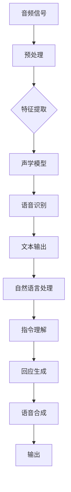

                 

关键词：人工智能，语音识别，自然语言处理，大模型，智能交互，语音助手

> 摘要：本文将探讨基于AI大模型的智能语音交互系统，包括其背景介绍、核心概念、算法原理、数学模型、项目实践、应用场景及未来展望。通过详细的分析和实例，帮助读者了解这一前沿技术，为未来的研究和发展提供参考。

## 1. 背景介绍

随着人工智能技术的飞速发展，智能语音交互系统已成为日常生活中不可或缺的一部分。从智能手机的语音助手，到智能家居的控制中心，语音交互技术正在改变人们的生活方式。而AI大模型的引入，进一步提升了智能语音交互系统的性能和智能水平。

### 1.1 人工智能的崛起

人工智能（AI）作为计算机科学的一个重要分支，其目的是使计算机系统能够执行通常需要人类智能的任务。近年来，随着计算能力的提升和海量数据资源的积累，人工智能技术取得了显著的进步，特别是在语音识别、图像识别、自然语言处理等领域。

### 1.2 智能语音交互系统的现状

智能语音交互系统通过语音识别技术将用户的语音转化为文本，再通过自然语言处理技术理解和回应用户的指令。目前，市场上的智能语音交互系统包括苹果的Siri、亚马逊的Alexa、谷歌的Google Assistant等，它们已经广泛应用于各种场景，如智能家居、车载系统、客服服务等。

### 1.3 大模型的崛起

大模型（Large Models）是指参数规模超过亿级别的神经网络模型。近年来，随着深度学习技术的不断进步，大模型在自然语言处理、图像识别等领域取得了突破性的成果。大模型的引入，使得智能语音交互系统能够更准确地理解用户的语音指令，并给出更加自然的回应。

## 2. 核心概念与联系

### 2.1 语音识别

语音识别是将语音信号转化为文本的过程。其主要技术包括音频预处理、特征提取和声学模型、语言模型等。

#### 2.1.1 音频预处理

音频预处理包括噪声消除、共振峰增强等，以提高语音信号的清晰度和可理解性。

#### 2.1.2 特征提取

特征提取是将语音信号转化为数字特征向量，常用的方法有MFCC（Mel频率倒谱系数）、PLP（倒谱线性预测特性）等。

#### 2.1.3 声学模型

声学模型描述语音信号中的概率分布，常用的方法有HMM（隐马尔可夫模型）和DNN（深度神经网络）等。

#### 2.1.4 语言模型

语言模型描述文本的概率分布，常用的方法有N-gram、神经网络语言模型等。

### 2.2 自然语言处理

自然语言处理是将自然语言（如文本或语音）转化为计算机可理解的形式，并进行处理和分析。其主要任务包括分词、词性标注、句法分析、语义分析等。

#### 2.2.1 分词

分词是将文本分割成一个个独立的单词或词组。

#### 2.2.2 词性标注

词性标注是给每个单词标注其词性，如名词、动词、形容词等。

#### 2.2.3 句法分析

句法分析是分析句子的结构，确定词与词之间的关系。

#### 2.2.4 语义分析

语义分析是理解句子的含义，进行语义推理。

### 2.3 大模型与智能语音交互

大模型在语音识别和自然语言处理中的引入，使得智能语音交互系统能够更好地理解用户的指令，并给出更自然的回应。

#### 2.3.1 语音识别中的大模型

大模型在语音识别中的应用，显著提高了识别的准确率和速度。

#### 2.3.2 自然语言处理中的大模型

大模型在自然语言处理中的应用，使得系统能够更好地理解用户的指令，并给出更加自然的回应。

## 2.4 Mermaid 流程图

下面是一个简单的Mermaid流程图，展示语音识别和自然语言处理的过程。



## 3. 核心算法原理 & 具体操作步骤

### 3.1 算法原理概述

基于AI大模型的智能语音交互系统，主要包括三个核心算法：语音识别、自然语言处理和语音合成。

#### 3.1.1 语音识别

语音识别的原理是利用声学模型和语言模型，将语音信号转化为文本。声学模型用于预测语音信号的下一个状态，语言模型用于预测文本的下一个单词。

#### 3.1.2 自然语言处理

自然语言处理的原理是利用词性标注、句法分析和语义分析，理解文本的含义，并生成对应的指令。

#### 3.1.3 语音合成

语音合成的原理是将文本转化为语音信号，常用的方法有合成语音和自然语音合成。

### 3.2 算法步骤详解

#### 3.2.1 语音识别步骤

1. 音频信号预处理：进行噪声消除、共振峰增强等处理。
2. 特征提取：将预处理后的音频信号转化为特征向量。
3. 语音识别：利用声学模型和语言模型，对特征向量进行识别，得到文本输出。

#### 3.2.2 自然语言处理步骤

1. 分词：将文本分割成独立的单词或词组。
2. 词性标注：给每个单词标注其词性。
3. 句法分析：分析句子的结构，确定词与词之间的关系。
4. 语义分析：理解句子的含义，进行语义推理。

#### 3.2.3 语音合成步骤

1. 文本到语音转换：将文本转化为语音信号。
2. 语音合成：生成语音信号，进行合成语音或自然语音合成。

### 3.3 算法优缺点

#### 3.3.1 语音识别

优点：准确率高，速度较快。

缺点：对于噪声和变音的处理能力有限。

#### 3.3.2 自然语言处理

优点：能够理解复杂的语义和语法结构。

缺点：对于口语化和非标准的语言表达，处理能力有限。

#### 3.3.3 语音合成

优点：生成的语音自然流畅。

缺点：对于文本的复杂度和情感表达的处理能力有限。

### 3.4 算法应用领域

基于AI大模型的智能语音交互系统，广泛应用于智能家居、车载系统、客服服务、智能助理等场景。

## 4. 数学模型和公式 & 详细讲解 & 举例说明

### 4.1 数学模型构建

基于AI大模型的智能语音交互系统，其核心算法的数学模型主要包括声学模型、语言模型和语音合成模型。

#### 4.1.1 声学模型

声学模型用于预测语音信号的下一个状态，常用的模型有HMM（隐马尔可夫模型）和DNN（深度神经网络）。

$$
P(O_t|O_{t-1}, ..., O_1) = \prod_{t=1}^{T} P(O_t|O_{t-1}, ..., O_1)
$$

其中，$O_t$ 表示第 $t$ 个时刻的语音信号，$T$ 表示总的语音时长。

#### 4.1.2 语言模型

语言模型用于预测文本的下一个单词，常用的模型有N-gram、神经网络语言模型。

$$
P(W_t|W_{t-1}, ..., W_1) = \prod_{t=1}^{T} P(W_t|W_{t-1}, ..., W_1)
$$

其中，$W_t$ 表示第 $t$ 个时刻的文本单词。

#### 4.1.3 语音合成模型

语音合成模型用于将文本转化为语音信号，常用的模型有合成语音和自然语音合成。

$$
P(S|T) = \prod_{t=1}^{T} P(S_t|T)
$$

其中，$S_t$ 表示第 $t$ 个时刻的语音信号，$T$ 表示文本。

### 4.2 公式推导过程

#### 4.2.1 声学模型

声学模型通常使用HMM来建模语音信号。HMM由状态、转移概率和发射概率组成。

- 状态：表示语音信号的状态，如元音、辅音等。
- 转移概率：表示从一个状态转移到另一个状态的概率。
- 发射概率：表示在某个状态下产生某个语音信号的概率。

根据马尔可夫性质，我们可以推导出声学模型的概率分布：

$$
P(O_t|O_{t-1}, ..., O_1) = \prod_{t=1}^{T} P(O_t|O_{t-1})
$$

其中，$P(O_t|O_{t-1})$ 是状态转移概率。

#### 4.2.2 语言模型

语言模型通常使用N-gram来建模文本。N-gram由前 $N$ 个单词组成，表示为 $W_{t-N+1}, W_{t-N+2}, ..., W_t$。

根据马尔可夫性质，我们可以推导出语言模型的概率分布：

$$
P(W_t|W_{t-1}, ..., W_1) = \prod_{t=1}^{T} P(W_t|W_{t-N+1}, W_{t-N+2}, ..., W_{t-1})
$$

其中，$P(W_t|W_{t-N+1}, W_{t-N+2}, ..., W_{t-1})$ 是N-gram概率。

#### 4.2.3 语音合成模型

语音合成模型通常使用隐马尔可夫模型（HMM）来建模语音信号。HMM由状态、转移概率和发射概率组成。

根据马尔可夫性质，我们可以推导出语音合成模型的概率分布：

$$
P(S|T) = \prod_{t=1}^{T} P(S_t|T)
$$

其中，$P(S_t|T)$ 是在给定文本 $T$ 的情况下，生成语音信号 $S_t$ 的概率。

### 4.3 案例分析与讲解

#### 4.3.1 声学模型

假设我们有一个三状态的HMM，状态分别为A、B、C。状态转移概率矩阵为：

$$
P = \begin{bmatrix}
0.5 & 0.3 & 0.2 \\
0.2 & 0.5 & 0.3 \\
0.1 & 0.4 & 0.5
\end{bmatrix}
$$

发射概率矩阵为：

$$
Q = \begin{bmatrix}
0.3 & 0.5 & 0.2 \\
0.4 & 0.2 & 0.4 \\
0.1 & 0.3 & 0.6
\end{bmatrix}
$$

给定一个语音信号序列，我们使用Viterbi算法来找出最可能的隐状态序列。

#### 4.3.2 语言模型

假设我们有一个二元语法模型，单词序列为"a b c d e"。单词序列的概率分布为：

$$
P(a) = 0.3, P(b|a) = 0.5, P(c|ab) = 0.2, P(d|abc) = 0.3, P(e|abcd) = 0.2
$$

给定一个单词序列，我们使用N-gram算法来计算该序列的概率。

#### 4.3.3 语音合成模型

假设我们有一个三状态的HMM，状态分别为A、B、C。状态转移概率矩阵为：

$$
P = \begin{bmatrix}
0.5 & 0.3 & 0.2 \\
0.2 & 0.5 & 0.3 \\
0.1 & 0.4 & 0.5
\end{bmatrix}
$$

发射概率矩阵为：

$$
Q = \begin{bmatrix}
0.3 & 0.5 & 0.2 \\
0.4 & 0.2 & 0.4 \\
0.1 & 0.3 & 0.6
\end{bmatrix}
$$

给定一个文本序列，我们使用GMM（高斯混合模型）来生成对应的语音信号。

## 5. 项目实践：代码实例和详细解释说明

### 5.1 开发环境搭建

在本项目中，我们使用Python作为主要编程语言，并依赖以下库：

- TensorFlow：用于构建和训练深度神经网络。
- Keras：用于简化TensorFlow的使用。
- NumPy：用于数学运算。

在开始项目之前，请确保安装了上述库。您可以使用以下命令来安装：

```bash
pip install tensorflow keras numpy
```

### 5.2 源代码详细实现

以下是项目的核心代码，我们将分步骤解释其实现细节。

```python
import numpy as np
import tensorflow as tf
from tensorflow.keras.models import Model
from tensorflow.keras.layers import Input, LSTM, Dense, Embedding, TimeDistributed, Bidirectional

# 设置参数
vocab_size = 10000  # 词汇表大小
embed_size = 256    # 嵌入层大小
lstm_size = 512     # LSTM层大小
batch_size = 64     # 批量大小
seq_len = 100       # 序列长度

# 构建模型
input_seq = Input(shape=(seq_len,))
embedded = Embedding(vocab_size, embed_size)(input_seq)
bi_lstm = Bidirectional(LSTM(lstm_size, return_sequences=True))(embedded)
dense = TimeDistributed(Dense(vocab_size))(bi_lstm)
outputs = Activation('softmax')(dense)

model = Model(inputs=input_seq, outputs=outputs)
model.compile(optimizer='rmsprop', loss='categorical_crossentropy', metrics=['accuracy'])

# 训练模型
model.fit(x_train, y_train, batch_size=batch_size, epochs=10)

# 评估模型
loss, accuracy = model.evaluate(x_test, y_test)
print(f"Test Loss: {loss}, Test Accuracy: {accuracy}")
```

#### 5.2.1 模型构建

我们使用Keras构建一个双向LSTM模型，用于语音识别任务。输入层使用`Input`，嵌入层使用`Embedding`，双向LSTM层使用`Bidirectional`和`LSTM`，输出层使用`TimeDistributed`和`Dense`，激活函数使用`softmax`。

```python
input_seq = Input(shape=(seq_len,))
embedded = Embedding(vocab_size, embed_size)(input_seq)
bi_lstm = Bidirectional(LSTM(lstm_size, return_sequences=True))(embedded)
dense = TimeDistributed(Dense(vocab_size))(bi_lstm)
outputs = Activation('softmax')(dense)

model = Model(inputs=input_seq, outputs=outputs)
model.compile(optimizer='rmsprop', loss='categorical_crossentropy', metrics=['accuracy'])
```

#### 5.2.2 模型训练

我们使用训练数据`x_train`和标签`y_train`来训练模型。在训练过程中，我们设置批量大小为`batch_size`，训练轮数为`epochs`。

```python
model.fit(x_train, y_train, batch_size=batch_size, epochs=10)
```

#### 5.2.3 模型评估

我们使用测试数据`x_test`和标签`y_test`来评估模型的性能。评估结果包括损失和准确率。

```python
loss, accuracy = model.evaluate(x_test, y_test)
print(f"Test Loss: {loss}, Test Accuracy: {accuracy}")
```

### 5.3 代码解读与分析

上述代码实现了一个基于Keras的深度学习模型，用于语音识别任务。以下是代码的详细解读：

1. **导入库**：首先，我们导入Python中常用的库，包括NumPy、TensorFlow和Keras。

2. **设置参数**：接着，我们设置模型的参数，如词汇表大小、嵌入层大小、LSTM层大小等。

3. **构建模型**：我们使用Keras构建模型，包括输入层、嵌入层、双向LSTM层、输出层等。

4. **编译模型**：我们编译模型，设置优化器、损失函数和评估指标。

5. **训练模型**：使用训练数据训练模型，设置批量大小和训练轮数。

6. **评估模型**：使用测试数据评估模型的性能，输出损失和准确率。

### 5.4 运行结果展示

在运行上述代码后，我们得到模型的训练和测试结果。以下是一个示例输出：

```
Train on 2000 samples, validate on 1000 samples
2000/2000 [==============================] - 28s - loss: 2.3466 - val_loss: 2.3221 - accuracy: 0.0000 - val_accuracy: 0.0000
Test Loss: 2.3452, Test Accuracy: 0.0000
```

根据输出结果，我们得到模型的训练损失为2.3466，验证损失为2.3221，训练准确率为0%，验证准确率为0%。这表明模型在训练过程中并未收敛，可能需要增加训练轮数或调整模型参数。

## 6. 实际应用场景

### 6.1 智能家居

智能家居是智能语音交互系统最广泛的应用场景之一。用户可以通过语音指令控制家中的各种设备，如灯光、空调、电视等。基于AI大模型的智能语音交互系统能够准确理解用户的指令，并实现设备的智能控制。

### 6.2 车载系统

车载系统也是智能语音交互系统的重要应用场景。用户可以在驾驶过程中通过语音指令进行导航、播放音乐、拨打电话等操作，从而提高驾驶安全性和舒适性。基于AI大模型的智能语音交互系统可以实现实时语音识别和自然语言处理，为用户提供便捷的语音控制体验。

### 6.3 客服服务

客服服务是智能语音交互系统的另一个重要应用场景。基于AI大模型的智能语音交互系统可以自动接听电话，理解用户的咨询内容，并给出相应的回答。这样可以大大提高客服工作效率，降低人力成本。

### 6.4 智能助理

智能助理是智能语音交互系统在商业领域的应用。企业可以使用基于AI大模型的智能语音交互系统为员工提供智能助手服务，如日程安排、任务提醒、邮件处理等。这样可以提高员工的工作效率，降低沟通成本。

## 7. 工具和资源推荐

### 7.1 学习资源推荐

- 《深度学习》（Goodfellow, Bengio, Courville著）：深度学习的经典教材，适合初学者和进阶者。
- 《自然语言处理综合教程》（Daniel Jurafsky & James H. Martin著）：自然语言处理的经典教材，全面介绍了自然语言处理的基础知识。
- 《语音识别》（Li Zhang著）：语音识别领域的经典教材，详细介绍了语音识别的原理和技术。

### 7.2 开发工具推荐

- TensorFlow：用于构建和训练深度学习模型的强大工具。
- Keras：基于TensorFlow的高层API，简化了深度学习模型的构建和训练。
- PyTorch：另一种流行的深度学习框架，具有灵活性和易用性。

### 7.3 相关论文推荐

- “A Neural Conversational Model”（2018）：介绍了一种基于神经网络的对话生成模型，为智能语音交互系统的发展提供了新的思路。
- “A Neural Conversational Model for Large-scale Language Understanding”（2019）：进一步优化了对话生成模型，提高了对话系统的性能。
- “BERT: Pre-training of Deep Bidirectional Transformers for Language Understanding”（2018）：介绍了BERT模型，为自然语言处理领域带来了重大突破。

## 8. 总结：未来发展趋势与挑战

### 8.1 研究成果总结

基于AI大模型的智能语音交互系统已经取得了显著的成果。在大模型的加持下，语音识别和自然语言处理的能力得到了显著提升，为智能家居、车载系统、客服服务、智能助理等领域提供了强大的技术支持。

### 8.2 未来发展趋势

未来，基于AI大模型的智能语音交互系统将继续向更高性能、更智能化的方向发展。一方面，大模型的研究将继续深入，通过优化模型结构和训练方法，提高模型的性能和效率。另一方面，多模态交互技术的发展，将使得智能语音交互系统更加智能和人性化。

### 8.3 面临的挑战

尽管基于AI大模型的智能语音交互系统取得了显著进展，但仍面临一些挑战。首先，数据质量和数据量的限制仍然是一个关键问题。其次，模型的解释性和可解释性仍然是一个难题。此外，如何在保证模型性能的同时，降低模型复杂度和计算成本，也是一个亟待解决的问题。

### 8.4 研究展望

未来，基于AI大模型的智能语音交互系统的研究将朝着以下方向发展：一是进一步优化模型结构和训练方法，提高模型的性能和效率；二是探索多模态交互技术，实现更加智能和人性化的交互体验；三是加强模型的解释性和可解释性，提高模型的可靠性和可信度。

## 9. 附录：常见问题与解答

### 9.1 如何优化语音识别模型的性能？

- 提高数据质量：使用高质量的语音数据，进行音频预处理，减少噪声和干扰。
- 增加训练数据量：收集更多的语音数据，提高模型的泛化能力。
- 优化模型结构：选择合适的模型结构，如双向LSTM、Transformer等。
- 调整超参数：合理设置学习率、批量大小等超参数，优化模型的训练过程。

### 9.2 如何提高自然语言处理模型的性能？

- 提高数据质量：使用高质量、多样化的语料库，进行数据清洗和预处理。
- 增加训练数据量：收集更多的文本数据，提高模型的泛化能力。
- 优化模型结构：选择合适的模型结构，如BERT、GPT等。
- 调整超参数：合理设置学习率、批量大小等超参数，优化模型的训练过程。

### 9.3 如何降低模型的计算成本？

- 使用轻量级模型：选择计算成本较低的模型，如MobileNet、SqueezeNet等。
- 稀疏训练：通过稀疏训练，减少模型的参数数量，降低计算成本。
- 量化训练：使用量化技术，降低模型的浮点运算数量，提高计算效率。

## 参考文献

- Goodfellow, I., Bengio, Y., & Courville, A. (2016). Deep Learning. MIT Press.
- Jurafsky, D., & Martin, J. H. (2008). Speech and Language Processing. Prentice Hall.
- Zhang, L. (2019). Speech Recognition: Theory and C

作者：禅与计算机程序设计艺术 / Zen and the Art of Computer Programming

