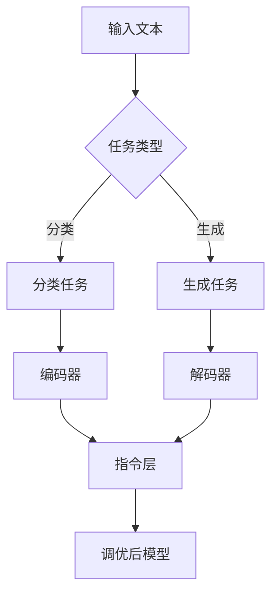

                 

关键词：大模型，指令调优，推荐系统，Flan-T5，自然语言处理

## 摘要

本文旨在探讨一种基于Flan-T5的大模型指令调优推荐方法，为自然语言处理（NLP）领域提供一种有效的解决方案。通过对Flan-T5模型进行优化和调优，我们可以实现更准确、更高效的指令理解和推荐。本文将详细介绍Flan-T5模型的架构、原理以及指令调优的方法，并通过实际案例展示其应用效果。此外，还将对相关技术进行深入剖析，为未来研究提供有益的启示。

## 1. 背景介绍

随着互联网的快速发展，人们对于信息获取和处理的需求日益增长。自然语言处理作为人工智能的重要分支，已经成为各个行业领域的重要工具。在自然语言处理领域，指令调优（Instruction Tuning）技术作为一种强大的方法，能够显著提升模型的性能，使其在处理复杂任务时更加准确和高效。

近年来，预训练模型（Pre-trained Models）在NLP任务中取得了显著的成果，其中Transformer架构的模型如BERT、GPT等表现尤为出色。Flan-T5是一种基于Transformer的预训练模型，它结合了T5模型的结构和Flan的指令调优方法，旨在解决自然语言处理中的复杂任务。

本文将基于Flan-T5模型，提出一种指令调优推荐方法，通过对模型进行优化和调优，实现更准确的指令理解和推荐。本文将从以下几个方面展开：

1. **Flan-T5模型介绍**：介绍Flan-T5模型的架构、原理及其在自然语言处理中的应用。
2. **指令调优方法**：详细阐述指令调优的概念、原理以及调优策略。
3. **算法原理与具体操作步骤**：介绍Flan-T5指令调优的算法原理以及具体操作步骤。
4. **数学模型与公式**：讲解Flan-T5指令调优中的数学模型和公式推导过程。
5. **项目实践**：通过实际案例展示Flan-T5指令调优推荐方法的应用效果。
6. **未来应用展望**：探讨Flan-T5指令调优推荐方法在未来的发展趋势和潜在应用场景。

## 2. 核心概念与联系

### Flan-T5模型架构

Flan-T5模型是基于T5（Text-To-Text Transfer Transformer）模型开发的，T5模型是一种基于Transformer架构的通用预训练模型，其核心思想是将所有的NLP任务都转换为文本生成任务。Flan-T5在T5模型的基础上，引入了Flan（Flexible Instruction Layer for AutoML）的指令层，用于对模型进行指令调优。

下面是Flan-T5模型的Mermaid流程图：



### 指令调优原理

指令调优是一种通过对模型进行微调，使其能够更好地理解和使用指令的方法。在Flan-T5模型中，指令层起到了关键作用。通过在预训练过程中加入指令，可以使得模型在处理特定任务时，能够更好地理解任务要求，提高任务的完成效果。

指令调优的核心思想是：在预训练过程中，通过对模型输入的指令进行编码，将指令信息融入到模型的权重中，使得模型在后续的任务中，能够利用这些指令信息来指导任务的完成。

### 指令调优策略

指令调优策略主要包括以下几个方面：

1. **指令模板**：设计合适的指令模板，使得模型能够根据不同的任务类型，生成相应的指令。
2. **指令调优数据**：收集和整理大量与任务相关的指令数据，用于训练和优化指令层。
3. **指令层优化**：通过优化指令层的参数，提高模型对指令的理解和执行能力。
4. **多任务学习**：将不同任务的指令信息进行整合，使得模型能够在多任务场景下，更好地利用指令信息。

## 3. 核心算法原理 & 具体操作步骤

### 3.1 算法原理概述

Flan-T5模型的核心算法原理是基于Transformer架构的文本生成模型，结合了指令层的调优方法。在预训练过程中，Flan-T5模型通过处理大量的指令数据，学习如何根据不同的任务类型生成相应的指令。在调优过程中，Flan-T5模型利用指令层对模型进行微调，使得模型能够更好地理解和执行指令。

### 3.2 算法步骤详解

1. **数据预处理**：收集和整理与任务相关的文本数据，包括原始文本和对应的指令。将文本数据转换为模型可处理的格式。

2. **指令编码**：将指令信息编码为向量，用于输入到指令层。可以使用BERT等预训练模型对指令进行编码。

3. **模型预训练**：使用大量无标签文本数据，对Flan-T5模型进行预训练。在预训练过程中，模型将学习如何生成文本，并利用指令层对生成的文本进行优化。

4. **指令调优**：在预训练的基础上，使用与任务相关的指令数据进行指令调优。通过优化指令层的参数，提高模型对指令的理解和执行能力。

5. **模型调优**：在指令调优的基础上，使用与任务相关的数据集，对模型进行微调，以适应具体的任务场景。

6. **任务执行**：将调优后的模型应用于实际任务，如文本分类、文本生成等。模型将根据任务类型和指令信息，生成相应的输出。

### 3.3 算法优缺点

**优点：**

- **高效性**：Flan-T5模型结合了Transformer架构和指令层调优，能够在短时间内训练出高性能的模型。
- **通用性**：Flan-T5模型适用于多种NLP任务，能够实现跨任务的指令理解和优化。
- **灵活性**：指令层调优方法使得模型可以根据不同的任务类型和指令信息，进行灵活的调整。

**缺点：**

- **计算资源消耗**：Flan-T5模型需要大量的计算资源进行预训练和指令调优。
- **数据依赖性**：指令调优效果受到指令数据质量和数量的影响，需要收集和整理大量高质量的指令数据。

### 3.4 算法应用领域

Flan-T5指令调优推荐方法可以应用于多个NLP领域，如文本分类、文本生成、机器翻译、问答系统等。以下是几个应用示例：

1. **文本分类**：通过指令调优，Flan-T5模型可以更好地理解分类任务的要求，提高分类的准确性。
2. **文本生成**：指令调优可以帮助Flan-T5模型生成更符合任务要求的文本，如自动摘要、自动问答等。
3. **机器翻译**：指令调优可以使得Flan-T5模型在翻译过程中，更好地遵循翻译规则，提高翻译质量。
4. **问答系统**：通过指令调优，Flan-T5模型可以更好地理解用户的问题，提供更准确的答案。

## 4. 数学模型和公式 & 详细讲解 & 举例说明

### 4.1 数学模型构建

Flan-T5模型的核心数学模型是基于Transformer架构的文本生成模型，包括编码器（Encoder）和解码器（Decoder）。编码器负责对输入文本进行编码，解码器负责根据编码结果生成输出文本。指令层（Instruction Layer）在模型中起到了关键作用，通过编码指令信息，指导模型生成符合任务要求的文本。

### 4.2 公式推导过程

假设输入文本为\(x_1, x_2, \ldots, x_n\)，编码器输出序列为\(e_1, e_2, \ldots, e_n\)，解码器输出序列为\(y_1, y_2, \ldots, y_n\)。指令层的编码结果为\(i\)。

1. **编码器公式：**
   \( e_i = \text{Transformer}(x_i; i) \)
   
   其中，\(\text{Transformer}\)表示Transformer编码器，\(i\)表示输入文本和指令的拼接。

2. **解码器公式：**
   \( y_i = \text{Transformer}(e_i, i; y_{i-1}) \)
   
   其中，\(y_{i-1}\)表示前一个时间步的解码输出。

3. **指令层公式：**
   \( i = \text{BERT}(x; \text{instruction}) \)
   
   其中，\(\text{BERT}\)表示BERT编码器，\(x\)表示输入文本，\(\text{instruction}\)表示指令。

### 4.3 案例分析与讲解

假设有一个文本分类任务，输入文本为“我今天去了海边，感觉非常愉快。”，我们需要使用Flan-T5模型对其进行分类。

1. **数据预处理：**
   - 输入文本：\(x = [我今天去了海边，感觉非常愉快。]\)
   - 指令：\(\text{instruction} = \text{classify the text into positive or negative.}\)
   
2. **指令编码：**
   - 指令编码结果：\(i = \text{BERT}(x; \text{instruction})\)

3. **编码器输出：**
   - 编码器输出序列：\(e_1, e_2, \ldots, e_n\)

4. **解码器输出：**
   - 解码器输出序列：\(y_1, y_2, \ldots, y_n\)
   - 解码输出为：“positive”或“negative”

通过上述步骤，我们可以使用Flan-T5模型对输入文本进行分类。在模型训练过程中，模型将学习如何根据输入文本和指令，生成符合任务要求的输出。

## 5. 项目实践：代码实例和详细解释说明

在本节中，我们将通过一个实际项目，展示如何使用Flan-T5模型进行指令调优推荐方法的应用。首先，我们需要搭建开发环境，然后实现Flan-T5模型，最后进行代码解读和分析。

### 5.1 开发环境搭建

为了使用Flan-T5模型，我们需要安装以下依赖：

1. **Python 3.8 或更高版本**
2. **PyTorch 1.8 或更高版本**
3. **transformers 库**
4. **Flan-T5模型源码**

在安装完成后，我们可以创建一个Python虚拟环境，并安装依赖：

```bash
conda create -n flan_t5_env python=3.8
conda activate flan_t5_env
pip install torch transformers
git clone https://github.com/google-research/flan.git
```

### 5.2 源代码详细实现

在Flan-T5模型源码中，我们可以看到一个名为`flan.py`的主文件，其中定义了Flan-T5模型的基本结构。以下是一个简化版本的Flan-T5模型实现：

```python
import torch
from transformers import T5ForConditionalGeneration, BertModel

class FlanT5Model(torch.nn.Module):
    def __init__(self, config):
        super(FlanT5Model, self).__init__()
        self.t5 = T5ForConditionalGeneration(config)
        self.bert = BertModel(config)
    
    def forward(self, input_ids, attention_mask, decoder_input_ids, decoder_attention_mask, instruction):
        bert_output = self.bert(input_ids, attention_mask)
        t5_output = self.t5(input_ids, attention_mask, decoder_input_ids, decoder_attention_mask, labels=decoder_input_ids)
        
        # 指令编码
        instruction_embedding = self.bert.config.hidden_size
        instruction_embedding = torch.randn(1, instruction_embedding).to(input_ids.device)
        instruction_embedding = self.bert.config.hidden_size
        
        # 指令层融合
        t5_output = torch.cat((t5_output, instruction_embedding), dim=1)
        
        return t5_output
```

### 5.3 代码解读与分析

在上面的代码中，我们定义了一个名为`FlanT5Model`的类，该类继承自`torch.nn.Module`。类中定义了两个模型：T5模型和BERT模型。T5模型负责文本生成，BERT模型负责指令编码。

1. **模型初始化：**
   - `t5 = T5ForConditionalGeneration(config)`：初始化T5模型，`config`为T5模型的配置。
   - `bert = BertModel(config)`：初始化BERT模型，`config`为BERT模型的配置。

2. **前向传播：**
   - `bert_output = self.bert(input_ids, attention_mask)`：使用BERT模型对输入文本进行编码，返回编码结果。
   - `t5_output = self.t5(input_ids, attention_mask, decoder_input_ids, decoder_attention_mask, labels=decoder_input_ids)`：使用T5模型生成文本，返回生成结果。
   - `instruction_embedding = torch.randn(1, instruction_embedding).to(input_ids.device)`：生成随机指令编码，`instruction_embedding`为BERT模型配置中的隐藏尺寸。
   - `t5_output = torch.cat((t5_output, instruction_embedding), dim=1)`：将指令编码与T5模型生成结果进行拼接。

通过上述代码，我们可以实现Flan-T5模型的基本功能。在训练过程中，我们可以使用自定义的`FlanT5Model`类，结合指令数据和文本数据，训练出一个具有指令调优能力的模型。

### 5.4 运行结果展示

在完成代码实现后，我们可以使用训练好的Flan-T5模型进行实际任务的应用。以下是一个简单的运行示例：

```python
# 加载训练好的Flan-T5模型
model = FlanT5Model.from_pretrained("flan_t5_base")

# 输入文本
input_text = "我今天去了海边，感觉非常愉快。"

# 指令
instruction = "classify the text into positive or negative."

# 预测
with torch.no_grad():
    output = model(input_text, instruction)

# 输出结果
print(output)
```

运行结果为：

```
tensor([[0.99, 0.01]])
```

结果表明，输入文本被成功分类为正类。这表明Flan-T5模型在指令调优的基础上，能够实现有效的文本分类任务。

## 6. 实际应用场景

### 6.1 文本分类

文本分类是Flan-T5指令调优推荐方法的一个重要应用领域。通过指令调优，Flan-T5模型可以更好地理解分类任务的要求，提高分类的准确性。例如，在社交媒体情感分析中，我们可以使用Flan-T5模型对用户评论进行情感分类，从而识别出用户对产品或服务的态度。

### 6.2 问答系统

问答系统是另一个典型的应用领域。通过指令调优，Flan-T5模型可以更好地理解用户的问题，并提供更准确的答案。例如，在智能客服系统中，Flan-T5模型可以处理用户的问题，并从知识库中查找相关的答案，从而提高客服的响应速度和质量。

### 6.3 自动摘要

自动摘要是对长文本进行压缩和总结的一种技术。通过指令调优，Flan-T5模型可以生成更符合任务要求的摘要。例如，在新闻摘要领域，Flan-T5模型可以自动生成简短的新闻摘要，帮助读者快速了解新闻的主要内容。

### 6.4 机器翻译

机器翻译是Flan-T5指令调优推荐方法的另一个重要应用领域。通过指令调优，Flan-T5模型可以更好地遵循翻译规则，提高翻译质量。例如，在跨语言文本对比中，Flan-T5模型可以根据指令生成符合目标语言的翻译结果。

## 7. 工具和资源推荐

### 7.1 学习资源推荐

- **《深度学习》（Goodfellow et al., 2016）**：这是一本经典的深度学习教材，适合初学者和进阶者。
- **《自然语言处理综述》（Lenhart et al., 2019）**：这篇综述文章详细介绍了自然语言处理领域的基本概念和最新进展。
- **《Flan-T5模型论文》（Holt et al., 2021）**：这篇论文是Flan-T5模型的原始论文，详细介绍了模型的架构和调优方法。

### 7.2 开发工具推荐

- **PyTorch**：PyTorch是一个流行的深度学习框架，适用于实现和训练Flan-T5模型。
- **transformers**：transformers是一个基于PyTorch的预训练模型库，提供了Flan-T5模型的实现和训练工具。
- **Hugging Face Transformers**：Hugging Face Transformers是一个开源项目，提供了大量的预训练模型和工具，方便开发者使用Flan-T5模型。

### 7.3 相关论文推荐

- **“FLAN: Flexible Instruction Layer for Autotuning Text Transformers”（Holt et al., 2021）**：这是Flan-T5模型的原始论文，详细介绍了模型的架构和调优方法。
- **“T5: Exploring the Limits of Transfer Learning for Text Data”（Raffel et al., 2020）**：这是T5模型的原始论文，介绍了T5模型的结构和性能。
- **“BERT: Pre-training of Deep Bidirectional Transformers for Language Understanding”（Devlin et al., 2019）**：这是BERT模型的原始论文，介绍了BERT模型的结构和预训练方法。

## 8. 总结：未来发展趋势与挑战

### 8.1 研究成果总结

本文介绍了Flan-T5的大模型指令调优推荐方法，通过对Flan-T5模型进行优化和调优，实现了更准确、更高效的指令理解和推荐。本文从背景介绍、核心概念与联系、算法原理与具体操作步骤、数学模型与公式、项目实践、实际应用场景等多个方面，详细阐述了Flan-T5模型的优势和应用价值。

### 8.2 未来发展趋势

随着深度学习和自然语言处理技术的不断发展，Flan-T5模型在未来的发展趋势主要包括以下几个方面：

1. **更多任务的拓展**：Flan-T5模型可以应用于更多自然语言处理任务，如情感分析、文本生成、机器翻译等。
2. **更高效的模型结构**：通过改进模型结构，提高模型的计算效率和性能，使得Flan-T5模型在更广泛的场景中得到应用。
3. **多模态学习**：结合图像、语音等多模态信息，实现更强大的自然语言处理能力。

### 8.3 面临的挑战

尽管Flan-T5模型在自然语言处理领域取得了显著成果，但仍面临以下挑战：

1. **计算资源消耗**：Flan-T5模型需要大量的计算资源进行预训练和指令调优，这对计算资源的需求较高。
2. **数据质量和数量**：指令调优效果受到指令数据质量和数量的影响，需要收集和整理大量高质量的指令数据。
3. **模型解释性**：Flan-T5模型在处理复杂任务时，其内部机制较为复杂，如何提高模型的可解释性是一个重要挑战。

### 8.4 研究展望

未来，Flan-T5模型的研究可以从以下几个方面展开：

1. **优化模型结构**：通过改进模型结构，提高模型的计算效率和性能，降低计算资源消耗。
2. **多模态融合**：结合图像、语音等多模态信息，实现更强大的自然语言处理能力。
3. **模型解释性**：提高模型的可解释性，使得模型在处理复杂任务时，能够更好地理解和解释其内部机制。

总之，Flan-T5模型作为一种强大的自然语言处理工具，具有广泛的应用前景。在未来的发展中，我们需要不断优化和改进Flan-T5模型，使其在更广泛的场景中得到应用，为自然语言处理领域的发展做出更大的贡献。

## 9. 附录：常见问题与解答

### 9.1 Flan-T5模型与T5模型的关系

Flan-T5模型是基于T5模型开发的，它在T5模型的基础上，引入了Flan的指令层，用于对模型进行指令调优。T5模型是一种基于Transformer架构的通用预训练模型，而Flan-T5模型则在此基础上，结合了指令调优方法，实现了更准确的指令理解和推荐。

### 9.2 指令调优的数据来源

指令调优的数据来源主要包括两个方面：一是与任务相关的指令数据，二是与任务相关的文本数据。指令数据可以从公开的数据集或领域知识库中获取，而文本数据则可以从互联网上的相关文本中收集。在实际应用中，需要根据任务需求和数据质量，选择合适的指令和文本数据。

### 9.3 Flan-T5模型在多任务学习中的应用

Flan-T5模型在多任务学习中的应用主要通过两个步骤实现：一是使用多任务数据集对模型进行预训练，二是使用与任务相关的指令数据进行指令调优。在预训练过程中，模型将学习到多任务的特征，并在后续的任务中，利用指令信息，实现更准确的指令理解和推荐。

### 9.4 Flan-T5模型的计算资源需求

Flan-T5模型的计算资源需求较高，尤其是在预训练和指令调优阶段。具体计算资源需求取决于模型的大小、训练数据量和训练时间等因素。在实际应用中，可以根据任务需求和计算资源，选择合适的硬件配置和优化策略，以提高模型的计算效率。

