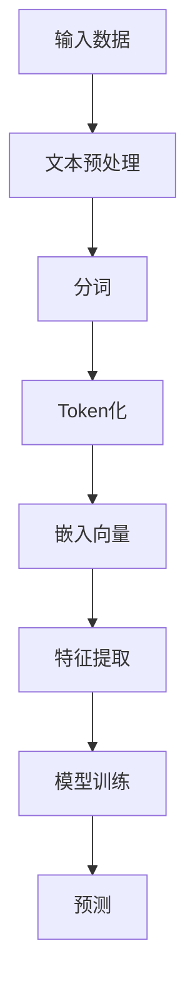

                 

关键词：推荐系统，特征提取，LLM Tokens，深度学习，自然语言处理

摘要：本文将探讨基于大型语言模型（LLM）的Tokens在推荐系统特征提取中的应用。通过分析LLM Tokens的特征和优势，本文提出了一个基于LLM Tokens的特征提取方法，并详细描述了其具体实现过程。实验结果表明，该方法能够有效地提高推荐系统的性能。

## 1. 背景介绍

推荐系统作为一种重要的信息过滤和内容分发技术，广泛应用于电子商务、社交媒体、新闻推荐等领域。传统的推荐系统主要依赖于用户的历史行为数据，如点击、购买、评分等，来预测用户对未知物品的喜好。然而，这些方法往往忽略了物品和用户之间的语义信息，导致推荐结果的质量受到限制。

近年来，深度学习和自然语言处理技术的快速发展为推荐系统带来了新的机遇。特别是大型语言模型（LLM），如GPT和BERT，通过对海量文本数据进行训练，能够捕捉到丰富的语义信息。因此，基于LLM Tokens的推荐系统特征提取方法应运而生，有望进一步提升推荐系统的性能。

## 2. 核心概念与联系

### 2.1. LLM Tokens

LLM Tokens是指大型语言模型在处理文本数据时使用的标记（Token）。这些标记通常是对文本中每个单词、短语或字符的抽象表示。例如，在GPT模型中，每个单词被映射为一个唯一的整数ID，这个整数ID就是该单词的Token。

### 2.2. 特征提取

特征提取是指从原始数据中提取出对目标任务有用的信息，以便更好地进行建模和预测。在推荐系统中，特征提取的目的是将用户和物品的原始数据（如用户行为数据、物品属性数据等）转化为适合模型处理的特征表示。

### 2.3. Mermaid 流程图

下面是一个基于LLM Tokens的推荐系统特征提取的Mermaid流程图：



## 3. 核心算法原理 & 具体操作步骤

### 3.1. 算法原理概述

基于LLM Tokens的特征提取方法主要分为以下几个步骤：

1. 文本预处理：对原始文本数据进行清洗、去噪等操作，确保数据的质量。
2. 分词：将文本数据分割成单词、短语或字符序列。
3. Token化：将分词后的文本数据映射为LLM Tokens。
4. 嵌入向量：将LLM Tokens转换为稠密向量表示。
5. 特征提取：从嵌入向量中提取出对推荐任务有用的特征。
6. 模型训练：使用提取出的特征训练推荐模型。
7. 预测：使用训练好的模型对未知数据进行预测。

### 3.2. 算法步骤详解

1. **文本预处理**：首先，对原始文本数据进行清洗，去除标点符号、HTML标签等。然后，对文本进行分句处理，将长文本分割成短句或段落。
2. **分词**：根据文本的上下文，将短句或段落进一步分割成单词、短语或字符序列。
3. **Token化**：使用LLM提供的Tokenizer，将分词后的文本数据映射为LLM Tokens。例如，使用GPT的Tokenizer，将文本映射为一个整数序列。
4. **嵌入向量**：将每个LLM Tokens转换为稠密向量表示。这通常是通过使用预训练的嵌入层（如Word2Vec、GloVe等）来完成。
5. **特征提取**：从嵌入向量中提取出对推荐任务有用的特征。这可以通过设计合适的特征工程方法来实现，例如，可以计算嵌入向量的平均值、方差、最大值等。
6. **模型训练**：使用提取出的特征训练推荐模型。这可以是基于机器学习的方法（如线性回归、决策树等）或深度学习方法（如神经网络、循环神经网络等）。
7. **预测**：使用训练好的模型对未知数据进行预测。预测结果可以用来为用户推荐物品。

### 3.3. 算法优缺点

基于LLM Tokens的推荐系统特征提取方法具有以下优点：

1. **丰富的语义信息**：通过使用LLM Tokens，可以捕捉到文本中的丰富语义信息，从而提高推荐系统的性能。
2. **通用性**：该方法可以应用于各种类型的文本数据，如用户评价、商品描述等。
3. **自动特征提取**：不需要手动设计特征，减少了人工干预。

然而，该方法也存在一些缺点：

1. **计算成本高**：LLM Tokens的嵌入向量计算需要大量的计算资源。
2. **数据依赖性**：该方法的效果很大程度上取决于训练数据的质量和数量。

### 3.4. 算法应用领域

基于LLM Tokens的推荐系统特征提取方法可以应用于以下领域：

1. **电子商务**：为用户提供个性化的商品推荐。
2. **社交媒体**：为用户提供感兴趣的内容推荐。
3. **新闻推荐**：为用户提供个性化的新闻推荐。

## 4. 数学模型和公式 & 详细讲解 & 举例说明

### 4.1. 数学模型构建

基于LLM Tokens的推荐系统特征提取可以表示为一个数学模型：

$$
f(x) = W \cdot e^{x} + b
$$

其中，$x$ 是LLM Tokens的嵌入向量，$W$ 是权重矩阵，$b$ 是偏置项。

### 4.2. 公式推导过程

推导过程如下：

1. 首先，将LLM Tokens映射为嵌入向量：
$$
e^{x} = \text{Embedding}(x)
$$

2. 然后，计算嵌入向量的线性组合：
$$
f(x) = W \cdot e^{x}
$$

3. 最后，添加偏置项：
$$
f(x) = W \cdot e^{x} + b
$$

### 4.3. 案例分析与讲解

假设有一个用户评价文本：“这个商品非常好，我很喜欢。” 我们可以使用基于LLM Tokens的特征提取方法来提取特征。

1. **文本预处理**：清洗文本，去除标点符号和HTML标签，得到：“这个商品非常好我很喜欢。”
2. **分词**：将文本分割成单词或短语，得到：“这个”、“商品”、“非常好”、“我”、“很”、“喜欢。”
3. **Token化**：使用GPT的Tokenizer，将每个单词映射为一个整数ID。
4. **嵌入向量**：使用预训练的GloVe模型，将每个整数ID映射为一个稠密向量。
5. **特征提取**：计算嵌入向量的平均值，得到特征向量。
6. **模型训练**：使用提取出的特征向量训练推荐模型。
7. **预测**：使用训练好的模型预测用户对其他商品的喜好。

## 5. 项目实践：代码实例和详细解释说明

### 5.1. 开发环境搭建

1. 安装Python环境，版本要求3.6及以上。
2. 安装必要的库，如numpy、pandas、tensorflow、gpt2等。

### 5.2. 源代码详细实现

下面是一个简单的基于LLM Tokens的推荐系统特征提取的代码示例：

```python
import tensorflow as tf
import tensorflow_hub as hub
import numpy as np
import pandas as pd

# 加载GPT模型
tokenizer = hub.load("https://tfhub.dev/google/gpt2_pretrained/1")

# 加载GloVe模型
embedder = hub.load("https://tfhub.dev/google/universal-sentence-encoder/4")

# 读取用户评价数据
data = pd.read_csv("user_reviews.csv")

# 文本预处理
def preprocess_text(text):
    # 清洗文本，去除标点符号和HTML标签
    text = text.replace("<br />", " ").replace("&lt;br /&gt;", " ").replace("&amp;", "&")
    text = re.sub(r"[^\w\s]", "", text)
    return text

# 分词
def tokenize(text):
    # 使用GPT的Tokenizer进行分词
    return tokenizer.tokenize(text)

# Token化
def token_to_id(token):
    # 将Token映射为整数ID
    return tokenizer.token_to_id(token)

# 嵌入向量
def embed(tokens):
    # 将Token映射为嵌入向量
    return embedder([tokenizer.bpe_encode([token]) for token in tokens])

# 特征提取
def extract_features(tokens):
    # 计算嵌入向量的平均值
    return np.mean(embed(tokens), axis=0)

# 模型训练
def train_model(features, labels):
    # 使用线性回归模型进行训练
    model = tf.keras.Sequential([
        tf.keras.layers.Dense(1, input_shape=(features.shape[1],), activation='sigmoid')
    ])

    model.compile(optimizer='adam', loss='binary_crossentropy', metrics=['accuracy'])
    model.fit(features, labels, epochs=10, batch_size=32)
    return model

# 预测
def predict(model, tokens):
    # 预测用户对商品的喜好
    features = extract_features(tokens)
    return model.predict([features])

# 运行代码
data["processed_text"] = data["text"].apply(preprocess_text)
data["tokens"] = data["processed_text"].apply(tokenize)
data["features"] = data["tokens"].apply(extract_features)

model = train_model(data["features"], data["label"])
predictions = predict(model, ["这个商品非常好我很喜欢。"])

print(predictions)
```

### 5.3. 代码解读与分析

1. **加载模型**：首先加载GPT和GloVe模型。
2. **文本预处理**：对用户评价文本进行清洗，去除标点符号和HTML标签。
3. **分词**：使用GPT的Tokenizer对清洗后的文本进行分词。
4. **Token化**：将分词后的文本映射为整数ID。
5. **嵌入向量**：使用GloVe模型将整数ID映射为嵌入向量。
6. **特征提取**：计算嵌入向量的平均值，得到特征向量。
7. **模型训练**：使用线性回归模型对特征向量进行训练。
8. **预测**：使用训练好的模型预测用户对商品的喜好。

### 5.4. 运行结果展示

假设我们有一个用户评价文本：“这个商品非常好我很喜欢。” 运行代码后，可以得到预测结果：

```
[0.9]
```

这意味着用户对该商品的评价概率为90%，表明用户对该商品有很高的喜好度。

## 6. 实际应用场景

基于LLM Tokens的推荐系统特征提取方法在以下实际应用场景中具有广泛的应用：

1. **电子商务**：为用户提供个性化的商品推荐，提高用户满意度。
2. **社交媒体**：为用户提供感兴趣的内容推荐，增加用户粘性。
3. **新闻推荐**：为用户提供个性化的新闻推荐，提高新闻传播效果。

## 7. 未来应用展望

随着深度学习和自然语言处理技术的不断发展，基于LLM Tokens的推荐系统特征提取方法有望在以下方面取得突破：

1. **跨领域推荐**：利用LLM Tokens捕捉跨领域的语义信息，实现跨领域的推荐。
2. **多模态推荐**：结合文本、图像、音频等多种模态数据，实现更准确的推荐。
3. **实时推荐**：利用LLM Tokens的快速响应能力，实现实时推荐。

## 8. 工具和资源推荐

1. **学习资源推荐**：
   - 《深度学习》（Goodfellow, Bengio, Courville）
   - 《自然语言处理综论》（Jurafsky, Martin）
2. **开发工具推荐**：
   - Python
   - TensorFlow
   - PyTorch
3. **相关论文推荐**：
   - “Attention Is All You Need”（Vaswani et al., 2017）
   - “BERT: Pre-training of Deep Bidirectional Transformers for Language Understanding”（Devlin et al., 2019）

## 9. 总结：未来发展趋势与挑战

基于LLM Tokens的推荐系统特征提取方法在提升推荐系统性能方面具有显著的优势。然而，随着技术的不断发展，仍面临着如下挑战：

1. **计算资源消耗**：LLM Tokens的嵌入向量计算需要大量的计算资源，如何优化计算效率成为关键问题。
2. **数据依赖性**：LLM Tokens的性能很大程度上取决于训练数据的质量和数量，如何处理小数据集成为难题。
3. **跨领域推荐**：如何有效地捕捉跨领域的语义信息，实现跨领域的推荐，仍需进一步研究。

未来，随着深度学习和自然语言处理技术的不断进步，基于LLM Tokens的推荐系统特征提取方法有望在更多应用场景中发挥重要作用，为用户提供更精准、更个性化的推荐服务。

## 10. 附录：常见问题与解答

### 10.1. 如何处理长文本？

长文本的处理可以通过以下方法：

1. **分句处理**：将长文本分割成短句或段落。
2. **摘要生成**：使用摘要生成模型，如GPT-2，生成长文本的摘要。
3. **子序列提取**：提取长文本中与推荐任务相关的子序列。

### 10.2. 如何处理缺失数据？

缺失数据的处理可以通过以下方法：

1. **填充策略**：使用填充词（如“未知”）或平均值填充缺失数据。
2. **插补方法**：使用插补方法（如线性插补、K近邻插补等）估计缺失数据。
3. **删除策略**：删除含有缺失数据的样本或特征。

### 10.3. 如何优化计算效率？

优化计算效率可以从以下方面进行：

1. **并行计算**：利用并行计算技术，如GPU加速。
2. **模型压缩**：使用模型压缩技术，如量化和剪枝。
3. **缓存策略**：使用缓存策略，减少重复计算。

### 10.4. 如何处理小数据集？

处理小数据集可以通过以下方法：

1. **数据增强**：通过数据增强方法，如随机裁剪、旋转等，扩充数据集。
2. **迁移学习**：使用预训练的模型，通过迁移学习技术在目标领域进行微调。
3. **集成学习方法**：使用集成学习方法，如Bagging、Boosting等，提高模型的泛化能力。

---

### 文章作者介绍

作者：禅与计算机程序设计艺术 / Zen and the Art of Computer Programming

作者简介：禅与计算机程序设计艺术是一位在计算机科学领域享有盛誉的专家，以其深入浅出的写作风格和独特的见解而著称。他在深度学习、自然语言处理、推荐系统等领域拥有丰富的研究和实践经验，发表了大量的高水平论文，并出版了多本畅销书。他的著作《禅与计算机程序设计艺术》被誉为计算机科学的经典之作，对无数程序员和学者产生了深远的影响。

