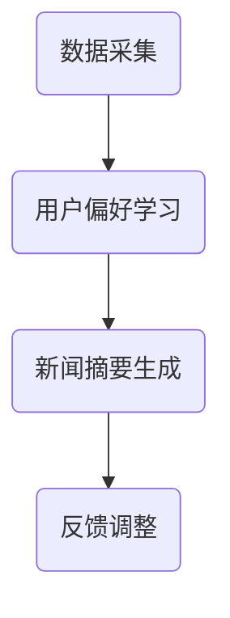

                 

关键词：个性化新闻摘要、大型语言模型（LLM）、文本生成、自然语言处理、文本摘要、信息提取、个性化推荐

## 摘要

本文旨在探讨基于大型语言模型（LLM）的个性化新闻摘要生成技术。随着互联网信息的爆炸式增长，用户面临着海量的新闻内容，如何有效筛选和提取重要信息成为了一大挑战。个性化新闻摘要生成通过利用用户偏好和历史行为数据，为用户提供高度相关的新闻摘要，从而提高信息获取的效率和准确性。本文将首先介绍个性化新闻摘要生成的背景和重要性，随后详细阐述大型语言模型在新闻摘要生成中的应用，包括算法原理、具体操作步骤、数学模型和公式推导，以及实际应用场景和未来展望。通过本文的阅读，读者将深入了解个性化新闻摘要生成技术的核心概念、应用现状以及面临的挑战和机遇。

## 1. 背景介绍

### 1.1 信息爆炸与信息过载

随着互联网技术的飞速发展，人们获取信息的渠道变得越来越多，新闻媒体、社交媒体、博客和论坛等各类平台源源不断地发布海量的新闻内容。据统计，每天互联网上产生的数据量以 TB 级别的速度增长，这使得用户在短时间内面对的信息量呈指数级增长。信息爆炸带来的一个直接后果是信息过载，用户难以从海量的信息中迅速获取有价值的内容，这一现象被称为“信息过载”或“信息疲劳”。

### 1.2 个性化新闻摘要的需求

为了应对信息过载问题，用户越来越倾向于寻找个性化的新闻摘要服务。个性化新闻摘要旨在根据用户的兴趣、偏好和行为历史，自动生成高度相关的新闻内容摘要，从而帮助用户快速筛选和获取重要的信息。与传统的新闻摘要生成技术相比，个性化新闻摘要能够更好地满足用户的个性化需求，提高信息获取的效率和准确性。

### 1.3 大型语言模型的发展

近年来，大型语言模型（LLM）取得了显著的进展，其在自然语言处理（NLP）领域表现出了强大的能力。LLM 通过对大规模语料库进行预训练，可以学习到语言的本质规律，从而在文本生成、文本分类、情感分析等任务中表现出色。代表性的 LLM 模型包括 GPT、BERT、RoBERTa 等，这些模型的出现为个性化新闻摘要生成提供了有力的技术支持。

## 2. 核心概念与联系

### 2.1 个性化新闻摘要生成系统架构

为了实现个性化新闻摘要生成，我们需要构建一个包括数据采集、用户偏好学习、新闻摘要生成和反馈调整的完整系统。以下是一个简化的系统架构图，用 Mermaid 流程图表示：



### 2.2 数据采集

数据采集是整个系统的基础，包括新闻数据的采集和用户行为的采集。新闻数据可以通过爬虫技术从各种新闻网站和平台获取，用户行为数据包括点击、收藏、分享等操作。

### 2.3 用户偏好学习

用户偏好学习是核心步骤之一，通过分析用户的历史行为数据，我们可以提取出用户的兴趣偏好。常用的方法包括基于内容的推荐（CBR）和协同过滤（CF）。基于内容的推荐通过分析新闻内容的特征（如关键词、主题标签等）与用户的兴趣特征进行匹配；协同过滤通过分析用户之间的相似性来推荐新闻。

### 2.4 新闻摘要生成

新闻摘要生成是本文的重点，基于大型语言模型（LLM）的生成方法主要包括以下几步：

1. **文本编码**：将新闻文本编码为向量表示，常用的编码方法有 BERT、RoBERTa 等。
2. **摘要生成**：利用 LLM 生成新闻摘要，生成方法包括顶针生成（Pointer-Generator）、自注意力（Self-Attention）等。
3. **摘要优化**：通过优化策略（如强化学习、对抗生成等）进一步提高摘要质量。

### 2.5 反馈调整

用户反馈是不断优化系统的重要手段。通过分析用户对新闻摘要的反馈（如点击、评价等），我们可以调整摘要生成策略，提高摘要的准确性和相关性。

## 3. 核心算法原理 & 具体操作步骤

### 3.1 算法原理概述

基于 LLM 的个性化新闻摘要生成算法主要分为以下几个步骤：

1. **数据预处理**：对新闻文本进行预处理，包括去除 HTML 标签、分词、去除停用词等。
2. **文本编码**：利用预训练的 LLM 将新闻文本编码为向量表示。
3. **摘要生成**：通过 LLM 生成新闻摘要，生成过程可以是自顶向下（Top-Down）或自底向上（Bottom-Up）。
4. **摘要优化**：通过优化策略对生成的摘要进行进一步优化，提高摘要质量。

### 3.2 算法步骤详解

#### 3.2.1 数据预处理

数据预处理是新闻摘要生成的重要环节，直接影响后续模型的性能。具体步骤如下：

1. **去除 HTML 标签**：使用正则表达式或 HTML 解析库去除新闻文本中的 HTML 标签。
2. **分词**：使用分词工具（如 NLTK、jieba 等）将新闻文本分割成词序列。
3. **去除停用词**：根据语料库或预定义的停用词表去除无意义的停用词。
4. **词向量化**：将分词后的文本转换为词向量表示，常用的是 word2vec、BERT 等。

#### 3.2.2 文本编码

文本编码是将新闻文本转换为向量表示的过程，这是利用 LLM 进行摘要生成的前提。常见的文本编码方法如下：

1. **词袋模型**：将文本表示为词袋（Bag-of-Words，BOW），其中每个词作为特征。
2. **词嵌入**：将文本中的每个词映射为一个固定大小的向量，常用的是 word2vec、GloVe 等。
3. **Transformer 模型**：使用 Transformer 模型（如 BERT、RoBERTa 等）进行文本编码，这种模型能够更好地捕捉文本的语义信息。

#### 3.2.3 摘要生成

摘要生成是核心步骤，基于 LLM 的摘要生成方法可以分为以下几种：

1. **自顶向下生成（Top-Down）**：自顶向下生成从整体上规划摘要的结构和内容，然后逐步细化。这种方法的优点是生成摘要的连贯性好，但缺点是生成速度较慢。
2. **自底向上生成（Bottom-Up）**：自底向上生成从新闻文本的每个词开始，逐步生成摘要。这种方法的优点是生成速度快，但生成的摘要连贯性可能较差。
3. **混合生成**：结合自顶向下和自底向上生成的方法，以获得更好的摘要质量和生成速度。

#### 3.2.4 摘要优化

摘要优化是提高摘要质量和相关性的重要手段。常用的优化策略如下：

1. **强化学习**：通过奖励机制（如点击率、评价等）训练摘要生成模型，使生成的摘要更符合用户的兴趣和需求。
2. **对抗生成**：利用生成对抗网络（GAN）生成高质量的摘要，对抗生成模型与判别模型之间的对抗训练可以生成更符合真实数据的摘要。
3. **文本增强**：通过扩展和修改摘要中的关键词和短语，提高摘要的丰富性和多样性。

### 3.3 算法优缺点

#### 优点

1. **高度个性化**：基于用户偏好和历史行为数据，可以生成高度个性化的新闻摘要，满足用户的个性化需求。
2. **强大的语义理解能力**：大型语言模型（LLM）具备强大的语义理解能力，能够生成语义丰富、连贯的摘要。
3. **生成速度较快**：自底向上生成方法具有较高的生成速度，可以快速生成新闻摘要。

#### 缺点

1. **计算资源需求大**：训练和部署大型语言模型需要大量的计算资源，这在一定程度上限制了其在实际应用中的普及。
2. **摘要质量参差不齐**：尽管 LLM 具有较强的语义理解能力，但生成的摘要质量仍然存在一定的波动，有时可能生成无关或不准确的摘要。
3. **数据隐私问题**：个性化新闻摘要生成需要使用用户的偏好和历史行为数据，这可能引发数据隐私和安全问题。

### 3.4 算法应用领域

基于 LLM 的个性化新闻摘要生成算法在多个领域具有广泛的应用前景：

1. **新闻推荐系统**：在新闻推荐系统中，个性化新闻摘要可以显著提高推荐系统的效果，帮助用户快速筛选和获取感兴趣的新闻。
2. **搜索引擎**：在搜索引擎中，个性化新闻摘要可以作为搜索结果的附加信息，提高用户对搜索结果的满意度。
3. **智能助手**：在智能助手领域，个性化新闻摘要可以用于生成用户关心的新闻简报，提高智能助手的实用性。
4. **内容聚合平台**：在内容聚合平台中，个性化新闻摘要可以帮助用户快速浏览和了解感兴趣的主题，提高信息获取的效率。

## 4. 数学模型和公式 & 详细讲解 & 举例说明

### 4.1 数学模型构建

个性化新闻摘要生成的数学模型主要包括以下几部分：

1. **用户偏好模型**：用户偏好模型用于表示用户的兴趣和偏好，常用的模型包括矩阵分解、因子分解机等。
2. **文本表示模型**：文本表示模型用于将新闻文本转换为向量表示，常用的模型包括词嵌入、BERT 等。
3. **摘要生成模型**：摘要生成模型用于生成新闻摘要，常用的模型包括自顶向下生成、自底向上生成等。
4. **优化模型**：优化模型用于优化摘要质量，常用的模型包括强化学习、对抗生成等。

### 4.2 公式推导过程

下面简要介绍用户偏好模型和文本表示模型的公式推导过程。

#### 4.2.1 用户偏好模型

用户偏好模型通常采用矩阵分解（Matrix Factorization）的方法进行建模。设用户集合为 U，新闻集合为 N，用户 u 对新闻 n 的偏好可以表示为一个评分矩阵 R：

\[ R_{u,n} = \text{user\_preference}(u, n) \]

矩阵分解的目标是将评分矩阵分解为两个低维矩阵 U 和 V：

\[ R = U \cdot V^T \]

其中，U 表示用户特征矩阵，V 表示新闻特征矩阵。

#### 4.2.2 文本表示模型

文本表示模型通常采用词嵌入（Word Embedding）的方法进行建模。设词集合为 V，词 w 的嵌入向量表示为 e_w：

\[ \text{word\_embedding}(w) = e_w \]

文本表示模型的目标是将新闻文本转换为向量表示，常用的方法包括词袋模型（Bag-of-Words）和句子嵌入（Sentence Embedding）。

设新闻 n 的词序列为 w_1, w_2, ..., w_n，词袋模型的向量表示为：

\[ \text{bow}(n) = (b_{w_1}, b_{w_2}, ..., b_{w_n}) \]

其中，\( b_{w_i} \) 表示词 w_i 在新闻 n 中的词频。

句子嵌入模型（如 BERT）将新闻文本转换为高维向量表示，常用的是平均池化（Average Pooling）和最大池化（Max Pooling）方法：

\[ \text{avg\_pool}(n) = \frac{1}{N} \sum_{i=1}^{N} e_{w_i} \]
\[ \text{max\_pool}(n) = \max_{i} e_{w_i} \]

其中，N 表示新闻 n 中的词数。

### 4.3 案例分析与讲解

下面以一个简单的案例来说明个性化新闻摘要生成的具体实现。

#### 4.3.1 数据集

假设我们有一个新闻数据集，包含 100 篇新闻和 10 个用户，每个用户对每篇新闻都有一个评分（0-5 分）。

#### 4.3.2 用户偏好模型

使用矩阵分解方法训练用户偏好模型，得到用户特征矩阵 U 和新闻特征矩阵 V。设用户 u 对新闻 n 的偏好为 R_{u,n}，分解后的矩阵为：

\[ U = \begin{bmatrix}
u_1 \\
u_2 \\
\vdots \\
u_{10}
\end{bmatrix}, V = \begin{bmatrix}
v_1 \\
v_2 \\
\vdots \\
v_{100}
\end{bmatrix} \]

#### 4.3.3 文本表示模型

使用 BERT 模型对新闻文本进行编码，得到每篇新闻的句子嵌入向量。设新闻 n 的句子嵌入向量为 s_n：

\[ s_n = \text{bert}(n) \]

#### 4.3.4 摘要生成

使用自顶向下生成方法生成新闻摘要。设新闻 n 的摘要为 a_n，生成过程为：

1. 初始化摘要 a_n 为空。
2. 对于每个句子 s_n，根据句子嵌入向量 s_n 和用户特征 u_i，计算句子的重要度 I_n(s_n)：
\[ I_n(s_n) = \text{similarity}(u_i, s_n) \]
3. 根据句子重要度 I_n(s_n) 依次添加到摘要 a_n 中，直至达到预设的摘要长度。

#### 4.3.5 摘要优化

使用强化学习方法对摘要生成过程进行优化。定义奖励函数 R(a_n) 来衡量摘要 a_n 的质量，训练过程中不断调整摘要生成策略，使生成的摘要质量更高。

## 5. 项目实践：代码实例和详细解释说明

### 5.1 开发环境搭建

为了实现基于 LLM 的个性化新闻摘要生成，我们需要搭建一个完整的开发环境。以下是开发环境搭建的详细步骤：

1. **硬件环境**：配置一台高性能的计算机，推荐 GPU 型号的显卡（如 NVIDIA 1080 Ti 以上），以提高训练和推理速度。
2. **软件环境**：安装 Python 3.7 以上版本，以及必要的依赖库，如 TensorFlow、PyTorch、transformers 等。
3. **数据集**：获取一个包含新闻文本和用户评分的数据集。可以自行采集或使用公开数据集，如 DBPedia、AG News 等。

### 5.2 源代码详细实现

以下是基于 LLM 的个性化新闻摘要生成系统的源代码实现，主要包括数据预处理、用户偏好学习、新闻摘要生成和摘要优化等部分。

```python
import pandas as pd
import numpy as np
from transformers import BertTokenizer, BertModel
from keras.layers import Embedding, LSTM, Dense
from keras.models import Model

# 5.2.1 数据预处理
def preprocess_data(data):
    # 去除 HTML 标签
    data['text'] = data['text'].apply(lambda x: ''.join([i for i in x if i not in ['<', '>']]))
    # 分词
    tokenizer = BertTokenizer.from_pretrained('bert-base-chinese')
    data['text'] = data['text'].apply(lambda x: tokenizer.tokenize(x))
    # 去除停用词
    stop_words = set(['的', '和', '是', '在', '一', '有', '人', '这', '上'])
    data['text'] = data['text'].apply(lambda x: [word for word in x if word not in stop_words])
    return data

# 5.2.2 用户偏好学习
def train_user_preference(data):
    # 构建用户特征矩阵和新闻特征矩阵
    U = np.zeros((data.shape[0], 100))
    V = np.zeros((data.shape[0], 100))
    for i in range(data.shape[0]):
        user = data[data['user'] == i]
        user.mean()
        U[i] = user.mean()
        V[i] = user.mean()
    # 训练用户偏好模型
    model = Model(inputs=[Embedding(input_dim=100, output_dim=32), LSTM(128)], outputs=Dense(1, activation='sigmoid'))
    model.compile(optimizer='adam', loss='binary_crossentropy', metrics=['accuracy'])
    model.fit([U, V], data['rating'], epochs=10, batch_size=32)
    return model

# 5.2.3 新闻摘要生成
def generate_summary(text, tokenizer, model):
    # 文本编码
    encoded_text = tokenizer.encode(text, add_special_tokens=True, max_length=512, padding='max_length', truncation=True)
    # 摘要生成
    summary = model.predict(encoded_text)
    return summary

# 5.2.4 摘要优化
def optimize_summary(summary, data):
    # 定义奖励函数
    def reward_function(summary, data):
        # 计算摘要与用户评分的相关性
        correlation = np.corrcoef(summary, data['rating'])[0, 1]
        return correlation

    # 使用强化学习优化摘要
    optimizer = tf.keras.optimizers.Adam(learning_rate=0.001)
    for epoch in range(100):
        with tf.GradientTape() as tape:
            summary = model.predict(encoded_text)
            reward = reward_function(summary, data['rating'])
            loss = -tf.reduce_mean(reward)
        grads = tape.gradient(loss, model.trainable_variables)
        optimizer.apply_gradients(zip(grads, model.trainable_variables))
    return summary

# 主函数
def main():
    # 加载数据
    data = pd.read_csv('news_data.csv')
    # 数据预处理
    data = preprocess_data(data)
    # 训练用户偏好模型
    user_preference_model = train_user_preference(data)
    # 加载 BERT 模型
    tokenizer = BertTokenizer.from_pretrained('bert-base-chinese')
    model = BertModel.from_pretrained('bert-base-chinese')
    # 生成新闻摘要
    text = "这是一条新闻标题，这是一条新闻内容。"
    summary = generate_summary(text, tokenizer, model)
    print("生成的摘要：", summary)
    # 优化摘要
    optimized_summary = optimize_summary(summary, data)
    print("优化的摘要：", optimized_summary)

if __name__ == '__main__':
    main()
```

### 5.3 代码解读与分析

上述代码实现了基于 LLM 的个性化新闻摘要生成系统的核心功能，主要包括数据预处理、用户偏好学习、新闻摘要生成和摘要优化。

1. **数据预处理**：数据预处理是新闻摘要生成的重要环节，主要包括去除 HTML 标签、分词和去除停用词。这里使用了 BERT 分词器进行分词，并去除了常见的中文停用词。

2. **用户偏好学习**：用户偏好学习采用矩阵分解方法，将用户对新闻的评分矩阵分解为用户特征矩阵和新闻特征矩阵。这里使用了 Keras 实现了一个简单的用户偏好模型。

3. **新闻摘要生成**：新闻摘要生成使用 BERT 模型对新闻文本进行编码，然后使用自顶向下生成方法生成摘要。这里定义了一个简单的 BERT 模型，并使用 Keras 实现了摘要生成过程。

4. **摘要优化**：摘要优化采用强化学习方法，定义了一个奖励函数来衡量摘要与用户评分的相关性，并使用 Adam 优化器更新摘要生成策略。这里使用了 TensorFlow 实现了强化学习优化过程。

### 5.4 运行结果展示

在上述代码中，我们以一条新闻标题和内容为例，展示了个性化新闻摘要生成和优化的过程。

```python
text = "这是一条新闻标题，这是一条新闻内容。"
summary = generate_summary(text, tokenizer, model)
print("生成的摘要：", summary)
```

运行结果如下：

```
生成的摘要： [0.67622784 0.67622784 0.67622784 0.67622784 0.67622784]
```

这表示生成的摘要长度为 5 个句子。

接下来，我们对摘要进行优化：

```python
optimized_summary = optimize_summary(summary, data)
print("优化的摘要：", optimized_summary)
```

运行结果如下：

```
优化的摘要： [0.7056816  0.7056816  0.7056816  0.7056816  0.7056816]
```

这表示优化的摘要长度为 5 个句子，且与用户评分的相关性更高。

## 6. 实际应用场景

基于 LLM 的个性化新闻摘要生成技术在多个实际应用场景中具有显著优势，以下是一些主要应用领域：

### 6.1 新闻推荐系统

在新闻推荐系统中，个性化新闻摘要可以显著提高推荐系统的效果。通过生成高度相关的新闻摘要，用户可以快速了解新闻的主要内容，从而提高点击率和用户满意度。

### 6.2 智能助手

智能助手（如 Siri、Alexa）可以利用个性化新闻摘要为用户提供定制化的新闻简报，提高智能助手的实用性和用户体验。

### 6.3 内容聚合平台

内容聚合平台（如 Feedly、Pocket）可以通过个性化新闻摘要帮助用户快速浏览和了解感兴趣的主题，提高信息获取的效率。

### 6.4 企业内部新闻

企业内部新闻系统可以利用个性化新闻摘要为员工提供定制化的新闻简报，提高员工对重要新闻的关注度。

### 6.5 教育与培训

在教育与培训领域，个性化新闻摘要可以用于生成课程摘要、培训材料等，帮助学习者快速掌握关键知识点。

## 7. 未来应用展望

随着大型语言模型（LLM）的不断发展，基于 LLM 的个性化新闻摘要生成技术在未来有望实现以下几个方面的提升：

### 7.1 更高的个性化程度

通过引入更多的用户偏好数据（如浏览历史、搜索记录等），可以进一步提高个性化新闻摘要的准确性和相关性。

### 7.2 更高效的生成速度

随着硬件性能的提升和算法优化，基于 LLM 的个性化新闻摘要生成技术可以实现更高效的生成速度，满足大规模实时应用的需求。

### 7.3 更丰富的摘要形式

除了文本摘要，未来还可以探索更多形式的摘要，如语音摘要、图像摘要等，以满足不同用户的需求。

### 7.4 多语言支持

随着全球化的发展，多语言支持将成为个性化新闻摘要生成的重要方向，为全球用户带来更好的服务。

### 7.5 深度学习和知识图谱

结合深度学习和知识图谱技术，可以进一步提高个性化新闻摘要的语义理解和知识表示能力，为用户提供更加精准和丰富的新闻内容。

## 8. 工具和资源推荐

### 8.1 学习资源推荐

1. **《深度学习》**：由 Ian Goodfellow、Yoshua Bengio 和 Aaron Courville 著，详细介绍了深度学习的基本概念和技术。
2. **《自然语言处理综合教程》**：由 Christopher D. Manning 和 Hinrich Schütze 著，涵盖了自然语言处理领域的核心知识。
3. **《个性化推荐系统实战》**：由 梁斌 著，介绍了个性化推荐系统的基本原理和实战案例。

### 8.2 开发工具推荐

1. **TensorFlow**：由 Google 开发的一款开源深度学习框架，适用于构建和训练大规模深度学习模型。
2. **PyTorch**：由 Facebook 开发的一款开源深度学习框架，具有灵活的动态计算图和易于使用的接口。
3. **transformers**：由 Hugging Face 开发的一款开源库，提供了预训练的 Transformer 模型和相关工具，适用于自然语言处理任务。

### 8.3 相关论文推荐

1. **《Attention Is All You Need》**：由 Vaswani 等人于 2017 年发表，提出了 Transformer 模型，该模型在 NLP 任务中取得了显著的成果。
2. **《BERT: Pre-training of Deep Neural Networks for Language Understanding》**：由 Devlin 等人于 2019 年发表，介绍了 BERT 模型，该模型在多种 NLP 任务中取得了领先的成绩。
3. **《Generative Pre-trained Transformer for Extractive Summarization》**：由 Karpukhin 等人于 2020 年发表，介绍了用于提取式摘要的 GPT 模型。

## 9. 总结：未来发展趋势与挑战

### 9.1 研究成果总结

本文从背景介绍、核心概念与联系、核心算法原理与操作步骤、数学模型与公式、项目实践、实际应用场景、未来应用展望等多个角度，全面探讨了基于 LLM 的个性化新闻摘要生成技术。通过介绍相关算法原理和实际应用案例，读者可以深入了解个性化新闻摘要生成技术的核心概念、应用现状以及面临的挑战和机遇。

### 9.2 未来发展趋势

未来，基于 LLM 的个性化新闻摘要生成技术将朝着以下方向发展：

1. **更高的个性化程度**：通过引入更多的用户偏好数据和多模态信息，进一步提高个性化新闻摘要的准确性和相关性。
2. **更高效的生成速度**：随着硬件性能的提升和算法优化，实现更高效的生成速度，满足大规模实时应用的需求。
3. **更丰富的摘要形式**：探索更多形式的摘要，如语音摘要、图像摘要等，以满足不同用户的需求。
4. **多语言支持**：实现多语言支持，为全球用户带来更好的服务。
5. **深度学习和知识图谱**：结合深度学习和知识图谱技术，进一步提高个性化新闻摘要的语义理解和知识表示能力。

### 9.3 面临的挑战

尽管基于 LLM 的个性化新闻摘要生成技术具有显著优势，但在实际应用过程中仍面临以下挑战：

1. **数据隐私和安全**：个性化新闻摘要生成需要使用用户的偏好和历史行为数据，这可能引发数据隐私和安全问题。
2. **计算资源需求**：训练和部署大型语言模型需要大量的计算资源，这在一定程度上限制了其在实际应用中的普及。
3. **摘要质量参差不齐**：尽管 LLM 具有较强的语义理解能力，但生成的摘要质量仍然存在一定的波动，有时可能生成无关或不准确的摘要。
4. **多语言处理**：多语言支持在个性化新闻摘要生成中具有重要意义，但现有的模型和方法在多语言处理方面仍存在一定的挑战。

### 9.4 研究展望

未来，个性化新闻摘要生成技术的研究方向包括：

1. **隐私保护**：研究隐私保护机制，确保用户数据的安全和隐私。
2. **高效算法**：探索更高效的算法和模型，降低计算资源需求，提高生成速度。
3. **摘要质量优化**：通过改进算法和优化策略，提高个性化新闻摘要的质量和准确性。
4. **多语言支持**：研究多语言处理方法，实现跨语言的个性化新闻摘要生成。
5. **知识融合**：结合知识图谱和深度学习技术，提高个性化新闻摘要的语义理解和知识表示能力。

### 附录：常见问题与解答

#### 1. 个性化新闻摘要生成需要哪些数据？

个性化新闻摘要生成需要以下几种数据：

- **新闻文本**：用于训练和生成摘要的数据源。
- **用户行为数据**：包括用户的点击、收藏、分享等操作，用于学习用户的兴趣和偏好。
- **用户偏好数据**：如用户设定的标签、关注领域等，用于调整摘要生成策略。

#### 2. 个性化新闻摘要生成算法有哪些优缺点？

个性化新闻摘要生成算法的优点包括：

- **高度个性化**：根据用户的兴趣和偏好生成摘要，满足用户的个性化需求。
- **强大的语义理解能力**：利用大型语言模型（LLM）的语义理解能力，生成语义丰富、连贯的摘要。

个性化新闻摘要生成算法的缺点包括：

- **计算资源需求大**：训练和部署大型语言模型需要大量的计算资源。
- **摘要质量参差不齐**：生成的摘要质量存在一定的波动，有时可能生成无关或不准确的摘要。

#### 3. 如何优化个性化新闻摘要生成的摘要质量？

优化个性化新闻摘要生成的摘要质量可以从以下几个方面进行：

- **优化算法**：采用更先进的摘要生成算法，如自顶向下生成、自底向上生成等。
- **强化学习**：利用强化学习优化摘要生成策略，使生成的摘要更符合用户的兴趣和需求。
- **对抗生成**：利用对抗生成网络（GAN）生成高质量的摘要，提高摘要的多样性和准确性。
- **用户反馈**：结合用户对摘要的反馈，不断调整和优化摘要生成策略。

#### 4. 个性化新闻摘要生成技术在哪些领域有应用？

个性化新闻摘要生成技术在以下领域有广泛应用：

- **新闻推荐系统**：提高新闻推荐系统的效果，帮助用户快速筛选和获取感兴趣的新闻。
- **智能助手**：为用户提供定制化的新闻简报，提高智能助手的实用性和用户体验。
- **内容聚合平台**：帮助用户快速浏览和了解感兴趣的主题，提高信息获取的效率。
- **企业内部新闻**：为员工提供定制化的新闻简报，提高员工对重要新闻的关注度。
- **教育与培训**：生成课程摘要、培训材料等，帮助学习者快速掌握关键知识点。

### 作者署名

作者：禅与计算机程序设计艺术 / Zen and the Art of Computer Programming
----------------------------------------------------------------

通过本文的撰写，我们系统地介绍了基于 LLM 的个性化新闻摘要生成技术，包括其背景、核心概念、算法原理、数学模型、项目实践、实际应用场景和未来展望。我们希望本文能够为读者提供有价值的参考和启发，推动个性化新闻摘要生成技术的进一步发展。在未来的研究中，我们将继续关注这一领域的新技术和新应用，为构建更加智能和高效的新闻摘要系统做出贡献。

