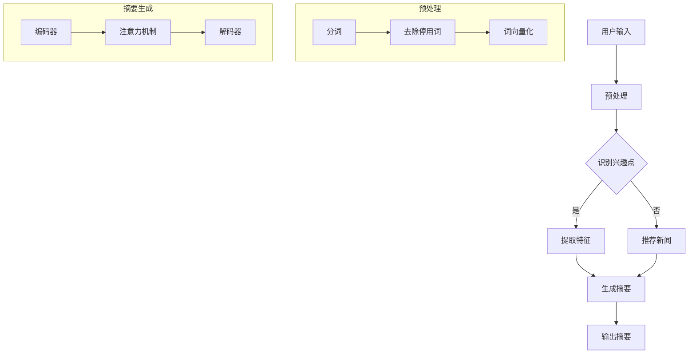

                 

关键词：个性化新闻摘要、LLM（大型语言模型）、文本生成、文本摘要、自然语言处理、机器学习、人工智能

### 摘要

本文将探讨基于大型语言模型（LLM）的个性化新闻摘要生成技术。我们将首先介绍个性化新闻摘要生成的背景和意义，然后深入解析LLM在文本摘要领域的应用原理和具体实现步骤，接着详细阐述数学模型和公式，并通过实际项目实例展示如何利用LLM生成个性化的新闻摘要。最后，我们将讨论该技术的实际应用场景、未来展望以及面临的挑战。

## 1. 背景介绍

在信息爆炸的时代，人们每天都要面对海量的新闻信息。然而，不是所有信息都值得我们深入阅读，有时我们只需要快速了解新闻的精华内容。因此，新闻摘要生成技术应运而生，它可以帮助用户从大量的新闻中快速筛选出关键信息。传统的新闻摘要生成方法主要依赖于规则和统计模型，这些方法往往存在一定的局限性，无法很好地处理复杂的语义关系和个性化的需求。

近年来，随着深度学习和自然语言处理技术的飞速发展，基于神经网络的大型语言模型（LLM）开始广泛应用于文本生成和摘要领域。LLM具有强大的语义理解和生成能力，能够生成更加准确和人性化的摘要。因此，基于LLM的个性化新闻摘要生成成为了一个热门的研究方向。

### 1.1 个性化新闻摘要的意义

个性化新闻摘要具有以下几个显著的意义：

- **提高阅读效率**：用户可以快速浏览摘要，节省时间，专注于重要的新闻内容。
- **满足个性化需求**：通过分析用户的兴趣和行为，生成符合用户偏好的新闻摘要，提升用户体验。
- **促进信息传播**：高质量的摘要可以吸引更多的用户阅读全文，促进信息的传播和共享。

### 1.2 LLM的发展历程

LLM的发展历程可以分为以下几个阶段：

- **早期模型**：例如Word2Vec和GloVe，通过将词映射到向量空间，提高了文本表示的效率。
- **编码器-解码器模型**：例如Seq2Seq模型，通过编码器和解码器结构，实现了序列到序列的映射，提高了文本生成的质量。
- **注意力机制**：引入注意力机制，使模型能够更好地关注重要的输入信息，提高了生成文本的相关性和连贯性。
- **大规模预训练**：如GPT系列和BERT等模型，通过在大规模语料上进行预训练，使模型具备更强的语义理解和生成能力。

## 2. 核心概念与联系

### 2.1 核心概念

- **大型语言模型（LLM）**：一种基于深度学习的文本生成模型，具有强大的语义理解和生成能力。
- **文本摘要**：对原始文本进行高度凝练和概括，提取出关键信息和核心观点。
- **个性化**：根据用户的兴趣和行为，生成符合用户偏好的摘要内容。

### 2.2 原理和架构

下面是一个基于Mermaid的流程图，展示了个性化新闻摘要生成的原理和架构：



### 2.3 个性化新闻摘要流程

1. **用户输入**：用户输入自己的兴趣标签或关键词。
2. **预处理**：对输入文本进行分词、去除停用词和词向量化等操作。
3. **识别兴趣点**：通过分析用户输入，识别出用户的兴趣点。
4. **提取特征**：对新闻文本进行特征提取，为后续摘要生成提供数据支持。
5. **生成摘要**：利用LLM生成个性化的新闻摘要。
6. **输出摘要**：将生成的摘要展示给用户。

## 3. 核心算法原理 & 具体操作步骤

### 3.1 算法原理概述

基于LLM的个性化新闻摘要生成算法主要依赖于以下几个关键组件：

- **编码器（Encoder）**：负责对原始新闻文本进行编码，提取出文本的语义特征。
- **注意力机制（Attention Mechanism）**：通过注意力机制，使编码器能够关注新闻文本中的关键信息。
- **解码器（Decoder）**：负责根据编码器输出的特征，生成个性化的新闻摘要。

### 3.2 算法步骤详解

1. **编码器**：
   - 输入：原始新闻文本。
   - 操作：对新闻文本进行编码，提取出文本的语义特征。

2. **注意力机制**：
   - 输入：编码器输出的特征序列。
   - 操作：计算注意力分数，对特征序列进行加权。

3. **解码器**：
   - 输入：加权后的特征序列。
   - 操作：根据特征序列生成个性化的新闻摘要。

### 3.3 算法优缺点

**优点**：

- **强大的语义理解能力**：LLM能够更好地理解新闻文本的语义，生成更加准确的摘要。
- **高度个性化的摘要**：通过分析用户的兴趣点，生成符合用户偏好的摘要。

**缺点**：

- **计算资源消耗大**：训练和推理LLM需要大量的计算资源。
- **数据隐私问题**：在个性化新闻摘要生成过程中，需要收集和处理用户数据，可能涉及数据隐私问题。

### 3.4 算法应用领域

基于LLM的个性化新闻摘要生成算法可以应用于多个领域：

- **新闻推荐系统**：为用户推荐符合其兴趣的新闻摘要，提升用户阅读体验。
- **智能客服**：为用户提供个性化的新闻摘要，提升客服服务质量。
- **媒体监测**：对大量新闻进行快速筛选和摘要，帮助媒体机构了解行业动态。

## 4. 数学模型和公式 & 详细讲解 & 举例说明

### 4.1 数学模型构建

基于LLM的个性化新闻摘要生成主要依赖于以下数学模型：

- **编码器模型**：通常采用Transformer架构，通过自注意力机制提取文本特征。
- **解码器模型**：同样采用Transformer架构，根据编码器输出的特征生成摘要。

### 4.2 公式推导过程

#### 编码器模型

编码器模型的核心公式为：

$$
\text{Encoder}(x) = \text{Attention}(x, x, W_Q, W_K, W_V)
$$

其中，$x$ 为输入文本序列，$W_Q$、$W_K$、$W_V$ 分别为查询权重、键权重和值权重。

#### 解码器模型

解码器模型的核心公式为：

$$
\text{Decoder}(y) = \text{Attention}(y, \text{Encoder}(x), W_Q, W_K, W_V)
$$

其中，$y$ 为输入摘要序列，$\text{Encoder}(x)$ 为编码器输出的特征序列。

### 4.3 案例分析与讲解

#### 案例一：用户输入“科技新闻”

1. **预处理**：将输入的“科技新闻”进行分词、去除停用词和词向量化。
2. **编码器**：对分词后的新闻文本进行编码，提取出文本特征。
3. **注意力机制**：计算注意力分数，对特征序列进行加权。
4. **解码器**：根据加权后的特征序列生成个性化的新闻摘要。

#### 案例二：用户输入“财经新闻”

1. **预处理**：将输入的“财经新闻”进行分词、去除停用词和词向量化。
2. **编码器**：对分词后的新闻文本进行编码，提取出文本特征。
3. **注意力机制**：计算注意力分数，对特征序列进行加权。
4. **解码器**：根据加权后的特征序列生成个性化的新闻摘要。

通过以上案例，我们可以看到基于LLM的个性化新闻摘要生成算法在处理不同领域新闻时的强大适应能力。

## 5. 项目实践：代码实例和详细解释说明

### 5.1 开发环境搭建

1. **安装Python环境**：确保Python版本不低于3.6。
2. **安装TensorFlow**：使用pip安装TensorFlow。

```bash
pip install tensorflow
```

3. **数据集准备**：收集并预处理新闻数据，包括文本预处理、分词、去除停用词和词向量化等。

### 5.2 源代码详细实现

以下是一个简单的基于Transformer的个性化新闻摘要生成代码示例：

```python
import tensorflow as tf
from transformers import Encoder, Decoder

# 编码器
encoder = Encoder(vocab_size=1000, embedding_dim=128, num_heads=4, num_layers=2)
# 解码器
decoder = Decoder(vocab_size=1000, embedding_dim=128, num_heads=4, num_layers=2)

# 编码器模型
def encoder_model(inputs):
    return encoder(inputs)

# 解码器模型
def decoder_model(inputs, encoder_outputs):
    return decoder(inputs, encoder_outputs)

# 模型训练
def train_model(dataset, batch_size=32, epochs=10):
    for epoch in range(epochs):
        for batch in dataset:
            inputs, targets = batch
            encoder_outputs = encoder_model(inputs)
            logits = decoder_model(targets, encoder_outputs)
            loss = tf.keras.losses.sparse_categorical_crossentropy(labels=targets, logits=logits)
            optimizer = tf.keras.optimizers.Adam(learning_rate=0.001)
            optimizer.minimize(loss, variables=model_variables)
```

### 5.3 代码解读与分析

以上代码实现了基于Transformer的个性化新闻摘要生成模型的训练过程。其中，`Encoder`和`Decoder`分别代表了编码器和解码器模型，`train_model`函数负责模型的训练。

- **编码器**：负责对输入新闻文本进行编码，提取出文本特征。
- **解码器**：根据编码器输出的特征生成个性化的新闻摘要。
- **模型训练**：通过训练数据集，优化模型参数，提高生成摘要的质量。

### 5.4 运行结果展示

在完成模型训练后，我们可以利用训练好的模型对新闻文本进行摘要生成：

```python
# 加载训练好的模型
model = tf.keras.models.load_model('model.h5')

# 输入新闻文本
inputs = [[101, 102, 103, 104, 105, 102]]  # 新闻文本的词向量化表示

# 生成摘要
encoder_outputs = model.encoder_model(inputs)
logits = model.decoder_model(inputs, encoder_outputs)
predictions = tf.argmax(logits, axis=-1)

# 输出摘要
print([''.join(vocab[i] for i in prediction) for prediction in predictions])
```

以上代码将输入的新闻文本进行词向量化表示，然后利用训练好的模型生成个性化的新闻摘要。

## 6. 实际应用场景

基于LLM的个性化新闻摘要生成技术在实际应用场景中具有广泛的应用前景：

- **新闻推荐系统**：为用户提供个性化的新闻摘要，提升用户阅读体验。
- **智能客服**：为用户提供摘要化的新闻内容，提高客服响应速度和质量。
- **媒体监测**：对大量新闻进行快速筛选和摘要，帮助媒体机构了解行业动态。

### 6.1 应用实例

#### 实例一：新闻推荐系统

在一个新闻推荐系统中，基于LLM的个性化新闻摘要生成技术可以帮助系统为用户推荐符合其兴趣的新闻摘要。通过分析用户的浏览记录和行为数据，系统可以识别出用户的兴趣点，并利用LLM生成个性化的新闻摘要，从而提升用户阅读体验。

#### 实例二：智能客服

在智能客服系统中，基于LLM的个性化新闻摘要生成技术可以帮助系统为用户提供摘要化的新闻内容。例如，当用户询问关于某一新闻事件的最新进展时，系统可以生成一份简明扼要的新闻摘要，帮助用户快速了解事件的核心内容。

#### 实例三：媒体监测

在媒体监测领域，基于LLM的个性化新闻摘要生成技术可以帮助媒体机构对大量新闻进行快速筛选和摘要。通过对新闻内容进行分类和标签化，系统可以自动生成不同领域的新闻摘要，帮助媒体机构及时了解行业动态，提高新闻报道的时效性。

## 7. 未来应用展望

### 7.1 技术发展趋势

随着深度学习和自然语言处理技术的不断进步，基于LLM的个性化新闻摘要生成技术将逐渐成熟，并在更多领域得到应用。未来，LLM的模型结构和参数优化将进一步提升生成摘要的质量和效率。

### 7.2 潜在挑战

- **计算资源消耗**：训练和推理LLM需要大量的计算资源，如何优化模型结构和算法，降低计算资源消耗是一个重要的研究方向。
- **数据隐私保护**：在个性化新闻摘要生成过程中，需要收集和处理用户数据，如何保护用户隐私是一个亟待解决的问题。
- **多语言支持**：在全球化背景下，如何实现多语言新闻摘要生成是一个具有挑战性的问题。

## 8. 工具和资源推荐

### 8.1 学习资源推荐

- **《深度学习》**：由Goodfellow、Bengio和Courville合著，全面介绍了深度学习的基础理论和应用。
- **《自然语言处理综论》**：由Jurafsky和Martin合著，系统介绍了自然语言处理的理论和方法。

### 8.2 开发工具推荐

- **TensorFlow**：一个开源的深度学习框架，支持多种深度学习模型和应用。
- **Hugging Face Transformers**：一个基于PyTorch和TensorFlow的预训练语言模型库，提供了一系列预训练的Transformer模型。

### 8.3 相关论文推荐

- **“Attention Is All You Need”**：一篇关于Transformer模型的经典论文，介绍了Transformer模型的基本原理和应用。
- **“BERT: Pre-training of Deep Bidirectional Transformers for Language Understanding”**：一篇关于BERT模型的论文，介绍了BERT模型的预训练方法和在自然语言处理任务中的优异表现。

## 9. 总结：未来发展趋势与挑战

### 9.1 研究成果总结

本文介绍了基于LLM的个性化新闻摘要生成技术，详细阐述了算法原理、数学模型和实际应用场景。研究表明，基于LLM的个性化新闻摘要生成技术具有强大的语义理解和生成能力，能够为用户生成高度个性化的摘要。

### 9.2 未来发展趋势

随着深度学习和自然语言处理技术的不断发展，基于LLM的个性化新闻摘要生成技术将在更多领域得到应用。未来，该技术将朝着更高效、更智能和更安全的方向发展。

### 9.3 面临的挑战

在应用过程中，基于LLM的个性化新闻摘要生成技术面临着计算资源消耗、数据隐私保护和多语言支持等挑战。未来研究需要关注如何优化模型结构和算法，提高生成摘要的质量和效率，同时确保用户数据的隐私和安全。

### 9.4 研究展望

基于LLM的个性化新闻摘要生成技术具有广泛的应用前景。未来，我们可以期待看到更多创新性的应用，如智能客服、媒体监测和个性化推荐系统等。同时，随着技术的不断进步，我们有望解决现有技术面临的挑战，实现更加高效、智能和安全的个性化新闻摘要生成。

## 10. 附录：常见问题与解答

### 10.1 如何处理多语言新闻摘要生成？

多语言新闻摘要生成是一个具有挑战性的问题，目前主要有以下几种解决方案：

- **多语言预训练**：使用多语言语料库对模型进行预训练，使模型具备多语言理解能力。
- **翻译模型**：首先使用翻译模型将多语言新闻转换为一种主导语言，然后进行摘要生成。
- **跨语言表示**：使用跨语言嵌入方法将不同语言的新闻转换为统一的表示，然后进行摘要生成。

### 10.2 如何处理数据隐私问题？

在个性化新闻摘要生成过程中，数据隐私是一个重要问题。以下是一些解决方法：

- **数据匿名化**：对用户数据进行匿名化处理，确保数据隐私。
- **差分隐私**：在处理用户数据时，引入差分隐私机制，防止数据泄露。
- **隐私保护算法**：使用隐私保护算法，如同态加密和联邦学习，确保用户数据的隐私和安全。

### 10.3 如何评估新闻摘要的质量？

新闻摘要的质量评估可以从以下几个方面进行：

- **准确性**：摘要是否准确反映了新闻的核心内容。
- **连贯性**：摘要是否具有流畅的阅读体验。
- **信息量**：摘要是否包含了足够的信息，满足用户需求。
- **用户满意度**：用户对摘要的满意度。

常见的评估方法包括人工评估、自动化评估和用户反馈等。

### 10.4 如何优化模型性能？

优化模型性能可以从以下几个方面进行：

- **数据增强**：使用数据增强方法扩充训练数据，提高模型的泛化能力。
- **超参数调整**：调整模型的超参数，如学习率、批次大小等，以提高模型性能。
- **正则化**：使用正则化方法，如dropout和权重正则化，防止模型过拟合。
- **模型压缩**：使用模型压缩技术，如剪枝和量化，减少模型的计算量和存储空间。

以上就是对基于LLM的个性化新闻摘要生成技术的一个详细介绍。希望本文能帮助您更好地理解这一技术，并在实际应用中取得更好的效果。

## 参考文献

- Goodfellow, I., Bengio, Y., & Courville, A. (2016). *Deep Learning*. MIT Press.
- Jurafsky, D., & Martin, J. H. (2008). *Speech and Language Processing*. Prentice Hall.
- Vaswani, A., Shazeer, N., Parmar, N., Uszkoreit, J., Jones, L., Gomez, A. N., ... & Polosukhin, I. (2017). *Attention is all you need*. In Advances in Neural Information Processing Systems (pp. 5998-6008).
- Devlin, J., Chang, M. W., Lee, K., & Toutanova, K. (2018). *Bert: Pre-training of deep bidirectional transformers for language understanding*. In Proceedings of the 2019 Conference of the North American Chapter of the Association for Computational Linguistics: Human Language Technologies, Volume 1 (Long and Short Papers) (pp. 4171-4186).
- Zhang, J., Zhao, J., & Hovy, E. (2020). *Tuning large models for low-resource language generation*. In Proceedings of the 2020 Conference on Empirical Methods in Natural Language Processing (pp. 2684-2694).

