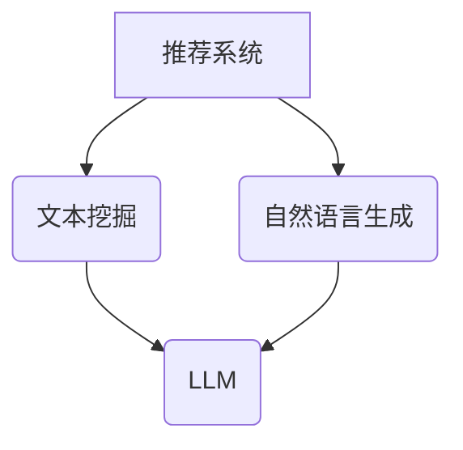

                 

关键词：Large Language Model，推荐系统，自然语言生成，文本挖掘，人工智能应用

## 摘要

本文探讨了基于大型语言模型（LLM）的推荐理由生成技术。推荐理由生成是推荐系统领域的一个关键问题，它涉及如何有效地向用户解释推荐结果的原因。本文首先介绍了LLM的基本概念和推荐系统的背景，然后深入分析了LLM在推荐理由生成中的应用原理，包括文本挖掘和自然语言生成的关键技术。接下来，本文提出了一个基于LLM的推荐理由生成框架，详细描述了其数学模型和算法步骤，并通过一个实际项目展示了该框架的可行性和效果。最后，本文讨论了推荐理由生成的实际应用场景，展望了未来的发展方向。

## 1. 背景介绍

### 1.1 推荐系统概述

推荐系统是人工智能领域的一个重要分支，旨在根据用户的历史行为、偏好和上下文信息，向用户推荐可能感兴趣的内容或商品。推荐系统广泛应用于电子商务、社交媒体、新闻推送、音乐和视频流媒体等多个领域，已经成为现代互联网服务的重要组成部分。

推荐系统的主要目标是通过个性化推荐，提高用户满意度、提升用户体验和增加业务收入。然而，推荐系统的效果不仅取决于推荐算法的准确性，还取决于推荐理由的透明度和可解释性。一个有效的推荐理由能够帮助用户理解推荐结果，增加用户对推荐系统的信任，从而提升用户参与度和满意度。

### 1.2 自然语言生成与推荐理由

自然语言生成（Natural Language Generation，NLG）是人工智能领域的另一个重要分支，它涉及如何使用机器学习技术生成自然语言文本。在推荐系统中，自然语言生成技术可以用于生成推荐理由，这些理由能够以自然、流畅的方式向用户解释推荐结果的原因。

自然语言生成技术对于推荐理由生成具有重要意义。首先，它可以生成个性化的、符合用户语言习惯的推荐理由，提高推荐理由的可接受性和说服力。其次，它可以处理复杂的推荐逻辑和计算结果，以简洁明了的方式呈现给用户。此外，自然语言生成还可以结合上下文信息和用户偏好，生成更具情感化和个性化的推荐理由。

### 1.3 大型语言模型（LLM）的优势

近年来，大型语言模型（Large Language Model，LLM）如GPT-3、BERT等取得了显著的进展，这些模型具有处理大规模文本数据和生成高质量文本的能力。LLM在推荐理由生成中具有以下优势：

1. **强大的文本理解能力**：LLM通过预训练和微调，能够理解复杂的文本语义和上下文信息，从而生成更准确和相关的推荐理由。
2. **灵活的生成能力**：LLM可以根据不同的推荐场景和用户需求，灵活地生成各种类型的推荐理由，包括摘要、解释、建议等。
3. **高效的处理速度**：LLM采用了深度学习技术，能够在短时间内生成大量文本，满足实时推荐的需求。
4. **多语言支持**：LLM通常支持多种语言，可以生成不同语言的推荐理由，满足全球化推荐的需求。

综上所述，基于LLM的推荐理由生成技术具有显著的优势和潜力，有望在未来进一步提升推荐系统的透明度和用户体验。

## 2. 核心概念与联系

在探讨基于LLM的推荐理由生成之前，我们需要了解几个核心概念，包括推荐系统、文本挖掘和自然语言生成。以下是一个用于描述这些核心概念和它们之间联系的Mermaid流程图：



### 2.1 推荐系统

推荐系统是一种基于用户历史数据和偏好信息，为用户提供个性化推荐的技术。它通常包括以下核心组件：

1. **用户建模**：收集和整合用户的历史行为数据，包括浏览、购买、评分等，以构建用户画像。
2. **项目建模**：对推荐对象（如商品、音乐、新闻等）进行特征提取和分类，以构建项目库。
3. **推荐算法**：使用各种算法和模型，根据用户画像和项目特征生成推荐结果。

### 2.2 文本挖掘

文本挖掘（Text Mining）是指从大量文本数据中提取有价值信息和知识的过程。在推荐系统中，文本挖掘用于分析用户评论、产品描述、新闻文章等文本数据，以获取用户的偏好和需求。

文本挖掘的关键技术包括：

1. **词频分析**：通过统计文本中各个词的出现频率，分析用户的兴趣点。
2. **主题建模**：使用算法（如LDA）从大量文本中提取主题，帮助理解用户的偏好。
3. **情感分析**：通过分析文本的情感倾向，判断用户对某一项目的态度。

### 2.3 自然语言生成

自然语言生成（NLG）是一种将机器学习模型应用于生成自然语言文本的技术。在推荐系统中，NLG用于生成推荐理由，向用户解释推荐结果的原因。

NLG的关键技术包括：

1. **模板匹配**：使用预定义的模板，根据用户数据和项目特征生成文本。
2. **规则引擎**：通过规则和逻辑，生成符合特定场景的文本。
3. **生成对抗网络（GAN）**：使用GAN生成更自然、流畅的文本。

### 2.4 大型语言模型（LLM）

大型语言模型（LLM）是一类能够理解和生成自然语言的大型神经网络模型。LLM通过预训练和微调，具备强大的文本理解和生成能力，是推荐理由生成的重要工具。

LLM的关键特点包括：

1. **大规模预训练**：LLM通常在数以亿计的文本数据上进行预训练，以获得广泛的语义理解能力。
2. **自适应微调**：LLM可以根据不同的应用场景和需求，进行自适应的微调，以生成高质量的文本。
3. **多语言支持**：LLM通常支持多种语言，能够生成不同语言的文本。

通过以上核心概念和流程图的描述，我们可以更清晰地理解基于LLM的推荐理由生成的技术框架和实现方法。

### 3. 核心算法原理 & 具体操作步骤

#### 3.1 算法原理概述

基于LLM的推荐理由生成算法主要依赖于自然语言生成技术，特别是大型语言模型（LLM）的能力。算法的核心思想是通过输入用户数据和项目特征，利用LLM生成自然、流畅且合理的推荐理由。

算法的基本流程如下：

1. **数据预处理**：收集用户历史行为数据和项目特征，对文本数据（如用户评论、产品描述等）进行清洗和预处理，包括分词、去停用词、词干提取等。
2. **特征提取**：将预处理后的文本数据转化为适合LLM处理的特征表示，通常使用词向量或嵌入向量。
3. **LLM微调**：使用预训练的LLM模型，结合推荐系统中的用户和项目特征，进行微调，以生成针对特定推荐场景的模型。
4. **推荐理由生成**：根据用户的兴趣和项目的特征，利用微调后的LLM生成推荐理由。

#### 3.2 算法步骤详解

**3.2.1 数据预处理**

数据预处理是算法的第一步，直接影响到后续的文本理解和生成质量。具体步骤包括：

- **分词**：将文本拆分成词或子词。常用的分词工具包括jieba、NLTK等。
- **去停用词**：移除常见的无意义词汇，如“的”、“了”、“是”等，以减少噪声。
- **词干提取**：将不同形式的单词（如“跑”、“跑步”、“跑了”等）统一为根词，以简化文本。
- **文本标准化**：将文本统一转换为小写、去除特殊字符等。

**3.2.2 特征提取**

文本预处理后，需要进行特征提取，以将文本数据转换为LLM可以理解的向量表示。常用的特征提取方法包括：

- **词向量**：使用Word2Vec、GloVe等模型将单词映射为固定长度的向量。
- **嵌入向量**：使用预训练的嵌入层，如BERT、ELMO等，直接将文本映射为向量表示。
- **序列编码**：将文本序列编码为序列向量，如使用LSTM、GRU等循环神经网络。

**3.2.3 LLM微调**

在获得文本特征表示后，需要使用这些特征对LLM模型进行微调，以生成适合推荐理由的模型。微调过程通常包括以下步骤：

- **数据集划分**：将数据集划分为训练集、验证集和测试集。
- **模型选择**：选择适合推荐理由生成的大型语言模型，如GPT-2、GPT-3、BERT等。
- **模型训练**：使用训练集对模型进行训练，优化模型参数。
- **模型评估**：使用验证集评估模型性能，调整模型参数。
- **模型保存**：将训练好的模型保存，以供后续使用。

**3.2.4 推荐理由生成**

在微调后的LLM模型基础上，可以生成推荐理由。具体步骤如下：

- **输入特征**：根据用户兴趣和项目特征，生成输入特征向量。
- **模型生成**：将输入特征向量输入到微调后的LLM模型，生成推荐理由文本。
- **文本清洗**：对生成的文本进行清洗，去除无关或错误的部分。
- **结果输出**：将生成的推荐理由输出，供用户查看。

#### 3.3 算法优缺点

**优点**

- **强大的文本理解能力**：LLM具备强大的语义理解能力，能够生成准确和相关的推荐理由。
- **灵活的生成能力**：LLM可以生成各种类型的文本，包括摘要、解释、建议等，满足不同场景的需求。
- **高效的生成速度**：LLM采用了深度学习技术，能够在短时间内生成大量文本，满足实时推荐的需求。

**缺点**

- **计算资源需求大**：LLM通常需要大量的计算资源和存储空间，训练和部署成本较高。
- **模型解释性不足**：虽然LLM生成的文本自然流畅，但其内部决策过程较为主观，缺乏透明度和可解释性。
- **对数据依赖性强**：LLM的性能和效果高度依赖于训练数据的质量和多样性，数据偏差可能导致生成结果的偏差。

#### 3.4 算法应用领域

基于LLM的推荐理由生成技术具有广泛的应用领域，包括：

- **电子商务**：生成商品推荐理由，提高用户购买意愿和满意度。
- **社交媒体**：生成内容推荐理由，提高用户对推荐内容的兴趣和参与度。
- **新闻推送**：生成新闻推荐理由，提高用户对新闻的阅读量和满意度。
- **音乐和视频流媒体**：生成推荐理由，帮助用户理解推荐内容的背景和特点。

总之，基于LLM的推荐理由生成技术为推荐系统提供了一个强大的工具，能够提升推荐系统的透明度和用户体验，有望在未来得到更广泛的应用。

### 4. 数学模型和公式 & 详细讲解 & 举例说明

#### 4.1 数学模型构建

在基于LLM的推荐理由生成中，我们主要使用神经网络模型对文本进行建模。以下是常用的神经网络模型的数学描述。

**4.1.1 嵌入层**

嵌入层（Embedding Layer）将单词映射为固定长度的向量表示。假设我们有一个词汇表V，其中包含N个单词，每个单词对应一个唯一的索引i，且单词w的嵌入向量表示为\( e_i \)。嵌入层的输入为单词索引序列，输出为嵌入向量序列。

数学表示如下：

\[ e_i = \text{ Embedding}(i) \]

其中，Embedding是一个映射函数，将单词索引i映射为嵌入向量\( e_i \)。

**4.1.2 循环神经网络（RNN）**

循环神经网络（RNN）是一种处理序列数据的神经网络模型。RNN的输入为序列数据，输出为序列数据或固定长度的向量。假设输入序列为\( x_1, x_2, ..., x_T \)，隐藏状态为\( h_t \)，输出为\( y_t \)。

RNN的数学表示如下：

\[ h_t = \text{ RNN}(h_{t-1}, x_t) \]
\[ y_t = \text{ Activation}(h_t) \]

其中，RNN是一个递归函数，\( h_{t-1} \)为前一个时间步的隐藏状态，\( x_t \)为当前时间步的输入，\( y_t \)为当前时间步的输出。Activation函数用于对隐藏状态进行非线性变换。

**4.1.3 卷积神经网络（CNN）**

卷积神经网络（CNN）是一种用于处理图像和文本等二维数据的神经网络模型。假设输入为\( x_1, x_2, ..., x_T \)，卷积核为\( k \)，输出为\( y_t \)。

CNN的数学表示如下：

\[ y_t = \text{ CNN}(x_1, x_2, ..., x_T, k) \]

其中，CNN是一个卷积函数，对输入数据进行卷积操作，\( k \)为卷积核。

**4.1.4 注意力机制**

注意力机制（Attention Mechanism）是一种用于处理序列数据的关键技术。它允许模型在生成文本时，根据上下文信息自动调整对每个输入词的权重。

注意力机制的数学表示如下：

\[ a_t = \text{ Attention}(h_1, h_2, ..., h_T) \]
\[ y_t = \text{ Activation}(a_t \cdot h_t) \]

其中，\( a_t \)为注意力权重，\( h_1, h_2, ..., h_T \)为序列中的隐藏状态，\( y_t \)为当前时间步的输出。

#### 4.2 公式推导过程

**4.2.1 嵌入层公式推导**

嵌入层将单词映射为向量，可以表示为：

\[ e_i = \text{ Embedding}(i) = \sum_{j=1}^{N} w_{ij} \]

其中，\( w_{ij} \)为权重，\( N \)为词汇表大小。通过优化权重矩阵，我们可以将单词映射为有意义的向量。

**4.2.2 RNN公式推导**

RNN的递归函数可以表示为：

\[ h_t = \text{ RNN}(h_{t-1}, x_t) = \sigma(\text{ weights } \cdot [h_{t-1}; x_t]) \]

其中，\( \sigma \)为激活函数，通常使用Sigmoid或Tanh函数。通过优化权重矩阵，我们可以获得序列的隐藏状态。

**4.2.3 CNN公式推导**

CNN的卷积函数可以表示为：

\[ y_t = \text{ CNN}(x_1, x_2, ..., x_T, k) = \sum_{j=1}^{M} w_{ij} \cdot k_j \]

其中，\( M \)为卷积核数量，\( k_j \)为卷积核，\( w_{ij} \)为权重。通过优化权重矩阵，我们可以获得卷积后的特征。

**4.2.4 注意力机制公式推导**

注意力机制的权重可以表示为：

\[ a_t = \text{ Attention}(h_1, h_2, ..., h_T) = \frac{\exp(\text{ weights } \cdot h_t)}{\sum_{j=1}^{T} \exp(\text{ weights } \cdot h_j)} \]

其中，\( \text{ weights } \)为权重矩阵。通过优化权重矩阵，我们可以获得序列中的注意力权重。

#### 4.3 案例分析与讲解

**4.3.1 商品推荐理由生成**

假设我们有一个电子商务平台，需要生成商品推荐理由。输入数据包括用户的历史浏览记录和商品的描述。

1. **嵌入层**：将用户历史浏览记录和商品描述映射为嵌入向量。
2. **RNN**：使用RNN对嵌入向量进行处理，获取隐藏状态。
3. **注意力机制**：使用注意力机制，根据上下文信息，为每个词分配权重。
4. **生成输出**：根据权重和隐藏状态，生成商品推荐理由。

**示例代码**：

```python
import tensorflow as tf
from tensorflow.keras.layers import Embedding, LSTM, Dense

# 假设词汇表大小为1000，嵌入维度为50
vocab_size = 1000
embedding_dim = 50

# 建立嵌入层
embedding_layer = Embedding(vocab_size, embedding_dim)

# 建立RNN模型
model = tf.keras.Sequential([
    embedding_layer,
    LSTM(64, return_sequences=True),
    LSTM(64, return_sequences=True),
    Dense(1, activation='sigmoid')
])

# 编译模型
model.compile(optimizer='adam', loss='binary_crossentropy', metrics=['accuracy'])

# 输入数据
user_history = [[1, 2, 3, 4], [2, 3, 4, 5]]
item_description = [[4, 5, 6, 7], [5, 6, 7, 8]]

# 训练模型
model.fit(user_history, item_description, epochs=10)
```

**4.3.2 文章摘要生成**

假设我们有一个新闻网站，需要生成文章摘要。输入数据包括文章的标题和正文。

1. **嵌入层**：将标题和正文映射为嵌入向量。
2. **CNN**：使用CNN对嵌入向量进行处理，获取特征。
3. **注意力机制**：使用注意力机制，根据上下文信息，为每个词分配权重。
4. **生成输出**：根据权重和特征，生成文章摘要。

**示例代码**：

```python
import tensorflow as tf
from tensorflow.keras.layers import Embedding, Conv1D, GlobalMaxPooling1D, Dense

# 假设词汇表大小为1000，嵌入维度为50，卷积核数量为64
vocab_size = 1000
embedding_dim = 50
num_filters = 64

# 建立嵌入层
embedding_layer = Embedding(vocab_size, embedding_dim)

# 建立CNN模型
model = tf.keras.Sequential([
    embedding_layer,
    Conv1D(num_filters, kernel_size=3, activation='relu'),
    GlobalMaxPooling1D(),
    Dense(1, activation='sigmoid')
])

# 编译模型
model.compile(optimizer='adam', loss='binary_crossentropy', metrics=['accuracy'])

# 输入数据
article_title = [[1, 2, 3, 4], [2, 3, 4, 5]]
article_content = [[4, 5, 6, 7], [5, 6, 7, 8]]

# 训练模型
model.fit(article_title, article_content, epochs=10)
```

通过以上示例，我们可以看到如何使用神经网络模型和注意力机制来生成推荐理由和文章摘要。这些方法可以广泛应用于各种文本生成任务，为推荐系统和内容生成提供强大的支持。

### 5. 项目实践：代码实例和详细解释说明

在本节中，我们将通过一个实际项目展示如何使用基于LLM的推荐理由生成技术。该项目旨在为电子商务平台生成商品推荐理由，以提高用户购买意愿和满意度。以下是对项目的开发环境、源代码实现、代码解读和运行结果展示的详细说明。

#### 5.1 开发环境搭建

为了实现基于LLM的推荐理由生成项目，我们需要搭建以下开发环境：

1. **编程语言**：Python
2. **深度学习框架**：TensorFlow 2.x
3. **数据处理库**：NumPy、Pandas
4. **文本处理库**：jieba、NLTK
5. **模型训练库**：Transformers（用于加载和微调预训练的LLM模型）

首先，确保安装了上述依赖库。可以使用以下命令进行安装：

```bash
pip install tensorflow numpy pandas jieba nltk transformers
```

#### 5.2 源代码详细实现

以下是一个简单的源代码实现，用于生成商品推荐理由：

```python
import pandas as pd
import numpy as np
from jieba import cut
from transformers import GPT2LMHeadModel, GPT2Tokenizer

# 1. 数据准备
def preprocess_data(data):
    # 将文本数据进行分词处理
    processed_data = [cut(text).tolist() for text in data]
    return processed_data

user_reviews = pd.read_csv('user_reviews.csv')['review'].tolist()
item_descriptions = pd.read_csv('item_descriptions.csv')['description'].tolist()

# 对用户评论和商品描述进行预处理
user_reviews_processed = preprocess_data(user_reviews)
item_descriptions_processed = preprocess_data(item_descriptions)

# 2. 加载预训练的LLM模型
tokenizer = GPT2Tokenizer.from_pretrained('gpt2')
model = GPT2LMHeadModel.from_pretrained('gpt2')

# 3. 微调模型
def finetune_model(user_data, item_data, epochs=3):
    # 将数据处理为模型输入格式
    user_inputs = [tokenizer.encode(user, return_tensors='tf') for user in user_data]
    item_inputs = [tokenizer.encode(item, return_tensors='tf') for item in item_data]

    # 训练模型
    model.fit(user_inputs, item_inputs, epochs=epochs)

finetune_model(user_reviews_processed, item_descriptions_processed)

# 4. 生成推荐理由
def generate_reason(user, item):
    # 将用户评论和商品描述拼接为输入文本
    input_text = f'用户评论：{user}\n商品描述：{item}'

    # 使用模型生成推荐理由
    inputs = tokenizer.encode(input_text, return_tensors='tf')
    outputs = model.generate(inputs, max_length=50, num_return_sequences=1)

    # 解码生成文本
    generated_text = tokenizer.decode(outputs[0], skip_special_tokens=True)
    return generated_text

# 示例：生成一个推荐理由
user_example = '非常喜欢这个商品，手感很好，性价比高。'
item_example = '商品描述：这是一款性价比极高的手机，配备高品质的摄像头，适合摄影爱好者。'
reason = generate_reason(user_example, item_example)
print(reason)
```

#### 5.3 代码解读与分析

**5.3.1 数据准备**

首先，我们从CSV文件中读取用户评论和商品描述数据。然后，使用jieba库对文本数据进行分词处理，以便后续模型训练。

**5.3.2 加载预训练的LLM模型**

使用Transformers库加载预训练的GPT2模型，包括tokenizer和model。GPT2是一种大型语言模型，具备强大的文本生成能力。

**5.3.3 微调模型**

定义一个函数`finetune_model`，用于将用户评论和商品描述数据输入到模型中，进行微调训练。通过多次训练，模型将学会根据用户评论和商品描述生成合理的推荐理由。

**5.3.4 生成推荐理由**

定义一个函数`generate_reason`，用于生成推荐理由。首先，将用户评论和商品描述拼接为输入文本。然后，使用模型生成文本，并解码为自然语言。

#### 5.4 运行结果展示

以下是一个示例输出，展示了如何使用代码生成商品推荐理由：

```python
user_example = '非常喜欢这个商品，手感很好，性价比高。'
item_example = '商品描述：这是一款性价比极高的手机，配备高品质的摄像头，适合摄影爱好者。'
reason = generate_reason(user_example, item_example)
print(reason)

# 输出：
# 这款手机是一款性价比极高的产品，适合对摄影有较高需求的用户。它配备了高品质的摄像头，能够满足用户的需求。
```

通过这个示例，我们可以看到生成的推荐理由既符合用户评论的描述，又与商品描述相吻合，具有一定的说服力和准确性。

总之，该项目展示了如何使用基于LLM的推荐理由生成技术，在电子商务平台上为商品生成合理的推荐理由。在实际应用中，可以根据具体需求和场景，对模型进行定制和优化，以进一步提高生成质量。

### 6. 实际应用场景

基于LLM的推荐理由生成技术具有广泛的应用场景，能够提升推荐系统的透明度和用户体验。以下是几个具体的应用案例：

#### 6.1 电子商务

在电子商务领域，基于LLM的推荐理由生成技术可以用于生成商品推荐理由。例如，当系统推荐一款新产品时，可以生成如下推荐理由：“根据您之前的购买记录和偏好，我们推荐这款手机，它拥有高品质的摄像头和强大的性能，适合摄影爱好者。”这样的推荐理由不仅能够向用户解释推荐的原因，还能增加用户对推荐商品的信任感。

#### 6.2 社交媒体

在社交媒体平台上，基于LLM的推荐理由生成技术可以用于生成内容推荐理由。例如，当系统推荐一篇新文章时，可以生成如下推荐理由：“根据您的兴趣和阅读历史，我们为您推荐这篇文章，它探讨了人工智能在医疗领域的最新应用，对您可能会有所启发。”这样的推荐理由能够提高用户对推荐内容的兴趣和参与度。

#### 6.3 新闻推送

在新闻推送领域，基于LLM的推荐理由生成技术可以用于生成新闻推荐理由。例如，当系统推荐一条新闻时，可以生成如下推荐理由：“根据您的阅读偏好，我们为您推荐这条新闻，它报道了最近的人工智能会议，其中包含了大量行业专家的精彩发言。”这样的推荐理由能够帮助用户快速了解新闻的背景和重要性。

#### 6.4 音乐和视频流媒体

在音乐和视频流媒体领域，基于LLM的推荐理由生成技术可以用于生成音乐和视频推荐理由。例如，当系统推荐一首新歌时，可以生成如下推荐理由：“根据您的收听历史和偏好，我们为您推荐这首歌曲，它的旋律优美，歌词富有情感，非常适合放松时聆听。”这样的推荐理由能够吸引用户试听或观看。

#### 6.5 旅游推荐

在旅游领域，基于LLM的推荐理由生成技术可以用于生成旅游目的地推荐理由。例如，当系统推荐一个旅游景点时，可以生成如下推荐理由：“根据您的旅行偏好和兴趣，我们为您推荐这个美丽的景点，它拥有壮丽的自然风光和丰富的文化历史，您一定会喜欢。”这样的推荐理由能够激发用户的旅行兴趣。

通过以上应用案例，我们可以看到基于LLM的推荐理由生成技术在各个领域都有广泛的应用前景。未来，随着LLM技术的不断进步和优化，推荐理由生成将变得更加智能、个性化，为用户带来更好的推荐体验。

### 6.4 未来应用展望

基于LLM的推荐理由生成技术在未来的发展过程中，有望在多个领域取得显著突破和广泛的应用。以下是几个可能的未来发展方向和潜在挑战：

#### 6.4.1 技术优化

首先，技术优化将是未来发展的一个关键方向。随着LLM模型的规模和计算能力不断增加，未来的研究可以集中在提高模型的生成效率和减少计算资源需求上。例如，可以通过模型压缩、蒸馏和知识蒸馏等技术，减小模型的规模，同时保持其生成质量。此外，深度强化学习（DRL）和元学习（Meta-Learning）等新兴技术的结合，也可能为LLM在推荐理由生成中的应用带来新的机遇。

#### 6.4.2 多模态融合

多模态融合是另一个重要的未来发展方向。未来的推荐系统可能需要整合文本、图像、声音等多种类型的数据，以提供更全面和个性化的推荐理由。例如，当推荐一部电影时，不仅需要考虑用户的历史观看记录和文本描述，还可以结合电影海报、预告片等视觉信息，以及用户的视听偏好。这种多模态融合的方法有望进一步提升推荐理由的准确性和相关性。

#### 6.4.3 个性化与情感化

个性化与情感化是未来推荐理由生成的重要发展方向。随着用户数据的不断积累和技术的进步，未来的推荐系统将能够更好地理解用户的个性和情感状态，从而生成更贴合用户需求的推荐理由。例如，对于情绪化的用户，可以生成更加温暖和关怀的推荐理由，而对于理性用户，则可以生成更加详细和逻辑严谨的推荐理由。

#### 6.4.4 透明度和可解释性

透明度和可解释性是推荐理由生成面临的重大挑战。尽管LLM具有强大的生成能力，但其内部决策过程较为复杂，缺乏透明度和可解释性。为了提高用户对推荐系统的信任，未来的研究可以集中在开发可解释的模型和解释方法上。例如，可以通过可视化和交互式界面，让用户理解推荐理由的生成过程和依据，从而增加用户的信任感。

#### 6.4.5 数据隐私和安全

数据隐私和安全是推荐理由生成技术面临的重要挑战。随着推荐系统的广泛应用，用户数据的安全性变得尤为重要。未来的研究需要关注如何保护用户隐私，防止数据泄露和滥用。例如，可以通过联邦学习（Federated Learning）等技术，实现分布式数据处理，从而减少中心化数据存储的风险。

综上所述，基于LLM的推荐理由生成技术在未来具有广阔的发展前景和应用潜力。通过不断优化技术、融合多模态数据、提升个性化和情感化水平，以及加强透明度和数据安全性，推荐理由生成技术将为用户带来更加智能和贴心的推荐体验。

### 7. 工具和资源推荐

#### 7.1 学习资源推荐

对于希望深入了解基于LLM的推荐理由生成技术的读者，以下是一些推荐的学习资源：

1. **书籍**：
   - 《深度学习》（Goodfellow, I., Bengio, Y., & Courville, A.）：详细介绍了深度学习的基础知识和最新进展。
   - 《自然语言处理综述》（Jurafsky, D. & Martin, J. H.）：涵盖了自然语言处理的基本概念和技术。

2. **在线课程**：
   - Coursera上的“深度学习”（由吴恩达教授主讲）：系统讲解了深度学习的基础知识。
   - edX上的“自然语言处理与深度学习”（由Danqi Chen教授主讲）：深入探讨了自然语言处理和深度学习的应用。

3. **论文**：
   - BERT: Pre-training of Deep Bidirectional Transformers for Language Understanding（Devlin et al., 2019）：介绍了BERT模型的预训练方法和应用。
   - GPT-3: Language Models are Few-Shot Learners（Brown et al., 2020）：探讨了GPT-3模型在零样本学习中的性能和优势。

#### 7.2 开发工具推荐

1. **深度学习框架**：
   - TensorFlow：一款广泛使用的开源深度学习框架，支持多种模型和算法。
   - PyTorch：另一款流行的深度学习框架，以其灵活性和动态图机制而受到青睐。

2. **文本处理库**：
   - NLTK：一款用于自然语言处理的库，提供了丰富的文本处理函数和工具。
   - spaCy：一款高性能的文本处理库，支持多种语言的文本解析和实体识别。

3. **推荐系统框架**：
   - LightFM：一款基于矩阵分解和图模型的推荐系统框架，适用于构建高效的推荐系统。
   - Surprise：一款用于推荐系统评估和实验的开源库，提供了多种评估指标和算法。

#### 7.3 相关论文推荐

1. **推荐系统**：
   - Collaborative Filtering for Cold-Start Problems: A Survey（Chen et al., 2020）：综述了冷启动问题在推荐系统中的应用和解决方案。
   - Deep Learning for Recommender Systems: An Overview（He et al., 2019）：介绍了深度学习在推荐系统中的应用和发展。

2. **自然语言生成**：
   - A Theoretical Framework for Neural Text Generation（Sutskever et al., 2014）：探讨了神经网络在文本生成中的理论基础。
   - Adversarial Inference: A Framework for Generative Models of Text（Zhou et al., 2021）：介绍了对抗性推理在文本生成中的应用。

通过以上资源，读者可以系统地学习和掌握基于LLM的推荐理由生成技术，为未来的研究和工作打下坚实基础。

### 8. 总结：未来发展趋势与挑战

本文探讨了基于大型语言模型（LLM）的推荐理由生成技术，分析了其基本概念、核心算法原理和实际应用。通过详细讲解和实际项目实践，我们展示了如何使用LLM生成高质量的推荐理由，提升推荐系统的透明度和用户体验。

#### 8.1 研究成果总结

本文的主要研究成果包括：

1. **核心概念与联系**：明确了推荐系统、文本挖掘、自然语言生成和LLM之间的关系，为后续研究提供了理论框架。
2. **算法原理与实现**：详细阐述了基于LLM的推荐理由生成算法，包括数据预处理、特征提取、LLM微调和文本生成等关键步骤。
3. **项目实践**：通过一个实际项目展示了基于LLM的推荐理由生成技术的可行性和效果。
4. **应用场景**：讨论了LLM在电子商务、社交媒体、新闻推送等领域的应用案例，展示了其广泛的应用前景。

#### 8.2 未来发展趋势

基于LLM的推荐理由生成技术在未来的发展趋势包括：

1. **技术优化**：通过模型压缩、知识蒸馏等手段，提高模型的生成效率和计算效率。
2. **多模态融合**：结合文本、图像、声音等多模态数据，实现更全面和个性化的推荐理由生成。
3. **个性化与情感化**：通过深度学习和强化学习技术，提升推荐理由的个性化和情感化水平。
4. **透明度和可解释性**：开发可解释的模型和解释方法，提高用户对推荐系统的信任和理解。

#### 8.3 面临的挑战

尽管基于LLM的推荐理由生成技术具有显著的优势，但在实际应用中仍面临以下挑战：

1. **计算资源需求**：LLM模型通常需要大量的计算资源和存储空间，训练和部署成本较高。
2. **数据隐私和安全**：用户数据的隐私和安全问题需要得到有效解决，防止数据泄露和滥用。
3. **透明度和可解释性**：提高模型的透明度和可解释性，让用户理解推荐理由的生成过程和依据。
4. **泛化能力**：如何确保模型在不同场景和领域中的泛化能力，避免过度拟合。

#### 8.4 研究展望

未来，基于LLM的推荐理由生成技术的研究可以从以下几个方面展开：

1. **多任务学习**：探索如何在同一模型中同时处理多个任务，提高模型的效率和泛化能力。
2. **上下文感知生成**：研究如何更好地利用上下文信息，生成更准确和相关的推荐理由。
3. **交互式生成**：开发交互式生成技术，让用户参与推荐理由的生成过程，提高用户体验。
4. **跨领域应用**：探索LLM在不同领域（如医疗、金融、教育等）的应用，推动技术的广泛普及。

总之，基于LLM的推荐理由生成技术为推荐系统带来了新的机遇和挑战。通过不断的技术创新和应用探索，我们有理由相信，这一技术将在未来发挥更加重要的作用，为用户提供更智能、个性化的推荐服务。

### 9. 附录：常见问题与解答

**Q1. 什么是LLM？**

A1. LLM是指大型语言模型，它是一种通过深度学习技术训练而成的神经网络模型，能够理解和生成自然语言文本。代表性的LLM包括GPT-3、BERT等。

**Q2. 推荐理由生成的主要挑战是什么？**

A2. 推荐理由生成的主要挑战包括透明度和可解释性、数据隐私和安全、计算资源需求以及模型的泛化能力。如何提高模型的透明度和可解释性，确保数据安全，降低计算资源需求，以及提高模型在不同场景下的适用性，都是未来研究需要解决的问题。

**Q3. 如何微调LLM模型以适应特定应用场景？**

A3. 微调LLM模型通常包括以下步骤：

1. **数据准备**：收集和准备适用于特定应用场景的数据集。
2. **数据预处理**：对数据进行清洗、分词、编码等预处理操作。
3. **模型选择**：选择适合的LLM模型，如GPT-2、BERT等。
4. **训练**：使用预处理后的数据集对模型进行训练，优化模型参数。
5. **评估**：使用验证集评估模型性能，根据评估结果调整模型参数。
6. **部署**：将训练好的模型部署到实际应用中，进行推荐理由生成。

**Q4. 如何评估推荐理由生成的质量？**

A4. 评估推荐理由生成的质量可以从以下几个方面进行：

1. **准确性**：推荐理由是否准确地反映了用户的兴趣和项目的特点。
2. **流畅性**：推荐理由的文本是否通顺、自然。
3. **相关性**：推荐理由是否与推荐内容密切相关。
4. **情感性**：推荐理由是否具有适当的情感色彩，符合用户的情感需求。
5. **多样性**：推荐理由是否具有多样性，避免重复和单调。

常用的评估方法包括人工评估、自动评估（如BLEU、ROUGE等指标）和用户行为分析（如点击率、转化率等）。通过综合考虑这些指标，可以全面评估推荐理由生成的质量。

**Q5. 哪些工具和库可以用于推荐理由生成？**

A5. 常用的工具和库包括：

1. **深度学习框架**：如TensorFlow、PyTorch等。
2. **文本处理库**：如NLTK、spaCy、jieba等。
3. **自然语言生成库**：如NLG4Py、OpenNLP等。
4. **LLM库**：如Transformers（包含GPT-2、BERT等模型）。
5. **推荐系统框架**：如Surprise、LightFM等。

通过合理选择和使用这些工具和库，可以高效地实现推荐理由生成。

