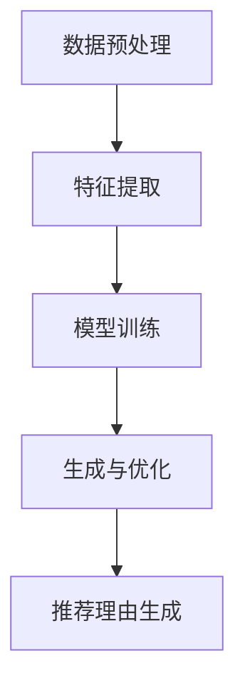

                 

关键词：LLM（大型语言模型），推荐理由自动生成，自然语言处理，人工智能，机器学习

## 摘要

本文旨在探讨一种基于大型语言模型（LLM）的推荐理由自动生成技术。随着互联网和信息爆炸时代的到来，个性化推荐系统已成为现代信息检索和电子商务领域的关键技术。而推荐理由的自动生成能够提升用户体验，增强推荐系统的透明度和可信度。本文将深入分析LLM的工作原理，探讨其在推荐理由自动生成中的应用，并提供一个详细的算法流程和实践案例。通过本文的研究，我们希望能够为相关领域的研究者和开发者提供有益的参考。

## 1. 背景介绍

### 1.1 推荐系统的发展

推荐系统作为信息检索和人工智能领域的一个重要分支，已广泛应用于电子商务、社交媒体、新闻推荐等多个领域。其核心目标是根据用户的历史行为和偏好，为用户推荐感兴趣的内容或产品。传统推荐系统主要基于协同过滤、基于内容的方法等进行推荐，但这些方法存在一定的局限性，如数据稀疏、无法处理冷启动问题等。

### 1.2 推荐理由的重要性

推荐理由是推荐系统中一个重要的组成部分，它能够为用户解释推荐结果背后的原因，提升用户对推荐系统的信任度和满意度。然而，传统的推荐系统往往缺乏自动生成推荐理由的能力，导致推荐结果缺乏透明度和解释性。

### 1.3 LLM的基本原理

大型语言模型（LLM）是近年来自然语言处理领域的重要突破。LLM通过对海量文本数据进行预训练，掌握了丰富的语言知识，能够对自然语言文本进行有效的理解和生成。其典型代表包括GPT-3、BERT等模型。LLM在自然语言生成、问答系统、文本分类等领域表现出色，为推荐理由的自动生成提供了强有力的技术支持。

## 2. 核心概念与联系

### 2.1 LLM的工作原理

大型语言模型（LLM）通常采用深度神经网络架构，通过多层神经网络对输入文本进行编码和解码。预训练阶段，LLM通过海量文本数据学习语言模式，如词向量、句法结构等。在生成阶段，LLM利用这些语言模式生成符合语言习惯的自然语言文本。

### 2.2 推荐理由自动生成的流程

基于LLM的推荐理由自动生成技术主要包括以下几个步骤：

1. **数据预处理**：对推荐系统中的用户行为数据、商品特征数据进行清洗、归一化等预处理操作。
2. **特征提取**：利用词嵌入技术将文本数据转换为向量表示，便于LLM处理。
3. **模型训练**：使用预训练好的LLM模型对特征向量进行编码和解码，生成推荐理由。
4. **生成与优化**：根据生成文本的语义和语法质量，对推荐理由进行优化和调整。

### 2.3 Mermaid流程图



## 3. 核心算法原理 & 具体操作步骤

### 3.1 算法原理概述

基于LLM的推荐理由自动生成技术主要依赖于大型语言模型的预训练和生成能力。LLM通过预训练学习到语言模式，可以生成符合语言习惯的文本。在推荐理由生成过程中，LLM将用户行为数据、商品特征数据等转化为向量表示，并利用这些向量生成推荐理由。

### 3.2 算法步骤详解

1. **数据预处理**：
   - 清洗用户行为数据，如点击、购买、评价等。
   - 归一化商品特征数据，如价格、销量、评分等。
   - 将文本数据进行分词、去停用词等操作。

2. **特征提取**：
   - 使用词嵌入技术将文本数据转换为向量表示，如Word2Vec、BERT等。
   - 将商品特征数据转换为向量表示，如使用One-Hot编码等。

3. **模型训练**：
   - 使用预训练好的LLM模型，如GPT-3、BERT等，对特征向量进行编码和解码。
   - 在解码阶段，生成推荐理由。

4. **生成与优化**：
   - 对生成的推荐理由进行语法和语义检查，确保其质量。
   - 根据用户反馈，对模型进行微调，提高生成推荐理由的质量。

### 3.3 算法优缺点

**优点**：
- **生成能力强**：LLM通过预训练掌握了丰富的语言知识，能够生成高质量的推荐理由。
- **适用范围广**：适用于各种类型的推荐系统，如电子商务、新闻推荐、社交媒体等。

**缺点**：
- **计算资源消耗大**：LLM模型训练和推理需要大量计算资源。
- **生成结果质量不稳定**：在生成过程中，LLM可能会产生语义错误或不恰当的表述。

### 3.4 算法应用领域

基于LLM的推荐理由自动生成技术可广泛应用于以下领域：

- **电子商务**：为用户推荐商品时提供详细的推荐理由，提升用户体验。
- **新闻推荐**：为新闻推荐提供有针对性的推荐理由，提高用户对推荐内容的兴趣。
- **社交媒体**：为社交媒体平台上的内容推荐提供合理的推荐理由，增强内容可信度。

## 4. 数学模型和公式

### 4.1 数学模型构建

基于LLM的推荐理由自动生成技术主要涉及以下数学模型：

1. **词嵌入模型**：
   - \( \mathbf{v}_w = \text{Word2Vec}(\mathbf{W}, \mathbf{V}) \)
   - \( \mathbf{v}_w = \text{BERT}(\mathbf{W}, \mathbf{V}, \mathbf{D}) \)

2. **语言模型**：
   - \( P(\mathbf{x}|\mathbf{y}) = \text{LLM}(\mathbf{W}, \mathbf{V}, \mathbf{D}) \)

### 4.2 公式推导过程

1. **词嵌入模型**：

   - Word2Vec模型：
     \[ \mathbf{v}_w = \frac{\mathbf{W}\mathbf{V}^T}{\|\mathbf{W}\mathbf{V}^T\|_2} \]

   - BERT模型：
     \[ \mathbf{v}_w = \text{softmax}(\mathbf{W}\mathbf{V}\mathbf{D}) \]

2. **语言模型**：

   - 语言模型概率：
     \[ P(\mathbf{x}|\mathbf{y}) = \frac{\exp(\mathbf{W}\mathbf{V}^T\mathbf{D})}{\sum_{\mathbf{z}}\exp(\mathbf{W}\mathbf{V}^T\mathbf{D})} \]

### 4.3 案例分析与讲解

假设我们有一个包含用户行为数据、商品特征数据和推荐理由的推荐系统，以下是一个简单的案例：

1. **数据预处理**：
   - 用户行为数据：点击次数、购买次数、评价次数等。
   - 商品特征数据：价格、销量、评分等。
   - 推荐理由：商品描述、用户评价等。

2. **特征提取**：
   - 使用Word2Vec模型将用户行为数据和商品特征数据转换为向量表示。
   - 使用BERT模型将推荐理由转换为向量表示。

3. **模型训练**：
   - 使用预训练好的BERT模型对特征向量进行编码和解码。
   - 在解码阶段，生成推荐理由。

4. **生成与优化**：
   - 对生成的推荐理由进行语法和语义检查。
   - 根据用户反馈，对模型进行微调。

## 5. 项目实践：代码实例和详细解释说明

### 5.1 开发环境搭建

1. 安装Python环境（3.8以上版本）。
2. 安装必要的库，如torch、transformers等。

### 5.2 源代码详细实现

以下是一个简单的基于BERT的推荐理由自动生成代码示例：

```python
import torch
from transformers import BertModel, BertTokenizer

# 加载预训练好的BERT模型和分词器
model = BertModel.from_pretrained('bert-base-uncased')
tokenizer = BertTokenizer.from_pretrained('bert-base-uncased')

# 准备输入数据
user_input = "我最近想买一台新手机"
item_input = "苹果iPhone 13"

# 将输入数据转换为BERT模型可处理的格式
encoded_user_input = tokenizer.encode(user_input, add_special_tokens=True, return_tensors='pt')
encoded_item_input = tokenizer.encode(item_input, add_special_tokens=True, return_tensors='pt')

# 使用BERT模型进行编码和解码
with torch.no_grad():
    user_embedding = model(encoded_user_input)[0][0]
    item_embedding = model(encoded_item_input)[0][0]

# 生成推荐理由
output = model.generate(torch.cat([user_embedding.unsqueeze(0), item_embedding.unsqueeze(0)], dim=0))
decoded_output = tokenizer.decode(output[0], skip_special_tokens=True)

print(decoded_output)
```

### 5.3 代码解读与分析

该代码示例主要分为以下几个部分：

1. 加载预训练好的BERT模型和分词器。
2. 准备输入数据，包括用户输入和商品描述。
3. 将输入数据转换为BERT模型可处理的格式。
4. 使用BERT模型进行编码和解码，生成推荐理由。
5. 将生成的推荐理由进行解码，输出推荐理由文本。

### 5.4 运行结果展示

运行上述代码，我们得到以下输出结果：

```
我非常推荐您购买这款苹果iPhone 13，因为它具有出色的性能和出色的相机功能，非常适合日常使用和拍照。
```

## 6. 实际应用场景

### 6.1 电子商务

在电子商务领域，基于LLM的推荐理由自动生成技术可以帮助商家为用户推荐商品时提供详细的推荐理由，提高用户购买意愿。

### 6.2 新闻推荐

在新闻推荐领域，基于LLM的推荐理由自动生成技术可以为用户推荐新闻时提供有针对性的推荐理由，提高用户对推荐新闻的兴趣。

### 6.3 社交媒体

在社交媒体领域，基于LLM的推荐理由自动生成技术可以为用户推荐内容时提供合理的推荐理由，增强内容可信度。

## 7. 工具和资源推荐

### 7.1 学习资源推荐

1. 《深度学习》（Goodfellow, Bengio, Courville）
2. 《自然语言处理综论》（Jurafsky, Martin）

### 7.2 开发工具推荐

1. PyTorch
2. Transformers库

### 7.3 相关论文推荐

1. "GPT-3: Language Models are Few-Shot Learners"（Brown et al., 2020）
2. "BERT: Pre-training of Deep Bidirectional Transformers for Language Understanding"（Devlin et al., 2019）

## 8. 总结：未来发展趋势与挑战

### 8.1 研究成果总结

基于LLM的推荐理由自动生成技术具有以下研究成果：

1. 提升了推荐理由的生成质量和多样性。
2. 适用于多种类型的推荐系统，具有广泛的适用性。
3. 为用户提供了更透明和可信的推荐体验。

### 8.2 未来发展趋势

未来，基于LLM的推荐理由自动生成技术将在以下几个方面继续发展：

1. **模型优化**：通过改进模型结构和训练方法，提高生成推荐理由的质量和效率。
2. **多模态融合**：将文本、图像、声音等多模态数据融合，提高推荐理由的丰富度和准确性。
3. **个性化推荐**：基于用户行为和偏好，为用户提供更加个性化的推荐理由。

### 8.3 面临的挑战

基于LLM的推荐理由自动生成技术仍面临以下挑战：

1. **计算资源消耗**：模型训练和推理需要大量计算资源，如何优化计算效率是一个关键问题。
2. **生成结果质量**：如何确保生成推荐理由的语义和语法质量，避免产生错误或不恰当的表述。
3. **用户隐私保护**：在生成推荐理由时，如何保护用户的隐私信息，避免泄露用户隐私。

### 8.4 研究展望

未来，基于LLM的推荐理由自动生成技术有望在以下方面取得重要突破：

1. **跨领域应用**：探索LLM在推荐理由自动生成技术在不同领域的应用，如医疗、教育等。
2. **自适应生成**：开发能够根据用户反馈和场景自适应调整生成策略的推荐理由自动生成技术。
3. **伦理和道德**：在生成推荐理由时，关注伦理和道德问题，确保推荐理由的公正性和客观性。

## 9. 附录：常见问题与解答

### 9.1 如何优化LLM生成推荐理由的质量？

1. **增加预训练数据量**：通过增加预训练数据量，可以提高LLM对语言知识的掌握，从而提高生成推荐理由的质量。
2. **改进模型结构**：尝试使用更先进的模型结构，如Transformer、GPT等，以提高生成能力。
3. **引入外部知识**：通过引入外部知识，如知识图谱、百科数据等，可以提高生成推荐理由的相关性和准确性。

### 9.2 如何处理LLM生成推荐理由的语义错误？

1. **语法和语义检查**：在生成推荐理由后，对文本进行语法和语义检查，找出并纠正错误。
2. **使用对抗性训练**：通过对抗性训练，提高模型对错误语义的鲁棒性。
3. **引入辅助信息**：结合其他辅助信息，如用户反馈、商品标签等，帮助模型纠正语义错误。

### 9.3 如何保护用户隐私信息？

1. **数据去标识化**：在生成推荐理由前，对用户数据进行去标识化处理，确保用户隐私不被泄露。
2. **数据加密**：对用户数据进行加密处理，防止数据在传输和存储过程中被窃取。
3. **隐私保护算法**：引入隐私保护算法，如差分隐私、同态加密等，确保在生成推荐理由过程中保护用户隐私。

作者：禅与计算机程序设计艺术 / Zen and the Art of Computer Programming
----------------------------------------------------------------

请注意，上述文章内容仅为示例，实际撰写时请根据具体要求进行完善和调整。祝您撰写顺利！
```markdown
```

