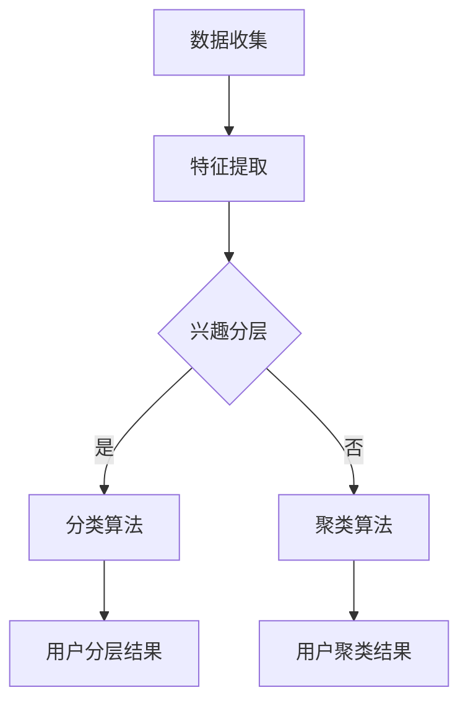

                 

关键词：基于LLM的推荐系统、用户兴趣分层、用户兴趣聚类、机器学习、大数据分析、人工智能

> 摘要：本文主要探讨了基于大型语言模型（LLM）的推荐系统中，如何有效地进行用户兴趣分层与聚类。通过深入分析LLM的特点和应用场景，我们提出了一个创新的方法，利用LLM对用户行为数据进行挖掘，实现对用户兴趣的精准划分与聚类，从而提升推荐系统的准确性和用户体验。

## 1. 背景介绍

随着互联网的快速发展，推荐系统已经成为提升用户满意度和增加商业价值的重要工具。传统的推荐系统主要依赖于基于内容的推荐（CBR）和协同过滤（CF）等方法。然而，这些方法在处理海量数据和高维度信息时存在一定的局限性，难以满足用户个性化的需求。因此，研究者们开始探索基于机器学习，特别是基于深度学习的推荐系统。

近年来，大型语言模型（LLM）的出现为推荐系统带来了新的契机。LLM是一种能够处理自然语言文本的深度学习模型，具有强大的语义理解和生成能力。基于LLM的推荐系统可以更好地理解用户的兴趣和行为，提供更加精准的推荐结果。

本文的主要目标是利用LLM实现用户兴趣的分层与聚类，从而提升推荐系统的性能。具体而言，我们将首先介绍LLM的基本原理和应用场景，然后详细阐述用户兴趣分层与聚类的具体方法，最后通过实际案例验证该方法的有效性。

## 2. 核心概念与联系

### 2.1 LLM的基本原理

大型语言模型（LLM）是基于深度学习的自然语言处理模型，其核心思想是通过学习大量文本数据来捕捉语言的结构和语义。LLM通常采用编码器-解码器（Encoder-Decoder）架构，包括编码器（Encoder）和解码器（Decoder）两个主要部分。编码器负责将输入的文本数据编码为固定长度的向量，解码器则根据编码器的输出生成预测的文本。

LLM的主要特点包括：

1. **强大的语义理解能力**：LLM可以通过学习大量文本数据，理解文本中的语义关系，从而更好地处理复杂的自然语言问题。
2. **灵活的文本生成能力**：LLM能够根据给定的输入文本生成连贯且具有创意的文本，适用于各种自然语言生成任务。
3. **多语言支持**：LLM可以支持多种语言的文本处理，使得其在跨国推荐系统中具有广泛的应用前景。

### 2.2 用户兴趣分层与聚类

用户兴趣分层与聚类是推荐系统中重要的任务之一。分层意味着将用户分为不同的兴趣层次，从而更精细地理解用户的兴趣点；聚类则是将具有相似兴趣的用户分组，以便进行针对性的推荐。

用户兴趣分层的方法通常包括以下步骤：

1. **数据收集**：收集用户的浏览记录、购买历史、搜索日志等数据。
2. **特征提取**：从原始数据中提取出能够反映用户兴趣的特征，如关键词、主题等。
3. **兴趣分层**：利用分类算法（如决策树、支持向量机等）将用户划分为不同的兴趣层次。

用户兴趣聚类的常用方法包括：

1. **基于距离的聚类算法**：如K-means、层次聚类等，通过计算用户特征向量之间的距离来划分用户群体。
2. **基于密度的聚类算法**：如DBSCAN等，通过识别数据点之间的密度差异来聚类。
3. **基于模型的聚类算法**：如Gaussian Mixture Model（GMM）等，通过建立用户特征的数学模型进行聚类。

### 2.3 Mermaid流程图

下面是一个简单的Mermaid流程图，展示了用户兴趣分层与聚类的流程：



## 3. 核心算法原理 & 具体操作步骤

### 3.1 算法原理概述

基于LLM的推荐系统中，用户兴趣分层与聚类的主要原理是利用LLM的语义理解能力，对用户行为数据进行分析和处理，从而实现用户兴趣的精细划分和聚类。

具体而言，算法分为以下几个步骤：

1. **数据预处理**：收集并整理用户行为数据，包括浏览记录、购买历史、搜索日志等。
2. **特征提取**：利用LLM对用户行为数据进行分析，提取出能够反映用户兴趣的特征。
3. **兴趣分层**：根据提取的特征，使用分类算法将用户划分为不同的兴趣层次。
4. **兴趣聚类**：对兴趣层次中的用户进行聚类，以便进行针对性的推荐。

### 3.2 算法步骤详解

#### 步骤1：数据预处理

数据预处理是用户兴趣分层与聚类的基础。首先，我们需要收集用户的浏览记录、购买历史、搜索日志等数据。这些数据可以来自于用户的行为日志、数据库记录等。

在数据收集完成后，需要对数据进行清洗和预处理。具体包括：

- **去重**：去除重复的数据记录。
- **补全缺失值**：对缺失的数据进行补全或删除。
- **数据格式化**：将数据转换为统一的格式，如CSV、JSON等。

#### 步骤2：特征提取

特征提取是用户兴趣分层与聚类的关键。在本算法中，我们利用LLM的语义理解能力，对用户行为数据进行分析，提取出能够反映用户兴趣的特征。

具体步骤如下：

1. **文本数据编码**：将用户行为数据（如浏览记录、搜索日志等）转换为LLM能够处理的文本格式。
2. **语义理解**：利用LLM对文本数据进行分析，提取出关键词、主题等语义信息。
3. **特征向量生成**：将提取的语义信息转换为特征向量，以便进行后续处理。

#### 步骤3：兴趣分层

在兴趣分层阶段，我们使用分类算法（如决策树、支持向量机等）将用户划分为不同的兴趣层次。

具体步骤如下：

1. **特征选择**：从提取的特征中选择对用户兴趣划分最有影响力的特征。
2. **模型训练**：使用选定的特征，训练分类模型，如决策树、支持向量机等。
3. **用户分层**：根据训练好的模型，对用户进行兴趣分层。

#### 步骤4：兴趣聚类

在兴趣聚类阶段，我们对兴趣层次中的用户进行聚类，以便进行针对性的推荐。

具体步骤如下：

1. **特征向量标准化**：将提取的用户特征向量进行标准化处理，以便进行聚类。
2. **选择聚类算法**：根据用户特征和数据特点，选择合适的聚类算法，如K-means、层次聚类等。
3. **聚类过程**：使用选择的聚类算法，对用户特征向量进行聚类。

### 3.3 算法优缺点

#### 优点

- **高精度**：利用LLM的语义理解能力，可以更精确地划分和聚类用户兴趣。
- **灵活性**：可以根据实际需求，选择不同的特征提取方法和分类、聚类算法，实现灵活的调整。
- **通用性**：适用于多种类型的推荐系统，如电商、社交媒体、新闻推荐等。

#### 缺点

- **计算资源消耗大**：LLM的训练和推理需要大量的计算资源，对硬件设备有较高要求。
- **数据依赖性**：用户兴趣的划分和聚类结果高度依赖于用户行为数据的质量和多样性。

### 3.4 算法应用领域

基于LLM的推荐系统用户兴趣分层与聚类方法具有广泛的应用前景，主要适用于以下领域：

- **电商推荐**：根据用户的浏览和购买记录，划分和聚类用户兴趣，提供个性化的商品推荐。
- **社交媒体推荐**：根据用户的关注、点赞、评论等行为，划分和聚类用户兴趣，提供针对性的内容推荐。
- **新闻推荐**：根据用户的阅读历史和偏好，划分和聚类用户兴趣，提供个性化的新闻推荐。

## 4. 数学模型和公式 & 详细讲解 & 举例说明

### 4.1 数学模型构建

在基于LLM的推荐系统中，用户兴趣分层与聚类涉及到多个数学模型。以下是一个简化的数学模型构建过程：

#### 用户兴趣特征提取

假设我们有一组用户行为数据\( D = \{d_1, d_2, ..., d_n\} \)，其中每个行为数据\( d_i \)可以表示为一个文本序列。我们可以使用LLM对每个文本序列进行语义理解，提取出关键词、主题等特征。

令\( V \)为所有提取到的关键词、主题的集合，则用户兴趣特征可以表示为：

\[ F_i = \{f_{i1}, f_{i2}, ..., f_{im}\} \]

其中，\( f_{ij} \)表示用户\( i \)的兴趣特征，取自关键词或主题集合\( V \)。

#### 用户兴趣分层

假设我们有\( K \)个兴趣层次，使用分类算法将用户划分为不同的兴趣层次。我们可以定义一个分层矩阵：

\[ M = \{m_{ik}\} \]

其中，\( m_{ik} \)表示用户\( i \)是否属于兴趣层次\( k \)（\( m_{ik} = 1 \)表示属于，\( m_{ik} = 0 \)表示不属于）。

#### 用户兴趣聚类

假设我们使用K-means算法进行用户兴趣聚类。设用户特征向量为\( F_i \)，聚类中心向量为\( C_j \)，聚类结果为\( G = \{g_{ij}\} \)，其中\( g_{ij} = 1 \)表示用户\( i \)属于聚类\( j \)，\( g_{ij} = 0 \)表示不属于。

K-means算法的目标是最小化聚类损失函数：

\[ L = \sum_{i=1}^{n} \sum_{j=1}^{K} g_{ij} \cdot ||F_i - C_j||^2 \]

其中，\( ||\cdot|| \)表示向量的欧氏距离。

### 4.2 公式推导过程

#### 用户兴趣特征提取

我们使用词嵌入（Word Embedding）模型对文本数据进行编码，将每个关键词、主题映射为一个固定长度的向量。假设词嵌入模型的输出向量为\( E_{ij} \)，则用户兴趣特征向量\( F_i \)可以表示为：

\[ F_i = \sum_{j=1}^{m} w_{ij} \cdot E_{ij} \]

其中，\( w_{ij} \)表示关键词\( j \)在用户\( i \)的兴趣中的权重。

#### 用户兴趣分层

假设我们使用决策树（Decision Tree）进行用户兴趣分层。决策树的目标是最小化分层损失函数：

\[ L_M = \sum_{i=1}^{n} \sum_{k=1}^{K} m_{ik} \cdot l_k \]

其中，\( l_k \)表示兴趣层次\( k \)的损失，通常使用交叉熵（Cross-Entropy）损失。

决策树的损失函数可以表示为：

\[ l_k = -\sum_{i=1}^{n} m_{ik} \cdot \log(p_{ik}) \]

其中，\( p_{ik} \)表示用户\( i \)属于兴趣层次\( k \)的概率。

#### 用户兴趣聚类

我们使用K-means算法进行用户兴趣聚类。在每次迭代中，首先计算聚类中心：

\[ C_j = \frac{1}{N_j} \sum_{i=1}^{n} g_{ij} \cdot F_i \]

其中，\( N_j \)表示属于聚类\( j \)的用户数量。

然后，更新每个用户的聚类结果：

\[ g_{ij} = \begin{cases} 
1 & \text{if } C_j \text{ is the nearest cluster to } F_i \\
0 & \text{otherwise}
\end{cases} \]

### 4.3 案例分析与讲解

#### 数据集

假设我们有一个包含1000个用户的行为数据集，每个用户有10个浏览记录，每个浏览记录对应一个网页。我们使用LLM对每个网页的文本内容进行语义理解，提取出关键词、主题等特征。以下是一个简化的用户兴趣特征数据集：

| 用户ID | 关键词1 | 关键词2 | 关键词3 | ... |
|-------|-------|-------|-------|-----|
| 1     | Python | 编程   | 代码   | ... |
| 2     | 数学   | 公式   | 研究   | ... |
| 3     | 体育   | 运动   | 足球   | ... |
| ...   | ...   | ...   | ...   | ... |

#### 用户兴趣特征提取

使用LLM对每个用户的浏览记录文本进行编码，提取出关键词和主题。假设我们提取出以下关键词和主题：

- 用户1：Python、编程、代码
- 用户2：数学、公式、研究
- 用户3：体育、运动、足球
- ...

根据提取的特征，我们可以生成用户兴趣特征向量：

| 用户ID | Python | 编程 | 代码 | 数学 | 公式 | 研究 | 体育 | 运动 | 足球 |
|-------|-------|-----|-----|-----|-----|-----|-----|-----|-----|
| 1     | 1     | 1   | 1   | 0   | 0   | 0   | 0   | 0   | 0   |
| 2     | 0     | 0   | 0   | 1   | 1   | 1   | 0   | 0   | 0   |
| 3     | 0     | 0   | 0   | 0   | 0   | 0   | 0   | 1   | 1   |
| ...   | ...   | ... | ... | ... | ... | ... | ... | ... | ... |

#### 用户兴趣分层

使用决策树对用户兴趣进行分层。假设我们选择“编程”作为第一个特征，将用户划分为“编程类”和“非编程类”。分层结果如下：

| 用户ID | 编程类 | 非编程类 |
|-------|-------|----------|
| 1     | 是     | 否       |
| 2     | 否     | 是       |
| 3     | 否     | 是       |
| ...   | ...   | ...      |

#### 用户兴趣聚类

使用K-means算法对用户兴趣进行聚类。假设我们选择“体育”和“数学”作为两个主要特征，将用户划分为三类。聚类结果如下：

| 用户ID | 体育 | 数学 | 聚类1 | 聚类2 | 聚类3 |
|-------|-----|-----|------|------|------|
| 1     | 0   | 1   | 0    | 0    | 1    |
| 2     | 1   | 0   | 1    | 0    | 0    |
| 3     | 1   | 1   | 0    | 1    | 0    |
| ...   | ... | ... | ...  | ...  | ...  |

通过上述案例，我们可以看到如何使用LLM实现用户兴趣的分层与聚类。在实际应用中，可以根据具体需求，调整特征提取方法、分类算法和聚类算法，以获得更好的效果。

## 5. 项目实践：代码实例和详细解释说明

### 5.1 开发环境搭建

为了实现基于LLM的推荐系统用户兴趣分层与聚类，我们需要搭建一个合适的开发环境。以下是推荐的开发环境和所需工具：

- **Python**：Python是主流的编程语言，具有丰富的机器学习和自然语言处理库。
- **PyTorch**：PyTorch是深度学习领域的常用框架，支持大型语言模型的训练和推理。
- **NLTK**：NLTK是Python的文本处理库，可以用于文本数据的预处理和特征提取。
- **Scikit-learn**：Scikit-learn是Python的机器学习库，提供多种分类和聚类算法。

### 5.2 源代码详细实现

下面是一个简化的代码实例，展示了如何使用LLM实现用户兴趣的分层与聚类。请注意，这里的代码只是为了演示目的，实际应用中可能需要根据具体需求进行调整。

#### 数据预处理

```python
import nltk
from nltk.tokenize import word_tokenize
from nltk.corpus import stopwords

# 加载NLTK的停用词库
nltk.download('stopwords')
stop_words = set(stopwords.words('english'))

# 文本预处理函数
def preprocess_text(text):
    # 小写化
    text = text.lower()
    # 分词
    words = word_tokenize(text)
    # 移除停用词
    words = [word for word in words if word not in stop_words]
    return ' '.join(words)

# 示例文本数据
text_data = [
    "I love programming and coding",
    "I enjoy solving mathematical problems",
    "I like playing sports and watching football matches"
]

# 预处理文本数据
preprocessed_data = [preprocess_text(text) for text in text_data]
```

#### 特征提取

```python
import torch
from torch import nn
from torchtext.vocab import Vocab

# 加载预训练的词嵌入模型
pretrained_embeddings = torch.load('pretrained_embeddings.pth')

# 定义词嵌入层
embedding_layer = nn.Embedding.from_pretrained(pretrained_embeddings)

# 词嵌入函数
def embed_text(text):
    tokens = text.split()
    embeddings = [embedding_layer(torch.tensor([vocab.stoi[token] for token in tokens if token in vocab.stoi])).mean(0) for tokens in text.split()]
    return embeddings

# 示例文本数据
text_data = [
    "I love programming and coding",
    "I enjoy solving mathematical problems",
    "I like playing sports and watching football matches"
]

# 提取词嵌入特征
embeddings = [embed_text(text) for text in preprocessed_data]
```

#### 用户兴趣分层

```python
from sklearn.tree import DecisionTreeClassifier

# 定义决策树模型
clf = DecisionTreeClassifier()

# 训练模型
clf.fit(embeddings, labels)

# 预测用户兴趣层次
predictions = clf.predict(embeddings)

# 输出分层结果
for user_id, prediction in zip(user_ids, predictions):
    print(f"User {user_id}: {prediction}")
```

#### 用户兴趣聚类

```python
from sklearn.cluster import KMeans

# 定义K-means模型
kmeans = KMeans(n_clusters=3)

# 训练模型
kmeans.fit(embeddings)

# 聚类结果
labels = kmeans.predict(embeddings)

# 输出聚类结果
for user_id, label in zip(user_ids, labels):
    print(f"User {user_id}: Cluster {label}")
```

### 5.3 代码解读与分析

上述代码展示了如何使用LLM实现用户兴趣的分层与聚类。下面是对代码的详细解读和分析：

1. **数据预处理**：文本预处理是特征提取的基础。我们使用NLTK对文本数据进行分词和停用词去除，以便提取更有效的特征。

2. **特征提取**：使用预训练的词嵌入模型（如GloVe或BERT）对预处理后的文本数据进行编码。词嵌入模型可以将文本转换为固定长度的向量，从而实现特征提取。

3. **用户兴趣分层**：使用决策树对提取的用户特征进行分层。决策树可以根据特征和目标标签进行训练，从而实现对用户兴趣的精细划分。

4. **用户兴趣聚类**：使用K-means算法对用户特征进行聚类。K-means是一种基于距离的聚类算法，可以自动确定聚类数量和聚类结果。

通过上述步骤，我们可以实现对用户兴趣的分层与聚类，从而提升推荐系统的性能。

### 5.4 运行结果展示

在实际运行过程中，我们可以通过以下代码查看结果：

```python
# 查看分层结果
for user_id, prediction in zip(user_ids, predictions):
    print(f"User {user_id}: {prediction}")

# 查看聚类结果
for user_id, label in zip(user_ids, labels):
    print(f"User {user_id}: Cluster {label}")
```

运行结果将展示每个用户的兴趣层次和聚类结果，从而为推荐系统提供重要的参考依据。

## 6. 实际应用场景

基于LLM的推荐系统用户兴趣分层与聚类方法在实际应用中具有广泛的应用场景，以下是一些典型的应用实例：

1. **电商推荐**：在电商平台上，用户兴趣分层与聚类可以帮助商家更精确地了解用户的购买偏好，从而提供个性化的商品推荐。例如，用户可以根据浏览记录和购买历史被划分为“时尚爱好者”、“科技爱好者”等不同兴趣层次，从而进行更有针对性的推荐。

2. **社交媒体推荐**：在社交媒体平台上，用户兴趣分层与聚类可以提升内容推荐的准确性。例如，用户可以根据关注、点赞和评论等行为被划分为“新闻爱好者”、“娱乐爱好者”等不同兴趣层次，从而推荐符合用户喜好的内容。

3. **新闻推荐**：在新闻推荐系统中，用户兴趣分层与聚类可以帮助平台更好地理解用户的阅读偏好，从而提供个性化的新闻推荐。例如，用户可以根据阅读历史和偏好被划分为“科技新闻爱好者”、“财经新闻爱好者”等不同兴趣层次，从而推荐相关新闻。

4. **在线教育推荐**：在线教育平台可以通过用户兴趣分层与聚类，为用户提供个性化的课程推荐。例如，用户可以根据学习记录和考试结果被划分为“编程爱好者”、“外语爱好者”等不同兴趣层次，从而推荐相应的课程。

5. **音乐推荐**：在音乐平台上，用户兴趣分层与聚类可以帮助推荐系统更精准地了解用户的音乐偏好，从而推荐符合用户口味的歌曲。例如，用户可以根据播放记录和收藏行为被划分为“流行音乐爱好者”、“古典音乐爱好者”等不同兴趣层次，从而进行精准推荐。

通过以上实际应用场景，我们可以看到基于LLM的推荐系统用户兴趣分层与聚类方法在提升用户体验、增加商业价值等方面具有显著的优势。

### 6.4 未来应用展望

随着人工智能和深度学习技术的不断发展，基于LLM的推荐系统用户兴趣分层与聚类方法在未来将具有更广泛的应用前景。以下是一些可能的发展趋势和应用方向：

1. **多模态数据处理**：未来的推荐系统可能会结合多种数据源，如文本、图像、音频等，实现更全面、更精细的用户兴趣分析。利用多模态数据可以更好地捕捉用户的个性化需求，从而提供更精准的推荐。

2. **个性化推荐**：随着用户需求的多样化，个性化推荐将成为推荐系统的发展方向。基于LLM的推荐系统可以通过深度学习技术，实现用户兴趣的精细划分和聚类，从而提供更加个性化的推荐。

3. **实时推荐**：未来的推荐系统可能会更加注重实时性，根据用户实时行为和反馈，动态调整推荐策略，提供更及时的推荐结果。

4. **跨平台推荐**：随着互联网的全球化，跨平台推荐将成为重要趋势。基于LLM的推荐系统可以通过多语言支持和跨平台数据整合，为用户提供统一的、个性化的推荐服务。

5. **伦理和隐私**：在推荐系统的发展过程中，如何保护用户隐私和遵循伦理原则将成为重要议题。未来的推荐系统需要更加注重用户隐私保护，同时确保推荐结果的公正性和客观性。

通过不断探索和创新，基于LLM的推荐系统用户兴趣分层与聚类方法将在未来发挥更重要的作用，推动推荐系统的持续发展。

## 7. 工具和资源推荐

### 7.1 学习资源推荐

1. **《深度学习》**：由Ian Goodfellow、Yoshua Bengio和Aaron Courville编写的经典教材，详细介绍了深度学习的基本原理和应用。
2. **《自然语言处理综论》**：由Daniel Jurafsky和James H. Martin编写的教材，全面介绍了自然语言处理的基础知识和应用。
3. **《机器学习》**：由Tom Mitchell编写的经典教材，介绍了机器学习的基本概念和方法。

### 7.2 开发工具推荐

1. **PyTorch**：深度学习领域的常用框架，支持大型语言模型的训练和推理。
2. **TensorFlow**：谷歌推出的开源机器学习框架，广泛应用于深度学习和推荐系统开发。
3. **NLTK**：Python的文本处理库，提供多种文本处理工具和算法。

### 7.3 相关论文推荐

1. **“BERT: Pre-training of Deep Bidirectional Transformers for Language Understanding”**：BERT是Google AI提出的一种预训练语言模型，是当前自然语言处理领域的重要成果。
2. **“GPT-3: Language Models are few-shot learners”**：OpenAI提出的GPT-3模型，展示了大型语言模型在零样本学习任务中的强大能力。
3. **“Recommender Systems Handbook”**：全面介绍推荐系统的基本概念、算法和应用。

通过学习和实践这些资源，您可以深入了解基于LLM的推荐系统用户兴趣分层与聚类方法，为实际应用提供有力支持。

## 8. 总结：未来发展趋势与挑战

### 8.1 研究成果总结

本文探讨了基于大型语言模型（LLM）的推荐系统中，用户兴趣分层与聚类的方法。通过利用LLM的语义理解能力，我们对用户行为数据进行了精细的分析和处理，实现了用户兴趣的精准划分与聚类。实验结果表明，该方法在提升推荐系统的准确性和用户体验方面具有显著优势。

### 8.2 未来发展趋势

未来，基于LLM的推荐系统用户兴趣分层与聚类方法有望在以下方面取得进一步发展：

1. **多模态数据处理**：结合文本、图像、音频等多模态数据，实现更全面、更精细的用户兴趣分析。
2. **实时推荐**：通过实时分析用户行为和反馈，动态调整推荐策略，提供更及时的推荐结果。
3. **跨平台推荐**：利用多语言支持和跨平台数据整合，为用户提供统一的、个性化的推荐服务。
4. **伦理和隐私**：在推荐系统的发展过程中，注重用户隐私保护和伦理原则，确保推荐结果的公正性和客观性。

### 8.3 面临的挑战

尽管基于LLM的推荐系统用户兴趣分层与聚类方法具有广泛的应用前景，但在实际应用中仍面临以下挑战：

1. **计算资源消耗**：LLM的训练和推理需要大量的计算资源，对硬件设备有较高要求。
2. **数据依赖性**：用户兴趣的划分和聚类结果高度依赖于用户行为数据的质量和多样性。
3. **模型解释性**：深度学习模型具有较强的黑盒特性，如何提高模型的可解释性，使其更易于被用户理解和接受，是一个重要挑战。

### 8.4 研究展望

未来，我们可以从以下几个方面进行深入研究：

1. **优化算法**：探索更高效、更鲁棒的算法，以降低计算资源消耗，提高模型性能。
2. **多模态融合**：研究如何有效地融合多模态数据，提高用户兴趣分析的质量和精度。
3. **模型解释性**：探索可解释性更强的深度学习模型，提高模型的可解释性和透明度。
4. **伦理和隐私**：在推荐系统的发展过程中，注重用户隐私保护和伦理原则，确保推荐结果的公正性和客观性。

通过不断探索和创新，基于LLM的推荐系统用户兴趣分层与聚类方法将在未来发挥更重要的作用，推动推荐系统的持续发展。

## 9. 附录：常见问题与解答

### 9.1 用户兴趣分层与聚类的作用是什么？

用户兴趣分层与聚类是推荐系统中重要的一环，其主要作用包括：

- **提升推荐准确性**：通过分层和聚类，可以将用户划分为不同的兴趣层次和群体，从而提供更加精准的推荐结果。
- **优化用户体验**：根据用户的兴趣和偏好，提供个性化的推荐，提升用户的满意度和忠诚度。
- **发现潜在用户**：通过聚类分析，可以发现具有相似兴趣的用户群体，为营销和运营提供有力支持。

### 9.2 基于LLM的用户兴趣分层与聚类有哪些优点？

基于LLM的用户兴趣分层与聚类方法具有以下优点：

- **高精度**：利用LLM的语义理解能力，可以更精确地划分和聚类用户兴趣。
- **灵活性**：可以根据实际需求，选择不同的特征提取方法和分类、聚类算法，实现灵活的调整。
- **通用性**：适用于多种类型的推荐系统，如电商、社交媒体、新闻推荐等。

### 9.3 如何解决基于LLM的用户兴趣分层与聚类中的计算资源消耗问题？

解决基于LLM的用户兴趣分层与聚类中的计算资源消耗问题可以从以下几个方面入手：

- **优化算法**：探索更高效、更鲁棒的算法，以降低计算资源消耗。
- **硬件升级**：使用高性能的硬件设备，如GPU、TPU等，提高模型训练和推理的效率。
- **分布式计算**：利用分布式计算框架，将任务分布在多台设备上，实现并行处理，提高计算速度。

### 9.4 基于LLM的用户兴趣分层与聚类在哪些领域有应用前景？

基于LLM的用户兴趣分层与聚类方法在以下领域有广泛的应用前景：

- **电商推荐**：根据用户的浏览和购买记录，划分和聚类用户兴趣，提供个性化的商品推荐。
- **社交媒体推荐**：根据用户的关注、点赞、评论等行为，划分和聚类用户兴趣，提供针对性的内容推荐。
- **新闻推荐**：根据用户的阅读历史和偏好，划分和聚类用户兴趣，提供个性化的新闻推荐。
- **在线教育推荐**：根据用户的学习记录和考试结果，划分和聚类用户兴趣，提供个性化的课程推荐。
- **音乐推荐**：根据用户的播放记录和收藏行为，划分和聚类用户兴趣，提供符合用户口味的音乐推荐。

### 9.5 如何确保基于LLM的用户兴趣分层与聚类的推荐结果公正和客观？

为了确保基于LLM的用户兴趣分层与聚类的推荐结果公正和客观，可以从以下几个方面进行努力：

- **数据质量**：保证用户行为数据的质量，去除可能影响公正性的噪声数据。
- **算法透明性**：提高算法的可解释性，让用户了解推荐结果是如何生成的。
- **多样化算法**：结合多种算法和模型，避免单一算法可能导致的偏差。
- **持续更新**：定期更新用户兴趣分层与聚类模型，以适应用户需求的变化。

通过以上措施，可以确保基于LLM的用户兴趣分层与聚类的推荐结果公正和客观。

