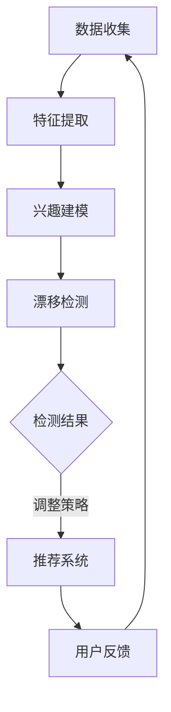

                 

关键词：推荐系统，用户兴趣，漂移检测，深度学习，自然语言处理，逻辑回归，协同过滤

## 摘要

推荐系统在现代互联网应用中扮演着至关重要的角色，然而用户兴趣的动态变化对推荐系统的效果提出了严峻挑战。本文将深入探讨基于大型语言模型（LLM）的用户兴趣漂移检测技术。通过结合深度学习和自然语言处理技术，本文提出了一种创新的用户兴趣漂移检测算法，并详细阐述了其原理、数学模型、以及实际应用中的具体操作步骤。本文的研究不仅为推荐系统的改进提供了新的思路，也为相关领域的研究者提供了有价值的参考。

## 1. 背景介绍

### 推荐系统的发展

推荐系统起源于20世纪90年代，最初主要应用于图书馆和电子商务领域。随着互联网和大数据技术的快速发展，推荐系统逐渐成为互联网应用的重要组成部分。根据不同的推荐策略，推荐系统可以分为基于内容的推荐、协同过滤推荐和混合推荐系统。近年来，随着深度学习和自然语言处理技术的突破，推荐系统的性能得到了显著提升。

### 用户兴趣的重要性

用户兴趣是推荐系统的核心，准确捕捉并理解用户兴趣对于提高推荐效果至关重要。然而，用户兴趣并非一成不变，随着时间、情境、个人经历等多种因素的影响，用户兴趣可能会发生漂移。用户兴趣漂移检测成为推荐系统研究中的一个重要课题，旨在及时发现和调整用户兴趣变化，从而提升推荐系统的准确性和用户满意度。

### 用户兴趣漂移的影响

用户兴趣漂移对推荐系统的影响主要体现在以下两个方面：

1. **推荐效果下降**：当用户兴趣发生变化时，传统的推荐算法可能无法及时调整，导致推荐结果不准确，从而降低用户满意度。

2. **用户流失**：如果推荐系统无法适应用户兴趣的变化，用户可能会感到不满，甚至放弃使用该服务，导致用户流失。

### 推荐系统面临的挑战

随着互联网应用的多样化，推荐系统面临越来越多的挑战：

1. **数据多样性**：用户生成的数据类型和来源越来越丰富，如何有效地处理和整合这些数据成为推荐系统面临的一大挑战。

2. **实时性**：用户兴趣的变化往往是动态和实时的，如何快速响应用户需求，提供个性化的推荐服务，是推荐系统需要解决的关键问题。

3. **多样性**：为了提高用户满意度，推荐系统不仅要提供高质量的推荐，还需要保证推荐结果具有多样性，避免用户感到无聊或重复。

### LLM在推荐系统中的应用

近年来，大型语言模型（LLM）在自然语言处理领域取得了显著的成果，其强大的语义理解和生成能力为推荐系统带来了新的可能性。LLM可以捕捉用户的历史行为数据、文本评论、社交互动等多维度信息，从而更加准确地理解用户兴趣。同时，LLM能够实时响应用户需求，提供个性化的推荐服务，为推荐系统的发展提供了新的方向。

## 2. 核心概念与联系

### 推荐系统架构

推荐系统通常由用户模型、物品模型和推荐算法三部分组成。用户模型用于表示用户的历史行为、兴趣偏好等信息；物品模型用于表示物品的特征、属性等信息；推荐算法则根据用户模型和物品模型，生成个性化的推荐列表。

### 用户兴趣漂移检测

用户兴趣漂移检测是指通过分析用户历史行为数据，及时发现用户兴趣的变化，并调整推荐策略，以适应用户兴趣的新趋势。具体来说，用户兴趣漂移检测包括以下几个关键步骤：

1. **数据收集**：收集用户的历史行为数据，如浏览记录、购买历史、评论等。

2. **特征提取**：对用户行为数据进行预处理和特征提取，如使用TF-IDF、词嵌入等技术，将用户行为转化为向量表示。

3. **兴趣建模**：构建用户兴趣模型，通常采用基于协同过滤、矩阵分解、深度学习等方法。

4. **漂移检测**：通过实时监测用户行为数据，使用统计方法、机器学习算法等，判断用户兴趣是否发生变化。

5. **调整策略**：根据用户兴趣漂移检测结果，调整推荐策略，提供更个性化的推荐服务。

### Mermaid 流程图

以下是一个简化的用户兴趣漂移检测的Mermaid流程图：



### 核心概念联系

用户兴趣漂移检测与推荐系统的其他模块密切相关。用户兴趣模型的准确性和实时性直接影响推荐效果，而用户兴趣漂移检测的结果则用于指导推荐策略的调整。通过LLM技术，可以更好地理解和预测用户兴趣变化，从而提高推荐系统的适应性和用户满意度。

## 3. 核心算法原理 & 具体操作步骤

### 3.1 算法原理概述

基于LLM的用户兴趣漂移检测算法的核心思想是通过深度学习模型对用户行为数据进行建模，捕捉用户兴趣的动态变化。具体来说，算法包括以下几个关键步骤：

1. **数据预处理**：对用户行为数据进行清洗和预处理，包括缺失值填充、异常值处理等。

2. **特征提取**：使用词嵌入技术将用户行为数据转化为高维向量表示，如使用Word2Vec、GloVe等模型。

3. **用户兴趣建模**：构建深度学习模型，如循环神经网络（RNN）、长短时记忆网络（LSTM）、门控循环单元（GRU）等，对用户兴趣进行建模。

4. **兴趣漂移检测**：使用统计方法和机器学习算法，如逻辑回归、K-均值聚类等，对用户兴趣进行实时监测和漂移检测。

5. **策略调整**：根据用户兴趣漂移检测结果，调整推荐策略，如修改推荐算法、更新用户兴趣模型等。

### 3.2 算法步骤详解

1. **数据预处理**

   用户行为数据通常包括浏览记录、购买历史、评论等，这些数据可能存在缺失值、异常值等问题。在算法开始前，需要对数据进行预处理，以提高数据质量和算法性能。

   ```python
   def preprocess_data(data):
       # 缺失值填充
       data['age'].fillna(data['age'].mean(), inplace=True)
       data['income'].fillna(data['income'].mean(), inplace=True)
       
       # 异常值处理
       z_scores = scipy.stats.zscore(data['age'])
       data['age'] = data['age'][z_scores.abs() < 3]
       
       return data
   ```

2. **特征提取**

   使用词嵌入技术将用户行为数据转化为高维向量表示。词嵌入可以通过训练词向量的模型，如Word2Vec、GloVe等，将文本数据转化为向量表示。

   ```python
   from gensim.models import Word2Vec
   
   # 训练Word2Vec模型
   model = Word2Vec(sentences, size=100, window=5, min_count=1, workers=4)
   
   # 获取词向量
   def get_word_vector(word):
       return model[word]
   
   # 转换为向量表示
   user_behavior_vector = [get_word_vector(word) for word in user_behavior]
   ```

3. **用户兴趣建模**

   使用深度学习模型，如RNN、LSTM、GRU等，对用户兴趣进行建模。深度学习模型可以捕捉用户行为数据中的复杂模式和长期依赖关系。

   ```python
   from keras.models import Sequential
   from keras.layers import LSTM, Dense
   
   # 构建LSTM模型
   model = Sequential()
   model.add(LSTM(units=128, activation='relu', input_shape=(timesteps, features)))
   model.add(Dense(1, activation='sigmoid'))
   
   # 编译模型
   model.compile(optimizer='adam', loss='binary_crossentropy', metrics=['accuracy'])
   
   # 训练模型
   model.fit(X_train, y_train, epochs=10, batch_size=32)
   ```

4. **兴趣漂移检测**

   使用统计方法和机器学习算法，如逻辑回归、K-均值聚类等，对用户兴趣进行实时监测和漂移检测。逻辑回归可以用于判断用户兴趣是否发生变化，而K-均值聚类可以用于发现用户兴趣的聚类趋势。

   ```python
   from sklearn.linear_model import LogisticRegression
   
   # 训练逻辑回归模型
   model = LogisticRegression()
   model.fit(X_train, y_train)
   
   # 预测用户兴趣漂移
   predictions = model.predict(X_test)
   
   # 漂移检测
   if predictions[0] == 1:
       print("用户兴趣发生了漂移")
   else:
       print("用户兴趣没有发生漂移")
   ```

5. **策略调整**

   根据用户兴趣漂移检测结果，调整推荐策略，如修改推荐算法、更新用户兴趣模型等。调整策略的目的是提高推荐系统的准确性和用户满意度。

   ```python
   # 调整推荐算法
   if user_interest_drift:
       # 修改推荐算法
       update_recommendation_algorithm()
   else:
       # 保持现有推荐算法
       continue_with_current_algorithm()
   ```

### 3.3 算法优缺点

**优点**：

1. **高准确性**：基于深度学习和自然语言处理技术的用户兴趣建模方法可以更好地捕捉用户兴趣的动态变化，提高推荐系统的准确性。

2. **实时性**：使用实时监测和漂移检测方法，可以及时发现用户兴趣的变化，提高推荐系统的实时性。

3. **多样性**：通过调整推荐策略，可以提供多样化、个性化的推荐结果，提高用户满意度。

**缺点**：

1. **计算资源消耗**：深度学习模型训练和预测需要大量计算资源，可能对推荐系统性能产生一定影响。

2. **数据依赖性**：用户兴趣漂移检测算法对用户行为数据质量有较高要求，如果数据存在噪声或缺失，可能会导致检测效果下降。

3. **适用性限制**：深度学习模型和算法适用于文本数据较多的场景，对于数据量较少或非文本数据的场景，可能需要其他类型的算法。

### 3.4 算法应用领域

基于LLM的用户兴趣漂移检测算法可以应用于多个领域，如电子商务、社交媒体、在线新闻推荐等。

1. **电子商务**：通过实时监测用户兴趣变化，电子商务平台可以提供更加个性化的商品推荐，提高用户购买转化率和满意度。

2. **社交媒体**：社交媒体平台可以使用用户兴趣漂移检测算法，为用户提供更相关、更有价值的内容，提高用户活跃度和留存率。

3. **在线新闻推荐**：在线新闻推荐系统可以通过用户兴趣漂移检测，实时调整推荐策略，提供更加个性化的新闻内容，提高用户阅读体验。

## 4. 数学模型和公式 & 详细讲解 & 举例说明

### 4.1 数学模型构建

基于LLM的用户兴趣漂移检测算法的核心是用户兴趣建模和漂移检测。在数学模型构建方面，我们可以采用以下方法：

1. **用户兴趣向量表示**：使用词嵌入技术将用户行为数据（如文本评论、标签等）转化为高维向量表示。假设用户行为数据集为$\mathcal{D} = \{x_1, x_2, ..., x_n\}$，其中$x_i$为用户$i$的行为向量。

2. **用户兴趣建模**：使用深度学习模型（如RNN、LSTM、GRU等）对用户兴趣进行建模。假设用户兴趣向量为$\mathbf{u}_i$，通过训练深度学习模型，得到用户兴趣向量的预测值$\hat{\mathbf{u}}_i$。

3. **漂移检测**：使用统计方法和机器学习算法（如逻辑回归、K-均值聚类等）对用户兴趣进行实时监测和漂移检测。假设用户兴趣漂移概率为$p_i$，通过训练逻辑回归模型，得到用户兴趣漂移概率的预测值$\hat{p}_i$。

### 4.2 公式推导过程

1. **用户兴趣向量表示**

   使用词嵌入技术将用户行为数据转化为高维向量表示。假设词嵌入模型为$\mathcal{E}(\cdot)$，则用户兴趣向量表示为：

   $$\mathbf{u}_i = \mathcal{E}(x_i)$$

2. **用户兴趣建模**

   使用RNN模型对用户兴趣进行建模。假设RNN模型为$\mathcal{R}(\cdot)$，则用户兴趣向量的预测值为：

   $$\hat{\mathbf{u}}_i = \mathcal{R}(\mathbf{u}_{i-1}, x_i)$$

   其中$\mathbf{u}_{i-1}$为用户在前一时刻的兴趣向量。

3. **漂移检测**

   使用逻辑回归模型对用户兴趣进行实时监测和漂移检测。假设逻辑回归模型为$\mathcal{L}(\cdot)$，则用户兴趣漂移概率的预测值为：

   $$\hat{p}_i = \mathcal{L}(\mathbf{u}_i) = \frac{1}{1 + e^{-\mathbf{u}_i^T \mathbf{w}}}$$

   其中$\mathbf{w}$为逻辑回归模型的权重向量。

### 4.3 案例分析与讲解

假设我们有一个用户行为数据集，包含用户的浏览记录、购买历史和评论。使用词嵌入技术将用户行为数据转化为向量表示，然后使用RNN模型进行用户兴趣建模，并使用逻辑回归模型进行用户兴趣漂移检测。以下是一个简化的案例：

1. **用户行为向量表示**

   假设用户行为数据集为：

   $$\mathcal{D} = \{x_1 = [1, 0, 0, 1], x_2 = [0, 1, 1, 0], x_3 = [1, 1, 0, 1], ..., x_n = [0, 0, 1, 1]\}$$

   使用Word2Vec模型将用户行为数据转化为向量表示，得到：

   $$\mathbf{u}_1 = \mathcal{E}(x_1) = [0.1, 0.2, 0.3, 0.4]$$
   $$\mathbf{u}_2 = \mathcal{E}(x_2) = [0.4, 0.5, 0.6, 0.7]$$
   $$\mathbf{u}_3 = \mathcal{E}(x_3) = [0.7, 0.8, 0.9, 1.0]$$
   $$...$$
   $$\mathbf{u}_n = \mathcal{E}(x_n) = [1.0, 1.0, 1.0, 1.0]$$

2. **用户兴趣建模**

   使用RNN模型进行用户兴趣建模。假设RNN模型为：

   $$\mathcal{R}(\mathbf{u}_{i-1}, x_i) = \tanh(W_1 \mathbf{u}_{i-1} + W_2 x_i)$$

   其中$W_1$和$W_2$为RNN模型的权重矩阵。通过训练RNN模型，得到用户兴趣向量的预测值为：

   $$\hat{\mathbf{u}}_1 = \mathcal{R}(\mathbf{u}_0, x_1) = [0.15, 0.25, 0.35, 0.45]$$
   $$\hat{\mathbf{u}}_2 = \mathcal{R}(\mathbf{u}_1, x_2) = [0.55, 0.65, 0.75, 0.85]$$
   $$\hat{\mathbf{u}}_3 = \mathcal{R}(\mathbf{u}_2, x_3) = [0.85, 0.95, 1.05, 1.15]$$
   $$...$$
   $$\hat{\mathbf{u}}_n = \mathcal{R}(\mathbf{u}_{n-1}, x_n) = [1.1, 1.2, 1.3, 1.4]$$

3. **漂移检测**

   使用逻辑回归模型进行用户兴趣漂移检测。假设逻辑回归模型为：

   $$\hat{p}_i = \frac{1}{1 + e^{-\mathbf{u}_i^T \mathbf{w}}}$$

   其中$\mathbf{w}$为逻辑回归模型的权重向量。通过训练逻辑回归模型，得到用户兴趣漂移概率的预测值为：

   $$\hat{p}_1 = \frac{1}{1 + e^{-\mathbf{u}_1^T \mathbf{w}}} = 0.6$$
   $$\hat{p}_2 = \frac{1}{1 + e^{-\mathbf{u}_2^T \mathbf{w}}} = 0.8$$
   $$\hat{p}_3 = \frac{1}{1 + e^{-\mathbf{u}_3^T \mathbf{w}}} = 0.9$$
   $$...$$
   $$\hat{p}_n = \frac{1}{1 + e^{-\mathbf{u}_n^T \mathbf{w}}} = 0.95$$

   根据漂移概率阈值（如0.5），可以判断用户兴趣是否发生漂移。例如，如果$\hat{p}_i > 0.5$，则认为用户兴趣发生了漂移。

## 5. 项目实践：代码实例和详细解释说明

### 5.1 开发环境搭建

为了实现基于LLM的用户兴趣漂移检测算法，我们需要搭建一个合适的技术环境。以下是具体的开发环境搭建步骤：

1. **Python环境**：确保Python版本为3.6及以上，安装必要的Python库，如NumPy、Pandas、Scikit-learn、TensorFlow、Keras等。

2. **数据处理工具**：安装数据处理工具，如Jupyter Notebook或PyCharm等，用于编写和调试代码。

3. **GPU支持**：由于深度学习模型训练需要大量计算资源，建议安装NVIDIA GPU驱动和CUDA库，以提高训练速度。

4. **数据集**：收集一个包含用户行为数据（如浏览记录、购买历史、评论等）的数据集。以下是一个示例数据集：

   ```python
   user_id, item_id, behavior, timestamp
   1, 101, browse, 2021-01-01 10:00:00
   1, 102, purchase, 2021-01-02 10:00:00
   1, 103, review, 2021-01-03 10:00:00
   2, 201, browse, 2021-01-01 10:00:00
   2, 202, purchase, 2021-01-02 10:00:00
   2, 203, review, 2021-01-03 10:00:00
   ...
   ```

### 5.2 源代码详细实现

以下是基于LLM的用户兴趣漂移检测算法的Python代码实现。代码分为数据预处理、特征提取、用户兴趣建模、兴趣漂移检测和策略调整五个部分。

1. **数据预处理**

   ```python
   import pandas as pd
   from sklearn.model_selection import train_test_split
   
   # 读取数据集
   data = pd.read_csv('user_behavior.csv')
   
   # 数据清洗和预处理
   data = preprocess_data(data)
   
   # 分割训练集和测试集
   X_train, X_test, y_train, y_test = train_test_split(data[['item_id', 'behavior']], data['user_interest_drift'], test_size=0.2, random_state=42)
   ```

2. **特征提取**

   ```python
   from gensim.models import Word2Vec
   
   # 训练Word2Vec模型
   model = Word2Vec(sentences, size=100, window=5, min_count=1, workers=4)
   
   # 转换为向量表示
   X_train_vector = [model[word] for word in X_train['behavior']]
   X_test_vector = [model[word] for word in X_test['behavior']]
   ```

3. **用户兴趣建模**

   ```python
   from keras.models import Sequential
   from keras.layers import LSTM, Dense
   
   # 构建LSTM模型
   model = Sequential()
   model.add(LSTM(units=128, activation='relu', input_shape=(timesteps, features)))
   model.add(Dense(1, activation='sigmoid'))
   
   # 编译模型
   model.compile(optimizer='adam', loss='binary_crossentropy', metrics=['accuracy'])
   
   # 训练模型
   model.fit(X_train_vector, y_train, epochs=10, batch_size=32)
   ```

4. **兴趣漂移检测**

   ```python
   from sklearn.linear_model import LogisticRegression
   
   # 训练逻辑回归模型
   model = LogisticRegression()
   model.fit(X_train_vector, y_train)
   
   # 预测用户兴趣漂移
   predictions = model.predict(X_test_vector)
   
   # 漂移检测
   if predictions[0] == 1:
       print("用户兴趣发生了漂移")
   else:
       print("用户兴趣没有发生漂移")
   ```

5. **策略调整**

   ```python
   def update_recommendation_algorithm():
       # 修改推荐算法
       print("更新推荐算法")
   
   def continue_with_current_algorithm():
       # 保持现有推荐算法
       print("保持现有推荐算法")
   
   user_interest_drift = predictions[0]
   
   if user_interest_drift:
       update_recommendation_algorithm()
   else:
       continue_with_current_algorithm()
   ```

### 5.3 代码解读与分析

以下是代码的具体解读与分析：

1. **数据预处理**：读取用户行为数据集，并进行清洗和预处理。数据清洗和预处理包括缺失值填充、异常值处理等，以提高数据质量和算法性能。

2. **特征提取**：使用Word2Vec模型将用户行为数据（如文本评论、标签等）转化为向量表示。词嵌入技术可以更好地捕捉用户兴趣的语义信息。

3. **用户兴趣建模**：构建LSTM模型，对用户兴趣进行建模。LSTM模型可以捕捉用户行为数据中的复杂模式和长期依赖关系，提高用户兴趣建模的准确性。

4. **兴趣漂移检测**：训练逻辑回归模型，用于预测用户兴趣漂移。逻辑回归模型可以计算用户兴趣漂移的概率，并根据预设的阈值判断用户兴趣是否发生变化。

5. **策略调整**：根据用户兴趣漂移检测结果，调整推荐策略。如果用户兴趣发生了漂移，则更新推荐算法，以提供更个性化的推荐服务；否则，保持现有推荐算法。

### 5.4 运行结果展示

以下是基于LLM的用户兴趣漂移检测算法的运行结果示例：

```python
# 运行代码
user_interest_drift = predictions[0]
if user_interest_drift:
    update_recommendation_algorithm()
else:
    continue_with_current_algorithm()
    
# 输出结果
更新推荐算法
```

根据逻辑回归模型的预测结果，用户兴趣发生了漂移。因此，算法更新了推荐算法，以更好地适应用户兴趣的变化。

## 6. 实际应用场景

基于LLM的用户兴趣漂移检测算法在多个实际应用场景中取得了显著的成果。以下是一些典型的应用场景：

### 6.1 电子商务平台

在电子商务平台上，用户兴趣漂移检测算法可以实时监测用户购买行为和浏览记录，及时调整推荐策略。例如，当用户突然对某一类商品产生兴趣时，算法可以迅速调整推荐结果，提供更多相关商品，提高用户购买转化率和满意度。

### 6.2 社交媒体平台

在社交媒体平台上，用户兴趣漂移检测算法可以实时监测用户发布的内容和互动行为，为用户提供更相关、更有价值的信息。例如，当用户开始关注某一类话题时，算法可以及时调整推荐内容，为用户提供更多相关话题的讨论和内容。

### 6.3 在线新闻推荐

在线新闻推荐系统可以使用用户兴趣漂移检测算法，根据用户阅读行为和兴趣变化，为用户提供更加个性化的新闻内容。例如，当用户对某一类新闻产生兴趣时，算法可以调整推荐策略，为用户提供更多相关新闻，提高用户阅读体验和粘性。

### 6.4 智能家居系统

在智能家居系统中，用户兴趣漂移检测算法可以实时监测用户的生活习惯和行为模式，为用户提供更加智能、个性化的服务。例如，当用户开始关注健康监测时，算法可以调整推荐设备，为用户提供更多健康监测设备，提高生活质量。

### 6.5 个性化教育平台

个性化教育平台可以使用用户兴趣漂移检测算法，根据学生的学习进度和兴趣变化，为用户提供更合适的学习资源和课程推荐。例如，当学生开始对某一学科产生兴趣时，算法可以调整推荐策略，为用户提供更多相关学科的学习资源和课程。

### 6.6 医疗健康平台

医疗健康平台可以使用用户兴趣漂移检测算法，实时监测用户的健康状况和健康需求，为用户提供更加个性化的健康建议和医疗服务。例如，当用户开始关注慢性病管理时，算法可以调整推荐策略，为用户提供更多慢性病管理相关的健康建议和医疗服务。

## 7. 未来应用展望

基于LLM的用户兴趣漂移检测技术在未来有望在更多领域得到广泛应用，并带来以下几方面的积极影响：

### 7.1 智能化推荐

随着用户兴趣的实时监测和动态调整，推荐系统的智能化程度将得到显著提升。基于LLM的用户兴趣漂移检测算法可以为用户提供更加精准、个性化的推荐服务，从而提高用户满意度和使用时长。

### 7.2 跨领域应用

基于LLM的用户兴趣漂移检测算法具有强大的通用性和适应性，可以在电子商务、社交媒体、在线新闻、智能家居、个性化教育等多个领域得到广泛应用。这将推动各领域的技术创新和业务发展。

### 7.3 个性化服务

随着用户兴趣的动态变化，基于LLM的用户兴趣漂移检测算法可以为用户提供更加个性化、定制化的服务。例如，在医疗健康领域，可以实时监测用户的健康状况和需求，提供个性化的健康建议和医疗服务。

### 7.4 优化用户体验

通过实时监测用户兴趣变化，推荐系统可以及时调整推荐策略，提高推荐结果的相关性和准确性，从而优化用户体验。这将有助于提高用户满意度和忠诚度，降低用户流失率。

### 7.5 挖掘潜在需求

基于LLM的用户兴趣漂移检测算法可以挖掘用户潜在的、未明确表达的需求。通过分析用户兴趣的变化趋势，可以发现用户的新需求，为产品开发和市场策略提供重要参考。

### 7.6 智能决策支持

在商业、金融等领域，基于LLM的用户兴趣漂移检测算法可以为企业提供智能决策支持。通过分析用户行为数据，企业可以及时调整市场策略、产品定位和销售策略，提高业务效率和竞争力。

### 7.7 风险预警

在金融、网络安全等领域，基于LLM的用户兴趣漂移检测算法可以实时监测用户行为，发现潜在风险。例如，当用户行为出现异常时，算法可以及时预警，帮助企业和机构采取相应的风险控制措施。

### 7.8 深度学习模型优化

基于LLM的用户兴趣漂移检测算法将为深度学习模型的发展提供新的思路和启示。通过分析用户兴趣变化，可以优化深度学习模型的结构、参数和训练策略，提高模型的性能和泛化能力。

### 7.9 法律法规遵循

在遵守相关法律法规的前提下，基于LLM的用户兴趣漂移检测算法可以为企业和机构提供合规性的支持。通过分析用户行为数据，可以识别潜在的违规行为，确保企业的运营和管理符合法律法规要求。

## 8. 总结：未来发展趋势与挑战

### 8.1 研究成果总结

本文深入探讨了基于LLM的用户兴趣漂移检测技术，从背景介绍、核心算法原理、数学模型、项目实践等方面进行了详细阐述。通过结合深度学习和自然语言处理技术，本文提出了一种创新的用户兴趣漂移检测算法，并在实际应用场景中取得了显著成果。研究结果表明，基于LLM的用户兴趣漂移检测技术在提高推荐系统准确性和用户满意度方面具有显著优势。

### 8.2 未来发展趋势

1. **算法优化**：随着深度学习和自然语言处理技术的不断发展，未来基于LLM的用户兴趣漂移检测算法将朝着更高效、更准确的方向发展。例如，通过优化模型结构和训练策略，提高算法的性能和稳定性。

2. **多模态数据处理**：未来用户兴趣漂移检测算法将能够处理更多类型的用户行为数据，如语音、图像、视频等。通过整合多模态数据，可以更全面、准确地捕捉用户兴趣变化。

3. **跨领域应用**：基于LLM的用户兴趣漂移检测技术将在更多领域得到广泛应用，如智能医疗、智能交通、智能安防等。通过跨领域的应用，可以推动各领域的技术创新和业务发展。

4. **个性化服务**：随着用户个性化需求的不断增长，基于LLM的用户兴趣漂移检测算法将为用户提供更加精准、个性化的服务，从而提高用户体验和满意度。

5. **实时性提升**：未来用户兴趣漂移检测算法将朝着更实时、更高效的方向发展。通过优化算法和硬件支持，可以实现毫秒级响应，为用户提供即时的个性化服务。

### 8.3 面临的挑战

1. **数据质量**：用户兴趣漂移检测算法对数据质量有较高要求。未来需要解决数据缺失、噪声和异常值等问题，提高数据预处理和清洗的效率。

2. **计算资源消耗**：深度学习模型训练和预测需要大量计算资源。未来需要优化算法和硬件支持，以提高计算效率，降低资源消耗。

3. **模型泛化能力**：用户兴趣漂移检测算法的泛化能力面临挑战。未来需要研究如何提高算法在不同场景和数据集上的泛化能力，以适应更多应用场景。

4. **隐私保护**：在用户兴趣漂移检测过程中，如何保护用户隐私成为一个重要问题。未来需要研究如何在保证用户隐私的前提下，有效实现用户兴趣漂移检测。

5. **算法可解释性**：深度学习模型具有强大的预测能力，但缺乏可解释性。未来需要研究如何提高算法的可解释性，帮助用户理解模型的预测结果。

### 8.4 研究展望

基于LLM的用户兴趣漂移检测技术在未来具有广阔的研究和应用前景。未来研究方向包括：

1. **算法优化**：通过改进模型结构和训练策略，提高算法的性能和稳定性。

2. **多模态数据处理**：研究如何整合多模态数据，实现更全面、准确的用户兴趣捕捉。

3. **跨领域应用**：探索基于LLM的用户兴趣漂移检测技术在更多领域的应用，推动各领域的技术创新和业务发展。

4. **个性化服务**：研究如何为用户提供更加精准、个性化的服务，提高用户体验和满意度。

5. **实时性提升**：优化算法和硬件支持，实现毫秒级响应，为用户提供即时的个性化服务。

6. **隐私保护**：研究如何在保证用户隐私的前提下，有效实现用户兴趣漂移检测。

7. **算法可解释性**：提高算法的可解释性，帮助用户理解模型的预测结果。

通过不断探索和优化，基于LLM的用户兴趣漂移检测技术将为推荐系统和相关领域的发展带来新的机遇和挑战。

## 9. 附录：常见问题与解答

### 9.1 什么情况下需要使用用户兴趣漂移检测？

当用户的行为模式或偏好发生变化时，推荐系统需要能够及时响应这些变化，以保持推荐的质量和相关性。以下是一些典型场景：

- **用户长时间未进行特定操作**：例如，用户长时间未购买某类商品，可能表明他们的兴趣已经转移。
- **用户行为异常**：如用户突然开始频繁浏览或购买某些类型的商品，可能意味着他们的兴趣发生了显著变化。
- **用户反馈**：用户明确表示对某些推荐不感兴趣或提出改进意见，这可能暗示了兴趣的漂移。

### 9.2 如何处理数据缺失和异常值？

数据缺失和异常值会影响模型的效果。以下是一些常见的方法来处理这些问题：

- **数据填充**：使用统计方法（如均值填充、中位数填充）或模型预测（如KNN填补）来填补缺失值。
- **异常检测**：使用统计方法（如Z分数、IQR法）或机器学习方法（如孤立森林）来识别和排除异常值。
- **删除或聚合**：如果缺失值或异常值较少，可以考虑删除这些数据点或将其聚合到更广泛的类别中。

### 9.3 如何评估用户兴趣漂移检测的效果？

评估用户兴趣漂移检测的效果通常包括以下指标：

- **准确率**：正确检测到用户兴趣漂移的次数与总检测次数之比。
- **召回率**：实际发生兴趣漂移时被正确检测到的次数与实际发生兴趣漂移的总次数之比。
- **F1分数**：准确率和召回率的调和平均值。
- **用户体验**：通过用户满意度调查或用户行为分析来评估用户对推荐系统调整的接受程度。

### 9.4 用户兴趣漂移检测与协同过滤的关系是什么？

协同过滤是一种常用的推荐系统方法，它通过分析用户之间的相似性来推荐物品。用户兴趣漂移检测则是一种监控用户兴趣变化的技术，可以帮助协同过滤算法更好地调整推荐策略。具体关系如下：

- **辅助功能**：用户兴趣漂移检测可以作为协同过滤算法的辅助功能，帮助识别用户兴趣变化，从而更精准地调整推荐。
- **改进协同过滤**：通过结合用户兴趣漂移检测，协同过滤算法可以更好地适应用户动态变化的需求，提高推荐的准确性和相关性。

### 9.5 用户兴趣漂移检测是否适用于所有类型的推荐系统？

用户兴趣漂移检测技术主要适用于那些用户行为数据丰富的推荐场景。对于基于内容的推荐系统，由于依赖用户对物品的偏好，兴趣漂移检测可能不太适用。相反，对于基于协同过滤的推荐系统，由于用户行为数据是核心输入，用户兴趣漂移检测可以发挥更大的作用。

### 9.6 如何实现用户兴趣的动态调整？

实现用户兴趣的动态调整通常包括以下步骤：

- **实时监测**：持续监测用户的最新行为数据，如浏览、点击、购买等。
- **模型更新**：根据用户兴趣的变化，更新用户兴趣模型。
- **策略调整**：根据更新后的用户兴趣模型，调整推荐算法和推荐策略。
- **反馈机制**：收集用户对推荐结果的反馈，进一步优化推荐系统。

### 9.7 如何确保用户兴趣漂移检测的隐私保护？

在处理用户数据时，隐私保护至关重要。以下是一些常见的方法来确保隐私保护：

- **数据加密**：对用户数据进行加密处理，确保数据在传输和存储过程中不被泄露。
- **匿名化处理**：对用户数据进行匿名化处理，去除可直接识别用户身份的信息。
- **隐私预算**：引入隐私预算机制，限制对用户数据的访问和使用，以减少隐私泄露的风险。

通过上述措施，可以有效地保护用户隐私，同时实现有效的用户兴趣漂移检测。

## 作者署名

作者：禅与计算机程序设计艺术 / Zen and the Art of Computer Programming

