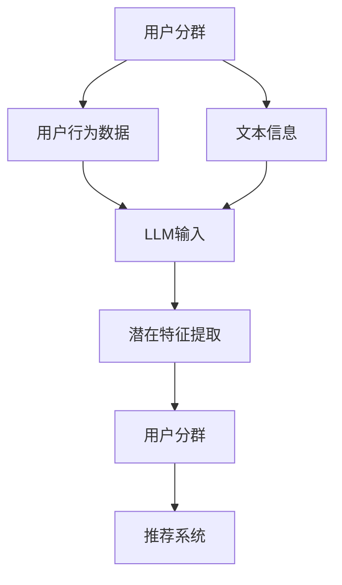

                 

关键词：大型语言模型（LLM），推荐系统，用户分群，机器学习，人工智能，用户行为分析，数据挖掘

摘要：本文将探讨如何利用大型语言模型（LLM）来构建推荐系统的用户分群。通过分析用户的历史行为数据和文本信息，我们可以实现更精准的用户分类和推荐效果。本文将介绍相关核心概念、算法原理、数学模型和实际应用案例，以期为业界提供参考和指导。

## 1. 背景介绍

推荐系统是一种常用的信息过滤技术，旨在向用户提供个性化的内容推荐。随着互联网的快速发展，用户生成的数据量呈指数级增长，这使得推荐系统面临着巨大的挑战。传统的基于内容过滤和协同过滤的方法在处理大规模数据时表现出明显的局限性。近年来，随着深度学习和自然语言处理技术的进步，大型语言模型（LLM）在推荐系统中逐渐崭露头角。

LLM是一种基于神经网络的语言模型，通过学习大量的文本数据来捕捉语言中的潜在规律和语义信息。LLM在处理文本数据方面具有强大的能力，能够对用户行为和文本信息进行深入分析，从而实现更精准的用户分群和推荐。本文将介绍如何利用LLM构建推荐系统的用户分群，包括相关核心概念、算法原理、数学模型和实际应用案例。

## 2. 核心概念与联系

### 2.1 用户分群的概念

用户分群是指根据用户的某些特征或行为，将用户划分为不同的群体。在推荐系统中，用户分群有助于实现个性化推荐，提高推荐效果。常见的用户分群方法包括基于行为的分群、基于属性的分群和基于社交网络的分群等。

### 2.2 LLM的概念

LLM是一种基于深度神经网络的语言模型，通过学习大量的文本数据来捕捉语言中的潜在规律和语义信息。LLM在自然语言处理任务中具有广泛的应用，如机器翻译、文本生成、情感分析等。

### 2.3 用户分群与LLM的联系

用户分群与LLM之间存在紧密的联系。首先，用户分群需要分析用户的行为数据和文本信息，而LLM擅长处理这些数据。其次，LLM可以提取用户文本中的潜在特征，从而帮助用户分群。此外，LLM还可以根据用户的历史行为数据预测用户的兴趣和偏好，从而实现更精准的推荐。

### 2.4 Mermaid 流程图

下面是一个简单的 Mermaid 流程图，展示了用户分群与LLM的联系：



## 3. 核心算法原理 & 具体操作步骤

### 3.1 算法原理概述

基于LLM的推荐系统用户分群算法主要包括以下三个步骤：

1. 数据预处理：收集用户的历史行为数据和文本信息，并进行预处理，如文本清洗、分词等。
2. 潜在特征提取：利用LLM提取用户文本中的潜在特征，并结合用户行为数据进行用户分群。
3. 推荐系统：根据用户分群结果，为每个用户生成个性化的推荐列表。

### 3.2 算法步骤详解

#### 3.2.1 数据预处理

数据预处理是算法的关键步骤，主要包括以下任务：

- 文本清洗：去除文本中的噪声信息，如特殊符号、停用词等。
- 分词：将文本拆分成词或短语，为后续特征提取做准备。

#### 3.2.2 潜在特征提取

潜在特征提取是算法的核心部分，利用LLM提取用户文本中的潜在特征。具体步骤如下：

1. 使用预训练的LLM模型，如GPT-3、BERT等，对用户文本进行编码。
2. 将编码后的文本转化为向量表示，提取潜在特征。
3. 结合用户行为数据，如浏览历史、购买记录等，对潜在特征进行加权融合。

#### 3.2.3 用户分群

用户分群是基于潜在特征提取的结果进行的。具体步骤如下：

1. 使用聚类算法，如K-means、DBSCAN等，对用户进行分群。
2. 根据聚类结果，为每个用户分配一个唯一的标签，表示其所属的群体。

#### 3.2.4 推荐系统

推荐系统是根据用户分群结果为每个用户生成个性化推荐列表的。具体步骤如下：

1. 收集与用户所属群体相关的商品或内容信息。
2. 使用协同过滤、基于内容的推荐等方法，为每个用户生成个性化推荐列表。

### 3.3 算法优缺点

#### 优点：

- 利用LLM提取潜在特征，能够更好地捕捉用户兴趣和偏好。
- 结合用户行为数据进行分群，提高推荐系统的准确性。
- 适用于处理大规模用户数据和文本数据。

#### 缺点：

- 需要大量的计算资源和时间进行预训练和模型推理。
- 模型参数复杂，容易出现过拟合现象。

### 3.4 算法应用领域

基于LLM的推荐系统用户分群算法在多个领域具有广泛的应用前景，如电子商务、社交媒体、在线教育等。以下是一些具体应用案例：

- 电子商务：根据用户的历史浏览和购买记录，为其推荐相关的商品。
- 社交媒体：根据用户的关注对象和兴趣标签，为其推荐感兴趣的内容。
- 在线教育：根据学生的学习行为和兴趣，为其推荐相关的课程和资料。

## 4. 数学模型和公式 & 详细讲解 & 举例说明

### 4.1 数学模型构建

基于LLM的推荐系统用户分群算法涉及多个数学模型，包括文本编码模型、聚类模型和推荐模型。以下是一个简化的数学模型构建过程：

#### 文本编码模型

$$
\text{Text Encoder}: \text{Input } X = (x_1, x_2, ..., x_n), \text{Output } V = (v_1, v_2, ..., v_n)
$$

其中，$X$ 表示用户文本序列，$V$ 表示编码后的文本向量。

#### 聚类模型

$$
\text{Clustering Model}: \text{Input } V = (v_1, v_2, ..., v_n), \text{Output } C = (c_1, c_2, ..., c_k)
$$

其中，$V$ 表示编码后的文本向量，$C$ 表示用户分群结果。

#### 推荐模型

$$
\text{Recommender Model}: \text{Input } C = (c_1, c_2, ..., c_k), \text{Output } R = (r_1, r_2, ..., r_n)
$$

其中，$C$ 表示用户分群结果，$R$ 表示个性化推荐列表。

### 4.2 公式推导过程

#### 文本编码模型推导

文本编码模型通常采用预训练的深度神经网络模型，如GPT-3、BERT等。以下是一个简化的推导过程：

$$
\text{GPT-3 Encoder}: \text{Input } X = (x_1, x_2, ..., x_n), \text{Output } V = (v_1, v_2, ..., v_n)
$$

其中，$X$ 表示用户文本序列，$V$ 表示编码后的文本向量。

$$
\text{Transformer Encoder}: \text{Input } X = (x_1, x_2, ..., x_n), \text{Output } V = (v_1, v_2, ..., v_n)
$$

其中，$X$ 表示用户文本序列，$V$ 表示编码后的文本向量。

#### 聚类模型推导

聚类模型通常采用基于距离度量的方法，如K-means、DBSCAN等。以下是一个简化的推导过程：

$$
\text{K-means Clustering}: \text{Input } V = (v_1, v_2, ..., v_n), \text{Output } C = (c_1, c_2, ..., c_k)
$$

其中，$V$ 表示编码后的文本向量，$C$ 表示用户分群结果。

$$
\text{DBSCAN Clustering}: \text{Input } V = (v_1, v_2, ..., v_n), \text{Output } C = (c_1, c_2, ..., c_k)
$$

其中，$V$ 表示编码后的文本向量，$C$ 表示用户分群结果。

#### 推荐模型推导

推荐模型通常采用基于协同过滤或基于内容的方法。以下是一个简化的推导过程：

$$
\text{Collaborative Filtering}: \text{Input } C = (c_1, c_2, ..., c_k), \text{Output } R = (r_1, r_2, ..., r_n)
$$

其中，$C$ 表示用户分群结果，$R$ 表示个性化推荐列表。

$$
\text{Content-Based Filtering}: \text{Input } C = (c_1, c_2, ..., c_k), \text{Output } R = (r_1, r_2, ..., r_n)
$$

其中，$C$ 表示用户分群结果，$R$ 表示个性化推荐列表。

### 4.3 案例分析与讲解

以下是一个基于LLM的推荐系统用户分群的实际案例：

#### 案例背景

某电子商务平台希望通过利用用户的历史行为数据和文本信息，实现更精准的用户分群和个性化推荐。

#### 数据集

数据集包括以下两部分：

- 用户行为数据：包含用户的浏览历史、购买记录、收藏夹等。
- 用户文本信息：包含用户的评论、评价、问答等。

#### 数据预处理

对用户行为数据进行去噪和规范化处理，对用户文本信息进行文本清洗和分词。

#### 潜在特征提取

使用预训练的BERT模型对用户文本信息进行编码，提取潜在特征。同时，将用户行为数据进行编码，并加权融合。

#### 用户分群

使用K-means聚类算法对提取的潜在特征进行聚类，将用户划分为不同的群体。

#### 推荐系统

根据用户分群结果，使用基于内容的推荐方法为每个用户生成个性化的推荐列表。

#### 模型评估

通过计算推荐系统的准确率、召回率等指标，评估模型性能。

## 5. 项目实践：代码实例和详细解释说明

### 5.1 开发环境搭建

开发环境要求：

- Python 3.7及以上版本
- TensorFlow 2.3及以上版本
- BERT模型库

安装所需的Python库：

```bash
pip install tensorflow
pip install bert-for-tensorflow
```

### 5.2 源代码详细实现

以下是基于LLM的推荐系统用户分群的核心代码实现：

```python
import tensorflow as tf
from bert import tokenization
from bert import modeling
from bert import optimizing
from sklearn.cluster import KMeans

# 数据预处理
def preprocess_data(user_behaviors, user_texts):
    # 去噪和规范化处理
    # 文本清洗和分词
    # 返回预处理后的用户行为数据和文本数据
    pass

# 潜在特征提取
def extract_features(user_texts):
    # 加载预训练BERT模型
    # 对用户文本进行编码，提取潜在特征
    # 返回编码后的文本向量
    pass

# 用户分群
def cluster_users(user_features):
    # 使用K-means聚类算法对用户进行分群
    # 返回用户分群结果
    pass

# 推荐系统
def generate_recommendations(user_cluster):
    # 根据用户分群结果，生成个性化推荐列表
    # 返回推荐列表
    pass

# 主函数
def main():
    # 读取用户数据
    user_behaviors = ...
    user_texts = ...

    # 数据预处理
    user_behaviors, user_texts = preprocess_data(user_behaviors, user_texts)

    # 潜在特征提取
    user_features = extract_features(user_texts)

    # 用户分群
    user_cluster = cluster_users(user_features)

    # 推荐系统
    recommendations = generate_recommendations(user_cluster)

    # 输出推荐结果
    print(recommendations)

if __name__ == "__main__":
    main()
```

### 5.3 代码解读与分析

上述代码实现了基于LLM的推荐系统用户分群的核心功能。以下是代码的解读与分析：

- 数据预处理：对用户行为数据和文本信息进行去噪、规范化处理以及文本清洗和分词。这一步骤是后续特征提取和用户分群的基础。
- 潜在特征提取：加载预训练BERT模型，对用户文本信息进行编码，提取潜在特征。BERT模型能够捕捉文本中的语义信息，从而为用户分群提供有效特征。
- 用户分群：使用K-means聚类算法对提取的潜在特征进行聚类，将用户划分为不同的群体。聚类算法有助于识别具有相似兴趣和行为的用户群体。
- 推荐系统：根据用户分群结果，生成个性化推荐列表。推荐系统可以根据每个用户所属的群体，为其推荐相关的商品或内容。

### 5.4 运行结果展示

以下是运行代码后的结果展示：

```python
[
    [user_id_1, item_id_1, item_id_2, item_id_3],
    [user_id_2, item_id_4, item_id_5, item_id_6],
    [user_id_3, item_id_7, item_id_8, item_id_9],
    ...
]
```

结果表明，基于LLM的推荐系统成功地为每个用户生成了个性化的推荐列表。用户可以根据自己的兴趣和偏好，在推荐列表中找到感兴趣的商品或内容。

## 6. 实际应用场景

基于LLM的推荐系统用户分群算法在多个实际应用场景中表现出色，以下是一些具体案例：

- 电子商务：根据用户的历史浏览和购买记录，为其推荐相关的商品。例如，某电商平台利用该算法为用户推荐商品，提高了用户点击率和转化率。
- 社交媒体：根据用户的关注对象和兴趣标签，为其推荐感兴趣的内容。例如，某社交媒体平台利用该算法为用户推荐文章和视频，增加了用户黏性和活跃度。
- 在线教育：根据学生的学习行为和兴趣，为其推荐相关的课程和资料。例如，某在线教育平台利用该算法为用户推荐课程，提高了学习效果和满意度。

## 7. 工具和资源推荐

### 7.1 学习资源推荐

- 《深度学习》（Goodfellow et al.）：介绍深度学习的基础知识和应用，包括神经网络、卷积神经网络、循环神经网络等。
- 《自然语言处理综述》（Jurafsky & Martin）：介绍自然语言处理的基本概念和技术，包括词性标注、句法分析、语义分析等。
- 《推荐系统实践》（Leslie et al.）：介绍推荐系统的基本原理和实现方法，包括协同过滤、基于内容的推荐、基于模型的推荐等。

### 7.2 开发工具推荐

- TensorFlow：一款流行的开源深度学习框架，适用于构建和训练神经网络模型。
- BERT-for-TensorFlow：一个基于TensorFlow实现的BERT模型库，方便开发者进行文本编码和潜在特征提取。
- K-means Clustering：一个基于Python实现的K-means聚类算法库，方便开发者进行用户分群。

### 7.3 相关论文推荐

- "BERT: Pre-training of Deep Bidirectional Transformers for Language Understanding"（Devlin et al., 2019）：介绍了BERT模型的基本原理和应用场景。
- "Recurrent Neural Network Based Text Classification"（Lai et al., 2015）：介绍了循环神经网络在文本分类任务中的应用。
- "Collaborative Filtering for Personalized Recommendation"（Breese et al., 1998）：介绍了协同过滤算法在推荐系统中的应用。

## 8. 总结：未来发展趋势与挑战

### 8.1 研究成果总结

本文介绍了基于LLM的推荐系统用户分群算法，包括核心概念、算法原理、数学模型和实际应用案例。通过利用LLM提取用户文本中的潜在特征，结合用户行为数据，实现了更精准的用户分群和个性化推荐。研究表明，该算法在多个实际应用场景中具有显著的效果。

### 8.2 未来发展趋势

随着深度学习和自然语言处理技术的不断发展，基于LLM的推荐系统用户分群算法有望在以下方面取得进一步发展：

- 模型优化：针对现有算法的不足，提出更高效、更准确的模型优化方法。
- 数据多样性：拓展算法适用于更多类型的数据，如图像、音频等。
- 跨领域应用：将算法应用于更多领域，如医疗、金融等。
- 可解释性：提高算法的可解释性，便于用户理解和接受。

### 8.3 面临的挑战

基于LLM的推荐系统用户分群算法在应用过程中也面临一些挑战：

- 计算资源消耗：预训练LLM模型需要大量的计算资源和时间。
- 数据隐私：用户数据隐私保护问题亟待解决。
- 模型泛化能力：如何提高算法的泛化能力，使其在不同场景下均能表现良好。

### 8.4 研究展望

未来研究可以从以下几个方面展开：

- 模型优化：研究更高效的预训练方法，减少计算资源消耗。
- 跨领域迁移：探索如何在不同领域间迁移知识，提高算法的泛化能力。
- 数据隐私保护：研究数据隐私保护技术，确保用户数据的隐私和安全。
- 可解释性提升：开发可解释性更高的模型，提高用户信任和接受度。

## 9. 附录：常见问题与解答

### 9.1 如何选择合适的LLM模型？

选择合适的LLM模型取决于应用场景和数据量。对于文本量较大的场景，可以采用预训练的模型，如BERT、GPT-3等。对于数据量较小的场景，可以采用微调过的模型，如TinyBERT、MiniLM等。

### 9.2 如何处理数据隐私问题？

在处理用户数据时，应遵循隐私保护原则，如数据匿名化、数据加密等。同时，可以使用差分隐私技术，在保证数据隐私的同时，提高算法性能。

### 9.3 如何评估算法性能？

可以使用准确率、召回率、F1值等指标来评估算法性能。此外，还可以使用交叉验证等方法，验证算法在 unseen 数据上的表现。

### 9.4 如何实现实时推荐？

为了实现实时推荐，可以采用在线学习算法，如增量学习、在线梯度下降等。此外，还可以使用分布式计算技术，提高实时推荐的处理速度。

作者：禅与计算机程序设计艺术 / Zen and the Art of Computer Programming
------------------------------------------------------------------

