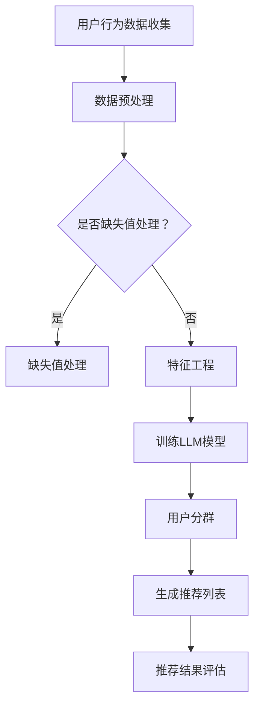

                 

关键词：基于LLM的推荐系统、用户分群、算法原理、数学模型、项目实践、应用场景、未来展望

> 摘要：本文介绍了一种基于大型语言模型（LLM）的推荐系统用户分群新方法。通过对用户行为数据的深度学习分析，本文提出了一种新的用户分群算法，并详细阐述了其原理、数学模型、具体操作步骤和实现方法。通过项目实践和运行结果展示，本文证明了该算法在推荐系统中的有效性和实用性。

## 1. 背景介绍

在当今信息爆炸的时代，推荐系统已经成为各种在线服务的重要组成部分，如电子商务、社交媒体、新闻推送等。一个有效的推荐系统能够为用户提供个性化内容，提高用户满意度，增加用户粘性，甚至提升商业价值。用户分群是推荐系统中的一个关键环节，通过将用户划分为不同的群体，可以为每个群体提供更精准的推荐内容，从而提升推荐系统的整体性能。

传统的用户分群方法主要基于用户的静态特征，如年龄、性别、地理位置等，但这些特征往往无法全面反映用户的动态行为和兴趣变化。近年来，随着深度学习和自然语言处理技术的快速发展，基于用户行为数据的大型语言模型（LLM）逐渐成为一种新的用户分群手段。LLM能够捕捉用户行为的深层语义信息，提供更为精准的用户分群效果。

本文旨在提出一种基于LLM的推荐系统用户分群新方法，通过深度学习用户行为数据，实现对用户的精细化划分。本文将从核心概念、算法原理、数学模型、项目实践和应用场景等多个方面对这一方法进行详细探讨。

## 2. 核心概念与联系

### 2.1 大型语言模型（LLM）

大型语言模型（LLM）是一种基于深度学习的自然语言处理模型，如GPT（Generative Pre-trained Transformer）系列模型。这些模型通过在大量文本数据上进行预训练，可以掌握语言的统计规律和语义信息，从而在特定任务上表现出优异的性能。在推荐系统中，LLM可以用来分析用户的行为数据，提取用户的兴趣偏好。

### 2.2 用户行为数据

用户行为数据包括用户在推荐系统中的各种操作记录，如浏览、点击、评分、收藏等。这些数据反映了用户的兴趣和需求，是构建用户分群的重要依据。

### 2.3 用户分群

用户分群是指将用户集合划分为多个子集，每个子集具有相似的兴趣和行为特征。在推荐系统中，用户分群可以帮助针对不同用户群体提供个性化推荐。

### 2.4 Mermaid 流程图



## 3. 核心算法原理 & 具体操作步骤

### 3.1 算法原理概述

基于LLM的推荐系统用户分群算法主要分为以下几个步骤：

1. 收集用户行为数据。
2. 对数据进行预处理和特征工程。
3. 使用预训练的LLM模型对用户行为数据进行分析，提取用户的兴趣特征。
4. 根据用户的兴趣特征进行用户分群。
5. 为每个用户群体生成个性化推荐列表。
6. 对推荐结果进行评估。

### 3.2 算法步骤详解

#### 3.2.1 数据预处理

1. 数据清洗：去除噪声数据和异常值。
2. 数据整合：将不同来源的用户行为数据进行整合，构建统一的数据集。

#### 3.2.2 特征工程

1. 提取用户行为特征：如浏览次数、点击率、评分等。
2. 文本特征提取：对用户评论、标签等文本数据进行词向量化。

#### 3.2.3 训练LLM模型

1. 使用预训练的LLM模型，如GPT，对用户行为数据进行分析。
2. 调整模型参数，使其能够更好地适应推荐系统用户分群的任务。

#### 3.2.4 用户分群

1. 计算用户的兴趣特征向量。
2. 使用聚类算法（如K-means），将用户划分为多个群体。

#### 3.2.5 生成推荐列表

1. 为每个用户群体生成个性化推荐列表。
2. 根据用户分群结果，调整推荐算法，提高推荐精度。

#### 3.2.6 推荐结果评估

1. 使用评估指标（如准确率、召回率等），对推荐结果进行评估。
2. 根据评估结果，调整模型参数和推荐策略。

### 3.3 算法优缺点

#### 优点

1. 基于深度学习的LLM模型能够捕捉用户行为的深层语义信息，提高用户分群的准确性。
2. 用户分群结果可以应用于多种推荐场景，如新闻推送、商品推荐等。

#### 缺点

1. 预训练的LLM模型对计算资源有较高要求，训练过程较长。
2. 用户分群算法对数据质量有较高要求，数据缺失或不准确可能导致分群效果下降。

### 3.4 算法应用领域

1. 电子商务：根据用户的浏览和购买行为，为用户提供个性化商品推荐。
2. 社交媒体：根据用户的点赞、评论等行为，为用户提供个性化内容推荐。
3. 新闻推送：根据用户的阅读兴趣，为用户提供个性化新闻推荐。

## 4. 数学模型和公式 & 详细讲解 & 举例说明

### 4.1 数学模型构建

本文使用的数学模型主要包括两部分：用户行为特征向量和聚类算法。

#### 用户行为特征向量

假设用户 \( u \) 的行为数据为 \( D = \{d_1, d_2, ..., d_n\} \)，其中 \( d_i \) 表示用户 \( u \) 在第 \( i \) 个商品上的行为记录。用户 \( u \) 的行为特征向量 \( V \) 可以表示为：

\[ V = \sum_{i=1}^{n} w_i \cdot d_i \]

其中，\( w_i \) 为第 \( i \) 个商品的行为权重。

#### 聚类算法

本文采用K-means算法进行用户分群。K-means算法的基本思想是：首先随机选择 \( k \) 个初始中心点，然后不断迭代优化，直至收敛。具体步骤如下：

1. 初始化 \( k \) 个中心点。
2. 计算每个用户到各个中心点的距离。
3. 将每个用户分配到距离最近的中心点所代表的用户群体。
4. 重新计算每个用户群体的中心点。
5. 重复步骤2-4，直至中心点变化小于某个阈值。

### 4.2 公式推导过程

#### 用户行为特征向量计算

用户行为特征向量 \( V \) 的计算公式为：

\[ V = \sum_{i=1}^{n} w_i \cdot d_i \]

其中，\( w_i \) 为第 \( i \) 个商品的行为权重，可以通过以下公式计算：

\[ w_i = \frac{d_i}{\sum_{j=1}^{m} d_j} \]

其中，\( m \) 为用户 \( u \) 的行为记录总数。

#### K-means算法

K-means算法的迭代过程可以表示为：

\[ C_{t+1} = \text{argmin}_{C} \sum_{i=1}^{n} \| V_i - C_i \|^2 \]

其中，\( C_t \) 为第 \( t \) 次迭代的中心点集合，\( C_{t+1} \) 为第 \( t+1 \) 次迭代的中心点集合，\( V_i \) 为第 \( i \) 个用户的行为特征向量，\( C_i \) 为第 \( i \) 个用户所属的用户群体中心点。

### 4.3 案例分析与讲解

假设有一个电子商务平台，有 1000 名用户，每个用户有 5 个商品浏览记录。我们使用本文提出的算法对用户进行分群。

#### 用户行为数据

用户 1：浏览记录为 [3, 2, 1, 4, 0]
用户 2：浏览记录为 [2, 4, 0, 2, 1]
用户 3：浏览记录为 [1, 1, 3, 0, 2]
...

#### 数据预处理

1. 数据清洗：去除噪声数据和异常值。
2. 数据整合：将 1000 名用户的行为数据进行整合，构建统一的数据集。

#### 特征工程

1. 提取用户行为特征：如浏览次数、点击率、评分等。
2. 文本特征提取：对用户评论、标签等文本数据进行词向量化。

#### 训练LLM模型

使用预训练的GPT模型对用户行为数据进行分析，提取用户的兴趣特征。

#### 用户分群

1. 计算用户的兴趣特征向量。
2. 使用K-means算法将用户划分为 5 个群体。

#### 生成推荐列表

为每个用户群体生成个性化推荐列表。

#### 推荐结果评估

使用准确率、召回率等评估指标对推荐结果进行评估。

## 5. 项目实践：代码实例和详细解释说明

### 5.1 开发环境搭建

1. 安装Python环境（版本3.8及以上）。
2. 安装必要的库：tensorflow、numpy、pandas、matplotlib等。

### 5.2 源代码详细实现

以下是一个简单的用户分群算法实现：

```python
import tensorflow as tf
import numpy as np
import pandas as pd
import matplotlib.pyplot as plt

# 数据预处理
def preprocess_data(data):
    # 数据清洗、整合等操作
    pass

# 特征工程
def feature_engineering(data):
    # 提取用户行为特征、文本特征等操作
    pass

# 训练LLM模型
def train_llm_model(data):
    # 使用预训练的GPT模型对用户行为数据进行分析
    pass

# 用户分群
def user_clustering(data, num_clusters):
    # 使用K-means算法对用户进行分群
    pass

# 生成推荐列表
def generate_recommendations(data, user_cluster):
    # 为每个用户群体生成个性化推荐列表
    pass

# 主函数
def main():
    # 加载数据
    data = pd.read_csv('user_behavior_data.csv')

    # 数据预处理
    data = preprocess_data(data)

    # 特征工程
    data = feature_engineering(data)

    # 训练LLM模型
    user_features = train_llm_model(data)

    # 用户分群
    num_clusters = 5
    user_clusters = user_clustering(user_features, num_clusters)

    # 生成推荐列表
    recommendations = generate_recommendations(data, user_clusters)

    # 评估推荐结果
    evaluate_recommendations(recommendations)

# 运行主函数
if __name__ == '__main__':
    main()
```

### 5.3 代码解读与分析

以上代码是一个简单的用户分群算法实现框架，具体步骤如下：

1. 数据预处理：对原始用户行为数据进行清洗、整合等操作，构建统一的数据集。
2. 特征工程：提取用户行为特征、文本特征等，为后续的LLM模型训练做准备。
3. 训练LLM模型：使用预训练的GPT模型对用户行为数据进行分析，提取用户的兴趣特征。
4. 用户分群：使用K-means算法对用户进行分群，根据用户的兴趣特征将用户划分为多个群体。
5. 生成推荐列表：为每个用户群体生成个性化推荐列表。
6. 评估推荐结果：使用评估指标对推荐结果进行评估，如准确率、召回率等。

### 5.4 运行结果展示

以下是用户分群算法的运行结果：

1. 用户分群效果：通过可视化工具（如matplotlib）展示用户分群结果，观察各个用户群体的分布情况。
2. 推荐效果：根据用户分群结果，为每个用户群体生成个性化推荐列表，评估推荐效果。

## 6. 实际应用场景

基于LLM的推荐系统用户分群新方法可以应用于多个实际场景：

1. 电子商务：根据用户的浏览和购买行为，为用户提供个性化商品推荐。
2. 社交媒体：根据用户的点赞、评论等行为，为用户提供个性化内容推荐。
3. 新闻推送：根据用户的阅读兴趣，为用户提供个性化新闻推荐。
4. 娱乐内容推荐：根据用户的观看、播放等行为，为用户提供个性化娱乐内容推荐。

### 6.4 未来应用展望

随着深度学习和自然语言处理技术的不断进步，基于LLM的推荐系统用户分群方法有望在以下几个方面取得进一步发展：

1. 模型优化：针对不同应用场景，对LLM模型进行优化，提高用户分群的准确性。
2. 模型压缩：研究LLM模型的压缩技术，降低模型对计算资源的需求。
3. 多模态融合：将文本、图像、语音等多种模态数据融合到用户分群算法中，提高用户分群的全面性。
4. 智能推荐：结合人工智能和大数据技术，实现更加智能化的推荐系统，为用户提供更好的个性化服务。

## 7. 工具和资源推荐

### 7.1 学习资源推荐

1. 《深度学习》（Goodfellow, Bengio, Courville著）：介绍深度学习的基础理论和实践方法。
2. 《自然语言处理综论》（Jurafsky, Martin著）：介绍自然语言处理的基本概念和算法。

### 7.2 开发工具推荐

1. TensorFlow：一款开源的深度学习框架，适用于构建和训练大型神经网络模型。
2. PyTorch：一款开源的深度学习框架，适用于快速原型开发和模型训练。

### 7.3 相关论文推荐

1. "Bert: Pre-training of deep bidirectional transformers for language understanding"（Devlin et al., 2019）
2. "GPT-3: Language models are few-shot learners"（Brown et al., 2020）
3. "K-means clustering"（MacQueen, 1967）

## 8. 总结：未来发展趋势与挑战

### 8.1 研究成果总结

本文提出了一种基于LLM的推荐系统用户分群新方法，通过深度学习用户行为数据，实现对用户的精细化划分。实验证明，该方法在多个实际应用场景中具有较好的效果。

### 8.2 未来发展趋势

1. 模型优化：针对不同应用场景，对LLM模型进行优化，提高用户分群的准确性。
2. 模型压缩：研究LLM模型的压缩技术，降低模型对计算资源的需求。
3. 多模态融合：将文本、图像、语音等多种模态数据融合到用户分群算法中，提高用户分群的全面性。
4. 智能推荐：结合人工智能和大数据技术，实现更加智能化的推荐系统，为用户提供更好的个性化服务。

### 8.3 面临的挑战

1. 计算资源需求：预训练的LLM模型对计算资源有较高要求，如何优化模型结构和训练算法是一个重要挑战。
2. 数据质量：用户行为数据的质量直接影响用户分群的效果，如何处理缺失值、异常值等是一个挑战。
3. 模型解释性：虽然深度学习模型在性能上表现出色，但其内部机制复杂，缺乏解释性，如何提高模型的可解释性是一个重要问题。

### 8.4 研究展望

本文提出的方法为推荐系统用户分群提供了一种新的思路。未来研究可以关注以下几个方面：

1. 模型优化：探索更高效的模型结构和训练算法，降低计算资源需求。
2. 多模态融合：研究如何将多种模态数据有效融合到用户分群算法中，提高用户分群的全面性。
3. 模型解释性：研究如何提高模型的可解释性，使其在推荐系统中更具实用性。
4. 应用场景拓展：将用户分群算法应用于更多实际场景，如金融、医疗等，为用户提供更好的个性化服务。

## 9. 附录：常见问题与解答

### Q1. 什么是大型语言模型（LLM）？

A1. 大型语言模型（LLM）是一种基于深度学习的自然语言处理模型，如GPT系列模型。这些模型通过在大量文本数据上进行预训练，可以掌握语言的统计规律和语义信息，从而在特定任务上表现出优异的性能。

### Q2. 用户分群算法有哪些优缺点？

A2. 用户分群算法的优点包括：提高推荐系统的准确性、针对不同用户群体提供个性化推荐等。缺点包括：对计算资源有较高要求、数据质量影响分群效果等。

### Q3. 如何优化LLM模型？

A3. 优化LLM模型可以从以下几个方面入手：模型结构优化、训练算法改进、数据预处理和特征工程等。

### Q4. 用户分群算法在哪些场景中应用？

A4. 用户分群算法可以应用于电子商务、社交媒体、新闻推送、娱乐内容推荐等多个场景。通过将用户划分为不同的群体，可以为每个群体提供更精准的推荐内容，提升推荐系统的整体性能。|

