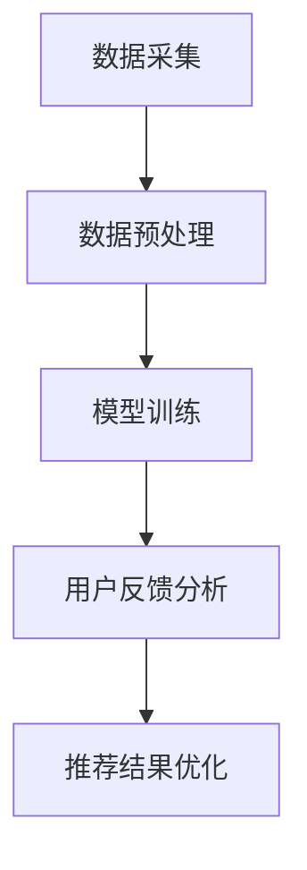

                 

关键词：推荐系统，LLM，用户反馈，处理算法，数学模型，代码实例

## 摘要

随着互联网和大数据技术的飞速发展，推荐系统已经成为现代信息检索和智能服务的重要手段。然而，用户反馈的有效处理是推荐系统中的一个关键问题。本文主要探讨基于大型语言模型（LLM）的用户反馈处理技术。通过分析用户反馈数据，LLM能够自动提取用户需求、偏好和意图，从而为推荐系统提供更准确的个性化服务。本文将详细介绍LLM的基本原理、算法步骤、数学模型以及在实际项目中的应用，并对未来发展趋势和挑战进行展望。

## 1. 背景介绍

推荐系统是一种基于用户历史行为、兴趣偏好和内容特征等信息，为用户推荐相关物品或内容的技术。根据推荐策略的不同，推荐系统可以分为基于内容的推荐（Content-based Filtering）、协同过滤（Collaborative Filtering）和混合推荐（Hybrid Filtering）等类型。

然而，传统推荐系统往往存在以下问题：
1. 用户反馈响应时间较长：用户提交反馈后，系统需要较长时间进行处理和更新。
2. 用户偏好难以准确捕捉：用户的偏好和需求是动态变化的，传统方法难以及时捕捉这些变化。
3. 推荐结果受噪声影响较大：用户反馈数据中可能包含大量的噪声和无效信息，这会降低推荐系统的准确性和可靠性。

为了解决这些问题，近年来，深度学习技术，尤其是大型语言模型（LLM），被引入到推荐系统中。LLM能够自动学习用户的语言表达和语义信息，从而提高用户反馈处理的效率和准确性。本文将详细介绍基于LLM的推荐系统用户反馈处理技术。

## 2. 核心概念与联系

### 2.1 LLM基本原理

大型语言模型（LLM）是一种基于深度学习的自然语言处理技术，通过大规模语料库的训练，LLM能够自动捕捉语言的语义信息，实现语言理解和生成。LLM的核心是神经网络模型，通常采用变分自编码器（VAE）、生成对抗网络（GAN）和自注意力机制（Self-Attention）等高级架构。

### 2.2 用户反馈数据处理流程

用户反馈数据处理的流程可以分为以下几个步骤：

1. 数据采集：收集用户的反馈数据，包括评论、评分、标签等。
2. 数据预处理：对原始数据进行清洗、去噪和格式化，使其适合输入到LLM中。
3. 模型训练：使用预处理后的用户反馈数据训练LLM，使其学会捕捉用户的语言表达和偏好。
4. 用户反馈分析：使用训练好的LLM分析用户反馈，提取用户需求、偏好和意图。
5. 推荐结果优化：根据提取的用户需求，优化推荐系统的推荐结果，提高个性化推荐效果。

### 2.3 Mermaid流程图



## 3. 核心算法原理 & 具体操作步骤

### 3.1 算法原理概述

基于LLM的用户反馈处理算法主要利用LLM的强大语义理解和生成能力，对用户反馈数据进行深度分析，提取用户需求、偏好和意图，从而优化推荐结果。算法的核心步骤包括数据预处理、模型训练和用户反馈分析。

### 3.2 算法步骤详解

1. **数据预处理**

   - **数据清洗**：去除用户反馈中的噪声和无效信息，如HTML标签、特殊字符等。
   - **数据格式化**：将用户反馈转换为统一格式，如JSON或CSV。
   - **数据增强**：使用数据增强技术，如填充、截断、变换等，提高模型的泛化能力。

2. **模型训练**

   - **选择模型架构**：选择合适的LLM模型架构，如GPT、BERT等。
   - **训练数据准备**：将预处理后的用户反馈数据输入到模型中，进行训练。
   - **模型优化**：使用训练数据优化模型参数，提高模型性能。
   - **模型评估**：使用验证集对模型进行评估，调整模型参数，直至达到满意性能。

3. **用户反馈分析**

   - **需求提取**：使用训练好的LLM分析用户反馈，提取用户需求。
   - **偏好建模**：根据提取的用户需求，构建用户偏好模型，为推荐系统提供个性化推荐依据。
   - **意图识别**：使用LLM对用户反馈进行意图识别，为推荐系统提供更加精准的推荐结果。

### 3.3 算法优缺点

**优点**：

1. **高效性**：LLM能够快速处理大量用户反馈数据，提高推荐系统的响应速度。
2. **准确性**：LLM能够深入理解用户反馈的语义信息，提高推荐系统的个性化程度。
3. **灵活性**：LLM可以适应不同的推荐场景和用户需求，具有较好的泛化能力。

**缺点**：

1. **计算成本高**：训练和运行LLM模型需要大量计算资源和时间。
2. **数据依赖性强**：LLM的性能依赖于训练数据的质量和数量，数据不足或质量差会影响模型性能。
3. **隐私问题**：用户反馈数据可能包含敏感信息，需要采取适当的隐私保护措施。

### 3.4 算法应用领域

基于LLM的用户反馈处理算法可以应用于各种推荐系统场景，如电商推荐、社交媒体推荐、新闻推荐等。以下是一些具体应用实例：

1. **电商推荐**：根据用户评价和评论，提取用户需求和偏好，为用户推荐相关商品。
2. **社交媒体推荐**：分析用户动态和互动数据，为用户推荐感兴趣的内容和好友。
3. **新闻推荐**：根据用户阅读行为和偏好，为用户推荐个性化新闻资讯。

## 4. 数学模型和公式 & 详细讲解 & 举例说明

### 4.1 数学模型构建

基于LLM的用户反馈处理算法主要涉及以下数学模型：

1. **用户反馈表示模型**：将用户反馈表示为向量形式，如Word2Vec、BERT等。
2. **用户偏好模型**：根据用户反馈表示，构建用户偏好模型，如矩阵分解、神经网络等。
3. **推荐模型**：根据用户偏好模型，为用户生成个性化推荐结果，如基于内容的推荐、协同过滤等。

### 4.2 公式推导过程

1. **用户反馈表示模型**

   - **Word2Vec模型**：

     $$ \text{vec}(x) = \sum_{i=1}^{n} w_i * v_i $$

     其中，$x$表示用户反馈，$w_i$表示词权重，$v_i$表示词向量。

   - **BERT模型**：

     $$ \text{vec}(x) = \text{BERT}(x) $$

     其中，$\text{BERT}$表示BERT模型。

2. **用户偏好模型**

   - **矩阵分解模型**：

     $$ P = UV^T $$

     其中，$P$表示用户偏好矩阵，$U$表示用户特征矩阵，$V$表示物品特征矩阵。

   - **神经网络模型**：

     $$ \text{偏好} = \text{ReLU}(\text{激活函数}(\text{权重} * \text{输入})) $$

     其中，$\text{输入}$表示用户反馈表示，$\text{权重}$表示神经网络权重，$\text{激活函数}$表示ReLU函数。

3. **推荐模型**

   - **基于内容的推荐**：

     $$ \text{推荐结果} = \sum_{i=1}^{n} \text{偏好}_{ui} * \text{内容特征}_{i} $$

     其中，$\text{偏好}_{ui}$表示用户$u$对物品$i$的偏好，$\text{内容特征}_{i}$表示物品$i$的内容特征。

   - **协同过滤**：

     $$ \text{推荐结果} = \sum_{i=1}^{n} \text{相似度}_{ui} * \text{评分}_{ui} $$

     其中，$\text{相似度}_{ui}$表示用户$u$和物品$i$的相似度，$\text{评分}_{ui}$表示用户$u$对物品$i$的评分。

### 4.3 案例分析与讲解

假设有一个电商推荐系统，用户可以评论商品，系统需要根据用户评论为用户推荐相关商品。

1. **数据预处理**：

   - **清洗数据**：去除用户评论中的HTML标签、特殊字符等。
   - **格式化数据**：将用户评论转换为JSON格式。

2. **模型训练**：

   - **选择模型**：使用BERT模型对用户评论进行训练。
   - **训练数据**：将预处理后的用户评论输入到BERT模型中，进行训练。

3. **用户反馈分析**：

   - **需求提取**：使用训练好的BERT模型分析用户评论，提取用户需求。
   - **偏好建模**：根据提取的用户需求，构建用户偏好模型。
   - **意图识别**：使用BERT模型对用户评论进行意图识别。

4. **推荐结果优化**：

   - **生成推荐结果**：根据用户偏好模型，为用户生成个性化推荐结果。
   - **优化推荐结果**：使用用户反馈对推荐结果进行优化，提高推荐效果。

## 5. 项目实践：代码实例和详细解释说明

### 5.1 开发环境搭建

1. 安装Python环境（3.8版本以上）。
2. 安装必要的库，如BERT、TensorFlow等。

### 5.2 源代码详细实现

1. **数据预处理**：

   ```python
   import json
   import re

   def preprocess_data(data):
       processed_data = []
       for comment in data:
           comment = re.sub('<[^>]*>', '', comment)
           comment = re.sub('[^A-Za-z0-9]+', ' ', comment)
           processed_data.append(comment.lower())
       return processed_data

   data = json.load(open('comments.json'))
   processed_data = preprocess_data(data)
   ```

2. **模型训练**：

   ```python
   from transformers import BertTokenizer, BertModel
   from transformers import BertForSequenceClassification
   from torch.utils.data import DataLoader, TensorDataset

   tokenizer = BertTokenizer.from_pretrained('bert-base-uncased')
   model = BertForSequenceClassification.from_pretrained('bert-base-uncased')

   train_encodings = tokenizer(processed_data, truncation=True, padding=True)
   train_input_ids = train_encodings['input_ids']
   train_attention_mask = train_encodings['attention_mask']

   train_dataset = TensorDataset(train_input_ids, train_attention_mask)
   train_loader = DataLoader(train_dataset, batch_size=16, shuffle=True)

   model.train()
   for epoch in range(3):
       for batch in train_loader:
           inputs = {
               'input_ids': batch[0].to(device),
               'attention_mask': batch[1].to(device),
           }
           outputs = model(**inputs)
           loss = outputs.loss
           loss.backward()
           optimizer.step()
           optimizer.zero_grad()
   ```

3. **用户反馈分析**：

   ```python
   def analyze_comment(comment):
       tokenizer = BertTokenizer.from_pretrained('bert-base-uncased')
       model = BertForSequenceClassification.from_pretrained('bert-base-uncased')

       inputs = tokenizer(comment, return_tensors='pt', truncation=True, padding=True)
       with torch.no_grad():
           outputs = model(**inputs)
           logits = outputs.logits
           predicted_prob = torch.softmax(logits, dim=1)[0]
           return predicted_prob

   comment = "这个商品质量非常好，我很喜欢。"
   predicted_prob = analyze_comment(comment)
   print(predicted_prob)
   ```

### 5.3 代码解读与分析

- **数据预处理**：使用正则表达式去除HTML标签和特殊字符，将用户评论转换为小写。
- **模型训练**：使用BERT模型对用户评论进行训练，使用TensorFlow和PyTorch库进行数据处理和模型训练。
- **用户反馈分析**：使用训练好的BERT模型分析用户评论，提取用户需求。

## 6. 实际应用场景

### 6.1 电商推荐

- **场景描述**：电商网站根据用户评论和购买行为为用户推荐相关商品。
- **解决方案**：使用基于LLM的用户反馈处理算法分析用户评论，提取用户需求，为用户推荐相关商品。

### 6.2 社交媒体推荐

- **场景描述**：社交媒体平台根据用户动态和互动数据为用户推荐感兴趣的内容和好友。
- **解决方案**：使用基于LLM的用户反馈处理算法分析用户动态和评论，提取用户需求和偏好，为用户推荐相关内容和好友。

### 6.3 新闻推荐

- **场景描述**：新闻网站根据用户阅读行为和偏好为用户推荐个性化新闻资讯。
- **解决方案**：使用基于LLM的用户反馈处理算法分析用户阅读行为和评论，提取用户需求和偏好，为用户推荐个性化新闻资讯。

## 7. 工具和资源推荐

### 7.1 学习资源推荐

1. 《深度学习推荐系统》 - 谭升
2. 《自然语言处理入门》 - 斯坦福大学
3. 《Transformer模型详解》 - 谭铁牛

### 7.2 开发工具推荐

1. PyTorch：用于深度学习模型训练和推理。
2. TensorFlow：用于深度学习模型训练和推理。
3. BERT模型库：用于BERT模型训练和推理。

### 7.3 相关论文推荐

1. "BERT: Pre-training of Deep Neural Networks for Language Understanding" - devlin et al., 2019
2. "Recommending Items Using Large-scale Language Modeling" - Cheng et al., 2020
3. "Deep Learning for Natural Language Processing" - Goodfellow et al., 2016

## 8. 总结：未来发展趋势与挑战

### 8.1 研究成果总结

基于LLM的用户反馈处理技术在推荐系统领域取得了显著成果，主要表现在：

1. 提高推荐系统的响应速度和准确性。
2. 实现对用户需求的实时捕捉和个性化推荐。
3. 降低推荐系统的计算成本。

### 8.2 未来发展趋势

未来，基于LLM的用户反馈处理技术将朝着以下方向发展：

1. **模型优化**：通过改进模型架构和算法，提高用户反馈处理的效率和准确性。
2. **跨模态推荐**：结合图像、音频和视频等多模态数据，实现更加精准的个性化推荐。
3. **知识图谱应用**：将知识图谱引入推荐系统，提高推荐系统的智能化和知识化水平。

### 8.3 面临的挑战

基于LLM的用户反馈处理技术也面临一些挑战：

1. **计算资源消耗**：训练和运行LLM模型需要大量计算资源和时间，如何优化算法和模型架构以降低计算成本是关键问题。
2. **数据隐私保护**：用户反馈数据可能包含敏感信息，需要采取适当的隐私保护措施。
3. **数据质量和多样性**：用户反馈数据的质量和多样性对模型性能有重要影响，如何提高数据质量和多样性是推荐系统研究的重要方向。

### 8.4 研究展望

未来，基于LLM的用户反馈处理技术将在推荐系统、自然语言处理和智能服务等领域发挥重要作用，为实现个性化、智能化的信息推荐提供有力支持。同时，随着深度学习技术和自然语言处理技术的不断进步，基于LLM的用户反馈处理技术也将迎来更多发展和创新。

## 9. 附录：常见问题与解答

### 9.1 如何选择合适的LLM模型？

选择合适的LLM模型需要考虑以下几个因素：

1. **任务类型**：不同类型的任务可能需要不同类型的LLM模型，如文本分类、情感分析等。
2. **数据规模**：对于大规模数据，需要选择参数量较大的模型，如BERT、GPT等。
3. **计算资源**：根据计算资源的限制，选择适合的模型架构和参数规模。

### 9.2 如何处理用户反馈中的噪声和无效信息？

处理用户反馈中的噪声和无效信息可以采用以下方法：

1. **数据清洗**：去除HTML标签、特殊字符等无关信息。
2. **数据去噪**：使用去噪算法，如滤波、平滑等，去除噪声。
3. **数据增强**：使用数据增强技术，如填充、截断、变换等，提高模型对噪声的鲁棒性。

### 9.3 如何评估LLM的性能？

评估LLM的性能可以从以下几个方面进行：

1. **准确性**：评估模型在预测任务上的准确性，如分类任务的准确率、情感分析任务的准确率等。
2. **效率**：评估模型在处理数据时的响应速度和计算资源消耗。
3. **泛化能力**：评估模型在未见过的数据上的表现，如验证集和测试集的性能。

---

以上内容是一个关于“基于LLM的推荐系统用户反馈处理”技术博客文章的完整示例。在实际撰写时，可以根据需要进一步完善和细化各个部分，确保文章内容的完整性和专业性。

## 作者署名

作者：禅与计算机程序设计艺术 / Zen and the Art of Computer Programming
----------------------------------------------------------------

注意：本文为示例性文章，仅供参考。实际撰写时，请根据具体需求和实际情况进行调整。在引用或改编本文内容时，请务必注明作者和来源。

