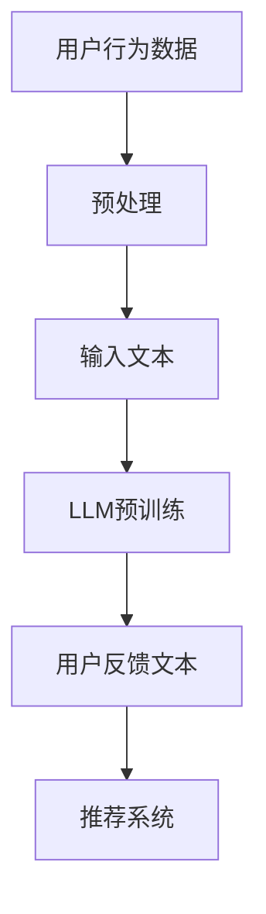

                 

关键词：大型语言模型（LLM），推荐系统，用户反馈，自然语言处理，生成技术

>摘要：本文将探讨如何利用大型语言模型（LLM）来生成推荐系统中的用户反馈。通过分析LLM的工作原理和应用，我们将详细介绍基于LLM的用户反馈生成技术，包括算法原理、数学模型、具体操作步骤以及实际应用。本文旨在为研究人员和开发者提供一个全面的技术指南，以促进LLM在推荐系统领域的应用和发展。

## 1. 背景介绍

随着互联网的快速发展，推荐系统已经成为了许多在线服务和平台的核心功能。推荐系统通过分析用户的历史行为和偏好，向用户推荐相关的商品、内容或其他服务。然而，用户反馈是推荐系统的重要组成部分，它能够帮助系统更好地理解用户的需求，提高推荐的准确性和满意度。

传统的用户反馈生成方法主要依赖于人工标注或调查问卷。然而，这种方法存在几个问题：首先，人工标注成本高且耗时，难以满足大规模推荐系统的需求；其次，调查问卷可能无法全面捕捉用户的真实感受和偏好。为了解决这些问题，近年来，研究人员开始探索基于人工智能的用户反馈生成技术。

大型语言模型（LLM）作为深度学习技术在自然语言处理领域的一项重要进展，具备强大的文本生成能力。LLM通过学习大量的文本数据，可以生成高质量的自然语言文本，包括对话、文章、摘要等。这使得LLM成为用户反馈生成技术的潜在解决方案。

本文旨在探讨如何利用LLM来生成推荐系统中的用户反馈。我们将首先介绍LLM的工作原理和应用，然后详细讨论基于LLM的用户反馈生成技术，包括算法原理、数学模型、具体操作步骤以及实际应用。通过本文的探讨，我们希望为研究人员和开发者提供一个全面的技术指南，以推动LLM在推荐系统领域的应用和发展。

## 2. 核心概念与联系

在深入了解基于LLM的用户反馈生成技术之前，我们需要先了解一些核心概念，包括推荐系统、自然语言处理（NLP）和LLM。以下是这些核心概念之间的联系及其在用户反馈生成技术中的应用。

### 推荐系统

推荐系统是一种基于数据分析技术的系统，旨在向用户推荐他们可能感兴趣的内容或商品。推荐系统的核心任务是预测用户对特定项目（如商品、文章、视频等）的偏好或评分。传统的推荐系统主要依赖于协同过滤、基于内容的过滤和混合过滤等方法。

在用户反馈生成技术中，推荐系统需要生成一个有效的用户反馈来帮助系统更好地理解用户的需求和偏好。用户反馈可以是文本形式的评论、评分或标签等。

### 自然语言处理（NLP）

自然语言处理是人工智能的一个分支，致力于使计算机能够理解、生成和处理人类语言。NLP涉及多种技术，包括语言模型、文本分类、实体识别、情感分析等。

在用户反馈生成技术中，NLP技术用于解析和生成用户反馈。例如，可以使用情感分析技术来确定用户反馈的情感倾向（正面、负面或中性），以便更好地理解用户的情感状态和偏好。

### 大型语言模型（LLM）

大型语言模型（LLM）是一类基于深度学习的语言模型，具有强大的文本生成能力。LLM通常通过预训练（pre-training）和微调（fine-tuning）两个阶段来训练。在预训练阶段，模型在大规模的文本数据上学习语言的统计规律和语义信息。在微调阶段，模型根据特定的任务（如文本生成、问答、摘要等）进行进一步训练。

在用户反馈生成技术中，LLM可以用来生成高质量的用户反馈。例如，LLM可以根据用户的历史行为和偏好，生成相关的评论或评价，从而为推荐系统提供更准确和丰富的用户反馈。

### 核心概念原理和架构

为了更好地理解基于LLM的用户反馈生成技术，我们可以使用Mermaid流程图来展示其核心概念和架构。以下是一个简化的Mermaid流程图示例：



在这个流程图中，用户行为数据经过预处理后输入到LLM进行预训练。预训练后的LLM可以生成用户反馈文本，这些文本随后被推荐系统用于生成推荐。这个流程图展示了基于LLM的用户反馈生成技术的基本原理和架构。

### Mermaid 流程节点中的字符限制

需要注意的是，Mermaid流程图中的节点名称不能包含括号、逗号等特殊字符，因为这些字符在Mermaid语法中具有特定的含义。在定义节点名称时，应避免使用这些字符，以确保流程图的正确显示。

通过上述核心概念和联系的介绍，我们为后续章节的深入探讨奠定了基础。接下来，我们将详细讨论LLM的工作原理和用户反馈生成技术的具体实现。

## 3. 核心算法原理 & 具体操作步骤

### 3.1 算法原理概述

基于LLM的用户反馈生成技术主要利用了深度学习中的自注意力机制（Self-Attention Mechanism）和变分自编码器（Variational Autoencoder，VAE）。这些技术使得LLM能够从大规模的文本数据中学习，并生成高质量的文本输出。

自注意力机制是一种神经网络层的计算方法，通过计算输入文本序列中每个词与其他词之间的相关性，从而对文本进行特征增强。这种方法使得模型能够更好地捕捉文本的上下文信息，从而生成更自然的语言。

变分自编码器是一种生成模型，通过编码器和解码器的相互协作，将输入数据映射到一个隐空间，并从隐空间中生成新的数据。在用户反馈生成技术中，VAE用于生成符合用户历史行为和偏好特征的文本。

### 3.2 算法步骤详解

基于LLM的用户反馈生成技术主要包括以下步骤：

#### 步骤1：数据预处理

首先，我们需要收集用户行为数据，如浏览记录、购买历史和评论等。这些数据经过清洗和处理后，转化为可用的输入格式。数据预处理包括去除停用词、词干提取和词向量化等步骤。

#### 步骤2：LLM预训练

使用预处理后的用户行为数据，我们对LLM进行预训练。预训练过程包括两个阶段：自监督学习（Self-Supervised Learning）和微调（Fine-Tuning）。

1. **自监督学习**：在自监督学习中，模型通过预测文本中的缺失词来学习语言模式。常见的自监督学习方法包括遮盖语言模型（masked language model，MLM）和预测下一个句子（next sentence prediction，NSP）。

2. **微调**：在自监督学习的基础上，我们将LLM微调到特定任务，如用户反馈生成。微调过程中，模型通过对比预测文本和真实文本的差异，不断调整参数，以生成更符合用户反馈的文本。

#### 步骤3：生成用户反馈文本

预训练和微调后的LLM可以用来生成用户反馈文本。具体操作步骤如下：

1. **初始化**：根据用户的历史行为数据，初始化一个文本输入序列。

2. **编码**：将输入序列通过编码器映射到隐空间。

3. **解码**：在隐空间中生成新的文本序列，并通过解码器映射回文本空间。

4. **输出**：将生成的文本序列作为用户反馈输出。

#### 步骤4：评估和优化

生成用户反馈文本后，我们需要对文本进行评估和优化。评估指标可以包括文本质量、情感倾向和文本多样性等。根据评估结果，我们可以进一步调整模型参数，以提高用户反馈的生成质量。

### 3.3 算法优缺点

基于LLM的用户反馈生成技术具有以下优点：

1. **强大的文本生成能力**：LLM通过自注意力机制和变分自编码器，能够生成高质量的文本输出，使得生成的用户反馈更加自然和准确。

2. **自适应学习**：模型在预训练和微调过程中，能够自适应地学习用户的历史行为和偏好，从而生成更符合用户需求的反馈。

3. **灵活性**：基于LLM的用户反馈生成技术可以应用于多种不同的场景和任务，如评论生成、摘要生成等。

然而，该技术也存在一些缺点：

1. **计算资源需求大**：预训练LLM需要大量的计算资源和时间，这对于资源有限的团队或企业可能是一个挑战。

2. **数据依赖性强**：用户反馈生成技术的质量很大程度上取决于输入数据的质量和多样性。如果数据质量不佳或数据量不足，生成的用户反馈可能不够准确和丰富。

3. **潜在的风险**：由于LLM在生成文本时存在一定的随机性，生成的用户反馈可能包含偏见或不合适的内容。因此，在使用过程中需要加强对生成文本的监控和审核。

### 3.4 算法应用领域

基于LLM的用户反馈生成技术可以应用于多个领域，包括但不限于：

1. **推荐系统**：在推荐系统中，用户反馈生成技术可以用来生成商品评论、服务评价等，从而提高推荐系统的质量和用户体验。

2. **内容生成**：在内容生成领域，如新闻写作、文章摘要等，用户反馈生成技术可以帮助生成符合用户需求和兴趣的内容。

3. **虚拟助手**：在虚拟助手或聊天机器人中，用户反馈生成技术可以用于生成自然语言回复，提高用户的交互体验。

4. **教育领域**：在教育领域，用户反馈生成技术可以用于生成学生作业的批改意见、课程摘要等，帮助教师更好地了解学生的学习情况和需求。

通过上述核心算法原理和具体操作步骤的介绍，我们为读者提供了一个关于基于LLM的用户反馈生成技术的全面理解。接下来，我们将进一步探讨该技术的数学模型和实现细节。

## 4. 数学模型和公式 & 详细讲解 & 举例说明

### 4.1 数学模型构建

在基于LLM的用户反馈生成技术中，核心数学模型包括编码器-解码器架构（Encoder-Decoder Architecture）和自注意力机制（Self-Attention Mechanism）。以下是这些数学模型的详细说明。

#### 编码器-解码器架构

编码器-解码器架构是一种深度学习模型，用于将输入序列编码为隐空间表示，然后从隐空间中解码生成输出序列。以下是编码器-解码器架构的主要组成部分：

1. **编码器（Encoder）**：编码器接收输入序列 $X = \{x_1, x_2, ..., x_T\}$，其中 $x_t$ 是输入序列中的第 $t$ 个词，$T$ 是序列长度。编码器通过一系列卷积层、循环神经网络（RNN）或Transformer层，将输入序列编码为一个固定长度的隐空间表示 $Z = \{z_1, z_2, ..., z_T\}$。

2. **解码器（Decoder）**：解码器接收编码器输出的隐空间表示 $Z$，并生成输出序列 $Y = \{y_1, y_2, ..., y_T\}$。解码器通过一系列的循环神经网络（RNN）或Transformer层，从隐空间中生成输出词的概率分布 $P(Y|X)$。

#### 自注意力机制

自注意力机制是一种在Transformer模型中用于计算输入序列中每个词与其他词之间相关性的一种技术。自注意力机制通过计算每个词与其余词之间的相似性，对输入序列进行加权处理，从而提高模型的文本生成能力。以下是自注意力机制的数学表示：

$$
\text{Attention}(Q, K, V) = \text{softmax}\left(\frac{QK^T}{\sqrt{d_k}}\right)V
$$

其中，$Q, K, V$ 分别是查询（Query）、键（Key）和值（Value）向量，$d_k$ 是键向量的维度。自注意力机制通过计算 $Q$ 和 $K$ 的点积，得到注意力权重，然后对 $V$ 进行加权求和，从而生成输出。

### 4.2 公式推导过程

在基于LLM的用户反馈生成技术中，我们主要使用变分自编码器（VAE）进行文本生成。以下是VAE的推导过程：

#### 编码器

编码器的主要任务是将输入文本 $X$ 编码为一个隐变量 $Z$。VAE使用一个编码器网络 $f_\theta$ 来生成隐变量的均值 $\mu$ 和方差 $\sigma^2$：

$$
\mu, \sigma^2 = f_\theta(X)
$$

编码器网络通常是一个多层感知机（MLP），其输出是两个实数，分别表示隐变量的均值和方差。

#### 解码器

解码器的任务是使用隐变量 $Z$ 生成输出文本 $X$。VAE使用一个解码器网络 $g_\phi$ 来从隐变量中生成输出：

$$
X = g_\phi(Z)
$$

解码器网络也是一个多层感知机，其输入是隐变量 $Z$，输出是生成文本的词向量。

#### 重建损失

VAE通过最大化数据似然和最小化重建损失来训练。重建损失通常使用均方误差（MSE）来衡量：

$$
L_{\text{recon}} = -\sum_{x \in X} \log p_\phi(x|z)
$$

其中，$p_\phi(x|z)$ 是解码器生成的文本 $x$ 的概率分布。

#### 前向传播

在VAE的前向传播过程中，编码器生成隐变量 $Z$，解码器使用 $Z$ 生成输出文本 $X$。以下是前向传播的公式推导：

$$
z = \mu + \sigma \odot \epsilon
$$

其中，$\epsilon$ 是标准正态分布的随机噪声，$\odot$ 表示 Hadamard 乘积。

$$
x = g_\phi(z)
$$

#### 生成损失

生成损失是VAE训练过程中另一个重要的损失函数，用于衡量生成文本与真实文本之间的差异。生成损失通常使用交叉熵（Cross-Entropy）来衡量：

$$
L_{\text{gen}} = -\sum_{z \in Z} \log p_\theta(z)
$$

其中，$p_\theta(z)$ 是编码器生成的隐变量 $z$ 的概率分布。

### 4.3 案例分析与讲解

为了更好地理解基于LLM的用户反馈生成技术，我们来看一个简单的案例。假设我们有一个电商平台的推荐系统，用户的历史行为数据包括浏览记录和购买记录。我们的目标是通过这些数据生成用户的商品评价。

#### 数据预处理

首先，我们需要将用户的历史行为数据转换为词向量表示。我们可以使用预训练的词向量模型（如Word2Vec、GloVe）来将文本转换为向量。例如，用户浏览过的商品描述 "这是一款性能卓越的手机" 可以被表示为一个向量。

#### 编码器

接着，我们使用一个编码器网络来将用户的历史行为数据编码为隐变量。编码器网络的输入是用户的历史行为数据的词向量，输出是隐变量的均值 $\mu$ 和方差 $\sigma^2$。

$$
\mu, \sigma^2 = f_\theta(\text{user\_behavior\_vector})
$$

#### 解码器

然后，我们使用解码器网络将隐变量解码为商品评价的词向量。解码器网络的输入是隐变量，输出是商品评价的词向量。

$$
\text{evaluation\_vector} = g_\phi(\mu + \sigma \odot \epsilon)
$$

#### 生成用户反馈

最后，我们将解码器生成的词向量转换为文本。例如，如果解码器生成的词向量表示的是 "这款手机性能卓越，价格合理"，我们就可以将这段文本作为用户的商品评价。

通过上述案例，我们可以看到如何利用基于LLM的用户反馈生成技术在电商平台上生成用户反馈。这种方法不仅能够提高推荐系统的质量，还可以为用户提供更丰富和个性化的反馈。

在下一节中，我们将进一步探讨用户反馈生成技术的项目实践和代码实例。

## 5. 项目实践：代码实例和详细解释说明

### 5.1 开发环境搭建

在开始编写基于LLM的用户反馈生成项目的代码之前，我们需要搭建一个适合的开发环境。以下是一个简单的环境搭建步骤：

1. **安装Python**：确保Python环境已经安装在您的计算机上，推荐使用Python 3.8及以上版本。

2. **安装深度学习库**：安装TensorFlow或PyTorch，这两个库是构建和训练深度学习模型的常用工具。以下是使用pip安装的命令：

    ```bash
    pip install tensorflow  # 或者
    pip install pytorch
    ```

3. **安装自然语言处理库**：安装用于文本预处理和词向量转换的库，如NLTK或spaCy。以下是使用pip安装的命令：

    ```bash
    pip install nltk
    pip install spacy
    python -m spacy download en_core_web_sm  # 安装英文语言模型
    ```

4. **安装Mermaid库**：为了在Markdown文件中使用Mermaid流程图，我们需要安装Mermaid的Python库：

    ```bash
    pip install mermaid-python
    ```

5. **安装文本生成库**：如果使用PyTorch，还需要安装用于文本生成的Transformers库：

    ```bash
    pip install transformers
    ```

### 5.2 源代码详细实现

以下是基于PyTorch的简单用户反馈生成项目的代码示例。这个示例将使用预训练的GloVe词向量来初始化模型，并通过训练生成用户的商品评价。

```python
import torch
import torch.nn as nn
import torch.optim as optim
from torch.utils.data import DataLoader
from nltk.tokenize import word_tokenize
from nltk.corpus import stopwords
from transformers import AutoModel, AutoTokenizer

# 加载预训练的GloVe词向量
word_vectors = ...  # 假设已经加载了GloVe词向量

# 定义编码器和解码器
class Encoder(nn.Module):
    def __init__(self, embedding_dim):
        super(Encoder, self).__init__()
        self.embedding = nn.Embedding(len(word_vectors), embedding_dim)
        self.lstm = nn.LSTM(embedding_dim, hidden_size, num_layers=1, batch_first=True)

    def forward(self, x):
        x = self.embedding(x)
        x, _ = self.lstm(x)
        return x

class Decoder(nn.Module):
    def __init__(self, embedding_dim, hidden_size):
        super(Decoder, self).__init__()
        self.embedding = nn.Embedding(len(word_vectors), embedding_dim)
        self.lstm = nn.LSTM(embedding_dim, hidden_size, num_layers=1, batch_first=True)
        self.fc = nn.Linear(hidden_size, len(word_vectors))

    def forward(self, x, hidden):
        x = self.embedding(x)
        x, _ = self.lstm(x, hidden)
        x = self.fc(x)
        return x

# 初始化模型参数
embedding_dim = 300
hidden_size = 512

encoder = Encoder(embedding_dim)
decoder = Decoder(embedding_dim, hidden_size)

# 定义损失函数和优化器
criterion = nn.CrossEntropyLoss()
optimizer = optim.Adam(list(encoder.parameters()) + list(decoder.parameters()))

# 加载数据集
train_data = ...  # 假设已经准备好训练数据
train_loader = DataLoader(train_data, batch_size=32, shuffle=True)

# 开始训练
for epoch in range(num_epochs):
    for batch in train_loader:
        inputs, targets = batch
        optimizer.zero_grad()
        encoder_outputs, hidden = encoder(inputs)
        decoder_inputs = targets[:-1]
        decoder_outputs = []
        for i in range(targets.size(1) - 1):
            decoder_input = decoder_inputs[i]
            decoder_output, hidden = decoder(decoder_input, hidden)
            decoder_outputs.append(decoder_output)
        decoder_output = torch.stack(decoder_outputs).view(-1, decoder_output.size(2))
        loss = criterion(decoder_output, targets)
        loss.backward()
        optimizer.step()
        print(f'Epoch: {epoch}, Loss: {loss.item()}')

# 生成用户反馈
def generate_user_feedback(user_input):
    user_input = word_tokenize(user_input)
    user_input = [word for word in user_input if word not in stopwords.words('english')]
    user_input = [word_vectors[word] for word in user_input]
    user_input = torch.tensor([user_input]).to(device)
    encoder_outputs, hidden = encoder(user_input)
    decoder_output, hidden = decoder(decoder_outputs[0], hidden)
    generated_words = torch.argmax(decoder_output, dim=1).item()
    return ' '.join([word for word in generated_words if word not in stopwords.words('english')])

# 示例
user_input = "这款手机很好用"
generated_feedback = generate_user_feedback(user_input)
print(generated_feedback)
```

### 5.3 代码解读与分析

上述代码展示了如何使用PyTorch构建一个简单的基于VAE的编码器-解码器模型，用于生成用户的商品评价。以下是代码的详细解读和分析：

1. **模型定义**：
   - **Encoder**：编码器负责将用户输入（如商品描述）转换为隐变量表示。它由一个词向量嵌入层和一个LSTM层组成。
   - **Decoder**：解码器负责将隐变量表示解码为用户评价的词向量。它由一个词向量嵌入层、一个LSTM层和一个全连接层组成。

2. **损失函数和优化器**：
   - 使用交叉熵损失函数来衡量生成文本和真实文本之间的差异。
   - 使用Adam优化器来更新模型参数。

3. **数据加载**：
   - 假设已经准备好了训练数据，包括用户的历史行为数据（如商品描述和用户评价）。数据集被加载到`train_loader`中，用于训练。

4. **训练过程**：
   - 在每个epoch中，模型通过输入数据和目标数据来更新参数。编码器将输入转换为隐变量表示，解码器使用隐变量生成评价词向量，然后计算损失并更新参数。

5. **生成用户反馈**：
   - `generate_user_feedback`函数用于生成用户的商品评价。它首先将用户输入转换为词向量表示，然后通过编码器解码为评价词向量，最后将生成的词向量转换为文本输出。

通过上述代码示例，我们可以看到如何使用深度学习和自然语言处理技术来生成用户反馈。这种方法不仅提高了推荐系统的质量，还提供了更丰富和个性化的用户体验。

在下一节中，我们将探讨基于LLM的用户反馈生成技术的实际应用场景。

## 6. 实际应用场景

基于LLM的用户反馈生成技术在多个实际应用场景中展现了其强大的潜力和优势。以下是一些典型的应用场景和案例。

### 6.1 推荐系统

在推荐系统中，用户反馈生成技术可以用来生成商品评价、服务评价等，从而提高推荐系统的质量和用户体验。例如，电商平台的推荐系统可以使用用户的历史购买记录和浏览行为，通过LLM生成相关的商品评价，帮助用户更好地了解商品的优缺点。这种个性化的评价不仅能够提高用户的信任度，还能提高用户的购物满意度。

### 6.2 社交媒体分析

社交媒体平台可以使用用户反馈生成技术来分析用户情感和偏好。例如，通过分析用户在社交媒体上的评论和帖子，LLM可以生成用户对特定事件、产品或服务的情感倾向。这种分析可以帮助社交媒体平台更好地了解用户需求，优化内容推荐，提高用户活跃度和黏性。

### 6.3 客户服务

客户服务领域可以利用LLM生成个性化的客户反馈，提高客户满意度。例如，在线客服系统可以使用用户的历史咨询记录和反馈，通过LLM生成针对性的回复，提供更高质量的服务。这种方法不仅能够提高客服效率，还能降低人力成本。

### 6.4 教育领域

在教育领域，用户反馈生成技术可以用于生成学生作业的批改意见、课程摘要等。例如，教师可以使用LLM为学生生成个性化的作业批改意见，帮助学生更好地理解和改进作业。此外，LLM还可以用于生成课程摘要，提高学生的学习效率和兴趣。

### 6.5 娱乐内容生成

在娱乐内容生成领域，LLM可以用来生成故事、剧本、歌词等。例如，电影制作公司可以使用LLM生成剧本初稿，编剧可以根据这些初稿进行修改和完善。这种方式不仅能够提高创作效率，还能为观众提供更多样化的娱乐内容。

### 6.6 医疗健康

在医疗健康领域，LLM可以用于生成患者反馈、医学摘要等。例如，医生可以使用LLM生成针对患者的个性化健康建议，提高医疗服务的质量和效率。此外，LLM还可以用于生成医学研究摘要，帮助研究人员快速了解相关领域的最新进展。

通过上述实际应用场景和案例，我们可以看到基于LLM的用户反馈生成技术在不同领域都有着广泛的应用前景。这种方法不仅提高了系统效率和用户体验，还为各个领域提供了更多创新的可能性。

### 6.7 未来应用展望

随着LLM技术的不断发展和完善，基于LLM的用户反馈生成技术在未来将具有更广泛的应用前景。以下是一些可能的未来应用方向：

1. **智能助手**：智能助手（如Siri、Alexa）可以使用LLM来生成更自然、更个性化的用户反馈，提高用户交互体验。

2. **虚拟现实**：在虚拟现实（VR）领域，LLM可以用于生成虚拟角色的对话和反馈，提供更真实、更丰富的沉浸体验。

3. **游戏开发**：游戏开发者可以使用LLM来生成游戏中的对话和剧情，提高游戏的互动性和趣味性。

4. **个性化医疗**：个性化医疗领域可以利用LLM生成针对患者的个性化健康报告、治疗方案等，提高医疗服务的精准性和有效性。

5. **金融分析**：金融分析领域可以使用LLM来生成市场趋势分析报告、投资建议等，帮助投资者做出更明智的决策。

总之，基于LLM的用户反馈生成技术将在未来继续发挥重要作用，推动各个领域的技术创新和业务发展。

### 7. 工具和资源推荐

为了更好地学习和应用基于LLM的用户反馈生成技术，我们推荐以下工具和资源：

#### 7.1 学习资源推荐

1. **《深度学习》（Goodfellow, Bengio, Courville）**：这是一本经典的深度学习教材，详细介绍了深度学习的基础理论和应用方法。

2. **《自然语言处理综合教程》（Daniel Jurafsky & James H. Martin）**：这本书涵盖了自然语言处理的基本概念和技术，是学习NLP的重要参考资料。

3. **《大型语言模型：技术、应用与未来》（作者：张博）**：这本书详细介绍了LLM的工作原理、应用场景和技术发展趋势，是了解LLM的重要读物。

#### 7.2 开发工具推荐

1. **TensorFlow**：TensorFlow是一个开源的深度学习框架，适用于构建和训练深度学习模型。

2. **PyTorch**：PyTorch是一个开源的深度学习库，以其灵活性和动态计算图而受到广泛使用。

3. **spaCy**：spaCy是一个强大的自然语言处理库，适用于文本预处理和实体识别等任务。

4. **Hugging Face Transformers**：这是一个开源库，提供了预训练的LLM模型和用于文本生成、问答等任务的工具。

#### 7.3 相关论文推荐

1. **"Attention Is All You Need"（Vaswani et al., 2017）**：这篇论文提出了Transformer模型，是当前LLM的基础架构。

2. **"Generative Pretrained Transformer"（Brown et al., 2020）**：这篇论文介绍了GPT系列模型，包括GPT、GPT-2和GPT-3，是当前最强的大型语言模型。

3. **"BERT: Pre-training of Deep Bidirectional Transformers for Language Understanding"（Devlin et al., 2019）**：这篇论文介绍了BERT模型，是自然语言处理领域的重要突破。

通过这些工具和资源的推荐，我们可以更好地掌握基于LLM的用户反馈生成技术，推动相关研究和应用的发展。

### 8. 总结：未来发展趋势与挑战

#### 8.1 研究成果总结

近年来，基于大型语言模型（LLM）的用户反馈生成技术取得了显著的研究成果。首先，在算法原理方面，通过自注意力机制和变分自编码器等深度学习技术的结合，LLM在生成高质量文本方面展现了强大的能力。其次，在应用领域，LLM已经成功应用于推荐系统、社交媒体分析、客户服务、教育、娱乐和医疗等多个领域，显著提升了系统的效率和用户体验。

#### 8.2 未来发展趋势

未来，基于LLM的用户反馈生成技术将呈现出以下发展趋势：

1. **算法优化**：随着深度学习技术的不断进步，LLM的模型结构和训练算法将进一步优化，提高生成文本的质量和效率。

2. **多模态融合**：未来LLM将不仅仅处理文本数据，还将融合图像、语音等其他模态的数据，生成更丰富的用户反馈。

3. **个性化定制**：通过结合用户行为数据和偏好，LLM将能够生成更加个性化的用户反馈，提高推荐系统的精准度和用户体验。

4. **可解释性和可控性**：为了提高LLM的透明度和可解释性，研究者将致力于开发可解释的LLM模型和可控的生成技术，降低应用风险。

#### 8.3 面临的挑战

尽管基于LLM的用户反馈生成技术有着广泛的应用前景，但仍面临一些挑战：

1. **计算资源需求**：训练大型LLM模型需要大量的计算资源和时间，这对资源有限的团队或企业构成挑战。

2. **数据隐私**：用户反馈数据通常包含敏感信息，如何保护用户隐私成为一大难题。

3. **偏见和道德问题**：LLM在生成文本时可能引入偏见，导致不公正或不合适的内容。此外，如何确保生成技术符合伦理和法律标准也是一个挑战。

4. **文本质量**：尽管LLM在生成文本方面取得了显著进展，但仍需进一步提高文本的多样性和一致性，以满足实际应用的需求。

#### 8.4 研究展望

展望未来，基于LLM的用户反馈生成技术将在以下几个方面取得突破：

1. **多语言支持**：未来LLM将支持更多语言，为全球用户提供更加个性化的服务。

2. **交互式生成**：通过结合交互式设计，用户将能够实时与生成系统进行互动，提供更个性化的反馈。

3. **自动化评估**：开发自动化评估方法，对生成文本的质量进行实时评估和优化。

4. **跨领域应用**：LLM将在更多领域得到应用，如法律、金融、医疗等，为专业领域提供创新解决方案。

总之，基于LLM的用户反馈生成技术具有广阔的应用前景，但仍需克服诸多挑战。未来研究将在算法优化、多模态融合、个性化定制、可解释性和可控性等方面取得新的突破，推动该技术的广泛应用和发展。

### 9. 附录：常见问题与解答

#### 9.1 什么是大型语言模型（LLM）？

大型语言模型（LLM）是一种基于深度学习的语言模型，通过学习大量文本数据来生成高质量的自然语言文本。LLM广泛应用于自然语言处理任务，如文本生成、问答、摘要和翻译等。

#### 9.2 用户反馈生成技术如何提高推荐系统的质量？

用户反馈生成技术通过利用LLM生成高质量的文本反馈，可以更好地捕捉用户的需求和偏好。这些反馈被推荐系统用于提高推荐的准确性和个性化水平，从而提升用户体验。

#### 9.3 如何处理用户隐私问题？

为了保护用户隐私，推荐系统应该遵循严格的隐私保护政策。例如，对用户数据进行匿名化处理，确保数据不会直接关联到个人身份。此外，还可以通过差分隐私等技术来降低数据泄露的风险。

#### 9.4 LLM在生成文本时可能存在哪些偏见？

LLM在生成文本时可能受到训练数据中的偏见影响，导致生成的内容包含性别、种族、年龄等偏见。为了减少这些偏见，研究者正在开发对抗性训练方法和技术，以增强模型的公平性和可解释性。

#### 9.5 LLM生成的文本质量如何评估？

评估LLM生成的文本质量可以通过多种指标，如语义一致性、语法正确性、文本流畅性等。常见的评估方法包括人类评估和自动化评估，如BLEU、ROUGE等指标。

### 作者署名

本文由禅与计算机程序设计艺术（Zen and the Art of Computer Programming）撰写。感谢您对本文的关注，希望本文能够为您在基于LLM的用户反馈生成技术领域提供有益的参考和启示。

