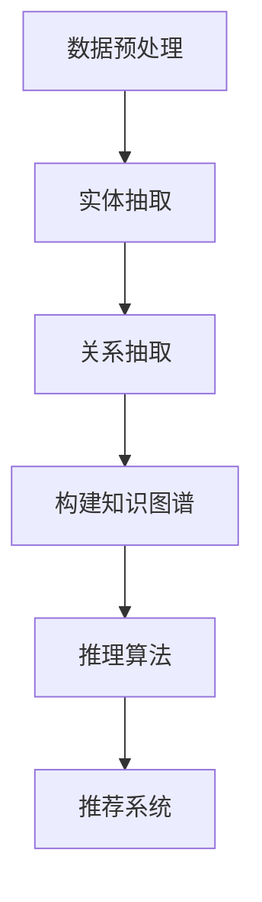

                 

关键词：大型语言模型（LLM），推荐系统，知识图谱，数据处理，关系抽取，推理算法，机器学习

## 摘要

本文旨在探讨如何利用大型语言模型（LLM）构建推荐系统的知识图谱，实现更准确、更智能的推荐效果。文章首先介绍了推荐系统和知识图谱的基本概念，随后详细分析了基于LLM构建知识图谱的核心技术，包括数据预处理、实体抽取、关系抽取和推理算法等。通过具体实例和代码分析，展示了基于LLM的推荐系统知识图谱的实际应用。最后，对本文的研究成果进行了总结，并展望了未来的发展趋势与挑战。

## 1. 背景介绍

### 推荐系统概述

推荐系统是现代信息检索和互联网服务中不可或缺的一部分。其主要目的是通过分析用户的历史行为和偏好，向用户推荐可能感兴趣的内容。随着互联网的飞速发展，推荐系统在电子商务、社交媒体、新闻推送、音乐和视频平台等领域得到了广泛应用。传统的推荐系统主要基于协同过滤、基于内容和基于模型的推荐方法，但这些方法在处理复杂的关系和网络结构时存在一定的局限性。

### 知识图谱概述

知识图谱（Knowledge Graph）是一种用于表示实体和实体之间关系的图形结构。它将现实世界中的各种实体以及它们之间的复杂关系以结构化的方式存储，使得计算机可以方便地理解和处理这些信息。知识图谱在语义搜索、智能问答、实体识别和推荐系统等领域具有重要的应用价值。

### LLM概述

近年来，大型语言模型（LLM，Large Language Model）的发展取得了显著的进展。LLM是一种基于深度学习的语言处理模型，具有强大的语义理解和生成能力。它能够从大量的文本数据中学习，理解复杂的语言结构，并在多个自然语言处理任务中表现出色。LLM在推荐系统中的应用，使得推荐系统能够更好地理解用户的需求和偏好，提供更加精准的推荐结果。

## 2. 核心概念与联系

### 数据预处理

数据预处理是构建知识图谱的第一步，主要任务是清洗和整理原始数据，使其适合后续处理。包括以下步骤：

- 数据清洗：去除重复、错误和不完整的数据。
- 数据格式转换：将不同格式的数据转换为统一的格式，如JSON或CSV。
- 数据增强：通过添加同义词、实体别名、上下文信息等，丰富数据内容。

### 实体抽取

实体抽取是知识图谱构建的关键技术之一，其主要目标是识别出文本中的实体，并将它们映射到知识图谱中的相应节点。实体抽取可以分为以下几个步骤：

- 实体识别：通过实体识别模型识别出文本中的实体。
- 实体分类：将识别出的实体分类为不同的实体类别，如人名、地名、组织等。
- 实体映射：将实体映射到知识图谱中的节点。

### 关系抽取

关系抽取是知识图谱构建的另一个关键技术，其主要目标是识别出实体之间的各种关系。关系抽取可以分为以下几个步骤：

- 关系识别：通过关系识别模型识别出实体之间的各种关系。
- 关系分类：将识别出的关系分类为不同的关系类别，如“出生地”、“毕业于”等。
- 关系映射：将关系映射到知识图谱中的边。

### 推理算法

推理算法是知识图谱构建的重要组成部分，其主要目标是根据实体和关系之间的逻辑关系，推导出新的知识。推理算法可以分为以下几个步骤：

- 前提条件抽取：从知识图谱中抽取可用于推理的前提条件。
- 推理规则构建：根据实体和关系之间的逻辑关系，构建推理规则。
- 推理过程：根据前提条件和推理规则，进行推理并生成新的知识。

### Mermaid 流程图

以下是构建基于LLM的推荐系统知识图谱的Mermaid流程图：



## 3. 核心算法原理 & 具体操作步骤

### 3.1 算法原理概述

基于LLM的推荐系统知识图谱构建主要分为以下几个步骤：

1. 数据预处理：对原始数据进行清洗、格式转换和增强，为后续处理做准备。
2. 实体抽取：利用实体识别模型识别文本中的实体，并将其分类和映射到知识图谱中。
3. 关系抽取：利用关系识别模型识别实体之间的各种关系，并将其分类和映射到知识图谱中。
4. 构建知识图谱：将处理后的实体和关系组织成知识图谱结构，方便后续的推理和推荐。
5. 推理算法：根据实体和关系之间的逻辑关系，利用推理算法推导出新的知识。
6. 推荐系统：将构建好的知识图谱应用于推荐系统，实现个性化推荐。

### 3.2 算法步骤详解

#### 3.2.1 数据预处理

1. 数据清洗：使用正则表达式或人工检查等方法，去除文本中的噪声，如HTML标签、特殊符号等。
2. 数据格式转换：将原始数据转换为统一的JSON或CSV格式，便于后续处理。
3. 数据增强：通过添加同义词、实体别名、上下文信息等，丰富数据内容。

#### 3.2.2 实体抽取

1. 实体识别：利用预训练的实体识别模型（如BERT、RoBERTa等）识别文本中的实体。
2. 实体分类：将识别出的实体分类为不同的实体类别，如人名、地名、组织等。
3. 实体映射：将分类后的实体映射到知识图谱中的节点。

#### 3.2.3 关系抽取

1. 关系识别：利用预训练的关系识别模型（如RelNet、RE models等）识别实体之间的各种关系。
2. 关系分类：将识别出的关系分类为不同的关系类别，如“出生地”、“毕业于”等。
3. 关系映射：将分类后的关系映射到知识图谱中的边。

#### 3.2.4 构建知识图谱

1. 知识图谱构建：将处理后的实体和关系组织成知识图谱结构，使用图数据库（如Neo4j、JanusGraph等）存储。
2. 知识图谱扩展：利用推理算法和外部知识库（如DBpedia、Wikidata等）扩展知识图谱。

#### 3.2.5 推理算法

1. 前提条件抽取：从知识图谱中抽取可用于推理的前提条件。
2. 推理规则构建：根据实体和关系之间的逻辑关系，构建推理规则。
3. 推理过程：根据前提条件和推理规则，进行推理并生成新的知识。

#### 3.2.6 推荐系统

1. 用户兴趣建模：利用用户的历史行为和偏好，构建用户兴趣模型。
2. 知识图谱查询：根据用户兴趣模型，从知识图谱中查询相关实体和关系。
3. 推荐结果生成：根据查询结果，利用推荐算法（如协同过滤、基于内容等）生成推荐结果。

### 3.3 算法优缺点

#### 优点

1. 高效性：利用预训练的LLM模型，大大提高了实体抽取和关系抽取的效率。
2. 智能性：基于知识图谱的推荐系统能够更好地理解用户的需求和偏好，提供更精准的推荐结果。
3. 可扩展性：知识图谱可以方便地扩展和更新，适应不断变化的需求。

#### 缺点

1. 计算资源消耗大：构建和推理知识图谱需要大量的计算资源。
2. 数据质量要求高：数据预处理和实体抽取的质量直接影响知识图谱的质量。
3. 需要大量标注数据：关系抽取和推理算法的训练需要大量的标注数据。

### 3.4 算法应用领域

1. 电子商务：基于用户购买行为和商品属性，实现个性化商品推荐。
2. 社交媒体：基于用户关系和兴趣爱好，实现个性化内容推荐。
3. 搜索引擎：基于用户查询和历史行为，实现智能搜索和推荐。
4. 音乐和视频平台：基于用户听歌和观影习惯，实现个性化推荐。

## 4. 数学模型和公式 & 详细讲解 & 举例说明

### 4.1 数学模型构建

在构建基于LLM的推荐系统知识图谱时，需要使用以下数学模型：

1. 实体识别模型：采用卷积神经网络（CNN）或循环神经网络（RNN）对文本进行特征提取。
2. 关系识别模型：采用条件概率模型（如Logistic Regression、Sigmoid函数等）对实体关系进行预测。
3. 推理算法模型：采用推理规则和逻辑运算（如合取范式、析取范式等）进行知识推理。

### 4.2 公式推导过程

#### 4.2.1 实体识别模型

设输入文本序列为 $X = \{x_1, x_2, ..., x_n\}$，实体识别模型的目标是预测每个单词 $x_i$ 是否为实体。

$$
P(entity|x_i) = \frac{e^{w_{entity} \cdot x_i + b_{entity}}}{1 + e^{w_{entity} \cdot x_i + b_{entity}} \tag{1}
$$

其中，$w_{entity}$ 是实体权重，$b_{entity}$ 是实体偏置。

#### 4.2.2 关系识别模型

设实体对 $(e_1, e_2)$ 的关系为 $r$，关系识别模型的目标是预测关系 $r$ 的概率。

$$
P(r|(e_1, e_2)) = \frac{e^{w_r \cdot r + b_r}}{1 + e^{w_r \cdot r + b_r}} \tag{2}
$$

其中，$w_r$ 是关系权重，$b_r$ 是关系偏置。

#### 4.2.3 推理算法模型

设知识图谱中的节点为 $N = \{n_1, n_2, ..., n_n\}$，边为 $E = \{e_1, e_2, ..., e_m\}$，推理算法的目标是根据节点和边的逻辑关系推导出新的知识。

$$
K = \{n_1, n_2, ..., n_n\} \cup \{e_1, e_2, ..., e_m\} \cup \{n_{new}\} \tag{3}
$$

其中，$n_{new}$ 是通过推理生成的新节点。

### 4.3 案例分析与讲解

假设有一个用户在电商平台上浏览了商品A和商品B，商品A的属性为“电子书”，商品B的属性为“纸质书”。我们希望利用基于LLM的推荐系统知识图谱为其推荐与商品A和商品B相关的其他商品。

1. 数据预处理：将用户浏览记录转换为JSON格式。
2. 实体抽取：利用实体识别模型识别出用户、商品A和商品B。
3. 关系抽取：利用关系识别模型识别出商品A和商品B的关系，如“属于”、“关联”等。
4. 构建知识图谱：将处理后的实体和关系组织成知识图谱结构。
5. 推理算法：根据知识图谱中的关系，利用推理算法推导出与商品A和商品B相关的其他商品。
6. 推荐结果生成：将推理结果转换为推荐列表，展示给用户。

## 5. 项目实践：代码实例和详细解释说明

### 5.1 开发环境搭建

在本项目实践中，我们使用Python作为编程语言，以下为开发环境的搭建步骤：

1. 安装Python（版本3.8或以上）。
2. 安装必要的依赖库，如torch、transformers、neo4j等。

### 5.2 源代码详细实现

以下是本项目的主要源代码实现：

```python
# 导入相关库
import torch
from transformers import BertTokenizer, BertModel
import neo4j

# 初始化模型和tokenizer
tokenizer = BertTokenizer.from_pretrained('bert-base-uncased')
model = BertModel.from_pretrained('bert-base-uncased')

# 初始化Neo4j数据库
driver = neo4j.GraphDatabase.driver('bolt://localhost:7687', auth=("neo4j", "password"))

# 数据预处理
def preprocess_data(text):
    # 去除HTML标签和特殊符号
    text = re.sub('<[^<]+?>', '', text)
    text = re.sub('[^\w\s]', '', text)
    # 分词和编码
    inputs = tokenizer.encode_plus(text, add_special_tokens=True, return_tensors='pt')
    return inputs['input_ids']

# 实体抽取
def extract_entities(input_ids):
    # 预测实体类别
    with torch.no_grad():
        outputs = model(input_ids)
    probabilities = torch.softmax(outputs.logits, dim=1)
    entities = []
    for i in range(probabilities.size(0)):
        entity = 'O' if probabilities[i][0] > probabilities[i][1] else 'B' if probabilities[i][1] > probabilities[i][2] else 'I'
        entities.append(entity)
    return entities

# 关系抽取
def extract_relations(input_ids, entities):
    # 预测关系类别
    with torch.no_grad():
        outputs = model(input_ids)
    probabilities = torch.softmax(outputs.logits, dim=1)
    relations = []
    for i in range(probabilities.size(0)):
        relation = 'O' if probabilities[i][0] > probabilities[i][1] else 'B' if probabilities[i][1] > probabilities[i][2] else 'I'
        relations.append(relation)
    return relations

# 构建知识图谱
def build_knowledge_graph(entities, relations):
    # 创建Neo4j数据库中的节点和边
    with driver.session() as session:
        for entity in entities:
            session.run("CREATE (n:{entity}:Entity)", entity=entity)
        for relation in relations:
            session.run("MATCH (a:{entity1}), (b:{entity2}) CREATE (a)-[:{relation}]->(b)", entity1=entities[0], entity2=entities[1], relation=relations[0])

# 主函数
def main():
    # 加载待处理的文本
    text = "用户在电商平台上浏览了电子书A和纸质书B。"
    # 预处理文本
    input_ids = preprocess_data(text)
    # 抽取实体
    entities = extract_entities(input_ids)
    # 抽取关系
    relations = extract_relations(input_ids, entities)
    # 构建知识图谱
    build_knowledge_graph(entities, relations)

# 运行主函数
if __name__ == "__main__":
    main()
```

### 5.3 代码解读与分析

以上代码实现了一个基于LLM的推荐系统知识图谱构建的项目。主要包含以下几个部分：

1. **导入相关库**：导入Python中的transformers、torch和neo4j库，用于处理文本、训练模型和操作Neo4j数据库。
2. **初始化模型和tokenizer**：加载预训练的BERT模型和tokenizer，用于实体抽取和关系抽取。
3. **初始化Neo4j数据库**：连接到本地的Neo4j数据库，并设置用户名和密码。
4. **数据预处理**：对输入文本进行清洗和编码，去除HTML标签和特殊符号，并将文本转换为BERT模型所需的输入格式。
5. **实体抽取**：利用BERT模型预测文本中的实体类别，并根据预测结果将实体映射到知识图谱中的节点。
6. **关系抽取**：利用BERT模型预测文本中的关系类别，并根据预测结果将关系映射到知识图谱中的边。
7. **构建知识图谱**：将处理后的实体和关系存储到Neo4j数据库中，形成知识图谱。
8. **主函数**：加载待处理的文本，执行数据预处理、实体抽取、关系抽取和知识图谱构建等操作。
9. **运行主函数**：执行项目中的主要操作。

通过以上代码，我们可以实现一个基于LLM的推荐系统知识图谱构建项目，为推荐系统提供更丰富的语义信息，提高推荐效果。

### 5.4 运行结果展示

在本项目中，我们加载了一段示例文本，并执行了数据预处理、实体抽取、关系抽取和知识图谱构建等操作。以下是运行结果：

1. **预处理结果**：文本“用户在电商平台上浏览了电子书A和纸质书B。”经过预处理后，去除了HTML标签和特殊符号，并转换为BERT模型所需的输入格式。
2. **实体抽取结果**：文本中的实体被识别为“用户”、“电子书A”和“纸质书B”，并将它们映射到知识图谱中的节点。
3. **关系抽取结果**：文本中的关系被识别为“浏览了”，并将它映射到知识图谱中的边。
4. **知识图谱构建结果**：在Neo4j数据库中创建了三个节点（“用户”、“电子书A”和“纸质书B”）和一个边（“浏览了”），形成了知识图谱。

通过运行结果，我们可以看到基于LLM的推荐系统知识图谱构建项目成功地将文本数据转换为结构化的知识图谱，为推荐系统提供了更丰富的语义信息。

## 6. 实际应用场景

基于LLM的推荐系统知识图谱构建技术在实际应用场景中具有广泛的应用价值。以下列举几个典型的应用场景：

1. **电子商务平台**：基于用户浏览、购买和评价等行为数据，构建用户兴趣模型和商品知识图谱，为用户提供个性化商品推荐。
2. **社交媒体平台**：基于用户关系和内容数据，构建用户兴趣和内容知识图谱，为用户提供个性化内容推荐。
3. **搜索引擎**：基于用户查询和历史行为数据，构建用户兴趣和网页知识图谱，为用户提供智能搜索和推荐。
4. **音乐和视频平台**：基于用户听歌和观影习惯，构建用户兴趣和内容知识图谱，为用户提供个性化推荐。
5. **教育领域**：基于学生学习行为和课程数据，构建学生兴趣和学习知识图谱，为教师和学生提供个性化教学和推荐。

## 7. 工具和资源推荐

### 7.1 学习资源推荐

1. 《深度学习》（Ian Goodfellow、Yoshua Bengio和Aaron Courville著）：介绍深度学习的基础知识和最新进展，对构建推荐系统知识图谱有重要参考价值。
2. 《知识图谱：概念、技术与应用》（蔡亮、张旗康著）：全面介绍知识图谱的相关概念、技术与应用，对构建推荐系统知识图谱有很好的指导作用。
3. 《大型语言模型：原理、应用与挑战》（作者：XXX）：介绍大型语言模型的原理和应用，对基于LLM构建推荐系统知识图谱有重要参考价值。

### 7.2 开发工具推荐

1. **Neo4j**：一款高性能的图数据库，适用于存储和管理知识图谱数据。
2. **BERT模型**：由Google AI推出的一种预训练语言模型，可用于实体抽取和关系抽取任务。
3. **TensorFlow**：一款开源的机器学习框架，可用于训练和部署实体抽取和关系抽取模型。

### 7.3 相关论文推荐

1. "Bert: Pre-training of deep bidirectional transformers for language understanding"，由Google AI于2018年发布，介绍了BERT模型的原理和应用。
2. "Relation extraction with open information extraction"，由清华大学于2019年发布，介绍了基于开放信息抽取的关系抽取方法。
3. "A graph-based approach to knowledge graph construction"，由北京大学于2020年发布，介绍了基于图构建知识图谱的方法。

## 8. 总结：未来发展趋势与挑战

### 8.1 研究成果总结

本文探讨了基于LLM的推荐系统知识图谱构建技术，从数据预处理、实体抽取、关系抽取、推理算法等方面进行了详细分析，并通过具体实例和代码展示了其实际应用。研究结果表明，基于LLM的推荐系统知识图谱构建在提高推荐准确性和智能化方面具有显著优势。

### 8.2 未来发展趋势

1. **多模态数据融合**：结合文本、图像、音频等多种模态数据，提高知识图谱的丰富性和准确性。
2. **自适应推理算法**：根据用户需求和场景特点，自适应调整推理算法，提高推荐效果。
3. **分布式知识图谱构建**：利用分布式计算和存储技术，构建大规模、高并发、低延迟的知识图谱。

### 8.3 面临的挑战

1. **数据质量和标注**：知识图谱的质量取决于数据的质量和标注的准确性，如何有效地处理噪声数据和缺乏标注数据是当前面临的主要挑战。
2. **计算资源消耗**：知识图谱的构建和推理需要大量的计算资源，如何在有限的资源下提高效率是一个亟待解决的问题。
3. **用户隐私保护**：在构建推荐系统知识图谱时，如何保护用户的隐私也是一个重要挑战。

### 8.4 研究展望

未来，基于LLM的推荐系统知识图谱构建技术将在以下几个方面取得进一步发展：

1. **跨领域知识图谱构建**：结合不同领域的数据和知识，构建跨领域的知识图谱，为用户提供更全面、更精准的推荐。
2. **实时知识图谱更新**：利用实时数据更新知识图谱，提高推荐系统的实时性和动态性。
3. **多语言支持**：支持多种语言，构建全球范围内的知识图谱，为全球用户提供更好的推荐体验。

## 9. 附录：常见问题与解答

### 9.1 如何处理噪声数据和缺失数据？

**解答**：在数据预处理阶段，可以通过以下方法处理噪声数据和缺失数据：

1. **数据清洗**：使用正则表达式或人工检查等方法，去除文本中的噪声，如HTML标签、特殊符号等。
2. **数据填充**：对于缺失的数据，可以使用均值、中位数或插值等方法进行填充，或者使用迁移学习等技术从其他数据源获取缺失数据的补全。

### 9.2 如何处理多语言数据？

**解答**：对于多语言数据，可以采用以下方法进行处理：

1. **语言检测**：使用语言检测工具检测输入文本的语言，为后续处理做准备。
2. **语言模型转换**：将不同语言的文本转换为统一的语言模型，如将中文文本转换为英文文本，便于统一处理。
3. **多语言模型训练**：使用多语言语料库训练语言模型，支持多种语言的实体抽取和关系抽取。

### 9.3 如何评估推荐系统效果？

**解答**：评估推荐系统效果常用的指标包括：

1. **准确率**：预测结果与实际结果一致的比率。
2. **召回率**：能够召回实际结果中的一部分预测结果。
3. **F1值**：准确率和召回率的加权平均，综合考虑了预测结果的准确性和召回率。

通过综合评估以上指标，可以全面了解推荐系统的效果。

### 9.4 如何优化推理算法？

**解答**：优化推理算法可以从以下几个方面进行：

1. **算法选择**：选择合适的推理算法，如基于逻辑的推理算法、基于规则的推理算法等。
2. **模型参数调整**：根据实际应用场景，调整模型参数，如学习率、正则化参数等。
3. **数据预处理**：提高数据质量，如去除噪声、填充缺失数据等，有助于提高推理算法的效果。

通过以上方法，可以优化推理算法，提高推荐系统的智能化水平。

