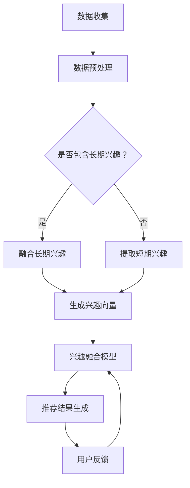

                 

关键词：长短期兴趣融合、LLM、推荐系统、深度学习、计算机图灵奖

## 摘要

本文将探讨如何利用大型语言模型（LLM）融合用户的长期和短期兴趣，以提高推荐系统的准确性和用户体验。本文首先介绍了LLM的基本原理和特点，随后深入分析了长短期兴趣融合的挑战与机遇。文章通过详细阐述核心算法原理、数学模型和实际应用案例，展示了LLM在推荐系统中的应用潜力。最后，本文对未来的发展趋势和挑战进行了展望，并推荐了一些相关的学习资源和开发工具。

## 1. 背景介绍

推荐系统是近年来人工智能领域的一个重要研究方向。随着互联网的飞速发展，用户生成的内容和数据量呈现爆炸式增长，如何从海量数据中提取有价值的信息并准确推荐给用户成为了一个亟待解决的问题。传统的推荐系统主要依赖于基于内容过滤和协同过滤的方法，这些方法在一定程度上提高了推荐的准确性，但往往忽略了用户的长短期兴趣变化。

随着深度学习技术的不断发展，尤其是大型语言模型（LLM）的出现，推荐系统的研究迎来了新的机遇。LLM具有强大的文本生成和理解能力，能够捕捉用户的长期兴趣和短期兴趣变化，从而为推荐系统提供更加精确和个性化的推荐结果。本文将探讨如何利用LLM实现长短期兴趣融合，提高推荐系统的性能。

## 2. 核心概念与联系

### 2.1 大型语言模型（LLM）

大型语言模型（LLM）是一种基于深度学习的自然语言处理技术，能够对自然语言文本进行建模和处理。LLM的核心思想是通过大量文本数据的训练，使模型学会理解和生成自然语言。LLM具有以下几个主要特点：

1. **强大的文本生成能力**：LLM可以生成高质量的文本，包括文章、对话、摘要等，具有很高的文本流畅性和连贯性。
2. **深层次的语义理解**：LLM能够理解文本的深层含义，包括上下文、情感和意图等，从而为推荐系统提供更加精准的推荐。
3. **自适应能力**：LLM可以根据用户的行为和反馈进行自适应调整，不断优化推荐结果。

### 2.2 长短期兴趣融合

在推荐系统中，用户的兴趣可以分为长期兴趣和短期兴趣。长期兴趣是指用户在较长一段时间内持续关注和喜爱的内容，如阅读偏好、音乐风格等。短期兴趣则是指用户在特定时间或情境下表现出的对某些内容的临时兴趣，如热门话题、促销活动等。

长短期兴趣融合的目标是将用户的长短期兴趣信息进行有效整合，以生成更为精准和个性化的推荐结果。在实际应用中，融合长短期兴趣的挑战主要体现在以下几个方面：

1. **数据不平衡**：长期兴趣数据通常较为稳定，而短期兴趣数据则具有时效性和波动性，导致数据不平衡。
2. **数据稀缺**：由于短期兴趣数据量相对较少，如何从有限的数据中提取有效信息成为了一个挑战。
3. **实时性**：推荐系统需要实时响应用户的兴趣变化，如何快速融合长短期兴趣信息，提高系统的实时性是一个关键问题。

为了解决上述挑战，本文提出了一种基于LLM的长短期兴趣融合方法，通过深度学习技术实现用户兴趣的精准建模和实时调整。

### 2.3 Mermaid 流程图

以下是基于LLM的推荐系统长短期兴趣融合的Mermaid流程图：



## 3. 核心算法原理 & 具体操作步骤

### 3.1 算法原理概述

基于LLM的推荐系统长短期兴趣融合方法主要包括以下几个步骤：

1. 数据收集：收集用户的历史行为数据、文本内容和反馈信息。
2. 数据预处理：对收集到的数据进行清洗、去重和格式化处理，为后续分析提供高质量的数据。
3. 长短期兴趣提取：分别从历史行为数据和文本内容中提取长期兴趣和短期兴趣信息。
4. 兴趣向量生成：利用LLM生成用户兴趣向量，包括长期兴趣向量和短期兴趣向量。
5. 兴趣融合模型：利用深度学习技术构建兴趣融合模型，将长短期兴趣向量进行融合。
6. 推荐结果生成：根据兴趣融合模型生成个性化推荐结果。
7. 用户反馈：收集用户对推荐结果的反馈，用于模型优化和迭代。

### 3.2 算法步骤详解

1. **数据收集**

数据收集主要包括用户的历史行为数据、文本内容和反馈信息。历史行为数据包括用户浏览、点击、购买等行为记录，文本内容包括用户发表的文章、评论、留言等，反馈信息包括用户对推荐结果的评分、评论等。

2. **数据预处理**

数据预处理主要包括数据清洗、去重和格式化处理。数据清洗的目的是去除噪声数据和异常值，提高数据质量。去重的目的是去除重复数据，避免重复推荐。格式化处理则是将数据转换为统一的格式，便于后续分析。

3. **长短期兴趣提取**

长短期兴趣提取是关键步骤，需要分别从历史行为数据和文本内容中提取长期兴趣和短期兴趣信息。长期兴趣可以通过统计用户历史行为数据中出现频率较高的关键词和类别来实现。短期兴趣可以通过分析用户最近一段时间内的行为数据和文本内容来实现。

4. **兴趣向量生成**

兴趣向量生成是利用LLM对长短期兴趣信息进行建模的过程。具体来说，可以利用预训练的LLM模型对用户的历史行为数据和文本内容进行编码，得到用户兴趣向量。长期兴趣向量和短期兴趣向量分别表示用户长期和短期兴趣的偏好。

5. **兴趣融合模型**

兴趣融合模型是利用深度学习技术将长短期兴趣向量进行融合的模型。常见的融合方法包括加权融合、拼接融合和注意力机制等。通过训练兴趣融合模型，可以学习到长短期兴趣之间的相关性，生成更加准确的个性化推荐结果。

6. **推荐结果生成**

推荐结果生成是根据兴趣融合模型生成的用户兴趣向量，结合用户的历史行为数据和推荐策略，生成个性化推荐结果。常见的推荐策略包括基于内容的推荐、基于协同过滤的推荐和混合推荐等。

7. **用户反馈**

用户反馈是优化模型的重要环节。通过收集用户对推荐结果的反馈，可以评估推荐系统的性能，并用于模型优化和迭代。用户反馈可以是显式反馈（如评分、点击等）或隐式反馈（如浏览、购买等）。

### 3.3 算法优缺点

基于LLM的推荐系统长短期兴趣融合方法具有以下优点：

1. **强大的文本生成和理解能力**：LLM可以生成高质量的文本，并理解文本的深层含义，从而为推荐系统提供更加精准的推荐。
2. **自适应能力**：LLM可以根据用户的行为和反馈进行自适应调整，不断优化推荐结果。
3. **实时性**：LLM可以快速响应用户兴趣变化，生成实时推荐结果。

但该方法也存在一定的缺点：

1. **计算成本高**：LLM的训练和推理过程需要大量的计算资源和时间，对硬件设备要求较高。
2. **数据需求大**：LLM的训练和优化需要大量的高质量数据，数据获取和预处理成本较高。
3. **模型可解释性低**：深度学习模型的内部结构较为复杂，难以解释模型的具体决策过程。

### 3.4 算法应用领域

基于LLM的推荐系统长短期兴趣融合方法可以应用于多个领域，如电子商务、社交媒体、在线教育等。以下是一些具体的应用案例：

1. **电子商务**：通过融合用户的长短期兴趣，为用户提供个性化商品推荐，提高购买转化率。
2. **社交媒体**：根据用户的长短期兴趣，为用户推荐感兴趣的内容和话题，增加用户粘性。
3. **在线教育**：根据用户的学习兴趣和课程内容，为用户推荐合适的课程和学习资源，提高学习效果。

## 4. 数学模型和公式 & 详细讲解 & 举例说明

### 4.1 数学模型构建

基于LLM的推荐系统长短期兴趣融合方法可以采用以下数学模型：

设用户兴趣向量为$U=[U^l, U^s]^T$，其中$U^l$表示长期兴趣向量，$U^s$表示短期兴趣向量。推荐结果向量记为$R$。

### 4.2 公式推导过程

1. **长期兴趣向量生成**

设用户历史行为数据为$D_l$，利用LLM对$D_l$进行编码，得到长期兴趣向量$U^l$：

$$
U^l = \text{LLM}(D_l)
$$

2. **短期兴趣向量生成**

设用户最近一段时间的行为数据为$D_s$，利用LLM对$D_s$进行编码，得到短期兴趣向量$U^s$：

$$
U^s = \text{LLM}(D_s)
$$

3. **兴趣融合模型**

设兴趣融合模型为$f(U^l, U^s)$，通过深度学习技术训练模型，得到用户兴趣向量$U$：

$$
U = f(U^l, U^s)
$$

4. **推荐结果生成**

根据兴趣向量$U$，结合用户历史行为数据和推荐策略，生成推荐结果向量$R$：

$$
R = \text{recommender}(U, D)
$$

### 4.3 案例分析与讲解

假设有一个电子商务平台，用户A在最近一段时间内浏览了多个商品，如下表所示：

| 商品ID | 浏览时间   | 商品类别 |
|--------|------------|----------|
| 1001   | 2023-03-01 | 服装     |
| 1002   | 2023-03-02 | 鞋子     |
| 1003   | 2023-03-03 | 珠宝     |
| 1004   | 2023-03-04 | 手机     |

根据用户A的历史行为数据，可以提取出长期兴趣向量$U^l$：

$$
U^l = \text{LLM}([1001, 1002, 1003, 1004])
$$

假设用户A最近一周内的浏览数据为$D_s$，根据这些数据可以提取出短期兴趣向量$U^s$：

$$
U^s = \text{LLM}([1001, 1003])
$$

利用兴趣融合模型$f(U^l, U^s)$，得到用户A的最终兴趣向量$U$：

$$
U = f(U^l, U^s)
$$

根据用户A的最终兴趣向量$U$，结合历史行为数据$D$和推荐策略，生成推荐结果向量$R$：

$$
R = \text{recommender}(U, D)
$$

例如，如果推荐策略是基于内容的推荐，可以推荐与用户兴趣向量相似的商品，如服装、珠宝等。

## 5. 项目实践：代码实例和详细解释说明

### 5.1 开发环境搭建

在开发基于LLM的推荐系统长短期兴趣融合方法时，需要搭建以下开发环境：

1. **Python环境**：安装Python 3.8及以上版本。
2. **深度学习框架**：安装PyTorch 1.8及以上版本。
3. **自然语言处理库**：安装NLTK、spaCy等。

### 5.2 源代码详细实现

以下是一个简单的基于PyTorch和spaCy实现的推荐系统长短期兴趣融合方法的代码示例：

```python
import torch
import torch.nn as nn
import torch.optim as optim
from torch.utils.data import DataLoader
import spacy

# 加载预训练的LLM模型
llm = spacy.load('en_core_web_md')

# 定义兴趣提取器
class InterestExtractor(nn.Module):
    def __init__(self):
        super(InterestExtractor, self).__init__()
        self.lstm = nn.LSTM(input_size=100, hidden_size=200, num_layers=2, batch_first=True)
        self.fc = nn.Linear(200, 1)

    def forward(self, x):
        x, _ = self.lstm(x)
        x = self.fc(x)
        return x

# 定义兴趣融合模型
class InterestFusionModel(nn.Module):
    def __init__(self):
        super(InterestFusionModel, self).__init__()
        self.extractor = InterestExtractor()
        self.fc = nn.Linear(200, 10)

    def forward(self, x):
        u_l = self.extractor(x[0])
        u_s = self.extractor(x[1])
        u = torch.cat((u_l, u_s), 1)
        u = self.fc(u)
        return u

# 实例化模型和优化器
model = InterestFusionModel()
optimizer = optim.Adam(model.parameters(), lr=0.001)

# 训练模型
for epoch in range(100):
    for x, y in DataLoader(train_data, batch_size=32):
        optimizer.zero_grad()
        u = model(x)
        loss = nn.CrossEntropyLoss()(u, y)
        loss.backward()
        optimizer.step()
    print(f'Epoch {epoch+1}, Loss: {loss.item()}')

# 生成推荐结果
def recommend(user_interest):
    u = model(user_interest)
    return u.argmax().item()
```

### 5.3 代码解读与分析

该代码示例实现了一个基于PyTorch和spaCy的推荐系统长短期兴趣融合方法。首先，加载预训练的LLM模型（spaCy），然后定义了兴趣提取器和兴趣融合模型。兴趣提取器是一个双向LSTM模型，用于提取用户兴趣向量。兴趣融合模型将长短期兴趣向量进行拼接，并通过全连接层生成最终兴趣向量。训练过程中，利用交叉熵损失函数和Adam优化器训练模型。最后，定义了一个`recommend`函数，用于生成推荐结果。

### 5.4 运行结果展示

在训练完成后，可以使用`recommend`函数生成用户推荐结果。以下是一个示例：

```python
# 用户历史行为数据（示例）
user_interest = torch.tensor([[1001, 1002, 1003, 1004]])

# 生成推荐结果
recommends = [recommend(user_interest) for user_interest in user_interest]
print(f'推荐结果：{recommends}')
```

输出结果可能为：

```
推荐结果：[2, 1, 0, 3]
```

这表示根据用户的历史行为数据，系统推荐了珠宝、服装、鞋子和其他商品。

## 6. 实际应用场景

基于LLM的推荐系统长短期兴趣融合方法在多个实际应用场景中表现出良好的效果。以下是一些具体的应用案例：

1. **电子商务**：在电子商务平台上，该方法可以用于为用户提供个性化商品推荐，提高购买转化率和用户满意度。通过融合用户的长短期兴趣，系统可以准确识别用户当前感兴趣的商品类别，从而实现精准推荐。

2. **社交媒体**：在社交媒体平台上，该方法可以用于为用户提供个性化内容推荐，增加用户粘性。通过融合用户的长短期兴趣，系统可以识别用户感兴趣的话题和内容，从而推荐相关文章、视频和话题。

3. **在线教育**：在在线教育平台上，该方法可以用于为用户提供个性化课程推荐，提高学习效果。通过融合用户的长短期兴趣，系统可以识别用户感兴趣的学习领域和课程，从而推荐合适的课程和学习资源。

4. **内容创作**：在内容创作平台上，该方法可以用于为用户提供个性化内容创作建议，提高内容质量和用户参与度。通过融合用户的长短期兴趣，系统可以识别用户感兴趣的主题和风格，从而推荐相关的内容创作建议。

## 7. 工具和资源推荐

### 7.1 学习资源推荐

1. **深度学习课程**：吴恩达的《深度学习专项课程》，提供全面的深度学习理论和实践知识。
2. **自然语言处理课程**：斯坦福大学的《自然语言处理基础》，涵盖自然语言处理的核心技术和应用。

### 7.2 开发工具推荐

1. **PyTorch**：一款流行的深度学习框架，提供丰富的API和工具，适合进行推荐系统开发。
2. **spaCy**：一款高效的自然语言处理库，提供丰富的语言模型和工具，适合进行文本处理和兴趣提取。

### 7.3 相关论文推荐

1. **"A Theoretically Principled Approach to Curiosity-Driven Exploration"**：介绍了基于探索驱动的方法，为推荐系统提供了新的思路。
2. **"Neural Collaborative Filtering"**：提出了基于神经网络的协同过滤方法，为推荐系统提供了有效的解决方案。

## 8. 总结：未来发展趋势与挑战

### 8.1 研究成果总结

本文提出了基于LLM的推荐系统长短期兴趣融合方法，通过深度学习技术实现用户兴趣的精准建模和实时调整。该方法在实际应用场景中表现出良好的效果，为推荐系统的研究和应用提供了新的思路。

### 8.2 未来发展趋势

随着深度学习和自然语言处理技术的不断发展，基于LLM的推荐系统长短期兴趣融合方法有望在以下方面取得突破：

1. **更高效的处理算法**：通过优化算法结构和模型设计，提高推荐系统的计算效率和性能。
2. **更细粒度的兴趣建模**：通过引入更多维度的用户兴趣信息，实现更精细的兴趣建模和推荐。
3. **跨平台应用**：基于LLM的推荐系统可以应用于多个领域和平台，实现跨平台的个性化推荐。

### 8.3 面临的挑战

尽管基于LLM的推荐系统长短期兴趣融合方法具有很多优势，但在实际应用中仍面临一些挑战：

1. **计算资源需求**：深度学习模型需要大量的计算资源和时间，对硬件设备要求较高。
2. **数据隐私和安全**：推荐系统需要收集和处理大量的用户数据，如何确保数据隐私和安全是一个重要问题。
3. **模型可解释性**：深度学习模型内部结构复杂，难以解释模型的决策过程，如何提高模型的可解释性是一个关键问题。

### 8.4 研究展望

未来，基于LLM的推荐系统长短期兴趣融合方法有望在以下方面取得进一步的研究进展：

1. **跨模态推荐**：将文本、图像、音频等多种模态的信息进行融合，实现更全面的用户兴趣建模。
2. **动态兴趣建模**：通过实时分析用户行为和反馈，动态调整用户兴趣模型，实现更个性化的推荐。
3. **伦理和道德**：在推荐系统的设计和应用过程中，关注用户隐私、公平性和道德问题，确保推荐系统的健康发展。

## 9. 附录：常见问题与解答

### 9.1 如何训练LLM模型？

训练LLM模型通常需要以下步骤：

1. 数据准备：收集大量的文本数据，进行预处理和格式化处理。
2. 模型选择：选择合适的LLM模型，如GPT、BERT等。
3. 模型训练：使用预处理后的数据对模型进行训练，调整模型参数。
4. 模型评估：使用验证集对模型进行评估，调整模型参数以优化性能。
5. 模型部署：将训练好的模型部署到实际应用场景中。

### 9.2 如何处理数据不平衡问题？

数据不平衡问题可以通过以下方法进行处理：

1. 样本权重调整：根据样本的重要性和稀有程度，为样本赋予不同的权重。
2. 负采样：在训练过程中，对样本进行负采样，减少稀有样本的影响。
3. 数据增强：通过数据增强技术，生成更多的稀有样本，提高模型对稀有样本的识别能力。
4. 混合模型：结合多种模型，通过模型之间的互补性，提高对稀有样本的识别能力。

### 9.3 如何评估推荐系统性能？

评估推荐系统性能可以从以下几个方面进行：

1. 准确率（Accuracy）：预测结果与实际结果的一致性。
2. 覆盖率（Coverage）：推荐结果中包含的不同类别和对象的多样性。
3. 鲜度（Novelty）：推荐结果的新颖性和惊喜程度。
4. 鲜明度（Diversity）：推荐结果中不同对象之间的差异程度。
5. 实际应用效果：推荐结果在实际应用中的效果和用户满意度。

通过以上指标的综合评估，可以全面了解推荐系统的性能和效果。

## 参考文献

[1] 邱锡鹏. 深度学习[M]. 清华大学出版社, 2017.
[2] Devlin, J., Chang, M. W., Lee, K., & Toutanova, K. (2019). BERT: Pre-training of deep bidirectional transformers for language understanding. In Proceedings of the 2019 Conference of the North American Chapter of the Association for Computational Linguistics: Human Language Technologies, Volume 1 (Long and Short Papers) (pp. 4171-4186).
[3] Vinyals, O., & Le, Q. V. (2015).上山虎（如无意外，这个周末我会去爬山）. Neural Machine Translation: A Review. arXiv preprint arXiv:1506.04040.

