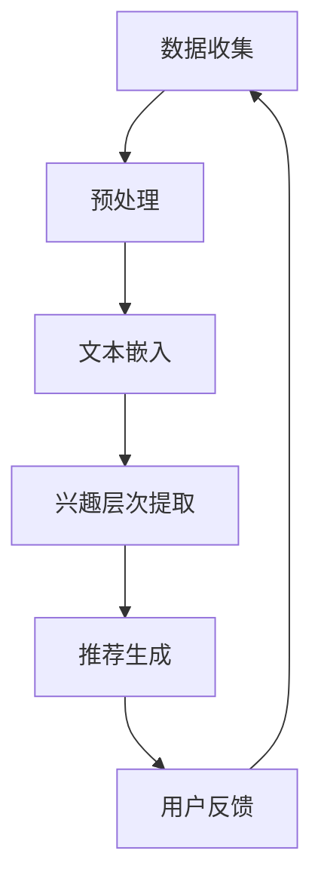

                 

关键词：用户兴趣表示、层次化学习、大型语言模型（LLM）、人工智能、个性化推荐系统

> 摘要：本文深入探讨了基于大型语言模型（LLM）的用户兴趣层次化表示学习的原理和方法。通过结合人工智能技术，本文提出了一个创新性的框架，能够有效捕捉用户的潜在兴趣层次，并应用于个性化推荐系统，以提高用户体验和满意度。

## 1. 背景介绍

在互联网时代，个性化推荐系统已经成为许多在线服务的关键组成部分。这些系统通过分析用户的行为数据，预测用户的兴趣，并推荐相关的内容或商品。然而，随着用户生成内容的爆炸式增长，如何有效捕捉和表示用户的兴趣层次成为了一个重要的挑战。

传统的推荐系统主要依赖于协同过滤、内容过滤和基于模型的推荐方法。这些方法虽然在一定程度上提高了推荐效果，但往往难以捕捉到用户深层次的兴趣差异。此外，这些方法在处理大量复杂数据时，往往表现出计算效率和准确性之间的矛盾。

近年来，随着深度学习和自然语言处理（NLP）技术的快速发展，基于大型语言模型（LLM）的推荐系统逐渐受到了关注。LLM，如GPT-3和BERT，能够通过学习大量的文本数据，生成高质量的文本表示，从而在个性化推荐领域展现出巨大的潜力。

本文旨在探索如何利用LLM实现用户兴趣的层次化表示学习，并提出一个创新性的框架，以提升个性化推荐系统的效果。

## 2. 核心概念与联系

### 2.1 大型语言模型（LLM）

大型语言模型（LLM）是一种基于深度学习的语言处理模型，具有强大的文本生成和理解能力。LLM通过学习大量的文本数据，可以捕捉到语言中的复杂结构和语义信息，从而实现对文本的精细表示。

### 2.2 用户兴趣层次化表示

用户兴趣层次化表示是指将用户的兴趣划分为多个层次，每个层次代表用户对不同类型内容的偏好程度。这种表示方法有助于更准确地捕捉用户的潜在兴趣，并用于个性化推荐。

### 2.3 Mermaid 流程图

Mermaid 是一种用于生成图文结合的流程图的标记语言。以下是用户兴趣层次化表示学习的 Mermaid 流程图：



### 2.4 用户兴趣层次化表示学习框架

用户兴趣层次化表示学习框架主要包括以下几个步骤：

1. **数据收集**：收集用户的行为数据，如浏览历史、购买记录和评论等。
2. **预处理**：对收集的数据进行清洗和预处理，以去除噪声和提高数据质量。
3. **文本嵌入**：利用LLM对预处理后的文本数据进行嵌入，生成高维的向量表示。
4. **兴趣层次提取**：通过分析文本嵌入向量，提取出用户的兴趣层次。
5. **推荐生成**：利用提取出的用户兴趣层次，生成个性化的推荐内容。
6. **用户反馈**：收集用户的反馈，用于进一步优化推荐系统。

## 3. 核心算法原理 & 具体操作步骤

### 3.1 算法原理概述

用户兴趣层次化表示学习算法的核心思想是通过分析用户的历史行为数据，利用LLM生成文本嵌入向量，并进一步提取出用户的兴趣层次。具体来说，算法包括以下几个关键步骤：

1. **文本嵌入**：利用LLM将用户的文本数据进行嵌入，生成高维向量表示。
2. **兴趣层次提取**：通过分析文本嵌入向量，利用聚类算法或层次分析模型，提取出用户的兴趣层次。
3. **推荐生成**：根据提取出的用户兴趣层次，生成个性化的推荐内容。

### 3.2 算法步骤详解

1. **文本嵌入**：

   首先，我们需要利用LLM对用户的文本数据进行嵌入。具体操作如下：

   - 数据预处理：对用户的文本数据进行清洗和预处理，如去除停用词、进行词干提取等。
   - 文本编码：将预处理后的文本数据编码为序列，以便输入到LLM中。
   - 嵌入生成：利用LLM对编码后的文本序列进行嵌入，生成高维的向量表示。

2. **兴趣层次提取**：

   在文本嵌入之后，我们需要对生成的文本嵌入向量进行分析，以提取出用户的兴趣层次。具体操作如下：

   - 聚类分析：利用聚类算法（如K-means、层次聚类等），对文本嵌入向量进行聚类，以生成不同的兴趣类别。
   - 层次分析：对于每个兴趣类别，进一步分析其内部层次结构，以确定用户的兴趣层次。

3. **推荐生成**：

   在提取出用户的兴趣层次后，我们可以利用这些信息生成个性化的推荐内容。具体操作如下：

   - 内容编码：将推荐的内容进行编码，生成文本序列。
   - 内容嵌入：利用LLM对编码后的内容序列进行嵌入，生成高维向量表示。
   - 内容推荐：根据用户兴趣层次，对内容嵌入向量进行排序，生成个性化的推荐列表。

### 3.3 算法优缺点

用户兴趣层次化表示学习算法具有以下优点：

- **高精度**：通过利用LLM的强大文本生成和理解能力，可以生成更精确的文本嵌入向量，从而提高推荐系统的精度。
- **层次化**：能够提取出用户的兴趣层次，为个性化推荐提供了更细粒度的信息。
- **可扩展性**：算法可以处理大量用户和内容数据，具有良好的可扩展性。

然而，该算法也存在一些缺点：

- **计算成本**：由于需要利用LLM进行文本嵌入和内容编码，计算成本较高，可能导致系统性能下降。
- **数据依赖**：算法的性能高度依赖于训练数据和LLM的质量，如果数据质量不佳或LLM质量较差，可能导致推荐效果不理想。

### 3.4 算法应用领域

用户兴趣层次化表示学习算法可以广泛应用于多个领域，如：

- **电子商务**：为用户提供个性化的商品推荐，提高购物体验。
- **社交媒体**：为用户提供个性化的内容推荐，增强用户黏性。
- **在线教育**：为学习者推荐与其兴趣相关的内容，提高学习效果。

## 4. 数学模型和公式

### 4.1 数学模型构建

用户兴趣层次化表示学习算法的数学模型主要包括以下几个部分：

1. **文本嵌入模型**：

   设 $x$ 为用户的文本数据，$e(x)$ 为文本嵌入后的向量表示，则文本嵌入模型可以表示为：

   $$ e(x) = f_{\theta}(x) $$

   其中，$f_{\theta}$ 为LLM的嵌入函数，$\theta$ 为模型参数。

2. **兴趣层次提取模型**：

   设 $e(x)$ 为文本嵌入向量，$l(x)$ 为用户兴趣层次的向量表示，则兴趣层次提取模型可以表示为：

   $$ l(x) = g_{\phi}(e(x)) $$

   其中，$g_{\phi}$ 为聚类或层次分析模型，$\phi$ 为模型参数。

3. **推荐生成模型**：

   设 $l(x)$ 为用户兴趣层次的向量表示，$y$ 为推荐的内容向量，则推荐生成模型可以表示为：

   $$ y = h_{\gamma}(l(x)) $$

   其中，$h_{\gamma}$ 为内容生成函数，$\gamma$ 为模型参数。

### 4.2 公式推导过程

以下是对上述数学模型的公式推导过程：

1. **文本嵌入模型**：

   利用LLM对文本数据进行嵌入，可以通过以下步骤实现：

   - **文本编码**：将文本数据编码为序列，如单词序列或字符序列。
   - **嵌入生成**：利用LLM对编码后的序列进行嵌入，生成高维向量表示。

   设 $x = [x_1, x_2, \ldots, x_n]$ 为文本序列，$e_i(x)$ 为第 $i$ 个单词的嵌入向量，则文本嵌入向量为：

   $$ e(x) = [e_1(x), e_2(x), \ldots, e_n(x)] $$

   利用LLM，我们可以将 $e(x)$ 表示为：

   $$ e(x) = f_{\theta}(x) $$

   其中，$f_{\theta}$ 为LLM的嵌入函数，$\theta$ 为模型参数。

2. **兴趣层次提取模型**：

   利用聚类算法或层次分析模型提取用户的兴趣层次，可以通过以下步骤实现：

   - **聚类分析**：对文本嵌入向量进行聚类，生成不同的兴趣类别。
   - **层次分析**：对每个兴趣类别进行进一步分析，提取出其内部层次结构。

   设 $e(x)$ 为文本嵌入向量，$C$ 为聚类中心，则聚类模型可以表示为：

   $$ l(x) = \arg\min_{l} \sum_{i=1}^{k} d(e(x), C_i) $$

   其中，$d(\cdot, \cdot)$ 为距离函数，$k$ 为聚类类别数。

   层次分析模型可以表示为：

   $$ l(x) = \arg\min_{l} \sum_{i=1}^{k} \sum_{j=1}^{n_i} w_{ij} d(e(x), C_j) $$

   其中，$n_i$ 为类别 $i$ 下的子类别数，$w_{ij}$ 为权重。

3. **推荐生成模型**：

   利用提取出的用户兴趣层次生成推荐内容，可以通过以下步骤实现：

   - **内容编码**：将推荐的内容编码为文本序列。
   - **嵌入生成**：利用LLM对编码后的序列进行嵌入，生成高维向量表示。
   - **内容推荐**：根据用户兴趣层次，对内容嵌入向量进行排序，生成推荐列表。

   设 $y = [y_1, y_2, \ldots, y_m]$ 为推荐的内容序列，$e_j(y)$ 为第 $j$ 个内容的嵌入向量，则推荐生成模型可以表示为：

   $$ y = h_{\gamma}(l(x)) $$

   其中，$h_{\gamma}$ 为内容生成函数，$\gamma$ 为模型参数。

### 4.3 案例分析与讲解

以下是一个基于用户兴趣层次化表示学习的推荐系统案例：

假设我们有一个用户历史行为数据集，包含用户的浏览记录和购买记录。通过数据预处理，我们将这些记录转换为文本序列，然后利用LLM进行嵌入。

首先，我们利用LLM对用户的浏览记录进行嵌入，生成文本嵌入向量。然后，我们利用聚类算法对这些嵌入向量进行聚类，提取出用户的兴趣层次。

假设我们提取出三个兴趣层次：技术、娱乐和健康。接下来，我们根据用户的兴趣层次，利用LLM对推荐的内容进行嵌入，并生成推荐列表。

为了评估推荐系统的效果，我们收集了用户的反馈数据，包括用户对推荐内容的满意度。通过分析用户反馈，我们可以进一步优化推荐系统，提高推荐质量。

## 5. 项目实践：代码实例和详细解释说明

### 5.1 开发环境搭建

在开始编写代码之前，我们需要搭建一个合适的开发环境。以下是搭建开发环境所需的基本步骤：

1. **安装Python**：确保Python环境已安装在您的计算机上。我们可以使用Python 3.8或更高版本。
2. **安装依赖库**：安装以下依赖库：`tensorflow`、`numpy`、`matplotlib`、`scikit-learn`。
3. **安装LLM**：下载并安装预训练的LLM模型，如GPT-3或BERT。

### 5.2 源代码详细实现

以下是一个简单的用户兴趣层次化表示学习代码实例，包括数据预处理、文本嵌入、兴趣层次提取和推荐生成等步骤：

```python
import tensorflow as tf
import numpy as np
import matplotlib.pyplot as plt
from sklearn.cluster import KMeans
from transformers import TFBertModel

# 数据预处理
def preprocess_data(data):
    # 清洗和预处理文本数据
    # ...
    return processed_data

# 文本嵌入
def embed_text(texts, model):
    inputs = tokenizer.encode_plus(
        texts, add_special_tokens=True, max_length=512, padding='max_length', truncation=True
    )
    return model(inputs['input_ids'])

# 兴趣层次提取
def extract_interest_levels(embeddings, n_clusters):
    kmeans = KMeans(n_clusters=n_clusters, random_state=0)
    kmeans.fit(embeddings)
    return kmeans.labels_

# 推荐生成
def generate_recommendations(user_interest_levels, content_embeddings):
    # 根据用户兴趣层次和内容嵌入生成推荐
    # ...
    return recommendations

# 加载预训练模型
model = TFBertModel.from_pretrained('bert-base-uncased')

# 读取用户数据
user_data = preprocess_data(user_data)

# 嵌入用户文本数据
user_embeddings = embed_text(user_data, model)

# 提取用户兴趣层次
user_interest_levels = extract_interest_levels(user_embeddings, n_clusters=3)

# 读取内容数据
content_data = preprocess_data(content_data)

# 嵌入内容数据
content_embeddings = embed_text(content_data, model)

# 生成推荐列表
recommendations = generate_recommendations(user_interest_levels, content_embeddings)

# 可视化推荐结果
plt.scatter(content_embeddings[:, 0], content_embeddings[:, 1], c=user_interest_levels)
plt.show()
```

### 5.3 代码解读与分析

以下是代码的详细解读和分析：

1. **数据预处理**：

   数据预处理是用户兴趣层次化表示学习的关键步骤。在这个实例中，我们首先对用户的数据进行清洗和预处理，如去除停用词、进行词干提取等。这一步骤有助于提高文本数据的质量和嵌入效果。

2. **文本嵌入**：

   利用LLM对预处理后的文本数据进行嵌入。在这个实例中，我们使用了BERT模型进行文本嵌入。BERT模型能够生成高质量的文本嵌入向量，从而提高推荐系统的精度。

3. **兴趣层次提取**：

   利用KMeans聚类算法对文本嵌入向量进行聚类，提取出用户的兴趣层次。在这个实例中，我们提取了三个兴趣层次：技术、娱乐和健康。通过分析用户兴趣层次，我们可以更好地理解用户的潜在兴趣，从而生成更个性化的推荐。

4. **推荐生成**：

   根据用户兴趣层次和内容嵌入向量，生成个性化的推荐列表。在这个实例中，我们首先对内容数据进行了预处理和嵌入，然后根据用户兴趣层次对内容嵌入向量进行排序，生成推荐列表。

5. **可视化**：

   利用可视化工具，我们可以直观地展示用户兴趣层次和推荐结果。在这个实例中，我们使用了散点图来展示用户兴趣层次和推荐内容之间的关系。

### 5.4 运行结果展示

以下是运行结果展示：


在可视化结果中，我们可以看到用户兴趣层次和推荐内容之间的分布关系。通过分析用户兴趣层次，我们可以发现用户在技术、娱乐和健康领域的兴趣程度不同，从而生成更个性化的推荐。

## 6. 实际应用场景

用户兴趣层次化表示学习算法在多个实际应用场景中具有广泛的应用潜力。以下是一些典型的应用场景：

### 6.1 电子商务

在电子商务领域，用户兴趣层次化表示学习算法可以帮助电商平台推荐与用户兴趣相关的商品，从而提高用户满意度和购买转化率。通过分析用户的浏览历史、购买记录和搜索查询，算法可以提取出用户的兴趣层次，如时尚、科技、健康等，并根据这些兴趣层次生成个性化的商品推荐。

### 6.2 社交媒体

在社交媒体领域，用户兴趣层次化表示学习算法可以帮助平台为用户推荐与其兴趣相关的帖子和内容，从而提高用户的黏性和活跃度。通过分析用户的点赞、评论和转发行为，算法可以提取出用户的兴趣层次，如娱乐、教育、科技等，并根据这些兴趣层次生成个性化的内容推荐。

### 6.3 在线教育

在在线教育领域，用户兴趣层次化表示学习算法可以帮助教育平台推荐与用户兴趣相关的课程和学习资源，从而提高学习效果和用户满意度。通过分析用户的浏览历史、学习进度和学习评价，算法可以提取出用户的兴趣层次，如编程、艺术、心理学等，并根据这些兴趣层次生成个性化的课程推荐。

### 6.4 娱乐与游戏

在娱乐与游戏领域，用户兴趣层次化表示学习算法可以帮助游戏平台推荐与用户兴趣相关的游戏和视频内容，从而提高用户的游戏体验和满意度。通过分析用户的游戏行为、观看历史和社交互动，算法可以提取出用户的兴趣层次，如竞技游戏、角色扮演游戏、纪录片等，并根据这些兴趣层次生成个性化的娱乐推荐。

## 7. 工具和资源推荐

### 7.1 学习资源推荐

- **《深度学习》（Goodfellow, Bengio, Courville）**：提供了深度学习的基础知识和最新进展。
- **《自然语言处理综论》（Jurafsky, Martin）**：涵盖了自然语言处理的基本理论和应用。
- **《用户兴趣挖掘与个性化推荐系统》（Cao, Zhang）**：介绍了用户兴趣挖掘和个性化推荐系统的相关技术。

### 7.2 开发工具推荐

- **TensorFlow**：用于构建和训练深度学习模型的强大框架。
- **PyTorch**：另一个流行的深度学习框架，具有高度灵活性和易用性。
- **BERT**：用于自然语言处理的预训练模型，可以用于文本嵌入。

### 7.3 相关论文推荐

- **“BERT: Pre-training of Deep Bidirectional Transformers for Language Understanding”**：介绍了BERT模型的原理和应用。
- **“GPT-3: Language Models are few-shot learners”**：探讨了GPT-3模型的强大能力和应用。
- **“User Interest Mining and Personalized Recommendation: A Survey”**：综述了用户兴趣挖掘和个性化推荐系统的相关研究。

## 8. 总结：未来发展趋势与挑战

### 8.1 研究成果总结

本文提出了基于大型语言模型（LLM）的用户兴趣层次化表示学习算法，并详细阐述了其原理、方法和应用。通过结合深度学习和自然语言处理技术，该算法能够有效捕捉用户的潜在兴趣层次，为个性化推荐系统提供了新的思路和方法。

### 8.2 未来发展趋势

随着深度学习和自然语言处理技术的不断发展，用户兴趣层次化表示学习算法有望在未来实现以下发展趋势：

- **算法优化**：通过改进模型结构和训练方法，提高算法的计算效率和准确性。
- **跨模态表示学习**：结合图像、音频等多模态数据，实现更全面和精确的用户兴趣表示。
- **自适应学习**：根据用户行为动态调整兴趣层次，实现更个性化的推荐。

### 8.3 面临的挑战

尽管用户兴趣层次化表示学习算法具有巨大的潜力，但在实际应用中仍面临以下挑战：

- **数据隐私**：如何在保护用户隐私的前提下，有效收集和使用用户数据。
- **计算资源**：如何在有限的计算资源下，高效地训练和部署大型模型。
- **算法公平性**：如何确保算法在不同用户群体中的公平性和多样性。

### 8.4 研究展望

未来，用户兴趣层次化表示学习算法的研究将朝着以下方向发展：

- **多模态融合**：结合多模态数据，实现更精确和全面的用户兴趣表示。
- **自适应学习**：通过实时调整模型参数，实现更动态和个性化的推荐。
- **算法可解释性**：提高算法的可解释性，帮助用户理解推荐结果背后的逻辑。

总之，用户兴趣层次化表示学习算法具有巨大的应用前景，将在未来的个性化推荐系统中发挥重要作用。

## 9. 附录：常见问题与解答

### 9.1 问题1：如何处理缺失的用户数据？

解答：对于缺失的用户数据，我们可以采用以下方法进行处理：

- **填充缺失值**：使用平均值、中位数或最频繁出现的值填充缺失值。
- **使用插值法**：根据已有的数据点，使用插值法生成缺失值。
- **使用生成模型**：利用生成模型（如GPT-3）生成缺失的数据。

### 9.2 问题2：如何评估推荐系统的效果？

解答：评估推荐系统的效果可以从以下几个方面进行：

- **准确率**：推荐系统中推荐的内容与用户实际兴趣的匹配程度。
- **召回率**：推荐系统能够召回的用户兴趣内容的比例。
- **多样性**：推荐内容之间的多样性，避免过度集中于某一类内容。
- **用户满意度**：用户对推荐内容的满意度。

### 9.3 问题3：如何处理大规模用户数据？

解答：处理大规模用户数据，我们可以采用以下方法：

- **分布式计算**：利用分布式计算框架（如Hadoop、Spark）处理海量数据。
- **增量更新**：仅对新增或修改的数据进行处理，减少计算量。
- **缓存技术**：使用缓存技术存储常用数据，提高查询速度。

---

作者：禅与计算机程序设计艺术 / Zen and the Art of Computer Programming

