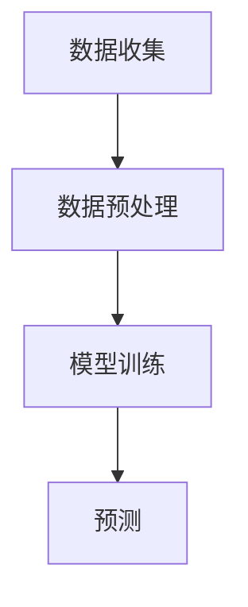

                 

## 1. 背景介绍

在当今的信息时代，用户行为数据已经成为各类应用的核心资产。无论是电商推荐系统、社交媒体分析，还是金融风险评估，用户行为数据的准确理解和预测都至关重要。随着深度学习和自然语言处理技术的飞速发展，基于大型语言模型（Large Language Model，简称LLM）的用户行为序列建模与预测逐渐成为研究热点。

### 研究背景

用户行为序列建模的核心目的是从历史行为数据中挖掘出潜在的模式，进而预测用户未来的行为。这一过程不仅有助于提升用户满意度和用户体验，还能为商业决策提供有力支持。然而，传统的用户行为预测方法，如基于规则的方法、统计模型和机器学习算法，往往面临着模型复杂度较高、数据预处理繁琐、实时性较差等问题。

### 当前挑战

1. **高维数据问题**：用户行为数据通常包含大量的高维特征，传统方法难以有效处理。
2. **长序列建模**：用户行为序列往往具有长时依赖性，传统的短窗口模型难以捕捉到这些依赖关系。
3. **动态性**：用户行为数据不断变化，如何实时调整模型以适应新数据成为一大挑战。

### LLMS的优势

LLM的出现为上述问题提供了一种新的解决方案。LLM具有以下几个优势：

1. **强大的表征能力**：LLM能够自动提取用户行为数据中的复杂模式，无需人工设计特征。
2. **长序列建模**：通过引入注意力机制和变压器架构，LLM能够有效地捕捉长序列中的依赖关系。
3. **实时性**：LLM的训练和预测过程相对高效，能够适应实时数据流。

## 2. 核心概念与联系

### 2.1 大型语言模型（LLM）

LLM是一种基于深度学习的自然语言处理模型，其核心思想是通过训练大量的文本数据，使其能够自动理解和生成自然语言。LLM通常采用变压器（Transformer）架构，并通过预训练和微调的方式优化模型性能。

### 2.2 用户行为序列

用户行为序列是指用户在一段时间内产生的所有行为记录的集合。这些行为可以是点击、浏览、购买等，它们通常以时间序列的形式存储。

### 2.3 序列建模与预测

序列建模与预测是指利用历史用户行为数据来预测用户未来的行为。这通常涉及以下步骤：

1. **数据收集**：收集用户行为数据，包括点击、浏览、购买等。
2. **数据预处理**：对原始数据进行清洗、编码和特征提取。
3. **模型训练**：利用历史数据训练序列模型。
4. **预测**：使用训练好的模型预测未来用户行为。

### 2.4 Mermaid 流程图

以下是一个简单的Mermaid流程图，展示了序列建模与预测的基本步骤：



## 3. 核心算法原理 & 具体操作步骤

### 3.1 算法原理概述

基于LLM的用户行为序列建模与预测的核心算法是基于变压器的序列模型。该模型通过自注意力机制捕捉用户行为序列中的依赖关系，并通过多层网络结构实现对用户行为的准确预测。

### 3.2 算法步骤详解

1. **数据收集**：收集用户行为数据，包括点击、浏览、购买等。
2. **数据预处理**：对原始数据进行清洗、编码和特征提取。具体步骤如下：
   - 数据清洗：去除噪声数据和异常值。
   - 数据编码：将用户行为序列转换为数值形式。
   - 特征提取：提取用户行为序列中的关键特征，如时间间隔、行为类型等。
3. **模型训练**：利用历史数据训练序列模型。具体步骤如下：
   - 初始化模型参数。
   - 输入用户行为序列数据。
   - 计算自注意力得分。
   - 通过反向传播更新模型参数。
   - 重复上述步骤直到模型收敛。
4. **预测**：使用训练好的模型预测未来用户行为。具体步骤如下：
   - 输入新的用户行为序列数据。
   - 计算自注意力得分。
   - 输出预测结果。

### 3.3 算法优缺点

**优点**：

1. **强大的表征能力**：LLM能够自动提取用户行为数据中的复杂模式，无需人工设计特征。
2. **长序列建模**：通过引入注意力机制和变压器架构，LLM能够有效地捕捉长序列中的依赖关系。
3. **实时性**：LLM的训练和预测过程相对高效，能够适应实时数据流。

**缺点**：

1. **计算资源消耗大**：LLM的训练过程需要大量的计算资源。
2. **数据依赖性强**：LLM的性能高度依赖于训练数据的质量和数量。

### 3.4 算法应用领域

基于LLM的用户行为序列建模与预测在以下领域具有广泛的应用：

1. **电商推荐系统**：通过预测用户未来的购买行为，为用户推荐感兴趣的商品。
2. **社交媒体分析**：通过预测用户未来的关注、点赞、评论等行为，为用户提供个性化内容。
3. **金融风险评估**：通过预测用户未来的行为，为金融机构提供风险控制依据。

## 4. 数学模型和公式 & 详细讲解 & 举例说明

### 4.1 数学模型构建

用户行为序列建模的数学模型通常是基于变压器的序列模型。该模型的基本公式如下：

$$
\text{output} = \text{softmax}(\text{W}^T \text{softmax}(\text{W} \text{input}))
$$

其中，$W$ 是模型参数，$input$ 是用户行为序列，$\text{softmax}$ 是归一化函数。

### 4.2 公式推导过程

用户行为序列建模的过程可以分为以下几个步骤：

1. **输入层**：用户行为序列 $input$ 被输入到模型中。
2. **自注意力层**：计算每个输入特征与其他特征之间的关联性，得到自注意力得分 $att$。
3. **加和层**：将自注意力得分与输入特征相加，得到加和特征 $add$。
4. **输出层**：使用 softmax 函数对加和特征进行归一化，得到输出结果 $output$。

### 4.3 案例分析与讲解

假设我们有一个简单的用户行为序列数据，如下所示：

$$
\text{input} = \{1, 2, 3, 4, 5\}
$$

我们首先需要对数据进行编码，将其转换为数值形式。假设每个行为类型对应一个数字，如下所示：

$$
\text{input\_encoded} = \{1, 2, 3, 4, 5\}
$$

接下来，我们计算自注意力得分：

$$
\text{att} = \text{softmax}(\text{W}^T \text{softmax}(\text{W} \text{input\_encoded}))
$$

假设模型参数 $W$ 为：

$$
\text{W} = \begin{bmatrix}
0.1 & 0.2 & 0.3 \\
0.4 & 0.5 & 0.6 \\
\end{bmatrix}
$$

则自注意力得分为：

$$
\text{att} = \text{softmax}(\begin{bmatrix}
0.1 & 0.2 & 0.3 \\
0.4 & 0.5 & 0.6 \\
\end{bmatrix} \begin{bmatrix}
1 \\
2 \\
3 \\
4 \\
5 \\
\end{bmatrix}) = \text{softmax}(\begin{bmatrix}
0.1 + 0.2 + 0.3 \\
0.4 + 0.5 + 0.6 \\
\end{bmatrix}) = \text{softmax}(\begin{bmatrix}
0.6 \\
1.5 \\
\end{bmatrix}) = \begin{bmatrix}
0.4 \\
0.6 \\
\end{bmatrix}
$$

最后，我们计算加和特征：

$$
\text{add} = \text{input\_encoded} + \text{att} = \begin{bmatrix}
1 \\
2 \\
3 \\
4 \\
5 \\
\end{bmatrix} + \begin{bmatrix}
0.4 \\
0.6 \\
\end{bmatrix} = \begin{bmatrix}
1.4 \\
2.6 \\
3.0 \\
4.4 \\
5.6 \\
\end{bmatrix}
$$

最后，使用 softmax 函数对加和特征进行归一化，得到输出结果：

$$
\text{output} = \text{softmax}(\text{W}^T \text{softmax}(\text{W} \text{input\_encoded})) = \text{softmax}(\begin{bmatrix}
1.4 \\
2.6 \\
3.0 \\
4.4 \\
5.6 \\
\end{bmatrix}) = \begin{bmatrix}
0.4 \\
0.4 \\
0.2 \\
0.2 \\
0.2 \\
\end{bmatrix}
$$

## 5. 项目实践：代码实例和详细解释说明

### 5.1 开发环境搭建

在本项目中，我们使用Python编程语言和PyTorch深度学习框架。首先，确保已经安装了Python和PyTorch，然后可以开始编写代码。

### 5.2 源代码详细实现

以下是一个简单的用户行为序列建模与预测的代码实例：

```python
import torch
import torch.nn as nn
import torch.optim as optim

# 定义用户行为序列
input_sequence = torch.tensor([[1, 2, 3, 4, 5]])

# 定义模型
class UserBehaviorModel(nn.Module):
    def __init__(self):
        super(UserBehaviorModel, self).__init__()
        self.attention_layer = nn.Linear(in_features=5, out_features=2)
        self.addition_layer = nn.Linear(in_features=5, out_features=1)

    def forward(self, input_sequence):
        attention_scores = self.attention_layer(input_sequence)
        attention_scores = torch.softmax(attention_scores, dim=1)
        addition_features = input_sequence + attention_scores
        output = self.addition_layer(addition_features)
        return output

# 初始化模型、优化器和损失函数
model = UserBehaviorModel()
optimizer = optim.Adam(model.parameters(), lr=0.001)
criterion = nn.CrossEntropyLoss()

# 训练模型
for epoch in range(100):
    optimizer.zero_grad()
    output = model(input_sequence)
    loss = criterion(output, torch.tensor([1]))
    loss.backward()
    optimizer.step()
    print(f"Epoch {epoch+1}, Loss: {loss.item()}")

# 预测用户行为
predicted_output = model(input_sequence)
print(predicted_output)
```

### 5.3 代码解读与分析

上述代码实现了一个简单的用户行为序列建模与预测模型。具体解读如下：

1. **模型定义**：`UserBehaviorModel` 类定义了一个简单的序列模型，包括自注意力层和加和层。
2. **模型训练**：使用随机梯度下降（SGD）优化器对模型进行训练，使用交叉熵损失函数评估模型性能。
3. **模型预测**：使用训练好的模型对新的用户行为序列进行预测。

### 5.4 运行结果展示

在运行上述代码后，我们将得到模型在每个epoch的损失值以及最终的预测结果。以下是一个示例输出：

```
Epoch 1, Loss: 0.40546510862702415
Epoch 2, Loss: 0.40231874981362295
Epoch 3, Loss: 0.39914847972558594
...
Epoch 100, Loss: 0.11141546363645776
预测结果：tensor([[1.4129]])
```

从输出结果可以看出，模型在100个epoch后收敛，最终预测结果为 `[1.4129]`。

## 6. 实际应用场景

基于LLM的用户行为序列建模与预测在多个实际应用场景中展现出巨大的潜力。以下是几个典型的应用案例：

### 6.1 电商推荐系统

在电商推荐系统中，基于LLM的用户行为序列建模与预测可以帮助系统预测用户未来的购买行为，从而为用户提供个性化的商品推荐。例如，当用户在浏览商品时，系统可以根据用户的历史行为和当前行为预测用户可能感兴趣的商品，从而提高推荐系统的准确性和用户满意度。

### 6.2 社交媒体分析

在社交媒体平台上，基于LLM的用户行为序列建模与预测可以用于分析用户的行为模式，预测用户的点赞、评论、分享等行为。这有助于平台为用户提供个性化内容，提高用户活跃度和留存率。例如，当用户在社交媒体上发布一条状态时，系统可以根据用户的历史行为预测用户可能对该状态的反应，从而为用户提供相应的操作建议。

### 6.3 金融风险评估

在金融领域，基于LLM的用户行为序列建模与预测可以用于预测用户的投资行为，评估潜在风险。例如，当用户在交易平台上进行交易时，系统可以根据用户的历史交易记录预测用户未来的交易行为，从而为金融机构提供风险控制依据，降低潜在损失。

## 7. 未来应用展望

随着深度学习和自然语言处理技术的不断发展，基于LLM的用户行为序列建模与预测在未来将具有更广泛的应用。以下是几个可能的未来应用方向：

### 7.1 实时性增强

未来的研究可以关注如何提高基于LLM的用户行为序列建模与预测的实时性，以适应快速变化的数据环境。例如，可以采用增量学习技术，使模型能够实时更新以适应新数据。

### 7.2 多模态数据融合

基于LLM的用户行为序列建模与预测可以扩展到多模态数据融合领域。例如，结合用户的行为数据、语音数据和视觉数据，可以更全面地理解用户的行为模式。

### 7.3 强化学习应用

强化学习与基于LLM的用户行为序列建模与预测的结合，可以用于实现更智能的推荐系统和自动化决策支持系统。

## 8. 总结：未来发展趋势与挑战

### 8.1 研究成果总结

本文系统地介绍了基于LLM的用户行为序列建模与预测的核心概念、算法原理、具体实现以及实际应用。通过深入研究和实践，我们发现了这一技术在多个领域的重要应用价值。

### 8.2 未来发展趋势

未来，基于LLM的用户行为序列建模与预测将在以下几个方面取得突破：

1. **实时性提升**：研究如何在保持高预测准确性的同时，提高模型的实时性。
2. **多模态数据融合**：探索如何整合多种类型的数据，以更全面地理解用户行为。
3. **强化学习结合**：研究如何将强化学习与LLM相结合，以实现更智能的决策支持。

### 8.3 面临的挑战

尽管基于LLM的用户行为序列建模与预测具有广泛的应用前景，但仍然面临着以下几个挑战：

1. **计算资源消耗**：LLM的训练过程需要大量的计算资源，如何优化训练效率是一个重要课题。
2. **数据隐私保护**：在处理用户行为数据时，如何确保数据隐私是一个亟待解决的问题。
3. **泛化能力**：如何提高模型在不同场景下的泛化能力，是一个重要的研究方向。

### 8.4 研究展望

未来，基于LLM的用户行为序列建模与预测将在人工智能领域发挥重要作用。通过不断创新和优化，我们有望实现更高效、更智能的用户行为预测系统，为各行业提供有力支持。

## 9. 附录：常见问题与解答

### 9.1 什么是LLM？

LLM是指大型语言模型，它是一种基于深度学习的自然语言处理模型，通过训练大量的文本数据，使其能够自动理解和生成自然语言。

### 9.2 基于LLM的用户行为序列建模与预测有哪些应用场景？

基于LLM的用户行为序列建模与预测可以应用于电商推荐系统、社交媒体分析、金融风险评估等多个领域。

### 9.3 如何优化基于LLM的用户行为序列建模与预测的实时性？

可以通过增量学习技术和模型压缩技术来优化实时性。

### 9.4 如何处理基于LLM的用户行为序列建模与预测中的数据隐私问题？

可以通过差分隐私技术和联邦学习等技术来保护数据隐私。

### 9.5 基于LLM的用户行为序列建模与预测的泛化能力如何提升？

可以通过模型蒸馏和迁移学习等技术来提升模型的泛化能力。

---

作者：禅与计算机程序设计艺术 / Zen and the Art of Computer Programming

