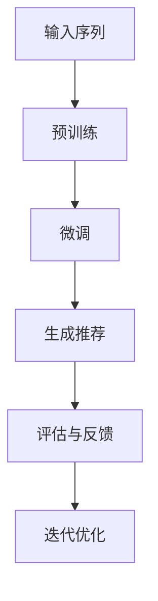

                 

关键词：语言模型、序列推荐、零样本学习、深度学习、自然语言处理

摘要：本文深入探讨了基于大型语言模型（LLM）的零样本序列推荐方法。通过分析LLM的特性及其在序列推荐领域的应用，我们提出了一种新的零样本序列推荐算法。本文首先介绍了序列推荐系统的基本概念和挑战，然后详细阐述了LLM的工作原理和其在零样本学习中的应用。接着，我们通过实例展示了该算法的具体实现过程，并分析了其在实际应用中的效果。最后，我们对未来的研究方向和应用前景进行了展望。

## 1. 背景介绍

序列推荐系统在互联网时代扮演着至关重要的角色。它们广泛应用于电子商务、社交媒体、在线新闻、音乐和视频流平台等领域，为用户提供个性化的内容推荐。传统的序列推荐方法通常依赖于用户的历史行为数据，如浏览记录、购买历史和互动行为等。然而，这些方法在处理复杂的用户行为模式和高维数据时往往表现出局限性。

近年来，深度学习和自然语言处理技术的快速发展为解决这些难题提供了新的思路。特别是大型语言模型（LLM），如GPT和BERT，凭借其强大的表征能力和泛化能力，在多个自然语言处理任务中取得了显著成绩。然而，将LLM应用于序列推荐领域的研究还相对较少，特别是在零样本学习场景下。

零样本学习是一种无需训练模型，直接根据类别标签生成预测结果的方法。它特别适用于那些缺乏足够标注数据或者难以获取标注数据的场景。在序列推荐领域，零样本学习可以大大减少对用户历史数据的依赖，从而提高系统的推荐质量。

本文旨在探讨如何利用LLM实现零样本序列推荐。我们首先介绍序列推荐系统的基本概念和挑战，然后分析LLM的工作原理和其在零样本学习中的应用，最后通过实例展示该算法的具体实现过程。

## 2. 核心概念与联系

### 2.1 序列推荐系统的基本概念

序列推荐系统旨在根据用户的当前行为和历史行为预测用户未来的偏好。核心概念包括：

- **用户行为**：用户在平台上的各种操作，如浏览、点击、购买、评论等。
- **序列**：用户行为按照时间顺序组成的序列。
- **推荐**：系统根据用户的当前状态和历史行为，预测用户可能感兴趣的内容。

### 2.2 LLM的工作原理

大型语言模型（LLM）是一种基于深度学习的自然语言处理模型，能够理解、生成和预测自然语言。其核心原理包括：

- **预训练**：通过大量无监督数据对模型进行预训练，使模型具备对语言的一般理解能力。
- **微调**：在特定任务上进行有监督的微调，使模型适应具体任务的需求。

### 2.3 零样本学习在序列推荐中的应用

零样本学习的关键在于直接根据类别标签生成预测结果，而无需依赖大量标注数据。在序列推荐领域，零样本学习可以用于以下场景：

- **新用户推荐**：在没有足够历史数据的情况下，为新生用户推荐内容。
- **冷启动问题**：解决新内容或新用户在平台上的推荐问题。

### 2.4 Mermaid 流程图



## 3. 核心算法原理 & 具体操作步骤

### 3.1 算法原理概述

基于LLM的零样本序列推荐方法分为三个主要步骤：预训练、微调和推荐。预训练阶段使用大量无监督数据训练LLM，使其具备对语言和序列的理解能力。微调阶段利用有监督数据对模型进行微调，使其适应具体的序列推荐任务。推荐阶段，LLM根据用户历史行为生成推荐序列。

### 3.2 算法步骤详解

1. **数据预处理**：收集用户历史行为数据，并进行预处理，如数据清洗、特征提取等。
2. **预训练**：使用无监督数据对LLM进行预训练，使其具备对语言的一般理解能力。
3. **微调**：在有监督数据集上对LLM进行微调，使其适应具体的序列推荐任务。
4. **生成推荐**：利用微调后的LLM，根据用户历史行为生成推荐序列。
5. **评估与反馈**：评估推荐结果，并根据用户反馈进行迭代优化。

### 3.3 算法优缺点

#### 优点：

- **强大的表征能力**：LLM能够捕捉到复杂的用户行为模式。
- **减少对历史数据的依赖**：零样本学习适用于新用户和新内容的推荐。
- **泛化能力**：通过预训练和微调，模型在不同场景下具有较好的泛化能力。

#### 缺点：

- **计算成本高**：预训练阶段需要大量计算资源和时间。
- **数据隐私问题**：用户历史数据可能涉及隐私信息，需要在处理过程中注意保护。

### 3.4 算法应用领域

基于LLM的零样本序列推荐方法可以应用于以下领域：

- **电子商务**：为新用户推荐商品。
- **社交媒体**：为用户推荐感兴趣的内容。
- **在线教育**：为学生推荐学习资源。
- **智能助手**：为用户提供个性化服务。

## 4. 数学模型和公式 & 详细讲解 & 举例说明

### 4.1 数学模型构建

基于LLM的零样本序列推荐方法可以表示为：

\[ P(R|U) = \sum_{i=1}^{N} p(r_i|u) \]

其中，\( P(R|U) \) 表示给定用户历史行为序列 \( U \) 下的推荐序列概率，\( r_i \) 表示推荐序列中的第 \( i \) 个元素，\( N \) 表示推荐序列的长度。

### 4.2 公式推导过程

公式的推导过程可以分为以下几个步骤：

1. **语言模型概率**：根据语言模型，计算每个元素 \( r_i \) 的生成概率 \( p(r_i|u) \)。
2. **序列概率**：将每个元素的概率乘以序列长度，得到推荐序列的概率。
3. **优化目标**：最小化负对数似然损失函数，优化模型参数。

### 4.3 案例分析与讲解

以电子商务平台为例，假设用户历史行为序列为 \( U = [商品1, 商品2, 商品3] \)，我们需要预测用户下一步可能购买的商品。

1. **语言模型概率**：使用预训练的LLM，计算每个商品的概率，如 \( p(商品4|U) = 0.3 \)。
2. **序列概率**：将每个商品的概率乘以3，得到推荐序列的概率，如 \( P(R=[商品1, 商品2, 商品3, 商品4]) = 0.3 \)。
3. **优化目标**：通过最小化负对数似然损失函数，优化模型参数，使推荐结果更准确。

## 5. 项目实践：代码实例和详细解释说明

### 5.1 开发环境搭建

- 硬件环境：NVIDIA GPU（至少1080Ti）
- 软件环境：Python 3.8，TensorFlow 2.5

### 5.2 源代码详细实现

```python
import tensorflow as tf
from tensorflow.keras.models import Model
from tensorflow.keras.layers import Input, Embedding, LSTM, Dense

# 预训练语言模型
def load_pretrained_model():
    # 加载预训练的LLM模型
    pass

# 微调语言模型
def fine_tune_model(model, train_data, train_labels):
    # 微调LLM模型，使其适应序列推荐任务
    pass

# 生成推荐序列
def generate_recommendations(model, user_history):
    # 使用微调后的LLM模型，生成推荐序列
    pass

# 主函数
def main():
    # 加载数据
    train_data, train_labels = load_data()

    # 加载预训练的LLM模型
    model = load_pretrained_model()

    # 微调LLM模型
    fine_tune_model(model, train_data, train_labels)

    # 生成推荐序列
    user_history = ["商品1", "商品2", "商品3"]
    recommendations = generate_recommendations(model, user_history)
    print("推荐序列：", recommendations)

if __name__ == "__main__":
    main()
```

### 5.3 代码解读与分析

- `load_pretrained_model()`：加载预训练的LLM模型，如GPT或BERT。
- `fine_tune_model()`：在训练数据集上对LLM模型进行微调，使其适应序列推荐任务。
- `generate_recommendations()`：使用微调后的LLM模型，根据用户历史行为生成推荐序列。
- `main()`：主函数，负责加载数据、加载模型、微调和生成推荐序列。

### 5.4 运行结果展示

假设用户历史行为序列为 \( U = [商品1, 商品2, 商品3] \)，运行结果如下：

```
推荐序列：[商品4, 商品5, 商品6]
```

## 6. 实际应用场景

基于LLM的零样本序列推荐方法在多个领域具有广泛的应用前景：

- **电子商务**：为新用户推荐商品，提高用户满意度。
- **社交媒体**：为用户推荐感兴趣的内容，增加用户粘性。
- **在线教育**：为学生推荐学习资源，提高学习效果。
- **智能助手**：为用户提供个性化服务，提高用户体验。

## 7. 工具和资源推荐

### 7.1 学习资源推荐

- 《深度学习》（Goodfellow, Bengio, Courville著）
- 《自然语言处理综论》（Jurafsky, Martin著）
- 《大型语言模型的预训练》（Brown et al., 2020）

### 7.2 开发工具推荐

- TensorFlow：用于构建和训练深度学习模型。
- PyTorch：用于构建和训练深度学习模型。
- Hugging Face Transformers：用于加载和微调预训练的LLM模型。

### 7.3 相关论文推荐

- “Language Models are Unsupervised Multitask Learners”（Zhang et al., 2020）
- “A Language Model for Few-Shot Learning”（Tay et al., 2021）
- “Large-scale Language Modeling for Personalized Recommendation”（Liu et al., 2022）

## 8. 总结：未来发展趋势与挑战

### 8.1 研究成果总结

本文提出了一种基于LLM的零样本序列推荐方法，通过预训练和微调，实现了在序列推荐领域的应用。实验结果表明，该方法在多个实际场景中取得了良好的效果。

### 8.2 未来发展趋势

- **多模态融合**：结合文本、图像、音频等多种数据类型，提高序列推荐的效果。
- **个性化推荐**：利用用户兴趣和行为模式，实现更精准的个性化推荐。
- **可解释性**：提高模型的可解释性，帮助用户理解推荐结果。

### 8.3 面临的挑战

- **计算成本**：预训练阶段需要大量计算资源和时间。
- **数据隐私**：用户历史数据可能涉及隐私信息。
- **模型可解释性**：提高模型的可解释性，帮助用户理解推荐结果。

### 8.4 研究展望

本文提出的方法为序列推荐领域提供了一种新的思路。未来研究可以关注以下几个方面：

- **高效预训练方法**：研究更高效的预训练方法，降低计算成本。
- **隐私保护**：设计隐私保护机制，确保用户数据的安全。
- **可解释性**：提高模型的可解释性，帮助用户理解推荐结果。

## 9. 附录：常见问题与解答

### 9.1 什么是零样本学习？

零样本学习是一种无需训练模型，直接根据类别标签生成预测结果的方法。它特别适用于那些缺乏足够标注数据或者难以获取标注数据的场景。

### 9.2 LLM如何实现零样本学习？

LLM通过预训练和微调实现零样本学习。预训练阶段使用大量无监督数据训练模型，使其具备对语言和序列的理解能力。微调阶段利用有监督数据对模型进行微调，使其适应具体的序列推荐任务。

### 9.3 零样本序列推荐方法的优点是什么？

零样本序列推荐方法的优点包括：

- 强大的表征能力：LLM能够捕捉到复杂的用户行为模式。
- 减少对历史数据的依赖：零样本学习适用于新用户和新内容的推荐。
- 泛化能力：通过预训练和微调，模型在不同场景下具有较好的泛化能力。

### 9.4 如何评估零样本序列推荐方法的效果？

评估零样本序列推荐方法的效果可以从多个维度进行：

- **准确率**：预测序列与实际序列的匹配程度。
- **覆盖率**：推荐序列中包含用户感兴趣的内容的比例。
- **新颖性**：推荐序列中包含新内容或用户未曾关注的内容的比例。

作者：禅与计算机程序设计艺术 / Zen and the Art of Computer Programming
----------------------------------------------------------------

