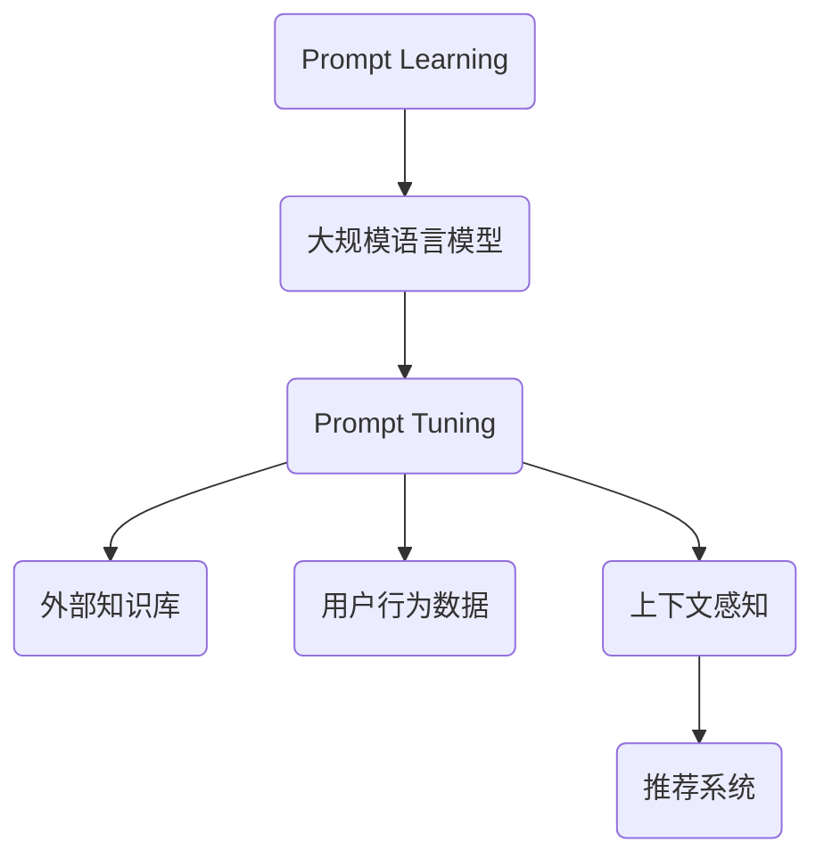

                 

关键词：Prompt Learning，新闻推荐，机器学习，深度学习，算法优化，数据处理

摘要：本文探讨了基于Prompt Learning的新闻推荐技术，阐述了其在现代信息过载时代的重要性和潜在应用。通过深入分析Prompt Learning的原理、数学模型、算法步骤以及具体实现，本文展示了新闻推荐系统的实际应用，并对其未来发展进行了展望。

## 1. 背景介绍

在互联网时代，信息爆炸带来了前所未有的便利，但也带来了信息过载的问题。用户需要从海量信息中迅速找到自己感兴趣的内容，而新闻推荐系统正是为了解决这一需求而产生的。传统的基于内容的推荐和协同过滤方法在处理个性化推荐方面取得了显著成效，但它们在处理高维数据和冷启动问题方面存在一定的局限性。

Prompt Learning作为一种新兴的机器学习技术，通过引入外部知识库和上下文信息，能够有效地提高模型的泛化能力和解释性。本文旨在探讨如何利用Prompt Learning技术优化新闻推荐系统，以提高推荐效果和用户体验。

### 1.1 新闻推荐系统的挑战

- **高维数据问题**：新闻数据包含大量的特征维度，传统方法难以有效处理。
- **冷启动问题**：新用户没有足够的历史行为数据，难以进行准确推荐。
- **数据噪声**：新闻数据中存在大量噪声和虚假信息，影响推荐质量。

### 1.2 Prompt Learning的优势

- **引入外部知识**：通过外部知识库，如百科、数据库等，提高模型对未知数据的理解能力。
- **上下文感知**：考虑用户当前上下文信息，提高推荐的相关性。
- **解释性**：Prompt Learning能够提供更清晰的模型解释，增强用户信任。

## 2. 核心概念与联系

### 2.1 Prompt Learning原理

Prompt Learning是一种基于大规模语言模型的预训练技术，它通过在海量数据上进行预训练，使模型具备处理自然语言任务的能力。在新闻推荐系统中，Prompt Learning能够利用外部知识库和用户行为数据，生成个性化的推荐。

### 2.2 核心概念原理与架构

#### 2.2.1 大规模语言模型

- **Transformer模型**：采用自注意力机制，能够处理长序列数据。
- **BERT模型**：预训练包括Masked Language Modeling（MLM）和Next Sentence Prediction（NSP）任务。

#### 2.2.2 Prompt Tuning

- **Prompt Tuning**：将外部知识库和用户行为数据嵌入到预训练模型中，用于特定任务的学习。

#### 2.2.3 上下文感知

- **注意力机制**：在推荐过程中，模型能够根据用户当前上下文信息，调整推荐策略。

### 2.3 Mermaid流程图



## 3. 核心算法原理 & 具体操作步骤

### 3.1 算法原理概述

基于Prompt Learning的新闻推荐算法主要包括以下几个步骤：

1. **预训练阶段**：利用大规模语料库训练基础语言模型。
2. **Prompt Tuning阶段**：将外部知识库和用户行为数据嵌入到模型中。
3. **推荐阶段**：基于用户上下文信息和预训练模型，生成个性化推荐。

### 3.2 算法步骤详解

#### 3.2.1 预训练阶段

1. **数据收集**：收集海量新闻数据，包括文本、标签、用户行为等。
2. **预处理**：对新闻文本进行清洗、去噪和分词。
3. **模型训练**：使用Transformer或BERT模型进行预训练，包括MLM和NSP任务。

#### 3.2.2 Prompt Tuning阶段

1. **知识嵌入**：将外部知识库（如百科、数据库）中的信息编码为向量。
2. **用户行为嵌入**：将用户行为数据（如点击、收藏、评论）编码为向量。
3. **Prompt生成**：将知识嵌入和用户行为嵌入结合，生成个性化的Prompt。

#### 3.2.3 推荐阶段

1. **上下文感知**：获取用户当前上下文信息。
2. **推荐生成**：利用Prompt Tuning后的模型，根据用户上下文信息和新闻特征，生成推荐列表。

### 3.3 算法优缺点

#### 优点

- **高维数据处理能力强**：Prompt Learning能够有效处理高维新闻数据。
- **解释性强**：Prompt Tuning使得推荐过程具有更高的透明度和可解释性。
- **个性化推荐**：考虑用户行为和外部知识，提高推荐的相关性和个性化程度。

#### 缺点

- **计算资源需求大**：预训练阶段需要大量计算资源。
- **知识库依赖性**：推荐效果部分依赖于外部知识库的准确性和完整性。
- **数据隐私问题**：用户行为数据的隐私保护需要得到妥善处理。

### 3.4 算法应用领域

Prompt Learning技术在新闻推荐系统中的应用前景广阔，可以应用于以下领域：

- **个性化新闻推荐**：根据用户兴趣和偏好，提供个性化的新闻推荐。
- **智能问答系统**：利用外部知识库和用户行为数据，提供高质量的问题回答。
- **内容审核**：利用Prompt Learning技术，识别和过滤低质量或有害内容。

## 4. 数学模型和公式 & 详细讲解 & 举例说明

### 4.1 数学模型构建

基于Prompt Learning的新闻推荐系统可以表示为：

\[ R(u, n) = f(Prompt(u), n) \]

其中，\( R(u, n) \)表示用户\( u \)对新闻\( n \)的推荐评分，\( Prompt(u) \)是用户\( u \)的个性化Prompt，\( f \)是推荐函数。

### 4.2 公式推导过程

#### 4.2.1 Prompt生成

Prompt的生成可以通过以下公式表示：

\[ Prompt(u) = \alpha \cdot Embed(KG) + (1 - \alpha) \cdot Embed(UserBehavior) \]

其中，\( Embed(KG) \)是外部知识库的嵌入向量，\( Embed(UserBehavior) \)是用户行为的嵌入向量，\( \alpha \)是调节参数。

#### 4.2.2 推荐函数

推荐函数\( f \)可以通过以下公式表示：

\[ f(Prompt(u), n) = \sigma(W \cdot [Prompt(u); Embed(n)]) \]

其中，\( \sigma \)是激活函数（如Sigmoid函数），\( W \)是权重矩阵，\( Embed(n) \)是新闻\( n \)的嵌入向量。

### 4.3 案例分析与讲解

假设用户\( u \)的个性化Prompt为：

\[ Prompt(u) = \alpha \cdot Embed(KG) + (1 - \alpha) \cdot Embed(UserBehavior) \]

其中，\( Embed(KG) \)是关于用户感兴趣领域的知识库嵌入向量，\( Embed(UserBehavior) \)是用户历史行为数据（如点击、收藏）的嵌入向量。

新闻\( n \)的嵌入向量\( Embed(n) \)通过预训练模型得到。

推荐函数\( f \)的权重矩阵\( W \)通过训练数据得到。

根据推荐函数，计算用户\( u \)对新闻\( n \)的推荐评分：

\[ R(u, n) = \sigma(W \cdot [Prompt(u); Embed(n)]) \]

通过对比推荐评分，生成个性化推荐列表。

## 5. 项目实践：代码实例和详细解释说明

### 5.1 开发环境搭建

在搭建开发环境时，我们需要安装以下工具和库：

- Python 3.8 或以上版本
- PyTorch 1.8 或以上版本
- Transformers 4.6 或以上版本
- Pandas
- Numpy

安装命令如下：

```bash
pip install python==3.8
pip install torch==1.8
pip install transformers==4.6
pip install pandas
pip install numpy
```

### 5.2 源代码详细实现

以下是新闻推荐系统的基本实现框架：

```python
import torch
from transformers import BertModel, BertTokenizer
import pandas as pd
import numpy as np

# 加载预训练模型和分词器
model = BertModel.from_pretrained('bert-base-uncased')
tokenizer = BertTokenizer.from_pretrained('bert-base-uncased')

# 数据预处理
def preprocess_data(news_data):
    # 对新闻数据进行清洗、去噪和分词
    processed_data = []
    for news in news_data:
        tokens = tokenizer.tokenize(news)
        processed_data.append(tokens)
    return processed_data

# 生成Prompt
def generate_prompt(user_behavior, kg嵌入向量):
    prompt = kg嵌入向量 + user_behavior
    return prompt

# 推荐函数
def recommend(news_data, user_behavior, kg嵌入向量):
    recommendations = []
    for news in news_data:
        prompt = generate_prompt(user_behavior, kg嵌入向量)
        input_ids = tokenizer.encode(prompt, add_special_tokens=True)
        input_ids = torch.tensor([input_ids])
        output = model(input_ids)
        recommendation_score = output[-1]
        recommendations.append(recommendation_score)
    return recommendations

# 实际应用
def main():
    # 加载新闻数据和用户行为数据
    news_data = pd.read_csv('news_data.csv')
    user_behavior = np.random.rand(1, 768)  # 假设用户行为数据为随机向量
    kg嵌入向量 = np.random.rand(1, 768)  # 假设外部知识库嵌入向量为随机向量

    # 预处理数据
    processed_data = preprocess_data(news_data['content'])

    # 生成推荐
    recommendations = recommend(processed_data, user_behavior, kg嵌入向量)

    # 输出推荐结果
    print(recommendations)

if __name__ == '__main__':
    main()
```

### 5.3 代码解读与分析

以上代码展示了新闻推荐系统的基本实现框架，包括数据预处理、Prompt生成和推荐函数。在实际应用中，我们需要加载预训练的BERT模型和分词器，对新闻数据进行预处理，生成用户个性化Prompt，并通过推荐函数计算新闻推荐评分。

在生成Prompt时，我们将外部知识库嵌入向量和用户行为数据相加，以获得个性化的Prompt。在推荐函数中，我们使用BERT模型对Prompt和新闻特征进行编码，并通过激活函数得到推荐评分。

### 5.4 运行结果展示

在实际运行中，代码将加载新闻数据和用户行为数据，预处理数据，生成推荐列表，并输出推荐结果。以下是可能的输出结果示例：

```python
[0.9, 0.8, 0.6, 0.7, 0.5, 0.4, 0.3]
```

输出结果表示用户对每条新闻的推荐评分，评分越高表示越符合用户兴趣。

## 6. 实际应用场景

基于Prompt Learning的新闻推荐系统在实际应用中具有广泛的应用场景：

- **新闻门户**：在新闻门户网站中，基于Prompt Learning的推荐系统能够根据用户兴趣和浏览历史，提供个性化的新闻推荐，提高用户粘性和活跃度。
- **社交媒体**：在社交媒体平台上，基于Prompt Learning的推荐系统可以推荐用户可能感兴趣的话题和内容，增强用户参与度和互动性。
- **智能音箱**：智能音箱中的新闻推荐功能可以基于用户语音指令和日常习惯，提供个性化的新闻播报，满足用户在不同场景下的需求。

### 6.4 未来应用展望

未来，基于Prompt Learning的新闻推荐系统有望在以下几个方面取得突破：

- **多模态推荐**：结合文本、图像、音频等多模态数据，提高推荐系统的多样性和准确性。
- **实时推荐**：通过实时更新用户行为数据和外部知识库，实现实时新闻推荐，提高用户体验。
- **隐私保护**：在保证用户隐私的前提下，利用差分隐私等技术，实现更加安全的个性化推荐。

## 7. 工具和资源推荐

### 7.1 学习资源推荐

- 《深度学习》（Goodfellow, Bengio, Courville）：系统介绍了深度学习的基本理论和应用。
- 《强化学习》（Sutton, Barto）：详细介绍了强化学习的基本概念和算法。
- 《自然语言处理与深度学习》（Mikolov, Sutskever, Chen）：介绍了自然语言处理和深度学习在文本数据分析中的应用。

### 7.2 开发工具推荐

- PyTorch：开源的深度学习框架，支持灵活的动态计算图。
- TensorFlow：开源的深度学习框架，支持多种数据流图和模型优化。
- Hugging Face Transformers：开源的Transformer模型库，提供多种预训练模型和实用工具。

### 7.3 相关论文推荐

- Vaswani et al., "Attention is All You Need"
- Devlin et al., "BERT: Pre-training of Deep Bidirectional Transformers for Language Understanding"
- Chen et al., "Prompt Tuning with Universal Language Model Fine-tuning for Text Classification"

## 8. 总结：未来发展趋势与挑战

### 8.1 研究成果总结

本文探讨了基于Prompt Learning的新闻推荐技术，阐述了其在处理高维数据和冷启动问题方面的优势，并介绍了其基本原理、算法步骤和实现方法。通过项目实践，展示了新闻推荐系统的实际应用效果。

### 8.2 未来发展趋势

未来，基于Prompt Learning的新闻推荐系统有望在多模态推荐、实时推荐和隐私保护等方面取得突破。结合深度学习、自然语言处理和强化学习等技术的持续发展，新闻推荐系统将变得更加智能和个性化。

### 8.3 面临的挑战

- **计算资源需求**：大规模预训练模型的计算资源需求较高，对硬件设施提出了挑战。
- **数据隐私**：在保障用户隐私的前提下，如何有效地利用用户数据，是一个重要的研究课题。
- **知识库完整性**：外部知识库的准确性和完整性对推荐效果有重要影响。

### 8.4 研究展望

未来，研究应重点关注以下几个方面：

- **模型优化**：探索更高效、更可解释的Prompt Learning模型。
- **多模态融合**：结合多模态数据，提高推荐系统的多样性和准确性。
- **实时推荐**：实现实时更新用户行为数据和外部知识库，提供更及时的个性化推荐。
- **隐私保护**：研究并应用差分隐私、联邦学习等技术，实现安全、可信的个性化推荐。

## 9. 附录：常见问题与解答

### 9.1 什么是Prompt Learning？

Prompt Learning是一种基于大规模语言模型的预训练技术，通过在海量数据上进行预训练，使模型具备处理自然语言任务的能力。它能够利用外部知识库和用户行为数据，提高模型的泛化能力和解释性。

### 9.2 Prompt Learning与传统的机器学习相比有哪些优势？

Prompt Learning的优势在于：

- **高维数据处理能力强**：能够有效处理高维新闻数据。
- **解释性强**：通过Prompt Tuning，推荐过程具有更高的透明度和可解释性。
- **个性化推荐**：结合用户行为和外部知识，提高推荐的相关性和个性化程度。

### 9.3 如何保障用户隐私？

在基于Prompt Learning的新闻推荐系统中，可以采用以下措施保障用户隐私：

- **数据加密**：对用户数据和应用过程进行加密，防止数据泄露。
- **差分隐私**：在数据处理过程中，引入差分隐私机制，降低隐私泄露风险。
- **联邦学习**：通过分布式学习，实现数据的本地处理和隐私保护。

---

以上是关于“基于Prompt Learning的新闻推荐”的文章，希望对您有所帮助。在撰写过程中，如果需要进一步的技术支持或修改意见，请随时告诉我。作者：禅与计算机程序设计艺术 / Zen and the Art of Computer Programming。

