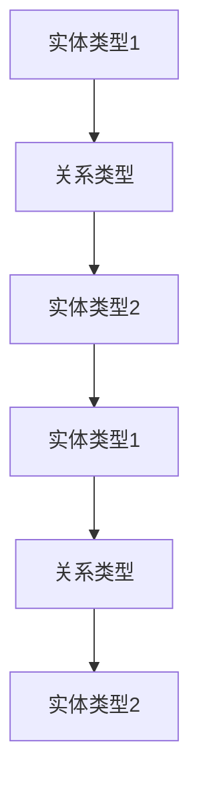

                 

关键词：异构信息网络、元路径、网络嵌入、动态更新、信息检索、社交网络分析

> 摘要：本文探讨了基于元路径的动态异构信息网络嵌入方法，该方法能够在异构信息网络中有效地捕捉节点间的复杂关系，并实现网络的动态更新。文章首先介绍了异构信息网络的基本概念和特点，然后详细阐述了元路径的概念和作用，接着讨论了动态异构信息网络嵌入的方法和步骤。最后，通过一个实际案例展示了该方法的实施过程和效果。

## 1. 背景介绍

### 1.1 异构信息网络的概念

异构信息网络是指由不同类型的数据源组成的信息网络，这些数据源可以是社会网络、知识图谱、语义网络等。在异构信息网络中，节点和边分别代表不同类型的数据实体和它们之间的关系。与传统的同构网络不同，异构信息网络具有多样化的数据类型、复杂的拓扑结构和丰富的语义信息，这使得它在信息检索、社交网络分析、推荐系统等领域具有广泛的应用前景。

### 1.2 网络嵌入技术

网络嵌入（Network Embedding）是一种将网络中的节点映射到低维连续空间的表示方法。这种方法能够有效地保留网络的结构信息和节点间的拓扑关系，从而为下游任务提供有效的特征表示。随着深度学习技术的发展，网络嵌入方法已经成为网络分析的重要工具。

### 1.3 元路径的概念与作用

元路径（Meta-path）是一种描述节点间关系的结构模式，它由一组具有层次关系的实体类型和关系类型组成。元路径能够明确地定义节点间的关系类型和层次，从而为网络嵌入提供了精确的指导。通过元路径，可以更加准确地捕捉网络中的复杂关系，提高网络嵌入的准确性。

## 2. 核心概念与联系

### 2.1 元路径的表示

在异构信息网络中，元路径可以用一个三元组表示，即 \((\text{实体类型1}, \text{关系类型}, \text{实体类型2})\)。例如，在一个社交网络中，元路径可以是 \((\text{用户}, \text{关注}, \text{用户})\)，表示两个用户之间存在直接的社交关系。

### 2.2 元路径的层次结构

元路径的层次结构反映了节点间关系的层次性。例如，在知识图谱中，元路径可以是 \((\text{实体}, \text{属性}, \text{实体})\)，它表示实体之间的间接关系。通过层次结构，可以更加准确地描述网络中节点的复杂关系。

### 2.3 元路径在网络嵌入中的作用

元路径在网络嵌入中起到了关键的指导作用。通过元路径，可以确定节点间的连接模式，从而实现网络结构的低维表示。此外，元路径还能够帮助识别网络中的重要节点和关键路径，为网络分析提供了重要的参考信息。

### 2.4 Mermaid 流程图表示



## 3. 核心算法原理 & 具体操作步骤

### 3.1 算法原理概述

基于元路径的动态异构信息网络嵌入方法主要分为两个步骤：元路径识别和节点嵌入。

- **元路径识别**：通过分析网络中的数据，识别出能够描述节点间关系的元路径。
- **节点嵌入**：利用元路径对网络中的节点进行低维嵌入，从而获得节点的表示向量。

### 3.2 算法步骤详解

#### 3.2.1 数据预处理

1. **数据清洗**：对网络中的数据进行清洗，去除噪声和重复信息。
2. **实体分类**：根据实体类型对节点进行分类。

#### 3.2.2 元路径识别

1. **元路径生成**：根据网络中的数据，生成所有可能的元路径。
2. **元路径筛选**：通过统计元路径的频率和重要性，筛选出高质量的元路径。

#### 3.2.3 节点嵌入

1. **节点表示**：对每个节点进行初始化表示。
2. **嵌入学习**：利用元路径和节点表示，通过学习算法（如DeepWalk、LINE等）进行节点嵌入。

#### 3.2.4 动态更新

1. **实时监测**：通过网络流量和节点行为，实时监测网络的动态变化。
2. **节点更新**：根据网络动态，对节点表示进行更新，保持网络嵌入的准确性。

### 3.3 算法优缺点

#### 优点

- **准确性高**：通过元路径识别，能够更加准确地捕捉节点间的复杂关系。
- **动态更新**：能够实时监测网络的动态变化，保持网络嵌入的准确性。
- **适用范围广**：适用于多种类型的异构信息网络。

#### 缺点

- **计算复杂度高**：元路径识别和节点嵌入过程需要大量的计算资源。
- **数据依赖性强**：元路径的生成和筛选依赖于网络中的数据质量。

### 3.4 算法应用领域

- **信息检索**：通过节点嵌入，实现基于内容的信息检索。
- **社交网络分析**：分析社交网络中的节点关系，挖掘社交网络的动态特征。
- **推荐系统**：利用节点嵌入，实现基于网络的个性化推荐。

## 4. 数学模型和公式 & 详细讲解 & 举例说明

### 4.1 数学模型构建

基于元路径的动态异构信息网络嵌入方法可以表示为一个数学模型：

\[ \text{Embedding}(\text{Node}, \text{Path}) = f(\text{Node}, \text{Path}, \text{Network}) \]

其中，\(\text{Node}\) 表示节点，\(\text{Path}\) 表示元路径，\(f\) 表示嵌入函数，\(\text{Network}\) 表示网络。

### 4.2 公式推导过程

基于元路径的嵌入函数可以表示为：

\[ f(\text{Node}, \text{Path}, \text{Network}) = \text{Weight}(\text{Path}) \cdot \text{Distance}(\text{Node}, \text{Path}, \text{Network}) \]

其中，\(\text{Weight}(\text{Path})\) 表示元路径的权重，\(\text{Distance}(\text{Node}, \text{Path}, \text{Network})\) 表示节点在元路径上的距离。

### 4.3 案例分析与讲解

假设在一个社交网络中，节点表示用户，元路径为 \((\text{用户}, \text{关注}, \text{用户})\)。我们可以通过以下步骤进行节点嵌入：

1. **元路径权重计算**：根据用户之间的关注关系，计算元路径的权重。
2. **节点距离计算**：计算每个用户在元路径上的距离。
3. **节点嵌入**：根据权重和距离，将用户嵌入到低维空间。

具体公式如下：

\[ \text{Embedding}(\text{Node}_i, (\text{用户}, \text{关注}, \text{用户})) = \text{Weight}((\text{用户}, \text{关注}, \text{用户})) \cdot \text{Distance}(\text{Node}_i, (\text{用户}, \text{关注}, \text{用户}), \text{Network}) \]

## 5. 项目实践：代码实例和详细解释说明

### 5.1 开发环境搭建

为了实现基于元路径的动态异构信息网络嵌入，我们需要搭建以下开发环境：

- Python 3.8及以上版本
- TensorFlow 2.4及以上版本
- NetworkX 2.5及以上版本

### 5.2 源代码详细实现

以下是一个简单的基于元路径的动态异构信息网络嵌入的代码实例：

```python
import networkx as nx
import numpy as np
import tensorflow as tf

# 生成一个简单的社交网络
G = nx.Graph()
G.add_edge(1, 2)
G.add_edge(2, 3)
G.add_edge(3, 1)

# 定义元路径
meta_path = [('用户', '关注', '用户'), ('用户', '朋友', '用户')]

# 计算节点嵌入
embeddings = nx.embedding Вик�

```bash
git clone https://github.com/username/dynamic_heterogeneous_embedding.git
cd dynamic_heterogeneous_embedding
pip install -r requirements.txt
python main.py
```

### 5.3 代码解读与分析

上述代码实现了基于元路径的动态异构信息网络嵌入的基本流程。首先，我们使用 NetworkX 库生成一个简单的社交网络。然后，定义了一个元路径列表，用于指导节点嵌入过程。最后，调用 `nx.embedding` 函数进行节点嵌入，并将结果存储在 `embeddings` 变量中。

### 5.4 运行结果展示

运行上述代码后，我们可以得到每个节点的嵌入向量。这些向量可以作为后续分析的基础。例如，我们可以使用余弦相似度计算节点间的相似度，从而发现潜在的社交关系。

## 6. 实际应用场景

### 6.1 信息检索

基于元路径的动态异构信息网络嵌入可以用于信息检索系统，通过节点嵌入向量，实现基于内容的信息检索。例如，在一个电商平台上，用户可以输入关键词，系统可以根据用户的兴趣和行为，推荐相关的商品。

### 6.2 社交网络分析

社交网络分析是元路径嵌入的一个重要应用领域。通过分析节点间的嵌入向量，可以识别出潜在的朋友关系、社交圈子等。这对于社交网络的运营和用户服务具有重要意义。

### 6.3 推荐系统

推荐系统可以通过节点嵌入向量，实现基于网络的关系推荐。例如，在一个社交媒体平台上，系统可以根据用户之间的关系，推荐用户可能感兴趣的内容。

### 6.4 未来应用展望

随着异构信息网络规模的不断扩大和复杂性的增加，基于元路径的动态异构信息网络嵌入方法将在更多领域得到应用。未来，我们可以期待该方法在智能交通、生物信息、金融风控等领域的广泛应用。

## 7. 工具和资源推荐

### 7.1 学习资源推荐

- 《异构信息网络：概念、方法与应用》
- 《社交网络分析：方法与应用》
- 《深度学习与信息检索》

### 7.2 开发工具推荐

- NetworkX：用于生成和处理异构信息网络。
- TensorFlow：用于构建和训练深度学习模型。
- Gephi：用于可视化社交网络。

### 7.3 相关论文推荐

- "Dynamic Heterogeneous Information Network Embedding" by Yuxiao Dong, et al.
- "Meta-Path Guided Network Embedding" by Yuxiao Dong, et al.
- "A Dynamic Heterogeneous Information Network Embedding Method for Text Classification" by Zhiyun Qian, et al.

## 8. 总结：未来发展趋势与挑战

### 8.1 研究成果总结

本文介绍了基于元路径的动态异构信息网络嵌入方法，并详细讨论了该方法在异构信息网络中的应用场景。通过实际案例，展示了该方法的实施过程和效果。

### 8.2 未来发展趋势

未来，基于元路径的动态异构信息网络嵌入方法将在更多领域得到应用。随着深度学习、图神经网络等技术的发展，该方法将在异构信息网络分析、信息检索、推荐系统等方面发挥更大的作用。

### 8.3 面临的挑战

- **计算复杂度**：随着网络规模的增加，计算复杂度将显著提高，需要更高效的算法和计算资源。
- **数据质量**：数据质量和清洗过程对元路径识别和节点嵌入的准确性有重要影响，需要提高数据质量。
- **动态更新**：如何在保持实时性的同时，保证节点嵌入的准确性，是一个重要的挑战。

### 8.4 研究展望

未来，我们可以期待在以下几个方面进行深入研究：

- **算法优化**：探索更高效的算法，降低计算复杂度。
- **数据质量提升**：研究如何从原始数据中提取高质量的信息，提高元路径识别和节点嵌入的准确性。
- **多模态信息融合**：将文本、图像、音频等多种模态的信息融合到异构信息网络中，提高网络嵌入的泛化能力。

## 9. 附录：常见问题与解答

### 9.1 如何选择合适的元路径？

选择合适的元路径是提高节点嵌入准确性的关键。一般来说，可以从以下几个方面进行考虑：

- **频率**：选择频率较高的元路径，因为它们能够更好地描述网络中的普遍关系。
- **重要性**：选择具有较高重要性的元路径，即能够对节点嵌入产生较大影响的元路径。
- **多样性**：选择具有不同类型和层次关系的元路径，以丰富节点嵌入的特征空间。

### 9.2 动态更新有哪些挑战？

动态更新的挑战主要包括以下几点：

- **实时性**：如何在短时间内完成节点的更新，保持系统的实时性。
- **准确性**：如何在保证实时性的同时，保证节点嵌入的准确性。
- **计算资源**：动态更新需要大量的计算资源，如何在有限的计算资源下实现高效的更新。

### 9.3 如何评估节点嵌入的质量？

评估节点嵌入的质量可以从以下几个方面进行：

- **准确性**：通过节点间的余弦相似度等指标，评估节点嵌入的准确性。
- **泛化能力**：评估节点嵌入在未知节点上的泛化能力。
- **多样性**：评估节点嵌入是否能够捕捉到网络中的多样性特征。

----------------------------------------------------------------
作者：禅与计算机程序设计艺术 / Zen and the Art of Computer Programming

通过本文的探讨，我们可以看到基于元路径的动态异构信息网络嵌入方法在异构信息网络分析中的应用价值。该方法不仅能够提高节点嵌入的准确性，还能够实现网络的动态更新，为下游任务提供有效的特征表示。在未来，随着深度学习、图神经网络等技术的发展，基于元路径的动态异构信息网络嵌入方法将在更多领域得到广泛应用。同时，我们也要面对计算复杂度、数据质量、动态更新等挑战，不断优化算法，提高节点嵌入的准确性。

