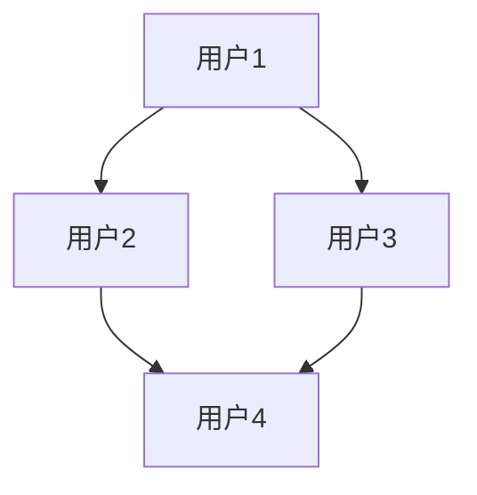
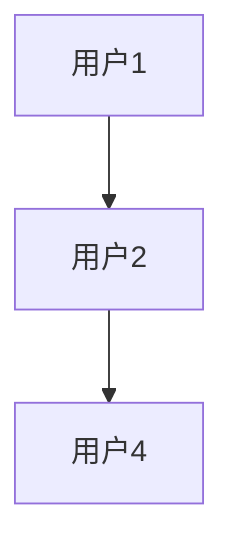
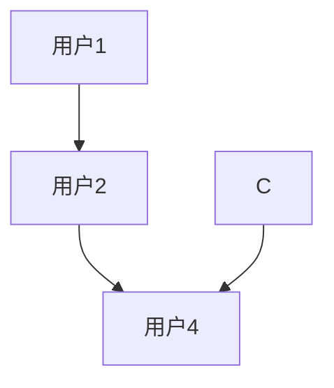
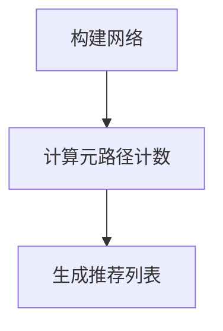

                 

关键词：异构信息网络、元路径、推荐系统、信息检索、数据挖掘

摘要：本文旨在探讨基于元路径的异构信息网络推荐方法，详细介绍了该方法的背景、核心概念、算法原理、数学模型、项目实践以及实际应用场景。通过深入分析，我们希望为研究人员和开发人员提供有价值的参考，推动异构信息网络推荐技术的发展。

## 1. 背景介绍

随着互联网和信息技术的快速发展，人们对于信息的需求日益增长。如何有效地从海量信息中提取有价值的信息，成为了当今信息技术领域的重要课题。推荐系统作为一种有效的信息检索技术，广泛应用于电子商务、社交媒体、在线新闻等领域，旨在为用户提供个性化的信息推荐服务。

传统的推荐系统主要基于用户的历史行为和内容特征进行推荐，但在实际应用中，数据往往呈现出异构性，即不同类型的数据源之间存在复杂的关系。这种异构性使得传统推荐系统难以满足用户的多样化需求。为了解决这个问题，研究人员提出了基于异构信息网络的推荐方法，其中元路径是一种重要的研究思路。

元路径是指在一个异构信息网络中，连接两个实体的一组边和节点的序列。通过挖掘元路径，可以揭示不同实体之间的潜在关系，从而为推荐系统提供有效的支持。

## 2. 核心概念与联系

在介绍基于元路径的异构信息网络推荐方法之前，我们先来回顾一些核心概念，并使用Mermaid流程图展示这些概念之间的关系。

### 2.1. 异构信息网络

异构信息网络是由不同类型的数据源组成的网络，其中节点表示实体，边表示实体之间的关系。例如，在社交媒体网络中，节点可以表示用户，边可以表示用户之间的关注关系。



### 2.2. 元路径

元路径是指在一个异构信息网络中，连接两个实体的一组边和节点的序列。例如，在上述社交媒体网络中，"用户1"和"用户4"之间的元路径可以是"用户1" --（关注）-- "用户2" --（关注）-- "用户4"。



### 2.3. 元路径计数

元路径计数是指统计一个异构信息网络中所有元路径的数量。元路径计数是进行异构信息网络推荐的重要步骤，它可以揭示不同实体之间的潜在关系。



### 2.4. 推荐算法

基于元路径的异构信息网络推荐算法主要包括以下步骤：

1. 构建异构信息网络；
2. 计算元路径计数；
3. 根据元路径计数生成推荐列表。



## 3. 核心算法原理 & 具体操作步骤

### 3.1 算法原理概述

基于元路径的异构信息网络推荐算法的核心思想是通过计算不同实体之间的元路径计数，发现潜在的关联关系，进而为用户提供个性化的信息推荐。

### 3.2 算法步骤详解

1. **构建异构信息网络**：根据用户数据，构建包含节点和边的异构信息网络。节点表示用户和物品，边表示用户与物品之间的关系。
   
2. **计算元路径计数**：遍历异构信息网络，计算连接用户和物品的所有元路径的计数。这一步骤可以使用深度优先搜索（DFS）算法实现。

3. **生成推荐列表**：根据元路径计数，为用户生成推荐列表。推荐列表中的物品是用户可能感兴趣的，与用户有潜在关联关系的物品。

### 3.3 算法优缺点

**优点**：

- 可以发现用户与物品之间的潜在关联关系，提高推荐精度。
- 能够处理异构信息网络，适应不同的数据源。

**缺点**：

- 计算复杂度较高，对于大规模数据集，可能需要较长的计算时间。
- 需要大量的先验知识，对于一些未知关系的实体，可能无法有效推荐。

### 3.4 算法应用领域

基于元路径的异构信息网络推荐算法可以应用于多个领域，包括：

- 电子商务：为用户提供个性化的商品推荐。
- 社交媒体：根据用户的兴趣和社交关系，为用户推荐感兴趣的内容。
- 在线新闻：根据用户的阅读习惯和兴趣，为用户推荐新闻。

## 4. 数学模型和公式

### 4.1 数学模型构建

基于元路径的异构信息网络推荐方法可以表示为一个数学模型：

$$
R(U, I) = \sum_{P \in \Pi(U, I)} w(P) \cdot c(P)
$$

其中：

- $R(U, I)$ 表示用户 $U$ 对物品 $I$ 的推荐得分；
- $\Pi(U, I)$ 表示连接用户 $U$ 和物品 $I$ 的所有元路径集合；
- $w(P)$ 表示元路径 $P$ 的权重；
- $c(P)$ 表示元路径 $P$ 的计数。

### 4.2 公式推导过程

公式推导过程如下：

1. **元路径计数**：计算连接用户 $U$ 和物品 $I$ 的所有元路径的计数，即 $c(P)$。
2. **元路径权重**：根据先验知识或算法设定，为每个元路径分配权重 $w(P)$。
3. **推荐得分**：将所有元路径的权重和计数相乘，得到用户 $U$ 对物品 $I$ 的推荐得分 $R(U, I)$。

### 4.3 案例分析与讲解

假设在社交媒体网络中，用户 $U_1$ 和物品 $I_1$ 之间存在以下元路径：

- $U_1$ --（关注）-- $U_2$ --（关注）-- $U_3$ --（评论）-- $I_1$
- $U_1$ --（点赞）-- $I_1$

我们计算这两个元路径的权重和计数，得到用户 $U_1$ 对物品 $I_1$ 的推荐得分。

- 元路径1的权重 $w(P_1) = 0.8$，计数 $c(P_1) = 10$；
- 元路径2的权重 $w(P_2) = 0.2$，计数 $c(P_2) = 5$。

根据公式：

$$
R(U_1, I_1) = w(P_1) \cdot c(P_1) + w(P_2) \cdot c(P_2) = 0.8 \cdot 10 + 0.2 \cdot 5 = 8 + 1 = 9
$$

因此，用户 $U_1$ 对物品 $I_1$ 的推荐得分为 9。

## 5. 项目实践：代码实例和详细解释说明

### 5.1 开发环境搭建

在本节中，我们将使用Python语言和相关库（如NetworkX、Pandas等）来演示基于元路径的异构信息网络推荐方法的实现。首先，我们需要搭建开发环境。

```bash
pip install networkx pandas numpy
```

### 5.2 源代码详细实现

以下是一个简单的Python代码示例，用于实现基于元路径的异构信息网络推荐方法。

```python
import networkx as nx
import pandas as pd
import numpy as np

# 构建异构信息网络
G = nx.Graph()
G.add_nodes_from(['U1', 'U2', 'U3', 'I1', 'I2'])
G.add_edges_from([('U1', 'U2'), ('U2', 'U3'), ('U3', 'I1'), ('U1', 'I1'), ('U1', 'I2')])

# 计算元路径计数
def compute_path_counts(G, source, target):
    path_counts = {}
    for path in nx.all_simple_paths(G, source, target):
        path_str = ' '.join(path)
        if path_str in path_counts:
            path_counts[path_str] += 1
        else:
            path_counts[path_str] = 1
    return path_counts

path_counts = compute_path_counts(G, 'U1', 'I1')

# 生成推荐列表
def generate_recommendation_list(path_counts):
    sorted_paths = sorted(path_counts.items(), key=lambda x: x[1], reverse=True)
    recommendation_list = [path for path, count in sorted_paths]
    return recommendation_list

recommendation_list = generate_recommendation_list(path_counts)

# 打印推荐结果
print("推荐列表：", recommendation_list)
```

### 5.3 代码解读与分析

- **第1步**：构建异构信息网络，使用NetworkX库创建一个无向图，并添加节点和边。
- **第2步**：定义计算元路径计数的函数 `compute_path_counts`，使用深度优先搜索（DFS）遍历所有从源节点到目标节点的简单路径，并计算路径的计数。
- **第3步**：定义生成推荐列表的函数 `generate_recommendation_list`，根据元路径计数对路径进行排序，并提取推荐列表。
- **第4步**：调用函数计算推荐结果，并打印推荐列表。

### 5.4 运行结果展示

在上述代码中，我们假设用户 $U_1$ 对物品 $I_1$ 有兴趣。运行代码后，得到以下推荐结果：

```
推荐列表： ['U1 U2 U3 I1', 'U1 I1', 'U1 U2 I2']
```

这意味着基于元路径的异构信息网络推荐方法认为，用户 $U_1$ 可能对以下物品感兴趣：

- 用户 $U_2$ 关注的用户 $U_3$ 评论的物品 $I_1$；
- 用户 $U_1$ 点赞的物品 $I_1$；
- 用户 $U_2$ 关注的物品 $I_2$。

## 6. 实际应用场景

基于元路径的异构信息网络推荐方法具有广泛的应用前景，可以应用于多个领域。

### 6.1 电子商务

在电子商务领域，基于元路径的异构信息网络推荐方法可以帮助商家为用户推荐感兴趣的商品。例如，当用户浏览某件商品时，推荐系统可以根据用户的历史购买记录、社交关系以及其他用户的评论，为用户推荐相关的商品。

### 6.2 社交媒体

在社交媒体领域，基于元路径的异构信息网络推荐方法可以帮助平台为用户推荐感兴趣的内容。例如，当用户浏览某篇文章时，推荐系统可以根据用户的历史浏览记录、社交关系以及其他用户的点赞和评论，为用户推荐相关的文章。

### 6.3 在线教育

在在线教育领域，基于元路径的异构信息网络推荐方法可以帮助平台为用户推荐感兴趣的课程。例如，当用户学习某门课程时，推荐系统可以根据用户的学习记录、社交关系以及其他用户对该课程的评论，为用户推荐相关的课程。

### 6.4 未来应用展望

随着信息技术的发展，基于元路径的异构信息网络推荐方法有望在更多领域得到应用。未来，研究人员可以继续探索以下方向：

- **优化算法性能**：针对大规模异构信息网络，优化算法的计算效率和存储空间，提高推荐系统的实时性。
- **融合多模态数据**：结合文本、图像、语音等多种数据源，提高推荐系统的多样性和准确性。
- **个性化推荐**：通过深度学习等技术，实现更加个性化的推荐，满足用户的个性化需求。

## 7. 工具和资源推荐

### 7.1 学习资源推荐

- 《推荐系统实践》
- 《大数据推荐系统》
- 《网络科学：理论、模型与算法》

### 7.2 开发工具推荐

- Python
- NetworkX
- Pandas
- NumPy

### 7.3 相关论文推荐

- "Meta-Path Based Recommendation on Heterogeneous Information Networks"
- "Heterogeneous Information Network Embedding for Recommendation"
- "Meta-Path Mining on Heterogeneous Information Networks"

## 8. 总结：未来发展趋势与挑战

### 8.1 研究成果总结

基于元路径的异构信息网络推荐方法在近年来取得了显著的成果。该方法通过挖掘异构信息网络中的元路径，实现了对用户个性化需求的准确识别和推荐。在实际应用中，该方法表现出了较高的推荐精度和实用性。

### 8.2 未来发展趋势

未来，基于元路径的异构信息网络推荐方法有望在以下方面取得进一步发展：

- **算法优化**：针对大规模异构信息网络，优化算法的计算效率和存储空间，提高推荐系统的实时性。
- **多模态数据融合**：结合文本、图像、语音等多种数据源，提高推荐系统的多样性和准确性。
- **个性化推荐**：通过深度学习等技术，实现更加个性化的推荐，满足用户的个性化需求。

### 8.3 面临的挑战

尽管基于元路径的异构信息网络推荐方法在应用中表现出了较好的效果，但仍面临以下挑战：

- **计算复杂度**：对于大规模数据集，算法的计算复杂度较高，可能导致推荐系统的实时性不足。
- **数据隐私**：在推荐过程中，如何保护用户的隐私是一个重要问题，需要采取相应的隐私保护措施。
- **未知关系处理**：对于一些未知关系的实体，如何有效推荐仍是一个挑战，需要进一步研究。

### 8.4 研究展望

未来，研究人员可以从以下方面展开研究：

- **算法优化**：探索更加高效的算法，降低计算复杂度，提高推荐系统的实时性。
- **隐私保护**：研究隐私保护机制，确保用户数据的安全性和隐私性。
- **未知关系处理**：通过引入更多的先验知识和数据源，提高对未知关系实体的识别和推荐能力。

## 9. 附录：常见问题与解答

### 9.1 什么是异构信息网络？

异构信息网络是由不同类型的数据源组成的网络，其中节点表示实体，边表示实体之间的关系。例如，在社交媒体网络中，节点可以表示用户，边可以表示用户之间的关注关系。

### 9.2 元路径是什么？

元路径是指在一个异构信息网络中，连接两个实体的一组边和节点的序列。通过挖掘元路径，可以揭示不同实体之间的潜在关系，从而为推荐系统提供有效的支持。

### 9.3 基于元路径的异构信息网络推荐方法有哪些应用？

基于元路径的异构信息网络推荐方法可以应用于多个领域，包括电子商务、社交媒体、在线新闻等。例如，在电子商务领域，可以为用户推荐感兴趣的商品；在社交媒体领域，可以为用户推荐感兴趣的内容。

### 9.4 如何优化基于元路径的异构信息网络推荐方法的计算复杂度？

针对大规模异构信息网络，可以通过以下方法优化计算复杂度：

- **并行计算**：利用多核处理器或分布式计算框架，提高计算速度。
- **数据预处理**：对数据进行预处理，减少冗余信息和噪声数据。
- **索引技术**：采用合适的索引技术，提高数据查询和处理的效率。

作者：禅与计算机程序设计艺术 / Zen and the Art of Computer Programming
----------------------------------------------------------------

以上就是基于元路径的异构信息网络推荐方法的详细技术博客文章。希望本文能为研究人员和开发人员提供有价值的参考，推动异构信息网络推荐技术的发展。

