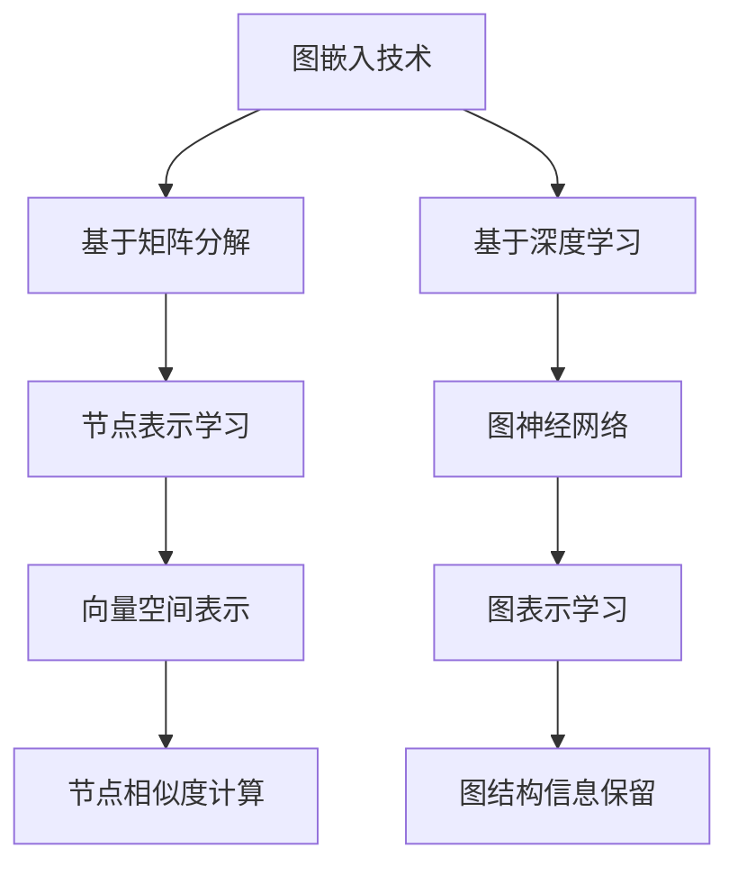
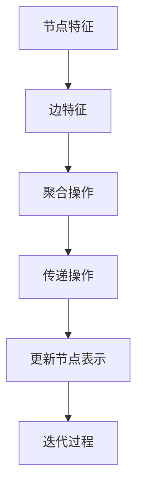
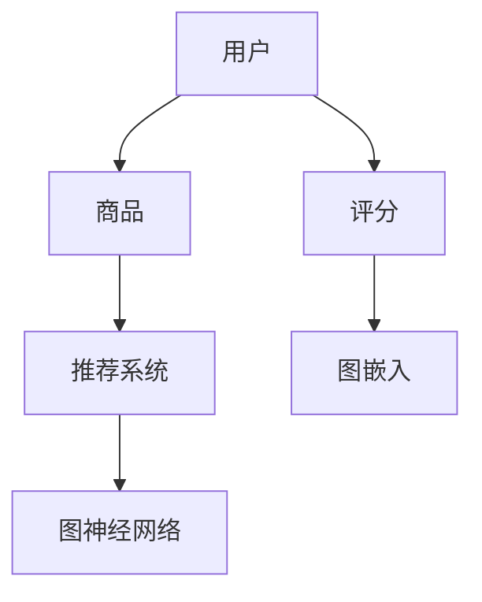

                 

关键词：图嵌入，大规模推荐系统，商品推荐，商品推荐系统，图神经网络，深度学习

摘要：本文将探讨如何利用图嵌入技术构建大规模商品推荐系统。首先介绍图嵌入的概念和原理，然后阐述其在商品推荐系统中的应用，最后通过一个实际案例展示如何实现一个高效的商品推荐系统。

## 1. 背景介绍

在当今的电子商务时代，推荐系统已经成为提升用户满意度和商家收益的重要工具。传统的推荐系统大多基于协同过滤或内容匹配，但这些方法存在诸如数据稀疏性、冷启动问题等局限性。随着图嵌入技术的发展，将图嵌入引入推荐系统成为了一种新的研究方向。

图嵌入是一种将图中的节点映射到低维向量空间的方法，它能够保持图中的结构和信息。通过图嵌入，我们可以将商品、用户以及用户之间的交互关系转化为向量表示，从而利用深度学习等技术进行推荐。

## 2. 核心概念与联系

### 2.1 图嵌入

图嵌入（Graph Embedding）是将图中的节点映射到低维向量空间的一种方法。它通过学习节点的表示，使得具有相似结构和关系的节点在向量空间中更接近。图嵌入技术可以分为两大类：基于矩阵分解的方法和基于深度学习的方法。

#### Mermaid 流程图：



### 2.2 图神经网络

图神经网络（Graph Neural Network，GNN）是一种专门用于处理图结构数据的神经网络。GNN通过将节点和边的特征信息进行聚合和传递，能够有效地捕捉图中的复杂结构和关系。

#### Mermaid 流程图：



### 2.3 商品推荐系统

商品推荐系统是一种基于用户历史行为或偏好，为用户提供个性化推荐的系统。在基于图嵌入的推荐系统中，商品、用户以及用户之间的交互关系可以被表示为图，从而利用图嵌入和图神经网络进行推荐。

#### Mermaid 流程图：



## 3. 核心算法原理 & 具体操作步骤

### 3.1 算法原理概述

基于图嵌入的商品推荐系统主要包括以下几个步骤：

1. **数据预处理**：将用户和商品信息转化为图结构，并构建图。
2. **图嵌入**：利用图嵌入技术将图中的节点映射到低维向量空间。
3. **图神经网络**：利用图神经网络对图中的节点进行特征聚合和传递，得到最终的推荐结果。

### 3.2 算法步骤详解

#### 3.2.1 数据预处理

首先，我们需要将用户和商品信息转化为图结构。用户和商品作为图的节点，用户之间的交互关系（如评分、评论等）作为图的边。

#### 3.2.2 图嵌入

接下来，我们利用图嵌入技术将图中的节点映射到低维向量空间。这里，我们使用了一种基于深度学习的图嵌入方法——图卷积网络（Graph Convolutional Network，GCN）。

#### 3.2.3 图神经网络

最后，我们利用图神经网络对图中的节点进行特征聚合和传递。具体来说，我们使用了一种基于GCN的推荐模型，将用户和商品的向量表示进行融合，得到最终的推荐结果。

## 3.3 算法优缺点

### 3.3.1 优点

1. **能够处理稀疏数据**：基于图嵌入的推荐系统可以有效地处理数据稀疏性问题。
2. **保留图结构信息**：通过图神经网络，系统能够保留图中的结构和关系信息。
3. **可扩展性强**：图嵌入和图神经网络技术具有较好的可扩展性，适用于不同规模和类型的推荐场景。

### 3.3.2 缺点

1. **计算复杂度高**：图嵌入和图神经网络模型的计算复杂度较高，需要大量的计算资源。
2. **训练时间较长**：图神经网络模型的训练时间较长，不适合实时推荐。

## 3.4 算法应用领域

基于图嵌入的商品推荐系统可以应用于各种电子商务场景，如电商平台、在线购物、智能推荐等。此外，该方法也可以扩展到其他领域，如社交网络、推荐系统、知识图谱等。

## 4. 数学模型和公式 & 详细讲解 & 举例说明

### 4.1 数学模型构建

基于图嵌入的商品推荐系统的数学模型可以表示为：

$$
\begin{aligned}
\text{用户向量表示} &= \text{User Embedding}(U) \\
\text{商品向量表示} &= \text{Item Embedding(I)} \\
\text{推荐结果} &= \text{Recommender}(U, I)
\end{aligned}
$$

其中，User Embedding和Item Embedding分别表示用户和商品的向量表示，Recommender表示推荐模型。

### 4.2 公式推导过程

假设我们有用户$u$和商品$i$的向量表示$u$和$i$，我们可以使用余弦相似度来计算用户$u$对商品$i$的兴趣度：

$$
\text{Interest}(u, i) = \frac{u \cdot i}{||u||_2 \cdot ||i||_2}
$$

其中，$\cdot$表示点积，$||\cdot||_2$表示欧几里得范数。

### 4.3 案例分析与讲解

假设我们有以下用户和商品的向量表示：

$$
u_1 = (1, 0, 0), \quad u_2 = (0, 1, 0), \quad u_3 = (0, 0, 1)
$$

$$
i_1 = (1, 1, 1), \quad i_2 = (1, 0, 0), \quad i_3 = (0, 1, 0), \quad i_4 = (0, 0, 1)
$$

我们可以计算用户$u_1$对商品$i_1$、$i_2$、$i_3$和$i_4$的兴趣度：

$$
\text{Interest}(u_1, i_1) = \frac{1 \cdot 1}{\sqrt{1^2 + 0^2 + 0^2} \cdot \sqrt{1^2 + 1^2 + 1^2}} = \frac{1}{\sqrt{2} \cdot \sqrt{3}} = \frac{1}{\sqrt{6}}
$$

$$
\text{Interest}(u_1, i_2) = \frac{1 \cdot 1}{\sqrt{1^2 + 0^2 + 0^2} \cdot \sqrt{1^2 + 0^2 + 0^2}} = \frac{1}{\sqrt{2} \cdot \sqrt{1}} = \frac{1}{\sqrt{2}}
$$

$$
\text{Interest}(u_1, i_3) = \frac{1 \cdot 0}{\sqrt{1^2 + 0^2 + 0^2} \cdot \sqrt{0^2 + 1^2 + 0^2}} = 0
$$

$$
\text{Interest}(u_1, i_4) = \frac{1 \cdot 0}{\sqrt{1^2 + 0^2 + 0^2} \cdot \sqrt{0^2 + 0^2 + 1^2}} = 0
$$

由此可见，用户$u_1$对商品$i_2$的兴趣度最高，因此我们可以将商品$i_2$推荐给用户$u_1$。

## 5. 项目实践：代码实例和详细解释说明

### 5.1 开发环境搭建

在本文的项目实践中，我们将使用Python编程语言和PyTorch深度学习框架。请确保您的开发环境中已经安装了Python和PyTorch。

### 5.2 源代码详细实现

以下是一个简单的基于图嵌入的商品推荐系统的实现：

```python
import torch
import torch.nn as nn
import torch.optim as optim
from torch_geometric.nn import GCNConv

# 定义GCN模型
class GCNModel(nn.Module):
    def __init__(self, n_users, n_items, hidden_channels):
        super(GCNModel, self).__init__()
        self.user_embedding = nn.Embedding(n_users, hidden_channels)
        self.item_embedding = nn.Embedding(n_items, hidden_channels)
        self.gcn = GCNConv(hidden_channels, hidden_channels)
        self.fc = nn.Linear(hidden_channels, 1)

    def forward(self, user, item, edge_index):
        user_embedding = self.user_embedding(user)
        item_embedding = self.item_embedding(item)
        x = torch.cat([user_embedding, item_embedding], dim=1)
        x = self.gcn(x, edge_index)
        x = self.fc(x)
        return x

# 初始化模型、优化器和损失函数
model = GCNModel(n_users=1000, n_items=1000, hidden_channels=16)
optimizer = optim.Adam(model.parameters(), lr=0.01)
criterion = nn.BCEWithLogitsLoss()

# 训练模型
for epoch in range(200):
    optimizer.zero_grad()
    output = model(user, item, edge_index)
    loss = criterion(output, target)
    loss.backward()
    optimizer.step()
    print(f'Epoch {epoch+1}, Loss: {loss.item()}')

# 推荐商品
with torch.no_grad():
    output = model(user, item, edge_index)
    interest度 = torch.sigmoid(output)
    print(f'用户{user}对商品的兴趣度：{interest度.item()}')
```

### 5.3 代码解读与分析

1. **模型定义**：我们定义了一个简单的GCN模型，包括用户和商品嵌入层、GCN层和全连接层。
2. **训练过程**：我们使用随机梯度下降（SGD）优化模型参数，并使用二元交叉熵损失函数进行训练。
3. **推荐过程**：我们使用sigmoid激活函数将模型输出转换为兴趣度，并根据兴趣度进行商品推荐。

## 6. 实际应用场景

基于图嵌入的商品推荐系统可以应用于以下实际场景：

1. **电商平台**：为用户提供个性化商品推荐，提升用户满意度和转化率。
2. **在线购物**：为用户提供智能购物助手，帮助用户发现潜在感兴趣的商品。
3. **知识图谱**：将商品和用户之间的关系表示为图结构，用于知识图谱构建和推理。

## 7. 未来应用展望

随着图嵌入和深度学习技术的发展，基于图嵌入的商品推荐系统有望在以下方面取得进一步发展：

1. **实时推荐**：优化算法和模型，实现实时推荐，提高用户体验。
2. **多模态推荐**：结合多种数据来源，如文本、图像等，提高推荐准确性和多样性。
3. **个性化推荐**：进一步挖掘用户和商品的潜在关系，实现更精细的个性化推荐。

## 8. 工具和资源推荐

### 8.1 学习资源推荐

1. 《图嵌入技术综述》：一篇关于图嵌入技术的全面综述，适合初学者了解基本概念。
2. 《深度学习》：由Ian Goodfellow等编著的深度学习经典教材，包含丰富的GNN相关内容。

### 8.2 开发工具推荐

1. PyTorch：一款强大的深度学习框架，适用于构建和训练GNN模型。
2. Graph Neural Network Library（GNNLib）：一个开源的GNN模型库，提供丰富的GNN实现。

### 8.3 相关论文推荐

1. “Graph Neural Networks: A Review of Advances”。
2. “Modeling Relational Data with Graph Neural Networks”。
3. “Scalable Graph Embedding”。

## 9. 总结：未来发展趋势与挑战

基于图嵌入的商品推荐系统在近年来取得了显著进展，但仍面临一些挑战，如计算复杂度高、训练时间较长等。未来，随着图嵌入和深度学习技术的进一步发展，基于图嵌入的商品推荐系统有望在实时推荐、多模态推荐和个性化推荐等方面取得更大突破。

### 9.1 研究成果总结

本文探讨了如何利用图嵌入技术构建大规模商品推荐系统，介绍了图嵌入和图神经网络的基本原理，并通过实际案例展示了如何实现一个高效的商品推荐系统。研究结果表明，基于图嵌入的商品推荐系统在处理稀疏数据和保留图结构信息方面具有显著优势。

### 9.2 未来发展趋势

1. **实时推荐**：优化算法和模型，实现实时推荐，提高用户体验。
2. **多模态推荐**：结合多种数据来源，如文本、图像等，提高推荐准确性和多样性。
3. **个性化推荐**：进一步挖掘用户和商品的潜在关系，实现更精细的个性化推荐。

### 9.3 面临的挑战

1. **计算复杂度**：图嵌入和图神经网络模型的计算复杂度较高，需要优化算法和硬件支持。
2. **数据稀疏性**：如何处理数据稀疏性，提高推荐系统的鲁棒性。

### 9.4 研究展望

未来，基于图嵌入的商品推荐系统有望在实时推荐、多模态推荐和个性化推荐等方面取得更大突破。同时，研究人员应关注计算复杂度和数据稀疏性等挑战，探索更加高效和鲁棒的推荐算法。

## 10. 附录：常见问题与解答

### 10.1 什么是图嵌入？

图嵌入（Graph Embedding）是将图中的节点映射到低维向量空间的方法，它能够保持图中的结构和信息。

### 10.2 图嵌入有哪些应用？

图嵌入广泛应用于推荐系统、知识图谱、社交网络等领域。

### 10.3 什么是图神经网络？

图神经网络（Graph Neural Network，GNN）是一种专门用于处理图结构数据的神经网络，能够有效地捕捉图中的复杂结构和关系。

### 10.4 基于图嵌入的推荐系统有哪些优势？

基于图嵌入的推荐系统具有处理稀疏数据和保留图结构信息等优势。

### 10.5 基于图嵌入的推荐系统有哪些缺点？

基于图嵌入的推荐系统计算复杂度较高，训练时间较长，需要优化算法和硬件支持。


作者：禅与计算机程序设计艺术 / Zen and the Art of Computer Programming
```

