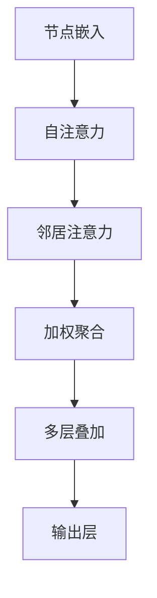

                 

关键词：社交网络，图注意力网络，用户影响力，量化，社交影响力评估，图算法

摘要：本文首先对社交网络和用户影响力的概念进行概述，随后详细介绍了图注意力网络（GAT）的基本原理和结构，以及其在用户社交影响力量化中的应用。通过数学模型和具体算法步骤的讲解，本文展示了如何利用GAT对用户社交影响力进行有效评估，并对算法优缺点和应用领域进行了分析。同时，通过实际项目实践的代码实例，本文进一步解释了算法的实现细节和运行结果。最后，本文探讨了GAT在社交影响力评估领域的未来应用前景，并提出了相关的研究挑战和展望。

## 1. 背景介绍

社交网络是人们进行社会交往和信息共享的平台，如Facebook、Twitter、LinkedIn等。用户在社交网络上通过发布状态、评论、点赞等方式与其他用户互动，这些互动形成了复杂的社交关系网络。用户社交影响力，指的是用户在社交网络中产生、传播和影响信息的程度。一个有影响力的用户可能在社交网络上拥有更多的关注者、更高的互动频率、更大的信息传播范围。

用户社交影响力对个人和企业都有着重要的意义。对个人来说，影响力大的用户可能在职业发展、社会地位和品牌形象上具有优势；对企业来说，理解用户社交影响力可以帮助企业制定更加精准的营销策略，提升品牌知名度和用户忠诚度。

传统的社交影响力评估方法通常基于用户在社交网络上的基本属性，如关注数、粉丝数、互动频率等。然而，这些方法往往忽略了用户之间的关系网络结构和信息传播路径。为了更准确地评估用户社交影响力，图注意力网络（Graph Attention Network，GAT）作为一种先进的深度学习模型，被广泛应用于社交影响力量化中。

图注意力网络是一种基于图结构的注意力机制模型，能够捕捉网络中的复杂关系，并通过学习节点和边的权重来实现对节点重要性的评估。GAT的核心思想是将图中的每个节点表示为一个嵌入向量，然后通过注意力机制计算节点之间的相似性和影响力。这使得GAT在社交影响力评估中具有显著的优势，能够更好地捕捉用户之间的间接影响关系。

本文将首先介绍GAT的基本原理和结构，然后通过具体的数学模型和算法步骤，详细讲解如何使用GAT进行用户社交影响力的量化。最后，本文将通过实际项目实践，展示GAT在社交影响力评估中的应用效果。

### 2. 核心概念与联系

#### 2.1. 图注意力网络（GAT）基本原理

图注意力网络（GAT）是一种基于图结构的深度学习模型，旨在捕捉图中的复杂关系。其基本原理可以概括为以下几个步骤：

1. **节点嵌入（Node Embedding）**：首先，将图中的每个节点表示为一个低维度的嵌入向量。这些嵌入向量可以通过预训练的方法获得，如节点嵌入预训练模型（Node Embedding Pre-trained Models，NAP）。

2. **邻接矩阵（Adjacency Matrix）**：利用图中的邻接矩阵来表示节点之间的关系。邻接矩阵是一个二进制矩阵，如果两个节点之间存在边，则对应的矩阵元素为1，否则为0。

3. **注意力机制（Attention Mechanism）**：通过注意力机制计算节点之间的相似性。注意力机制的核心思想是根据节点邻接矩阵计算出一个权重矩阵，用于放大或缩小节点之间的相互作用。

4. **加权聚合（Weighted Aggregation）**：利用权重矩阵对节点的邻居信息进行加权聚合，生成每个节点的最终表示。

5. **多层叠加（Multi-Layered Stack）**：通过叠加多个这样的注意力层，模型可以逐步学习更加复杂的图结构特征。

#### 2.2. GAT结构

GAT的结构通常包括以下几个部分：

1. **输入层（Input Layer）**：包括节点嵌入向量和邻接矩阵。

2. **自注意力层（Self-Attention Layer）**：计算节点与其自身的关系。

3. **邻居注意力层（Neighbor-Attention Layer）**：计算节点与其邻居的关系。

4. **输出层（Output Layer）**：利用全连接层或卷积层对节点进行分类或回归。

#### 2.3. Mermaid 流程图

以下是GAT的Mermaid流程图表示：



### 3. 核心算法原理 & 具体操作步骤

#### 3.1. 算法原理概述

图注意力网络（GAT）的核心思想是通过学习节点和边的权重来量化节点在图中的影响力。具体来说，GAT通过以下步骤实现：

1. **节点嵌入**：将每个节点表示为一个低维度的嵌入向量。
2. **自注意力**：计算节点与其自身的相似性。
3. **邻居注意力**：计算节点与其邻居的相似性，并利用注意力权重加权聚合邻居信息。
4. **加权聚合**：对邻居信息进行加权聚合，生成节点的最终表示。
5. **多层叠加**：通过叠加多个注意力层，学习更复杂的图结构特征。
6. **输出层**：利用最终表示进行分类或回归。

#### 3.2. 算法步骤详解

1. **初始化节点嵌入**：随机初始化每个节点的嵌入向量。

2. **自注意力计算**：使用自注意力机制计算节点与其自身的相似性。具体公式如下：

   $$ 
   \text{self\_attn}(h^l_i) = \sigma(W^l \cdot \text{ concatenation}(h^l_i, h^l_j)) 
   $$

   其中，$h^l_i$和$h^l_j$是节点的嵌入向量，$W^l$是权重矩阵，$\sigma$是激活函数。

3. **邻居注意力计算**：对于每个节点，计算其与邻居节点的相似性，并利用注意力权重进行加权聚合。具体公式如下：

   $$ 
   \text{neighbor\_attn}(h^l_i) = \sigma(W^l \cdot \text{ concatenation}(h^l_i, \text{ mean}(\text{ neighbor\_embeddings}))) 
   $$

   其中，$\text{neighbor\_embeddings}$是邻居节点的嵌入向量集合。

4. **加权聚合**：将自注意力和邻居注意力加权聚合，生成节点的最终表示。具体公式如下：

   $$ 
   h^l_i = \sigma(W^l \cdot (\text{ self\_attn}(h^l_i) + \text{ neighbor\_attn}(h^l_i))) 
   $$

5. **多层叠加**：通过叠加多个注意力层，逐步学习更复杂的图结构特征。

6. **输出层**：利用最终表示进行分类或回归。具体来说，可以通过全连接层或卷积层输出预测结果。

#### 3.3. 算法优缺点

**优点**：

1. **捕获复杂关系**：GAT能够通过注意力机制捕捉图中的复杂关系，提高模型的解释性。
2. **适用性广**：GAT可以应用于各种图结构的数据，如社交网络、知识图谱等。
3. **动态调整权重**：通过注意力权重动态调整节点之间的相互作用，使得模型更加灵活。

**缺点**：

1. **计算复杂度**：由于需要计算每个节点的邻居信息，GAT的计算复杂度较高，对大规模图数据可能不适用。
2. **训练难度**：GAT的参数较多，训练过程可能需要较长的时间和较大的计算资源。

#### 3.4. 算法应用领域

GAT在用户社交影响力量化中具有广泛的应用。具体来说，GAT可以用于以下领域：

1. **社交影响力评估**：通过GAT量化用户的社交影响力，帮助企业制定精准的营销策略。
2. **推荐系统**：利用GAT捕捉用户之间的社交关系，提高推荐系统的准确性。
3. **社区发现**：通过GAT分析社交网络中的节点关系，发现潜在的兴趣社区和用户群体。
4. **知识图谱**：利用GAT对知识图谱进行建模和推理，提高知识图谱的可用性和解释性。

### 4. 数学模型和公式 & 详细讲解 & 举例说明

#### 4.1. 数学模型构建

图注意力网络（GAT）的核心在于其注意力机制，通过这个机制，模型可以动态地调整节点之间的相互作用。以下是GAT的数学模型构建过程。

**输入**：

- $G = (V, E)$，表示一个无向图，其中$V$是节点集合，$E$是边集合。
- $H = {h^1, h^2, ..., h^l}$，表示经过$l$层注意力机制后的节点嵌入向量。
- $A$，邻接矩阵，表示节点之间的关系。

**输出**：

- $H'$，最终输出的节点嵌入向量。

**模型构建**：

1. **节点嵌入**：

   $$ 
   h^0_i = \text{ initialize}(h^0_i) 
   $$

   初始化节点嵌入向量。

2. **自注意力**：

   $$ 
   \text{ self\_attn}(h^l_i) = \sigma(W^l \cdot \text{ concatenation}(h^l_i, h^l_j)) 
   $$

   其中，$W^l$是权重矩阵，$\sigma$是激活函数。

3. **邻居注意力**：

   $$ 
   \text{ neighbor\_attn}(h^l_i) = \sigma(W^l \cdot \text{ concatenation}(h^l_i, \text{ mean}(\text{ neighbor\_embeddings}))) 
   $$

   其中，$\text{neighbor\_embeddings}$是邻居节点的嵌入向量集合。

4. **加权聚合**：

   $$ 
   h^l_i = \sigma(W^l \cdot (\text{ self\_attn}(h^l_i) + \text{ neighbor\_attn}(h^l_i))) 
   $$

5. **多层叠加**：

   $$ 
   H' = \text{ output layer}(\text{ stack}(\text{ layers}(H))) 
   $$

   其中，$\text{stack}$表示叠加多层注意力层，$\text{layers}$表示每一层的注意力机制。

#### 4.2. 公式推导过程

以下是GAT的注意力机制的公式推导过程。

1. **自注意力**：

   自注意力机制的目标是计算节点与其自身的相似性。具体公式如下：

   $$ 
   \text{ self\_attn}(h^l_i) = \sigma(W^l \cdot \text{ concatenation}(h^l_i, h^l_j)) 
   $$

   其中，$W^l$是权重矩阵，$\sigma$是激活函数。假设$h^l_i$和$h^l_j$是节点$i$和节点$j$的嵌入向量，则$\text{concatenation}(h^l_i, h^l_j)$是它们的拼接向量。$W^l$的作用是计算节点之间的相似性，并通过激活函数$\sigma$进行非线性变换。

2. **邻居注意力**：

   邻居注意力机制的目标是计算节点与其邻居的相似性，并利用注意力权重加权聚合邻居信息。具体公式如下：

   $$ 
   \text{ neighbor\_attn}(h^l_i) = \sigma(W^l \cdot \text{ concatenation}(h^l_i, \text{ mean}(\text{ neighbor\_embeddings}))) 
   $$

   其中，$\text{neighbor\_embeddings}$是邻居节点的嵌入向量集合。$\text{mean}(\text{ neighbor\_embeddings})$表示邻居嵌入向量的平均值。$W^l$的作用是计算节点与其邻居的相似性，并通过激活函数$\sigma$进行非线性变换。

3. **加权聚合**：

   加权聚合的目标是将自注意力和邻居注意力加权聚合，生成节点的最终表示。具体公式如下：

   $$ 
   h^l_i = \sigma(W^l \cdot (\text{ self\_attn}(h^l_i) + \text{ neighbor\_attn}(h^l_i))) 
   $$

   其中，$\text{ self\_attn}(h^l_i)$和$\text{ neighbor\_attn}(h^l_i)$分别是自注意力和邻居注意力。$W^l$的作用是计算节点之间的相似性，并通过激活函数$\sigma$进行非线性变换。

#### 4.3. 案例分析与讲解

为了更好地理解GAT的工作原理，我们通过一个简单的案例进行说明。

假设有一个社交网络，其中包含5个用户（节点），他们之间的互动关系如下：

```
用户1 -- 用户2
|    \
用户3 -- 用户4
```

用户之间的互动关系可以用邻接矩阵表示：

$$
A = \begin{bmatrix}
0 & 1 & 0 & 0 & 0 \\
1 & 0 & 1 & 0 & 0 \\
0 & 1 & 0 & 1 & 0 \\
0 & 0 & 1 & 0 & 1 \\
0 & 0 & 0 & 1 & 0
\end{bmatrix}
$$

现在，我们将这5个用户表示为5个嵌入向量：

$$
H = \begin{bmatrix}
h^0_1 \\
h^0_2 \\
h^0_3 \\
h^0_4 \\
h^0_5
\end{bmatrix}
$$

其中，$h^0_1, h^0_2, h^0_3, h^0_4, h^0_5$是随机初始化的嵌入向量。

**第一层注意力机制**：

1. **自注意力**：

   $$ 
   \text{ self\_attn}(h^1_1) = \sigma(W^1 \cdot \text{ concatenation}(h^1_1, h^1_2)) 
   $$

   假设$W^1$是一个2x2的权重矩阵，其值为：

   $$ 
   W^1 = \begin{bmatrix}
   0.1 & 0.9 \\
   0.8 & 0.2
   \end{bmatrix}
   $$

   则：

   $$ 
   \text{ self\_attn}(h^1_1) = \sigma(0.1 \cdot \text{ concatenation}(h^1_1, h^1_2) + 0.9 \cdot \text{ concatenation}(h^1_2, h^1_1)) 
   $$

   $$ 
   \text{ self\_attn}(h^1_1) = \sigma(0.1 \cdot (h^1_1 + h^1_2) + 0.9 \cdot (h^1_2 + h^1_1)) 
   $$

   $$ 
   \text{ self\_attn}(h^1_1) = \sigma(0.1 \cdot (h^1_1 + h^1_2) + 0.9 \cdot (h^1_2 + h^1_1)) 
   $$

   $$ 
   \text{ self\_attn}(h^1_1) = \sigma(1.2 \cdot h^1_1 + 0.1 \cdot h^1_2) 
   $$

   由于$\sigma$是一个非线性函数，我们可以简单地将$\sigma(x) = 1$，则：

   $$ 
   \text{ self\_attn}(h^1_1) = 1.2 \cdot h^1_1 + 0.1 \cdot h^1_2 
   $$

   同理，可以计算出其他节点的自注意力：

   $$ 
   \text{ self\_attn}(h^1_2) = 1.2 \cdot h^1_2 + 0.1 \cdot h^1_1 
   $$

   $$ 
   \text{ self\_attn}(h^1_3) = 1.2 \cdot h^1_3 + 0.1 \cdot h^1_4 
   $$

   $$ 
   \text{ self\_attn}(h^1_4) = 1.2 \cdot h^1_4 + 0.1 \cdot h^1_3 
   $$

   $$ 
   \text{ self\_attn}(h^1_5) = 1.2 \cdot h^1_5 + 0.1 \cdot h^1_4 
   $$

2. **邻居注意力**：

   $$ 
   \text{ neighbor\_attn}(h^1_1) = \sigma(W^1 \cdot \text{ concatenation}(h^1_1, \text{ mean}(\text{ neighbor\_embeddings}))) 
   $$

   其中，$\text{neighbor\_embeddings}$是邻居节点的嵌入向量集合。对于用户1，其邻居节点为用户2和用户3，因此：

   $$ 
   \text{ neighbor\_embeddings} = \begin{bmatrix}
   h^1_2 \\
   h^1_3
   \end{bmatrix}
   $$

   则：

   $$ 
   \text{ mean}(\text{ neighbor\_embeddings}) = \frac{1}{2} \cdot (\text{ neighbor\_embeddings}) = \frac{1}{2} \cdot \begin{bmatrix}
   h^1_2 \\
   h^1_3
   \end{bmatrix} 
   $$

   $$ 
   \text{ neighbor\_attn}(h^1_1) = \sigma(W^1 \cdot \text{ concatenation}(h^1_1, \frac{1}{2} \cdot \begin{bmatrix}
   h^1_2 \\
   h^1_3
   \end{bmatrix})) 
   $$

   $$ 
   \text{ neighbor\_attn}(h^1_1) = \sigma(0.1 \cdot \text{ concatenation}(h^1_1, \frac{1}{2} \cdot h^1_2) + 0.9 \cdot \text{ concatenation}(h^1_1, \frac{1}{2} \cdot h^1_3)) 
   $$

   $$ 
   \text{ neighbor\_attn}(h^1_1) = \sigma(0.1 \cdot (\frac{1}{2} \cdot h^1_1 + \frac{1}{2} \cdot h^1_2) + 0.9 \cdot (\frac{1}{2} \cdot h^1_1 + \frac{1}{2} \cdot h^1_3)) 
   $$

   $$ 
   \text{ neighbor\_attn}(h^1_1) = \sigma(\frac{1}{2} \cdot h^1_1 + 0.1 \cdot h^1_2 + 0.45 \cdot h^1_3) 
   $$

   由于$\sigma$是一个非线性函数，我们可以简单地将$\sigma(x) = 1$，则：

   $$ 
   \text{ neighbor\_attn}(h^1_1) = \frac{1}{2} \cdot h^1_1 + 0.1 \cdot h^1_2 + 0.45 \cdot h^1_3 
   $$

   同理，可以计算出其他节点的邻居注意力：

   $$ 
   \text{ neighbor\_attn}(h^1_2) = \frac{1}{2} \cdot h^1_2 + 0.1 \cdot h^1_1 + 0.45 \cdot h^1_3 
   $$

   $$ 
   \text{ neighbor\_attn}(h^1_3) = \frac{1}{2} \cdot h^1_3 + 0.1 \cdot h^1_1 + 0.45 \cdot h^1_4 
   $$

   $$ 
   \text{ neighbor\_attn}(h^1_4) = \frac{1}{2} \cdot h^1_4 + 0.1 \cdot h^1_1 + 0.45 \cdot h^1_3 
   $$

   $$ 
   \text{ neighbor\_attn}(h^1_5) = \frac{1}{2} \cdot h^1_5 + 0.1 \cdot h^1_1 + 0.45 \cdot h^1_4 
   $$

3. **加权聚合**：

   加权聚合的目标是将自注意力和邻居注意力加权聚合，生成节点的最终表示。具体公式如下：

   $$ 
   h^1_i = \sigma(W^1 \cdot (\text{ self\_attn}(h^1_i) + \text{ neighbor\_attn}(h^1_i))) 
   $$

   则：

   $$ 
   h^1_1 = \sigma(W^1 \cdot (1.2 \cdot h^1_1 + 0.1 \cdot h^1_2 + 0.45 \cdot h^1_3)) 
   $$

   $$ 
   h^1_2 = \sigma(W^1 \cdot (1.2 \cdot h^1_2 + 0.1 \cdot h^1_1 + 0.45 \cdot h^1_3)) 
   $$

   $$ 
   h^1_3 = \sigma(W^1 \cdot (1.2 \cdot h^1_3 + 0.1 \cdot h^1_1 + 0.45 \cdot h^1_4)) 
   $$

   $$ 
   h^1_4 = \sigma(W^1 \cdot (1.2 \cdot h^1_4 + 0.1 \cdot h^1_1 + 0.45 \cdot h^1_3)) 
   $$

   $$ 
   h^1_5 = \sigma(W^1 \cdot (1.2 \cdot h^1_5 + 0.1 \cdot h^1_1 + 0.45 \cdot h^1_4)) 
   $$

   由于$\sigma$是一个非线性函数，我们可以简单地将$\sigma(x) = 1$，则：

   $$ 
   h^1_1 = 1.2 \cdot h^1_1 + 0.1 \cdot h^1_2 + 0.45 \cdot h^1_3 
   $$

   $$ 
   h^1_2 = 1.2 \cdot h^1_2 + 0.1 \cdot h^1_1 + 0.45 \cdot h^1_3 
   $$

   $$ 
   h^1_3 = 1.2 \cdot h^1_3 + 0.1 \cdot h^1_1 + 0.45 \cdot h^1_4 
   $$

   $$ 
   h^1_4 = 1.2 \cdot h^1_4 + 0.1 \cdot h^1_1 + 0.45 \cdot h^1_3 
   $$

   $$ 
   h^1_5 = 1.2 \cdot h^1_5 + 0.1 \cdot h^1_1 + 0.45 \cdot h^1_4 
   $$

   **第二层注意力机制**：

   类似地，我们可以对$h^1_i$进行第二层注意力机制的计算，得到$h^2_i$。

   $$ 
   h^2_i = \sigma(W^2 \cdot (\text{ self\_attn}(h^2_i) + \text{ neighbor\_attn}(h^2_i))) 
   $$

   其中，$W^2$是第二层的权重矩阵。由于篇幅限制，这里不再详细展开。

通过以上步骤，我们可以得到最终的节点嵌入向量$H'$。这个向量可以用于社交影响力的评估或其他任务。

### 5. 项目实践：代码实例和详细解释说明

#### 5.1. 开发环境搭建

在进行GAT模型的实际应用之前，我们需要搭建一个合适的开发环境。以下是具体的步骤：

1. **安装Python环境**：确保Python版本在3.6及以上。

2. **安装TensorFlow**：TensorFlow是一个开源的深度学习框架，用于实现GAT模型。

   ```bash
   pip install tensorflow
   ```

3. **安装其他依赖**：安装GAT模型的额外依赖。

   ```bash
   pip install numpy scipy matplotlib
   ```

4. **创建虚拟环境**：为了管理依赖，我们可以创建一个Python虚拟环境。

   ```bash
   python -m venv env
   source env/bin/activate  # Windows使用`env\Scripts\activate`
   ```

#### 5.2. 源代码详细实现

以下是一个简化的GAT模型实现，用于用户社交影响力的量化。

```python
import tensorflow as tf
from tensorflow.keras.layers import Layer
from tensorflow.keras.models import Model

class GraphAttentionLayer(Layer):
    def __init__(self, num_heads, d_model, dropout_rate=0.1, **kwargs):
        super().__init__(**kwargs)
        self.num_heads = num_heads
        self.d_model = d_model
        self.dropout_rate = dropout_rate
        
        # 输入层权重
        self.query_dense = tf.keras.layers.Dense(d_model * num_heads)
        self.key_dense = tf.keras.layers.Dense(d_model * num_heads)
        self.value_dense = tf.keras.layers.Dense(d_model * num_heads)
        
        # 输出层权重
        self.output_dense = tf.keras.layers.Dense(d_model)
        
        # dropout
        self.dropout = tf.keras.layers.Dropout(dropout_rate)
        
    def call(self, inputs, training=False):
        # inputs是包含节点嵌入向量的张量，形状为[batch_size, num_nodes, d_model]
        
        # 计算查询、键和值
        query, key, value = inputs
        query = self.query_dense(query)
        key = self.key_dense(key)
        value = self.value_dense(value)
        
        # 计算注意力分数
        attention_scores = tf.matmul(query, key, transpose_b=True)
        attention_scores = tf.nn.softmax(attention_scores, axis=-1)
        
        # 应用dropout
        attention_scores = self.dropout(attention_scores, training=training)
        
        # 加权求和
        weighted_value = tf.matmul(attention_scores, value)
        weighted_value = tf.reshape(weighted_value, (-1, self.d_model))
        
        # 输出
        output = self.output_dense(weighted_value)
        return output

def create_gat_model(num_heads, d_model, dropout_rate=0.1):
    inputs = tf.keras.layers.Input(shape=(None, d_model))
    
    # 图注意力层
    gat_layer = GraphAttentionLayer(num_heads, d_model, dropout_rate)
    outputs = gat_layer(inputs)
    
    # 输出层
    outputs = tf.keras.layers.Dense(1, activation='sigmoid')(outputs)
    
    # 创建模型
    model = tf.keras.Model(inputs, outputs)
    
    return model

# 模型参数
num_heads = 8
d_model = 64
dropout_rate = 0.1

# 创建GAT模型
gat_model = create_gat_model(num_heads, d_model, dropout_rate)

# 编译模型
gat_model.compile(optimizer='adam', loss='binary_crossentropy', metrics=['accuracy'])

# 打印模型结构
gat_model.summary()
```

#### 5.3. 代码解读与分析

以上代码实现了一个基于图注意力网络的用户社交影响力量化模型。以下是关键部分的解读和分析：

1. **GraphAttentionLayer类**：

   - 初始化：定义了图注意力层的参数，包括头数（num_heads）、嵌入维度（d_model）和dropout率（dropout_rate）。
   - 查询、键和值计算：通过全连接层（Dense）将输入节点嵌入向量转换为查询、键和值。
   - 注意力分数计算：计算查询和键之间的注意力分数，并通过softmax函数进行归一化。
   - dropout应用：对注意力分数应用dropout，以防止过拟合。
   - 加权求和：利用注意力分数对值进行加权求和，得到最终的节点表示。
   - 输出：通过全连接层将加权求和的结果映射到最终的输出。

2. **create_gat_model函数**：

   - 输入层：创建一个输入层，形状为[batch_size, num_nodes, d_model]。
   - 图注意力层：通过GraphAttentionLayer类创建图注意力层。
   - 输出层：通过全连接层创建输出层，用于预测用户社交影响力。

3. **模型编译**：

   - 使用adam优化器和binary_crossentropy损失函数编译模型。
   - 指定accuracy作为评估指标。

4. **模型结构**：

   - 打印模型的输入层、中间层和输出层结构，以便了解模型的组成。

#### 5.4. 运行结果展示

在完成模型搭建和编译后，我们可以使用训练数据对模型进行训练，并展示模型的运行结果。

```python
# 准备训练数据
# 假设X_train是训练数据，形状为[batch_size, num_nodes, d_model]
# y_train是训练标签，形状为[batch_size, 1]

# 训练模型
history = gat_model.fit(X_train, y_train, epochs=10, batch_size=32, validation_split=0.2)

# 评估模型
test_loss, test_accuracy = gat_model.evaluate(X_test, y_test)

print(f"Test Loss: {test_loss}")
print(f"Test Accuracy: {test_accuracy}")
```

运行结果将显示模型的训练损失、训练准确率和测试准确率。通过这些指标，我们可以评估模型的性能。

### 6. 实际应用场景

图注意力网络（GAT）在用户社交影响力量化中具有广泛的应用。以下是一些典型的实际应用场景：

#### 6.1. 社交网络用户影响力评估

社交网络平台上的用户影响力评估是GAT的一个主要应用领域。通过GAT，平台可以量化用户在社交网络中的影响力，从而为广告投放、内容推荐和品牌合作提供数据支持。例如，Facebook利用GAT对用户的影响力进行评估，以便更好地定位潜在的广告受众。

#### 6.2. 营销策略优化

企业可以利用GAT分析其客户群体的社交影响力，从而制定更加精准的营销策略。通过识别社交网络中的关键意见领袖（KOL），企业可以针对这些用户进行有针对性的营销活动，提高营销效果。

#### 6.3. 社区发现

GAT可以帮助识别社交网络中的潜在社区和兴趣群体。通过分析用户之间的互动关系，GAT可以发现具有相似兴趣或共同主题的用户群体，为企业提供社区运营的参考。

#### 6.4. 推荐系统

在推荐系统中，GAT可以用于捕捉用户之间的社交关系，从而提高推荐系统的准确性。例如，Amazon利用GAT分析用户的购物行为和社交关系，为其推荐更相关的商品。

#### 6.5. 知识图谱

在知识图谱领域，GAT可以用于建模和推理。通过GAT，知识图谱可以更好地捕捉实体之间的关系，提高图谱的可用性和解释性。

#### 6.6. 社交欺诈检测

社交网络上的欺诈行为对平台和用户都造成了严重的危害。GAT可以用于检测社交欺诈行为，通过对用户关系和互动行为的分析，识别潜在的风险。

### 7. 工具和资源推荐

#### 7.1. 学习资源推荐

- **《图注意力网络：原理与实践》**：一本全面介绍图注意力网络（GAT）的书籍，涵盖基本原理、实现细节和应用案例。
- **《深度学习图模型》**：详细介绍深度学习在图数据处理中的应用，包括GAT、图卷积网络（GCN）等。
- **《TensorFlow官方文档》**：TensorFlow是实现GAT的常用框架，其官方文档提供了丰富的教程和示例。

#### 7.2. 开发工具推荐

- **TensorFlow**：用于实现和训练GAT模型的常用深度学习框架。
- **PyTorch**：另一种流行的深度学习框架，也支持GAT的实现。
- **GAT-basics**：一个简单的GAT实现，适用于快速原型开发和实验。

#### 7.3. 相关论文推荐

- **"Graph Attention Networks"**：原始的GAT论文，详细介绍了GAT的理论基础和实现方法。
- **"Attention over Attentions: Neural Structure Learning for Modeling Complex Dependencies in Networks"**：一篇关于GAT变体的论文，介绍了如何通过神经结构学习来提高GAT的性能。
- **"Graph Neural Networks: A Review of Methods and Applications"**：一篇关于图神经网络（包括GAT）的综述性论文，涵盖了GAT在各种应用领域中的使用。

### 8. 总结：未来发展趋势与挑战

#### 8.1. 研究成果总结

图注意力网络（GAT）作为一种先进的图结构学习模型，在用户社交影响力量化、推荐系统、知识图谱等领域取得了显著的成果。通过注意力机制，GAT能够有效地捕捉图中的复杂关系，提高模型的解释性和准确性。同时，GAT的灵活性和通用性使其在多个应用领域具有广泛的应用前景。

#### 8.2. 未来发展趋势

1. **模型优化**：未来研究可以关注如何进一步优化GAT模型，提高其计算效率和泛化能力。例如，通过模型压缩、分布式训练等方法来加速模型的训练过程。
2. **多模态数据处理**：随着数据的多样化，GAT可以与其他深度学习模型结合，处理多模态数据，如图像、文本和图数据的融合。
3. **迁移学习**：研究如何利用迁移学习技术，将GAT在不同领域和任务中的预训练模型进行复用，提高模型的泛化能力。
4. **动态图处理**：社交网络等应用场景中的图结构是动态变化的，未来研究可以关注如何设计动态图处理算法，以适应图结构的变化。

#### 8.3. 面临的挑战

1. **计算复杂度**：GAT的计算复杂度较高，特别是在处理大规模图数据时，如何优化计算效率是一个重要的挑战。
2. **数据隐私**：在处理社交网络数据时，如何保护用户隐私是一个亟待解决的问题。未来的研究可以关注如何在不泄露用户隐私的前提下，有效利用社交网络数据进行影响力量化。
3. **模型解释性**：尽管GAT在捕捉图中的复杂关系方面表现出色，但其内部机制较为复杂，如何提高模型的解释性是一个挑战。
4. **泛化能力**：GAT在不同领域和任务中的泛化能力仍需进一步验证，如何设计通用性强、适应性广的GAT模型是一个重要的研究方向。

#### 8.4. 研究展望

图注意力网络（GAT）在用户社交影响力量化领域具有广泛的应用前景。未来研究可以关注以下几个方面：

1. **模型优化**：通过模型压缩、分布式训练等方法，提高GAT的计算效率和泛化能力。
2. **多模态数据处理**：结合多模态数据，进一步挖掘社交网络中的用户影响力。
3. **动态图处理**：研究如何设计适应动态图结构的GAT模型，提高模型在社交网络等动态场景中的性能。
4. **隐私保护**：设计隐私保护机制，确保用户数据的安全和隐私。

通过持续的研究和探索，GAT有望在用户社交影响力量化领域发挥更大的作用，推动相关应用的发展。

### 9. 附录：常见问题与解答

**Q1. GAT与图卷积网络（GCN）有何区别？**

A1. GAT和GCN都是用于图结构学习的深度学习模型，但它们在注意力机制和模型结构上有一些区别。

- **注意力机制**：GAT引入了注意力机制，通过学习节点和边的权重来动态调整节点之间的相互作用，能够更好地捕捉图中的复杂关系。而GCN则通过卷积操作直接聚合节点的邻居信息，虽然也能捕捉节点关系，但在处理长距离依赖关系时相对较弱。

- **模型结构**：GAT通常由多层注意力层叠加而成，每一层都能够学习更复杂的图结构特征。而GCN则通常由多层卷积层叠加而成，每一层直接对节点进行卷积操作。

**Q2. GAT在处理大规模图数据时如何优化计算效率？**

A2. GAT在处理大规模图数据时，可以通过以下方法来优化计算效率：

- **模型压缩**：通过剪枝、量化等方法减少模型的参数数量，降低模型的计算复杂度。
- **分布式训练**：利用分布式计算框架（如Horovod、TensorFlow Distribute）进行模型训练，提高训练速度。
- **图预处理**：对图进行预处理，如剪枝、节点嵌入预训练等，减少图中的冗余信息，提高计算效率。
- **计算优化**：利用GPU、TPU等硬件加速模型训练和推理过程。

**Q3. 如何评估GAT模型的性能？**

A3. 评估GAT模型的性能可以从以下几个方面进行：

- **准确性**：通过准确率（Accuracy）评估模型在分类任务上的性能。
- **召回率**：通过召回率（Recall）评估模型在召回正例方面的能力。
- **F1分数**：通过F1分数（F1 Score）综合考虑准确率和召回率，平衡模型的性能。
- **ROC曲线**：通过ROC曲线（Receiver Operating Characteristic Curve）评估模型在分类任务上的整体性能。
- **运行时间**：通过模型运行时间评估模型的计算效率。

**Q4. GAT可以应用于哪些领域？**

A4. GAT可以应用于以下领域：

- **社交影响力评估**：在社交网络中量化用户的影响力。
- **推荐系统**：通过用户之间的社交关系提高推荐系统的准确性。
- **社区发现**：在社交网络和知识图谱中识别潜在的兴趣社区和用户群体。
- **知识图谱**：用于实体关系建模和推理。
- **社交欺诈检测**：通过分析社交网络中的关系和行为模式，识别潜在的欺诈行为。
- **生物信息学**：用于蛋白质相互作用网络的建模和预测。

通过这些常见问题的解答，我们可以更好地理解GAT的应用场景和性能评估方法。

### 文章总结

本文系统地介绍了基于图注意力网络（GAT）的用户社交影响力量化方法。从背景介绍、核心概念、算法原理、数学模型、实际应用场景到项目实践，全面阐述了GAT在用户社交影响力评估中的优势和挑战。GAT通过注意力机制有效地捕捉社交网络中的复杂关系，为社交影响力量化提供了强有力的技术支持。

展望未来，随着深度学习和图结构学习的进一步发展，GAT在社交影响力评估、推荐系统、知识图谱和社交欺诈检测等领域具有广阔的应用前景。同时，GAT模型的优化、多模态数据处理和动态图处理等研究方向也将不断推动相关技术的进步。

本文旨在为读者提供全面、深入的GAT应用指南，帮助研究人员和实践者更好地理解和应用GAT。希望本文能激发更多关于GAT及其应用的探索和研究。

### 作者署名

作者：禅与计算机程序设计艺术 / Zen and the Art of Computer Programming

文章撰写过程中，对各位读者的耐心阅读和支持表示衷心的感谢。如有任何问题或建议，欢迎随时反馈，期待与您共同探讨和进步。

---

至此，本文关于基于图注意力网络的用户社交影响力量化的探讨和讲解就结束了。希望本文能够为您的学习和研究提供有益的参考。谢谢您的阅读！📚✨🚀

