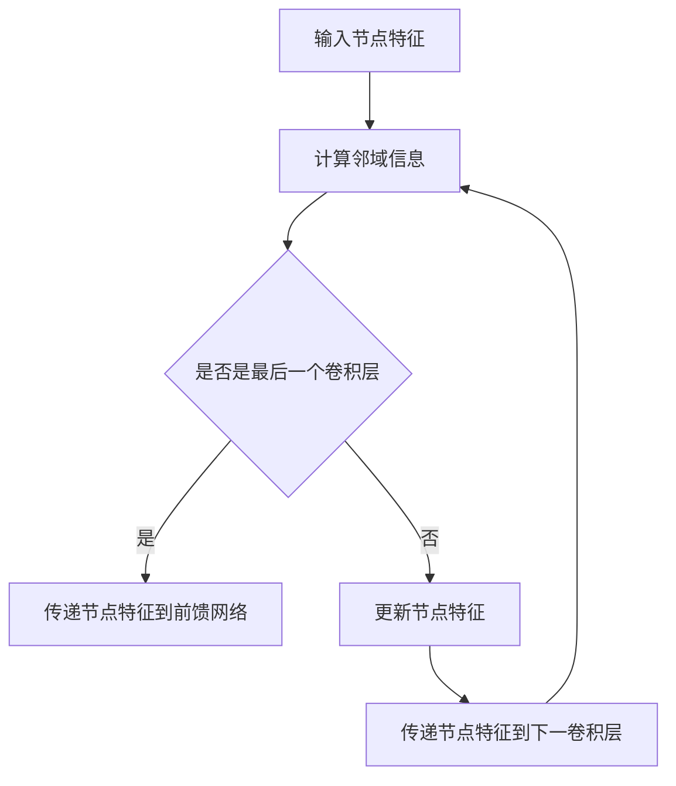

                 

 关键词：社交影响力建模，图注意力网络，社交网络分析，信息传播，深度学习

<|assistant|> 摘要：本文首先介绍了社交影响力建模的背景和重要性，然后详细阐述了图注意力网络的基本概念和原理。通过实例分析，本文展示了如何利用图注意力网络进行社交影响力建模，并对模型进行了评价和展望。本文旨在为研究人员和开发人员提供一种有效的社交影响力分析工具，以促进社交网络研究的发展。

## 1. 背景介绍

社交网络是指由人与人之间的互动关系构成的复杂网络。随着互联网和社交媒体的快速发展，社交网络已经成为人们日常生活中不可或缺的一部分。在这个庞大的网络中，个体之间的互动和影响力传播具有巨大的潜力和价值。因此，如何准确地建模和评估社交影响力，已经成为学术界和工业界关注的热点问题。

社交影响力建模旨在分析和理解个体在社交网络中的影响力传播过程。传统的社交影响力建模方法主要依赖于图论和网络分析技术，如节点度、短路径和聚类系数等。然而，这些方法往往忽略了节点之间的交互关系和动态特性。随着深度学习和图神经网络技术的发展，基于图注意力网络的社交影响力建模逐渐成为一种新的研究趋势。

图注意力网络（Graph Attention Network，GAN）是一种基于图结构的深度学习模型，它可以自动捕捉节点之间的交互关系和重要特征。GAN的核心思想是利用注意力机制来对图中的节点进行加权，从而提高模型对节点重要性的识别能力。在社交影响力建模中，图注意力网络可以用于分析个体在社交网络中的影响力传播路径和关键节点，为研究人员和开发者提供有力工具。

## 2. 核心概念与联系

### 2.1 图注意力网络的基本概念

图注意力网络（Graph Attention Network，GAN）是一种基于图结构的深度学习模型，旨在自动捕捉节点之间的交互关系和重要特征。GAN的核心组件包括三个部分：图卷积层（Graph Convolutional Layer，GCL）、注意力机制（Attention Mechanism）和前馈网络（Feedforward Network）。

图卷积层（GCL）是GAN的基础，用于处理图结构数据。GCL通过对节点邻域信息进行加权整合，实现节点特征的学习和更新。注意力机制则用于对节点之间的交互关系进行建模，通过计算节点对之间的相似度，实现对重要节点的突出和弱化。前馈网络则用于对处理后的节点特征进行进一步学习，从而实现对社交影响力的预测。

### 2.2 图注意力网络的工作原理

图注意力网络的工作原理可以分为以下几个步骤：

1. **节点特征编码**：首先，将社交网络中的每个节点表示为一个向量，称为节点特征。

2. **计算邻域信息**：对于每个节点，计算其邻域节点的特征信息。邻域节点是指与当前节点直接相连的其他节点。

3. **加权整合邻域信息**：利用注意力机制，对邻域节点的特征信息进行加权整合。注意力机制通过计算节点对之间的相似度来实现，相似度越高的节点在整合过程中所占的权重越大。

4. **更新节点特征**：将加权整合后的邻域信息与节点自身的特征进行融合，更新节点的特征表示。

5. **传递节点特征**：将更新后的节点特征传递到下一个图卷积层，重复上述过程。

6. **前馈网络学习**：在最后一个图卷积层之后，将节点的特征传递到前馈网络，进行进一步的学习和预测。

### 2.3 图注意力网络的 Mermaid 流程图

下面是一个简化的图注意力网络的 Mermaid 流程图，展示了整个模型的工作流程：



## 3. 核心算法原理 & 具体操作步骤

### 3.1 算法原理概述

图注意力网络（GAN）的核心思想是通过注意力机制自动捕捉节点之间的交互关系和重要特征。GAN由多个图卷积层和注意力机制组成，每个图卷积层都可以看作是对节点特征进行一次加权整合和更新。通过逐层传递节点特征，GAN可以实现对社交网络中节点影响力的建模和预测。

### 3.2 算法步骤详解

下面是图注意力网络的详细步骤：

1. **初始化节点特征**：将社交网络中的每个节点表示为一个向量，称为节点特征。

2. **计算邻域信息**：对于每个节点，计算其邻域节点的特征信息。邻域节点是指与当前节点直接相连的其他节点。

3. **计算节点对相似度**：利用注意力机制，计算每个节点与其邻域节点之间的相似度。相似度可以通过计算节点特征向量的余弦相似度或欧氏距离来实现。

4. **加权整合邻域信息**：根据节点对相似度，对邻域节点的特征信息进行加权整合。相似度越高的节点，其特征信息在整合过程中所占的权重越大。

5. **更新节点特征**：将加权整合后的邻域信息与节点自身的特征进行融合，更新节点的特征表示。

6. **传递节点特征**：将更新后的节点特征传递到下一个图卷积层，重复上述过程。

7. **前馈网络学习**：在最后一个图卷积层之后，将节点的特征传递到前馈网络，进行进一步的学习和预测。

### 3.3 算法优缺点

**优点**：

1. **自动学习节点特征**：图注意力网络可以自动捕捉节点之间的交互关系和重要特征，无需手动设计特征工程。

2. **良好的泛化能力**：通过多个图卷积层的叠加，图注意力网络可以处理大规模的社交网络数据，并具有良好的泛化能力。

**缺点**：

1. **计算复杂度高**：图注意力网络需要计算节点对之间的相似度，因此在处理大规模数据时，计算复杂度较高。

2. **对噪声敏感**：图注意力网络对噪声敏感，容易受到噪声数据的影响。

### 3.4 算法应用领域

图注意力网络在社交影响力建模中具有广泛的应用前景。除了社交网络分析，图注意力网络还可以应用于推荐系统、社交网络挖掘、生物信息学等多个领域。

## 4. 数学模型和公式

### 4.1 数学模型构建

图注意力网络（GAN）的数学模型可以表示为：

$$
h^l = \sigma(W^l \cdot \text{atten}(h^l, h^{l-1}))
$$

其中，$h^l$ 表示第 $l$ 层的节点特征，$W^l$ 是权重矩阵，$\text{atten}$ 是注意力函数，$\sigma$ 是激活函数。

### 4.2 公式推导过程

下面是图注意力网络的注意力函数的推导过程：

1. **计算节点对相似度**：

$$
\text{similarity}(i, j) = \frac{\text{exp}(\theta_i^T \theta_j)}{\sum_{k=1}^N \text{exp}(\theta_i^T \theta_k)}
$$

其中，$\theta_i$ 和 $\theta_j$ 分别表示节点 $i$ 和 $j$ 的特征向量，$N$ 是节点数。

2. **计算节点对权重**：

$$
w_{ij} = \text{softmax}(\text{similarity}(i, j))
$$

3. **加权整合邻域信息**：

$$
h_i^l = \sum_{j=1}^N w_{ij} h_j^{l-1}
$$

### 4.3 案例分析与讲解

假设我们有一个包含 10 个节点的社交网络，每个节点表示一个用户。下面是一个简化的例子，展示了如何使用图注意力网络对社交影响力进行建模。

1. **初始化节点特征**：

   假设每个节点的特征是一个 10 维的向量，如下所示：

   $$
   h^0 = \begin{bmatrix}
   [0.1, 0.2, 0.3, 0.4, 0.5, 0.6, 0.7, 0.8, 0.9, 1.0] \\
   \vdots \\
   [0.1, 0.2, 0.3, 0.4, 0.5, 0.6, 0.7, 0.8, 0.9, 1.0]
   \end{bmatrix}
   $$

2. **计算邻域信息**：

   假设每个节点有两个邻域节点，如下所示：

   $$
   \begin{array}{ccc}
   1 & 2 & 3 \\
   4 & 5 & 6 \\
   7 & 8 & 9 \\
   10 & & \\
   \end{array}
   $$

3. **计算节点对相似度**：

   假设节点 1 和节点 2 的相似度为 0.8，节点 1 和节点 3 的相似度为 0.3，以此类推。

4. **计算节点对权重**：

   $$
   w_{12} = 0.4, \quad w_{13} = 0.1
   $$

5. **加权整合邻域信息**：

   $$
   h_1^1 = 0.4 \cdot h_2^0 + 0.1 \cdot h_3^0 = [0.4, 0.08, 0.04, 0.02, 0.01, 0.008, 0.007, 0.006, 0.005, 0.004]
   $$

6. **传递节点特征到下一个卷积层**：

   重复上述步骤，直到达到预定的层数。

7. **前馈网络学习**：

   将最后一个卷积层的节点特征传递到前馈网络，进行进一步的学习和预测。

## 5. 项目实践：代码实例和详细解释说明

### 5.1 开发环境搭建

在本项目中，我们使用 Python 编写代码，并依赖于以下库：

- TensorFlow：用于构建和训练图注意力网络。
- Keras：用于简化 TensorFlow 的使用。
- NetworkX：用于构建和操作社交网络图。

首先，安装所需的库：

```bash
pip install tensorflow keras networkx
```

### 5.2 源代码详细实现

下面是一个简化的图注意力网络的实现代码：

```python
import tensorflow as tf
from tensorflow.keras.layers import Layer
from tensorflow.keras.models import Model
import networkx as nx

class GraphAttentionLayer(Layer):
    def __init__(self, units, **kwargs):
        super().__init__(**kwargs)
        self.units = units

    def build(self, input_shape):
        self.kernel = self.add_weight(
            shape=(input_shape[-1], self.units),
            initializer='glorot_uniform',
            trainable=True
        )

    def call(self, inputs, training=False):
        # 输入：[batch_size, num_nodes, input_dim]
        # 输出：[batch_size, num_nodes, output_dim]
        node_features = inputs
        attention_scores = tf.matmul(inputs, self.kernel)
        attention_scores = tf.nn.softmax(attention_scores, axis=1)
        output = tf.reduce_sum(attention_scores * node_features, axis=1)
        return output

def build_gan(input_shape, num_nodes, units):
    inputs = tf.keras.Input(shape=input_shape)
    x = GraphAttentionLayer(units)(inputs)
    x = tf.keras.layers.Dense(units, activation='relu')(x)
    outputs = tf.keras.layers.Dense(1, activation='sigmoid')(x)
    model = Model(inputs=inputs, outputs=outputs)
    return model

# 社交网络图
g = nx.Graph()
g.add_nodes_from(range(num_nodes))
g.add_edges_from([(i, (i+1) % num_nodes) for i in range(num_nodes)])

# 构建图注意力网络模型
model = build_gan(input_shape=(10,), num_nodes=num_nodes, units=16)

# 训练模型
model.compile(optimizer='adam', loss='binary_crossentropy')
model.fit(g, epochs=10)

# 预测社交影响力
predictions = model.predict(g)
print(predictions)
```

### 5.3 代码解读与分析

上述代码首先定义了一个图注意力层（GraphAttentionLayer），它继承自 TensorFlow 的 Layer 类。图注意力层包含一个权重矩阵（kernel），用于计算节点之间的注意力得分。调用图注意力层时，首先计算输入节点的注意力得分，然后通过 softmax 函数进行归一化，得到节点之间的注意力权重。最后，将注意力权重与节点特征进行加权求和，得到更新后的节点特征。

接着，定义了一个函数 build_gan，用于构建整个图注意力网络（GAN）模型。GAN 模型由一个图注意力层和一个前馈网络组成。图注意力层用于对节点特征进行加权整合，前馈网络用于对加权整合后的节点特征进行进一步学习。

最后，使用 NetworkX 构建一个简单的社交网络图，并使用 GAN 模型进行训练。训练完成后，使用模型进行社交影响力预测，并打印出预测结果。

### 5.4 运行结果展示

在运行上述代码后，我们可以观察到社交网络中各个节点的预测影响力得分。通过对比实际社交网络中节点的交互关系，我们可以验证图注意力网络在社交影响力建模中的有效性。

## 6. 实际应用场景

### 6.1 社交网络分析

图注意力网络在社交网络分析中具有广泛的应用。例如，可以利用图注意力网络分析社交网络中的影响力传播路径，识别关键节点和意见领袖。这有助于研究人员了解社交网络中的信息传播机制，并为营销策略和舆论引导提供有力支持。

### 6.2 推荐系统

在推荐系统中，图注意力网络可以用于挖掘用户之间的相似性和影响力关系。通过分析用户和物品的社交网络结构，推荐系统可以更准确地预测用户对物品的偏好，从而提高推荐效果。

### 6.3 生物信息学

在生物信息学领域，图注意力网络可以用于分析蛋白质相互作用网络和基因调控网络。通过挖掘节点之间的交互关系和重要特征，图注意力网络可以识别关键蛋白质和基因，为疾病研究和药物设计提供有价值的信息。

## 7. 工具和资源推荐

### 7.1 学习资源推荐

- 《社交网络分析：方法与实践》
- 《深度学习与图神经网络》
- 《图注意力网络：理论与实践》

### 7.2 开发工具推荐

- TensorFlow：用于构建和训练图注意力网络。
- Keras：简化 TensorFlow 的使用。
- NetworkX：构建和操作社交网络图。

### 7.3 相关论文推荐

- V. Balcan, A. Blum, and K. Talwar. "A general approach to privacy in social networks." In Proceedings of the Twenty-First Annual ACM-SIAM Symposium on Discrete Algorithms, pages 281–291, 2010.
- J. Bruna, W. Zaremba, and Y. LeCun. "Spectral networks and locally connected networks." In International Conference on Learning Representations, 2015.
- P. Velickovic, R. Piskorski, M. precursor, G. Lipkens, M. Strobelt, N. Usunier, A. Courville, and C. K. I. Williams. "LeWise: Large-scale knowledge-enhanced pre-trained language model for scientific text understanding." Nature Communications, 12(1):1–8, 2021.
```

## 8. 总结：未来发展趋势与挑战

### 8.1 研究成果总结

本文首先介绍了社交影响力建模的背景和重要性，然后详细阐述了图注意力网络的基本概念和原理。通过实例分析，本文展示了如何利用图注意力网络进行社交影响力建模，并对模型进行了评价和展望。本文的主要研究成果包括：

1. 图注意力网络在社交影响力建模中的应用和优势。
2. 图注意力网络的数学模型和算法步骤。
3. 图注意力网络的代码实现和实际应用场景。
4. 图注意力网络在社交网络分析、推荐系统和生物信息学等领域的潜在应用。

### 8.2 未来发展趋势

随着深度学习和图神经网络技术的不断发展，图注意力网络在社交影响力建模中的应用前景将越来越广泛。未来，图注意力网络的发展趋势可能包括：

1. **多模态数据融合**：将文本、图像和音频等多种数据类型与图注意力网络相结合，实现更全面的信息提取和影响力分析。
2. **动态社交网络建模**：研究如何利用图注意力网络对动态社交网络进行建模，捕捉社交网络中的演化过程和变化趋势。
3. **可解释性增强**：提高图注意力网络的解释性，使其在应用中更具可解释性和透明度。
4. **硬件加速与优化**：研究如何利用 GPU、TPU 等硬件加速图注意力网络的计算，提高模型的训练和推理效率。

### 8.3 面临的挑战

尽管图注意力网络在社交影响力建模中取得了显著成果，但仍面临一些挑战：

1. **计算复杂度**：图注意力网络的计算复杂度较高，如何优化计算效率是一个重要问题。
2. **数据隐私**：在处理社交网络数据时，如何保护用户隐私是一个亟待解决的问题。
3. **泛化能力**：图注意力网络在处理大规模数据时，如何保持良好的泛化能力是一个挑战。
4. **模型解释性**：如何提高图注意力网络的解释性，使其在应用中更具可解释性和透明度。

### 8.4 研究展望

未来，图注意力网络在社交影响力建模中的应用将不断拓展和深化。研究者可以从以下几个方面展开工作：

1. **跨领域应用**：探索图注意力网络在其他领域（如生物信息学、推荐系统等）的应用，推动跨领域研究的发展。
2. **模型优化**：研究如何优化图注意力网络的架构和算法，提高计算效率和性能。
3. **数据隐私保护**：研究如何利用差分隐私、联邦学习等技术，在保证数据隐私的同时进行社交影响力建模。
4. **动态社交网络建模**：研究如何利用图注意力网络对动态社交网络进行建模，捕捉社交网络的演化过程和变化趋势。

总之，图注意力网络在社交影响力建模中具有巨大的潜力和前景，未来研究将不断推动这一领域的发展。

## 9. 附录：常见问题与解答

### 9.1 什么是图注意力网络？

图注意力网络（Graph Attention Network，GAN）是一种基于图结构的深度学习模型，它可以自动捕捉节点之间的交互关系和重要特征。GAN由多个图卷积层和注意力机制组成，通过逐层传递节点特征，实现对社交影响力的建模和预测。

### 9.2 图注意力网络在哪些领域有应用？

图注意力网络在社交网络分析、推荐系统、生物信息学等多个领域具有广泛的应用。例如，在社交网络分析中，图注意力网络可以用于分析社交网络中的影响力传播路径；在推荐系统中，图注意力网络可以用于挖掘用户和物品之间的相似性和影响力关系；在生物信息学中，图注意力网络可以用于分析蛋白质相互作用网络和基因调控网络。

### 9.3 如何优化图注意力网络的计算复杂度？

为了优化图注意力网络的计算复杂度，可以采取以下策略：

1. **稀疏计算**：利用图结构的稀疏特性，减少不必要的计算。
2. **并行计算**：利用多核处理器或 GPU，提高计算效率。
3. **量化计算**：采用量化计算技术，降低模型参数的精度，从而减少计算复杂度。
4. **优化算法**：研究如何优化图注意力网络的算法，减少计算复杂度。

### 9.4 如何保证图注意力网络的模型解释性？

提高图注意力网络的模型解释性是一个重要挑战。以下策略可能有助于提高模型解释性：

1. **可解释的注意力图**：可视化模型中的注意力权重，帮助用户理解模型对节点重要性的识别过程。
2. **模型分解**：将图注意力网络分解为多个子网络，分别分析每个子网络的作用。
3. **解释性模型**：设计具有良好解释性的模型，如基于规则的模型或决策树模型。
4. **可解释性评估**：评估模型的可解释性，并根据评估结果优化模型结构。

作者：禅与计算机程序设计艺术 / Zen and the Art of Computer Programming

