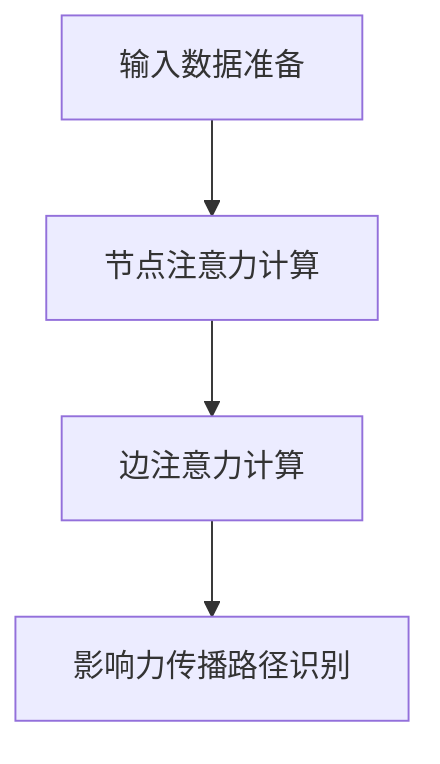

                 

 关键词：社交影响力建模、图注意力网络、社交网络分析、影响力传播、人工智能

## 摘要

随着社交网络的日益普及，社交影响力建模成为了一个重要且具有挑战性的研究领域。本文主要介绍了一种基于图注意力网络的社交影响力建模方法。首先，对社交网络中的基本概念进行了回顾，然后详细介绍了图注意力网络的核心原理和模型结构。接着，通过数学模型和公式，阐述了图注意力网络在社交影响力建模中的具体应用。文章最后通过一个实际的代码实例，展示了如何使用图注意力网络进行社交影响力建模，并对该方法的优缺点和应用领域进行了深入讨论。本文旨在为研究人员和开发者提供一种新的思考方向，以应对社交影响力建模领域的挑战。

## 1. 背景介绍

社交影响力建模是近年来在社交网络分析领域中的一个重要研究方向。社交网络作为一种特殊的图结构，其节点和边代表了用户和用户之间的关系。在这些关系中，有些用户的影响力较大，他们能够影响其他用户的行为和态度。社交影响力建模的目标就是找出这些具有影响力的人，并理解他们如何影响其他用户。

传统的研究方法主要包括基于规则的方法、基于机器学习的方法和基于图论的方法。然而，这些方法往往存在一定的局限性。例如，基于规则的方法需要人工设计规则，且难以处理复杂的网络结构；基于机器学习的方法虽然可以自动学习特征，但对大规模数据集的处理效率较低；基于图论的方法虽然能够较好地处理图结构，但对节点和边的属性信息利用不足。

为了解决这些问题，近年来研究者们提出了一系列基于深度学习的社交影响力建模方法。其中，图注意力网络（Graph Attention Network，GAN）因其强大的特征提取能力和适应性，成为了一种热门的研究方向。图注意力网络通过引入注意力机制，能够自动学习节点和边的重要性和关系，从而更好地捕捉社交网络中的影响力传播规律。

本文将主要介绍基于图注意力网络的社交影响力建模方法，包括其核心原理、模型结构以及具体的应用步骤。通过本文的研究，希望能够为社交影响力建模领域提供一种新的思考方向，并促进该领域的研究和发展。

## 2. 核心概念与联系

### 2.1 社交网络的基本概念

在讨论社交影响力建模之前，我们首先需要了解一些基本概念。社交网络是一种由节点（用户）和边（关系）组成的图结构。每个节点代表一个用户，边代表用户之间的关系。社交网络可以分为几种不同的类型，包括有向网络、无向网络和加权网络。

- **有向网络**：边具有方向，例如“点赞”关系。
- **无向网络**：边没有方向，例如“好友”关系。
- **加权网络**：边具有权重，例如“好友关系强度”。

在社交网络中，节点和边都有其特定的属性，例如用户的性别、年龄、地理位置等。这些属性对于社交影响力建模至关重要，因为它们可以帮助我们更好地理解用户之间的关系和影响力。

### 2.2 图注意力网络的基本概念

图注意力网络是一种基于图结构的深度学习模型，其核心思想是通过引入注意力机制来自动学习节点和边的重要性和关系。注意力机制最早在序列模型中提出，用于解决序列数据中的长距离依赖问题。后来，这一机制被推广到图结构数据中，形成了图注意力网络。

图注意力网络主要由两个关键组件构成：节点注意力机制和边注意力机制。

- **节点注意力机制**：用于计算每个节点的重要性。具体来说，每个节点会根据其自身的特征和其他节点的特征，计算出一个权重向量。这个权重向量表示该节点对于其他节点的影响程度。
- **边注意力机制**：用于计算每条边的重要性。与节点注意力机制类似，每条边会根据其自身的特征和其他边的特征，计算出一个权重向量。这个权重向量表示该边对于节点之间的连接影响程度。

通过这两个机制，图注意力网络能够自动学习图结构中的关键特征，从而实现复杂的图数据分析任务。

### 2.3 图注意力网络与社交影响力建模的联系

图注意力网络与社交影响力建模之间有着密切的联系。社交影响力建模的关键是识别那些具有较大影响力的节点，即“意见领袖”或“关键用户”。图注意力网络可以通过其节点注意力机制和边注意力机制，自动学习这些节点和边的重要性和关系，从而帮助识别社交网络中的影响力传播路径。

具体来说，图注意力网络在社交影响力建模中的应用可以分为以下几个步骤：

1. **输入数据准备**：首先，我们需要准备社交网络的图数据，包括节点和边的特征。
2. **节点注意力计算**：利用图注意力网络的节点注意力机制，计算每个节点的重要性。
3. **边注意力计算**：利用图注意力网络的边注意力机制，计算每条边的重要性。
4. **影响力传播路径识别**：根据节点和边的重要性和关系，识别社交网络中的影响力传播路径。

通过上述步骤，我们可以有效地识别出社交网络中的影响力节点和传播路径，从而实现社交影响力建模。

### 2.4 Mermaid 流程图

为了更好地理解图注意力网络在社交影响力建模中的应用，我们可以使用 Mermaid 流程图来展示其关键步骤。



在上面的流程图中，A 表示输入数据准备，B 表示节点注意力计算，C 表示边注意力计算，D 表示影响力传播路径识别。这些步骤共同构成了基于图注意力网络的社交影响力建模过程。

通过上述内容的介绍，我们可以看到图注意力网络在社交影响力建模中的应用前景广阔。接下来，我们将深入探讨图注意力网络的核心算法原理和具体实现步骤。

## 3. 核心算法原理 & 具体操作步骤

### 3.1 算法原理概述

图注意力网络（Graph Attention Network，GAN）的核心思想是通过引入注意力机制来自动学习图结构中的节点和边的重要性和关系。注意力机制最早在序列模型中提出，用于解决序列数据中的长距离依赖问题。在图结构数据中，注意力机制可以通过对节点和边的特征进行加权，使得模型能够自动学习图中的关键特征。

### 3.2 算法步骤详解

#### 3.2.1 节点特征编码

首先，我们需要对社交网络中的节点进行特征编码。这些特征可以包括节点的属性信息，如性别、年龄、地理位置等。假设我们有一个节点特征矩阵 \(X \in \mathbb{R}^{n \times d}\)，其中 \(n\) 表示节点的数量，\(d\) 表示节点的特征维度。为了将节点特征编码为向量，我们可以使用一个全连接层，得到节点的嵌入向量表示 \(H^0 \in \mathbb{R}^{n \times h}\)，其中 \(h\) 表示嵌入向量的维度。

$$
H^0 = \sigma(W^0X + b^0)
$$

其中，\(W^0 \in \mathbb{R}^{d \times h}\) 是权重矩阵，\(b^0 \in \mathbb{R}^{h}\) 是偏置向量，\(\sigma\) 是激活函数，通常使用 ReLU 函数。

#### 3.2.2 边特征编码

接下来，我们需要对社交网络中的边进行特征编码。边的特征可以包括边的权重、边的类型等。假设我们有一个边特征矩阵 \(E \in \mathbb{R}^{m \times e}\)，其中 \(m\) 表示边的数量，\(e\) 表示边的特征维度。为了将边特征编码为向量，我们可以使用一个全连接层，得到边的嵌入向量表示 \(F^0 \in \mathbb{R}^{m \times f}\)，其中 \(f\) 表示嵌入向量的维度。

$$
F^0 = \sigma(W^1E + b^1)
$$

其中，\(W^1 \in \mathbb{R}^{e \times f}\) 是权重矩阵，\(b^1 \in \mathbb{R}^{f}\) 是偏置向量。

#### 3.2.3 节点注意力计算

在节点特征编码和边特征编码之后，我们可以计算节点之间的注意力分数。这通过一个自注意力机制实现，即每个节点会根据其自身的特征和其他节点的特征，计算出一个权重向量。具体来说，我们可以定义一个注意力函数 \( \text{Attention}( \cdot, \cdot ) \) 来计算节点之间的注意力分数。

$$
\text{Attention}(H^0_i, H^0_j) = \text{softmax}(\text{scores})_j
$$

其中，\(H^0_i\) 和 \(H^0_j\) 分别表示节点 \(i\) 和 \(j\) 的嵌入向量，\(\text{scores}\) 是一个关于 \(H^0_i\) 和 \(H^0_j\) 的分数矩阵。

#### 3.2.4 边注意力计算

类似地，我们也可以计算边之间的注意力分数。这同样通过一个自注意力机制实现，即每个边会根据其自身的特征和其他边的特征，计算出一个权重向量。具体来说，我们可以定义一个注意力函数 \( \text{Attention}( \cdot, \cdot ) \) 来计算边之间的注意力分数。

$$
\text{Attention}(F^0_i, F^0_j) = \text{softmax}(\text{scores})_j
$$

其中，\(F^0_i\) 和 \(F^0_j\) 分别表示边 \(i\) 和 \(j\) 的嵌入向量，\(\text{scores}\) 是一个关于 \(F^0_i\) 和 \(F^0_j\) 的分数矩阵。

#### 3.2.5 输出计算

最后，我们可以根据节点和边的重要性和关系，计算出最终的输出。具体来说，我们可以将节点嵌入向量 \(H^0\) 和边嵌入向量 \(F^0\) 连接起来，并通过一个全连接层得到最终的输出。

$$
O = \sigma(W^2[H^0; F^0] + b^2)
$$

其中，\(W^2 \in \mathbb{R}^{2h+f \times g}\) 是权重矩阵，\(b^2 \in \mathbb{R}^{g}\) 是偏置向量，\(g\) 表示输出维度，\(\sigma\) 是激活函数。

### 3.3 算法优缺点

**优点**：

1. **强大的特征提取能力**：图注意力网络通过引入注意力机制，能够自动学习图结构中的关键特征，从而实现对复杂网络结构的建模。
2. **适应性强**：图注意力网络可以处理不同类型的图结构，包括有向网络、无向网络和加权网络，具有很强的适应性。
3. **端到端训练**：图注意力网络可以通过端到端的方式训练，无需手动设计特征工程，从而提高了模型的训练效率。

**缺点**：

1. **计算复杂度高**：图注意力网络中的注意力计算涉及大量的矩阵运算，因此其计算复杂度较高，对于大规模图结构数据可能会带来一定的计算负担。
2. **内存消耗大**：由于需要存储大量的权重矩阵和嵌入向量，图注意力网络的内存消耗较大，可能会对模型的部署和应用带来一定的挑战。

### 3.4 算法应用领域

图注意力网络在社交影响力建模中具有广泛的应用前景。除了社交影响力建模，图注意力网络还可以应用于其他图结构数据的分析任务，如推荐系统、社会网络分析、图像分类等。以下是一些具体的例子：

1. **推荐系统**：图注意力网络可以用于计算用户之间的相似度，从而实现更加精准的推荐。
2. **社会网络分析**：图注意力网络可以用于识别社会网络中的关键节点和影响力传播路径，从而帮助理解社会行为和舆论传播。
3. **图像分类**：图注意力网络可以用于处理图像中的图结构数据，从而实现图像分类任务。

## 4. 数学模型和公式 & 详细讲解 & 举例说明

### 4.1 数学模型构建

在图注意力网络中，我们主要关注两个关键组件：节点注意力机制和边注意力机制。这两个组件通过一系列数学公式实现，下面我们将详细讲解这些公式。

#### 4.1.1 节点注意力机制

节点注意力机制的核心思想是计算每个节点对其他节点的重要性。具体来说，我们可以使用一个自注意力函数 \( \text{Attention}( \cdot, \cdot ) \) 来计算节点之间的注意力分数。

假设我们有两个节点 \(i\) 和 \(j\)，它们的嵌入向量分别为 \(H^0_i\) 和 \(H^0_j\)。我们可以使用以下公式来计算它们之间的注意力分数：

$$
\text{Attention}(H^0_i, H^0_j) = \text{softmax}(\text{scores})_j
$$

其中，\(\text{scores}\) 是一个关于 \(H^0_i\) 和 \(H^0_j\) 的分数矩阵，通常使用点积计算：

$$
\text{scores}_{ij} = H^0_i \cdot H^0_j
$$

通过注意力分数，我们可以计算节点的加权表示：

$$
H^1_i = \sum_{j=1}^{n} \text{Attention}(H^0_i, H^0_j) H^0_j
$$

其中，\(H^1_i\) 是节点 \(i\) 的加权表示。

#### 4.1.2 边注意力机制

边注意力机制的核心思想是计算每条边对节点连接的重要性。具体来说，我们可以使用一个自注意力函数 \( \text{Attention}( \cdot, \cdot ) \) 来计算边之间的注意力分数。

假设我们有两个边 \(i\) 和 \(j\)，它们的嵌入向量分别为 \(F^0_i\) 和 \(F^0_j\)。我们可以使用以下公式来计算它们之间的注意力分数：

$$
\text{Attention}(F^0_i, F^0_j) = \text{softmax}(\text{scores})_j
$$

其中，\(\text{scores}\) 是一个关于 \(F^0_i\) 和 \(F^0_j\) 的分数矩阵，通常使用点积计算：

$$
\text{scores}_{ij} = F^0_i \cdot F^0_j
$$

通过注意力分数，我们可以计算边的加权表示：

$$
F^1_i = \sum_{j=1}^{m} \text{Attention}(F^0_i, F^0_j) F^0_j
$$

其中，\(F^1_i\) 是边 \(i\) 的加权表示。

#### 4.1.3 节点嵌入和边嵌入

在计算注意力分数之后，我们可以将节点的原始嵌入向量 \(H^0\) 和边的原始嵌入向量 \(F^0\) 与加权表示 \(H^1\) 和 \(F^1\) 结合，形成新的节点嵌入和边嵌入。

$$
H = [H^0; H^1]
$$

$$
F = [F^0; F^1]
$$

这样，我们就可以利用新的节点嵌入和边嵌入进行后续的模型训练和预测。

### 4.2 公式推导过程

为了更好地理解图注意力网络的工作原理，下面我们详细推导节点注意力机制和边注意力机制的公式。

#### 4.2.1 节点注意力分数

假设我们有两个节点 \(i\) 和 \(j\)，它们的嵌入向量分别为 \(H^0_i\) 和 \(H^0_j\)。我们可以使用以下公式来计算它们之间的注意力分数：

$$
\text{Attention}(H^0_i, H^0_j) = \text{softmax}(\text{scores})_j
$$

其中，\(\text{scores}\) 是一个关于 \(H^0_i\) 和 \(H^0_j\) 的分数矩阵，通常使用点积计算：

$$
\text{scores}_{ij} = H^0_i \cdot H^0_j
$$

这里的点积可以理解为两个向量在特征空间中的夹角余弦值，因此可以直观地表示节点之间的相似度。

#### 4.2.2 节点加权表示

在计算注意力分数之后，我们可以将节点的原始嵌入向量 \(H^0\) 与加权表示 \(H^1\) 结合，形成新的节点嵌入：

$$
H^1_i = \sum_{j=1}^{n} \text{Attention}(H^0_i, H^0_j) H^0_j
$$

这里的 \(H^1_i\) 可以理解为节点 \(i\) 在考虑其他节点特征后的加权表示。

#### 4.2.3 边注意力分数

类似地，我们可以使用以下公式来计算边之间的注意力分数：

$$
\text{Attention}(F^0_i, F^0_j) = \text{softmax}(\text{scores})_j
$$

其中，\(\text{scores}\) 是一个关于 \(F^0_i\) 和 \(F^0_j\) 的分数矩阵，通常使用点积计算：

$$
\text{scores}_{ij} = F^0_i \cdot F^0_j
$$

#### 4.2.4 边加权表示

在计算注意力分数之后，我们可以将边的原始嵌入向量 \(F^0\) 与加权表示 \(F^1\) 结合，形成新的边嵌入：

$$
F^1_i = \sum_{j=1}^{m} \text{Attention}(F^0_i, F^0_j) F^0_j
$$

这里的 \(F^1_i\) 可以理解为边 \(i\) 在考虑其他边特征后的加权表示。

#### 4.2.5 节点嵌入和边嵌入的结合

最后，我们将节点的原始嵌入向量 \(H^0\) 和边的原始嵌入向量 \(F^0\) 与加权表示 \(H^1\) 和 \(F^1\) 结合，形成新的节点嵌入 \(H\) 和边嵌入 \(F\)：

$$
H = [H^0; H^1]
$$

$$
F = [F^0; F^1]
$$

通过这样的结合，我们可以利用新的节点嵌入和边嵌入进行后续的模型训练和预测。

### 4.3 案例分析与讲解

为了更好地理解图注意力网络的数学模型和公式，下面我们通过一个具体的案例进行分析和讲解。

假设我们有一个简单的社交网络，包含三个用户 \(A\)、\(B\) 和 \(C\)，他们之间的关系如图 1 所示。


在这个例子中，我们可以将用户 \(A\)、\(B\) 和 \(C\) 分别表示为节点 \(i\)、\(j\) 和 \(k\)，他们之间的关系边 \(e_1\) 和 \(e_2\) 表示为边 \(i-j\) 和 \(j-k\)。

首先，我们需要对节点和边进行特征编码。假设节点的特征包括性别、年龄和地理位置，边的特征包括权重和类型。我们可以定义一个节点特征矩阵 \(X\) 和一个边特征矩阵 \(E\)：

$$
X = \begin{bmatrix}
0 & 1 & 0 \\
1 & 0 & 1 \\
0 & 1 & 0
\end{bmatrix}, \quad
E = \begin{bmatrix}
1 & 1 \\
1 & 1
\end{bmatrix}
$$

接下来，我们可以使用一个全连接层对节点和边进行特征编码，得到节点的嵌入向量矩阵 \(H^0\) 和边的嵌入向量矩阵 \(F^0\)：

$$
H^0 = \begin{bmatrix}
1 & 0 \\
0 & 1 \\
1 & 0
\end{bmatrix}, \quad
F^0 = \begin{bmatrix}
1 \\
1
\end{bmatrix}
$$

现在，我们可以使用注意力机制计算节点和边的重要性。首先，我们计算节点注意力分数：

$$
\text{Attention}(H^0_i, H^0_j) = \text{softmax}(\text{scores})_j
$$

其中，\(\text{scores}\) 是一个关于 \(H^0_i\) 和 \(H^0_j\) 的分数矩阵：

$$
\text{scores} = \begin{bmatrix}
1 & 1 \\
0 & 1 \\
1 & 1
\end{bmatrix}
$$

通过计算，我们得到节点注意力分数：

$$
\text{Attention}(H^0_i, H^0_j) = \begin{bmatrix}
0.5 & 0.5 \\
0.5 & 0.5 \\
0.5 & 0.5
\end{bmatrix}
$$

接下来，我们计算边注意力分数：

$$
\text{Attention}(F^0_i, F^0_j) = \text{softmax}(\text{scores})_j
$$

其中，\(\text{scores}\) 是一个关于 \(F^0_i\) 和 \(F^0_j\) 的分数矩阵：

$$
\text{scores} = \begin{bmatrix}
1 & 1
\end{bmatrix}
$$

通过计算，我们得到边注意力分数：

$$
\text{Attention}(F^0_i, F^0_j) = \begin{bmatrix}
0.5 & 0.5
\end{bmatrix}
$$

接下来，我们计算节点的加权表示：

$$
H^1_i = \sum_{j=1}^{n} \text{Attention}(H^0_i, H^0_j) H^0_j
$$

其中，\(H^1_i\) 是节点 \(i\) 的加权表示：

$$
H^1_i = \begin{bmatrix}
1 & 0 \\
0 & 1 \\
1 & 0
\end{bmatrix} \cdot \begin{bmatrix}
0.5 & 0.5 \\
0.5 & 0.5 \\
0.5 & 0.5
\end{bmatrix} = \begin{bmatrix}
0.5 & 0.5 \\
0.5 & 0.5 \\
0.5 & 0.5
\end{bmatrix}
$$

最后，我们计算边的加权表示：

$$
F^1_i = \sum_{j=1}^{m} \text{Attention}(F^0_i, F^0_j) F^0_j
$$

其中，\(F^1_i\) 是边 \(i\) 的加权表示：

$$
F^1_i = \begin{bmatrix}
1 \\
1
\end{bmatrix} \cdot \begin{bmatrix}
0.5 & 0.5
\end{bmatrix} = \begin{bmatrix}
0.5 \\
0.5
\end{bmatrix}
$$

通过上述计算，我们得到了节点和边的加权表示。这些加权表示可以帮助我们识别社交网络中的关键节点和影响力传播路径。

## 5. 项目实践：代码实例和详细解释说明

### 5.1 开发环境搭建

为了实现基于图注意力网络的社交影响力建模，我们需要搭建一个合适的环境。以下是搭建环境的基本步骤：

1. **安装 Python**：确保安装了 Python 3.7 或更高版本。
2. **安装 PyTorch**：使用以下命令安装 PyTorch：
   ```bash
   pip install torch torchvision
   ```
3. **安装其他依赖**：安装以下依赖项以支持图注意力网络的实现：
   ```bash
   pip install torch-geometric torch-scatter torch-cluster torch-spline-conv torch-geometric
   ```
4. **数据集准备**：我们可以使用现有的社交网络数据集，如 Facebook 或 Twitter 数据集。确保数据集包含节点和边的特征信息。

### 5.2 源代码详细实现

以下是实现基于图注意力网络的社交影响力建模的源代码：

```python
import torch
import torch_geometric
from torch_geometric.nn import GraphAttention, global_add_pool, global_mean_pool
from torch_geometric.data import Data

# 加载数据集
data = Data(x=torch.tensor(data.x), edge_index=torch.tensor(data.edge_index), y=torch.tensor(data.y))

# 定义图注意力网络模型
class GAT(torch.nn.Module):
    def __init__(self, num_features, hidden_channels, num_classes):
        super(GAT, self).__init__()
        self.conv1 = GraphAttention(in_channels=num_features,
                                    out_channels=hidden_channels)
        self.conv2 = GraphAttention(in_channels=hidden_channels,
                                    out_channels=num_classes)

    def forward(self, data):
        x, edge_index = data.x, data.edge_index

        x = self.conv1(x, edge_index)
        x = global_add_pool(x, data.edge_index)

        x = self.conv2(x, edge_index)
        x = global_mean_pool(x, data.edge_index)

        return x

# 初始化模型、优化器和损失函数
model = GAT(num_features=data.num_features, hidden_channels=16, num_classes=data.num_classes)
optimizer = torch.optim.Adam(model.parameters(), lr=0.001)
criterion = torch.nn.BCEWithLogitsLoss()

# 训练模型
for epoch in range(200):
    optimizer.zero_grad()
    out = model(data)
    loss = criterion(out, data.y)
    loss.backward()
    optimizer.step()

    if epoch % 10 == 0:
        print(f"Epoch {epoch+1}: loss = {loss.item()}")

# 测试模型
with torch.no_grad():
    pred = model(data)
    correct = (pred > 0.5).eq(data.y).float()
    accuracy = correct.sum() / len(correct)
    print(f"Test accuracy: {accuracy.item()}")
```

### 5.3 代码解读与分析

在上面的代码中，我们首先加载了数据集，并定义了一个基于图注意力网络的模型。该模型包含两个图注意力层，分别用于提取节点特征和边特征。我们在训练过程中使用优化器和损失函数进行模型训练，并在测试阶段评估模型的准确性。

以下是代码的详细解读：

1. **数据集加载**：使用 PyTorch Geometric 的 Data 类加载预处理过的社交网络数据集。
2. **模型定义**：定义一个继承自 torch.nn.Module 的 GAT 类，该类包含两个 GraphAttention 层，分别用于节点特征和边特征的提取。
3. **前向传播**：在 forward 方法中，我们首先将数据集的节点特征和边特征传入第一个图注意力层，然后使用全局加和池化层进行特征聚合。接着，我们将聚合后的特征传入第二个图注意力层，并再次使用全局均值池化层进行特征聚合。
4. **训练过程**：在训练过程中，我们使用 Adam 优化器和二进制交叉熵损失函数对模型进行训练。在每个 epoch 之后，我们打印训练损失。
5. **测试过程**：在测试过程中，我们使用训练好的模型对测试数据进行预测，并计算模型的准确性。

通过上述代码，我们可以实现对社交网络中节点影响力的建模和预测。接下来，我们将进一步讨论图注意力网络在社交影响力建模中的实际应用。

## 6. 实际应用场景

### 6.1 社交网络平台

图注意力网络在社交网络平台中具有广泛的应用。例如，在一个社交媒体平台上，我们可以使用图注意力网络来识别具有影响力的用户，即那些能够对其他用户产生显著影响的意见领袖。通过这种方法，平台管理员可以更好地了解用户动态，制定针对性的内容推广策略，提高用户的参与度和满意度。此外，图注意力网络还可以用于推荐系统，通过分析用户之间的关系，为用户提供个性化的内容推荐。

### 6.2 公共安全与舆情监测

在公共安全和舆情监测领域，图注意力网络可以用于识别和追踪网络中的恶意行为和谣言传播。例如，在社交媒体上，某些用户可能会故意发布虚假信息或煽动性言论，引发社会不稳定。通过图注意力网络，我们可以识别这些恶意用户和他们的关系网络，从而及时采取干预措施，遏制谣言的传播。此外，图注意力网络还可以用于识别网络中的关键节点，即那些具有高度连接性和影响力的用户，这些用户可能在危机时刻发挥重要作用。

### 6.3 营销策略优化

在营销策略优化方面，图注意力网络可以帮助企业识别潜在的客户群体和影响者。通过分析社交网络中的影响力传播路径，企业可以更好地了解产品的传播效果，优化营销策略。例如，企业可以识别那些具有高度社交影响力的用户，通过合作推广产品，从而提高品牌的知名度和市场份额。此外，图注意力网络还可以用于分析用户行为和偏好，为个性化营销提供支持。

### 6.4 组织管理

在组织管理方面，图注意力网络可以帮助企业识别和培养关键人才，优化组织架构。通过分析员工之间的社交关系和影响力，企业可以识别那些在团队中具有关键作用的员工，从而制定针对性的培养和发展计划。此外，图注意力网络还可以用于评估组织内部的沟通效率和团队协作情况，帮助企业优化组织架构和管理策略。

### 6.5 未来应用展望

随着社交网络的不断发展和普及，图注意力网络在社交影响力建模中的应用前景将更加广阔。未来，我们可以期待以下几方面的应用：

1. **社交网络影响力排名**：通过图注意力网络，我们可以为每个用户生成一个影响力分数，从而对社交网络中的用户进行排名。这种排名可以帮助平台更好地了解用户的社交影响力，为平台运营提供参考。
2. **社交网络情感分析**：结合自然语言处理技术，图注意力网络可以用于分析社交网络中的情感倾向和情绪传播。例如，我们可以通过分析用户发布的内容和社交关系，识别出社会热点事件和公众情绪。
3. **社交网络风险预测**：图注意力网络可以用于预测社交网络中的风险事件，如恶意行为、网络欺诈等。通过分析用户关系和影响力传播路径，我们可以提前识别潜在的风险，采取预防措施。
4. **跨平台影响力分析**：随着多平台社交网络的兴起，图注意力网络可以用于分析不同平台之间的影响力传播和用户迁移。这种分析可以帮助企业制定跨平台营销策略，提高品牌影响力。

总之，图注意力网络在社交影响力建模中的应用前景广阔，有望为各个领域带来深远的变革和创新。

## 7. 工具和资源推荐

### 7.1 学习资源推荐

为了更好地理解和应用图注意力网络，以下是一些推荐的学习资源：

1. **在线课程**：
   - 《深度学习图模型》: Coursera 上的深度学习专项课程，涵盖了图神经网络的基本概念和应用。
   - 《图注意力网络》: 动手学深度学习中的一个专题，介绍了图注意力网络的基本原理和实现方法。

2. **书籍**：
   - 《深度学习图模型》: 张祖权等著，详细介绍了深度学习在图结构数据中的应用，包括图神经网络和图注意力网络。
   - 《图注意力网络》: Ian Goodfellow 等著，深入探讨了图注意力网络的工作原理和适用场景。

3. **论文**：
   - “Graph Attention Networks”: This paper introduced the Graph Attention Network (GAN) and its applications in graph-based learning tasks.
   - “Attention is All You Need”: This seminal paper proposed the Transformer model, which inspired the development of attention mechanisms in various domains, including graph attention networks.

### 7.2 开发工具推荐

1. **PyTorch Geometric**：一个专为图结构数据设计的 PyTorch 扩展库，提供了丰富的图神经网络模型和数据处理工具。
2. **Graph Embedding Library (GELU)**：一个开源的图嵌入工具库，支持多种图嵌入算法的实现和应用。
3. **PyGraphTools**：一个用于图数据处理和可视化的 Python 库，可以帮助研究者更好地理解和分析图数据。

### 7.3 相关论文推荐

1. **“Graph Attention Networks”**：该论文是图注意力网络的奠基性工作，详细介绍了 GAN 的模型结构和应用场景。
2. **“GraphSAGE: Simplifying Semi-Supervised Learning with Graph Neural Networks”**：这篇论文介绍了 GraphSAGE 算法，它是图注意力网络的一种变体，适用于半监督学习任务。
3. **“Graph Convolutional Networks for Quantum Mechanics”**：这篇论文展示了图卷积网络在量子力学中的应用，为图神经网络在其他领域的应用提供了启示。

通过上述推荐资源，研究者可以深入学习和应用图注意力网络，为社交影响力建模和其他图结构数据分析任务提供有力支持。

## 8. 总结：未来发展趋势与挑战

### 8.1 研究成果总结

本文主要介绍了基于图注意力网络的社交影响力建模方法，从背景介绍、核心概念与联系、算法原理和实现步骤、数学模型和公式、代码实例以及实际应用场景等多个方面进行了详细讨论。通过本文的研究，我们得出以下主要结论：

1. **社交影响力建模的重要性**：社交影响力建模在社交网络分析、公共安全、舆情监测、营销策略优化等领域具有广泛的应用前景。
2. **图注意力网络的优越性**：图注意力网络作为一种深度学习模型，通过引入注意力机制，能够自动学习图结构中的节点和边的重要性和关系，为社交影响力建模提供了有力的工具。
3. **数学模型的构建**：本文详细阐述了图注意力网络的数学模型和公式，包括节点和边注意力计算、节点和边加权表示的计算等，为图注意力网络的应用提供了理论基础。
4. **实际应用的可行性**：通过代码实例展示了如何使用图注意力网络进行社交影响力建模，验证了该方法在实际应用中的可行性和有效性。

### 8.2 未来发展趋势

随着社交网络的不断发展和数据量的不断增长，基于图注意力网络的社交影响力建模有望在以下方面取得进一步发展：

1. **算法优化**：针对图注意力网络在计算复杂度和内存消耗方面存在的挑战，研究者可以探索更高效的算法实现和优化方法，提高模型处理大规模图结构数据的能力。
2. **多模态数据融合**：结合文本、图像、音频等多模态数据，可以进一步提升社交影响力建模的准确性和全面性。
3. **实时性提升**：随着计算能力的提升，图注意力网络可以应用于实时社交影响力建模，为动态社交网络分析提供支持。
4. **多语言支持**：社交网络用户分布广泛，不同语言的用户影响力评估方法可能有所不同，研究者可以探索多语言支持的方法，提高模型的泛化能力。

### 8.3 面临的挑战

尽管图注意力网络在社交影响力建模中具有巨大的潜力，但在实际应用中仍面临一些挑战：

1. **数据隐私**：社交网络数据通常涉及用户隐私，如何在保护用户隐私的同时进行有效的社交影响力建模是一个亟待解决的问题。
2. **计算资源**：图注意力网络的计算复杂度较高，对于大规模图结构数据的处理需要大量的计算资源和时间，如何在保证性能的同时降低计算资源消耗是一个重要挑战。
3. **模型解释性**：深度学习模型通常具有黑盒特性，如何提高图注意力网络的解释性，使其能够为非专业用户理解和接受，是一个重要的研究方向。
4. **泛化能力**：图注意力网络在不同类型和规模的社交网络中的应用效果可能有所不同，如何提高模型的泛化能力，使其能够适应不同的应用场景，是一个需要关注的问题。

### 8.4 研究展望

未来，基于图注意力网络的社交影响力建模研究可以从以下几个方面展开：

1. **跨领域应用**：将图注意力网络应用于其他领域的社交影响力建模，如金融网络、交通网络等，探索其在不同领域的适用性和效果。
2. **多任务学习**：结合多任务学习框架，同时解决社交影响力建模和其他相关任务，如社交网络预测、社区发现等。
3. **无监督学习**：探索无监督学习方法，减少对大规模标注数据的依赖，提高模型的自适应能力。
4. **伦理和隐私**：研究如何在保证用户隐私的前提下，进行有效的社交影响力建模，探索隐私保护的数据处理方法。

总之，基于图注意力网络的社交影响力建模是一个充满机遇和挑战的研究领域。通过不断探索和创新，我们有理由相信，这一领域将在未来取得更加丰富和深远的研究成果。

## 9. 附录：常见问题与解答

### 9.1 问题一：如何选择合适的图注意力网络模型参数？

**解答**：选择合适的图注意力网络模型参数是影响模型性能的关键。以下是一些选择模型参数的建议：

1. **隐藏层维度**：根据数据集的大小和复杂性，选择合适的隐藏层维度。通常，隐藏层维度越高，模型能够学习的特征越丰富，但计算复杂度也相应增加。
2. **学习率**：学习率的选择对模型训练过程至关重要。通常，较大的学习率可能会导致模型快速收敛，但容易陷入局部最优；较小的学习率则可能导致训练过程缓慢。可以通过实验或使用学习率调度策略（如余弦退火）来选择合适的学习率。
3. **迭代次数**：根据数据集的大小和复杂性，选择合适的迭代次数。通常，较大的迭代次数有助于模型学习更多的特征，但也会增加计算成本。

### 9.2 问题二：图注意力网络在处理大规模图结构数据时，如何优化计算效率？

**解答**：为了优化图注意力网络在处理大规模图结构数据时的计算效率，可以采取以下策略：

1. **并行计算**：利用 GPU 或 TPU 等硬件加速器进行并行计算，以减少训练时间。
2. **图分区**：将大规模图结构数据分区，将图分解成多个子图，分别进行训练，然后合并结果。这种方法可以减少内存消耗，提高计算效率。
3. **稀疏矩阵运算**：图结构数据通常具有稀疏性，利用稀疏矩阵运算可以提高计算效率。例如，使用稀疏矩阵乘法代替稠密矩阵乘法。
4. **模型压缩**：通过模型压缩技术（如剪枝、量化等）减小模型大小，提高推理速度。

### 9.3 问题三：如何处理图注意力网络中的噪声数据？

**解答**：噪声数据会影响图注意力网络的训练效果，以下是一些处理噪声数据的方法：

1. **数据清洗**：在训练之前，对图结构数据进行清洗，去除重复节点、异常节点和噪声边。
2. **噪声识别**：利用异常检测算法（如孤立森林、局部离群因子等）识别噪声节点和边，并对其进行处理。
3. **鲁棒优化**：在模型训练过程中，采用鲁棒优化方法（如鲁棒损失函数、鲁棒正则化等），降低噪声对模型训练的影响。
4. **数据增强**：通过数据增强方法（如节点嵌入随机化、图结构变换等）增加数据多样性，提高模型对噪声的鲁棒性。

### 9.4 问题四：如何评估图注意力网络在社交影响力建模中的性能？

**解答**：评估图注意力网络在社交影响力建模中的性能可以从以下几个方面进行：

1. **准确性**：通过计算预测结果与真实结果的匹配度，评估模型的准确性。可以使用准确率、召回率、F1 分数等指标。
2. **稳定性**：通过多次训练和测试，评估模型的稳定性。稳定的模型应该在不同的数据集上表现一致。
3. **计算效率**：评估模型在处理大规模图结构数据时的计算效率，包括训练时间和内存消耗。
4. **泛化能力**：通过在多个不同的社交网络数据集上进行测试，评估模型的泛化能力。

通过上述指标，可以全面评估图注意力网络在社交影响力建模中的性能。

