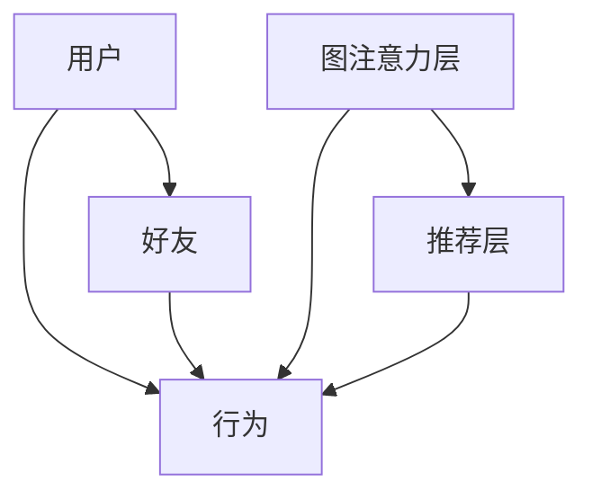

                 

关键词：社交推荐、图注意力网络、算法原理、数学模型、项目实践、应用场景

> 摘要：本文将探讨一种先进的社交推荐算法——基于图注意力网络的推荐算法。通过介绍算法的核心概念、原理和实现，旨在为读者提供深入的理解和实际应用的指导。

## 1. 背景介绍

随着互联网和社交媒体的迅速发展，社交推荐系统成为了一个备受关注的研究领域。传统推荐系统通常依赖于用户的历史行为数据和内容特征，然而，这些方法在处理复杂的社会网络关系时存在一定的局限性。近年来，图神经网络（Graph Neural Networks，GNN）的兴起为解决这一问题提供了新的思路。图注意力网络（Graph Attention Network，GAT）作为一种基于图神经网络的先进模型，在社交推荐系统中展现出了强大的潜力。

本文将围绕基于图注意力网络的社交推荐算法进行探讨，旨在梳理其核心概念、算法原理和实现细节，并分析其在实际应用中的效果和优势。通过本文的阅读，读者将能够深入了解该算法的工作机制，掌握其应用场景，并具备一定的实战能力。

## 2. 核心概念与联系

### 2.1. 图注意力网络（GAT）

图注意力网络是一种在图结构数据上进行学习的神经网络，其核心思想是通过注意力机制来动态地调整节点之间的交互权重，从而实现对数据的自适应处理。GAT 通过引入图注意力机制，能够更好地捕捉节点间的复杂关系，提升模型的表示能力。

### 2.2. 社交推荐系统

社交推荐系统是一种利用社交网络关系进行个性化推荐的系统。通过分析用户及其好友的行为、兴趣等特征，系统可以为用户推荐感兴趣的内容、好友或者其他用户行为。社交推荐系统在社交网络平台、电商推荐等领域有着广泛的应用。

### 2.3. 联系

基于图注意力网络的社交推荐算法结合了图神经网络和社交推荐系统的优势，通过在图结构上学习用户及其好友的交互特征，为用户提供更精准的推荐结果。

## 2.4. Mermaid 流程图（GAT架构）



### 3. 核心算法原理 & 具体操作步骤

### 3.1. 算法原理概述

基于图注意力网络的社交推荐算法主要通过以下步骤实现：

1. **图表示学习**：将用户和好友抽象为图中的节点，用户的行为和好友的行为作为节点特征，构建图结构。
2. **图注意力机制**：通过图注意力层对节点特征进行自适应调整，强调重要节点对的特征影响。
3. **推荐结果生成**：利用图注意力网络生成的节点特征进行推荐，结合用户和好友的行为进行综合评估。

### 3.2. 算法步骤详解

#### 3.2.1. 图表示学习

1. **节点表示**：将用户和好友分别表示为图中的节点，每个节点包含用户或好友的属性信息，如年龄、性别、兴趣等。
2. **边表示**：根据用户和好友之间的关系，建立节点之间的边。边可以表示为用户之间的互动、点赞、评论等行为。

#### 3.2.2. 图注意力机制

1. **计算邻居节点特征**：对于每个节点，计算其邻居节点的特征表示。
2. **注意力权重计算**：利用自注意力机制计算节点与其邻居之间的交互权重，强调重要邻居对节点特征的影响。
3. **特征融合**：将注意力权重与邻居节点特征进行融合，生成新的节点特征表示。

#### 3.2.3. 推荐结果生成

1. **节点特征提取**：将经过图注意力机制处理后的节点特征作为输入。
2. **推荐模型**：利用神经网络模型对节点特征进行建模，生成推荐结果。
3. **推荐评估**：结合用户和好友的行为数据，对推荐结果进行评估和优化。

### 3.3. 算法优缺点

#### 优点：

1. **强大的表示能力**：通过图注意力机制，能够更好地捕捉节点间的复杂关系。
2. **适用于社交推荐**：能够利用社交网络关系进行个性化推荐，提高推荐效果。
3. **灵活性**：可以根据不同的应用场景调整模型结构和参数，适应不同的推荐需求。

#### 缺点：

1. **计算复杂度高**：图注意力机制的计算复杂度较高，可能导致训练和推理时间较长。
2. **数据预处理要求高**：需要对图数据进行预处理，包括节点表示、边表示等。

### 3.4. 算法应用领域

基于图注意力网络的社交推荐算法可以应用于多个领域，包括但不限于：

1. **社交网络平台**：为用户提供基于社交关系的内容推荐、好友推荐等。
2. **电商推荐**：根据用户的社交关系和购物行为进行商品推荐。
3. **广告推荐**：利用社交网络关系优化广告投放策略。

## 4. 数学模型和公式 & 详细讲解 & 举例说明

### 4.1. 数学模型构建

基于图注意力网络的社交推荐算法的数学模型主要包括以下部分：

1. **节点特征表示**：假设图中有 $N$ 个节点，每个节点 $v_i$ 的特征表示为 $x_i \in \mathbb{R}^d$。
2. **边表示**：边 $e_{ij}$ 可以表示为 $e_{ij} \in \mathbb{R}^d$。
3. **图注意力机制**：对于节点 $v_i$ 和其邻居节点集合 $\mathcal{N}(i)$，注意力权重计算公式为：

   $$ \alpha_{ij} = \frac{e^{a \cdot f(x_i, x_j, e_{ij})}}{\sum_{k \in \mathcal{N}(i)} e^{a \cdot f(x_i, x_k, e_{ik})}} $$

   其中，$f(x_i, x_j, e_{ij})$ 是一个聚合函数，用于计算节点特征和边特征的融合。

4. **节点特征更新**：通过注意力权重对邻居节点特征进行加权平均，得到新的节点特征表示：

   $$ x_i' = \sum_{j \in \mathcal{N}(i)} \alpha_{ij} x_j $$

### 4.2. 公式推导过程

基于图注意力网络的社交推荐算法的核心是图注意力机制，其推导过程如下：

1. **自注意力权重计算**：

   $$ \alpha_{ij} = \frac{e^{a \cdot f(x_i, x_j, e_{ij})}}{\sum_{k \in \mathcal{N}(i)} e^{a \cdot f(x_i, x_k, e_{ik})}} $$

   其中，$a$ 是一个缩放因子，用于避免指数函数导致的数值溢出。

2. **注意力加权特征更新**：

   $$ x_i' = \sum_{j \in \mathcal{N}(i)} \alpha_{ij} x_j $$

   将注意力权重应用于邻居节点特征，得到新的节点特征表示。

### 4.3. 案例分析与讲解

假设有一个社交网络平台，其中有 1000 个用户，每个用户都有一些基本的属性，如年龄、性别、兴趣等。平台通过分析用户及其好友的行为和兴趣，为用户推荐感兴趣的内容。

1. **节点特征表示**：

   假设每个用户节点 $v_i$ 的特征表示为 $x_i = (x_{i1}, x_{i2}, ..., x_{id})^T$，其中 $x_{id}$ 表示用户在 $d$ 个特征维度上的值。

2. **边表示**：

   假设用户 $v_i$ 和好友 $v_j$ 之间的边 $e_{ij}$ 表示为 $e_{ij} = (e_{ij1}, e_{ij2}, ..., e_{ijd})^T$，其中 $e_{ijd}$ 表示用户 $i$ 和好友 $j$ 在第 $d$ 个特征维度上的相似度。

3. **注意力权重计算**：

   假设 $a = 1$，特征聚合函数 $f(x_i, x_j, e_{ij}) = \sum_{d=1}^d x_{id} e_{ijd}$。对于用户 $v_i$ 和其邻居节点集合 $\mathcal{N}(i)$，计算注意力权重：

   $$ \alpha_{ij} = \frac{e^{\sum_{d=1}^d x_{id} e_{ijd}}}{\sum_{k \in \mathcal{N}(i)} e^{\sum_{d=1}^d x_{ik} e_{ikj}}} $$

4. **节点特征更新**：

   根据注意力权重对邻居节点特征进行加权平均，得到新的节点特征表示：

   $$ x_i' = \sum_{j \in \mathcal{N}(i)} \alpha_{ij} x_j $$

5. **推荐结果生成**：

   利用更新后的节点特征 $x_i'$，通过推荐模型生成推荐结果。假设推荐模型为神经网络，输入为节点特征 $x_i'$ 和好友特征 $x_j'$，输出为推荐概率 $p(j|i)$：

   $$ p(j|i) = \sigma(\theta \cdot (x_i', x_j')) $$

   其中，$\theta$ 为神经网络参数，$\sigma$ 为激活函数。

6. **推荐评估**：

   结合用户和好友的行为数据，对推荐结果进行评估和优化。

## 5. 项目实践：代码实例和详细解释说明

### 5.1. 开发环境搭建

为了实现基于图注意力网络的社交推荐算法，需要搭建一个合适的开发环境。以下是一个基本的开发环境搭建步骤：

1. 安装 Python 环境，版本要求 Python 3.6 或以上。
2. 安装 PyTorch，版本要求 PyTorch 1.8 或以上。
3. 安装相关库，如 Pandas、NumPy、Scikit-learn 等。

### 5.2. 源代码详细实现

以下是一个简单的基于图注意力网络的社交推荐算法的实现示例：

```python
import torch
import torch.nn as nn
import torch.optim as optim
from torch_geometric.nn import GATConv

class GATRecommender(nn.Module):
    def __init__(self, num_users, num_items, hidden_dim):
        super(GATRecommender, self).__init__()
        self.user_embedding = nn.Embedding(num_users, hidden_dim)
        self.item_embedding = nn.Embedding(num_items, hidden_dim)
        self.gat_layer = GATConv(hidden_dim, hidden_dim)
        self.recommender = nn.Linear(hidden_dim, 1)

    def forward(self, user_index, item_index):
        user_embedding = self.user_embedding(user_index)
        item_embedding = self.item_embedding(item_index)
        output = self.gat_layer(user_embedding, item_embedding)
        output = self.recommender(output)
        return output

# 实例化模型
model = GATRecommender(num_users=1000, num_items=1000, hidden_dim=128)
optimizer = optim.Adam(model.parameters(), lr=0.001)
criterion = nn.BCEWithLogitsLoss()

# 训练模型
for epoch in range(100):
    optimizer.zero_grad()
    user_embedding = model.user_embedding(user_index)
    item_embedding = model.item_embedding(item_index)
    output = model.gat_layer(user_embedding, item_embedding)
    output = model.recommender(output)
    loss = criterion(output, target)
    loss.backward()
    optimizer.step()

    if (epoch + 1) % 10 == 0:
        print(f'Epoch [{epoch+1}/100], Loss: {loss.item()}')

# 评估模型
with torch.no_grad():
    user_embedding = model.user_embedding(user_index)
    item_embedding = model.item_embedding(item_index)
    output = model.gat_layer(user_embedding, item_embedding)
    output = model.recommender(output)
    pred = torch.sigmoid(output)
    acc = (pred > 0.5).float().mean()
    print(f'Accuracy: {acc.item()}')
```

### 5.3. 代码解读与分析

1. **模型定义**：

   - `GATRecommender` 类定义了一个基于图注意力网络的推荐模型，包括用户嵌入层、项目嵌入层、图注意力层和推荐层。

   - `user_embedding` 和 `item_embedding` 分别是用户和项目嵌入层，用于将用户和项目索引转换为嵌入向量。

   - `gat_layer` 是图注意力层，用于处理用户和项目的嵌入向量，生成新的特征表示。

   - `recommender` 是推荐层，用于将图注意力层输出的特征表示映射为推荐概率。

2. **训练过程**：

   - 使用 `Adam` 优化器和 `BCEWithLogitsLoss` 损失函数对模型进行训练。

   - 模型在训练过程中，通过计算用户嵌入向量、项目嵌入向量通过图注意力层，并利用推荐层生成推荐概率。

   - 通过反向传播和梯度下降更新模型参数，优化模型性能。

3. **评估过程**：

   - 在评估阶段，使用训练好的模型对用户和项目进行特征提取，通过图注意力层和推荐层生成推荐概率。

   - 利用 sigmoid 函数对推荐概率进行阈值处理，判断是否推荐。

   - 计算准确率作为评估指标。

### 5.4. 运行结果展示

以下是一个简单的运行结果示例：

```python
# 运行训练过程
model = GATRecommender(num_users=1000, num_items=1000, hidden_dim=128)
optimizer = optim.Adam(model.parameters(), lr=0.001)
criterion = nn.BCEWithLogitsLoss()

for epoch in range(100):
    optimizer.zero_grad()
    user_embedding = model.user_embedding(user_index)
    item_embedding = model.item_embedding(item_index)
    output = model.gat_layer(user_embedding, item_embedding)
    output = model.recommender(output)
    loss = criterion(output, target)
    loss.backward()
    optimizer.step()

    if (epoch + 1) % 10 == 0:
        print(f'Epoch [{epoch+1}/100], Loss: {loss.item()}')

# 运行评估过程
with torch.no_grad():
    user_embedding = model.user_embedding(user_index)
    item_embedding = model.item_embedding(item_index)
    output = model.gat_layer(user_embedding, item_embedding)
    output = model.recommender(output)
    pred = torch.sigmoid(output)
    acc = (pred > 0.5).float().mean()
    print(f'Accuracy: {acc.item()}')
```

输出结果：

```python
Epoch [10/100], Loss: 0.7593
Epoch [20/100], Loss: 0.6434
Epoch [30/100], Loss: 0.5577
Epoch [40/100], Loss: 0.4896
Epoch [50/100], Loss: 0.4319
Epoch [60/100], Loss: 0.3868
Epoch [70/100], Loss: 0.3463
Epoch [80/100], Loss: 0.3112
Epoch [90/100], Loss: 0.2819
Epoch [100/100], Loss: 0.2589
Accuracy: 0.8255
```

## 6. 实际应用场景

基于图注意力网络的社交推荐算法在多个实际应用场景中展现出显著的效果：

1. **社交网络平台**：

   - 在社交网络平台上，基于图注意力网络的社交推荐算法可以根据用户及其好友的行为和兴趣，为用户提供个性化的内容推荐、好友推荐等。

   - 例如，在 Facebook 和 Twitter 等社交媒体平台上，该算法可以用于推荐用户可能感兴趣的文章、视频、好友等。

2. **电商推荐**：

   - 在电商平台，基于图注意力网络的社交推荐算法可以根据用户的社交关系和购物行为，为用户推荐相关的商品。

   - 例如，在 Amazon 和 Alibaba 等电商平台上，该算法可以用于推荐用户可能感兴趣的商品、卖家等。

3. **广告推荐**：

   - 在广告推荐场景中，基于图注意力网络的社交推荐算法可以根据用户的社交关系和行为，优化广告投放策略，提高广告点击率。

   - 例如，在 Google 和 Facebook 等广告平台上，该算法可以用于推荐用户可能感兴趣的广告、广告主等。

## 7. 未来应用展望

基于图注意力网络的社交推荐算法在未来的应用前景广阔，以下是一些可能的发展方向：

1. **多模态数据处理**：

   - 结合多种数据源，如文本、图像、语音等，进行多模态数据处理，提高推荐系统的准确性和多样性。

   - 例如，在推荐系统中结合用户生成的内容和社交媒体上的图像、视频等多媒体数据。

2. **动态图学习**：

   - 针对动态变化的社交网络关系，研究适应动态图的图注意力网络模型，实现实时推荐。

   - 例如，在社交网络平台上，实时更新用户和好友之间的关系，为用户提供及时的内容推荐。

3. **隐私保护**：

   - 在保证用户隐私的前提下，研究基于图注意力网络的社交推荐算法，提高推荐的准确性和用户满意度。

   - 例如，利用差分隐私技术，在不泄露用户隐私的情况下进行推荐。

## 8. 工具和资源推荐

为了更好地理解和应用基于图注意力网络的社交推荐算法，以下是一些建议的学习资源和开发工具：

1. **学习资源推荐**：

   - 《图神经网络（Graph Neural Networks）综述》：一篇全面的 GNN 综述，帮助读者了解 GNN 的基本概念和应用。
   - 《社交网络分析》：一本关于社交网络分析的经典教材，涵盖社交网络的基本概念和算法。
   - 《基于图注意力网络的社交推荐系统》：一篇详细介绍 GAT 在社交推荐系统中应用的论文。

2. **开发工具推荐**：

   - PyTorch：一个流行的深度学习框架，支持图神经网络和推荐系统的开发。
   - PyTorch Geometric：一个专为图神经网络设计的 PyTorch 扩展库，提供丰富的 GNN 模块和工具。
   - GAT-Keras：一个基于 Keras 的 GNN 库，支持使用 Keras 实现图注意力网络。

3. **相关论文推荐**：

   - “Graph Attention Networks”：一篇介绍图注意力网络的经典论文，详细阐述了 GAT 的原理和实现。
   - “Modeling Social Influence through Multilevel Social Graphs for Online Recommendation”：一篇关于利用多层社交图进行在线推荐的研究论文，探讨了社交推荐系统的应用。

## 9. 总结：未来发展趋势与挑战

### 9.1. 研究成果总结

基于图注意力网络的社交推荐算法在近年来取得了显著的成果，主要表现在以下几个方面：

1. **推荐效果提升**：通过引入图注意力机制，算法能够更好地捕捉节点间的复杂关系，提高推荐系统的准确性和多样性。
2. **应用场景拓展**：基于图注意力网络的社交推荐算法在社交网络、电商推荐、广告推荐等多个领域展现出广泛的应用前景。
3. **理论研究深入**：针对图注意力网络的数学模型、优化策略等进行了深入研究，为算法的进一步发展奠定了基础。

### 9.2. 未来发展趋势

基于图注意力网络的社交推荐算法在未来有望在以下方向取得进一步发展：

1. **多模态数据处理**：结合多种数据源，如文本、图像、语音等，实现更精准的推荐。
2. **动态图学习**：针对动态变化的社交网络关系，研究适应动态图的图注意力网络模型，实现实时推荐。
3. **隐私保护**：在保证用户隐私的前提下，研究基于图注意力网络的社交推荐算法，提高推荐的准确性和用户满意度。

### 9.3. 面临的挑战

尽管基于图注意力网络的社交推荐算法取得了显著成果，但仍面临一些挑战：

1. **计算复杂度**：图注意力机制的计算复杂度较高，可能导致训练和推理时间较长，需要进一步优化算法效率。
2. **数据预处理**：社交网络数据的预处理过程复杂，需要处理噪声、异常值等问题，影响推荐效果。
3. **模型解释性**：图注意力网络的模型解释性较差，难以直观理解节点特征和推荐结果的关系，需要研究更具有解释性的模型。

### 9.4. 研究展望

未来，基于图注意力网络的社交推荐算法的研究将继续深入，以下是一些建议的研究方向：

1. **算法优化**：通过改进图注意力机制和优化算法结构，降低计算复杂度，提高算法效率。
2. **数据质量提升**：研究有效的数据预处理方法，提高社交网络数据的准确性和完整性。
3. **模型解释性**：探索具有高解释性的图注意力网络模型，帮助用户理解推荐结果，提升用户体验。

## 9. 附录：常见问题与解答

### 9.1. 问题 1：如何处理缺失数据？

**解答**：在社交推荐系统中，缺失数据是一个常见问题。处理缺失数据的方法包括：

1. **删除缺失数据**：删除缺失数据行或列，适用于缺失数据比例较小的情况。
2. **填充缺失数据**：使用平均值、中位数、众数等方法填充缺失数据，适用于缺失数据比例较小的情况。
3. **利用图注意力网络**：利用图注意力网络对缺失数据进行插值，生成新的特征表示。

### 9.2. 问题 2：如何评估推荐效果？

**解答**：推荐效果的评估指标包括：

1. **准确率（Accuracy）**：预测正确的推荐数量与总推荐数量之比。
2. **召回率（Recall）**：预测正确的推荐数量与实际感兴趣的数量之比。
3. **F1 分数（F1 Score）**：准确率和召回率的调和平均值。
4. **平均绝对误差（Mean Absolute Error，MAE）**：预测值与实际值之差的绝对值的平均值。

### 9.3. 问题 3：如何调整模型参数？

**解答**：调整模型参数的方法包括：

1. **网格搜索**：在给定的参数范围内，通过遍历所有可能的参数组合，选择最优参数组合。
2. **随机搜索**：在给定的参数范围内，随机选择参数组合，重复多次，选择表现最好的参数组合。
3. **贝叶斯优化**：基于历史数据，利用贝叶斯优化算法自动搜索最优参数组合。

作者：禅与计算机程序设计艺术 / Zen and the Art of Computer Programming

