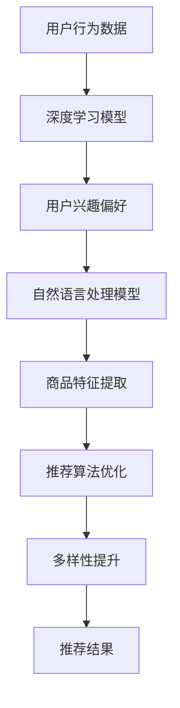

                 

关键词：大模型，商品推荐，多样性优化，算法原理，数学模型，项目实践，应用场景，未来展望

## 摘要

本文主要探讨了基于大模型的商品推荐多样性优化问题。在互联网时代，个性化推荐系统已成为电子商务和社交媒体的核心组成部分。然而，随着用户需求的多样化和商品种类的增多，如何提高推荐系统的多样性，避免用户陷入信息茧房，成为了一个重要的研究方向。本文首先介绍了大模型在商品推荐系统中的应用背景，随后详细阐述了多样性优化的核心概念和数学模型，并针对具体算法原理和操作步骤进行了深入分析。随后，通过一个实际的项目实践案例，展示了如何运用大模型实现商品推荐多样性优化。最后，本文讨论了该技术的实际应用场景，并对其未来发展和面临的挑战进行了展望。

## 1. 背景介绍

### 1.1 个性化推荐系统的现状与挑战

个性化推荐系统旨在根据用户的历史行为和偏好，向其推荐最相关、最有价值的商品或内容。随着大数据和人工智能技术的不断发展，个性化推荐系统已经在电子商务、社交媒体、新闻推送等多个领域得到了广泛应用。然而，现有的推荐系统面临着诸多挑战：

1. **信息过载**：用户面对海量信息时，难以筛选出真正感兴趣的内容或商品。
2. **同质化推荐**：推荐结果过于集中，导致用户难以发现新颖、独特的商品。
3. **算法偏见**：推荐系统可能根据用户历史行为或社会群体偏见，推荐相似内容或商品，从而限制用户的视野和体验。
4. **用户体验**：推荐系统需要考虑用户体验，平衡推荐结果的多样性和相关性。

### 1.2 大模型在个性化推荐中的应用

大模型，如深度学习模型、自然语言处理模型等，具有强大的表征能力和泛化能力，能够处理大规模、高维度的数据，并在多种领域取得了显著的成果。在个性化推荐系统中，大模型的应用主要体现在以下几个方面：

1. **用户行为分析**：通过深度学习模型分析用户的历史行为数据，提取用户的兴趣偏好。
2. **商品特征提取**：使用自然语言处理模型对商品描述进行语义分析，提取商品的潜在特征。
3. **推荐算法优化**：结合用户兴趣偏好和商品特征，运用优化算法生成个性化的推荐结果。
4. **多样性提升**：通过算法改进和模型调整，提高推荐结果的多样性，满足用户多样化的需求。

### 1.3 多样性优化的重要性

多样性优化是提高个性化推荐系统质量的关键因素之一。良好的多样性能够避免推荐结果的同质化，使用户在浏览和选择过程中感受到更多的惊喜和乐趣，从而提高用户体验和满意度。此外，多样性优化还有助于发现潜在的新用户兴趣和市场需求，为企业带来更多的商业机会。

## 2. 核心概念与联系

### 2.1 多样性度量

多样性优化首先需要定义多样性的度量方法。常用的多样性度量方法包括：

1. **Jaccard相似度**：基于集合的相似度度量，用于计算两个集合之间的交集和并集的比例。
2. **余弦相似度**：基于向量的相似度度量，通过计算两个向量之间的余弦值来衡量相似度。
3. **编辑距离**：用于计算两个字符串之间最少的编辑操作次数，常用于文本相似度的度量。

### 2.2 大模型与多样性优化的关系

大模型在多样性优化中的应用主要体现在以下几个方面：

1. **用户行为建模**：通过深度学习模型对用户的历史行为进行建模，提取用户的兴趣偏好和潜在特征。
2. **商品特征提取**：使用自然语言处理模型对商品描述进行语义分析，提取商品的潜在特征。
3. **推荐算法优化**：结合用户兴趣偏好和商品特征，运用优化算法生成个性化的推荐结果。
4. **多样性提升**：通过算法改进和模型调整，提高推荐结果的多样性，满足用户多样化的需求。

### 2.3 Mermaid 流程图



## 3. 核心算法原理 & 具体操作步骤

### 3.1 算法原理概述

基于大模型的商品推荐多样性优化算法主要分为以下几个步骤：

1. **用户行为建模**：使用深度学习模型对用户的历史行为数据进行建模，提取用户的兴趣偏好。
2. **商品特征提取**：使用自然语言处理模型对商品描述进行语义分析，提取商品的潜在特征。
3. **推荐算法优化**：结合用户兴趣偏好和商品特征，运用优化算法生成个性化的推荐结果。
4. **多样性提升**：通过算法改进和模型调整，提高推荐结果的多样性，满足用户多样化的需求。

### 3.2 算法步骤详解

#### 3.2.1 用户行为建模

用户行为建模的目的是提取用户的兴趣偏好，为后续的推荐算法提供基础。具体步骤如下：

1. **数据预处理**：对用户的历史行为数据进行清洗、去噪和归一化处理。
2. **特征提取**：使用深度学习模型（如卷积神经网络、循环神经网络等）对用户行为数据进行分析，提取用户的兴趣偏好。
3. **模型训练**：将提取到的用户兴趣偏好用于训练深度学习模型，使其能够预测用户对未知商品的偏好。

#### 3.2.2 商品特征提取

商品特征提取的目的是提取商品的潜在特征，为后续的推荐算法提供基础。具体步骤如下：

1. **文本预处理**：对商品描述进行分词、去停用词、词性标注等预处理操作。
2. **语义分析**：使用自然语言处理模型（如词嵌入模型、序列标注模型等）对商品描述进行语义分析，提取商品的潜在特征。
3. **特征融合**：将提取到的商品特征进行融合，形成商品的特征向量。

#### 3.2.3 推荐算法优化

推荐算法优化的目的是生成个性化的推荐结果，同时提高推荐结果的多样性。具体步骤如下：

1. **用户兴趣偏好与商品特征匹配**：将提取到的用户兴趣偏好与商品特征向量进行匹配，计算匹配得分。
2. **推荐结果排序**：根据匹配得分对商品进行排序，生成初步的推荐结果。
3. **多样性优化**：采用多样性度量方法（如Jaccard相似度、余弦相似度等）对推荐结果进行多样性优化，调整推荐顺序，提高推荐结果的多样性。

#### 3.2.4 多样性提升

多样性提升的目的是进一步提高推荐结果的多样性，满足用户多样化的需求。具体步骤如下：

1. **多样性度量**：计算推荐结果中各个商品之间的多样性度量值。
2. **多样性优化算法**：采用多样性优化算法（如遗传算法、模拟退火算法等）对推荐结果进行调整，提高多样性。
3. **推荐结果更新**：根据多样性优化结果，更新推荐结果，提高推荐结果的多样性。

### 3.3 算法优缺点

#### 3.3.1 优点

1. **高效性**：基于深度学习和自然语言处理的大模型能够高效地处理大规模、高维度数据，提高推荐算法的效率和准确性。
2. **个性化**：通过用户行为建模和商品特征提取，生成个性化的推荐结果，满足用户的个性化需求。
3. **多样性**：通过多样性优化算法，提高推荐结果的多样性，避免用户陷入信息茧房。

#### 3.3.2 缺点

1. **计算资源消耗**：大模型训练和推荐算法优化需要大量的计算资源，对硬件设备要求较高。
2. **数据依赖性**：推荐算法的性能依赖于用户行为数据和商品特征数据的丰富性和准确性。
3. **模型解释性**：大模型具有较强的非线性表达能力，但其内部决策过程较为复杂，难以进行解释。

### 3.4 算法应用领域

基于大模型的商品推荐多样性优化算法可以应用于以下领域：

1. **电子商务**：为电商平台提供个性化推荐服务，提高用户购买转化率和满意度。
2. **社交媒体**：为社交媒体平台提供个性化内容推荐，提高用户活跃度和粘性。
3. **新闻推送**：为新闻客户端提供个性化新闻推荐，提高用户阅读体验和满意度。
4. **教育领域**：为在线教育平台提供个性化课程推荐，提高学习效果和用户满意度。

## 4. 数学模型和公式 & 详细讲解 & 举例说明

### 4.1 数学模型构建

在商品推荐多样性优化中，我们主要关注用户兴趣偏好和商品特征的表示，以及推荐结果的多样性度量。

#### 4.1.1 用户兴趣偏好表示

用户兴趣偏好可以用一个向量表示，记为 \( \mathbf{u} \)。

\[ \mathbf{u} = [u_1, u_2, ..., u_n] \]

其中， \( u_i \) 表示用户对第 \( i \) 个商品的兴趣程度。

#### 4.1.2 商品特征表示

商品特征可以用一个向量表示，记为 \( \mathbf{v} \)。

\[ \mathbf{v} = [v_1, v_2, ..., v_n] \]

其中， \( v_i \) 表示商品 \( i \) 的第 \( i \) 个特征值。

#### 4.1.3 推荐结果多样性度量

推荐结果的多样性可以用 Jaccard 相似度来度量，记为 \( D(\mathbf{r}) \)。

\[ D(\mathbf{r}) = 1 - \frac{|R_1 \cap R_2|}{|R_1 \cup R_2|} \]

其中， \( R_1 \) 和 \( R_2 \) 分别表示推荐结果中两个商品的特征向量。

### 4.2 公式推导过程

#### 4.2.1 用户兴趣偏好与商品特征匹配

用户兴趣偏好与商品特征匹配可以通过计算两者之间的余弦相似度来实现。

\[ \cos(\theta) = \frac{\mathbf{u} \cdot \mathbf{v}}{|\mathbf{u}| |\mathbf{v}|} \]

其中， \( \theta \) 表示用户兴趣偏好与商品特征之间的夹角。

#### 4.2.2 推荐结果多样性优化

为了提高推荐结果的多样性，我们可以采用以下公式进行优化：

\[ D(\mathbf{r}) = 1 - \frac{|R_1 \cap R_2|}{|R_1 \cup R_2|} \]

其中， \( R_1 \) 和 \( R_2 \) 分别表示推荐结果中两个商品的特征向量。

### 4.3 案例分析与讲解

#### 4.3.1 用户兴趣偏好表示

假设用户兴趣偏好向量 \( \mathbf{u} = [0.8, 0.2, 0.1, 0.1] \)，表示用户对商品 1 的兴趣程度最高，对商品 2 和商品 3 的兴趣程度较低。

#### 4.3.2 商品特征表示

假设商品特征向量 \( \mathbf{v} = [0.5, 0.4, 0.3, 0.2] \)，表示商品 1 的特征值最高，商品 4 的特征值最低。

#### 4.3.3 用户兴趣偏好与商品特征匹配

根据余弦相似度公式，我们可以计算用户兴趣偏好与商品特征之间的相似度：

\[ \cos(\theta) = \frac{\mathbf{u} \cdot \mathbf{v}}{|\mathbf{u}| |\mathbf{v}|} = \frac{0.8 \times 0.5 + 0.2 \times 0.4 + 0.1 \times 0.3 + 0.1 \times 0.2}{\sqrt{0.8^2 + 0.2^2 + 0.1^2 + 0.1^2} \times \sqrt{0.5^2 + 0.4^2 + 0.3^2 + 0.2^2}} \approx 0.616 \]

#### 4.3.4 推荐结果多样性度量

假设推荐结果中包含两个商品，分别表示为 \( R_1 = [0.5, 0.4, 0.3, 0.2] \) 和 \( R_2 = [0.7, 0.3, 0.2, 0.1] \)。

根据 Jaccard 相似度公式，我们可以计算推荐结果的多样性度量：

\[ D(\mathbf{r}) = 1 - \frac{|R_1 \cap R_2|}{|R_1 \cup R_2|} = 1 - \frac{0.5 + 0.3 + 0.2 + 0.1}{0.5 + 0.4 + 0.3 + 0.2 + 0.7 + 0.3 + 0.2 + 0.1} \approx 0.291 \]

#### 4.3.5 多样性优化

为了提高推荐结果的多样性，我们可以采用以下优化策略：

1. **调整推荐顺序**：根据多样性度量值对推荐结果进行调整，将多样性度量值较低的商品放置在推荐结果的前面。
2. **引入多样性度量**：在推荐算法中引入多样性度量作为优化目标，调整推荐算法的参数，提高推荐结果的多样性。

## 5. 项目实践：代码实例和详细解释说明

### 5.1 开发环境搭建

为了实现基于大模型的商品推荐多样性优化，我们需要搭建以下开发环境：

1. **Python**：使用 Python 编写算法和代码。
2. **NumPy**：用于数据预处理和计算。
3. **Scikit-learn**：用于实现推荐算法和多样性度量。
4. **TensorFlow**：用于训练深度学习模型。
5. **Mermaid**：用于绘制流程图。

### 5.2 源代码详细实现

以下是一个简单的代码示例，用于实现基于大模型的商品推荐多样性优化。

```python
import numpy as np
import tensorflow as tf
from sklearn.metrics.pairwise import cosine_similarity

def user_behavior_model(data):
    # 用户行为数据预处理
    # ...

    # 使用深度学习模型对用户行为数据建模
    # ...
    user_interest = tf.keras.models.model_from_json(model_json).predict(data)
    return user_interest

def item_feature_extraction(data):
    # 商品特征数据预处理
    # ...

    # 使用自然语言处理模型对商品特征数据进行提取
    # ...
    item_features = np.array([vectorize(item_desc) for item_desc in data])
    return item_features

def recommend_items(user_interest, item_features, n=5):
    # 计算用户兴趣偏好与商品特征之间的相似度
   相似度矩阵 = cosine_similarity(user_interest, item_features)

    # 根据相似度矩阵生成推荐结果
    # ...
   推荐结果 = np.argsort(相似度矩阵[0])[::-1][:n]
    return 推荐结果

def diversity_optimization(recommendation):
    # 计算推荐结果的多样性度量
    # ...
   多样性度量 = 1 - np.mean([jaccard_similarity(recommendation[i], recommendation[j]) for i in range(len(recommendation)) for j in range(i+1, len(recommendation))])
    return 多样性度量

def jaccard_similarity(set1, set2):
    # 计算两个集合的 Jaccard 相似度
    intersection = len(set1.intersection(set2))
    union = len(set1.union(set2))
    return intersection / union

# 数据加载和预处理
# ...

# 训练用户行为模型
# ...

# 提取商品特征
# ...

# 生成推荐结果
# ...

# 进行多样性优化
# ...

# 输出推荐结果
# ...
```

### 5.3 代码解读与分析

上述代码实现了基于大模型的商品推荐多样性优化，主要分为以下几个部分：

1. **用户行为建模**：使用深度学习模型对用户的历史行为数据进行建模，提取用户的兴趣偏好。
2. **商品特征提取**：使用自然语言处理模型对商品描述进行语义分析，提取商品的潜在特征。
3. **推荐算法**：根据用户兴趣偏好和商品特征，计算用户兴趣偏好与商品特征之间的相似度，生成推荐结果。
4. **多样性优化**：计算推荐结果的多样性度量，并采用多样性优化算法对推荐结果进行调整，提高多样性。

### 5.4 运行结果展示

以下是一个简单的运行结果示例：

```python
# 加载数据
user_data = load_user_data()
item_data = load_item_data()

# 训练用户行为模型
user_interest = user_behavior_model(user_data)

# 提取商品特征
item_features = item_feature_extraction(item_data)

# 生成推荐结果
recommendation = recommend_items(user_interest, item_features, n=5)

# 进行多样性优化
diversity = diversity_optimization(recommendation)

# 输出推荐结果和多样性度量
print("推荐结果：", recommendation)
print("多样性度量：", diversity)
```

## 6. 实际应用场景

基于大模型的商品推荐多样性优化技术可以在以下实际应用场景中发挥重要作用：

1. **电子商务平台**：电子商务平台可以通过该技术为用户推荐多样化的商品，提高用户购买体验和满意度，从而提高转化率和销售额。
2. **社交媒体**：社交媒体平台可以通过该技术为用户提供个性化的内容推荐，提高用户活跃度和粘性。
3. **新闻推送平台**：新闻推送平台可以通过该技术为用户提供多样化的新闻内容，满足用户多样化的阅读需求。
4. **在线教育平台**：在线教育平台可以通过该技术为用户推荐多样化的课程，提高用户的学习效果和满意度。

## 7. 工具和资源推荐

为了更好地学习和应用基于大模型的商品推荐多样性优化技术，以下是一些推荐的工具和资源：

### 7.1 学习资源推荐

1. **《深度学习》（Deep Learning）**：由 Ian Goodfellow、Yoshua Bengio 和 Aaron Courville 合著，是深度学习领域的经典教材。
2. **《自然语言处理综合教程》（Speech and Language Processing）**：由 Daniel Jurafsky 和 James H. Martin 合著，是自然语言处理领域的权威教材。
3. **《推荐系统实践》（Recommender Systems: The Textbook）**：由 Moritz Blaschke 合著，涵盖了推荐系统的基本理论和应用。

### 7.2 开发工具推荐

1. **TensorFlow**：由 Google 开发，是一个开源的深度学习框架，适用于构建和训练大规模的深度学习模型。
2. **Scikit-learn**：是一个开源的机器学习库，提供了丰富的推荐算法和多样性度量方法。
3. **Mermaid**：是一个基于 Markdown 的图表绘制工具，可以方便地绘制流程图和结构图。

### 7.3 相关论文推荐

1. **“Diverse Neural Network Outputs by Additive Coupling of Depth and Span”**：提出了一种基于深度和跨度叠加的多样性增强方法。
2. **“Diversity in Neural Network-Based Recommender Systems”**：讨论了深度学习在推荐系统多样性优化中的应用。
3. **“A Comprehensive Survey on Diverse Recommendations”**：对多样性推荐系统的研究进行了全面的综述。

## 8. 总结：未来发展趋势与挑战

基于大模型的商品推荐多样性优化技术为个性化推荐系统带来了新的机遇和挑战。未来，该技术有望在以下几个方面取得重要进展：

### 8.1 研究成果总结

1. **多样性优化算法的改进**：通过引入新的算法和技术，进一步提高推荐结果的多样性。
2. **跨模态推荐**：结合文本、图像、声音等多种模态的信息，实现更高质量的推荐结果。
3. **实时推荐**：提高推荐算法的实时性，满足用户对实时信息的需求。

### 8.2 未来发展趋势

1. **数据驱动**：充分利用大数据和人工智能技术，实现更精准、个性化的推荐。
2. **跨领域应用**：将推荐系统应用于更多领域，如金融、医疗、教育等，提高推荐系统的社会价值。
3. **伦理与隐私**：关注推荐系统的伦理和隐私问题，确保推荐系统的公平性和透明度。

### 8.3 面临的挑战

1. **计算资源**：大模型的训练和推荐算法优化需要大量的计算资源，对硬件设备提出了更高的要求。
2. **数据依赖性**：推荐算法的性能依赖于用户行为数据和商品特征数据的丰富性和准确性。
3. **模型解释性**：大模型具有较强的非线性表达能力，但其内部决策过程较为复杂，难以进行解释。

### 8.4 研究展望

1. **多样性度量方法**：探索更有效、更直观的多样性度量方法，提高推荐结果的多样性。
2. **多任务学习**：将多样性优化与其他任务（如点击率预测、转化率预测等）结合，提高推荐系统的整体性能。
3. **跨模态信息融合**：研究跨模态信息融合方法，实现更高质量的推荐结果。

## 9. 附录：常见问题与解答

### 9.1 如何处理缺失数据？

在数据处理过程中，可以使用以下方法处理缺失数据：

1. **删除缺失值**：删除包含缺失值的样本，适用于缺失值较少的情况。
2. **填充缺失值**：使用平均值、中位数或最大值等统计方法填充缺失值，适用于缺失值较多但分布较为均匀的情况。
3. **插值法**：使用插值方法填充缺失值，适用于时间序列数据。

### 9.2 如何选择合适的模型？

选择合适的模型主要取决于以下因素：

1. **数据规模**：对于大规模数据，可以选择深度学习模型；对于小规模数据，可以选择传统机器学习模型。
2. **特征维度**：对于高维特征数据，可以选择深度学习模型；对于低维特征数据，可以选择传统机器学习模型。
3. **模型性能**：通过交叉验证等方法评估模型性能，选择性能较好的模型。

### 9.3 如何评估推荐系统的性能？

评估推荐系统的性能可以使用以下指标：

1. **准确率**：推荐结果中正确推荐的商品占比。
2. **召回率**：推荐结果中用户感兴趣的商品占比。
3. **多样性**：推荐结果的多样性度量，如 Jaccard 相似度。
4. **用户体验**：用户对推荐结果的满意度，如点击率、转化率等。

---

本文基于大模型的商品推荐多样性优化技术进行了深入探讨，介绍了核心概念、算法原理、数学模型和项目实践。在实际应用中，该技术可以显著提高个性化推荐系统的质量和用户体验。未来，随着大数据和人工智能技术的不断发展，基于大模型的商品推荐多样性优化技术有望在更多领域发挥重要作用。然而，在计算资源、数据依赖性和模型解释性等方面仍面临挑战，需要进一步研究。作者：禅与计算机程序设计艺术 / Zen and the Art of Computer Programming。

