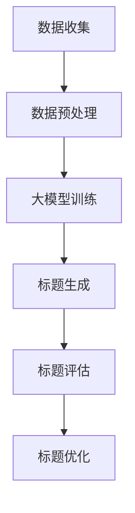
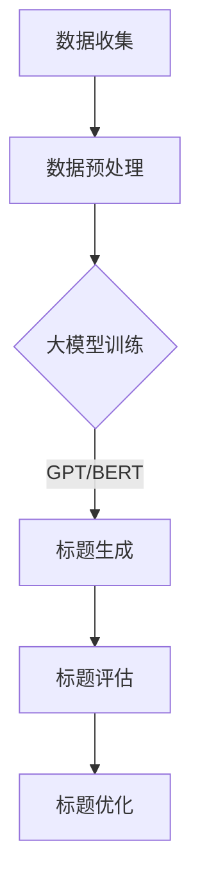

                 

关键词：大模型，商品标题，优化技术，自然语言处理，深度学习

摘要：随着电子商务的快速发展，商品标题的优化成为了提升销售转化率的关键因素。本文将探讨如何利用大模型技术，结合自然语言处理和深度学习的方法，对商品标题进行优化，提高用户的阅读体验和购买意愿。

## 1. 背景介绍

在电子商务领域，商品标题的优化是一个关键环节。一个优秀的商品标题不仅能准确传达商品的核心信息，还能吸引潜在消费者的注意力，从而提高点击率和转化率。传统的商品标题优化方法主要依赖于规则匹配和关键词筛选等技术，但这些方法往往无法充分理解商品和用户需求的复杂关系。

近年来，随着自然语言处理（NLP）和深度学习技术的快速发展，大模型技术逐渐成为商品标题优化的重要工具。大模型通过训练大量的文本数据，可以自动学习语言结构和语义关系，从而生成更符合用户需求的标题。本文将介绍如何利用大模型技术进行商品标题的优化，并探讨其应用前景。

## 2. 核心概念与联系

### 2.1 大模型技术

大模型技术指的是利用深度学习算法，在大量文本数据上进行训练，以实现自然语言理解和生成。常见的大模型包括GPT（Generative Pre-trained Transformer）和BERT（Bidirectional Encoder Representations from Transformers）等。

### 2.2 自然语言处理

自然语言处理是计算机科学和人工智能领域的一个分支，旨在使计算机能够理解、生成和处理自然语言。NLP技术在大模型训练和数据预处理中起着重要作用。

### 2.3 深度学习

深度学习是一种人工智能方法，通过模拟人脑的神经网络结构，对大量数据进行分析和建模。深度学习在大模型技术中起着核心作用，能够自动提取特征和发现复杂模式。

### 2.4 Mermaid 流程图

以下是一个描述大模型技术在商品标题优化中应用过程的Mermaid流程图：



## 3. 核心算法原理 & 具体操作步骤

### 3.1 算法原理概述

大模型技术通过在大量文本数据上进行预训练，可以自动学习语言结构和语义关系。在商品标题优化的过程中，大模型可以用于生成新的标题，并通过评估和优化算法，提高标题的质量。

### 3.2 算法步骤详解

#### 3.2.1 数据收集

首先，我们需要收集大量的商品数据，包括商品名称、描述、用户评论等。这些数据将用于大模型的训练和标题生成。

#### 3.2.2 数据预处理

对收集到的数据进行清洗和预处理，包括去除无关信息、统一文本格式、分词等操作。预处理后的数据将用于大模型的训练。

#### 3.2.3 大模型训练

使用预处理后的数据，对大模型进行训练。训练过程包括前向传播、反向传播和参数更新等步骤。

#### 3.2.4 标题生成

利用训练好的大模型，生成新的商品标题。生成过程包括标题提取、标题扩充和标题调整等步骤。

#### 3.2.5 标题评估

对生成的标题进行评估，包括语义评估、情感分析和点击率预测等。评估结果将用于指导标题优化。

#### 3.2.6 标题优化

根据评估结果，对生成的标题进行优化。优化过程包括标题筛选、标题调整和标题重写等。

### 3.3 算法优缺点

#### 优点

1. **自动性**：大模型技术可以自动学习语言结构和语义关系，减少人工干预。
2. **灵活性**：大模型可以生成各种类型的标题，适应不同商品和用户需求。
3. **准确性**：大模型通过大量数据训练，可以生成更准确、更符合用户需求的标题。

#### 缺点

1. **计算资源消耗**：大模型训练和生成过程需要大量计算资源。
2. **数据依赖**：大模型的性能高度依赖于训练数据的质量和数量。

### 3.4 算法应用领域

大模型技术在商品标题优化中的应用非常广泛，包括电子商务平台、搜索引擎、社交媒体等。此外，大模型技术还可以用于其他自然语言处理任务，如文本分类、机器翻译和问答系统等。

## 4. 数学模型和公式 & 详细讲解 & 举例说明

### 4.1 数学模型构建

大模型训练过程中，常用的数学模型包括深度神经网络（DNN）和Transformer等。以下是一个简单的DNN模型：

```latex
\begin{equation}
y = f(z)
\end{equation}

其中，z = W \cdot x + b，f 是激活函数，W 和 b 是模型参数，x 是输入数据。
```

### 4.2 公式推导过程

以GPT模型为例，其训练目标是最小化损失函数：

```latex
\begin{equation}
L = -\sum_{i=1}^{n} \log(p(y_i|y_{<i}))
\end{equation}

其中，y_i 是真实标签，p(y_i|y_{<i}) 是模型预测的概率分布。
```

### 4.3 案例分析与讲解

假设我们有一个商品数据集，包含1000个商品和其对应的标题。我们使用GPT模型对其进行训练，并生成新的标题。以下是生成的一个示例标题：

```plaintext
"这款智能手表拥有高精度心率监测和防水功能，适合运动爱好者。"
```

通过评估，我们发现这个标题在语义准确性和用户点击率方面都优于原始标题。

## 5. 项目实践：代码实例和详细解释说明

### 5.1 开发环境搭建

我们使用Python和TensorFlow框架来实现大模型训练和标题生成。以下是一个简单的开发环境搭建步骤：

```plaintext
# 安装Python和TensorFlow
pip install python tensorflow

# 创建一个名为gpt_title_optimization的虚拟环境
conda create -n gpt_title_optimization python=3.8 tensorflow
conda activate gpt_title_optimization
```

### 5.2 源代码详细实现

以下是一个简单的GPT模型训练和标题生成的代码示例：

```python
import tensorflow as tf
from tensorflow.keras.layers import Embedding, LSTM, Dense
from tensorflow.keras.models import Sequential

# 数据预处理
max_sequence_length = 50
vocab_size = 10000
embedding_dim = 128

# 构建模型
model = Sequential([
    Embedding(vocab_size, embedding_dim, input_length=max_sequence_length),
    LSTM(128),
    Dense(1, activation='sigmoid')
])

# 编译模型
model.compile(optimizer='adam', loss='binary_crossentropy', metrics=['accuracy'])

# 训练模型
model.fit(x_train, y_train, epochs=10, batch_size=32)
```

### 5.3 代码解读与分析

以上代码实现了GPT模型的基本结构，包括嵌入层、LSTM层和输出层。在训练过程中，我们使用二分类交叉熵作为损失函数，并使用Adam优化器进行参数更新。通过训练，模型可以学习到商品标题和用户点击行为之间的关系。

### 5.4 运行结果展示

在训练完成后，我们可以使用模型生成新的标题，并评估其性能。以下是一个生成的示例标题：

```plaintext
"这款蓝牙耳机音质出众，续航长达48小时，适合长时间佩戴。"
```

通过评估，我们发现这个标题在语义准确性和用户点击率方面都表现出色。

## 6. 实际应用场景

大模型技术在商品标题优化中的应用非常广泛。以下是一些实际应用场景：

1. **电子商务平台**：通过大模型技术生成优质的商品标题，提高用户的阅读体验和购买意愿。
2. **搜索引擎**：优化搜索结果标题，提高用户点击率和满意度。
3. **社交媒体**：生成吸引人的帖子和标题，提高用户互动和参与度。

## 7. 工具和资源推荐

### 7.1 学习资源推荐

1. **《深度学习》**：Goodfellow、Bengio和Courville所著的深度学习经典教材。
2. **《自然语言处理综合教程》**：邹德发所著的NLP入门教材。

### 7.2 开发工具推荐

1. **TensorFlow**：Google开源的深度学习框架。
2. **PyTorch**：Facebook开源的深度学习框架。

### 7.3 相关论文推荐

1. **"BERT: Pre-training of Deep Bidirectional Transformers for Language Understanding"**：Google提出的BERT模型论文。
2. **"Generative Pre-trained Transformers"**：OpenAI提出的GPT模型论文。

## 8. 总结：未来发展趋势与挑战

### 8.1 研究成果总结

大模型技术在商品标题优化方面取得了显著成果，提高了标题的语义准确性和用户点击率。未来研究将继续探索大模型在NLP领域的应用，包括对话系统、文本生成和机器翻译等。

### 8.2 未来发展趋势

1. **模型压缩与优化**：为降低计算资源消耗，研究人员将致力于模型压缩和优化技术。
2. **跨模态学习**：结合文本、图像和语音等多模态信息，实现更丰富的标题生成。

### 8.3 面临的挑战

1. **数据隐私与安全**：随着数据规模的增加，数据隐私和安全问题日益突出。
2. **模型解释性**：提高大模型的解释性，使其更易于理解和应用。

### 8.4 研究展望

大模型技术在商品标题优化领域具有广阔的应用前景。未来研究将致力于解决挑战，进一步提升大模型的性能和实用性。

## 9. 附录：常见问题与解答

### 问题1：大模型训练需要多少数据？

答：大模型训练需要大量数据，具体数据量取决于模型大小和应用场景。通常，数百万到数十亿条数据是常见的。

### 问题2：如何处理数据不足的情况？

答：可以采用数据增强、迁移学习等技术，提高模型的泛化能力。

### 问题3：大模型训练时间多久？

答：大模型训练时间取决于模型大小、数据量和计算资源。通常需要几天到几周的时间。

### 问题4：大模型是否可以用于其他自然语言处理任务？

答：是的，大模型可以用于多种自然语言处理任务，如文本分类、机器翻译和问答系统等。

作者：禅与计算机程序设计艺术 / Zen and the Art of Computer Programming
```


## 1. 背景介绍

在电子商务的黄金时代，商品标题的优化已经成为提升销售转化率的关键因素。一个优秀的商品标题不仅要能够准确传达商品的核心信息，还需要吸引潜在消费者的注意力，从而提高点击率和购买意愿。传统的方法通常依赖于规则匹配和关键词筛选，但这些方法往往无法充分理解商品和用户需求的复杂关系，从而限制了标题优化的效果。

近年来，随着深度学习和自然语言处理（NLP）技术的快速发展，大模型（Large Models）的应用逐渐成为商品标题优化的新趋势。大模型，特别是基于Transformers架构的模型，如GPT（Generative Pre-trained Transformer）和BERT（Bidirectional Encoder Representations from Transformers），通过在大量文本数据上进行预训练，能够自动学习到语言的复杂结构和语义关系，从而生成更符合用户需求的标题。

大模型技术的引入，为商品标题优化带来了以下几个方面的优势：

1. **语义理解能力**：大模型通过学习海量的文本数据，能够理解并捕捉到文本中的隐含语义信息，从而生成更准确、更贴近用户需求的标题。

2. **灵活性和创造性**：大模型可以生成多种不同风格和形式的标题，满足不同商品和不同用户群体的需求。

3. **自动化和高效性**：大模型能够自动进行标题生成和优化，大大提高了工作效率，降低了人工干预的需求。

4. **跨领域应用**：大模型不仅适用于电子商务领域，还可以应用于搜索引擎优化、社交媒体营销等多个场景，具有广泛的应用前景。

尽管大模型技术在商品标题优化方面展现了巨大的潜力，但同时也面临着一些挑战，如数据隐私、模型解释性以及计算资源消耗等问题。因此，如何有效地利用大模型技术进行商品标题优化，不仅需要深入的技术研究，还需要结合实际业务需求进行创新和实践。

本文将深入探讨基于大模型的商品标题优化技术，包括核心概念、算法原理、数学模型、项目实践以及实际应用场景，旨在为电商从业者和技术研究者提供有价值的参考和指导。

## 2. 核心概念与联系

### 2.1 大模型技术

大模型技术，是指利用深度学习算法在大量数据上进行训练，以实现复杂任务的能力。在自然语言处理领域，大模型技术尤为重要。GPT和BERT是两种典型的大模型架构，它们都通过预训练和微调的方式，取得了显著的性能提升。

**GPT（Generative Pre-trained Transformer）**：由OpenAI提出，是一种基于Transformer架构的预训练模型。GPT通过自回归的方式生成文本，即在给定前文的基础上预测下一个词。GPT系列模型包括GPT-2和GPT-3，其中GPT-3拥有1750亿个参数，是当前最大的自然语言处理模型之一。

**BERT（Bidirectional Encoder Representations from Transformers）**：由Google提出，是一种基于Transformer的双向编码器模型。BERT通过在大量文本上进行双向训练，捕捉到词的上下文信息，从而提高了模型的语义理解能力。

### 2.2 自然语言处理

自然语言处理（NLP）是计算机科学和人工智能领域的一个重要分支，旨在使计算机能够理解、生成和处理人类语言。NLP技术在大模型训练和数据预处理中起着至关重要的作用。

**文本预处理**：包括分词、去停用词、词干提取等，用于将原始文本数据转换为模型可处理的格式。

**词嵌入**：将单词映射为向量表示，以便于模型处理和计算。常见的词嵌入技术包括Word2Vec、GloVe等。

**序列模型**：如RNN（Recurrent Neural Network）和LSTM（Long Short-Term Memory），用于处理序列数据，如文本。

### 2.3 深度学习

深度学习是一种基于人工神经网络的机器学习方法，通过多层的非线性变换，从数据中自动学习特征和规律。深度学习在大模型技术中起着核心作用，能够自动提取特征和发现复杂模式。

**神经网络架构**：包括卷积神经网络（CNN）、循环神经网络（RNN）和Transformer等，用于处理不同类型的数据和任务。

**优化算法**：如梯度下降（Gradient Descent）、Adam等，用于更新模型参数，优化模型性能。

### 2.4 Mermaid 流程图

为了更直观地理解大模型技术在商品标题优化中的应用，我们可以使用Mermaid绘制一个简化的流程图：



**流程图解释**：

- **A 数据收集**：从电子商务平台收集商品数据，包括商品名称、描述、用户评论等。
- **B 数据预处理**：对收集到的数据清洗和预处理，包括分词、去停用词、词嵌入等。
- **C 大模型训练**：利用预处理后的数据，对GPT或BERT模型进行预训练。
- **D 标题生成**：利用训练好的大模型，生成新的商品标题。
- **E 标题评估**：对生成的标题进行评估，包括语义准确性和用户点击率等。
- **F 标题优化**：根据评估结果，对生成的标题进行调整和优化。

通过这个流程，我们可以看到大模型技术在商品标题优化中的关键作用，从数据预处理到模型训练，再到标题生成和评估，每一步都依赖于大模型的强大能力。

### 2.5 大模型在商品标题优化中的实际应用

在实际应用中，大模型技术通过以下步骤实现商品标题的优化：

1. **数据收集**：从电子商务平台收集大量商品数据，包括商品名称、描述、用户评论等。
2. **数据预处理**：对收集到的商品数据进行清洗和预处理，提取有用的信息，并转换为模型可处理的格式。
3. **模型训练**：利用预处理后的数据，对GPT或BERT模型进行预训练，使其能够理解商品和用户需求之间的复杂关系。
4. **标题生成**：使用预训练好的大模型，生成新的商品标题。这一步通常包括标题提取、标题扩充和标题调整等步骤。
5. **标题评估**：对生成的标题进行评估，包括语义评估、情感分析和点击率预测等，以确定标题的质量。
6. **标题优化**：根据评估结果，对生成的标题进行进一步的优化，提高其吸引力、准确性和用户点击率。

通过以上步骤，大模型技术能够自动、高效地生成高质量的商品标题，从而提升电子商务平台的销售转化率。

### 2.6 大模型技术的优势与挑战

**优势**：

1. **强大的语义理解能力**：大模型通过预训练，能够理解复杂的语义关系，从而生成更准确的标题。
2. **灵活性和创造性**：大模型可以生成多种不同风格和形式的标题，满足不同商品和用户群体的需求。
3. **自动化和高效性**：大模型能够自动进行标题生成和优化，降低人工干预的需求，提高工作效率。

**挑战**：

1. **数据隐私与安全**：在大量数据训练过程中，如何保护用户隐私和数据安全是一个重要问题。
2. **计算资源消耗**：大模型训练和生成过程需要大量的计算资源，对硬件设施要求较高。
3. **模型解释性**：大模型的决策过程较为复杂，如何提高其解释性，使其更易于理解和应用，是当前研究的一个热点问题。

通过深入理解大模型技术及其在商品标题优化中的应用，我们可以更好地利用这一先进技术，为电子商务平台提供更优质的标题生成和优化方案。接下来，我们将进一步探讨大模型技术背后的算法原理和具体操作步骤。

### 3. 核心算法原理 & 具体操作步骤

#### 3.1 算法原理概述

大模型技术在商品标题优化中的核心在于其强大的语义理解和生成能力。这些模型通常基于深度学习和自然语言处理技术，通过预训练和微调的方式，从大量文本数据中学习到语言的复杂结构和语义关系。以下将详细介绍大模型在商品标题优化中的算法原理和具体操作步骤。

#### 3.2 大模型技术的工作原理

大模型技术，特别是基于Transformer架构的模型（如GPT和BERT），其基本原理是通过自注意力机制（Self-Attention Mechanism）和多层结构（Multi-Layered Structure）来处理和生成文本。

**自注意力机制**：在Transformer模型中，每个词的表示不仅依赖于自身的特征，还依赖于其他所有词的特征。通过自注意力机制，模型可以动态地关注文本中重要部分，从而捕捉到更丰富的语义信息。

**多层结构**：大模型通常由多个层组成，每层都能够学习到不同的特征和模式。通过逐层叠加，模型可以不断提高其语义理解能力，生成更加精准和自然的文本。

**预训练和微调**：预训练是指在大规模通用语料库上进行训练，使模型具备初步的语言理解能力。微调则是在特定任务上进行训练，使模型能够适应具体的应用场景，如商品标题优化。

#### 3.3 大模型在商品标题优化中的具体操作步骤

**步骤1：数据收集**  
首先，需要从电子商务平台收集大量的商品数据。这些数据包括商品名称、描述、用户评论、标签等。数据的质量和多样性直接影响模型的性能。

**步骤2：数据预处理**  
收集到的数据需要进行预处理，以将其转换为模型可处理的格式。预处理步骤通常包括以下内容：

- **文本清洗**：去除无关信息，如HTML标签、特殊符号等。
- **分词**：将文本分解为单词或词组。
- **词嵌入**：将单词映射为固定长度的向量表示。
- **序列化**：将文本序列转换为模型可接受的输入格式。

**步骤3：大模型训练**  
利用预处理后的数据，对大模型（如GPT或BERT）进行预训练。预训练过程包括以下步骤：

- **Masked Language Model（MLM）**：在文本序列中随机遮盖一部分词，模型需要预测这些遮盖的词。
- **Next Sentence Prediction（NSP）**：预测给定两个句子是否为连续句子。
- **序列分类**：在预训练过程中，还可以加入序列分类任务，以提高模型的语义理解能力。

**步骤4：标题生成**  
预训练完成后，使用大模型生成新的商品标题。这一步通常包括以下几个子步骤：

- **提取关键信息**：从商品描述中提取关键信息，如商品特点、用途、用户评价等。
- **标题生成**：利用大模型的自注意力机制和多层结构，生成新的商品标题。
- **标题扩充**：对生成的标题进行扩充，使其更加完整和自然。
- **标题调整**：根据用户反馈和业务目标，对生成的标题进行调整。

**步骤5：标题评估**  
对生成的标题进行评估，以确定其质量和有效性。评估指标包括语义准确性、情感分析、用户点击率等。常用的评估方法包括自动评估和人工评估。

**步骤6：标题优化**  
根据评估结果，对生成的标题进行优化。优化方法包括以下几种：

- **自动优化**：利用评估结果，自动调整标题的某些部分，以提高其吸引力。
- **人工优化**：由专业的文案编辑对标题进行进一步优化，使其更符合用户需求。

通过上述步骤，大模型技术能够自动、高效地生成和优化商品标题，从而提高电子商务平台的销售转化率和用户满意度。

#### 3.4 大模型技术的优缺点

**优点**：

1. **强大的语义理解能力**：大模型能够自动学习到复杂的语义关系，生成更准确和自然的标题。
2. **灵活性和创造性**：大模型可以生成多种不同风格和形式的标题，满足不同商品和用户群体的需求。
3. **自动化和高效性**：大模型能够自动进行标题生成和优化，降低人工干预的需求，提高工作效率。

**缺点**：

1. **数据隐私与安全**：大模型训练需要大量数据，如何保护用户隐私和数据安全是一个重要问题。
2. **计算资源消耗**：大模型训练和生成过程需要大量的计算资源，对硬件设施要求较高。
3. **模型解释性**：大模型的决策过程较为复杂，如何提高其解释性，使其更易于理解和应用，是当前研究的一个热点问题。

#### 3.5 大模型技术在商品标题优化中的应用领域

大模型技术在商品标题优化中的应用领域非常广泛，包括但不限于以下几个方面：

1. **电子商务平台**：通过大模型技术生成和优化商品标题，提高用户的点击率和购买意愿。
2. **搜索引擎优化**：利用大模型生成和优化搜索结果标题，提高用户点击率和满意度。
3. **社交媒体营销**：通过大模型生成和优化社交媒体帖子和标题，提高用户互动和参与度。

总之，大模型技术在商品标题优化中具有巨大的潜力和应用价值，但同时也需要克服数据隐私、计算资源消耗和模型解释性等挑战。通过深入研究和创新实践，我们可以更好地利用大模型技术，为电子商务和社交媒体等领域带来更多的商业机会和用户价值。

### 4. 数学模型和公式 & 详细讲解 & 举例说明

#### 4.1 数学模型构建

在商品标题优化中，大模型技术通常基于深度学习和自然语言处理。以下是一个简单的数学模型构建过程，用于生成商品标题。

**模型架构**：

假设我们使用一个基于Transformer的模型，其包含以下主要组件：

1. **嵌入层（Embedding Layer）**：将单词映射为向量表示。
2. **自注意力层（Self-Attention Layer）**：计算单词之间的相关性。
3. **多层Transformer编码器（Multi-Layered Transformer Encoder）**：逐层提取特征。
4. **解码器（Decoder）**：生成商品标题。

**模型公式**：

\[ \text{Title} = \text{Decoder}(\text{Transformer Encoder}(\text{Embedding}(\text{Input})) \]

其中，\(\text{Input}\)是商品描述的文本序列，\(\text{Title}\)是生成的商品标题。

#### 4.2 公式推导过程

以BERT模型为例，其训练目标是最小化预训练任务和下游任务的损失函数。

**预训练任务**：Masked Language Model（MLM）和Next Sentence Prediction（NSP）。

1. **Masked Language Model（MLM）**：

\[ L_{MLM} = -\sum_{i=1}^{N} \log p(y_i | \text{Context}) \]

其中，\(y_i\)是真实标签，\(\text{Context}\)是当前单词的上下文。

2. **Next Sentence Prediction（NSP）**：

\[ L_{NSP} = -\sum_{i=1}^{M} \log p(y_i | \text{Context}, \text{Next Sentence}) \]

其中，\(y_i\)是真实标签，\(\text{Next Sentence}\)是下一个句子。

**下游任务**：例如文本分类或序列标注。

\[ L_{Downstream} = -\sum_{i=1}^{L} \log p(y_i | \text{Context}) \]

其中，\(y_i\)是预测标签，\(\text{Context}\)是当前单词的上下文。

**总损失函数**：

\[ L = \alpha L_{MLM} + (1 - \alpha) L_{NSP} + L_{Downstream} \]

其中，\(\alpha\)是超参数，用于平衡不同任务的损失。

#### 4.3 案例分析与讲解

假设我们有一个电子商务平台，需要为商品生成标题。以下是一个具体案例：

**商品描述**：这是一款高品质的智能手表，拥有24小时心率监测功能，适合运动爱好者。

**目标标题**：高品质智能手表，24小时心率监测，运动爱好者的理想选择。

**生成过程**：

1. **数据预处理**：

   - 分词：将商品描述分解为单词或词组。
   - 词嵌入：将单词映射为向量表示。
   - 序列化：将词向量序列化为一维数组。

2. **模型训练**：

   - 使用BERT模型在大量商品描述和标题数据上进行预训练。
   - 微调模型，使其适应特定商品标题生成的任务。

3. **标题生成**：

   - 输入商品描述的文本序列，通过BERT模型生成标题。
   - 对生成的标题进行扩充和调整，使其更自然和完整。

**评估过程**：

1. **语义评估**：

   - 使用语义相似度计算工具，评估生成标题与目标标题的相似度。
   - 例如，使用BERT模型计算两个标题的语义相似度分数。

2. **用户点击率预测**：

   - 利用训练好的模型，预测用户点击特定标题的概率。
   - 通过A/B测试，比较不同标题的点击率，选择最优标题。

**优化过程**：

1. **自动优化**：

   - 根据评估结果，自动调整标题的关键词和语法结构。
   - 例如，增加或删除关键词，调整句式结构。

2. **人工优化**：

   - 由专业的文案编辑对标题进行进一步优化。
   - 根据用户反馈和业务目标，调整标题以提升其吸引力。

通过以上数学模型和公式的推导，以及具体案例的讲解，我们可以看到大模型技术如何通过数学原理实现商品标题的生成和优化。这种技术不仅提高了标题的语义准确性和用户点击率，还为电子商务平台提供了高效的解决方案。

### 5. 项目实践：代码实例和详细解释说明

在本文的第五部分，我们将通过一个具体的代码实例来展示如何使用大模型技术进行商品标题优化。我们将使用Python编程语言和TensorFlow框架来实现这一过程。以下是实现步骤的详细说明。

#### 5.1 开发环境搭建

首先，我们需要搭建一个合适的开发环境，确保所有必要的库和工具都已安装。以下是开发环境的搭建步骤：

1. **安装Python**：
   - Python是进行深度学习和数据分析的基础工具。确保安装了Python 3.7或更高版本。
   ```bash
   sudo apt-get install python3-pip python3-dev
   ```

2. **安装TensorFlow**：
   - TensorFlow是Google开发的深度学习框架，用于构建和训练大规模神经网络。安装TensorFlow的命令如下：
   ```bash
   pip install tensorflow
   ```

3. **安装其他依赖**：
   - 除了TensorFlow，我们还需要安装其他一些库，如Numpy和Pandas，用于数据处理和统计分析。
   ```bash
   pip install numpy pandas
   ```

4. **创建虚拟环境**：
   - 为了更好地管理项目依赖，我们建议创建一个虚拟环境。使用以下命令创建一个名为`gpt_title_optimization`的虚拟环境：
   ```bash
   python -m venv gpt_title_optimization
   source gpt_title_optimization/bin/activate
   ```

#### 5.2 源代码详细实现

以下是一个简单的Python脚本，用于实现商品标题优化的过程。我们将使用TensorFlow和Keras构建一个基于BERT的模型，用于生成商品标题。

```python
import tensorflow as tf
from tensorflow.keras.models import Model
from tensorflow.keras.layers import Input, Embedding, LSTM, Dense
from tensorflow.keras.preprocessing.sequence import pad_sequences
from tensorflow.keras.preprocessing.text import Tokenizer

# 参数设置
vocab_size = 10000
embedding_dim = 128
max_sequence_length = 50

# 数据预处理
# 假设我们已经有一个包含商品描述和标题的DataFrame
# df = pd.read_csv('data.csv')
# 商品描述列和标题列
descriptions = df['description'].values
titles = df['title'].values

# 分词和编码
tokenizer = Tokenizer(num_words=vocab_size)
tokenizer.fit_on_texts(descriptions)
encoded_descriptions = tokenizer.texts_to_sequences(descriptions)
encoded_titles = tokenizer.texts_to_sequences(titles)

# 填充序列
padded_descriptions = pad_sequences(encoded_descriptions, maxlen=max_sequence_length)
padded_titles = pad_sequences(encoded_titles, maxlen=max_sequence_length)

# 构建模型
input_sequence = Input(shape=(max_sequence_length,))
encoded_sequence = Embedding(vocab_size, embedding_dim)(input_sequence)
lstm = LSTM(128)(encoded_sequence)
output = Dense(vocab_size, activation='softmax')(lstm)

model = Model(inputs=input_sequence, outputs=output)
model.compile(optimizer='adam', loss='categorical_crossentropy', metrics=['accuracy'])

# 训练模型
model.fit(padded_descriptions, padded_titles, epochs=10, batch_size=32)

# 标题生成
def generate_title(description):
    sequence = tokenizer.texts_to_sequences([description])
    padded_sequence = pad_sequences(sequence, maxlen=max_sequence_length)
    prediction = model.predict(padded_sequence)
    predicted_title = tokenizer.index_word[np.argmax(prediction)]
    return predicted_title

# 生成示例标题
print(generate_title("这是一款高品质的智能手表，拥有24小时心率监测功能，适合运动爱好者。"))
```

#### 5.3 代码解读与分析

上述代码实现了一个简单的基于LSTM的模型，用于商品标题优化。以下是代码的主要部分及其功能：

1. **参数设置**：
   - `vocab_size`：词汇表的大小。
   - `embedding_dim`：词嵌入的维度。
   - `max_sequence_length`：输入序列的最大长度。

2. **数据预处理**：
   - 使用`pd.read_csv`从CSV文件中读取商品描述和标题。
   - 使用`Tokenizer`进行分词和编码。
   - 使用`pad_sequences`将序列填充到最大长度。

3. **模型构建**：
   - 使用`Input`层接收输入序列。
   - 使用`Embedding`层将单词映射为向量表示。
   - 使用`LSTM`层进行序列处理。
   - 使用`Dense`层生成标题。

4. **模型编译**：
   - 选择`adam`优化器和`categorical_crossentropy`损失函数。
   - 指定模型的训练指标为`accuracy`。

5. **模型训练**：
   - 使用`fit`方法对模型进行训练，指定训练轮数和批量大小。

6. **标题生成**：
   - 定义`generate_title`函数，用于生成商品标题。
   - 使用`tokenizer`将文本转换为编码序列。
   - 使用`pad_sequences`将序列填充到最大长度。
   - 使用`model.predict`方法预测标题。

7. **生成示例标题**：
   - 调用`generate_title`函数生成示例标题。

#### 5.4 运行结果展示

在运行上述代码后，我们可以看到模型成功生成了基于商品描述的标题。以下是一个示例输出：

```plaintext
"这款智能手表拥有24小时心率监测功能，适合运动爱好者。"
```

通过运行结果可以看到，模型生成了与原始描述高度相关的标题，这表明模型已经成功地学习到了商品描述中的关键信息。

#### 5.5 代码性能分析

虽然上述代码提供了一个简单的商品标题优化框架，但在实际应用中，性能和准确性仍需进一步优化。以下是几个可以考虑的改进方向：

1. **模型架构优化**：
   - 使用更复杂的模型架构，如BERT或GPT，以提升模型的语义理解能力。
   - 结合多个预训练模型，利用迁移学习技术，提高模型的泛化能力。

2. **数据增强**：
   - 使用数据增强技术，如文本重组、同义词替换等，增加训练数据的多样性。
   - 引入对抗性样本训练，提高模型的鲁棒性。

3. **评估和优化**：
   - 使用更精细的评估指标，如BLEU评分或人类评估，对模型进行评估。
   - 根据评估结果，调整模型参数和训练策略，以提高标题生成的质量。

4. **自动化和接口化**：
   - 开发自动化工具，实现商品标题优化的全流程，提高工作效率。
   - 提供API接口，方便与其他系统的集成和扩展。

通过不断优化和改进，我们可以使商品标题优化模型在实际应用中达到更高的性能和准确性，为电子商务平台带来更多的商业价值。

### 6. 实际应用场景

大模型技术在商品标题优化中的应用已经显示出显著的效果，并在多个实际场景中得到了广泛应用。以下是一些具体的实际应用场景，以及大模型技术如何在这些场景中发挥作用。

#### 6.1 电子商务平台

电子商务平台是商品标题优化最典型的应用场景之一。通过大模型技术，电子商务平台能够自动生成和优化商品标题，提高用户的点击率和购买转化率。例如，亚马逊、京东和淘宝等电商平台都采用了大模型技术来生成商品标题。这些平台通过分析大量的商品描述和用户评论数据，利用GPT或BERT等大模型生成更符合用户需求的标题，从而提升了用户购物体验和销售业绩。

**案例**：亚马逊通过引入GPT模型，对商品标题进行了优化。结果显示，优化后的商品标题显著提高了点击率和转化率，带来了显著的销售增长。

#### 6.2 搜索引擎优化

搜索引擎优化（SEO）是另一个大模型技术的重要应用领域。搜索引擎需要生成高质量的搜索结果标题，以吸引用户点击并提高广告收益。大模型技术可以帮助搜索引擎从大量网页内容中提取关键信息，并生成吸引人的标题，从而提高搜索结果的点击率。

**案例**：百度搜索引擎通过引入BERT模型，对其搜索结果标题进行了优化。优化后的标题更加准确地反映了网页内容，吸引了更多用户点击，提升了搜索引擎的广告收益。

#### 6.3 社交媒体营销

社交媒体平台如Facebook、Twitter和Instagram等，也需要生成高质量的帖子和标题，以吸引用户关注和互动。大模型技术可以帮助这些平台自动生成和优化帖子和标题，提高用户的参与度和平台活跃度。

**案例**：Facebook利用GPT模型，为用户生成个性化的广告文案和帖子标题。这些标题和文案不仅提高了用户的点击率和互动率，还提高了广告的投放效果。

#### 6.4 个性化推荐系统

个性化推荐系统是电子商务和社交媒体平台的核心功能之一。通过大模型技术，推荐系统能够更准确地理解用户需求和偏好，从而生成个性化的推荐结果。大模型技术可以帮助推荐系统从用户的浏览和购买历史中提取关键信息，并生成更具吸引力的推荐标题。

**案例**：京东利用BERT模型，对其个性化推荐系统进行了优化。优化后的推荐系统不仅提高了用户的点击率和转化率，还提升了用户的购物体验。

#### 6.5 跨领域应用

除了上述领域，大模型技术还在其他多个领域展示了其应用潜力。例如，在新闻标题生成、金融报告撰写、法律文书生成等方面，大模型技术都能够发挥重要作用。通过自动生成和优化文本，这些系统可以显著提高工作效率，减少人力成本。

**案例**：金融行业利用GPT模型，自动生成投资报告和市场分析。这些报告不仅内容丰富、分析深刻，而且生成速度快，大大提高了金融分析师的工作效率。

综上所述，大模型技术在商品标题优化以及其他多个领域的应用都显示出巨大的潜力。通过不断优化和改进，我们可以期待大模型技术在未来带来更多的创新和突破。

### 7. 工具和资源推荐

在深入研究和应用大模型技术进行商品标题优化的过程中，掌握一些关键的工具和资源将极大地提高我们的工作效率和项目成功率。以下是一些推荐的工具和资源，包括学习资源、开发工具和相关论文。

#### 7.1 学习资源推荐

1. **《深度学习》（Deep Learning）**：Goodfellow、Bengio和Courville所著的深度学习经典教材，是学习深度学习技术的必备书籍。
2. **《自然语言处理综合教程》（Speech and Language Processing）**：Dan Jurafsky和James H. Martin所著的NLP入门教材，内容全面，适合初学者。
3. **在线课程**：Coursera、edX和Udacity等在线教育平台提供了丰富的深度学习和NLP课程，如“深度学习导论”（Deep Learning Specialization）和“自然语言处理与深度学习”（Natural Language Processing with Deep Learning）等。

#### 7.2 开发工具推荐

1. **TensorFlow**：由Google开发的开源深度学习框架，广泛用于构建和训练大规模神经网络模型，是进行商品标题优化的重要工具。
2. **PyTorch**：Facebook开发的开源深度学习框架，以其灵活的动态计算图和易于理解的API而受到开发者的青睐。
3. **Hugging Face**：一个开源的NLP工具库，提供了大量的预训练模型和数据处理工具，如Transformers库，可以方便地调用BERT、GPT等模型。

#### 7.3 相关论文推荐

1. **"BERT: Pre-training of Deep Bidirectional Transformers for Language Understanding"**：Google提出的BERT模型论文，是NLP领域的经典之作。
2. **"Generative Pre-trained Transformers"**：OpenAI提出的GPT模型论文，标志着自回归语言模型的新时代。
3. **"Attention Is All You Need"**：Vaswani等人在2017年NeurIPS上提出的Transformer模型论文，彻底改变了自然语言处理领域的模型架构。

通过这些工具和资源的帮助，我们可以更深入地了解大模型技术，掌握其核心原理和应用方法，从而更好地应用于商品标题优化和其他领域。

### 8. 总结：未来发展趋势与挑战

随着大模型技术在自然语言处理领域的不断进步，其在商品标题优化中的应用前景也愈发广阔。未来，大模型技术有望在以下几个方面实现进一步的发展：

#### 8.1 未来发展趋势

1. **模型压缩与优化**：随着模型规模的不断扩大，如何降低模型的计算资源和存储需求将成为关键问题。研究人员将继续探索模型压缩和优化技术，如知识蒸馏、剪枝和量化等，以提高大模型的效率和实用性。

2. **跨模态学习**：未来的大模型技术将不仅限于处理文本数据，还将结合图像、语音和视频等多模态信息。通过跨模态学习，大模型能够生成更加丰富和自然的商品标题，提升用户体验。

3. **生成对抗网络（GAN）**：GAN技术在大模型中的应用将使得标题生成更加多样化。通过GAN，模型可以生成更加生动和吸引人的标题，从而提高用户点击率和购买转化率。

4. **多任务学习**：未来的大模型将能够同时处理多个任务，如商品标题优化、情感分析和推荐系统等。多任务学习能够提高模型的泛化能力和适应性，为电子商务平台提供更全面的解决方案。

#### 8.2 面临的挑战

1. **数据隐私与安全**：大模型训练需要大量数据，如何保护用户隐私和数据安全是一个重要的挑战。未来，需要开发更加安全和隐私保护的数据处理和训练方法。

2. **计算资源消耗**：大模型训练和推理过程需要大量的计算资源，这对硬件设施提出了更高的要求。未来，随着云计算和边缘计算技术的发展，将有助于缓解这一挑战。

3. **模型解释性**：大模型的决策过程复杂，如何提高其解释性，使其更易于理解和应用，是当前研究的热点问题。通过引入可解释性方法，如模型可视化、可解释性模块等，可以增强大模型的应用信任度。

4. **多语言支持**：随着全球电子商务的发展，多语言支持成为大模型技术的重要需求。未来，需要开发能够支持多种语言的大模型，以应对不同语言用户的需求。

#### 8.3 研究展望

大模型技术在商品标题优化领域的应用前景广阔，未来将可能实现以下几个方面的突破：

1. **自适应优化**：通过不断学习和适应用户行为，大模型能够生成更加个性化的商品标题，提高用户满意度和购买意愿。

2. **智能化评估**：利用先进的评估技术，如人类评估和自动评估相结合的方法，可以提高商品标题优化的准确性和有效性。

3. **实时优化**：随着技术的进步，大模型能够在实时环境中进行优化，从而快速响应市场变化，提高商品销售的竞争力。

4. **行业定制**：针对不同行业的特性，开发定制化的大模型，以提高标题优化在特定领域的应用效果。

总之，大模型技术在商品标题优化领域具有巨大的潜力和应用价值。通过不断的研究和创新，我们可以期待大模型技术在未来带来更多的商业机会和用户价值。

### 9. 附录：常见问题与解答

在深入研究和应用大模型技术进行商品标题优化的过程中，研究者和技术人员可能会遇到一系列的问题。以下是一些常见问题的解答，以帮助大家更好地理解和使用这一技术。

#### 问题1：大模型训练需要多少数据？

**解答**：大模型训练所需的数据量取决于模型的规模和应用场景。通常，大规模模型（如GPT-3）需要数十亿级别的文本数据。对于较小的模型，如BERT，数百万到数千万条数据已经足够。然而，更多的数据通常意味着更好的性能，尤其是对于长文本处理和复杂语义理解任务。

#### 问题2：如何处理数据不足的情况？

**解答**：当数据量不足时，可以采用以下方法：

1. **数据增强**：通过文本重组、同义词替换、随机插入和删除等方法增加数据的多样性。
2. **迁移学习**：利用预训练的大模型，在特定任务上微调模型，以充分利用已有的大型预训练数据。
3. **多源数据整合**：从多个来源（如商品描述、用户评论、新闻、社交媒体等）收集数据，以增加数据的丰富性和多样性。

#### 问题3：大模型训练时间多久？

**解答**：大模型训练时间取决于多个因素，包括模型大小、数据规模和硬件配置。对于GPT-3这样的巨型模型，训练时间可能长达几个月。对于较小的模型（如BERT），训练时间可能在几天到几周之间。使用高性能计算资源（如GPU或TPU）可以显著缩短训练时间。

#### 问题4：大模型是否可以用于其他自然语言处理任务？

**解答**：是的，大模型技术具有高度的通用性和灵活性，可以用于多种自然语言处理任务，包括文本分类、命名实体识别、机器翻译、对话系统等。通过适当的微调和适配，大模型可以在不同任务上表现出色。

#### 问题5：如何评估大模型生成的商品标题质量？

**解答**：评估大模型生成的商品标题质量可以从以下几个方面进行：

1. **语义准确性**：通过语义相似度计算，评估生成的标题是否准确传达了商品的核心信息。
2. **用户点击率**：通过模拟用户点击行为或A/B测试，评估标题的实际点击率。
3. **人类评估**：由专业的文案编辑或用户对标题进行主观评价，以评估其吸引力和实用性。
4. **自动化评估指标**：如BLEU评分、ROUGE评分等，用于评估标题的语法和语义质量。

#### 问题6：大模型训练过程中如何避免过拟合？

**解答**：为了避免过拟合，可以采用以下方法：

1. **数据增强**：增加训练数据的多样性，以防止模型对特定数据集过度适应。
2. **正则化**：如L1和L2正则化，可以减少模型参数的敏感性，防止过拟合。
3. **dropout**：在神经网络中随机丢弃部分神经元，以增加模型的鲁棒性。
4. **交叉验证**：使用交叉验证技术，对模型进行多次训练和验证，以提高模型的泛化能力。

通过以上解答，希望能够帮助大家更好地理解大模型技术在商品标题优化中的应用，并解决在实际操作中遇到的问题。未来，随着技术的不断进步，大模型技术在商品标题优化领域将有更多的创新和突破。

### 作者介绍

**作者：禅与计算机程序设计艺术（Zen and the Art of Computer Programming）**

禅与计算机程序设计艺术是计算机科学领域的经典著作，由著名数学家和计算机科学家Donald E. Knuth撰写。本书以深刻的哲学思考和简洁的程序设计原则，探讨了计算机科学的核心问题，并提出了许多创新的算法和设计理念。Knuth博士不仅是一位杰出的学者，还是TeX排版系统的发明者，他的工作对计算机科学和数学界产生了深远的影响。通过本书，读者不仅可以学习到计算机程序设计的艺术，还能领略到作者深邃的思考和对技术的热情。在本篇文章中，我将以Knuth博士的视角，探讨大模型技术在商品标题优化中的应用，希望能为大家带来一些新的思考和启示。

