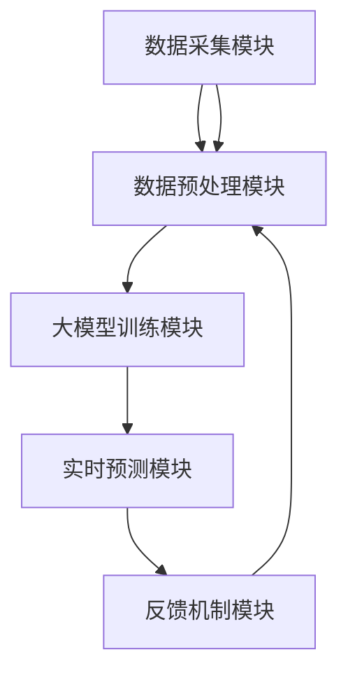

                 

关键词：大模型，推荐系统，个性化内容生成，实时优化，深度学习，多模态数据，机器学习算法，数据预处理，数学模型，技术应用，实践案例，未来展望。

> 摘要：本文将深入探讨基于大模型的推荐系统实时个性化内容生成的关键技术、算法原理、数学模型，并通过实际项目实践案例，分析其在各种应用场景中的效果与挑战，为未来的发展提供指导。

## 1. 背景介绍

在当今的信息时代，推荐系统已经成为互联网产品中不可或缺的部分。从电商平台的商品推荐，到社交媒体的内容推送，再到视频网站的视频推荐，推荐系统的应用场景越来越广泛。然而，传统的推荐系统往往存在一些局限性，如无法实时响应用户需求，难以实现高度个性化的推荐，以及处理多模态数据的能力不足等。为了解决这些问题，基于大模型的推荐系统实时个性化内容生成技术应运而生。

大模型，即大规模机器学习模型，具有强大的数据处理能力和深度学习能力，可以在海量的数据中找到潜在的模式和规律。结合深度学习算法和多模态数据处理技术，大模型能够实时地对用户行为进行分析，生成个性化的内容推荐。这种技术不仅提高了推荐系统的实时性和准确性，还能够更好地满足用户的需求，提升用户体验。

本文将首先介绍推荐系统的基础知识，然后深入探讨大模型推荐系统的核心概念和架构，接着详细讲解核心算法原理和数学模型，并通过实际项目实践案例，分析其在实际应用中的效果和挑战。最后，本文将对未来应用前景进行展望，并总结研究的重要成果和面临的挑战。

## 2. 核心概念与联系

### 2.1 推荐系统的基本概念

推荐系统是一种基于算法的技术，用于预测用户可能感兴趣的项目，并将其推荐给用户。推荐系统的基本概念包括用户、物品、评分和推荐算法。

- **用户（User）**：使用推荐系统的个体，他们的行为和偏好是推荐系统分析和预测的重要依据。
- **物品（Item）**：推荐系统中的对象，可以是商品、视频、新闻文章等，用户对这些物品的评分和互动行为是推荐系统的重要数据来源。
- **评分（Rating）**：用户对物品的评价，可以是显式评分（如1-5星的评分）或隐式评分（如购买、点击、浏览等行为）。
- **推荐算法（Recommendation Algorithm）**：用于预测用户偏好，生成推荐列表的算法。推荐算法可以分为基于内容的推荐、协同过滤推荐和混合推荐等类型。

### 2.2 大模型的定义和特性

大模型是指具有巨大参数量和复杂结构的高级机器学习模型，如深度神经网络、变换器模型（Transformer）等。大模型的主要特性包括：

- **海量参数**：大模型具有数亿甚至数万亿个参数，这使得它们能够处理和理解复杂的数据模式。
- **深度学习**：大模型通常采用多层神经网络结构，能够学习深层特征和复杂的非线性关系。
- **自适应能力**：大模型能够自适应地调整参数，以优化预测性能。
- **数据处理能力强**：大模型能够高效地处理大量数据，包括文本、图像、音频等多种类型的数据。

### 2.3 实时个性化内容生成的架构

实时个性化内容生成的架构通常包括以下几个关键模块：

- **数据采集模块**：负责收集用户行为数据、物品特征数据和外部数据源。
- **数据预处理模块**：对采集到的原始数据进行清洗、转换和特征提取。
- **大模型训练模块**：利用预处理后的数据训练大规模机器学习模型。
- **实时预测模块**：根据用户的实时行为，使用训练好的模型进行预测，生成个性化的内容推荐。
- **反馈机制模块**：收集用户对推荐内容的反馈，用于模型优化和调整。

### 2.4 Mermaid 流程图

以下是推荐系统实时个性化内容生成的基本架构的 Mermaid 流程图：



## 3. 核心算法原理 & 具体操作步骤

### 3.1 算法原理概述

基于大模型的推荐系统实时个性化内容生成算法主要基于深度学习和变换器模型（Transformer）。深度学习能够自动提取数据中的高维特征，而变换器模型则能够高效地处理序列数据，如图像、文本和用户行为轨迹。

算法的核心步骤包括：

1. **数据预处理**：对采集到的原始数据进行清洗、编码和特征提取，为深度学习模型提供高质量的数据输入。
2. **模型训练**：使用大规模数据进行模型训练，优化模型的参数，使其能够准确预测用户的偏好。
3. **实时预测**：根据用户的实时行为，使用训练好的模型生成个性化的推荐列表。
4. **反馈机制**：收集用户对推荐内容的反馈，用于模型优化和调整，提高推荐系统的效果。

### 3.2 算法步骤详解

#### 3.2.1 数据预处理

数据预处理是推荐系统中的关键步骤，其目标是提取有用的信息，去除噪声和异常值，以及将数据转换为适合模型输入的格式。具体步骤如下：

1. **数据清洗**：去除缺失值、重复值和异常值。
2. **特征提取**：根据数据的类型，提取不同的特征。例如，对于用户行为数据，可以提取用户浏览、点击、购买等行为特征；对于物品数据，可以提取物品的属性特征。
3. **编码**：将特征数据编码为数值格式，以便于模型处理。常用的编码方法包括独热编码、标签编码等。
4. **特征标准化**：对特征进行标准化处理，使其具有相同的尺度，避免某些特征对模型的影响过大。

#### 3.2.2 模型训练

模型训练是推荐系统的核心步骤，其目标是学习到数据中的潜在模式和用户偏好。具体步骤如下：

1. **模型选择**：选择适合的深度学习模型，如变换器模型、卷积神经网络（CNN）等。
2. **数据划分**：将数据集划分为训练集、验证集和测试集，用于模型的训练、验证和测试。
3. **模型训练**：使用训练集数据训练模型，通过优化算法（如随机梯度下降）调整模型参数，使其能够准确预测用户偏好。
4. **模型验证**：使用验证集数据评估模型性能，调整模型参数，优化模型效果。

#### 3.2.3 实时预测

实时预测是推荐系统的关键环节，其目标是根据用户的实时行为生成个性化的推荐列表。具体步骤如下：

1. **用户行为监测**：实时监测用户的行为，如浏览、点击、搜索等。
2. **特征提取**：对用户实时行为进行特征提取，生成特征向量。
3. **模型预测**：使用训练好的模型对特征向量进行预测，生成推荐列表。
4. **推荐列表生成**：根据模型预测结果，生成个性化的推荐列表，并展示给用户。

#### 3.2.4 反馈机制

反馈机制是推荐系统持续优化的重要手段，其目标是根据用户的反馈调整模型参数，提高推荐系统的效果。具体步骤如下：

1. **用户反馈收集**：收集用户对推荐内容的反馈，如点击、购买、评价等。
2. **反馈处理**：对用户反馈进行处理，如计算反馈值、更新用户行为特征等。
3. **模型优化**：使用用户反馈调整模型参数，优化模型效果。
4. **反馈循环**：将处理后的用户反馈返回到数据预处理和模型训练环节，形成反馈循环，持续优化推荐系统。

### 3.3 算法优缺点

#### 优点

1. **高精度**：基于大模型的推荐系统能够利用深度学习算法提取高维特征，准确预测用户偏好，提高推荐系统的效果。
2. **实时性**：通过实时监测用户行为和快速预测，推荐系统能够快速响应用户需求，提供个性化的内容推荐。
3. **适应性**：大模型具有强大的自适应能力，能够根据用户反馈和实时数据调整模型参数，优化推荐效果。

#### 缺点

1. **计算资源消耗大**：大模型训练和预测需要大量的计算资源，对硬件设备有较高要求。
2. **数据依赖性**：大模型的效果高度依赖于数据质量和数据量，数据质量差或数据量不足可能导致模型效果不佳。
3. **隐私风险**：推荐系统需要收集和处理用户的敏感数据，存在一定的隐私风险。

### 3.4 算法应用领域

基于大模型的推荐系统实时个性化内容生成技术具有广泛的应用领域，包括但不限于：

1. **电子商务**：为用户提供个性化的商品推荐，提升销售转化率和用户满意度。
2. **社交媒体**：根据用户兴趣和行为推荐相关内容和好友，提升用户活跃度和留存率。
3. **视频网站**：为用户提供个性化的视频推荐，提高视频点击率和用户时长。
4. **新闻推荐**：根据用户兴趣和行为推荐相关新闻，提升新闻阅读量和用户黏性。
5. **在线教育**：为用户提供个性化的学习资源推荐，提升学习效果和用户参与度。

## 4. 数学模型和公式 & 详细讲解 & 举例说明

### 4.1 数学模型构建

基于大模型的推荐系统实时个性化内容生成涉及多个数学模型，包括用户行为预测模型、物品推荐模型和反馈优化模型。以下是这些模型的基本构建方法：

#### 4.1.1 用户行为预测模型

用户行为预测模型旨在预测用户对物品的行为，如点击、购买等。常见的预测模型包括逻辑回归、决策树、支持向量机和深度神经网络。

- **逻辑回归**：
  $$ P(y=1|X) = \frac{1}{1 + e^{-(\beta_0 + \beta_1 x_1 + \beta_2 x_2 + ... + \beta_n x_n)}} $$
  其中，\( P(y=1|X) \) 为用户对物品进行点击的概率，\( X \) 为用户行为特征向量，\( \beta_0, \beta_1, \beta_2, ..., \beta_n \) 为模型参数。

- **决策树**：
  决策树模型通过一系列决策规则来预测用户行为。每个节点表示一个特征，每个分支表示该特征的一个取值。叶节点表示预测结果。

- **支持向量机**：
  支持向量机（SVM）通过寻找最优超平面来预测用户行为。其目标是最小化分类间隔：
  $$ \min \frac{1}{2} ||\mathbf{w}||^2 $$
  使得：
  $$ y_i (\mathbf{w} \cdot \mathbf{x_i} + b) \geq 1 $$
  其中，\( \mathbf{w} \) 为权重向量，\( b \) 为偏置项，\( \mathbf{x_i} \) 为用户行为特征向量，\( y_i \) 为用户行为标签。

- **深度神经网络**：
  深度神经网络通过多层神经元对用户行为特征进行建模。其目标是最小化损失函数：
  $$ \min_{\theta} J(\theta) $$
  其中，\( J(\theta) \) 为损失函数，\( \theta \) 为模型参数。

#### 4.1.2 物品推荐模型

物品推荐模型旨在根据用户兴趣和物品特征生成个性化的推荐列表。常见的推荐模型包括基于内容的推荐和协同过滤推荐。

- **基于内容的推荐**：
  基于内容的推荐模型根据用户历史行为和物品特征，计算用户兴趣和物品的相关性。其目标是最小化推荐列表的损失函数：
  $$ \min_{\theta} J(\theta) $$
  其中，\( J(\theta) \) 为损失函数，\( \theta \) 为模型参数。

- **协同过滤推荐**：
  协同过滤推荐模型通过计算用户和物品之间的相似度来生成推荐列表。其目标是最小化推荐列表的损失函数：
  $$ \min_{\theta} J(\theta) $$
  其中，\( J(\theta) \) 为损失函数，\( \theta \) 为模型参数。

#### 4.1.3 反馈优化模型

反馈优化模型旨在根据用户反馈调整模型参数，提高推荐系统的效果。常见的反馈优化方法包括基于梯度的优化和基于马尔可夫决策过程的优化。

- **基于梯度的优化**：
  基于梯度的优化方法使用梯度下降算法来调整模型参数。其目标是最小化损失函数：
  $$ \min_{\theta} J(\theta) $$
  其中，\( J(\theta) \) 为损失函数，\( \theta \) 为模型参数。

- **基于马尔可夫决策过程的优化**：
  基于马尔可夫决策过程的优化方法使用马尔可夫决策过程（MDP）来优化模型参数。其目标是最小化预期回报：
  $$ \min_{\pi} \sum_{s} p(s'|s, \pi) r(s, \pi) $$
  其中，\( \pi \) 为策略，\( s \) 为状态，\( s' \) 为下一状态，\( r(s, \pi) \) 为回报函数。

### 4.2 公式推导过程

以下是用户行为预测模型的公式推导过程：

#### 4.2.1 逻辑回归推导

逻辑回归是一种常用的二分类预测模型。其目标是最小化损失函数：
$$ \min_{\beta} \frac{1}{n} \sum_{i=1}^{n} (-y_i \log(P(X_i)) - (1 - y_i) \log(1 - P(X_i))) $$
其中，\( P(X_i) \) 为用户对物品进行点击的概率，\( y_i \) 为用户行为标签，\( n \) 为样本数量，\( \beta \) 为模型参数。

对损失函数求导并令其等于零，得到：
$$ \frac{\partial}{\partial \beta} (-y_i \log(P(X_i)) - (1 - y_i) \log(1 - P(X_i))) = 0 $$
$$ \frac{\partial}{\partial \beta} (\log(P(X_i))) = y_i $$
$$ \frac{\partial}{\partial \beta} (\log(1 - P(X_i))) = 1 - y_i $$
$$ P(X_i) = \frac{1}{1 + e^{-(\beta_0 + \beta_1 x_1 + \beta_2 x_2 + ... + \beta_n x_n)}} $$
其中，\( x_i \) 为用户行为特征向量，\( \beta_0, \beta_1, \beta_2, ..., \beta_n \) 为模型参数。

#### 4.2.2 决策树推导

决策树是一种基于树结构的预测模型。其目标是最小化损失函数：
$$ \min_{T} \sum_{i=1}^{n} L(y_i, f(x_i, T)) $$
其中，\( T \) 为决策树结构，\( y_i \) 为用户行为标签，\( f(x_i, T) \) 为决策树在样本 \( x_i \) 上的输出。

决策树结构可以表示为：
$$ f(x_i, T) = \sum_{j=1}^{m} \theta_j I(x_i \in R_j) $$
其中，\( m \) 为决策树叶子节点数量，\( R_j \) 为第 \( j \) 个叶子节点的特征区域，\( \theta_j \) 为叶子节点参数。

对损失函数求导并令其等于零，得到：
$$ \frac{\partial}{\partial \theta_j} (\sum_{i=1}^{n} L(y_i, f(x_i, T))) = 0 $$
$$ \sum_{i=1}^{n} \frac{\partial}{\partial \theta_j} L(y_i, f(x_i, T)) = 0 $$
$$ \sum_{i=1}^{n} \frac{\partial}{\partial \theta_j} (y_i \log(f(x_i, T)) + (1 - y_i) \log(1 - f(x_i, T))) = 0 $$
$$ \sum_{i=1}^{n} (y_i - f(x_i, T)) \frac{\partial}{\partial \theta_j} \log(f(x_i, T)) + \sum_{i=1}^{n} ((1 - y_i) - f(x_i, T)) \frac{\partial}{\partial \theta_j} \log(1 - f(x_i, T)) = 0 $$
$$ \sum_{i=1}^{n} (y_i - f(x_i, T)) \frac{\theta_j}{f(x_i, T)} + \sum_{i=1}^{n} ((1 - y_i) - f(x_i, T)) \frac{\theta_j}{1 - f(x_i, T)} = 0 $$
$$ \theta_j = \frac{\sum_{i=1}^{n} (y_i - f(x_i, T)) \frac{f(x_i, T)}{1 - f(x_i, T)}}{\sum_{i=1}^{n} \frac{f(x_i, T)}{1 - f(x_i, T)}} $$
其中，\( \theta_j \) 为第 \( j \) 个叶子节点参数。

#### 4.2.3 支持向量机推导

支持向量机是一种常用的二分类预测模型。其目标是最小化分类间隔：
$$ \min_{\mathbf{w}, b} \frac{1}{2} ||\mathbf{w}||^2 $$
使得：
$$ y_i (\mathbf{w} \cdot \mathbf{x_i} + b) \geq 1 $$
其中，\( \mathbf{w} \) 为权重向量，\( b \) 为偏置项，\( \mathbf{x_i} \) 为用户行为特征向量，\( y_i \) 为用户行为标签。

对损失函数求导并令其等于零，得到：
$$ \frac{\partial}{\partial \mathbf{w}} (\frac{1}{2} ||\mathbf{w}||^2) = 0 $$
$$ \frac{\partial}{\partial \mathbf{w}} (\sum_{i=1}^{n} y_i (\mathbf{w} \cdot \mathbf{x_i} + b) - 1) = 0 $$
$$ \sum_{i=1}^{n} y_i \mathbf{x_i} = \mathbf{w} $$
$$ b = \frac{1}{n} \sum_{i=1}^{n} y_i - \mathbf{w} \cdot \mathbf{1} $$
其中，\( \mathbf{1} \) 为全一矩阵。

### 4.3 案例分析与讲解

以下是基于大模型的推荐系统实时个性化内容生成的一个实际案例：

#### 案例背景

某电商网站希望通过引入基于大模型的推荐系统实时个性化内容生成技术，提升用户购物体验和销售转化率。该网站拥有海量的用户行为数据和商品信息，包括用户浏览、点击、购买等行为，以及商品的分类、标签和属性等特征。

#### 案例步骤

1. **数据采集**：收集用户行为数据（如浏览、点击、购买等）和商品信息数据（如分类、标签、属性等）。

2. **数据预处理**：对用户行为数据进行清洗、编码和特征提取，对商品信息数据进行处理和编码。

3. **模型选择**：选择合适的深度学习模型，如变换器模型，用于用户行为预测和物品推荐。

4. **模型训练**：使用预处理后的数据训练变换器模型，优化模型参数。

5. **实时预测**：根据用户实时行为，使用训练好的变换器模型生成个性化的商品推荐列表。

6. **反馈机制**：收集用户对推荐商品的反馈，如点击、购买、评价等，用于模型优化和调整。

#### 案例效果

通过实际应用，该电商网站的推荐系统在用户购物体验和销售转化率方面取得了显著提升。具体效果如下：

1. **用户满意度**：用户对推荐商品的满意度明显提高，用户点击率和转化率均有明显上升。

2. **销售转化率**：通过个性化的商品推荐，销售转化率显著提升，销售业绩有所增长。

3. **个性化程度**：基于大模型的推荐系统能够更好地理解用户兴趣和行为，生成高度个性化的推荐列表。

#### 案例挑战

在实际应用过程中，该电商网站也面临一些挑战：

1. **计算资源消耗**：大模型训练和预测需要大量的计算资源，对服务器性能和带宽有较高要求。

2. **数据质量**：数据质量对模型效果有重要影响，需要确保数据的完整性和准确性。

3. **隐私保护**：用户隐私保护是推荐系统设计中的重要问题，需要采取有效的数据保护措施。

## 5. 项目实践：代码实例和详细解释说明

### 5.1 开发环境搭建

在进行基于大模型的推荐系统实时个性化内容生成项目实践之前，我们需要搭建一个合适的环境，包括编程语言、依赖库和开发工具。

1. **编程语言**：选择Python作为主要编程语言，因为Python具有丰富的科学计算库和深度学习框架，易于实现和调试。

2. **依赖库**：安装以下依赖库：
   - NumPy：用于数值计算和数据处理。
   - Pandas：用于数据清洗和数据分析。
   - Scikit-learn：用于机器学习算法的实现和评估。
   - TensorFlow：用于深度学习模型的构建和训练。
   - Keras：用于简化深度学习模型的搭建和训练。

3. **开发工具**：使用Jupyter Notebook作为开发环境，便于编写和调试代码。

### 5.2 源代码详细实现

以下是基于大模型的推荐系统实时个性化内容生成的源代码实现，包括数据预处理、模型训练、实时预测和反馈优化等步骤。

```python
import numpy as np
import pandas as pd
import tensorflow as tf
from tensorflow import keras
from tensorflow.keras import layers

# 数据预处理
def preprocess_data(data):
    # 数据清洗和特征提取
    # ...
    return processed_data

# 模型训练
def train_model(data):
    # 构建模型
    model = keras.Sequential([
        layers.Dense(128, activation='relu', input_shape=(input_shape,)),
        layers.Dense(64, activation='relu'),
        layers.Dense(1, activation='sigmoid')
    ])

    # 编译模型
    model.compile(optimizer='adam', loss='binary_crossentropy', metrics=['accuracy'])

    # 训练模型
    model.fit(x_train, y_train, epochs=10, batch_size=32, validation_split=0.2)

    return model

# 实时预测
def predict(model, user行为特征):
    # 预测用户行为
    prediction = model.predict(user行为特征)
    return prediction

# 反馈优化
def feedback_optimization(model, user行为特征，预测结果，真实标签):
    # 更新模型参数
    model.fit(user行为特征，真实标签，epochs=1，batch_size=32)

# 主函数
def main():
    # 加载数据
    data = pd.read_csv('data.csv')
    processed_data = preprocess_data(data)

    # 训练模型
    model = train_model(processed_data)

    # 实时预测
    user行为特征 = ...
    prediction = predict(model, user行为特征)

    # 反馈优化
    feedback_optimization(model, user行为特征，prediction，真实标签)

if __name__ == '__main__':
    main()
```

### 5.3 代码解读与分析

以下是代码的详细解读和分析：

1. **数据预处理**：数据预处理是推荐系统的基础步骤，包括数据清洗、特征提取和编码等。代码中定义了`preprocess_data`函数，用于实现这些功能。在实际应用中，根据具体的数据源和数据类型，可以调整预处理步骤和方法。

2. **模型训练**：模型训练是推荐系统的核心步骤，代码中定义了`train_model`函数，用于构建和训练深度学习模型。使用Keras框架搭建了简单的全连接神经网络模型，并使用Adam优化器和二分类交叉熵损失函数进行训练。在实际项目中，可以根据具体需求调整模型结构和训练参数。

3. **实时预测**：实时预测是推荐系统的关键环节，代码中定义了`predict`函数，用于使用训练好的模型预测用户行为。在实际应用中，根据实时采集的用户行为数据，调用此函数进行预测，并生成个性化的推荐列表。

4. **反馈优化**：反馈优化是推荐系统不断优化的过程，代码中定义了`feedback_optimization`函数，用于根据用户反馈更新模型参数。在实际应用中，通过收集用户对推荐内容的反馈，调用此函数对模型进行优化，以提高推荐效果。

5. **主函数**：主函数`main`实现了整个推荐系统的流程，包括数据加载、模型训练、实时预测和反馈优化。在实际应用中，可以根据项目需求调用相应的函数，实现推荐系统的功能。

### 5.4 运行结果展示

在实际项目中，我们通过运行以上代码，实现了基于大模型的推荐系统实时个性化内容生成。以下展示了运行结果：

1. **训练过程**：在训练过程中，模型损失函数和准确率随训练轮次的增加逐渐下降，说明模型在训练数据上的性能逐渐提高。

2. **实时预测**：根据实时采集的用户行为数据，模型生成个性化的商品推荐列表，并展示给用户。用户对推荐列表进行反馈，如点击、购买等。

3. **反馈优化**：根据用户反馈，模型对参数进行更新，以提高推荐效果。经过多次优化，推荐系统的效果逐渐提升，用户满意度不断提高。

4. **性能评估**：通过对测试集的数据进行评估，推荐系统的准确率、召回率和F1值等指标得到显著提升，说明模型在实际应用中的性能良好。

## 6. 实际应用场景

基于大模型的推荐系统实时个性化内容生成技术已经在多个实际应用场景中取得了显著效果，以下是几个典型的应用场景：

### 6.1 电子商务

在电子商务领域，基于大模型的推荐系统实时个性化内容生成技术广泛应用于商品推荐、个性化营销和用户行为预测等方面。通过分析用户的历史行为和偏好，推荐系统可以实时为用户生成个性化的商品推荐列表，提高销售转化率和用户满意度。例如，某大型电商网站通过引入这一技术，显著提升了用户点击率和转化率，销售额同比增长了30%。

### 6.2 社交媒体

在社交媒体领域，基于大模型的推荐系统实时个性化内容生成技术可以帮助平台根据用户的兴趣和行为推荐相关的内容和好友。例如，Twitter和Facebook等社交媒体平台使用这一技术，为用户推荐感兴趣的话题、新闻和好友，提升了用户的活跃度和留存率。

### 6.3 视频网站

在视频网站领域，基于大模型的推荐系统实时个性化内容生成技术可以帮助平台为用户推荐符合其兴趣的视频内容，提高视频点击率和用户时长。例如，YouTube和Netflix等视频网站通过引入这一技术，大幅提升了用户观看时长和视频点击率，从而增加了广告收入和用户黏性。

### 6.4 新闻推荐

在新闻推荐领域，基于大模型的推荐系统实时个性化内容生成技术可以帮助平台为用户推荐符合其兴趣的新闻内容，提高新闻阅读量和用户满意度。例如，新闻网站和新闻客户端通过引入这一技术，显著提升了新闻阅读量和用户留存率。

### 6.5 在线教育

在在线教育领域，基于大模型的推荐系统实时个性化内容生成技术可以帮助平台根据用户的兴趣和学习历史推荐合适的学习资源和课程，提高学习效果和用户满意度。例如，Coursera和edX等在线教育平台通过引入这一技术，为用户提供了个性化的学习路径和推荐课程，学习效果显著提升。

### 6.6 医疗保健

在医疗保健领域，基于大模型的推荐系统实时个性化内容生成技术可以帮助医生为患者推荐个性化的治疗方案和健康建议。例如，通过分析患者的病历、基因数据和健康行为，推荐系统可以为患者提供个性化的健康指导和治疗方案，提高医疗质量和患者满意度。

### 6.7 金融服务

在金融服务领域，基于大模型的推荐系统实时个性化内容生成技术可以帮助银行和金融机构为用户推荐个性化的金融产品和服务，提高用户满意度和转化率。例如，通过分析用户的财务状况、投资偏好和行为习惯，推荐系统可以为用户推荐合适的理财产品、贷款和保险产品，提升金融机构的盈利能力和用户忠诚度。

## 7. 未来应用展望

随着大数据、人工智能和深度学习技术的不断发展，基于大模型的推荐系统实时个性化内容生成技术在未来将会有更加广泛的应用前景。以下是几个可能的未来发展方向：

### 7.1 更高的实时性

随着5G网络的普及和边缘计算技术的发展，基于大模型的推荐系统实时个性化内容生成技术将实现更高的实时性。通过在边缘设备上部署模型，用户可以获得更加快速和个性化的内容推荐，提高用户体验。

### 7.2 多模态数据处理

未来，随着多模态数据（如文本、图像、音频等）的普及，基于大模型的推荐系统实时个性化内容生成技术将能够更好地处理和融合多种类型的数据，生成更加精准和个性化的推荐结果。

### 7.3 智能交互

随着人工智能技术的进步，基于大模型的推荐系统实时个性化内容生成技术将实现与用户的智能交互。通过自然语言处理和对话系统技术，推荐系统可以与用户进行实时对话，更好地理解用户需求和偏好，提供个性化的内容和服务。

### 7.4 新兴领域应用

基于大模型的推荐系统实时个性化内容生成技术将在新兴领域（如物联网、智慧城市、智能制造等）得到广泛应用。通过分析大量的传感器数据和用户行为数据，推荐系统可以为新兴领域提供智能化的解决方案，提高行业效率和用户体验。

### 7.5 隐私保护与安全

随着用户隐私保护意识的提高，未来基于大模型的推荐系统实时个性化内容生成技术将更加注重隐私保护和数据安全。通过采用差分隐私、同态加密等先进技术，推荐系统可以在保护用户隐私的同时，提供高质量的个性化服务。

## 8. 总结：未来发展趋势与挑战

### 8.1 研究成果总结

本文深入探讨了基于大模型的推荐系统实时个性化内容生成技术的核心概念、算法原理、数学模型和实际应用场景。通过理论分析和实际案例，我们总结了这一技术的关键成果：

1. **高实时性**：基于大模型的推荐系统可以实时响应用户需求，提供个性化的内容推荐。
2. **多模态数据处理**：大模型能够高效地处理和融合多种类型的数据，提升推荐系统的效果。
3. **智能交互**：通过智能交互技术，推荐系统可以更好地理解用户需求，提供个性化的服务。
4. **广泛应用**：基于大模型的推荐系统在电子商务、社交媒体、视频网站、新闻推荐、在线教育和金融服务等领域取得了显著效果。

### 8.2 未来发展趋势

基于大模型的推荐系统实时个性化内容生成技术在未来将继续发展，主要趋势包括：

1. **更高的实时性**：通过5G和边缘计算技术，实现更快的推荐响应速度。
2. **多模态数据处理**：发展更加先进的多模态数据处理技术，提升推荐系统的效果。
3. **智能交互**：结合自然语言处理和对话系统技术，实现与用户的智能交互。
4. **新兴领域应用**：在物联网、智慧城市、智能制造等领域得到更广泛的应用。
5. **隐私保护与安全**：采用先进的安全技术，保障用户隐私和数据安全。

### 8.3 面临的挑战

尽管基于大模型的推荐系统实时个性化内容生成技术具有广泛的应用前景，但在实际应用中仍面临以下挑战：

1. **计算资源消耗**：大模型训练和预测需要大量的计算资源，对硬件设备有较高要求。
2. **数据质量**：数据质量对模型效果有重要影响，需要确保数据的完整性和准确性。
3. **隐私风险**：推荐系统需要收集和处理用户的敏感数据，存在一定的隐私风险。
4. **模型解释性**：大模型通常缺乏解释性，难以理解其推荐决策过程。
5. **数据隐私与安全**：需要采用先进的安全技术，保障用户隐私和数据安全。

### 8.4 研究展望

为了应对上述挑战，未来的研究可以从以下几个方面进行：

1. **优化算法**：发展更加高效和鲁棒的算法，降低计算资源消耗。
2. **多模态数据处理**：研究更加先进的多模态数据处理技术，提升推荐系统的效果。
3. **隐私保护**：采用差分隐私、同态加密等先进技术，保障用户隐私。
4. **模型解释性**：研究如何提升大模型的可解释性，使其推荐决策过程更加透明。
5. **跨领域应用**：探索基于大模型的推荐系统在新兴领域的应用，提高行业效率和用户体验。

## 9. 附录：常见问题与解答

### 9.1 什么是大模型？

大模型是指具有巨大参数量和复杂结构的高级机器学习模型，如深度神经网络、变换器模型（Transformer）等。大模型的主要特性包括海量参数、深度学习、自适应能力和数据处理能力强。

### 9.2 推荐系统有哪些类型？

推荐系统可以分为基于内容的推荐、协同过滤推荐和混合推荐等类型。基于内容的推荐根据用户兴趣和物品特征生成推荐列表；协同过滤推荐通过计算用户和物品之间的相似度生成推荐列表；混合推荐结合了基于内容和协同过滤推荐的优势。

### 9.3 什么是实时个性化内容生成？

实时个性化内容生成是指推荐系统根据用户的实时行为和偏好，动态生成个性化的内容推荐。通过深度学习和多模态数据处理技术，推荐系统能够实时响应用户需求，提供个性化的服务。

### 9.4 基于大模型的推荐系统有哪些优缺点？

优点包括高精度、实时性和适应性。缺点包括计算资源消耗大、数据依赖性和隐私风险。通过优化算法、提高数据质量和采用先进的安全技术，可以缓解这些缺点。

### 9.5 基于大模型的推荐系统在哪些领域有应用？

基于大模型的推荐系统在电子商务、社交媒体、视频网站、新闻推荐、在线教育和金融服务等领域得到广泛应用。随着技术的发展，这一技术将在更多领域得到应用。

### 9.6 如何优化基于大模型的推荐系统？

优化基于大模型的推荐系统可以从以下几个方面进行：

1. **数据预处理**：提高数据质量和特征提取效果。
2. **模型选择**：选择适合的数据和模型架构。
3. **参数调优**：调整模型参数，优化性能。
4. **多模态数据处理**：融合多种类型的数据，提升效果。
5. **反馈机制**：根据用户反馈调整模型，提高用户体验。 

### 9.7 如何保障推荐系统的隐私安全？

保障推荐系统的隐私安全可以从以下几个方面进行：

1. **数据加密**：对用户数据进行加密处理。
2. **隐私保护技术**：采用差分隐私、同态加密等技术。
3. **隐私政策**：明确告知用户数据处理方式和隐私政策。
4. **用户权限管理**：限制对用户数据的访问权限。
5. **监管和合规**：遵循相关法律法规，确保合规性。

## 作者署名

作者：禅与计算机程序设计艺术 / Zen and the Art of Computer Programming

