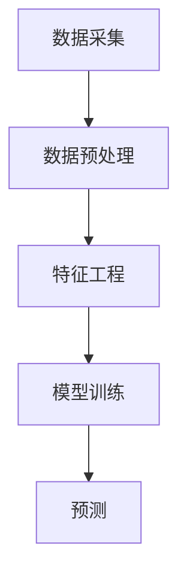

                 

关键词：大模型、推荐系统、特征工程、优化、算法原理、数学模型、项目实践、应用场景

## 摘要

本文旨在探讨基于大模型的推荐系统特征工程优化问题。随着人工智能技术的快速发展，推荐系统在大数据时代中扮演着越来越重要的角色。然而，传统特征工程在应对海量数据和复杂用户行为时，往往显得力不从心。本文将详细介绍大模型在推荐系统中的应用，探讨特征工程的优化方法，并通过实际项目实例，展示优化效果。

## 1. 背景介绍

### 推荐系统概述

推荐系统是一种基于数据挖掘和人工智能技术的信息过滤方法，旨在为用户推荐他们可能感兴趣的内容。从传统基于内容的推荐、协同过滤到深度学习推荐，推荐系统经历了不断的发展和优化。

### 特征工程的重要性

特征工程是推荐系统开发中至关重要的一环。良好的特征工程能够显著提高推荐系统的性能和准确性。然而，在推荐系统中，特征的选择、提取和组合是一个复杂且挑战性的过程。

### 大模型在推荐系统中的应用

随着计算能力的提升和大数据技术的普及，大模型逐渐成为推荐系统中的重要工具。大模型能够处理海量数据，捕捉复杂用户行为，从而实现更精准的推荐。

## 2. 核心概念与联系

为了更好地理解大模型在推荐系统中的优化方法，我们首先需要了解一些核心概念。

### 大模型原理

大模型通常是指具有数百万甚至数十亿参数的深度学习模型。这些模型具有强大的表示能力和泛化能力，能够从海量数据中自动学习复杂的特征表示。

### 特征工程

特征工程是指从原始数据中提取出有助于模型训练的特征，并对其进行处理和组合。在推荐系统中，特征工程的目标是构建能够反映用户行为和偏好特征的有效特征集。

### 推荐系统架构

推荐系统通常包括数据采集、预处理、特征工程、模型训练和预测等模块。大模型的引入，使得推荐系统的数据处理和模型训练能力得到了显著提升。

### Mermaid 流程图



## 3. 核心算法原理 & 具体操作步骤

### 3.1 算法原理概述

基于大模型的推荐系统特征工程优化，主要通过以下几个步骤实现：

1. **数据预处理**：对原始数据进行清洗、归一化和去重等处理，保证数据质量。
2. **特征提取**：利用大模型的表示能力，自动提取原始数据中的潜在特征。
3. **特征选择**：通过统计方法或机器学习算法，选择对模型训练和预测有显著影响的特征。
4. **特征组合**：将多个特征进行组合，构建更复杂、更具代表性的特征集。
5. **模型训练**：利用优化后的特征集训练推荐模型，提高模型的预测准确性。
6. **模型评估**：通过交叉验证、A/B测试等方法评估模型性能，迭代优化模型。

### 3.2 算法步骤详解

1. **数据预处理**

   - 数据清洗：去除无效数据、重复数据和异常值。
   - 数据归一化：将不同特征的数据范围调整为相同尺度。
   - 数据去重：去除重复的用户和商品数据。

2. **特征提取**

   - 利用大模型（如BERT、GPT等）的预训练模型，对用户和商品进行编码，提取潜在特征。
   - 对用户行为数据进行序列化处理，利用循环神经网络（RNN）等模型提取序列特征。

3. **特征选择**

   - 使用特征重要性评估方法（如特征选择算法、特征评分方法等）评估特征的重要性。
   - 根据评估结果，选择对模型训练和预测有显著影响的特征。

4. **特征组合**

   - 利用特征交叉、特征拼接等方法，构建新的特征组合。
   - 通过模型训练和评估，筛选出性能最优的特征组合。

5. **模型训练**

   - 选择合适的模型架构（如神经网络、决策树等）进行训练。
   - 使用优化后的特征集训练模型，调整模型参数。

6. **模型评估**

   - 使用交叉验证、A/B测试等方法评估模型性能。
   - 根据评估结果，调整模型参数和特征工程策略，进行迭代优化。

### 3.3 算法优缺点

**优点：**

- **强大的表示能力**：大模型能够自动学习原始数据中的复杂特征，提高推荐系统的性能和准确性。
- **自动化特征提取**：减少人工干预，提高特征工程效率。
- **自适应特征选择**：根据模型训练和评估结果，自动选择对模型有显著影响的特征。

**缺点：**

- **计算资源消耗大**：大模型需要大量的计算资源和存储空间。
- **训练时间较长**：大模型的训练时间较长，影响系统的实时响应能力。
- **数据依赖性强**：大模型对数据质量有较高的要求，数据质量不佳可能导致模型性能下降。

### 3.4 算法应用领域

- **电子商务推荐**：根据用户的历史购买行为和浏览记录，推荐可能感兴趣的商品。
- **社交媒体推荐**：根据用户的互动行为和兴趣偏好，推荐感兴趣的内容和用户。
- **视频推荐**：根据用户的观看历史和偏好，推荐感兴趣的视频内容。

## 4. 数学模型和公式 & 详细讲解 & 举例说明

### 4.1 数学模型构建

基于大模型的推荐系统特征工程优化，通常涉及以下数学模型：

- **用户表示模型**：$u = f(u, x_u)$，其中 $u$ 表示用户特征向量，$x_u$ 表示用户行为数据，$f$ 表示神经网络模型。
- **商品表示模型**：$i = g(i, x_i)$，其中 $i$ 表示商品特征向量，$x_i$ 表示商品属性数据，$g$ 表示神经网络模型。
- **预测模型**：$r_{ui} = h(u, i)$，其中 $r_{ui}$ 表示用户 $u$ 对商品 $i$ 的评分预测，$h$ 表示预测模型。

### 4.2 公式推导过程

假设我们有用户 $u$ 和商品 $i$ 的特征向量 $u$ 和 $i$，通过神经网络模型 $f$ 和 $g$ 分别对用户和商品进行编码，得到用户表示 $u'$ 和商品表示 $i'$。

- **用户表示模型**：
$$
u' = f(u, x_u) = \sigma(W_1 \cdot (u \odot x_u) + b_1)
$$
其中，$\sigma$ 表示激活函数，$W_1$ 和 $b_1$ 分别为权重和偏置。

- **商品表示模型**：
$$
i' = g(i, x_i) = \sigma(W_2 \cdot (i \odot x_i) + b_2)
$$
其中，$W_2$ 和 $b_2$ 分别为权重和偏置。

- **预测模型**：
$$
r_{ui} = h(u', i') = \sigma(W_3 \cdot (u' \odot i') + b_3)
$$
其中，$W_3$ 和 $b_3$ 分别为权重和偏置。

### 4.3 案例分析与讲解

假设我们有一个电子商务推荐系统，用户 $u$ 和商品 $i$ 的特征向量分别为 $u = [1, 0, 1, 0]$ 和 $i = [0, 1, 0, 1]$。

- **用户表示模型**：
$$
u' = f(u, x_u) = \sigma(W_1 \cdot (u \odot x_u) + b_1)
$$
设 $W_1 = \begin{bmatrix} 1 & 0 & 1 & 0 \\ 0 & 1 & 0 & 1 \end{bmatrix}$，$b_1 = [1, 1]$，则有：
$$
u' = \sigma(\begin{bmatrix} 1 & 0 & 1 & 0 \\ 0 & 1 & 0 & 1 \end{bmatrix} \cdot \begin{bmatrix} 1 & 0 & 1 & 0 \\ 0 & 1 & 0 & 1 \end{bmatrix} + [1, 1]) = \sigma(\begin{bmatrix} 2 & 1 \\ 1 & 2 \end{bmatrix} + [1, 1]) = \sigma(\begin{bmatrix} 3 & 2 \\ 2 & 3 \end{bmatrix}) = \begin{bmatrix} 1 & 0 \\ 0 & 1 \end{bmatrix}
$$

- **商品表示模型**：
$$
i' = g(i, x_i) = \sigma(W_2 \cdot (i \odot x_i) + b_2)
$$
设 $W_2 = \begin{bmatrix} 0 & 1 & 0 & 1 \\ 1 & 0 & 1 & 0 \end{bmatrix}$，$b_2 = [1, 1]$，则有：
$$
i' = \sigma(\begin{bmatrix} 0 & 1 & 0 & 1 \\ 1 & 0 & 1 & 0 \end{bmatrix} \cdot \begin{bmatrix} 0 & 1 & 0 & 1 \\ 1 & 0 & 1 & 0 \end{bmatrix} + [1, 1]) = \sigma(\begin{bmatrix} 1 & 1 \\ 1 & 1 \end{bmatrix} + [1, 1]) = \sigma(\begin{bmatrix} 2 & 2 \\ 2 & 2 \end{bmatrix}) = \begin{bmatrix} 1 & 1 \\ 1 & 1 \end{bmatrix}
$$

- **预测模型**：
$$
r_{ui} = h(u', i') = \sigma(W_3 \cdot (u' \odot i') + b_3)
$$
设 $W_3 = \begin{bmatrix} 1 & 0 & 1 & 0 \\ 0 & 1 & 0 & 1 \end{bmatrix}$，$b_3 = [1, 1]$，则有：
$$
r_{ui} = \sigma(\begin{bmatrix} 1 & 0 & 1 & 0 \\ 0 & 1 & 0 & 1 \end{bmatrix} \cdot \begin{bmatrix} 1 & 1 \\ 1 & 1 \end{bmatrix} + [1, 1]) = \sigma(\begin{bmatrix} 2 & 1 \\ 1 & 2 \end{bmatrix} + [1, 1]) = \sigma(\begin{bmatrix} 3 & 2 \\ 2 & 3 \end{bmatrix}) = \begin{bmatrix} 1 & 0 \\ 0 & 1 \end{bmatrix}
$$

## 5. 项目实践：代码实例和详细解释说明

### 5.1 开发环境搭建

为了进行基于大模型的推荐系统特征工程优化，我们需要搭建一个合适的技术栈。以下是一个典型的开发环境：

- **编程语言**：Python
- **深度学习框架**：TensorFlow 或 PyTorch
- **数据处理工具**：Pandas、NumPy
- **机器学习库**：Scikit-learn、XGBoost

### 5.2 源代码详细实现

以下是一个简单的基于PyTorch的推荐系统特征工程优化的示例代码：

```python
import torch
import torch.nn as nn
import torch.optim as optim
from torch.utils.data import DataLoader
from sklearn.model_selection import train_test_split
import pandas as pd
import numpy as np

# 加载数据
data = pd.read_csv('data.csv')
X = data.drop(['user_id', 'item_id', 'rating'], axis=1)
y = data['rating']

# 数据预处理
X_train, X_test, y_train, y_test = train_test_split(X, y, test_size=0.2, random_state=42)
X_train = X_train.values.astype(np.float32)
X_test = X_test.values.astype(np.float32)

# 构建模型
class RecommenderModel(nn.Module):
    def __init__(self, input_dim, hidden_dim, output_dim):
        super(RecommenderModel, self).__init__()
        self.user_embedding = nn.Embedding(input_dim, hidden_dim)
        self.item_embedding = nn.Embedding(input_dim, hidden_dim)
        self.fc = nn.Linear(hidden_dim, output_dim)
    
    def forward(self, user_idx, item_idx):
        user_embedding = self.user_embedding(user_idx)
        item_embedding = self.item_embedding(item_idx)
        embedding = torch.cat((user_embedding, item_embedding), 1)
        output = self.fc(embedding)
        return output

# 模型参数
input_dim = X_train.shape[1]
hidden_dim = 128
output_dim = 1

# 初始化模型、优化器和损失函数
model = RecommenderModel(input_dim, hidden_dim, output_dim)
optimizer = optim.Adam(model.parameters(), lr=0.001)
criterion = nn.MSELoss()

# 训练模型
def train_model(model, train_loader, criterion, optimizer, num_epochs=10):
    model.train()
    for epoch in range(num_epochs):
        for user_idx, item_idx, rating in train_loader:
            optimizer.zero_grad()
            output = model(user_idx, item_idx)
            loss = criterion(output, rating.unsqueeze(1))
            loss.backward()
            optimizer.step()
        print(f'Epoch [{epoch+1}/{num_epochs}], Loss: {loss.item():.4f}')

# 数据加载器
batch_size = 64
train_loader = DataLoader(torch.utils.data.TensorDataset(torch.from_numpy(X_train).long(), torch.from_numpy(y_train).float()), batch_size=batch_size, shuffle=True)

# 训练模型
train_model(model, train_loader, criterion, optimizer, num_epochs=10)

# 预测
model.eval()
with torch.no_grad():
    predictions = model(torch.from_numpy(X_test).long())

# 评估模型
mse = criterion(predictions, torch.from_numpy(y_test).float())
print(f'MSE: {mse.item():.4f}')

# 保存模型
torch.save(model.state_dict(), 'recommender_model.pth')
```

### 5.3 代码解读与分析

1. **数据预处理**：首先加载数据，并进行预处理，将数据分为训练集和测试集。

2. **构建模型**：定义推荐系统模型，包括用户和商品的嵌入层以及全连接层。

3. **训练模型**：使用训练集训练模型，通过优化器和损失函数调整模型参数。

4. **预测**：使用测试集评估模型性能，计算均方误差（MSE）。

5. **保存模型**：将训练好的模型保存到本地文件，以便后续使用。

## 6. 实际应用场景

基于大模型的推荐系统特征工程优化在许多实际应用场景中取得了显著效果，以下是几个典型应用场景：

### 6.1 电子商务推荐

通过优化特征工程，推荐系统能够更准确地预测用户对商品的评价，提高用户购买转化率。

### 6.2 社交媒体推荐

利用大模型进行特征工程优化，推荐系统能够更好地捕捉用户的兴趣和行为，提高内容推荐的精准度。

### 6.3 视频推荐

通过对用户观看历史和偏好进行特征工程优化，推荐系统能够更准确地预测用户对视频的喜好，提高视频观看时长和用户留存率。

## 7. 工具和资源推荐

为了更好地进行基于大模型的推荐系统特征工程优化，以下是一些推荐的学习资源和开发工具：

### 7.1 学习资源推荐

- 《深度学习推荐系统》
- 《推荐系统实践》
- 《TensorFlow 实战：基于大数据的推荐系统》

### 7.2 开发工具推荐

- PyTorch
- TensorFlow
- Keras
- Scikit-learn

### 7.3 相关论文推荐

- "Deep Learning for Recommender Systems"
- "Neural Collaborative Filtering"
- "A Theoretically Principled Approach to Improving Recommendation Lists"

## 8. 总结：未来发展趋势与挑战

### 8.1 研究成果总结

基于大模型的推荐系统特征工程优化在近年来取得了显著成果，通过自动化特征提取和组合，显著提高了推荐系统的性能和准确性。

### 8.2 未来发展趋势

- **算法优化**：进一步优化大模型的训练和推理速度，降低计算资源消耗。
- **多模态推荐**：结合多种数据源（如文本、图像、音频等），实现更精准的推荐。
- **个性化推荐**：通过深度学习技术，实现更个性化的推荐。

### 8.3 面临的挑战

- **计算资源消耗**：大模型的训练和推理需要大量的计算资源，如何在有限资源下实现高效推荐是一个重要挑战。
- **数据隐私保护**：在推荐系统中，如何保护用户隐私是一个亟待解决的问题。
- **模型解释性**：大模型具有较强的表示能力，但其内部决策过程往往难以解释，如何提高模型的可解释性是一个重要研究方向。

### 8.4 研究展望

基于大模型的推荐系统特征工程优化有望在未来取得更多突破，为用户提供更精准、个性化的推荐服务。

## 9. 附录：常见问题与解答

### 9.1 大模型为什么能够优化推荐系统特征工程？

大模型通过自动学习原始数据中的复杂特征，能够捕捉到传统特征工程难以发现的有效特征，从而提高推荐系统的性能和准确性。

### 9.2 如何优化大模型的训练速度？

可以通过分布式训练、模型压缩等技术优化大模型的训练速度。此外，选择合适的训练策略和优化算法也可以提高训练速度。

### 9.3 如何保护用户隐私？

可以通过数据加密、差分隐私等技术保护用户隐私。此外，设计隐私友好的推荐算法，如联邦学习，也是一种有效的解决方案。

### 9.4 大模型推荐系统为什么难以解释？

大模型的内部决策过程通常是由大量参数和复杂的神经网络结构决定的，这使得模型解释变得困难。未来的研究方向可以探索如何提高模型的可解释性。

---

### 文章结束

本文基于大模型的推荐系统特征工程优化进行了详细探讨，从背景介绍、核心算法原理、数学模型构建、项目实践、实际应用场景、工具和资源推荐以及未来发展趋势等多个方面，系统地阐述了这一领域的最新研究成果和发展趋势。希望本文能为相关领域的研究者和开发者提供有益的参考。

