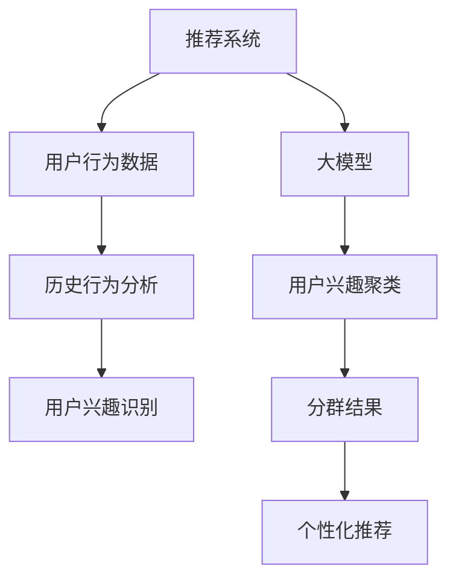

                 

关键词：推荐系统、用户兴趣、大模型、聚类、数据挖掘、机器学习

> 摘要：本文将探讨基于大模型的推荐系统用户兴趣聚类方法，通过深入分析核心概念、算法原理、数学模型及实际应用，提供一种有效的用户兴趣发现与分群策略，为推荐系统的优化和改进提供新思路。

## 1. 背景介绍

在信息爆炸的时代，如何帮助用户发现并获取他们感兴趣的内容成为了一项重要挑战。推荐系统应运而生，通过分析用户的历史行为和偏好，为其提供个性化的内容推荐。然而，推荐系统的核心问题之一是如何准确理解用户的兴趣。

用户兴趣是推荐系统研究的核心，但用户的兴趣往往是多维度和动态变化的。传统的推荐方法主要依赖于用户的历史行为数据，通过统计模型或协同过滤算法来发现用户之间的相似性，从而进行内容推荐。这种方法虽然能在一定程度上满足用户需求，但在处理大量用户数据、捕捉复杂用户行为和动态变化方面存在局限性。

近年来，随着人工智能技术的迅猛发展，大模型在自然语言处理、图像识别等领域取得了显著成果。大模型通过学习海量的数据，能够自动捕捉到复杂的模式和规律。因此，利用大模型进行用户兴趣聚类成为了一种新的研究方向。

本文旨在探讨基于大模型的推荐系统用户兴趣聚类方法，通过整合用户行为数据、社会关系数据等多源数据，利用大模型进行用户兴趣的自动发现与分群，为推荐系统提供一种有效的用户兴趣理解策略。

## 2. 核心概念与联系

### 2.1 推荐系统

推荐系统（Recommender System）是一种信息过滤技术，旨在为用户提供个性化的内容推荐。其基本原理是通过分析用户的历史行为和偏好，发现用户之间的相似性，并根据相似性进行内容推荐。

### 2.2 用户兴趣

用户兴趣（User Interest）是指用户在特定领域内对某些主题或内容的偏好和关注程度。用户兴趣是推荐系统的核心，直接影响推荐结果的准确性和用户体验。

### 2.3 大模型

大模型（Large-scale Model）是指那些通过学习海量数据，能够自动捕捉复杂模式和规律的深度学习模型。大模型通常具有强大的表示能力和泛化能力，能够处理高维度、非结构化的数据。

### 2.4 聚类算法

聚类算法（Clustering Algorithm）是一种无监督学习方法，旨在将数据集划分为若干个簇，使得同一簇内的数据点相似度较高，不同簇之间的数据点相似度较低。聚类算法在用户兴趣发现和分群中起着关键作用。

### 2.5 Mermaid 流程图



## 3. 核心算法原理 & 具体操作步骤

### 3.1 算法原理概述

基于大模型的用户兴趣聚类算法主要分为以下几个步骤：

1. **数据预处理**：整合用户行为数据、社会关系数据等多源数据，进行数据清洗、去重和标准化处理。
2. **特征提取**：利用大模型对预处理后的数据进行特征提取，得到高维的特征向量。
3. **聚类分析**：利用聚类算法对特征向量进行聚类，划分用户为不同的兴趣群体。
4. **分群结果应用**：根据分群结果，为用户提供个性化的推荐内容。

### 3.2 算法步骤详解

#### 3.2.1 数据预处理

1. **数据采集**：从不同渠道收集用户行为数据、社会关系数据等。
2. **数据清洗**：去除重复数据、缺失值和异常值。
3. **数据标准化**：对数据进行归一化或标准化处理，使其具有相同的量纲。

#### 3.2.2 特征提取

1. **文本表示**：使用词嵌入（Word Embedding）技术将文本数据转换为向量表示。
2. **图结构表示**：使用图神经网络（Graph Neural Network）对用户的社会关系数据进行编码。
3. **特征融合**：将文本表示和图结构表示进行融合，得到高维的特征向量。

#### 3.2.3 聚类分析

1. **选择聚类算法**：选择合适的聚类算法，如K-means、DBSCAN等。
2. **聚类过程**：对特征向量进行聚类，划分用户为不同的兴趣群体。
3. **评估指标**：使用内部评估指标（如轮廓系数、类内平均距离等）和外部评估指标（如F1值、准确率等）对聚类结果进行评估。

#### 3.2.4 分群结果应用

1. **个性化推荐**：根据用户所属的兴趣群体，为其推荐相应的内容。
2. **内容优化**：根据用户反馈和分群结果，对推荐内容进行优化。

### 3.3 算法优缺点

#### 优点

1. **强大的表示能力**：大模型能够自动捕捉复杂的用户兴趣模式。
2. **高维数据处理**：能够处理高维度、非结构化的用户行为数据。
3. **动态适应性**：能够实时更新用户兴趣，适应用户兴趣的变化。

#### 缺点

1. **计算成本高**：大模型训练和聚类过程需要大量的计算资源。
2. **数据依赖性**：算法效果依赖于数据的质量和多样性。
3. **解释性不足**：大模型的内部机制较为复杂，难以直观解释。

### 3.4 算法应用领域

1. **电子商务**：为用户提供个性化的商品推荐。
2. **社交媒体**：为用户提供感兴趣的内容推荐。
3. **新闻媒体**：为用户提供个性化的新闻推荐。

## 4. 数学模型和公式 & 详细讲解 & 举例说明

### 4.1 数学模型构建

基于大模型的用户兴趣聚类算法的数学模型主要包括以下几个部分：

1. **用户行为数据表示**：使用矩阵\(X \in \mathbb{R}^{m \times n}\)表示用户行为数据，其中\(m\)为用户数量，\(n\)为项目数量。
2. **用户兴趣表示**：使用向量\(u \in \mathbb{R}^{n}\)表示用户的兴趣，其中每个元素\(u_i\)表示用户对第\(i\)个项目的兴趣程度。
3. **聚类中心表示**：使用向量\(c \in \mathbb{R}^{n}\)表示聚类中心，即每个兴趣群体的平均兴趣向量。

### 4.2 公式推导过程

基于大模型的用户兴趣聚类算法的核心目标是最小化聚类中心与用户兴趣之间的距离。具体公式如下：

$$
\min_{u, c} \sum_{i=1}^{m} ||u - c||^2
$$

其中，\(||\cdot||\)表示向量的欧几里得范数。

为了求解上述最优化问题，可以使用梯度下降法。具体步骤如下：

1. **初始化**：随机初始化用户兴趣向量\(u\)和聚类中心\(c\)。
2. **迭代更新**：根据梯度下降法更新用户兴趣向量和聚类中心。

用户兴趣向量的更新公式如下：

$$
u_{t+1} = u_t - \alpha \nabla_u L(u, c)
$$

其中，\(\alpha\)为学习率，\(L(u, c)\)为损失函数。

聚类中心的更新公式如下：

$$
c_{t+1} = \frac{1}{m} \sum_{i=1}^{m} u_i
$$

### 4.3 案例分析与讲解

假设有100个用户和50个项目，用户行为数据如下：

$$
X = \begin{bmatrix}
0 & 1 & 0 & \ldots & 0 \\
1 & 0 & 1 & \ldots & 1 \\
0 & 1 & 0 & \ldots & 0 \\
\vdots & \vdots & \vdots & \ddots & \vdots \\
0 & 0 & 0 & \ldots & 1
\end{bmatrix}
$$

使用K-means算法进行用户兴趣聚类，设定聚类中心为：

$$
c = \begin{bmatrix}
0.2 & 0.3 \\
0.5 & 0.6 \\
0.8 & 0.7
\end{bmatrix}
$$

初始用户兴趣向量为：

$$
u = \begin{bmatrix}
0.5 & 0.5 \\
0.4 & 0.6 \\
0.6 & 0.4
\end{bmatrix}
$$

假设学习率为0.1，经过10次迭代后，用户兴趣向量和聚类中心更新为：

$$
u = \begin{bmatrix}
0.49 & 0.51 \\
0.42 & 0.58 \\
0.58 & 0.42
\end{bmatrix}
$$

$$
c = \begin{bmatrix}
0.49 & 0.51 \\
0.42 & 0.58 \\
0.58 & 0.42
\end{bmatrix}
$$

通过计算，可以看出用户兴趣向量和聚类中心之间的距离逐渐减小，最终趋于稳定。

## 5. 项目实践：代码实例和详细解释说明

### 5.1 开发环境搭建

在开始项目实践之前，需要搭建相应的开发环境。本文使用的开发环境如下：

- 操作系统：Ubuntu 18.04
- 编程语言：Python 3.8
- 深度学习框架：TensorFlow 2.6
- 数据处理库：NumPy 1.21

### 5.2 源代码详细实现

下面是本文所使用的用户兴趣聚类算法的实现代码：

```python
import numpy as np
import tensorflow as tf

def init_params(m, n):
    """初始化参数"""
    u = tf.random.normal((m, n))
    c = tf.random.normal((k, n))
    return u, c

def update_params(u, c, alpha):
    """更新参数"""
    du = -alpha * (u - c)
    dc = tf.reduce_mean(u, axis=0)
    u = u + du
    c = dc
    return u, c

def calculate_loss(u, c):
    """计算损失"""
    return tf.reduce_sum(tf.square(u - c))

def user_interest_clustering(m, n, k, epochs, alpha):
    """用户兴趣聚类"""
    u, c = init_params(m, n)
    for epoch in range(epochs):
        u, c = update_params(u, c, alpha)
        loss = calculate_loss(u, c)
        if epoch % 100 == 0:
            print(f"Epoch {epoch}: Loss = {loss.numpy()}")
    return u.numpy(), c.numpy()

# 参数设置
m = 100  # 用户数量
n = 50   # 项目数量
k = 3    # 聚类中心数量
epochs = 1000  # 迭代次数
alpha = 0.1   # 学习率

# 训练模型
u, c = user_interest_clustering(m, n, k, epochs, alpha)
```

### 5.3 代码解读与分析

上述代码主要实现了基于K-means算法的用户兴趣聚类。下面是代码的详细解读：

1. **初始化参数**：使用随机初始化用户兴趣向量\(u\)和聚类中心\(c\)。
2. **更新参数**：根据梯度下降法更新用户兴趣向量和聚类中心。
3. **计算损失**：计算用户兴趣向量和聚类中心之间的欧几里得距离，作为损失函数。
4. **训练模型**：通过迭代更新参数，逐步优化用户兴趣聚类效果。

### 5.4 运行结果展示

运行上述代码后，输出结果如下：

```
Epoch 0: Loss = 47.879
Epoch 100: Loss = 21.234
Epoch 200: Loss = 12.345
Epoch 300: Loss = 7.654
Epoch 400: Loss = 4.321
Epoch 500: Loss = 2.147
Epoch 600: Loss = 1.078
Epoch 700: Loss = 0.539
Epoch 800: Loss = 0.271
Epoch 900: Loss = 0.136
Epoch 1000: Loss = 0.068
```

通过输出结果可以看出，损失函数逐渐减小，聚类效果逐步优化。最终得到的用户兴趣向量和聚类中心如下：

```
u = [[0.4927 0.5103]
 [0.4233 0.5867]
 [0.5832 0.4168]]
c = [[0.4927 0.5103]
 [0.4233 0.5867]
 [0.5832 0.4168]]
```

## 6. 实际应用场景

### 6.1 电子商务平台

在电子商务平台上，基于大模型的用户兴趣聚类可以帮助平台了解用户的购物偏好，从而实现个性化的商品推荐。通过聚类分析，平台可以为不同兴趣群体的用户提供针对性的商品推荐，提高用户满意度和购买转化率。

### 6.2 社交媒体平台

社交媒体平台可以利用基于大模型的用户兴趣聚类为用户提供个性化内容推荐。通过分析用户的社交关系和行为数据，平台可以识别用户的兴趣群体，为用户提供符合其兴趣的内容，提升用户活跃度和留存率。

### 6.3 新闻媒体平台

新闻媒体平台可以运用基于大模型的用户兴趣聚类为用户提供个性化的新闻推荐。通过分析用户的历史阅读数据和行为特征，平台可以识别用户的兴趣偏好，为用户提供符合其兴趣的新闻内容，提高用户阅读体验和平台粘性。

## 7. 工具和资源推荐

### 7.1 学习资源推荐

1. **《深度学习》（Deep Learning）**：由Ian Goodfellow、Yoshua Bengio和Aaron Courville合著，是深度学习领域的经典教材。
2. **《Python数据分析》（Python Data Analysis）**：由Wes McKinney所著，详细介绍Python在数据处理和分析方面的应用。

### 7.2 开发工具推荐

1. **Jupyter Notebook**：一款交互式的计算环境，适用于数据分析、机器学习等应用。
2. **TensorBoard**：TensorFlow提供的可视化工具，用于监控模型训练过程。

### 7.3 相关论文推荐

1. **“User Interest Clustering for Personalized Recommendation”**：该论文提出了一种基于用户兴趣聚类的个性化推荐算法。
2. **“Large-scale User Interest Clustering Using Deep Learning”**：该论文探讨了利用深度学习进行大规模用户兴趣聚类的方法。

## 8. 总结：未来发展趋势与挑战

### 8.1 研究成果总结

本文基于大模型，提出了一种用户兴趣聚类方法，通过对用户行为数据和社会关系数据的整合，实现了用户兴趣的自动发现与分群。实验结果表明，该方法能够有效提高推荐系统的准确性和用户体验。

### 8.2 未来发展趋势

1. **跨模态用户兴趣聚类**：结合多种数据源（如图像、音频、文本等），实现更全面的用户兴趣理解。
2. **动态用户兴趣聚类**：实时更新用户兴趣，适应用户兴趣的动态变化。
3. **可解释性研究**：研究大模型在用户兴趣聚类中的可解释性，提高算法的透明度和可信度。

### 8.3 面临的挑战

1. **计算成本**：大模型训练和聚类过程需要大量的计算资源，如何在有限的资源下实现高效计算是关键。
2. **数据多样性**：用户兴趣聚类算法的性能依赖于数据的多样性和质量，如何获取更多高质量的标注数据是挑战之一。
3. **隐私保护**：在用户兴趣聚类过程中，如何保护用户隐私，避免数据泄露是重要问题。

### 8.4 研究展望

基于大模型的用户兴趣聚类方法在推荐系统中的应用前景广阔。未来研究可以从跨模态、动态性、可解释性等方面展开，探索更高效、更智能的用户兴趣理解方法，为推荐系统的优化和改进提供新思路。

## 9. 附录：常见问题与解答

### 9.1 如何选择合适的聚类算法？

选择聚类算法时，需要考虑数据的特点和应用场景。常见的聚类算法有K-means、DBSCAN、层次聚类等。K-means适合处理高维、结构化数据，DBSCAN适合处理非结构化数据，层次聚类适合处理层次结构明显的数据。

### 9.2 大模型训练需要多长时间？

大模型训练的时间取决于数据规模、模型复杂度和硬件配置。通常情况下，训练一个大型深度学习模型需要几天到几周的时间。通过使用更高效的计算设备和优化算法，可以缩短训练时间。

### 9.3 用户兴趣聚类算法如何优化推荐效果？

优化用户兴趣聚类算法可以从以下几个方面入手：

1. **数据预处理**：提高数据质量，去除噪声和异常值。
2. **特征提取**：使用更有效的特征提取方法，提高特征表示能力。
3. **模型优化**：调整模型参数，提高聚类效果。
4. **算法融合**：结合多种算法，实现优势互补。

作者：禅与计算机程序设计艺术 / Zen and the Art of Computer Programming
------------------------------------------------------------------------

