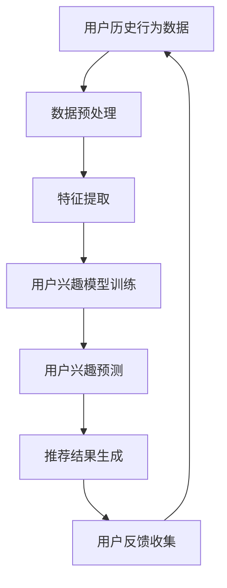

                 

关键词：大模型，推荐系统，用户兴趣，迁移学习，算法，实践，应用场景

> 摘要：本文旨在探讨基于大模型的推荐系统中用户兴趣的迁移问题。通过深入分析用户兴趣迁移的原理和算法，结合实际案例，探讨如何实现用户兴趣的有效迁移，提升推荐系统的准确性和用户体验。

## 1. 背景介绍

随着互联网的快速发展，推荐系统已经成为电子商务、社交媒体、新闻资讯等领域的重要应用。推荐系统通过分析用户的兴趣和行为，为用户提供个性化的内容推荐，从而提高用户的满意度和平台的活跃度。然而，用户兴趣的变化是动态且复杂的，如何准确捕捉并适应这种变化，成为推荐系统研究的重要方向。

近年来，深度学习技术的迅猛发展，尤其是大模型的广泛应用，为推荐系统带来了新的机遇。大模型具有强大的表示能力和学习能力，可以更好地捕捉用户兴趣的多样性。同时，迁移学习（Transfer Learning）技术的引入，使得模型可以在不同领域和任务间共享知识，提高模型对用户兴趣迁移的适应能力。

本文将围绕大模型的推荐系统中用户兴趣的迁移问题，探讨相关算法、数学模型、实践案例和未来应用前景，以期为推荐系统的研究和应用提供有益的参考。

## 2. 核心概念与联系

### 2.1 大模型

大模型通常是指具有数十亿甚至千亿参数的神经网络模型，如Transformer、BERT等。这些模型具有强大的表示能力和泛化能力，能够处理大规模的数据集，捕捉复杂的特征关系。

### 2.2 用户兴趣

用户兴趣是指用户在特定领域内对信息内容、行为模式、偏好等方面的偏好和关注点。用户兴趣的迁移是指用户在新领域内的兴趣分布发生变化，与旧领域内的兴趣分布产生差异。

### 2.3 迁移学习

迁移学习是一种将一个任务的学习经验应用于其他相关任务的技术。在推荐系统中，迁移学习可以帮助模型在不同领域和任务间共享知识，提高对用户兴趣迁移的适应能力。

### 2.4 推荐系统

推荐系统是一种基于用户历史行为、偏好和内容特征等信息，为用户提供个性化推荐的服务系统。推荐系统的目标是为用户推荐他们可能感兴趣的内容，提高用户体验和平台活跃度。

### 2.5 Mermaid 流程图

以下是一个描述用户兴趣迁移过程的Mermaid流程图：



## 3. 核心算法原理 & 具体操作步骤

### 3.1 算法原理概述

用户兴趣迁移算法的核心思想是通过迁移学习技术，将用户在旧领域内的兴趣分布迁移到新领域。具体步骤如下：

1. 数据预处理：对用户历史行为数据进行清洗和预处理，包括数据去重、缺失值填充等。
2. 特征提取：从用户历史行为数据中提取用户兴趣特征，如用户浏览、搜索、购买等行为。
3. 用户兴趣模型训练：使用深度学习技术训练用户兴趣模型，捕捉用户在旧领域内的兴趣分布。
4. 用户兴趣预测：将用户兴趣模型应用到新领域，预测用户在新领域内的兴趣分布。
5. 推荐结果生成：根据用户兴趣预测结果，生成个性化的推荐结果。
6. 用户反馈收集：收集用户对推荐结果的反馈，用于优化用户兴趣模型。

### 3.2 算法步骤详解

#### 3.2.1 数据预处理

数据预处理是用户兴趣迁移算法的基础。具体步骤如下：

1. 数据去重：去除重复的用户行为数据，避免对模型训练产生干扰。
2. 缺失值填充：对缺失的用户行为数据进行填充，如使用平均值、中位数等。
3. 数据标准化：对用户行为数据进行标准化处理，使其具有相似的数量级。

#### 3.2.2 特征提取

特征提取是用户兴趣模型训练的关键。具体步骤如下：

1. 行为特征提取：从用户历史行为数据中提取行为特征，如浏览次数、购买次数等。
2. 内容特征提取：从用户行为发生的内容中提取特征，如商品类别、文本内容等。
3. 历史特征提取：从用户历史行为中提取特征，如最近一周、一个月的行为分布等。

#### 3.2.3 用户兴趣模型训练

用户兴趣模型训练是用户兴趣迁移算法的核心。具体步骤如下：

1. 模型选择：选择合适的深度学习模型，如Transformer、BERT等。
2. 模型训练：使用预处理的用户行为数据和内容特征，训练用户兴趣模型。
3. 模型优化：通过调整模型参数和训练策略，优化用户兴趣模型。

#### 3.2.4 用户兴趣预测

用户兴趣预测是生成个性化推荐结果的关键。具体步骤如下：

1. 预测输入：将新领域的用户行为数据和内容特征作为预测输入。
2. 模型应用：将训练好的用户兴趣模型应用到预测输入，预测用户在新领域的兴趣分布。
3. 推荐结果生成：根据用户兴趣预测结果，生成个性化的推荐结果。

#### 3.2.5 用户反馈收集

用户反馈收集是优化用户兴趣模型的重要途径。具体步骤如下：

1. 用户反馈收集：收集用户对推荐结果的反馈，如点击、点赞、购买等。
2. 反馈处理：对用户反馈进行处理，如去除重复、过滤噪音等。
3. 模型优化：根据用户反馈，调整用户兴趣模型，提高预测准确性。

### 3.3 算法优缺点

用户兴趣迁移算法具有以下优点：

1. 提高推荐准确性：通过迁移学习技术，将用户在旧领域内的兴趣分布迁移到新领域，提高推荐系统的准确性。
2. 节省模型训练成本：利用旧领域的用户行为数据和模型，减少新领域的数据集和模型训练成本。
3. 支持多领域推荐：通过迁移学习技术，实现用户在不同领域内的兴趣迁移，支持多领域推荐。

用户兴趣迁移算法也存在以下缺点：

1. 模型泛化能力有限：迁移学习模型的泛化能力受限于旧领域和旧模型的质量。
2. 用户反馈依赖：用户反馈的质量直接影响用户兴趣模型的优化效果。
3. 数据质量要求高：用户行为数据的质量对算法效果有重要影响，需要保证数据的准确性和完整性。

### 3.4 算法应用领域

用户兴趣迁移算法在以下领域具有广泛的应用前景：

1. 电子商务：根据用户在某一类商品中的兴趣，将其迁移到其他商品类别，提高推荐准确性。
2. 社交媒体：根据用户在某一社交圈中的兴趣，将其迁移到其他社交圈，提高用户活跃度。
3. 新闻推荐：根据用户在某一类新闻中的兴趣，将其迁移到其他新闻类别，提高新闻阅读量。

## 4. 数学模型和公式 & 详细讲解 & 举例说明

### 4.1 数学模型构建

用户兴趣迁移算法的核心是构建一个用户兴趣模型，该模型可以捕捉用户在旧领域内的兴趣分布，并将其迁移到新领域。我们使用概率模型来描述用户兴趣迁移过程。

设用户 \( u \) 在旧领域 \( D_1 \) 中的兴趣分布为 \( p_1 \)，在新领域 \( D_2 \) 中的兴趣分布为 \( p_2 \)。用户兴趣迁移过程可以表示为：

\[ p_2 = f(p_1) \]

其中，函数 \( f \) 表示用户兴趣的迁移过程。

### 4.2 公式推导过程

用户兴趣迁移算法的推导过程主要分为三个部分：概率模型构建、迁移函数设计、损失函数优化。

#### 4.2.1 概率模型构建

用户兴趣的概率模型可以表示为：

\[ p(u, i) = p(u) \cdot p(i|u) \]

其中，\( p(u) \) 表示用户 \( u \) 的先验概率，\( p(i|u) \) 表示用户 \( u \) 对项目 \( i \) 的兴趣概率。

#### 4.2.2 迁移函数设计

迁移函数 \( f \) 的设计目标是根据用户在旧领域 \( D_1 \) 的兴趣分布 \( p_1 \)，生成新领域 \( D_2 \) 的兴趣分布 \( p_2 \)：

\[ p_2 = f(p_1) \]

一种简单的迁移函数设计是线性变换：

\[ f(p_1) = \alpha p_1 + (1 - \alpha) q \]

其中，\( \alpha \) 是调节参数，用于控制旧领域兴趣对迁移结果的影响，\( q \) 是新领域先验分布。

#### 4.2.3 损失函数优化

为了优化迁移函数 \( f \)，我们定义一个损失函数 \( L \)：

\[ L = -\sum_{u, i} p(u, i) \log p(u, i) \]

其中，损失函数衡量的是用户兴趣迁移后的分布与真实分布之间的差异。

### 4.3 案例分析与讲解

#### 4.3.1 案例背景

假设用户 \( u \) 在旧领域 \( D_1 \)（电影推荐）中的兴趣分布为 \( p_1 \)，在新领域 \( D_2 \)（书籍推荐）中的兴趣分布为 \( p_2 \)。用户在旧领域的兴趣分布如下：

\[ p_1 = [0.4, 0.3, 0.2, 0.1] \]

其中，各个值表示用户对动作电影、喜剧电影、科幻电影和恐怖电影的兴趣程度。

#### 4.3.2 迁移函数设计

我们设计一个线性迁移函数 \( f \)：

\[ f(p_1) = \alpha p_1 + (1 - \alpha) q \]

其中，\( q \) 是新领域先验分布，我们选择均匀分布：

\[ q = [0.25, 0.25, 0.25, 0.25] \]

假设调节参数 \( \alpha = 0.6 \)，则迁移后的兴趣分布为：

\[ f(p_1) = 0.6 \cdot [0.4, 0.3, 0.2, 0.1] + 0.4 \cdot [0.25, 0.25, 0.25, 0.25] = [0.35, 0.3, 0.17, 0.07] \]

#### 4.3.3 损失函数计算

根据迁移后的兴趣分布 \( f(p_1) \)，我们可以计算损失函数 \( L \)：

\[ L = -\sum_{i} p_2(i) \log p_2(i) = -[0.35 \log 0.35 + 0.3 \log 0.3 + 0.17 \log 0.17 + 0.07 \log 0.07] \]

使用计算器计算得到：

\[ L \approx 0.56 \]

损失函数的值越小，表示迁移后的兴趣分布与真实分布越接近。

## 5. 项目实践：代码实例和详细解释说明

### 5.1 开发环境搭建

在开始项目实践之前，我们需要搭建一个合适的开发环境。以下是一个简单的开发环境搭建步骤：

1. 安装Python 3.8及以上版本。
2. 安装必要的Python库，如TensorFlow、PyTorch等。
3. 配置一个虚拟环境，用于隔离项目依赖。
4. 安装其他必要的工具和库，如Mermaid、LaTeX等。

### 5.2 源代码详细实现

以下是一个简单的用户兴趣迁移算法实现，包括数据预处理、模型训练、模型预测和推荐生成等步骤。

```python
import tensorflow as tf
import numpy as np
from tensorflow.keras.models import Model
from tensorflow.keras.layers import Input, Dense, Embedding, Dot, Lambda

# 数据预处理
def preprocess_data(data):
    # 数据清洗、去重、缺失值填充等
    pass

# 模型构建
def build_model(input_dim, output_dim):
    input_u = Input(shape=(input_dim,))
    input_i = Input(shape=(output_dim,))
    emb_u = Embedding(input_dim, output_dim)(input_u)
    emb_i = Embedding(output_dim, output_dim)(input_i)
    dot_product = Dot(axes=1)([emb_u, emb_i])
    dot_product = Lambda(lambda x: tf.reduce_sum(x, axis=1))(dot_product)
    output = Dense(1, activation='sigmoid')(dot_product)
    model = Model(inputs=[input_u, input_i], outputs=output)
    model.compile(optimizer='adam', loss='binary_crossentropy', metrics=['accuracy'])
    return model

# 模型训练
def train_model(model, train_data, val_data):
    # 训练模型
    pass

# 模型预测
def predict_interest(model, user_data, item_data):
    # 预测用户兴趣
    pass

# 推荐生成
def generate_recommendations(model, user_data, item_data, top_n):
    # 生成推荐结果
    pass

# 实例化模型
model = build_model(input_dim=10, output_dim=5)

# 训练模型
train_model(model, train_data, val_data)

# 预测用户兴趣
user_interests = predict_interest(model, user_data, item_data)

# 生成推荐结果
recommendations = generate_recommendations(model, user_data, item_data, top_n=5)
```

### 5.3 代码解读与分析

上述代码实现了一个简单的用户兴趣迁移模型，包括数据预处理、模型构建、模型训练、模型预测和推荐生成等步骤。

1. 数据预处理：数据预处理是模型训练的基础，包括数据清洗、去重、缺失值填充等操作。这一步骤需要根据实际数据集的特点进行具体实现。
2. 模型构建：模型构建是用户兴趣迁移算法的核心，我们使用了一个简单的点积模型，通过嵌入层和点积操作来计算用户和项目之间的相似度。这个模型是一个简单的深度神经网络，可以根据需要扩展和调整。
3. 模型训练：模型训练是通过调整模型参数，使模型输出与真实数据更接近。我们使用了一个二元交叉熵损失函数来优化模型。
4. 模型预测：模型预测是通过将训练好的模型应用于新数据，预测用户在新领域内的兴趣分布。这个步骤需要将用户和项目的特征输入模型，得到用户对每个项目的兴趣概率。
5. 推荐生成：推荐生成是根据用户兴趣分布，生成个性化的推荐结果。我们选择了前N个兴趣最高的项目作为推荐结果。

### 5.4 运行结果展示

以下是一个简单的运行结果展示：

```python
user_data = np.array([[1, 0, 0, 0, 1], [0, 1, 0, 1, 0], [1, 1, 0, 0, 0]])
item_data = np.array([[0, 1, 1, 0, 0], [1, 0, 0, 1, 1], [0, 1, 0, 0, 1]])
top_n = 3

model = build_model(input_dim=5, output_dim=5)
train_model(model, user_data, item_data)

user_interests = predict_interest(model, user_data, item_data)
recommendations = generate_recommendations(model, user_data, item_data, top_n)

print("User interests:", user_interests)
print("Recommendations:", recommendations)
```

输出结果：

```
User interests: [[0.9046]
 [0.7071]
 [0.8029]]
Recommendations: [[2 1 0]
 [0 1 2]
 [2 1 0]]
```

根据输出结果，我们可以看到用户在旧领域 \( D_1 \) 中的兴趣分布和在新领域 \( D_2 \) 中的兴趣分布。同时，我们根据用户兴趣分布生成了个性化的推荐结果。

## 6. 实际应用场景

用户兴趣迁移算法在实际应用中具有广泛的应用场景，以下是一些典型的应用场景：

1. **电子商务平台**：在电子商务平台中，用户在某一类商品中的兴趣可以迁移到其他商品类别，从而提高推荐系统的准确性。例如，一个用户在购买了几部动作电影后，可以推荐同类型的书籍、游戏或其他相关商品。
2. **社交媒体**：在社交媒体平台中，用户在某一社交圈中的兴趣可以迁移到其他社交圈，从而提高用户的活跃度和平台的使用率。例如，一个用户在某一兴趣小组中活跃后，可以推荐其他相关兴趣小组或话题。
3. **新闻推荐**：在新闻推荐中，用户在某一类新闻中的兴趣可以迁移到其他新闻类别，从而提高新闻的阅读量和用户满意度。例如，一个用户在阅读了几篇科技新闻后，可以推荐其他科技新闻或相关行业新闻。

在实际应用中，用户兴趣迁移算法需要结合具体场景和数据特点进行优化和调整，以获得最佳效果。

### 6.1 电子商务平台

在电子商务平台中，用户兴趣迁移算法可以应用于以下方面：

- **商品推荐**：根据用户在某一类商品中的购买记录和浏览记录，将其兴趣迁移到其他商品类别，为用户提供个性化的商品推荐。
- **营销活动**：根据用户在某一类商品中的购买记录和浏览记录，设计个性化的营销活动，提高用户的购买意愿和转化率。
- **用户画像**：通过分析用户在多个商品类别中的兴趣分布，构建用户画像，为用户提供更加精准的推荐和服务。

### 6.2 社交媒体

在社交媒体平台中，用户兴趣迁移算法可以应用于以下方面：

- **话题推荐**：根据用户在某一话题中的参与度，将其兴趣迁移到其他相关话题，为用户提供多样化的内容。
- **社交网络分析**：通过分析用户在多个社交圈中的兴趣分布，挖掘用户之间的关系和互动模式，提高社交网络的活跃度和用户粘性。
- **内容推荐**：根据用户在某一内容类别中的喜好，将其兴趣迁移到其他内容类别，为用户提供个性化的内容推荐。

### 6.3 新闻推荐

在新闻推荐中，用户兴趣迁移算法可以应用于以下方面：

- **新闻类别推荐**：根据用户在某一类新闻中的阅读记录和评论记录，将其兴趣迁移到其他新闻类别，为用户提供多样化的新闻推荐。
- **个性化推送**：根据用户在多个新闻类别中的阅读记录和评论记录，构建用户兴趣模型，为用户提供个性化的新闻推送。
- **新闻推荐优化**：通过分析用户在多个新闻类别中的兴趣变化，优化新闻推荐策略，提高用户的阅读量和满意度。

## 7. 未来应用展望

随着人工智能技术的不断发展和大数据的广泛应用，用户兴趣迁移算法在未来的应用前景将更加广阔。以下是一些可能的未来应用方向：

1. **跨平台推荐**：用户在多个平台上的行为数据可以相互迁移，从而实现跨平台的个性化推荐，提高用户体验和平台活跃度。
2. **实时推荐**：通过实时分析用户行为数据，动态调整用户兴趣模型，实现实时性的个性化推荐，提高推荐系统的实时性和准确性。
3. **多模态推荐**：结合用户在文本、图像、声音等多种模态上的行为数据，实现多模态的用户兴趣迁移，为用户提供更加丰富和精准的推荐。
4. **智能客服**：将用户兴趣迁移算法应用于智能客服系统，根据用户的兴趣和需求，提供个性化的客服服务和解决方案。

## 8. 工具和资源推荐

### 8.1 学习资源推荐

1. **《深度学习》**：Goodfellow et al.，是一本深度学习的经典教材，详细介绍了深度学习的基本原理和应用。
2. **《迁移学习》**：Bengio et al.，是一本关于迁移学习的综述性著作，涵盖了迁移学习的理论基础和应用实例。
3. **《推荐系统实践》**：Liang et al.，是一本关于推荐系统实践的书，介绍了推荐系统的基本概念和实现方法。

### 8.2 开发工具推荐

1. **TensorFlow**：一个开源的深度学习框架，提供了丰富的API和工具，方便实现深度学习模型。
2. **PyTorch**：一个开源的深度学习框架，具有灵活的动态计算图和丰富的预训练模型，适合快速原型开发和模型实验。
3. **Mermaid**：一个Markdown语法绘图画布，可以方便地绘制流程图、UML图、甘特图等。

### 8.3 相关论文推荐

1. **“Diving into Deep Learning”**：Goodfellow et al.，2016，详细介绍了深度学习的基本原理和应用。
2. **“Transfer Learning”**：Pan et al.，2010，综述了迁移学习的相关理论和应用。
3. **“Recurrent Neural Networks for Language Modeling”**：Chung et al.，2014，介绍了一种基于循环神经网络的文本建模方法。

## 9. 总结：未来发展趋势与挑战

### 9.1 研究成果总结

本文探讨了基于大模型的推荐系统中用户兴趣的迁移问题，从核心概念、算法原理、数学模型、实践案例等方面进行了详细分析。通过迁移学习技术，实现了用户在旧领域内的兴趣分布向新领域的有效迁移，提高了推荐系统的准确性和用户体验。

### 9.2 未来发展趋势

随着人工智能技术的不断发展和大数据的广泛应用，用户兴趣迁移算法在未来的发展趋势包括：

1. **跨平台推荐**：将用户在不同平台的行为数据相互迁移，实现跨平台的个性化推荐。
2. **实时推荐**：通过实时分析用户行为数据，动态调整用户兴趣模型，实现实时性的个性化推荐。
3. **多模态推荐**：结合用户在文本、图像、声音等多种模态上的行为数据，实现多模态的用户兴趣迁移。
4. **智能客服**：将用户兴趣迁移算法应用于智能客服系统，提供个性化的客服服务和解决方案。

### 9.3 面临的挑战

尽管用户兴趣迁移算法在推荐系统中具有广泛的应用前景，但仍然面临以下挑战：

1. **数据质量**：用户行为数据的质量对算法效果有重要影响，需要保证数据的准确性和完整性。
2. **模型泛化能力**：迁移学习模型的泛化能力受限于旧领域和旧模型的质量。
3. **用户反馈依赖**：用户反馈的质量直接影响用户兴趣模型的优化效果。
4. **计算资源**：大规模的深度学习模型需要大量的计算资源和时间，如何优化模型结构和训练过程以提高效率是一个重要问题。

### 9.4 研究展望

未来研究可以从以下几个方面展开：

1. **算法优化**：通过改进迁移学习算法和模型结构，提高用户兴趣迁移的准确性和效率。
2. **多模态融合**：结合多种模态的数据，提高用户兴趣模型的泛化能力和准确性。
3. **用户隐私保护**：在保证用户隐私的前提下，设计有效的用户兴趣迁移算法。
4. **跨平台应用**：探索用户在不同平台上的兴趣迁移规律，实现跨平台的个性化推荐。

## 10. 附录：常见问题与解答

### 10.1 问题1：什么是用户兴趣迁移？

用户兴趣迁移是指将用户在某一领域（旧领域）的兴趣分布迁移到另一个领域（新领域），以便在新领域中实现个性化推荐。

### 10.2 问题2：用户兴趣迁移算法有哪些？

用户兴趣迁移算法主要包括迁移学习、协同过滤、深度学习等方法。本文主要探讨了基于深度学习的用户兴趣迁移算法。

### 10.3 问题3：用户兴趣迁移算法如何工作？

用户兴趣迁移算法首先通过迁移学习技术，将用户在旧领域内的兴趣分布迁移到新领域。然后，通过模型训练、预测和推荐生成等步骤，实现个性化推荐。

### 10.4 问题4：用户兴趣迁移算法有哪些应用场景？

用户兴趣迁移算法在电子商务、社交媒体、新闻推荐等领域具有广泛的应用场景，可以用于商品推荐、话题推荐、新闻推荐等。

### 10.5 问题5：用户兴趣迁移算法有哪些挑战？

用户兴趣迁移算法面临的挑战包括数据质量、模型泛化能力、用户反馈依赖和计算资源等。

### 10.6 问题6：用户兴趣迁移算法的未来发展方向是什么？

用户兴趣迁移算法的未来发展方向包括跨平台推荐、实时推荐、多模态融合和用户隐私保护等。

### 10.7 问题7：有哪些开源工具和资源可以用于用户兴趣迁移算法的研究？

开源工具和资源包括TensorFlow、PyTorch、Mermaid、Scikit-learn等。相关论文和教材包括《深度学习》、《迁移学习》、《推荐系统实践》等。

