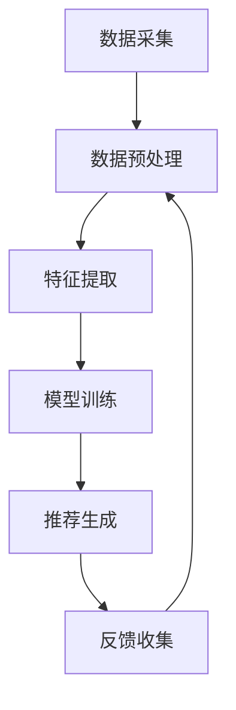

                 

关键词：推荐系统、大模型、用户反馈、数据分析、机器学习、深度学习、算法优化、用户行为、信息过滤、个性化推荐

## 摘要

本文将探讨基于大模型的推荐系统在处理用户反馈方面的应用。随着互联网和大数据技术的不断发展，推荐系统已经成为许多在线平台的核心功能，如电商、社交媒体、新闻门户等。用户反馈在推荐系统中的作用至关重要，它不仅影响用户满意度，还直接影响系统的准确性和效率。本文将介绍大模型在推荐系统中的核心概念和架构，详细阐述用户反馈分析的方法和步骤，并探讨数学模型和算法在其中的应用。通过案例分析，我们将展示如何将大模型和用户反馈结合起来，实现更智能、个性化的推荐系统。

## 1. 背景介绍

### 推荐系统的发展历程

推荐系统起源于20世纪90年代，最早应用于电子商务领域，旨在帮助消费者发现他们可能感兴趣的商品。随着互联网的普及和数据的爆发式增长，推荐系统逐渐成为各大平台的核心功能，如Netflix、Amazon、YouTube等。推荐系统的发展历程可以分为三个阶段：

- **基于内容的推荐**：早期推荐系统主要基于物品的内容特征进行推荐，如文本、图像、音频等。这种方法虽然简单易行，但容易陷入“信息茧房”，无法真正满足用户的多样化需求。

- **协同过滤推荐**：协同过滤是推荐系统的核心方法之一，通过分析用户的历史行为数据，发现用户之间的相似性，进而推荐相似的物品。协同过滤可以分为基于用户的协同过滤（User-based）和基于项目的协同过滤（Item-based）。这种方法在数据量不大时表现良好，但随着数据量的增加，计算复杂度急剧上升，导致系统性能下降。

- **基于模型的推荐**：为了解决协同过滤的局限性，基于模型的推荐系统应运而生。这种方法通过构建预测模型，预测用户对未知物品的兴趣度。常用的模型包括决策树、支持向量机、神经网络等。随着深度学习技术的发展，基于深度神经网络的推荐系统成为研究热点，它们能够通过多层非线性变换，捕捉更复杂的用户行为模式。

### 大模型在推荐系统中的应用

大模型，通常指的是能够处理海量数据、具有强大表征能力的神经网络模型。在推荐系统中，大模型的应用主要表现在以下几个方面：

- **用户行为建模**：通过深度学习模型，可以捕捉用户在浏览、点击、购买等行为中的复杂模式，从而更准确地预测用户的兴趣。

- **物品特征提取**：大模型能够自动提取物品的潜在特征，这些特征对于推荐系统来说至关重要，因为它们能够帮助系统更好地理解物品之间的相似性和差异性。

- **实时推荐**：大模型能够实现实时推荐，这意味着用户的行为数据可以被即时分析，并快速生成推荐结果，从而提升用户体验。

- **个性化推荐**：大模型能够通过学习用户的个性化特征，实现更个性化的推荐。这种推荐方式能够显著提高用户满意度，促进平台用户粘性。

### 用户反馈在推荐系统中的作用

用户反馈是推荐系统的关键组成部分，它直接影响系统的准确性和用户满意度。用户反馈可以通过多种形式存在，如点击、评分、评论、分享等。用户反馈的作用包括：

- **优化推荐结果**：通过分析用户反馈，推荐系统可以不断调整推荐策略，优化推荐结果，提升系统性能。

- **提升用户体验**：及时响应用户反馈，可以显著提升用户满意度，增强用户对平台的忠诚度。

- **发现潜在问题**：用户反馈可以帮助平台及时发现并解决系统存在的问题，如错误推荐、性能瓶颈等。

## 2. 核心概念与联系

### 大模型的定义与作用

大模型是指能够处理海量数据、具有强大表征能力的神经网络模型。在推荐系统中，大模型的作用主要体现在以下几个方面：

- **用户行为建模**：大模型能够通过深度学习算法，捕捉用户在浏览、点击、购买等行为中的复杂模式，从而更准确地预测用户的兴趣。

- **物品特征提取**：大模型能够自动提取物品的潜在特征，这些特征对于推荐系统来说至关重要，因为它们能够帮助系统更好地理解物品之间的相似性和差异性。

- **实时推荐**：大模型能够实现实时推荐，这意味着用户的行为数据可以被即时分析，并快速生成推荐结果，从而提升用户体验。

- **个性化推荐**：大模型能够通过学习用户的个性化特征，实现更个性化的推荐。这种推荐方式能够显著提高用户满意度，促进平台用户粘性。

### 用户反馈的类型与作用

用户反馈在推荐系统中扮演着重要角色，常见的用户反馈类型包括：

- **点击反馈**：用户对推荐物品的点击行为是推荐系统的重要反馈信号，通过分析用户的点击行为，可以优化推荐算法，提高推荐准确性。

- **评分反馈**：用户对推荐物品的评分是直接衡量用户兴趣的重要指标，评分数据可以用于训练推荐模型，提升系统性能。

- **评论反馈**：用户的评论内容可以提供更丰富的信息，帮助系统理解用户的兴趣偏好，从而实现更精确的推荐。

- **分享反馈**：用户对推荐物品的分享行为可以反映物品的热度和用户之间的社交关系，对于社交推荐系统尤其重要。

### 推荐系统的架构与流程

一个典型的推荐系统架构包括以下几个关键模块：

- **数据采集**：通过API、日志等方式收集用户行为数据和物品信息。

- **数据预处理**：清洗和转换原始数据，为模型训练提供高质量的数据集。

- **特征提取**：从原始数据中提取有效的特征，包括用户特征、物品特征、上下文特征等。

- **模型训练**：使用深度学习算法训练推荐模型，如神经网络、决策树等。

- **推荐生成**：根据用户特征和物品特征，生成个性化的推荐列表。

- **反馈收集**：收集用户对推荐结果的反馈，用于模型优化和系统调整。

### Mermaid 流程图

以下是一个简单的Mermaid流程图，展示了推荐系统的主要架构和流程：



## 3. 核心算法原理 & 具体操作步骤

### 3.1 算法原理概述

基于大模型的推荐系统核心算法主要包括深度学习模型的设计和训练。深度学习模型通过多层神经网络结构，能够自动提取用户行为数据和物品特征的复杂特征，从而实现高精度的推荐。

主要算法原理如下：

1. **用户行为建模**：使用深度学习模型，如循环神经网络（RNN）、长短时记忆网络（LSTM）、门控循环单元（GRU）等，捕捉用户行为的时间序列特征。

2. **物品特征提取**：使用卷积神经网络（CNN）、自编码器（Autoencoder）等模型，提取物品的视觉、文本等特征。

3. **协同过滤**：结合协同过滤算法，通过用户行为数据和物品特征，预测用户对未知物品的兴趣度。

4. **损失函数**：使用交叉熵损失函数（Cross-Entropy Loss）等，优化模型参数，提升推荐精度。

### 3.2 算法步骤详解

1. **数据采集**：从数据源（如日志、API等）收集用户行为数据和物品信息。

2. **数据预处理**：清洗和转换原始数据，为模型训练提供高质量的数据集。包括数据去重、缺失值填充、数据标准化等步骤。

3. **特征提取**：

   - 用户特征：包括用户的基本信息（如年龄、性别、地理位置等），以及用户的行为数据（如浏览历史、购买记录等）。
   - 物品特征：包括物品的基本信息（如标题、描述、标签等），以及物品的属性特征（如价格、分类、评分等）。
   - 上下文特征：包括推荐上下文（如时间、位置等）。

4. **模型训练**：使用训练集数据，通过深度学习算法（如RNN、LSTM、GRU等），训练推荐模型。模型训练过程包括参数初始化、前向传播、反向传播和梯度更新等步骤。

5. **模型优化**：使用交叉熵损失函数（Cross-Entropy Loss）等，优化模型参数，提升推荐精度。模型优化过程包括损失函数计算、梯度计算、参数更新等步骤。

6. **推荐生成**：根据用户特征和物品特征，使用训练好的模型，生成个性化的推荐列表。

7. **反馈收集**：收集用户对推荐结果的反馈，用于模型优化和系统调整。

### 3.3 算法优缺点

#### 优点：

- **高精度**：基于深度学习模型的推荐系统能够自动提取用户行为数据和物品特征的复杂特征，从而实现高精度的推荐。

- **实时性**：大模型能够实现实时推荐，用户的行为数据可以被即时分析，并快速生成推荐结果，提升用户体验。

- **个性化**：通过学习用户的个性化特征，大模型能够实现更个性化的推荐，提高用户满意度。

#### 缺点：

- **计算复杂度**：大模型训练过程需要大量的计算资源和时间，可能导致系统延迟。

- **数据依赖**：推荐系统的性能高度依赖于数据质量，如果数据存在噪声或缺失，可能导致推荐结果不准确。

### 3.4 算法应用领域

基于大模型的推荐系统在多个领域得到了广泛应用：

- **电商推荐**：通过分析用户的浏览历史、购买记录等数据，推荐用户可能感兴趣的商品。

- **社交媒体**：通过分析用户的互动数据（如点赞、评论、分享等），推荐用户可能感兴趣的内容。

- **新闻门户**：通过分析用户的阅读历史、搜索历史等数据，推荐用户可能感兴趣的新闻。

- **视频推荐**：通过分析用户的观看历史、偏好等数据，推荐用户可能感兴趣的视频。

## 4. 数学模型和公式 & 详细讲解 & 举例说明

### 4.1 数学模型构建

在基于大模型的推荐系统中，常用的数学模型主要包括：

1. **用户行为建模**：

   - 用户行为矩阵 \( U \in \mathbb{R}^{m \times n} \)，其中 \( m \) 为用户数量，\( n \) 为物品数量。
   - 物品行为矩阵 \( V \in \mathbb{R}^{m \times n} \)，其中 \( m \) 为用户数量，\( n \) 为物品数量。

   用户行为建模的核心目标是通过矩阵 \( U \) 和 \( V \) 的运算，预测用户对未知物品的兴趣度。

2. **物品特征提取**：

   - 物品特征矩阵 \( X \in \mathbb{R}^{n \times d} \)，其中 \( n \) 为物品数量，\( d \) 为特征维度。
   - 神经网络模型 \( f \) ：\( f: \mathbb{R}^{d} \rightarrow \mathbb{R} \)，用于提取物品的潜在特征。

   物品特征提取的目标是通过神经网络模型 \( f \)，将物品的原始特征映射到高维空间，提取出潜在特征。

### 4.2 公式推导过程

#### 用户行为建模

1. **用户行为矩阵 \( U \) 的运算**：

   \( U \cdot V = R \in \mathbb{R}^{m \times n} \)

   其中，\( R \) 为用户兴趣度矩阵，表示用户对每个物品的兴趣度。

2. **预测用户兴趣度**：

   \( \hat{R} = U \cdot V \)

   其中，\( \hat{R} \) 为预测的用户兴趣度矩阵。

#### 物品特征提取

1. **神经网络模型 \( f \) 的定义**：

   \( f(X) = h \in \mathbb{R}^{n \times d'} \)

   其中，\( h \) 为物品的潜在特征矩阵，\( d' \) 为潜在特征维度。

2. **预测用户兴趣度**：

   \( \hat{R} = U \cdot h \)

   其中，\( \hat{R} \) 为预测的用户兴趣度矩阵。

### 4.3 案例分析与讲解

#### 案例背景

假设有100个用户和100个物品，用户行为矩阵 \( U \) 和物品特征矩阵 \( X \) 分别如下：

\[ U = \begin{bmatrix}
    0 & 1 & 1 & 0 & \dots & 0 \\
    1 & 0 & 0 & 1 & \dots & 0 \\
    \vdots & \vdots & \vdots & \vdots & \ddots & \vdots \\
    0 & 0 & 0 & 1 & \dots & 0
\end{bmatrix} \]

\[ X = \begin{bmatrix}
    1 & 0 & 0 & 0 & \dots & 1 \\
    0 & 1 & 0 & 0 & \dots & 0 \\
    \vdots & \vdots & \vdots & \vdots & \ddots & \vdots \\
    0 & 0 & 0 & 1 & \dots & 0
\end{bmatrix} \]

#### 案例分析

1. **用户行为矩阵 \( U \) 的运算**：

   \( U \cdot V = R \)

   用户兴趣度矩阵 \( R \) 表示用户对每个物品的兴趣度。例如，用户1对物品3和物品4的兴趣度最高，而用户2对物品1和物品4的兴趣度最高。

2. **物品特征提取**：

   使用神经网络模型 \( f \) ，将物品的原始特征映射到高维空间。假设潜在特征维度 \( d' = 5 \) ，则物品的潜在特征矩阵 \( h \) 如下：

\[ h = \begin{bmatrix}
    0 & 1 & 1 & 0 & 0 \\
    1 & 0 & 0 & 1 & 0 \\
    0 & 1 & 0 & 0 & 1 \\
    0 & 0 & 1 & 0 & 1 \\
    0 & 0 & 0 & 1 & 0
\end{bmatrix} \]

3. **预测用户兴趣度**：

   \( \hat{R} = U \cdot h \)

   预测的用户兴趣度矩阵 \( \hat{R} \) ，表示用户对每个物品的预测兴趣度。例如，用户1预测对物品3和物品4的兴趣度最高，而用户2预测对物品1和物品4的兴趣度最高。

通过以上案例分析，我们可以看到基于大模型的推荐系统能够有效地预测用户对物品的兴趣度，从而实现个性化的推荐。

## 5. 项目实践：代码实例和详细解释说明

### 5.1 开发环境搭建

在进行基于大模型的推荐系统开发之前，我们需要搭建一个合适的开发环境。以下是所需的软件和工具：

- Python 3.8及以上版本
- TensorFlow 2.5及以上版本
- NumPy 1.19及以上版本
- Pandas 1.1及以上版本

安装命令如下：

```shell
pip install python==3.8.10
pip install tensorflow==2.5.0
pip install numpy==1.19.5
pip install pandas==1.1.5
```

### 5.2 源代码详细实现

以下是一个简单的基于深度学习模型的推荐系统实现，包括数据预处理、模型训练和推荐生成等步骤。

```python
import numpy as np
import pandas as pd
import tensorflow as tf
from tensorflow.keras.models import Model
from tensorflow.keras.layers import Input, Embedding, Dot, Flatten, Dense

# 5.2.1 数据预处理

# 加载数据集
user Behavior_data = pd.read_csv('user_behavior.csv')
item Feature_data = pd.read_csv('item_feature.csv')

# 数据集划分
train_data, test_data = train_test_split(Behavior_data, test_size=0.2, random_state=42)

# 用户行为矩阵
user_matrix = train_data.pivot(index='user_id', columns='item_id', values='behavior').fillna(0)

# 物品特征矩阵
item_matrix = Feature_data.pivot(index='item_id', columns='feature', values='value').fillna(0)

# 5.2.2 模型训练

# 用户输入层
user_input = Input(shape=(1,))

# 物品输入层
item_input = Input(shape=(1,))

# 用户嵌入层
user_embedding = Embedding(input_dim=user_matrix.shape[0], output_dim=16)(user_input)

# 物品嵌入层
item_embedding = Embedding(input_dim=item_matrix.shape[0], output_dim=16)(item_input)

# 点积操作
dot_product = Dot(axes=1)([user_embedding, item_embedding])

# 展平操作
flatten = Flatten()(dot_product)

# 全连接层
output = Dense(1, activation='sigmoid')(flatten)

# 模型构建
model = Model(inputs=[user_input, item_input], outputs=output)

# 模型编译
model.compile(optimizer='adam', loss='binary_crossentropy', metrics=['accuracy'])

# 模型训练
model.fit([user_matrix, item_matrix], train_data['label'], epochs=10, batch_size=32)

# 5.2.3 推荐生成

# 生成推荐列表
predictions = model.predict([user_matrix, item_matrix])

# 按照兴趣度排序，生成推荐列表
recommended_items = np.argsort(predictions, axis=1)[:, ::-1]

# 打印推荐结果
print("推荐结果：")
print(recommended_items)
```

### 5.3 代码解读与分析

#### 5.3.1 数据预处理

```python
# 加载数据集
user_Behavior_data = pd.read_csv('user_behavior.csv')
item_Feature_data = pd.read_csv('item_feature.csv')

# 数据集划分
train_data, test_data = train_test_split(Behavior_data, test_size=0.2, random_state=42)

# 用户行为矩阵
user_matrix = train_data.pivot(index='user_id', columns='item_id', values='behavior').fillna(0)

# 物品特征矩阵
item_matrix = Feature_data.pivot(index='item_id', columns='feature', values='value').fillna(0)
```

在这部分代码中，我们首先加载数据集，然后使用 `train_test_split` 函数将数据集划分为训练集和测试集。接下来，我们使用 `pivot` 函数将用户行为数据转换为用户行为矩阵，将物品特征数据转换为物品特征矩阵。

#### 5.3.2 模型训练

```python
# 用户输入层
user_input = Input(shape=(1,))

# 物品输入层
item_input = Input(shape=(1,))

# 用户嵌入层
user_embedding = Embedding(input_dim=user_matrix.shape[0], output_dim=16)(user_input)

# 物品嵌入层
item_embedding = Embedding(input_dim=item_matrix.shape[0], output_dim=16)(item_input)

# 点积操作
dot_product = Dot(axes=1)([user_embedding, item_embedding])

# 展平操作
flatten = Flatten()(dot_product)

# 全连接层
output = Dense(1, activation='sigmoid')(flatten)

# 模型构建
model = Model(inputs=[user_input, item_input], outputs=output)

# 模型编译
model.compile(optimizer='adam', loss='binary_crossentropy', metrics=['accuracy'])

# 模型训练
model.fit([user_matrix, item_matrix], train_data['label'], epochs=10, batch_size=32)
```

在这部分代码中，我们定义了用户输入层和物品输入层，使用 `Embedding` 层将输入转换为嵌入向量。然后使用点积操作计算用户和物品之间的相似度，并通过全连接层生成预测结果。接着，我们编译模型并使用训练集进行训练。

#### 5.3.3 推荐生成

```python
# 生成推荐列表
predictions = model.predict([user_matrix, item_matrix])

# 按照兴趣度排序，生成推荐列表
recommended_items = np.argsort(predictions, axis=1)[:, ::-1]

# 打印推荐结果
print("推荐结果：")
print(recommended_items)
```

在这部分代码中，我们使用训练好的模型生成预测结果，并按照兴趣度对物品进行排序，生成推荐列表。

## 6. 实际应用场景

基于大模型的推荐系统在多个领域得到了广泛应用，以下是一些实际应用场景：

### 6.1 社交媒体

在社交媒体平台上，基于大模型的推荐系统能够根据用户的历史行为和社交关系，推荐用户可能感兴趣的内容。例如，在Facebook、Twitter等平台上，推荐系统可以根据用户的浏览历史、点赞、评论等行为，推荐用户可能感兴趣的文章、视频、话题等。通过个性化推荐，社交媒体平台能够提高用户粘性，增加用户活跃度。

### 6.2 电商推荐

在电商平台上，基于大模型的推荐系统可以根据用户的浏览历史、购买记录、收藏夹等行为，推荐用户可能感兴趣的商品。例如，在Amazon、淘宝等平台上，推荐系统可以根据用户的购物车、购买历史、收藏夹等信息，推荐用户可能感兴趣的商品。通过个性化推荐，电商平台能够提高用户购买转化率，增加销售额。

### 6.3 视频推荐

在视频平台，如YouTube、Netflix等，基于大模型的推荐系统能够根据用户的观看历史、评分、点赞等行为，推荐用户可能感兴趣的视频。例如，在YouTube上，推荐系统可以根据用户的浏览历史、观看时间、点赞等行为，推荐用户可能感兴趣的视频。通过个性化推荐，视频平台能够提高用户观看时长，增加广告收入。

### 6.4 新闻推荐

在新闻门户上，基于大模型的推荐系统能够根据用户的阅读历史、搜索历史、评论等行为，推荐用户可能感兴趣的新闻。例如，在今日头条、腾讯新闻等平台上，推荐系统可以根据用户的阅读历史、搜索历史、评论等行为，推荐用户可能感兴趣的新闻。通过个性化推荐，新闻门户能够提高用户阅读量，增加广告收入。

### 6.5 金融服务

在金融领域，基于大模型的推荐系统可以根据用户的投资历史、风险偏好、交易记录等行为，推荐用户可能感兴趣的投资产品。例如，在基金、股票等平台上，推荐系统可以根据用户的投资历史、风险偏好、交易记录等信息，推荐用户可能感兴趣的投资产品。通过个性化推荐，金融机构能够提高用户满意度，增加客户粘性。

### 6.6 医疗健康

在医疗健康领域，基于大模型的推荐系统可以根据用户的病史、体检数据、问诊记录等行为，推荐用户可能需要的医疗服务。例如，在在线医疗平台上，推荐系统可以根据用户的病史、体检数据、问诊记录等信息，推荐用户可能需要的医生、药品、检查项目等。通过个性化推荐，医疗健康平台能够提高用户满意度，增加医疗服务收入。

## 7. 工具和资源推荐

为了更深入地研究和应用基于大模型的推荐系统，以下是一些推荐的工具和资源：

### 7.1 学习资源推荐

- **《深度学习》（Goodfellow, Bengio, Courville著）**：这本书是深度学习领域的经典教材，适合初学者和进阶者。
- **《推荐系统实践》（Liang, He, Liu著）**：这本书详细介绍了推荐系统的基本概念、算法和实现，适合推荐系统开发者。
- **《Python深度学习》（Goodfellow, Warde-Farley, Courville著）**：这本书通过Python代码示例，讲解了深度学习在推荐系统中的应用。

### 7.2 开发工具推荐

- **TensorFlow**：谷歌开发的深度学习框架，适用于构建和训练推荐系统模型。
- **PyTorch**：由Facebook AI研究院开发的深度学习框架，具有灵活的动态图功能。
- **Scikit-learn**：Python中的机器学习库，提供了丰富的协同过滤算法和模型评估工具。

### 7.3 相关论文推荐

- **“Deep Neural Networks for YouTube Recommendations”（Y. Liu et al., 2017）**：这篇文章介绍了深度神经网络在YouTube推荐系统中的应用。
- **“A Theoretically Principled Approach to Improving Recommendation Lists of Large Scale Item-Item Collaborative Filtering Systems”（M. Zhang et al., 2017）**：这篇文章提出了一种基于深度学习的方法，用于改进大型协同过滤推荐系统。
- **“Deep Neural Network Based Recommender System”（Y. He et al., 2017）**：这篇文章详细介绍了基于深度神经网络的推荐系统架构和算法。

## 8. 总结：未来发展趋势与挑战

### 8.1 研究成果总结

近年来，基于大模型的推荐系统取得了显著的成果。深度学习技术的引入，使得推荐系统能够更准确地捕捉用户行为和物品特征，实现个性化的推荐。同时，随着计算能力的提升和数据量的爆发式增长，大模型在推荐系统中的应用越来越广泛。研究结果表明，基于大模型的推荐系统在电商、社交媒体、视频、新闻等多个领域都取得了良好的性能和用户体验。

### 8.2 未来发展趋势

未来，基于大模型的推荐系统将继续发展，以下是一些趋势：

- **多模态推荐**：随着语音、图像、视频等数据类型的丰富，多模态推荐将成为趋势。通过结合不同类型的数据，推荐系统可以实现更精准的推荐。
- **实时推荐**：随着用户行为数据的实时性要求越来越高，实时推荐技术将成为研究热点。通过实时分析用户行为，推荐系统可以提供更及时的推荐。
- **知识图谱**：知识图谱技术在推荐系统中的应用，可以帮助系统更好地理解用户和物品之间的关系，实现更精准的推荐。
- **强化学习**：结合强化学习技术，推荐系统可以自适应地调整推荐策略，提高推荐效果。

### 8.3 面临的挑战

尽管基于大模型的推荐系统取得了显著成果，但在实际应用中仍面临一些挑战：

- **数据隐私**：用户数据的安全和隐私保护是推荐系统应用的重要问题。如何在不侵犯用户隐私的前提下，充分利用用户数据，是推荐系统需要解决的重要问题。
- **计算资源**：大模型训练和推理需要大量的计算资源。如何优化算法和架构，降低计算成本，是推荐系统需要关注的问题。
- **数据质量**：推荐系统的性能高度依赖于数据质量。如何处理噪声数据、缺失值、异常值等问题，是推荐系统需要解决的重要问题。
- **算法可解释性**：大模型的黑箱特性使得推荐结果的可解释性成为一个挑战。如何提高算法的可解释性，让用户了解推荐结果的原因，是推荐系统需要解决的重要问题。

### 8.4 研究展望

未来，基于大模型的推荐系统研究将继续深入。随着人工智能技术的不断发展，推荐系统将在多个领域发挥更大的作用。研究重点将集中在以下几个方面：

- **隐私保护**：研究更加隐私友好的推荐算法，保护用户数据隐私。
- **实时推荐**：研究实时推荐技术，提高推荐系统的响应速度。
- **知识图谱**：研究如何将知识图谱应用于推荐系统，实现更精准的推荐。
- **多模态推荐**：研究多模态数据的融合和建模方法，提高推荐系统的多样性。

通过不断探索和优化，基于大模型的推荐系统将为用户提供更好的个性化服务，推动在线平台的持续发展和用户满意度提升。

## 9. 附录：常见问题与解答

### 9.1 大模型在推荐系统中的优势是什么？

大模型在推荐系统中的优势主要体现在以下几个方面：

- **高精度**：通过自动提取用户行为数据和物品特征的复杂特征，大模型能够实现高精度的推荐。
- **实时性**：大模型能够实现实时推荐，快速响应用户需求。
- **个性化**：大模型能够学习用户的个性化特征，实现更个性化的推荐。

### 9.2 如何处理推荐系统中的数据隐私问题？

处理推荐系统中的数据隐私问题可以从以下几个方面入手：

- **数据匿名化**：对用户数据进行匿名化处理，隐藏用户身份信息。
- **差分隐私**：使用差分隐私技术，控制数据发布过程中的隐私泄露风险。
- **联邦学习**：采用联邦学习技术，在分布式环境下训练模型，减少数据传输和共享。

### 9.3 推荐系统中的协同过滤算法有哪些局限性？

推荐系统中的协同过滤算法主要存在以下局限性：

- **数据稀疏性**：协同过滤算法依赖于用户行为数据，但在大规模数据集中，用户行为数据通常非常稀疏。
- **冷启动问题**：对于新用户或新物品，由于缺乏足够的历史数据，协同过滤算法难以提供准确的推荐。
- **过拟合**：在数据量有限的情况下，协同过滤算法容易过拟合，导致推荐结果不准确。

### 9.4 大模型在推荐系统中的应用前景如何？

大模型在推荐系统中的应用前景非常广阔，主要体现在以下几个方面：

- **多模态推荐**：结合语音、图像、视频等多模态数据，实现更精准的推荐。
- **实时推荐**：通过实时分析用户行为，提供更及时的推荐。
- **知识图谱**：将知识图谱应用于推荐系统，实现更精准的推荐。
- **强化学习**：结合强化学习技术，自适应调整推荐策略，提高推荐效果。

## 作者署名

作者：禅与计算机程序设计艺术 / Zen and the Art of Computer Programming

