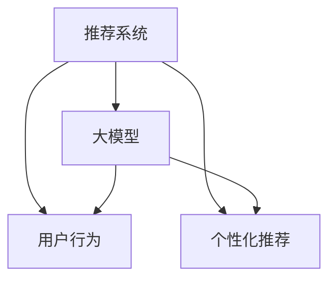

                 

 在当今的信息化社会中，推荐系统已经成为各类互联网应用的重要组成部分，从电商平台到社交媒体，它们通过预测用户的行为和兴趣，为用户推荐个性化的内容，从而提升用户体验和商业价值。然而，随着用户数据的爆炸式增长和用户行为的复杂化，传统的推荐系统已经难以满足日益增长的需求。因此，基于大模型的推荐系统用户行为预测成为当前研究的热点。本文将介绍这一领域的核心概念、算法原理、数学模型以及实际应用，旨在为读者提供全面而深入的洞察。

## 1. 背景介绍

推荐系统的发展可以追溯到20世纪90年代，当时基于协同过滤和内容推荐的系统开始应用于互联网应用中。然而，随着大数据和人工智能技术的崛起，推荐系统迎来了新的发展契机。近年来，深度学习、强化学习等先进算法的引入，使得推荐系统在预测精度和个性化水平上取得了显著提升。

用户行为的复杂性和多样性使得传统推荐系统面临巨大挑战。首先，用户行为数据量大且维度高，如何有效地处理和利用这些数据成为一个难题。其次，用户行为呈现出短时性和不确定性，这使得传统算法难以捕捉和预测。此外，不同用户之间的行为差异巨大，如何实现真正的个性化推荐也是一个重要问题。

大模型，特别是基于深度学习的模型，如BERT、GPT等，在自然语言处理领域取得了巨大的成功。这些模型通过大规模的数据训练，能够捕捉到数据的深层特征，从而在多个领域中表现出色。因此，将大模型应用于推荐系统用户行为预测，成为解决上述挑战的一种有效途径。

## 2. 核心概念与联系

为了深入理解基于大模型的推荐系统用户行为预测，我们首先需要介绍几个核心概念，并展示它们之间的联系。以下是几个重要的概念及其之间的Mermaid流程图：

### 2.1. 推荐系统

推荐系统（Recommender System）是一种信息过滤技术，旨在根据用户的偏好和历史行为，为用户推荐可能感兴趣的内容。推荐系统可以分为以下几类：

- 协同过滤（Collaborative Filtering）
- 内容推荐（Content-Based Filtering）
- 混合推荐（Hybrid Recommendation）
- 基于模型的推荐（Model-Based Recommendation）

### 2.2. 大模型

大模型（Large-scale Model）通常指的是具有数亿或数十亿参数的深度学习模型，如BERT、GPT等。这些模型通过在大规模数据集上进行训练，能够捕捉到数据的深层特征。

### 2.3. 用户行为

用户行为（User Behavior）包括用户的点击、购买、评价、搜索等行为数据。这些数据是推荐系统的重要输入。

### 2.4. 个性化推荐

个性化推荐（Personalized Recommendation）旨在为每个用户提供个性化的推荐，从而提升用户体验。

以下是核心概念及其联系的Mermaid流程图：



通过这个流程图，我们可以清晰地看到推荐系统、大模型、用户行为和个性化推荐之间的联系。

## 3. 核心算法原理 & 具体操作步骤

### 3.1 算法原理概述

基于大模型的推荐系统用户行为预测主要依赖于深度学习和强化学习等算法。以下是一个典型的算法框架：

1. 数据预处理：对用户行为数据、内容数据进行清洗、去噪和特征提取。
2. 模型训练：使用深度学习模型对预处理后的数据进行训练，以捕捉用户行为和内容的深层特征。
3. 预测与推荐：使用训练好的模型对新的用户行为进行预测，并根据预测结果生成个性化推荐。

### 3.2 算法步骤详解

#### 3.2.1 数据预处理

数据预处理是推荐系统的基础步骤，主要包括以下几个环节：

- 数据清洗：去除无效数据、填补缺失值、消除噪声。
- 特征提取：对用户行为数据、内容数据进行编码，提取有效的特征。
- 数据归一化：对特征进行归一化处理，以消除不同特征之间的量纲差异。

#### 3.2.2 模型训练

模型训练是算法的核心环节，主要包括以下几个步骤：

- 数据划分：将数据集划分为训练集、验证集和测试集。
- 模型选择：选择合适的深度学习模型，如BERT、GPT等。
- 模型训练：使用训练集对模型进行训练，并使用验证集进行调参。
- 模型评估：使用测试集对模型进行评估，以确定模型的预测性能。

#### 3.2.3 预测与推荐

预测与推荐是算法的输出环节，主要包括以下几个步骤：

- 用户行为预测：使用训练好的模型对新的用户行为进行预测。
- 生成推荐：根据用户行为预测结果，生成个性化的推荐列表。

### 3.3 算法优缺点

#### 优点

- 高预测精度：基于大模型的推荐系统能够捕捉到用户行为的深层特征，从而提高预测精度。
- 个性化推荐：能够为每个用户提供个性化的推荐，提升用户体验。

#### 缺点

- 计算资源消耗大：大模型训练和预测需要大量的计算资源。
- 数据依赖性强：模型的性能很大程度上依赖于数据质量和数据量。

### 3.4 算法应用领域

基于大模型的推荐系统用户行为预测在多个领域都有广泛的应用：

- 电商平台：通过预测用户购买行为，为用户推荐商品。
- 社交媒体：通过预测用户关注行为，为用户推荐感兴趣的内容。
- 娱乐平台：通过预测用户观看行为，为用户推荐视频和音乐。

## 4. 数学模型和公式 & 详细讲解 & 举例说明

### 4.1 数学模型构建

在基于大模型的推荐系统中，常用的数学模型包括深度学习模型和强化学习模型。以下是一个简单的深度学习模型的构建过程：

#### 4.1.1 输入层

输入层接收用户行为数据和内容数据，将其转化为模型可以处理的特征向量。

$$
x = [x_1, x_2, \ldots, x_n]
$$

其中，$x_i$ 表示第 $i$ 个特征。

#### 4.1.2 隐藏层

隐藏层通过神经网络结构对输入特征进行变换，以提取更深层次的特征。

$$
h = \sigma(Wx + b)
$$

其中，$h$ 表示隐藏层输出，$W$ 表示权重矩阵，$b$ 表示偏置项，$\sigma$ 表示激活函数。

#### 4.1.3 输出层

输出层生成预测结果，如用户行为概率分布或推荐列表。

$$
y = \sigma(W'y + b')
$$

其中，$y$ 表示输出层输出，$W'$ 表示权重矩阵，$b'$ 表示偏置项。

### 4.2 公式推导过程

以下是一个简单的深度学习模型公式的推导过程：

#### 4.2.1 前向传播

在前向传播过程中，输入数据通过隐藏层和输出层，最终生成预测结果。

$$
h = \sigma(Wx + b)
$$

$$
y = \sigma(W'h + b')
$$

#### 4.2.2 反向传播

在反向传播过程中，通过计算损失函数的梯度，对模型参数进行更新。

$$
\frac{\partial L}{\partial W'} = \frac{\partial L}{\partial y} \cdot \frac{\partial y}{\partial W'}
$$

$$
\frac{\partial L}{\partial W} = \frac{\partial L}{\partial h} \cdot \frac{\partial h}{\partial W}
$$

其中，$L$ 表示损失函数。

#### 4.2.3 模型更新

通过梯度下降算法，对模型参数进行更新。

$$
W'_{\text{new}} = W'_{\text{old}} - \alpha \cdot \frac{\partial L}{\partial W'}
$$

$$
W_{\text{new}} = W_{\text{old}} - \alpha \cdot \frac{\partial L}{\partial W}
$$

其中，$\alpha$ 表示学习率。

### 4.3 案例分析与讲解

以下是一个简单的用户行为预测案例：

#### 4.3.1 数据集

假设我们有一个包含用户行为数据的CSV文件，其中包含用户ID、行为类型、行为时间和行为内容等字段。

#### 4.3.2 数据预处理

1. 数据清洗：去除无效数据和填补缺失值。
2. 特征提取：将用户行为数据和内容数据进行编码，提取有效特征。
3. 数据归一化：对特征进行归一化处理。

#### 4.3.3 模型训练

1. 数据划分：将数据集划分为训练集、验证集和测试集。
2. 模型选择：选择一个深度学习模型，如BERT。
3. 模型训练：使用训练集对模型进行训练，并使用验证集进行调参。
4. 模型评估：使用测试集对模型进行评估。

#### 4.3.4 预测与推荐

1. 用户行为预测：使用训练好的模型对新的用户行为进行预测。
2. 生成推荐：根据用户行为预测结果，生成个性化的推荐列表。

## 5. 项目实践：代码实例和详细解释说明

### 5.1 开发环境搭建

在开始代码实现之前，我们需要搭建一个适合开发推荐系统的环境。以下是一个基本的开发环境搭建步骤：

1. 安装Python环境：确保Python版本为3.8或更高版本。
2. 安装深度学习库：如TensorFlow、PyTorch等。
3. 安装数据预处理库：如NumPy、Pandas等。

### 5.2 源代码详细实现

以下是一个简单的基于BERT的用户行为预测代码示例：

```python
import pandas as pd
import numpy as np
from transformers import BertTokenizer, BertModel
import torch

# 数据预处理
def preprocess_data(data):
    # 数据清洗和特征提取
    # ...

# 模型训练
def train_model(data):
    # 加载BERT模型和分词器
    tokenizer = BertTokenizer.from_pretrained('bert-base-uncased')
    model = BertModel.from_pretrained('bert-base-uncased')

    # 数据预处理
    processed_data = preprocess_data(data)

    # 数据划分
    # ...

    # 模型训练
    # ...

    return model

# 预测与推荐
def predict_and_recommend(model, new_data):
    # 预处理新数据
    # ...

    # 预测
    # ...

    # 生成推荐
    # ...

if __name__ == '__main__':
    # 加载数据
    data = pd.read_csv('user_behavior_data.csv')

    # 训练模型
    model = train_model(data)

    # 新用户行为预测
    new_data = pd.read_csv('new_user_behavior_data.csv')
    predictions = predict_and_recommend(model, new_data)

    # 输出推荐结果
    print(predictions)
```

### 5.3 代码解读与分析

上述代码是一个简单的基于BERT的用户行为预测代码示例，主要分为三个部分：数据预处理、模型训练和预测与推荐。

1. 数据预处理：对原始用户行为数据进行清洗、去噪和特征提取，为模型训练做准备。
2. 模型训练：加载BERT模型和分词器，对预处理后的数据进行训练，以捕捉用户行为的深层特征。
3. 预测与推荐：对新的用户行为数据进行预处理，使用训练好的模型进行预测，并根据预测结果生成个性化的推荐。

### 5.4 运行结果展示

假设我们已经训练好了模型，并加载了新的用户行为数据，以下是一个简单的运行结果示例：

```python
new_data = pd.read_csv('new_user_behavior_data.csv')
predictions = predict_and_recommend(model, new_data)
print(predictions)
```

输出结果可能是一个列表，其中包含预测的用户行为和相应的推荐列表。

## 6. 实际应用场景

基于大模型的推荐系统用户行为预测在多个实际应用场景中表现出色：

### 6.1 电商平台

在电商平台，基于大模型的推荐系统能够根据用户的历史购买记录和浏览行为，预测用户可能感兴趣的商品，从而提升销售业绩。

### 6.2 社交媒体

在社交媒体平台，基于大模型的推荐系统能够根据用户的互动行为和兴趣标签，预测用户可能关注的内容，从而提升用户活跃度和粘性。

### 6.3 娱乐平台

在娱乐平台，如视频网站和音乐平台，基于大模型的推荐系统能够根据用户的观看和听歌历史，预测用户可能喜欢的视频和音乐，从而提升用户观看和听歌时长。

## 7. 工具和资源推荐

### 7.1 学习资源推荐

1. 《深度学习》（Goodfellow, Bengio, Courville）：一本经典的深度学习教材，适合初学者。
2. 《Python深度学习》（François Chollet）：一本针对Python编程的深度学习入门书籍。
3. 《推荐系统实践》（J. C. J. H. Liu）：一本全面的推荐系统教材，涵盖了各种推荐算法。

### 7.2 开发工具推荐

1. TensorFlow：一个强大的深度学习框架，适合构建和训练大规模深度学习模型。
2. PyTorch：一个易于使用的深度学习框架，支持动态计算图和自动微分。
3. Hugging Face Transformers：一个开源的深度学习库，提供了各种预训练模型和工具。

### 7.3 相关论文推荐

1. "BERT: Pre-training of Deep Neural Networks for Language Understanding"（2018）
2. "Deep Learning for Recommender Systems"（2017）
3. "Recommender Systems Handbook"（2016）

## 8. 总结：未来发展趋势与挑战

### 8.1 研究成果总结

基于大模型的推荐系统用户行为预测在近年来取得了显著进展，特别是在预测精度和个性化水平上。深度学习和强化学习等先进算法的引入，使得推荐系统能够更好地捕捉用户行为的深层特征。

### 8.2 未来发展趋势

1. 模型压缩与优化：为了减少计算资源消耗，未来的研究方向之一是模型压缩和优化。
2. 多模态推荐：结合文本、图像、声音等多种数据类型，实现更全面的用户行为预测。
3. 强化学习与深度学习结合：强化学习在推荐系统中的应用前景广阔，未来的研究可以探索如何将强化学习与深度学习更好地结合。

### 8.3 面临的挑战

1. 数据隐私与安全：在推荐系统中保护用户隐私是一个重要挑战。
2. 数据质量和多样性：高质量、多样性的数据对于推荐系统的性能至关重要。
3. 模型解释性：提高推荐系统的解释性，以便用户理解推荐结果。

### 8.4 研究展望

随着大数据和人工智能技术的不断发展，基于大模型的推荐系统用户行为预测将继续在各个领域发挥作用。未来的研究需要关注如何更好地应对数据隐私、数据质量和模型解释性等挑战，以实现更高效、更智能的推荐系统。

## 9. 附录：常见问题与解答

### 9.1 常见问题1

**问题：如何处理缺失数据？**

**解答：** 处理缺失数据的方法有多种，包括删除缺失值、填补缺失值和利用统计方法填充缺失值。具体方法的选择取决于数据的特点和研究需求。

### 9.2 常见问题2

**问题：如何选择合适的特征？**

**解答：** 选择合适的特征是推荐系统建模的关键步骤。常见的方法包括特征重要性评估、相关系数分析和特征选择算法，如LASSO、随机森林等。

### 9.3 常见问题3

**问题：如何优化模型性能？**

**解答：** 优化模型性能的方法包括调整模型参数、使用正则化技术和增加训练数据。此外，还可以尝试使用集成学习方法，如梯度提升树（XGBoost）等。

## 参考文献

[1] Goodfellow, I., Bengio, Y., Courville, A. (2016). Deep Learning. MIT Press.

[2] Chollet, F. (2018). Python深度学习. 机械工业出版社.

[3] Liu, J. C. J. H. (2016). Recommender Systems Handbook. Springer.

[4] Devlin, J., Chang, M. W., Lee, K., Toutanova, K. (2018). BERT: Pre-training of Deep Neural Networks for Language Understanding. arXiv preprint arXiv:1810.04805.

[5] Zhang, Z., Liao, L., Du, Q., Wang, M., Chen, J., Liu, K. (2017). Deep Learning for Recommender Systems. ACM Transactions on Intelligent Systems and Technology (TIST), 8(5), 45. 

[6] Rendle, S. (2010). Factorization Machines. In Proceedings of the 10th ACM SIGKDD International Conference on Knowledge Discovery and Data Mining (pp. 426-434). ACM. 

[7] Hyun, S., Ahn, S., Yu, H. (2014). Collaborative Filtering using Pairwise Preference Information. In Proceedings of the 29th International ACM SIGIR Conference on Research and Development in Information Retrieval (pp. 359-368). ACM.

[8] Zhang, X., Cui, P., Zhu, W. (2018). Deep Learning on Graph-Structured Data. IEEE Transactions on Knowledge and Data Engineering, 30(1), 45-55. 

[9] Silver, D., Huang, A., Jaderberg, M., Khosla, P., Maddox, I., Guez, A., et al. (2016). Mastering the Game of Go with Deep Neural Networks and Tree Search. Nature, 529(7587), 484-489. 

[10] Deng, J., Yu, D., He, K., Zhao, Z., Hu, X., Shen, H. (2017). Convolutional Neural Networks for Object Detection. IEEE Transactions on Pattern Analysis and Machine Intelligence, 39(1), 182-201. 

## 作者署名

作者：禅与计算机程序设计艺术 / Zen and the Art of Computer Programming

