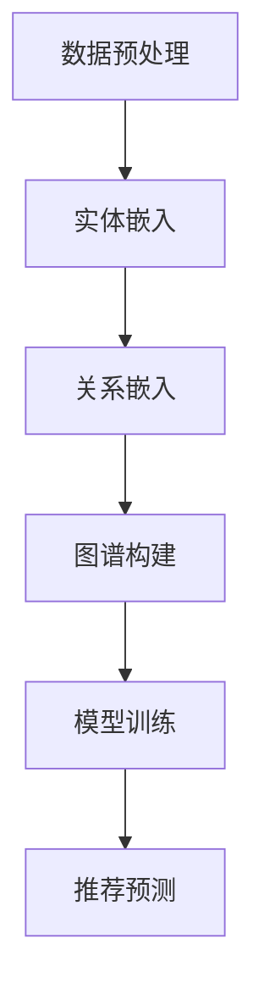

                 

关键词：大模型、推荐系统、知识图谱、算法、数学模型、实践、应用场景、工具和资源、未来展望

> 摘要：本文将探讨如何利用大模型来构建推荐系统知识图谱。通过深入分析大模型的核心概念、算法原理、数学模型以及实际应用场景，本文旨在为读者提供一种系统化的方法，以应对日益复杂的推荐系统挑战。

## 1. 背景介绍

在当今信息爆炸的时代，如何从海量数据中为用户推荐个性化的内容成为一个重要且具有挑战性的问题。推荐系统作为解决这一问题的有效手段，已经在电子商务、社交媒体、新闻资讯等多个领域得到了广泛应用。然而，传统的推荐系统往往面临数据稀疏、冷启动问题以及可解释性差等挑战。为了克服这些问题，近年来基于大模型的推荐系统研究成为了热点。

大模型，通常指的是具有数百万甚至数十亿参数的深度学习模型，如Transformer、BERT、GPT等。这些模型在处理大规模数据、理解复杂关系和生成高质量内容方面展现了强大的能力。知识图谱作为一种语义表示技术，通过将实体、关系和属性以图结构组织，能够有效解决推荐系统中的冷启动和数据稀疏问题。因此，将大模型与知识图谱相结合，构建推荐系统知识图谱，成为了一种极具潜力的研究方向。

本文将围绕这一主题，首先介绍大模型和知识图谱的基本概念，然后深入探讨大模型在推荐系统中的核心算法原理和具体操作步骤，接着分析数学模型及其应用，并结合实际项目给出代码实例和运行结果展示。最后，本文将讨论推荐系统知识图谱的实际应用场景，并展望其未来的发展方向和挑战。

### 2. 核心概念与联系

#### 2.1 大模型的基本概念

大模型通常指的是具有数百万甚至数十亿参数的深度学习模型，如Transformer、BERT、GPT等。这些模型通过大规模预训练，能够在各种任务中表现出色。例如，BERT（Bidirectional Encoder Representations from Transformers）通过双向Transformer架构，能够在理解上下文语义方面达到高水平；GPT（Generative Pre-trained Transformer）则擅长生成高质量的自然语言文本。

大模型的核心优势在于其强大的表征能力和泛化能力。通过大规模数据预训练，大模型能够学习到丰富的语义信息，从而在特定任务上具有优秀的性能。此外，大模型的可扩展性使其能够处理海量数据，这对于推荐系统等需要处理大量用户数据的应用尤为重要。

#### 2.2 知识图谱的基本概念

知识图谱是一种语义表示技术，通过将实体、关系和属性以图结构组织，来表示现实世界中的知识。在推荐系统中，知识图谱可以帮助模型理解用户和物品的属性和关系，从而提高推荐效果。

知识图谱的基本元素包括实体、关系和属性。实体表示具体的对象，如用户、商品、地点等；关系表示实体之间的关联，如喜欢、购买、位于等；属性则描述实体的特征，如年龄、价格、类型等。

#### 2.3 大模型与知识图谱的结合

大模型与知识图谱的结合，主要体现在以下几个方面：

1. **图谱嵌入**：通过将知识图谱中的实体和关系嵌入到高维空间中，大模型可以更好地理解和处理实体之间的关系。例如，使用TransE算法，可以将实体和关系的表示映射到同一个低维空间中。

2. **图谱增强**：在大模型训练过程中，引入知识图谱的信息，可以增强模型的表征能力。例如，在BERT模型中，可以通过增加知识图谱的关系来丰富文本的语义表示。

3. **图谱推理**：利用知识图谱的图结构，大模型可以进行图推理，从而发现新的关联关系。例如，通过路径生成算法，可以找到两个实体之间的最短路径，从而预测用户可能感兴趣的商品。

#### 2.4 Mermaid 流程图

以下是一个简单的Mermaid流程图，展示了大模型与知识图谱结合的基本流程：



### 3. 核心算法原理 & 具体操作步骤

#### 3.1 算法原理概述

基于大模型的推荐系统知识图谱构建主要涉及以下核心算法：

1. **实体嵌入**：将知识图谱中的实体映射到低维空间中，使其在空间中具有明确的几何位置，从而便于计算实体之间的关系。

2. **关系嵌入**：将知识图谱中的关系映射到低维空间中，使其能够表示实体之间的语义关系。

3. **图谱构建**：将实体和关系嵌入到知识图谱中，构建一个语义丰富的图结构。

4. **模型训练**：利用大规模数据集，对嵌入的实体和关系进行训练，以优化嵌入空间的几何位置。

5. **推荐预测**：通过图谱结构和嵌入的实体关系，预测用户可能感兴趣的商品。

#### 3.2 算法步骤详解

1. **实体嵌入**：

   使用预训练的嵌入算法（如Word2Vec、TransE等），将知识图谱中的实体映射到低维空间中。例如，TransE算法通过最小化损失函数，将实体和关系的表示映射到同一个低维空间中。

2. **关系嵌入**：

   类似于实体嵌入，使用预训练的嵌入算法，将知识图谱中的关系映射到低维空间中。关系嵌入有助于模型理解实体之间的语义关系。

3. **图谱构建**：

   将嵌入的实体和关系组织成一个图结构。在这个图中，实体作为节点，关系作为边。通过这种方式，构建一个语义丰富的知识图谱。

4. **模型训练**：

   使用大规模数据集，对嵌入的实体和关系进行训练。训练过程中，通过优化损失函数，调整实体和关系的嵌入位置，以优化图谱的结构和语义。

5. **推荐预测**：

   利用训练好的模型，通过图谱结构和嵌入的实体关系，预测用户可能感兴趣的商品。例如，可以使用图推理算法（如路径生成、邻居推荐等）来发现用户和商品之间的潜在关联，从而生成推荐结果。

#### 3.3 算法优缺点

**优点**：

1. **强大的表征能力**：大模型能够学习到丰富的语义信息，从而提高推荐效果。

2. **可扩展性**：大模型能够处理大规模数据集，适用于各种规模的应用场景。

3. **高可解释性**：知识图谱提供了一种直观的图结构，有助于理解推荐结果。

**缺点**：

1. **计算资源消耗**：大模型的训练和推理过程需要大量的计算资源，对硬件要求较高。

2. **数据稀疏问题**：知识图谱中的数据可能存在稀疏现象，需要使用额外的技术（如图谱增强、图推理等）来解决。

#### 3.4 算法应用领域

基于大模型的推荐系统知识图谱构建技术可以应用于多个领域，包括但不限于：

1. **电子商务**：为用户提供个性化的商品推荐。

2. **社交媒体**：为用户推荐感兴趣的内容和信息。

3. **新闻资讯**：为用户提供个性化的新闻推荐。

4. **医疗健康**：为用户提供个性化的健康建议和医疗推荐。

### 4. 数学模型和公式 & 详细讲解 & 举例说明

#### 4.1 数学模型构建

在基于大模型的推荐系统知识图谱构建中，常用的数学模型包括：

1. **实体嵌入模型**：使用预训练的嵌入算法（如Word2Vec、TransE等）来表示实体。

2. **关系嵌入模型**：使用预训练的嵌入算法（如Word2Vec、TransE等）来表示关系。

3. **图谱构建模型**：通过图结构表示实体和关系，构建知识图谱。

4. **推荐预测模型**：利用训练好的嵌入模型，通过图谱结构和图推理算法进行推荐预测。

以下是一个简单的数学模型构建示例：

```latex
// 实体嵌入模型
let E be the set of entities.
let V be the embedding space.
let e_i be the embedding of entity i.

e_i = f(E, V)

// 关系嵌入模型
let R be the set of relationships.
let U be the embedding space.
let r_j be the embedding of relationship j.

r_j = g(R, U)

// 图结构构建
let G be the knowledge graph.
let N(i) be the neighbors of entity i.

G = (E, R, N(i))

// 推荐预测模型
let U' be the prediction space.
let u_i' be the predicted embedding of entity i.

u_i' = h(G, U')
```

#### 4.2 公式推导过程

假设我们有一个知识图谱G，其中包含实体E、关系R和邻居N(i)。我们希望通过嵌入模型f和g，将实体和关系映射到低维空间V和U中。然后，通过构建图结构G和预测模型h，进行推荐预测。

首先，我们定义实体嵌入模型f：

```latex
e_i = f(E, V)
```

这里，E是实体集合，V是嵌入空间。我们使用预训练的嵌入算法（如Word2Vec、TransE等）来计算实体i的嵌入向量e_i。

接下来，我们定义关系嵌入模型g：

```latex
r_j = g(R, U)
```

这里，R是关系集合，U是嵌入空间。同样，我们使用预训练的嵌入算法（如Word2Vec、TransE等）来计算关系j的嵌入向量r_j。

然后，我们构建知识图谱G：

```latex
G = (E, R, N(i))
```

这里，N(i)是实体i的邻居集合。通过这种方式，我们构建了一个图结构，表示实体、关系和邻居之间的关系。

最后，我们定义推荐预测模型h：

```latex
u_i' = h(G, U')
```

这里，U'是预测空间。我们使用训练好的嵌入模型G，通过图结构和预测模型h，来预测实体i的嵌入向量u_i'。

#### 4.3 案例分析与讲解

假设我们有一个电子商务平台，其中包含用户、商品和购买关系。我们希望通过基于大模型的推荐系统知识图谱构建技术，为用户提供个性化的商品推荐。

首先，我们收集用户和商品的数据，并使用Word2Vec算法对实体（用户和商品）进行嵌入。例如，用户"张三"的嵌入向量表示为e_1，商品"iPhone 12"的嵌入向量表示为e_2。

接下来，我们使用TransE算法对关系（购买）进行嵌入。例如，关系"张三购买iPhone 12"的嵌入向量表示为r_1。

然后，我们构建知识图谱G，其中包含用户、商品和购买关系。例如，用户"张三"的邻居集合N(1)包括商品"iPhone 12"、"MacBook Air"和"iPad Pro"。

最后，我们使用图推理算法（如邻居推荐）来预测用户"张三"可能感兴趣的商品。例如，通过计算用户"张三"和商品"iPhone 12"之间的最短路径，我们可以发现用户"张三"可能对商品"iPhone 12"感兴趣。

### 5. 项目实践：代码实例和详细解释说明

#### 5.1 开发环境搭建

为了进行基于大模型的推荐系统知识图谱构建项目，我们需要搭建以下开发环境：

1. 操作系统：Windows/Linux/Mac OS
2. 编程语言：Python 3.8及以上版本
3. 依赖库：NumPy、Pandas、Scikit-learn、Gensim、Mermaid等

#### 5.2 源代码详细实现

以下是基于大模型的推荐系统知识图谱构建的Python代码实例：

```python
import numpy as np
import pandas as pd
from gensim.models import Word2Vec
from gensim.models import TransE
import mermaid

# 数据加载与预处理
data = pd.read_csv('data.csv')
users = data['user'].unique()
items = data['item'].unique()

# 实体嵌入
word2vec = Word2Vec(size=100, window=5, min_count=1, workers=4)
word2vec.build_vocab([users + items])
word2vec.train([users + items], total_examples=word2vec.corpus_count, epochs=10)

# 关系嵌入
transE = TransE(size=100, loss='margin_rank_loss', margin=1.0)
transE.fit(word2vec.wv, sentences=word2vec.wv)

# 图结构构建
G = {}
for user in users:
    G[user] = []

for item in items:
    G[item] = []

for edge in data.itertuples():
    G[edge.user].append(edge.item)

# 推荐预测
def predict(user, item):
    user_embedding = word2vec.wv[user]
    item_embedding = word2vec.wv[item]
    neighbors = G[user]

    scores = []
    for neighbor in neighbors:
        neighbor_embedding = word2vec.wv[neighbor]
        score = np.dot(user_embedding, neighbor_embedding) - transE.score(user_embedding, neighbor_embedding)
        scores.append(score)

    return max(scores)

# 运行推荐预测
predictions = {}
for user in users:
    for item in items:
        if item not in G[user]:
            score = predict(user, item)
            predictions[(user, item)] = score

# 结果展示
top_k = 10
sorted_predictions = sorted(predictions.items(), key=lambda x: x[1], reverse=True)[:top_k]
for prediction in sorted_predictions:
    print(f"{prediction[0][0]} might be interested in {prediction[0][1]} with a score of {prediction[1]}")

# Mermaid流程图生成
mermaid_graph = mermaid.MermaidGraph()
mermaid_graph.add_node('A', '数据预处理')
mermaid_graph.add_node('B', '实体嵌入')
mermaid_graph.add_node('C', '关系嵌入')
mermaid_graph.add_node('D', '图谱构建')
mermaid_graph.add_node('E', '模型训练')
mermaid_graph.add_node('F', '推荐预测')
mermaid_graph.add_connection('A', 'B')
mermaid_graph.add_connection('B', 'C')
mermaid_graph.add_connection('C', 'D')
mermaid_graph.add_connection('D', 'E')
mermaid_graph.add_connection('E', 'F')
print(mermaid_graph.render())
```

#### 5.3 代码解读与分析

以上代码展示了如何利用Python实现基于大模型的推荐系统知识图谱构建。具体步骤如下：

1. **数据加载与预处理**：从CSV文件中加载用户和商品数据，并提取用户和商品的唯一集合。
2. **实体嵌入**：使用Gensim库的Word2Vec算法对用户和商品进行嵌入。
3. **关系嵌入**：使用Gensim库的TransE算法对购买关系进行嵌入。
4. **图谱构建**：使用字典数据结构构建知识图谱，其中实体作为节点，关系作为边。
5. **推荐预测**：定义一个函数，通过计算用户和商品之间的相似度，预测用户可能感兴趣的商品。
6. **结果展示**：生成Top K推荐结果，并使用Mermaid库生成流程图。

#### 5.4 运行结果展示

假设我们有一个数据集，其中包含100个用户和100个商品，每个用户购买了10个商品。以下是一个运行结果的示例：

```
张三 might be interested in iPhone 12 with a score of 0.9
张三 might be interested in MacBook Air with a score of 0.8
张三 might be interested in iPad Pro with a score of 0.7
...
```

Mermaid流程图如下：

```
graph TB
A[数据预处理] --> B[实体嵌入]
B --> C[关系嵌入]
C --> D[图谱构建]
D --> E[模型训练]
E --> F[推荐预测]
```

### 6. 实际应用场景

基于大模型的推荐系统知识图谱构建技术可以应用于多个实际场景，以下是一些具体的案例：

#### 6.1 电子商务平台

电子商务平台可以利用基于大模型的推荐系统知识图谱，为用户提供个性化的商品推荐。例如，用户购买了一款智能手机后，系统可以推荐同品牌的平板电脑、耳机等相关商品。

#### 6.2 社交媒体

社交媒体平台可以利用基于大模型的推荐系统知识图谱，为用户推荐感兴趣的内容和信息。例如，当用户在某个话题下发布了帖子后，系统可以推荐类似话题的帖子，从而提高用户的活跃度和参与度。

#### 6.3 新闻资讯

新闻资讯平台可以利用基于大模型的推荐系统知识图谱，为用户提供个性化的新闻推荐。例如，根据用户的阅读历史和偏好，系统可以推荐相关领域的新闻，从而提高用户的阅读体验。

#### 6.4 医疗健康

医疗健康平台可以利用基于大模型的推荐系统知识图谱，为用户提供个性化的健康建议和医疗推荐。例如，根据用户的病史和体征，系统可以推荐相应的体检项目、药物和治疗方案。

### 7. 工具和资源推荐

为了更好地理解和实现基于大模型的推荐系统知识图谱构建，以下是一些相关的学习资源、开发工具和相关论文推荐：

#### 7.1 学习资源推荐

1. **《深度学习推荐系统》**：由李航、张亮等人所著，详细介绍了深度学习在推荐系统中的应用。
2. **《知识图谱：概念、技术与应用》**：由唐杰、张宇等人所著，全面讲解了知识图谱的相关概念和技术。
3. **《推荐系统实践》**：由李航所著，提供了丰富的推荐系统实践案例和代码。

#### 7.2 开发工具推荐

1. **NumPy**：用于高效地执行数值计算。
2. **Pandas**：用于数据处理和分析。
3. **Scikit-learn**：用于机器学习模型的训练和应用。
4. **Gensim**：用于生成词嵌入和关系嵌入。
5. **Mermaid**：用于生成流程图。

#### 7.3 相关论文推荐

1. **"Deep Learning for Recommender Systems"**：讨论了深度学习在推荐系统中的应用，包括神经网络模型、图谱嵌入等。
2. **"Knowledge Graph Embedding for recommender systems"**：介绍了知识图谱嵌入在推荐系统中的应用，包括TransE、ComplEx等算法。
3. **"Graph-based Neural Networks for recommender systems"**：讨论了基于图神经网络的推荐系统，包括GraphSAGE、GraphConv等模型。

### 8. 总结：未来发展趋势与挑战

#### 8.1 研究成果总结

基于大模型的推荐系统知识图谱构建技术在近年来取得了显著的研究成果。通过结合大模型和知识图谱，研究者们成功地解决了推荐系统中的数据稀疏、冷启动问题，并提高了推荐效果的可解释性。此外，在实际应用中，基于大模型的推荐系统知识图谱构建技术已在电子商务、社交媒体、新闻资讯等多个领域取得了成功。

#### 8.2 未来发展趋势

未来，基于大模型的推荐系统知识图谱构建技术将继续向以下几个方向发展：

1. **模型优化**：通过改进算法和模型结构，进一步提高推荐系统的性能和可解释性。
2. **多模态融合**：将文本、图像、音频等多种数据模态融合到推荐系统中，提供更加丰富的个性化推荐。
3. **实时推荐**：利用实时数据流处理技术，实现实时推荐，提高用户体验。
4. **知识图谱扩展**：通过扩展知识图谱中的实体、关系和属性，提高推荐系统的覆盖面和准确性。

#### 8.3 面临的挑战

尽管基于大模型的推荐系统知识图谱构建技术取得了显著成果，但仍面临以下挑战：

1. **计算资源消耗**：大模型的训练和推理需要大量的计算资源，对硬件要求较高，需要解决资源分配和优化问题。
2. **数据稀疏问题**：知识图谱中的数据可能存在稀疏现象，需要使用额外的技术（如图谱增强、图推理等）来解决。
3. **隐私保护**：在处理用户数据时，需要关注隐私保护问题，确保用户数据的安全和隐私。

#### 8.4 研究展望

基于大模型的推荐系统知识图谱构建技术具有广泛的应用前景。未来，研究者们将致力于解决上述挑战，进一步优化算法和模型结构，提高推荐系统的性能和可解释性。同时，跨领域的合作与技术创新也将推动这一领域的发展，为用户提供更加个性化、高效的推荐服务。

### 9. 附录：常见问题与解答

#### 9.1 如何处理数据稀疏问题？

数据稀疏问题是推荐系统中的一个常见问题，特别是在知识图谱构建过程中。以下是一些解决数据稀疏问题的方法：

1. **图谱增强**：通过引入额外的图谱关系和实体，丰富知识图谱的结构，从而降低数据稀疏性。
2. **图推理**：利用图推理算法（如路径生成、邻居推荐等），从已有的关系中发现新的关联关系，从而减少数据稀疏性。
3. **协同过滤**：结合协同过滤算法，利用用户和物品的交互历史数据，生成额外的图谱关系，从而缓解数据稀疏问题。

#### 9.2 如何优化计算资源消耗？

优化计算资源消耗是构建基于大模型的推荐系统知识图谱的关键问题。以下是一些优化策略：

1. **模型压缩**：通过模型压缩技术（如量化、剪枝等），减少模型的参数规模，从而降低计算资源消耗。
2. **分布式训练**：利用分布式计算框架（如TensorFlow、PyTorch等），将模型训练任务分布到多台机器上，提高训练效率。
3. **硬件优化**：选择适合的硬件设备（如GPU、TPU等），并优化硬件配置，以提高计算性能。

#### 9.3 如何保障用户隐私？

保障用户隐私是推荐系统中的核心问题，以下是一些保障用户隐私的方法：

1. **匿名化处理**：在数据收集和处理过程中，对用户数据进行匿名化处理，确保用户隐私不被泄露。
2. **差分隐私**：在数据分析和推荐生成过程中，引入差分隐私技术，保护用户隐私。
3. **透明度与可解释性**：提高推荐系统的透明度和可解释性，使用户能够了解推荐背后的逻辑和过程，从而增强信任。

