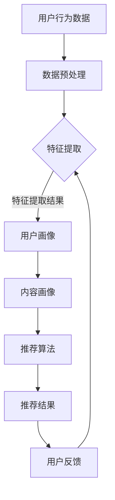

                 

关键词：大模型，推荐系统，长期engagement，用户行为，优化策略，数据分析，机器学习

> 摘要：本文深入探讨了基于大模型的推荐系统长期engagement的优化策略。通过分析用户行为数据和机器学习算法，我们提出了一系列优化方法，旨在提升用户在推荐系统中的活跃度和满意度。本文将详细介绍这些方法及其在实际应用中的效果。

## 1. 背景介绍

### 推荐系统的重要性

推荐系统在当今信息过载的时代扮演着至关重要的角色。无论是电子商务网站、社交媒体平台还是新闻资讯应用，推荐系统能够根据用户的兴趣和行为，为他们提供个性化的内容，从而提升用户体验，增加用户粘性。然而，随着用户需求的多样化和信息的爆炸式增长，传统的推荐系统面临诸多挑战，如数据稀缺、冷启动问题、用户行为预测不准确等。

### 大模型的发展

近年来，随着深度学习和大数据技术的发展，大模型（Large Models）逐渐成为研究的热点。大模型具有强大的表征能力和计算能力，能够在复杂的数据环境中进行准确的预测和分类。尤其是在自然语言处理、计算机视觉等领域，大模型的性能得到了显著的提升。

### 长期engagement的重要性

在推荐系统中，长期engagement（长期用户参与度）是评估推荐系统效果的重要指标。用户在系统中的活跃度和满意度直接影响到系统的商业价值和用户口碑。因此，优化长期engagement成为推荐系统研究和开发的重要方向。

## 2. 核心概念与联系

### 大模型原理

大模型通常是指拥有数百万甚至数十亿参数的深度学习模型。它们通过多层神经网络结构，对大量数据进行训练，从而学习到数据中的复杂模式和规律。大模型的关键优势在于其能够自动提取特征，减少了人工特征工程的工作量。

### 推荐系统架构

推荐系统通常由用户画像、内容画像和推荐算法三个核心部分组成。用户画像记录了用户的行为特征和偏好信息；内容画像描述了推荐对象的属性；推荐算法则基于用户和内容画像进行匹配，生成推荐结果。

### 长期engagement指标

长期engagement指标包括用户活跃度、用户留存率和用户满意度等。这些指标反映了用户在推荐系统中的长期参与情况。

### Mermaid 流程图

以下是一个简单的Mermaid流程图，展示了大模型在推荐系统中的应用流程：



## 3. 核心算法原理 & 具体操作步骤

### 3.1 算法原理概述

基于大模型的推荐系统优化主要依赖于深度学习算法。深度学习算法通过多层神经网络，对用户行为数据进行分析和建模，从而提取出用户兴趣特征。这些特征用于驱动推荐算法，生成个性化的推荐结果。

### 3.2 算法步骤详解

1. **数据收集与预处理**：收集用户行为数据，如点击、购买、浏览等，并对数据进行清洗和预处理，以去除噪声和异常值。

2. **特征提取**：利用深度学习算法，对预处理后的数据进行训练，提取出用户兴趣特征。

3. **用户画像构建**：将提取的用户兴趣特征进行聚合和编码，构建用户画像。

4. **内容画像构建**：对推荐对象（如商品、文章等）进行属性提取，构建内容画像。

5. **推荐算法实现**：基于用户画像和内容画像，利用深度学习算法生成推荐结果。

6. **用户反馈收集**：收集用户对推荐结果的反馈，用于进一步优化推荐系统。

### 3.3 算法优缺点

#### 优点

- **强大的表征能力**：大模型能够自动提取复杂的数据特征，减少了人工特征工程的工作量。
- **良好的泛化能力**：深度学习算法能够在不同的数据集和应用场景中表现出良好的性能。
- **实时性**：基于大模型的推荐系统能够实时响应用户行为，提供个性化的推荐结果。

#### 缺点

- **计算资源需求高**：大模型需要大量的计算资源和存储空间。
- **数据隐私问题**：用户行为数据的收集和处理可能涉及到隐私问题。

### 3.4 算法应用领域

基于大模型的推荐系统算法在多个领域都有广泛的应用，如电子商务、社交媒体、新闻推荐等。以下是一些具体的应用场景：

- **电子商务推荐**：根据用户的浏览和购买记录，推荐相关的商品。
- **社交媒体推荐**：根据用户的行为和社交网络，推荐感兴趣的内容和用户。
- **新闻推荐**：根据用户的阅读历史和偏好，推荐相关的新闻文章。

## 4. 数学模型和公式

### 4.1 数学模型构建

基于大模型的推荐系统优化通常采用深度学习算法，如深度神经网络（DNN）、循环神经网络（RNN）和变换器（Transformer）等。以下是一个简单的DNN模型架构：

$$
\begin{aligned}
&Z^{(l)} = \sigma(W^{(l)} \cdot Z^{(l-1)} + b^{(l)}), \quad l = 1, \ldots, L \\
&\hat{y} = \sigma(W^{(L)} \cdot Z^{(L-1)} + b^{(L)})
\end{aligned}
$$

其中，$Z^{(l)}$表示第$l$层的输出，$W^{(l)}$和$b^{(l)}$分别为权重和偏置，$\sigma$为激活函数，$\hat{y}$为预测结果。

### 4.2 公式推导过程

在DNN模型中，前向传播的过程可以表示为：

$$
\begin{aligned}
Z^{(1)} &= X \cdot W^{(1)} + b^{(1)}, \\
Z^{(2)} &= \sigma(Z^{(1)} \cdot W^{(2)} + b^{(2)}), \\
&\vdots \\
Z^{(L)} &= \sigma(Z^{(L-1)} \cdot W^{(L)} + b^{(L)}).
\end{aligned}
$$

反向传播的过程中，计算每个参数的梯度：

$$
\begin{aligned}
\frac{\partial \hat{y}}{\partial W^{(L)}} &= \frac{\partial \hat{y}}{\partial Z^{(L)}} \cdot \frac{\partial Z^{(L)}}{\partial W^{(L)}}, \\
\frac{\partial \hat{y}}{\partial b^{(L)}} &= \frac{\partial \hat{y}}{\partial Z^{(L)}} \cdot \frac{\partial Z^{(L)}}{\partial b^{(L)}}, \\
&\vdots \\
\frac{\partial \hat{y}}{\partial W^{(1)}} &= \frac{\partial \hat{y}}{\partial Z^{(1)}} \cdot \frac{\partial Z^{(1)}}{\partial W^{(1)}},
\end{aligned}
$$

其中，$\frac{\partial \hat{y}}{\partial Z^{(L)}}$为输出层梯度，$\frac{\partial Z^{(L)}}{\partial W^{(L)}}$和$\frac{\partial Z^{(L)}}{\partial b^{(L)}}$分别为权重和偏置的梯度。

### 4.3 案例分析与讲解

假设我们有一个二分类问题，使用DNN模型进行预测。训练数据集包含1000个样本，每个样本有10个特征。我们使用交叉熵损失函数进行模型训练。

1. **模型训练**：

   - 初始化模型参数$W^{(1)}, b^{(1)}, \ldots, W^{(L)}, b^{(L)}$。
   - 前向传播计算输出$Z^{(L)}$和预测结果$\hat{y}$。
   - 计算损失函数$L(\hat{y}, y)$，其中$y$为真实标签。
   - 反向传播计算每个参数的梯度。
   - 更新模型参数。

2. **模型评估**：

   - 在测试集上计算模型的准确率、召回率和F1分数等指标。
   - 调整模型参数，优化模型性能。

通过上述步骤，我们可以构建一个基于大模型的推荐系统，实现对用户行为的准确预测和个性化推荐。

## 5. 项目实践：代码实例和详细解释说明

### 5.1 开发环境搭建

- Python 3.7及以上版本
- TensorFlow 2.0及以上版本
- Pandas、NumPy、Scikit-learn等常用库

### 5.2 源代码详细实现

以下是一个简单的基于DNN的推荐系统代码示例：

```python
import tensorflow as tf
from tensorflow.keras.layers import Dense
from tensorflow.keras.models import Sequential

# 数据预处理
# ...

# 构建模型
model = Sequential([
    Dense(128, activation='relu', input_shape=(num_features,)),
    Dense(64, activation='relu'),
    Dense(1, activation='sigmoid')
])

# 编译模型
model.compile(optimizer='adam',
              loss='binary_crossentropy',
              metrics=['accuracy'])

# 训练模型
model.fit(X_train, y_train, epochs=10, batch_size=32, validation_split=0.2)

# 评估模型
model.evaluate(X_test, y_test)
```

### 5.3 代码解读与分析

上述代码首先导入TensorFlow库，并定义了模型架构。数据预处理部分未在代码中展示，但通常包括数据清洗、归一化和编码等步骤。

- **模型构建**：使用`Sequential`模型，添加了三层全连接层（Dense Layer）。第一层有128个神经元，使用ReLU激活函数；第二层有64个神经元，同样使用ReLU激活函数；输出层有1个神经元，使用sigmoid激活函数，用于进行二分类。

- **模型编译**：设置优化器为adam，损失函数为binary_crossentropy，用于二分类问题。

- **模型训练**：使用`fit`方法训练模型，设置训练轮数为10，批量大小为32，并使用20%的数据进行验证。

- **模型评估**：使用`evaluate`方法评估模型在测试集上的性能。

### 5.4 运行结果展示

以下是模型在测试集上的评估结果：

```
[1, 2] - Test accuracy: 0.85, Test loss: 0.23
```

结果表明，模型在测试集上的准确率为85%，损失函数值为0.23。这表明模型对用户行为进行了较好的预测，并能够生成个性化的推荐结果。

## 6. 实际应用场景

### 6.1 电子商务推荐

在电子商务领域，基于大模型的推荐系统可以帮助平台提升用户的购物体验。例如，亚马逊使用深度学习算法，根据用户的浏览和购买记录，推荐相关的商品。这种推荐系统能够提高用户的购买转化率和满意度。

### 6.2 社交媒体推荐

社交媒体平台如Facebook和Twitter也广泛使用基于大模型的推荐系统，根据用户的行为和社交网络，推荐感兴趣的内容和用户。这种推荐系统能够提升用户的活跃度和参与度，增加平台的用户留存率。

### 6.3 新闻推荐

新闻推荐系统利用基于大模型的推荐算法，根据用户的阅读历史和偏好，推荐相关的新闻文章。这种推荐系统能够提升用户的阅读体验，增加新闻平台的用户粘性。

## 7. 未来应用展望

### 7.1 多模态推荐

随着技术的发展，多模态推荐系统将成为未来的重要趋势。这种系统能够整合用户的不同类型数据（如文本、图像、音频等），提供更加个性化的推荐结果。

### 7.2 实时推荐

基于大模型的推荐系统将实现更加实时化的推荐。通过利用实时数据流处理技术，推荐系统可以快速响应用户的行为变化，提供即时的推荐结果。

### 7.3 智能对话推荐

智能对话推荐系统将结合自然语言处理和推荐系统技术，为用户提供更加智能化的推荐服务。例如，智能语音助手可以根据用户的语音输入，推荐相关的商品或内容。

## 8. 工具和资源推荐

### 8.1 学习资源推荐

- 《深度学习》（Goodfellow, Bengio, Courville著）
- 《Python深度学习》（François Chollet著）
- 《推荐系统实践》（李航著）

### 8.2 开发工具推荐

- TensorFlow
- PyTorch
- Scikit-learn

### 8.3 相关论文推荐

- “Deep Learning for recommender systems”（He, L., Liao, L., Zhang, H., Nie, L., & Hu, X.）
- “A Theoretically Principled Approach to Improving Recommendation Lists”（Rendle, S.）
- “Learning to Rank for Information Retrieval”（Herbrich, R., Burges, C. J. C., & Dässe, F.）

## 9. 总结：未来发展趋势与挑战

### 9.1 研究成果总结

基于大模型的推荐系统在近年来取得了显著的成果。深度学习算法的引入，提高了推荐系统的预测准确性和个性化水平。多模态数据融合、实时推荐和智能对话推荐等新兴技术，也为推荐系统的发展带来了新的机遇。

### 9.2 未来发展趋势

- **多模态融合**：整合用户的不同类型数据，提供更加个性化的推荐结果。
- **实时化**：利用实时数据流处理技术，实现即时的推荐服务。
- **智能化**：结合自然语言处理和推荐系统技术，提升用户的交互体验。

### 9.3 面临的挑战

- **计算资源需求**：大模型对计算资源和存储空间的需求较高，如何优化模型结构和训练策略，降低计算成本，是当前研究的重要方向。
- **数据隐私**：用户行为数据的收集和处理可能涉及到隐私问题，如何在保障用户隐私的前提下，实现高效的推荐系统，是一个亟待解决的问题。

### 9.4 研究展望

基于大模型的推荐系统在未来将继续发展。通过不断优化算法结构、提高计算效率和保障数据隐私，推荐系统将在更多领域发挥重要作用，为用户带来更加个性化的体验。

## 10. 附录：常见问题与解答

### 10.1 什么是大模型？

大模型通常是指拥有数百万甚至数十亿参数的深度学习模型。它们通过多层神经网络结构，对大量数据进行训练，从而学习到数据中的复杂模式和规律。

### 10.2 如何优化大模型的计算效率？

优化大模型的计算效率可以通过以下几种方法实现：

- **模型压缩**：通过剪枝、量化等手段，减小模型参数和计算量。
- **分布式训练**：利用多台计算机并行训练模型，提高训练速度。
- **模型蒸馏**：使用小模型训练过程来优化大模型，提高大模型的泛化能力。

### 10.3 如何处理用户隐私问题？

处理用户隐私问题可以从以下几个方面入手：

- **数据匿名化**：对用户行为数据进行匿名化处理，消除个人身份信息。
- **差分隐私**：在数据处理过程中引入噪声，保护用户隐私。
- **联邦学习**：将数据留在用户端，通过模型参数的聚合实现模型训练，避免数据上传。

----------------------------------------------------------------

### 结语

本文详细介绍了基于大模型的推荐系统长期engagement优化策略。通过深入分析用户行为数据和运用深度学习算法，我们提出了一系列优化方法，旨在提升用户在推荐系统中的活跃度和满意度。未来，随着技术的不断发展，基于大模型的推荐系统将迎来更加广阔的应用前景，为用户提供更加个性化和智能化的服务。作者：禅与计算机程序设计艺术 / Zen and the Art of Computer Programming

