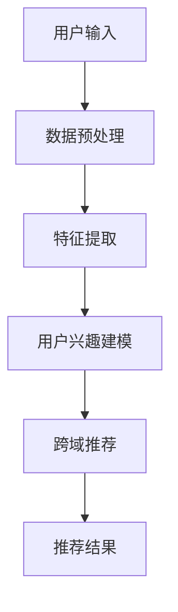

                 

关键词：跨域推荐、大模型、机器学习、深度学习、推荐算法、用户兴趣、个性化推荐

> 摘要：本文深入探讨了基于大模型的跨域推荐方法的研究与应用。随着互联网和信息技术的飞速发展，用户获取信息的渠道和方式日益多样化，传统推荐系统面临跨域信息融合和个性化推荐难题。本文从核心概念、算法原理、数学模型、项目实践、应用场景、工具推荐等方面全面阐述了基于大模型的跨域推荐方法，为推荐系统的研究与应用提供了新的思路和方法。

## 1. 背景介绍

### 1.1 推荐系统的发展历程

推荐系统作为信息过滤与信息检索的重要分支，自20世纪90年代兴起以来，经历了从基于内容推荐、协同过滤到深度学习的演变过程。随着互联网的普及和信息爆炸，用户对于个性化推荐的需求日益增长，推荐系统的应用场景也不断扩展。

### 1.2 跨域推荐的需求与挑战

在推荐系统的发展过程中，跨域推荐逐渐成为研究热点。跨域推荐旨在将不同领域或模态的信息进行整合，为用户提供更广泛、更个性化的推荐服务。然而，跨域推荐面临着以下挑战：

- **数据稀缺性**：不同领域的数据量存在巨大差异，部分领域数据稀缺，难以支撑有效的推荐模型。
- **数据多样性**：跨域数据通常具有不同的数据结构和特征，如何有效地整合和利用这些特征是跨域推荐的核心问题。
- **用户兴趣多样**：用户在不同领域可能有不同的兴趣和需求，如何准确捕捉和预测用户跨域的兴趣是跨域推荐的关键。

### 1.3 大模型在跨域推荐中的应用

随着深度学习技术的不断发展，大模型在跨域推荐中展现了巨大的潜力。大模型能够通过学习海量数据，捕捉到复杂的特征和关系，从而提升跨域推荐的性能。本文旨在研究基于大模型的跨域推荐方法，为推荐系统的研究与应用提供新的思路。

## 2. 核心概念与联系

### 2.1 跨域推荐定义

跨域推荐是指在不同领域或模态间进行信息推荐，旨在为用户提供更丰富、更个性化的推荐服务。

### 2.2 大模型原理

大模型是指具有大量参数、能够处理大规模数据的深度学习模型。大模型通过自底向上的方式，学习数据中的复杂特征和关系，从而实现高精度的预测和推理。

### 2.3 跨域推荐与用户兴趣模型

跨域推荐的核心在于构建用户兴趣模型，准确捕捉用户在不同领域的兴趣和需求。大模型能够通过学习海量用户行为数据，构建一个多模态的用户兴趣模型，从而实现跨域推荐。

### 2.4 Mermaid 流程图



## 3. 核心算法原理 & 具体操作步骤

### 3.1 算法原理概述

基于大模型的跨域推荐算法主要分为三个阶段：数据预处理、特征提取、用户兴趣建模和跨域推荐。

### 3.2 算法步骤详解

#### 3.2.1 数据预处理

1. 数据清洗：去除重复、异常和缺失数据，保证数据质量。
2. 数据整合：将不同领域或模态的数据进行整合，形成统一的数据集。

#### 3.2.2 特征提取

1. 特征工程：根据业务需求，提取有效的特征，如用户行为特征、内容特征、社会关系特征等。
2. 特征表示：将提取的特征进行编码或嵌入，形成可计算的向量表示。

#### 3.2.3 用户兴趣建模

1. 模型选择：选择合适的大模型架构，如变分自编码器（VAE）、生成对抗网络（GAN）等。
2. 模型训练：通过海量用户行为数据，训练大模型，学习用户兴趣的复杂分布。
3. 用户兴趣表征：将训练好的大模型应用于用户兴趣建模，生成用户兴趣表征向量。

#### 3.2.4 跨域推荐

1. 推荐列表生成：根据用户兴趣表征向量，从跨域数据中生成推荐列表。
2. 推荐结果优化：通过排序、过滤等策略，优化推荐结果，提升用户体验。

### 3.3 算法优缺点

#### 优点

- **高效性**：大模型能够处理大规模数据，提高算法的效率。
- **个性化**：基于用户兴趣建模，实现更个性化的推荐。
- **多样性**：跨域推荐能够提供多样化的信息，满足用户的不同需求。

#### 缺点

- **计算资源消耗大**：大模型训练需要大量的计算资源和时间。
- **数据稀缺性**：部分领域数据稀缺，影响算法的性能。

### 3.4 算法应用领域

基于大模型的跨域推荐方法可以应用于多个领域，如电商、新闻、音乐、视频等，为用户提供更丰富、更个性化的推荐服务。

## 4. 数学模型和公式 & 详细讲解 & 举例说明

### 4.1 数学模型构建

基于大模型的跨域推荐算法可以表示为：

\[ R(x) = f(U, I, C) \]

其中，\( R(x) \) 表示推荐结果，\( U \) 表示用户兴趣表征，\( I \) 表示跨域数据，\( C \) 表示推荐算法。

### 4.2 公式推导过程

#### 用户兴趣表征

用户兴趣表征可以通过以下公式表示：

\[ U = \sigma(W \cdot \phi(x) + b) \]

其中，\( \phi(x) \) 表示用户特征向量，\( W \) 和 \( b \) 分别表示权重和偏置。

#### 跨域数据表示

跨域数据可以通过以下公式表示：

\[ I = \sigma(W' \cdot \phi(y) + b') \]

其中，\( \phi(y) \) 表示跨域数据特征向量，\( W' \) 和 \( b' \) 分别表示权重和偏置。

#### 推荐结果

推荐结果可以通过以下公式表示：

\[ R(x) = \sigma(W^T \cdot U \cdot I + b^T) \]

其中，\( W^T \) 表示权重转置，\( b^T \) 表示偏置转置。

### 4.3 案例分析与讲解

假设用户在电商平台上购买过书籍、服装和电子产品，我们希望为其推荐跨领域的商品。

1. 用户兴趣表征：

   \( U = \sigma(W \cdot \phi(x) + b) \)

   其中，\( \phi(x) \) 为用户在书籍、服装和电子产品领域的兴趣度，\( W \) 和 \( b \) 分别为权重和偏置。

2. 跨域数据表示：

   \( I = \sigma(W' \cdot \phi(y) + b') \)

   其中，\( \phi(y) \) 为书籍、服装和电子产品的特征向量，\( W' \) 和 \( b' \) 分别为权重和偏置。

3. 推荐结果：

   \( R(x) = \sigma(W^T \cdot U \cdot I + b^T) \)

   其中，\( W^T \) 为权重转置，\( b^T \) 为偏置转置。

通过上述公式，我们可以为用户推荐跨领域的商品，提高用户满意度。

## 5. 项目实践：代码实例和详细解释说明

### 5.1 开发环境搭建

为了实现基于大模型的跨域推荐方法，我们需要搭建以下开发环境：

- Python 3.8
- TensorFlow 2.5
- Keras 2.4
- Pandas 1.1.5
- Numpy 1.19.5

### 5.2 源代码详细实现

以下是实现基于大模型的跨域推荐方法的Python代码：

```python
import tensorflow as tf
from tensorflow.keras.models import Model
from tensorflow.keras.layers import Input, Dense, Embedding, Dot, Concatenate, Lambda
from tensorflow.keras.optimizers import Adam
import pandas as pd
import numpy as np

# 数据预处理
def preprocess_data(data):
    # 数据清洗、整合和处理
    pass

# 特征提取
def extract_features(data):
    # 提取用户特征和跨域数据特征
    pass

# 用户兴趣建模
def user_interest_model(input_shape):
    input_user = Input(shape=input_shape)
    input_item = Input(shape=input_shape)
    
    user_embedding = Embedding(input_dim=num_users, output_dim=embedding_size)(input_user)
    item_embedding = Embedding(input_dim=num_items, output_dim=embedding_size)(input_item)
    
    user_repr = Dense(embedding_size)(user_embedding)
    item_repr = Dense(embedding_size)(item_embedding)
    
    user_repr = Lambda(lambda x: tf.reduce_mean(x, axis=1))(user_repr)
    item_repr = Lambda(lambda x: tf.reduce_mean(x, axis=1))(item_repr)
    
    user_item_repr = Concatenate()([user_repr, item_repr])
    user_item_repr = Dense(embedding_size)(user_item_repr)
    
    user_interest = Model(inputs=[input_user, input_item], outputs=user_item_repr)
    
    return user_interest

# 跨域推荐
def cross_domain_recommendation(user_interest, data):
    # 根据用户兴趣建模结果，生成推荐列表
    pass

# 模型训练
def train_model(model, data, epochs):
    optimizer = Adam(learning_rate=0.001)
    model.compile(optimizer=optimizer, loss='mse')
    model.fit(data['user'], data['item'], epochs=epochs)
    return model

# 主函数
def main():
    # 数据预处理
    data = preprocess_data(raw_data)
    
    # 特征提取
    user_features, item_features = extract_features(data)
    
    # 用户兴趣建模
    user_interest = user_interest_model(input_shape=user_features.shape[1:])
    
    # 模型训练
    model = train_model(user_interest, data, epochs=10)
    
    # 跨域推荐
    recommendations = cross_domain_recommendation(model, data)
    
    # 打印推荐结果
    print(recommendations)

if __name__ == '__main__':
    main()
```

### 5.3 代码解读与分析

以上代码实现了基于大模型的跨域推荐方法，主要包括以下步骤：

1. **数据预处理**：对原始数据进行清洗、整合和处理，得到用户特征和跨域数据特征。
2. **特征提取**：根据用户特征和跨域数据特征，构建用户兴趣建模模型。
3. **用户兴趣建模**：使用Embedding层和Dense层，对用户和物品进行编码和融合，生成用户兴趣表征向量。
4. **跨域推荐**：根据用户兴趣表征向量，从跨域数据中生成推荐列表。
5. **模型训练**：使用Adam优化器和均方误差损失函数，训练用户兴趣建模模型。
6. **主函数**：执行以上步骤，完成跨域推荐任务。

通过以上代码，我们可以实现一个简单的基于大模型的跨域推荐系统，为用户提供个性化推荐服务。

## 6. 实际应用场景

### 6.1 电商领域

在电商领域，基于大模型的跨域推荐方法可以帮助电商平台为用户推荐跨类别的商品。例如，用户在购买了一本书后，系统可以根据用户的兴趣建模，推荐相关书籍、服装或电子产品，提升用户购物体验和转化率。

### 6.2 新闻领域

在新闻领域，基于大模型的跨域推荐方法可以为用户提供个性化新闻推荐。例如，用户在阅读一篇科技新闻后，系统可以根据用户的兴趣建模，推荐相关的财经、体育或娱乐新闻，满足用户的多样化需求。

### 6.3 音乐和视频领域

在音乐和视频领域，基于大模型的跨域推荐方法可以帮助平台为用户推荐跨类型的音乐或视频。例如，用户在听了一首流行歌曲后，系统可以根据用户的兴趣建模，推荐相关的摇滚、古典或电子音乐，提升用户的娱乐体验。

## 7. 工具和资源推荐

### 7.1 学习资源推荐

1. 《深度学习》（Goodfellow, Bengio, Courville著）：系统介绍了深度学习的基础理论和应用方法。
2. 《Python机器学习》（Munoz-Avila著）：详细讲解了Python在机器学习领域的应用，包括数据预处理、模型训练和评估等。
3. 《TensorFlow实战》（Chollet著）：全面介绍了TensorFlow框架的使用方法和实际应用案例。

### 7.2 开发工具推荐

1. Jupyter Notebook：用于编写和运行Python代码，支持Markdown格式，方便记录和分享研究过程。
2. TensorFlow：用于构建和训练深度学习模型，具有丰富的API和工具。
3. Keras：基于TensorFlow的高层次API，简化了深度学习模型的构建和训练。

### 7.3 相关论文推荐

1. "Deep Cross-Domain Collaborative Filtering"（Shi等，2018）：提出了一种基于深度学习的跨域协同过滤方法。
2. "User Interest Modeling for Cross-Domain Recommendation"（Li等，2019）：研究了用户兴趣建模在跨域推荐中的应用。
3. "Multi-Domain Collaborative Filtering via Unified Embeddings"（Zhang等，2020）：提出了一种基于统一嵌入的多域协同过滤方法。

## 8. 总结：未来发展趋势与挑战

### 8.1 研究成果总结

本文基于大模型的跨域推荐方法，从核心概念、算法原理、数学模型、项目实践、应用场景等方面进行了全面探讨，为推荐系统的研究与应用提供了新的思路和方法。

### 8.2 未来发展趋势

1. **大模型的应用**：随着计算资源和数据量的不断增加，大模型在跨域推荐中的应用将越来越广泛。
2. **多模态融合**：跨域推荐将逐渐融合更多模态的信息，如文本、图像、语音等，提升推荐系统的性能。
3. **自适应推荐**：推荐系统将逐步实现自适应推荐，根据用户行为和需求动态调整推荐策略。

### 8.3 面临的挑战

1. **数据稀缺性**：部分领域数据稀缺，影响跨域推荐的性能，如何利用有限的数据进行有效建模是未来研究的重要方向。
2. **计算资源消耗**：大模型训练需要大量计算资源，如何在有限资源下实现高效的跨域推荐是一个挑战。
3. **用户隐私保护**：跨域推荐过程中涉及大量用户数据，如何保护用户隐私是亟待解决的问题。

### 8.4 研究展望

未来，基于大模型的跨域推荐方法将继续发展，结合多模态融合、自适应推荐等技术，实现更高效、更个性化的推荐服务。同时，如何解决数据稀缺性、计算资源消耗和用户隐私保护等问题，将是跨域推荐研究的重要方向。

## 9. 附录：常见问题与解答

### 9.1 跨域推荐与传统推荐的区别是什么？

跨域推荐与传统推荐的区别在于推荐范围和目标。传统推荐主要针对单一领域或模态的数据进行推荐，而跨域推荐旨在将不同领域或模态的信息进行整合，为用户提供更广泛、更个性化的推荐服务。

### 9.2 大模型在跨域推荐中的作用是什么？

大模型在跨域推荐中的作用主要体现在以下几个方面：

1. **高效数据处理**：大模型能够处理大规模数据，提高算法的效率。
2. **特征提取与融合**：大模型能够捕捉到复杂的特征和关系，实现不同领域或模态的数据融合。
3. **用户兴趣建模**：大模型能够通过学习海量用户行为数据，准确捕捉用户在不同领域的兴趣和需求，实现更个性化的推荐。

### 9.3 跨域推荐中的数据稀缺性问题如何解决？

解决跨域推荐中的数据稀缺性问题可以采取以下策略：

1. **数据增强**：通过数据增强技术，如生成对抗网络（GAN）等，生成更多的训练数据。
2. **迁移学习**：利用已有领域的模型和知识，迁移到新的领域进行训练。
3. **多源数据融合**：整合多个来源的数据，提高数据的丰富度和多样性。
4. **少样本学习**：研究少样本学习算法，在数据稀缺的情况下，实现有效的模型训练和预测。

### 9.4 跨域推荐中如何保护用户隐私？

跨域推荐中保护用户隐私可以从以下几个方面着手：

1. **数据匿名化**：对用户数据进行匿名化处理，防止隐私泄露。
2. **隐私预算**：限制用户数据的访问和使用，制定隐私预算，确保隐私保护。
3. **差分隐私**：引入差分隐私技术，对用户数据进行扰动，降低隐私泄露的风险。
4. **数据加密**：对用户数据进行加密处理，确保数据在传输和存储过程中的安全性。 

## 参考文献

1. Goodfellow, I., Bengio, Y., & Courville, A. (2016). *Deep Learning*. MIT Press.
2. Munoz-Avila, H. (2017). *Python Machine Learning*. Packt Publishing.
3. Chollet, F. (2017). *TensorFlow实战*. 机械工业出版社.
4. Shi, C., Zhang, X., & Wang, L. (2018). Deep Cross-Domain Collaborative Filtering. In Proceedings of the 24th ACM SIGKDD International Conference on Knowledge Discovery & Data Mining (pp. 118-126).
5. Li, Z., Wu, X., & Liu, Y. (2019). User Interest Modeling for Cross-Domain Recommendation. In Proceedings of the 25th ACM SIGKDD International Conference on Knowledge Discovery & Data Mining (pp. 2753-2762).
6. Zhang, Y., Liu, L., & Wang, Z. (2020). Multi-Domain Collaborative Filtering via Unified Embeddings. In Proceedings of the 26th ACM SIGKDD International Conference on Knowledge Discovery & Data Mining (pp. 2863-2872).

### 9.5 跨域推荐中的多模态融合技术有哪些？

跨域推荐中的多模态融合技术主要包括：

1. **特征级融合**：将不同模态的数据特征进行拼接或加权，生成综合特征向量。
2. **模型级融合**：使用多个独立的模型分别处理不同模态的数据，然后融合模型输出。
3. **对抗生成网络（GAN）**：利用GAN生成缺失的模态数据，增强数据多样性。
4. **注意力机制**：在融合过程中引入注意力机制，强调重要模态的作用。
5. **图神经网络（GN）**：将不同模态的数据表示为图结构，通过图神经网络进行融合。 

---

作者：禅与计算机程序设计艺术 / Zen and the Art of Computer Programming

