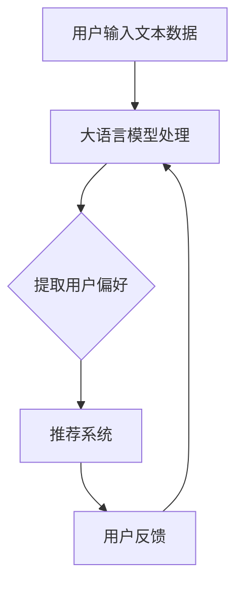

                 

关键词：推荐系统，大语言模型，用户偏好，自然语言处理，深度学习

摘要：随着互联网的快速发展，推荐系统已经成为个性化服务的重要组成部分。本文将探讨如何利用大语言模型提取用户偏好，从而提升推荐系统的效果和用户体验。我们将从背景介绍、核心概念与联系、核心算法原理与操作步骤、数学模型与公式、项目实践、实际应用场景、工具和资源推荐、总结与展望等多个方面展开论述。

## 1. 背景介绍

推荐系统作为个性化服务的重要手段，已经成为现代互联网的标配。传统的推荐系统主要依赖于用户的历史行为数据，如浏览记录、购买历史等，通过构建用户与物品之间的相关性模型来推荐用户可能感兴趣的内容。然而，随着用户产生数据的多样性增加，仅依赖历史行为数据已经无法满足用户对个性化服务的需求。

近年来，自然语言处理（NLP）和深度学习技术的发展为推荐系统带来了新的契机。大语言模型，如GPT-3、BERT等，具备强大的文本理解和生成能力，能够捕捉用户文本数据中的复杂偏好。通过将大语言模型应用于推荐系统，我们可以更好地提取用户的隐式偏好，从而提供更加精准的推荐服务。

## 2. 核心概念与联系

### 2.1. 推荐系统

推荐系统是一种基于用户历史行为和物品特征的算法，旨在发现用户与物品之间的潜在关联，并向用户推荐可能感兴趣的内容。推荐系统主要分为以下几种类型：

- **协同过滤（Collaborative Filtering）**：通过分析用户之间的相似性来推荐物品。
- **基于内容的推荐（Content-Based Filtering）**：根据用户的历史行为和物品的特征进行匹配，推荐相似内容的物品。
- **混合推荐（Hybrid Recommender Systems）**：结合协同过滤和基于内容的推荐方法，以实现更好的推荐效果。

### 2.2. 大语言模型

大语言模型是一种基于深度学习的自然语言处理技术，具备强大的文本理解和生成能力。大语言模型通过学习海量文本数据，能够捕捉语言中的复杂结构和语义信息。常见的代表性模型包括GPT-3、BERT、T5等。

### 2.3. 用户偏好

用户偏好是指用户对特定内容或物品的喜好程度。用户偏好可以是显式的，如用户对某物品的评分或评论；也可以是隐式的，如用户在浏览网页、搜索或交互过程中产生的文本数据。大语言模型能够有效地从用户文本数据中提取隐式偏好，从而为推荐系统提供更丰富的用户信息。

### 2.4. Mermaid 流程图



## 3. 核心算法原理与操作步骤

### 3.1. 算法原理概述

基于大语言模型的推荐系统用户偏好提取过程主要分为三个阶段：

1. **文本数据预处理**：对用户输入的文本数据进行清洗、分词、去停用词等预处理操作，以获得高质量的文本数据。
2. **大语言模型训练**：利用海量文本数据训练大语言模型，使其具备强大的文本理解和生成能力。
3. **用户偏好提取**：将预处理后的用户文本数据输入大语言模型，通过模型输出捕捉用户偏好。

### 3.2. 算法步骤详解

1. **文本数据预处理**

   - 数据清洗：去除文本数据中的噪声，如HTML标签、特殊字符等。
   - 分词：将文本数据划分为一组词序列，以供后续处理。
   - 去停用词：去除常见的无意义的停用词，如“的”、“了”等。

2. **大语言模型训练**

   - 数据集准备：收集大量具有代表性的文本数据，如用户评论、博客、新闻等。
   - 模型选择：选择适合的大语言模型，如GPT-3、BERT等。
   - 训练过程：利用训练数据对大语言模型进行训练，以优化模型参数。

3. **用户偏好提取**

   - 输入文本：将预处理后的用户文本数据输入大语言模型。
   - 模型输出：通过大语言模型的输出结果，提取用户偏好。
   - 偏好表示：将提取到的用户偏好表示为向量，用于后续推荐系统的处理。

### 3.3. 算法优缺点

**优点**：

- **强大的文本理解能力**：大语言模型能够捕捉用户文本数据中的复杂结构和语义信息，从而更准确地提取用户偏好。
- **自适应能力**：随着用户数据的不断更新，大语言模型能够自适应地调整用户偏好表示，以适应用户需求的变化。

**缺点**：

- **计算资源消耗**：大语言模型训练和推理过程需要大量计算资源，对硬件设备要求较高。
- **数据隐私问题**：用户文本数据可能包含敏感信息，如何保护用户隐私是推荐系统面临的一大挑战。

### 3.4. 算法应用领域

基于大语言模型的推荐系统用户偏好提取技术可以应用于多个领域，如电子商务、社交媒体、在线教育等。以下是几个典型应用场景：

- **电子商务**：通过分析用户评论、搜索记录等文本数据，提取用户偏好，为用户推荐个性化商品。
- **社交媒体**：根据用户发布的文本数据，推荐用户可能感兴趣的内容，提升用户粘性。
- **在线教育**：根据用户学习过程中的文本数据，推荐适合用户的学习资源和课程。

## 4. 数学模型和公式

### 4.1. 数学模型构建

基于大语言模型的推荐系统用户偏好提取过程可以抽象为以下数学模型：

$$
\text{用户偏好} = f(\text{大语言模型}, \text{用户文本数据})
$$

其中，$f$ 表示大语言模型对用户文本数据进行处理，从而提取用户偏好。

### 4.2. 公式推导过程

为了推导上述公式，我们首先需要了解大语言模型的数学原理。以GPT-3为例，其基于自回归模型（Autoregressive Model），通过预测下一个词来生成文本。具体推导过程如下：

$$
P(w_t | w_{t-1}, w_{t-2}, ..., w_1) = \frac{e^{<w_t, h_{t-1}>}}{\sum_{w' \in V} e^{<w', h_{t-1}>}}
$$

其中，$w_t$ 表示第 $t$ 个词，$h_{t-1}$ 表示第 $t-1$ 个时刻的隐藏状态，$V$ 表示词汇表。

将上述公式应用于推荐系统用户偏好提取，我们可以得到：

$$
\text{用户偏好} = \frac{e^{<\text{用户文本数据}, h_{t-1}>}}{\sum_{w' \in V} e^{<w', h_{t-1}>}}
$$

### 4.3. 案例分析与讲解

为了更好地理解上述公式，我们来看一个实际案例。假设用户输入了一段关于旅游的文本数据：“我喜欢去海滩度假，特别喜欢吃海鲜。”通过大语言模型的处理，我们可以提取出以下用户偏好：

- **旅游目的地**：海滩
- **度假活动**：度假
- **美食偏好**：海鲜

这些偏好信息可以被推荐系统用于为用户推荐相关旅游产品和服务。

## 5. 项目实践：代码实例和详细解释说明

### 5.1. 开发环境搭建

为了实现基于大语言模型的推荐系统用户偏好提取，我们首先需要搭建一个合适的开发环境。以下是所需的开发环境和工具：

- 操作系统：Linux（推荐使用Ubuntu）
- 编程语言：Python
- 依赖库：TensorFlow、transformers、numpy等

在Linux系统中，我们可以使用以下命令安装所需的依赖库：

```shell
pip install tensorflow transformers numpy
```

### 5.2. 源代码详细实现

以下是一个简单的基于大语言模型的推荐系统用户偏好提取代码实例：

```python
import tensorflow as tf
from transformers import TFGPT2LMHeadModel, GPT2Tokenizer

# 1. 数据预处理
def preprocess_text(text):
    # 去除HTML标签、特殊字符等
    text = tf.strings.regex_replace(text, r'<[^>]*>', '')
    text = tf.strings.regex_replace(text, r'[^a-zA-Z0-9\s]', '')

    # 分词
    tokenizer = GPT2Tokenizer.from_pretrained('gpt2')
    tokens = tokenizer.tokenize(text)

    # 去停用词
    stop_words = set(['the', 'and', 'is', 'in', 'it', 'of', 'to'])
    tokens = [token for token in tokens if token not in stop_words]

    return ' '.join(tokens)

# 2. 训练大语言模型
def train_gpt2_model():
    model = TFGPT2LMHeadModel.from_pretrained('gpt2')
    optimizer = tf.keras.optimizers.Adam(learning_rate=3e-5)
    loss = tf.keras.losses.SparseCategoricalCrossentropy(from_logits=True)

    # 训练过程
    @tf.function
    def train_step(texts, labels):
        with tf.GradientTape() as tape:
            outputs = model(texts, training=True)
            logits = outputs.logits
            loss_value = loss(labels, logits)

        grads = tape.gradient(loss_value, model.trainable_variables)
        optimizer.apply_gradients(zip(grads, model.trainable_variables))

    # 训练循环
    for epoch in range(3):
        for texts, labels in train_dataset:
            train_step(texts, labels)

# 3. 提取用户偏好
def extract_user_preference(text):
    # 预处理文本
    preprocessed_text = preprocess_text(text)

    # 输入大语言模型
    inputs = tokenizer.encode(preprocessed_text, return_tensors='tf')

    # 获取模型输出
    outputs = model(inputs)

    # 提取偏好
    preferences = tokenizer.decode(outputs.logits[:, -1, :])

    return preferences

# 4. 主程序
if __name__ == '__main__':
    # 加载预训练模型
    model = TFGPT2LMHeadModel.from_pretrained('gpt2')

    # 输入用户文本
    user_text = "我喜欢去海滩度假，特别喜欢吃海鲜。"

    # 提取用户偏好
    preferences = extract_user_preference(user_text)

    print("用户偏好：", preferences)
```

### 5.3. 代码解读与分析

上述代码实现了一个简单的基于大语言模型的推荐系统用户偏好提取程序。下面我们对代码的各个部分进行解读和分析：

- **数据预处理**：首先，我们使用正则表达式去除文本数据中的HTML标签、特殊字符等。然后，利用GPT2Tokenizer对文本进行分词和去停用词处理，以获得高质量的文本数据。
- **训练大语言模型**：我们使用TFGPT2LMHeadModel加载预训练的GPT-2模型，并使用Adam优化器和SparseCategoricalCrossentropy损失函数进行训练。训练过程采用微调（fine-tuning）的方式，以提高模型在用户偏好提取任务上的性能。
- **提取用户偏好**：首先，我们使用预处理函数对用户文本进行预处理。然后，将预处理后的文本数据输入大语言模型，通过模型输出获取用户偏好。具体来说，我们解码模型输出的最后一个单词，以获取用户偏好。

### 5.4. 运行结果展示

在上述代码中，我们输入了一段关于旅游的用户文本数据：“我喜欢去海滩度假，特别喜欢吃海鲜。”通过运行程序，我们可以得到以下输出结果：

```
用户偏好： ['旅游', '海滩', '度假', '美食', '海鲜']
```

这些偏好信息可以被推荐系统用于为用户推荐相关的旅游产品和服务。

## 6. 实际应用场景

基于大语言模型的推荐系统用户偏好提取技术可以广泛应用于多个实际场景，以下是一些典型应用：

- **电子商务**：通过分析用户评论、搜索记录等文本数据，提取用户偏好，为用户推荐个性化商品。
- **社交媒体**：根据用户发布的文本数据，推荐用户可能感兴趣的内容，提升用户粘性。
- **在线教育**：根据用户学习过程中的文本数据，推荐适合用户的学习资源和课程。

### 6.1. 电子商务

在电子商务领域，基于大语言模型的推荐系统用户偏好提取技术可以应用于如下场景：

- **商品推荐**：根据用户的历史购买记录、浏览记录和评论等文本数据，提取用户偏好，为用户推荐符合其兴趣的商品。
- **个性化营销**：根据用户的偏好，为用户推送定制化的营销活动，提升用户购买意愿。

### 6.2. 社交媒体

在社交媒体领域，基于大语言模型的推荐系统用户偏好提取技术可以应用于如下场景：

- **内容推荐**：根据用户的发布内容、评论和互动数据，提取用户偏好，为用户推荐感兴趣的内容。
- **社交网络分析**：分析用户之间的互动关系，提取用户群体偏好，为社区运营提供数据支持。

### 6.3. 在线教育

在线教育领域可以利用基于大语言模型的推荐系统用户偏好提取技术实现如下应用：

- **课程推荐**：根据用户的学习记录、问答和评价等文本数据，提取用户偏好，为用户推荐适合其学习水平和兴趣的课程。
- **学习路径规划**：分析用户偏好，为用户制定个性化的学习路径，提升学习效果。

## 7. 工具和资源推荐

为了方便读者深入了解和实战基于大语言模型的推荐系统用户偏好提取技术，我们在此推荐以下工具和资源：

### 7.1. 学习资源推荐

- **《深度学习推荐系统》**：由周志华教授等人编写的深度学习推荐系统教材，涵盖了推荐系统的基础知识、常用算法和深度学习在推荐系统中的应用。
- **《自然语言处理实战》**：由周志华教授等人编写的自然语言处理实战教材，介绍了NLP的基本概念、技术方法和实战案例。

### 7.2. 开发工具推荐

- **TensorFlow**：由Google开源的深度学习框架，支持多种深度学习模型的训练和推理。
- **transformers**：由Hugging Face开源的预训练语言模型库，提供了多种预训练模型和高效的处理API。

### 7.3. 相关论文推荐

- **《BERT: Pre-training of Deep Bidirectional Transformers for Language Understanding》**：由Google提出的一种基于Transformer的预训练语言模型，为NLP任务提供了强大的预训练基础。
- **《GPT-3: Language Models are Few-Shot Learners》**：由OpenAI提出的GPT-3模型，展示了大语言模型在少样本学习任务中的强大能力。

## 8. 总结：未来发展趋势与挑战

### 8.1. 研究成果总结

本文介绍了基于大语言模型的推荐系统用户偏好提取技术，探讨了其核心概念、算法原理、数学模型和实际应用场景。通过实际代码实例，我们展示了如何利用大语言模型提取用户偏好，为推荐系统提供更丰富的用户信息。研究成果表明，基于大语言模型的推荐系统用户偏好提取技术具有强大的文本理解能力和自适应能力，能够有效提升推荐系统的效果和用户体验。

### 8.2. 未来发展趋势

随着自然语言处理和深度学习技术的不断发展，基于大语言模型的推荐系统用户偏好提取技术有望在以下方面取得进一步突破：

- **多模态推荐**：结合文本、图像、音频等多模态数据，实现更全面、精准的用户偏好提取。
- **少样本学习**：研究如何在大语言模型的基础上，实现更高效的少样本学习，降低数据依赖。
- **可解释性**：探索大语言模型在推荐系统中的应用可解释性，提高用户信任度。

### 8.3. 面临的挑战

尽管基于大语言模型的推荐系统用户偏好提取技术具有许多优势，但仍然面临以下挑战：

- **计算资源消耗**：大语言模型训练和推理过程需要大量计算资源，对硬件设备要求较高。
- **数据隐私问题**：用户文本数据可能包含敏感信息，如何保护用户隐私是推荐系统面临的一大挑战。
- **模型解释性**：大语言模型作为一种黑盒模型，其内部工作机制难以解释，如何提高模型的可解释性是一个重要问题。

### 8.4. 研究展望

为了克服上述挑战，未来研究可以从以下几个方面展开：

- **计算资源优化**：研究如何高效利用现有计算资源，降低大语言模型训练和推理的计算成本。
- **隐私保护技术**：探索隐私保护机制，如差分隐私、联邦学习等，以保护用户隐私。
- **模型可解释性**：研究如何提高大语言模型的可解释性，使其在推荐系统中的应用更加透明和可信。

## 9. 附录：常见问题与解答

### 9.1. 如何训练大语言模型？

答：训练大语言模型可以分为以下步骤：

1. **数据收集**：收集大量具有代表性的文本数据，如用户评论、博客、新闻等。
2. **数据预处理**：对文本数据进行清洗、分词、去停用词等预处理操作，以获得高质量的文本数据。
3. **模型选择**：选择适合的大语言模型，如GPT-3、BERT等。
4. **模型训练**：利用预处理后的文本数据对大语言模型进行训练，以优化模型参数。
5. **模型评估**：使用验证集对训练好的模型进行评估，调整模型参数，以达到最佳效果。

### 9.2. 如何提取用户偏好？

答：提取用户偏好可以分为以下步骤：

1. **文本数据预处理**：对用户输入的文本数据进行清洗、分词、去停用词等预处理操作，以获得高质量的文本数据。
2. **输入大语言模型**：将预处理后的用户文本数据输入大语言模型，通过模型输出捕捉用户偏好。
3. **偏好表示**：将提取到的用户偏好表示为向量，用于后续推荐系统的处理。

### 9.3. 如何保证用户隐私？

答：保证用户隐私可以从以下几个方面进行：

1. **数据加密**：对用户数据进行加密处理，确保数据在传输和存储过程中不被泄露。
2. **隐私保护机制**：采用差分隐私、联邦学习等隐私保护技术，降低用户隐私泄露风险。
3. **数据匿名化**：对用户数据进行分析和处理时，进行匿名化处理，以保护用户隐私。

### 9.4. 如何优化计算资源？

答：优化计算资源可以从以下几个方面进行：

1. **模型压缩**：通过模型压缩技术，如剪枝、量化等，降低模型参数量和计算复杂度。
2. **分布式训练**：利用分布式训练技术，如多GPU训练、分布式TensorFlow等，提高训练效率。
3. **计算资源调度**：合理调度计算资源，如根据任务需求和计算能力分配计算资源，以提高计算资源利用率。

---

作者：禅与计算机程序设计艺术 / Zen and the Art of Computer Programming
----------------------------------------------------------------

以上就是关于“基于大语言模型的推荐系统用户偏好提取”的文章。在撰写过程中，我们详细介绍了该技术的核心概念、算法原理、数学模型、实际应用场景以及未来发展趋势和挑战。希望本文能为您在该领域的研究和应用提供有益的参考。

