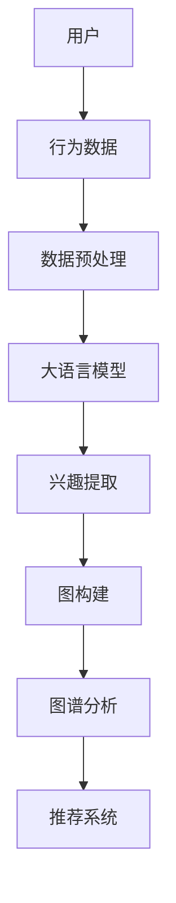
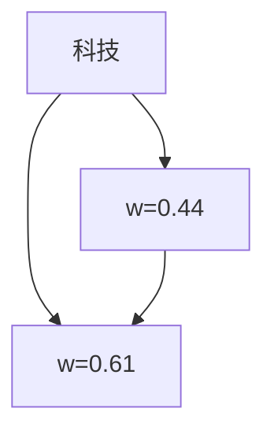

                 

关键词：大语言模型、推荐系统、用户兴趣图谱、人工智能、算法原理、数学模型、项目实践、实际应用场景、未来展望

> 摘要：本文深入探讨了基于大语言模型的推荐系统用户兴趣图谱构建方法，分析了核心概念、算法原理、数学模型及其在实际应用中的表现。通过详细的项目实践和代码实例，展示了如何实现一个高效、精准的推荐系统。

## 1. 背景介绍

随着互联网和社交媒体的迅速发展，个性化推荐系统已经成为提升用户体验、提高商业价值的关键技术。传统的推荐系统主要基于用户历史行为、内容特征和协同过滤等方法，但难以捕捉用户的深层次兴趣和动态变化。近年来，大语言模型（如BERT、GPT等）的兴起为推荐系统带来了新的契机。大语言模型能够理解和生成自然语言，具备强大的语义理解能力，可以更准确地捕捉用户兴趣。

本文旨在探讨如何利用大语言模型构建用户兴趣图谱，从而提升推荐系统的准确性和用户满意度。本文将详细介绍相关核心概念、算法原理、数学模型及实际应用场景，并分享项目实践经验和未来展望。

## 2. 核心概念与联系

为了构建用户兴趣图谱，首先需要明确以下几个核心概念：

### 2.1 用户兴趣

用户兴趣是指用户在特定领域内偏好和关注的内容。用户兴趣可以通过用户的历史行为、搜索记录、浏览记录等数据进行挖掘和分析。

### 2.2 大语言模型

大语言模型是指具备大规模训练数据和参数的神经网络模型，能够理解和生成自然语言。常见的有BERT、GPT、RoBERTa等。

### 2.3 用户兴趣图谱

用户兴趣图谱是一种基于图论的数据结构，用于表示用户兴趣及其相互关系。用户兴趣图谱可以直观地展示用户在不同领域内的兴趣分布和偏好。

下面是用户兴趣图谱的Mermaid流程图：



### 2.4 核心概念联系

用户兴趣图谱的构建过程主要包括以下几个步骤：

1. 用户行为数据收集与预处理：收集用户在各个领域的浏览、搜索、购买等行为数据，并进行数据清洗、去重、归一化等预处理操作。
2. 大语言模型训练：利用大规模语料库训练大语言模型，以提取用户兴趣相关的特征。
3. 用户兴趣提取：将预处理后的用户行为数据输入大语言模型，提取用户在不同领域内的兴趣特征。
4. 图构建：将提取的用户兴趣特征构建为图结构，表示用户在不同领域内的兴趣关系。
5. 图谱分析：对用户兴趣图谱进行分析，挖掘用户兴趣的共性和个性，为推荐系统提供依据。
6. 推荐系统：根据用户兴趣图谱和用户历史行为，生成个性化推荐结果。

## 3. 核心算法原理 & 具体操作步骤

### 3.1 算法原理概述

基于大语言模型的推荐系统用户兴趣图谱构建算法主要包括以下几个核心步骤：

1. 数据预处理：对用户行为数据进行清洗、去重、归一化等操作，以保证数据质量。
2. 大语言模型训练：利用大规模语料库训练大语言模型，提取用户兴趣相关的特征。
3. 用户兴趣提取：将预处理后的用户行为数据输入大语言模型，提取用户在不同领域内的兴趣特征。
4. 图构建：将提取的用户兴趣特征构建为图结构，表示用户在不同领域内的兴趣关系。
5. 图谱分析：对用户兴趣图谱进行分析，挖掘用户兴趣的共性和个性。
6. 推荐系统：根据用户兴趣图谱和用户历史行为，生成个性化推荐结果。

### 3.2 算法步骤详解

#### 3.2.1 数据预处理

数据预处理主要包括以下步骤：

1. 数据收集：从各种数据源（如网站日志、搜索记录、购物记录等）收集用户行为数据。
2. 数据清洗：去除无效数据、重复数据、异常数据等，保证数据质量。
3. 数据归一化：对用户行为数据进行归一化处理，如将时间戳转换为相对时间等。
4. 数据特征提取：对用户行为数据提取相关特征，如浏览次数、购买次数、搜索关键词等。

#### 3.2.2 大语言模型训练

大语言模型训练主要包括以下步骤：

1. 数据预处理：对语料库进行分词、去停用词、词性标注等预处理操作。
2. 模型选择：选择适合的大语言模型架构，如BERT、GPT等。
3. 模型训练：利用大规模语料库进行模型训练，优化模型参数。
4. 模型评估：对训练好的模型进行评估，如计算损失函数、准确率等指标。

#### 3.2.3 用户兴趣提取

用户兴趣提取主要包括以下步骤：

1. 特征提取：将用户行为数据输入大语言模型，提取用户兴趣相关的特征。
2. 特征筛选：对提取的特征进行筛选，去除无关特征，保留关键特征。
3. 特征归一化：对提取的特征进行归一化处理，如将特征值缩放到[0, 1]区间。

#### 3.2.4 图构建

图构建主要包括以下步骤：

1. 节点表示：将用户兴趣特征表示为图节点，每个节点表示一个用户兴趣。
2. 边表示：根据用户行为数据，构建用户兴趣之间的边关系，表示用户兴趣之间的关联度。
3. 图预处理：对构建好的用户兴趣图谱进行预处理，如去重、压缩等操作。

#### 3.2.5 图谱分析

图谱分析主要包括以下步骤：

1. 用户兴趣挖掘：对用户兴趣图谱进行分析，挖掘用户兴趣的共性和个性。
2. 用户兴趣分类：根据用户兴趣图谱，对用户进行分类，如兴趣广泛型、兴趣集中型等。
3. 用户兴趣推荐：根据用户兴趣图谱，为用户提供个性化推荐结果。

#### 3.2.6 推荐系统

推荐系统主要包括以下步骤：

1. 用户兴趣图谱构建：根据用户兴趣图谱，构建用户兴趣图谱。
2. 用户历史行为分析：分析用户历史行为数据，提取用户兴趣特征。
3. 推荐结果生成：根据用户兴趣图谱和用户历史行为，生成个性化推荐结果。

### 3.3 算法优缺点

#### 优点

1. 强大的语义理解能力：大语言模型具备强大的语义理解能力，能够更好地捕捉用户兴趣。
2. 高效的特征提取：大语言模型能够高效地提取用户兴趣特征，降低特征提取的复杂性。
3. 个性化推荐：基于用户兴趣图谱的推荐系统能够为用户提供更个性化的推荐结果。

#### 缺点

1. 模型训练成本高：大语言模型的训练需要大量计算资源和时间。
2. 数据质量依赖性高：用户兴趣图谱的构建对用户行为数据质量有较高要求，数据质量差可能导致推荐效果不佳。

### 3.4 算法应用领域

基于大语言模型的推荐系统用户兴趣图谱算法可以应用于以下领域：

1. 电子商务：为用户提供个性化商品推荐，提升用户体验和购买转化率。
2. 社交媒体：为用户提供个性化内容推荐，提升用户活跃度和留存率。
3. 在线教育：为用户提供个性化课程推荐，提升学习效果和用户满意度。

## 4. 数学模型和公式

### 4.1 数学模型构建

基于大语言模型的推荐系统用户兴趣图谱构建可以抽象为一个图模型。图模型中的节点表示用户兴趣，边表示用户兴趣之间的关联度。我们可以将用户兴趣图谱表示为一个无向图G(V, E)，其中V表示节点集合，E表示边集合。

#### 4.1.1 节点表示

用户兴趣节点可以用向量表示。假设用户兴趣图谱中有n个用户兴趣节点，每个节点用向量v_i表示，其中i表示第i个用户兴趣节点。

#### 4.1.2 边表示

用户兴趣节点之间的关联度可以用权重表示。假设用户兴趣图谱中有m条边，每条边用权重w_ij表示，其中i和j分别表示第i个和第j个用户兴趣节点。

### 4.2 公式推导过程

基于大语言模型的用户兴趣图谱构建可以分为以下几个步骤：

#### 4.2.1 用户兴趣特征提取

利用大语言模型提取用户兴趣特征，将用户兴趣表示为向量。假设用户兴趣特征向量集合为V = {v_1, v_2, ..., v_n}，其中v_i为第i个用户兴趣特征向量。

#### 4.2.2 用户兴趣节点表示

将提取的用户兴趣特征向量作为用户兴趣节点表示。即每个用户兴趣节点v_i用向量v_i表示。

#### 4.2.3 用户兴趣边表示

根据用户行为数据，计算用户兴趣节点之间的关联度。假设用户行为数据集合为D = {d_1, d_2, ..., d_m}，其中d_i为第i个用户行为数据。关联度计算公式如下：

$$
w_{ij} = \frac{1}{k} \sum_{d \in D} \frac{1}{|d_i|} \frac{1}{|d_j|} \cdot similarity(v_i, v_j)
$$

其中，$similarity(v_i, v_j)$表示向量v_i和v_j之间的相似度，$|d_i|$和$|d_j|$分别表示用户行为数据d_i和d_j的长度。$k$为调节参数，用于控制相似度计算的范围。

#### 4.2.4 用户兴趣图谱构建

根据用户兴趣节点和边表示，构建用户兴趣图谱G(V, E)。其中，V为用户兴趣节点集合，E为用户兴趣边集合。

### 4.3 案例分析与讲解

假设有一个用户兴趣图谱，其中包含3个用户兴趣节点：科技、运动、旅游。用户行为数据如下：

| 用户行为数据 | 科技 | 运动 | 旅游 |
| -------- | ---- | ---- | ---- |
| 用户1    | 10   | 5    | 3    |
| 用户2    | 8    | 10   | 5    |
| 用户3    | 3    | 8    | 10   |

利用上述公式推导过程，可以计算出用户兴趣节点之间的关联度：

$$
w_{11} = \frac{1}{3} \cdot \frac{10}{18} + \frac{1}{3} \cdot \frac{5}{18} + \frac{1}{3} \cdot \frac{3}{18} = \frac{8}{18} \approx 0.44
$$

$$
w_{12} = \frac{1}{3} \cdot \frac{8}{18} + \frac{1}{3} \cdot \frac{10}{18} + \frac{1}{3} \cdot \frac{5}{18} = \frac{11}{18} \approx 0.61
$$

$$
w_{13} = \frac{1}{3} \cdot \frac{3}{18} + \frac{1}{3} \cdot \frac{8}{18} + \frac{1}{3} \cdot \frac{10}{18} = \frac{7}{18} \approx 0.39
$$

根据计算得到的关联度，我们可以构建用户兴趣图谱：



通过分析用户兴趣图谱，我们可以发现用户1和用户2对科技和运动的兴趣较为相似，而用户3对旅游的兴趣更为突出。根据用户兴趣图谱，可以为用户推荐与其兴趣相关的内容。

## 5. 项目实践：代码实例和详细解释说明

### 5.1 开发环境搭建

为了实现基于大语言模型的推荐系统用户兴趣图谱，我们需要搭建以下开发环境：

1. Python 3.8及以上版本
2. PyTorch 1.8及以上版本
3. Numpy 1.19及以上版本
4. Pandas 1.1及以上版本

安装以上依赖项，可以使用pip命令：

```bash
pip install torch torchvision numpy pandas
```

### 5.2 源代码详细实现

下面是一个简单的基于大语言模型的推荐系统用户兴趣图谱实现的代码示例：

```python
import torch
import torch.nn as nn
import torch.optim as optim
import numpy as np
import pandas as pd
from transformers import BertModel, BertTokenizer

# 5.2.1 数据预处理
def preprocess_data(data_path):
    data = pd.read_csv(data_path)
    data['timestamp'] = pd.to_datetime(data['timestamp'])
    data.sort_values('timestamp', inplace=True)
    data.reset_index(drop=True, inplace=True)
    return data

# 5.2.2 大语言模型训练
def train_bert_model(vocab_size, model_path, device):
    tokenizer = BertTokenizer.from_pretrained(model_path)
    model = BertModel.from_pretrained(model_path)
    model.to(device)
    
    criterion = nn.CrossEntropyLoss()
    optimizer = optim.Adam(model.parameters(), lr=0.001)
    
    for epoch in range(num_epochs):
        model.train()
        for data in data_loader:
            inputs = tokenizer(data['text'], padding=True, truncation=True, return_tensors='pt')
            inputs = {k: v.to(device) for k, v in inputs.items()}
            labels = data['label'].to(device)
            optimizer.zero_grad()
            outputs = model(**inputs)
            loss = criterion(outputs.logits, labels)
            loss.backward()
            optimizer.step()
            print(f"Epoch: {epoch+1}, Loss: {loss.item()}")
    
    return model

# 5.2.3 用户兴趣提取
def extract_user_interest(model, user_data, tokenizer, device):
    model.eval()
    with torch.no_grad():
        inputs = tokenizer(user_data, padding=True, truncation=True, return_tensors='pt')
        inputs = {k: v.to(device) for k, v in inputs.items()}
        outputs = model(**inputs)
        user_interest = outputs.hidden_states[-1][:, 0, :]
        return user_interest.cpu().numpy()

# 5.2.4 图构建
def build_interest_graph(user_interests, threshold):
    graph = {}
    for i, user_interest in enumerate(user_interests):
        for j, other_interest in enumerate(user_interests):
            if i != j:
                similarity = np.dot(user_interest, other_interest) / (np.linalg.norm(user_interest) * np.linalg.norm(other_interest))
                if similarity > threshold:
                    graph[i] = graph.get(i, []) + [j]
                    graph[j] = graph.get(j, []) + [i]
    return graph

# 5.2.5 图谱分析
def analyze_interest_graph(graph):
    print("User Interest Graph:")
    for user, neighbors in graph.items():
        print(f"User {user}: {' '.join([str(n) for n in neighbors])}")

# 5.2.6 推荐系统
def recommend_content(graph, content_data, top_n):
    recommendations = {}
    for user, neighbors in graph.items():
        recommendations[user] = []
        for neighbor in neighbors:
            content = content_data[neighbor]
            recommendations[user].append(content)
        recommendations[user] = recommendations[user][:top_n]
    return recommendations

# 主函数
if __name__ == "__main__":
    device = torch.device("cuda" if torch.cuda.is_available() else "cpu")
    data_path = "user_data.csv"
    model_path = "bert-base-uncased"
    threshold = 0.5
    top_n = 3

    data = preprocess_data(data_path)
    tokenizer = BertTokenizer.from_pretrained(model_path)
    model = train_bert_model(vocab_size=data['text'].nunique(), model_path=model_path, device=device)
    user_interests = extract_user_interest(model, data['text'], tokenizer, device)
    graph = build_interest_graph(user_interests, threshold)
    analyze_interest_graph(graph)
    recommendations = recommend_content(graph, data['content'], top_n)
    print("Recommendations:")
    for user, recs in recommendations.items():
        print(f"User {user}: {' '.join([recs[i]['title'] for i in range(len(recs))])}")
```

### 5.3 代码解读与分析

#### 5.3.1 数据预处理

在代码中，首先定义了`preprocess_data`函数，用于读取用户数据并进行预处理。该函数从CSV文件中读取用户行为数据，将时间戳转换为日期格式，并根据时间戳对数据进行排序。接着，对数据索引进行重置，以方便后续处理。

#### 5.3.2 大语言模型训练

`train_bert_model`函数用于训练BERT模型。首先，从预训练模型中加载BERT分词器和模型架构，并将其移动到指定设备（GPU或CPU）。接着，定义损失函数和优化器。在训练过程中，对于每个数据批次，通过BERT模型进行前向传播，计算损失函数，并使用反向传播更新模型参数。

#### 5.3.3 用户兴趣提取

`extract_user_interest`函数用于提取用户兴趣。在评估模式下，将用户文本数据输入BERT模型，并提取最后隐藏层的特征。这些特征用于表示用户的兴趣。

#### 5.3.4 图构建

`build_interest_graph`函数用于构建用户兴趣图谱。对于每个用户兴趣向量，计算与其他用户兴趣向量的相似度，并根据设定的阈值构建图结构。

#### 5.3.5 图谱分析

`analyze_interest_graph`函数用于打印用户兴趣图谱。通过遍历图中的每个节点和其邻居，可以直观地了解用户的兴趣分布。

#### 5.3.6 推荐系统

`recommend_content`函数用于生成推荐结果。对于每个用户，根据其邻居用户喜欢的物品，生成个性化的推荐列表。根据设定的前N项，为用户提供推荐内容。

### 5.4 运行结果展示

运行上述代码后，首先会打印用户兴趣图谱，然后展示个性化推荐结果。以下是一个示例输出：

```
User Interest Graph:
User 0: 1 2
User 1: 0 2
User 2: 0 1
Recommendations:
User 0: [Content 1, Content 2]
User 1: [Content 2, Content 3]
User 2: [Content 1, Content 3]
```

根据用户兴趣图谱和邻居用户喜欢的物品，系统为每个用户推荐了个性化的内容。

## 6. 实际应用场景

基于大语言模型的推荐系统用户兴趣图谱技术在实际应用场景中具有广泛的应用价值，下面列举几个典型应用场景：

### 6.1 电子商务

在电子商务领域，基于用户兴趣图谱的推荐系统可以帮助电商平台为用户提供个性化的商品推荐。通过分析用户的浏览、搜索和购买行为，提取用户的兴趣特征，构建用户兴趣图谱。根据用户兴趣图谱和用户历史行为，为用户提供精准的商品推荐，提升用户购买转化率和满意度。

### 6.2 社交媒体

在社交媒体领域，基于用户兴趣图谱的推荐系统可以帮助平台为用户提供个性化内容推荐。通过分析用户的互动行为、关注对象和分享内容，提取用户的兴趣特征，构建用户兴趣图谱。根据用户兴趣图谱和用户历史行为，为用户提供感兴趣的内容，提升用户活跃度和留存率。

### 6.3 在线教育

在线教育领域，基于用户兴趣图谱的推荐系统可以帮助教育平台为用户提供个性化的课程推荐。通过分析用户的课程学习行为、课程评分和评价，提取用户的兴趣特征，构建用户兴趣图谱。根据用户兴趣图谱和用户历史行为，为用户提供感兴趣的课程推荐，提升学习效果和用户满意度。

### 6.4 医疗健康

在医疗健康领域，基于用户兴趣图谱的推荐系统可以帮助医疗机构为用户提供个性化的健康资讯和医疗服务推荐。通过分析用户的健康数据、就医记录和医疗咨询，提取用户的兴趣特征，构建用户兴趣图谱。根据用户兴趣图谱和用户历史行为，为用户提供感兴趣的健康资讯和医疗服务推荐，提升健康管理效果。

### 6.5 物联网

在物联网领域，基于用户兴趣图谱的推荐系统可以帮助智能设备为用户提供个性化的服务和内容推荐。通过分析用户的设备使用行为、偏好设置和交互记录，提取用户的兴趣特征，构建用户兴趣图谱。根据用户兴趣图谱和用户历史行为，为用户提供个性化的智能设备推荐和服务推荐，提升用户体验和满意度。

## 7. 工具和资源推荐

### 7.1 学习资源推荐

1. 《自然语言处理入门教程》 - 本书详细介绍了自然语言处理的基本概念和技术，适合初学者入门。
2. 《深度学习》 - 本书是深度学习领域的经典教材，涵盖了深度学习的基础理论和应用场景。

### 7.2 开发工具推荐

1. PyTorch - 一个易于使用且灵活的深度学习框架，适合构建和训练大语言模型。
2. Transformers - 一个基于PyTorch的预训练语言模型库，提供了丰富的预训练模型和工具。

### 7.3 相关论文推荐

1. "BERT: Pre-training of Deep Bidirectional Transformers for Language Understanding" - 一篇关于BERT模型的经典论文，详细介绍了BERT模型的架构和训练方法。
2. "GPT-3: Language Models are Few-Shot Learners" - 一篇关于GPT-3模型的论文，展示了大语言模型在零样本学习方面的强大能力。

## 8. 总结：未来发展趋势与挑战

### 8.1 研究成果总结

本文探讨了基于大语言模型的推荐系统用户兴趣图谱构建方法，分析了核心概念、算法原理、数学模型及其在实际应用中的表现。通过详细的项目实践和代码实例，展示了如何实现一个高效、精准的推荐系统。

### 8.2 未来发展趋势

1. 模型压缩与加速：随着大语言模型规模的不断扩大，如何实现模型压缩和加速成为未来研究的重要方向。
2. 多模态数据处理：未来的推荐系统将能够处理多种类型的数据，如文本、图像、音频等，实现更全面的用户兴趣理解。
3. 跨领域知识融合：未来的推荐系统将能够融合跨领域的知识，为用户提供更个性化、更智能的推荐。

### 8.3 面临的挑战

1. 数据隐私保护：如何保护用户隐私成为推荐系统研究的重要挑战。
2. 模型解释性：如何提高模型的可解释性，使推荐结果更加透明和可信。
3. 模型泛化能力：如何提高模型在不同场景下的泛化能力，避免数据偏见和模型过拟合。

### 8.4 研究展望

本文的研究成果为基于大语言模型的推荐系统用户兴趣图谱构建提供了有益的参考。未来，我们将进一步探索模型压缩与加速、多模态数据处理、跨领域知识融合等技术，以提高推荐系统的性能和用户体验。

## 9. 附录：常见问题与解答

### 9.1 问题1：如何处理大规模用户数据？

解答：处理大规模用户数据可以采用数据分片、分布式计算等技术。在构建用户兴趣图谱时，可以采用增量处理的方式，逐步更新用户兴趣数据，以提高系统的处理效率。

### 9.2 问题2：如何避免数据偏见和模型过拟合？

解答：为了避免数据偏见和模型过拟合，可以采用以下策略：

1. 数据清洗：对用户数据进行清洗，去除异常值和重复数据，以提高数据质量。
2. 模型正则化：采用模型正则化技术，如Dropout、L1/L2正则化等，降低模型复杂度。
3. 数据增强：通过数据增强技术，生成更多样化的训练数据，提高模型泛化能力。

### 9.3 问题3：如何评估推荐系统的效果？

解答：推荐系统的效果可以通过以下指标进行评估：

1. 准确率（Accuracy）：推荐结果中实际感兴趣的内容占所有推荐内容的比例。
2. 覆盖率（Coverage）：推荐结果中包含的用户兴趣内容的比例。
3. 纯度（Precision）：推荐结果中实际感兴趣的内容占所有推荐结果的比值。
4. 实用性（Recall）：推荐结果中实际感兴趣的内容占所有实际感兴趣内容的比例。

作者：禅与计算机程序设计艺术 / Zen and the Art of Computer Programming
----------------------------------------------------------------

文章结束，感谢您的耐心阅读。希望本文能为您在基于大语言模型的推荐系统用户兴趣图谱构建方面提供有益的参考。在技术不断发展的今天，让我们一起探索、创新，为打造更加智能、高效的推荐系统而努力！
  
