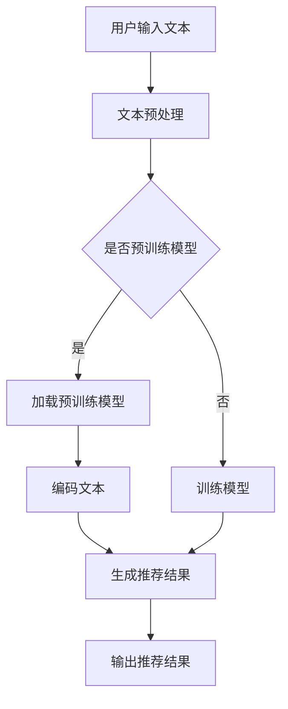

                 

关键词：大语言模型，推荐系统，用户兴趣，文本分析，算法设计，实践案例

摘要：本文旨在探讨如何利用大语言模型构建推荐系统，以精准挖掘和预测用户的兴趣。通过详细阐述核心概念、算法原理、数学模型及其应用，本文旨在为业界提供一种有效的技术解决方案，同时分享实际开发经验与未来展望。

## 1. 背景介绍

推荐系统在互联网时代扮演着至关重要的角色，它们能够为用户提供个性化的内容、商品或服务，从而提高用户体验和满意度。然而，传统的推荐系统大多依赖于基于内容的过滤或协同过滤方法，这些方法在处理大规模、多模态数据时存在诸多局限。随着自然语言处理技术的不断发展，特别是大语言模型的兴起，基于文本分析的推荐系统成为了一个新的研究热点。

本文将探讨如何利用大语言模型构建推荐系统，以实现更精准的用户兴趣挖掘和预测。我们将从核心概念、算法原理、数学模型、项目实践到实际应用场景进行深入剖析，旨在为业界提供一种新的技术思路。

### 1.1 推荐系统的发展历程

推荐系统的发展大致可以分为三个阶段：

#### 简单推荐系统

早期推荐系统主要基于用户的历史行为或内容属性进行简单的关联推荐，如基于物品的协同过滤（Item-based Collaborative Filtering）和基于用户的协同过滤（User-based Collaborative Filtering）。这些方法简单易实现，但在推荐准确性上存在局限性。

#### 复杂推荐系统

随着数据量的增加和数据维度的提升，复杂的推荐系统逐渐兴起。这类系统引入了多种机器学习算法，如矩阵分解、聚类和深度学习等，以提高推荐的准确性和多样性。

#### 智能推荐系统

近年来，智能推荐系统逐渐成为研究热点。这类系统不仅考虑用户的行为和内容特征，还引入了社交网络、情感分析等技术，以实现更智能、个性化的推荐。

### 1.2 大语言模型的优势

大语言模型，如GPT、BERT等，通过预训练和微调，可以在多种任务中表现出色。其优势主要体现在以下几个方面：

- **强大的文本生成能力**：大语言模型能够生成高质量、符合语言逻辑的文本，为推荐系统提供了丰富的内容生成能力。
- **跨领域的泛化能力**：大语言模型在预训练阶段已经接触了大量不同领域的文本数据，因此具有较好的跨领域泛化能力。
- **深度理解文本语义**：大语言模型能够深度理解文本的语义和上下文关系，有助于挖掘用户的潜在兴趣。
- **端到端的学习能力**：大语言模型可以通过端到端的方式直接学习文本数据，减少了传统推荐系统中的特征工程和模型调参步骤。

## 2. 核心概念与联系

为了构建基于大语言模型的推荐系统，我们需要理解以下几个核心概念：

- **用户兴趣**：用户在特定情境下对某一类内容的偏好和倾向。
- **文本分析**：对用户生成或交互的文本进行内容分析和情感分析，以挖掘用户兴趣。
- **推荐算法**：基于用户兴趣和文本分析结果，为用户推荐相关的内容或服务。
- **大语言模型**：一种用于文本生成和理解的高级深度学习模型，如GPT、BERT等。

### 2.1 用户兴趣的挖掘

用户兴趣的挖掘是推荐系统的关键环节。传统方法主要依赖用户的行为数据，如浏览历史、购买记录等。然而，这些数据往往无法全面反映用户的真实兴趣。基于大语言模型的推荐系统可以通过以下方式挖掘用户兴趣：

- **语义理解**：大语言模型能够理解用户文本的语义和上下文，从而挖掘出用户的潜在兴趣。
- **情感分析**：通过情感分析技术，识别用户文本中的情感倾向，从而推断用户兴趣。
- **知识图谱**：利用知识图谱技术，将用户兴趣与相关实体和概念进行关联，以实现更精准的兴趣挖掘。

### 2.2 文本分析的技术手段

文本分析是挖掘用户兴趣的基础。以下是一些常用的文本分析技术：

- **词频统计**：统计文本中各个单词的出现频率，以反映文本的主要内容。
- **TF-IDF**：结合词频统计和文档频率，计算词语的重要性，用于文本相似性计算。
- **主题模型**：如LDA（Latent Dirichlet Allocation），从大量文本中提取潜在的主题，以揭示文本的内容分布。
- **情感分析**：通过情感词典、规则匹配或深度学习模型，识别文本的情感倾向，如正面、负面或中立。

### 2.3 推荐算法的设计

推荐算法的设计是推荐系统的核心。基于大语言模型的推荐系统可以采用以下算法：

- **协同过滤**：基于用户的历史行为，为用户推荐相似用户喜欢的物品。
- **内容推荐**：基于物品的属性，为用户推荐与其兴趣相关的物品。
- **基于模型的推荐**：利用深度学习模型，如GPT、BERT等，预测用户对物品的兴趣，从而进行推荐。
- **混合推荐**：结合多种推荐算法，以提高推荐的准确性和多样性。

### 2.4 大语言模型的架构

大语言模型的架构通常包括以下几个部分：

- **嵌入层**：将文本数据转换为向量表示。
- **编码层**：对输入文本进行编码，提取文本的语义特征。
- **解码层**：根据编码层的结果，生成预测的文本输出。
- **注意力机制**：用于捕捉文本中的关键信息，提高模型的生成质量。

### 2.5 Mermaid 流程图

以下是一个基于大语言模型的推荐系统流程图的示例：



## 3. 核心算法原理 & 具体操作步骤

### 3.1 算法原理概述

基于大语言模型的推荐系统主要依赖于以下几个核心算法：

- **文本预处理**：对用户输入的文本进行清洗、分词、去停用词等预处理操作，以提高模型的效果。
- **预训练模型**：使用大规模语料进行预训练，以提取文本的通用特征。
- **编码与解码**：利用编码层和解码层，将文本转换为向量表示，并生成预测的文本输出。
- **推荐算法**：结合用户兴趣和文本特征，为用户推荐相关的内容或服务。

### 3.2 算法步骤详解

以下是基于大语言模型的推荐系统的具体操作步骤：

#### 3.2.1 文本预处理

1. **文本清洗**：去除文本中的特殊字符、符号和标点，确保文本的干净。
2. **分词**：将文本分割为单词或短语，以便进一步处理。
3. **去停用词**：去除常见的无意义词语，如“的”、“了”、“在”等，以提高模型的效果。

#### 3.2.2 预训练模型

1. **数据准备**：收集大规模的文本数据，包括用户生成或交互的文本。
2. **模型训练**：使用预训练模型，如GPT、BERT等，对文本数据进行预训练，提取文本的通用特征。

#### 3.2.3 编码与解码

1. **编码**：将预处理后的文本输入到编码层，提取文本的语义特征。
2. **解码**：根据编码层的结果，使用解码层生成预测的文本输出。

#### 3.2.4 推荐算法

1. **用户兴趣提取**：利用文本分析技术，挖掘用户的潜在兴趣。
2. **推荐生成**：结合用户兴趣和文本特征，使用推荐算法生成推荐结果。
3. **结果优化**：对推荐结果进行排序和筛选，以提高推荐的准确性和多样性。

### 3.3 算法优缺点

#### 优点

- **高效性**：大语言模型能够快速处理大量文本数据，提高推荐系统的效率。
- **灵活性**：大语言模型具有较好的灵活性，可以适应不同的推荐场景和任务。
- **准确性**：通过深度理解文本语义，大语言模型能够提高推荐的准确性。

#### 缺点

- **计算资源消耗**：大语言模型训练和推理需要大量的计算资源，对硬件要求较高。
- **数据依赖性**：大语言模型的效果依赖于大规模的训练数据，数据质量对模型效果有较大影响。
- **隐私问题**：推荐系统中涉及用户隐私数据，需要加强数据保护和隐私保护措施。

### 3.4 算法应用领域

基于大语言模型的推荐系统可以应用于以下领域：

- **电子商务**：为用户推荐商品，提高购买转化率。
- **社交媒体**：为用户推荐感兴趣的内容，提高用户黏性。
- **新闻推荐**：为用户推荐个性化的新闻资讯，提高用户阅读体验。
- **在线教育**：为用户推荐学习资源，提高学习效果。
- **医疗健康**：为用户推荐个性化健康建议，提高健康管理效果。

## 4. 数学模型和公式 & 详细讲解 & 举例说明

### 4.1 数学模型构建

基于大语言模型的推荐系统可以采用以下数学模型：

- **文本嵌入模型**：将文本转换为向量表示。
- **语义匹配模型**：计算文本之间的相似性或距离。
- **推荐模型**：基于用户兴趣和文本特征，生成推荐结果。

#### 4.1.1 文本嵌入模型

文本嵌入模型的主要目的是将文本转换为向量表示。常用的模型包括Word2Vec、GloVe和BERT等。以下是一个简单的文本嵌入模型：

$$
\text{Embedding}(x) = \text{W} \cdot x
$$

其中，$x$ 表示输入文本的词向量表示，$\text{W}$ 表示嵌入矩阵。

#### 4.1.2 语义匹配模型

语义匹配模型用于计算文本之间的相似性或距离。常用的模型包括余弦相似度、欧氏距离和余弦相似度等。以下是一个简单的语义匹配模型：

$$
\text{similarity}(x, y) = \frac{\text{dot}(x, y)}{\|\text{x}\|\|\text{y}\|}
$$

其中，$x$ 和 $y$ 表示两个文本的向量表示，$\text{dot}(\cdot, \cdot)$ 表示向量的点积，$\|\cdot\|$ 表示向量的模长。

#### 4.1.3 推荐模型

推荐模型用于基于用户兴趣和文本特征生成推荐结果。常用的模型包括基于模型的推荐算法和基于规则的推荐算法。以下是一个简单的推荐模型：

$$
\text{score}(i, u) = \text{W}_{\text{user}} \cdot \text{Embedding}(u) + \text{W}_{\text{item}} \cdot \text{Embedding}(i)
$$

其中，$i$ 表示待推荐的物品，$u$ 表示用户，$\text{W}_{\text{user}}$ 和 $\text{W}_{\text{item}}$ 分别表示用户和物品的权重矩阵。

### 4.2 公式推导过程

以下是一个基于大语言模型的推荐系统的公式推导过程：

1. **文本嵌入**：

$$
\text{Embedding}(x) = \text{W} \cdot x
$$

其中，$x$ 是输入文本的词向量表示，$\text{W}$ 是嵌入矩阵。

2. **语义匹配**：

$$
\text{similarity}(x, y) = \frac{\text{dot}(x, y)}{\|\text{x}\|\|\text{y}\|}
$$

其中，$x$ 和 $y$ 是两个文本的向量表示，$\text{dot}(\cdot, \cdot)$ 表示向量的点积，$\|\cdot\|$ 表示向量的模长。

3. **推荐评分**：

$$
\text{score}(i, u) = \text{W}_{\text{user}} \cdot \text{Embedding}(u) + \text{W}_{\text{item}} \cdot \text{Embedding}(i)
$$

其中，$i$ 是待推荐的物品，$u$ 是用户，$\text{W}_{\text{user}}$ 和 $\text{W}_{\text{item}}$ 分别是用户和物品的权重矩阵。

### 4.3 案例分析与讲解

以下是一个基于大语言模型的推荐系统的案例分析：

假设我们有一个用户生成的内容推荐系统，用户可以发布文本内容，其他用户可以对内容进行点赞、评论等交互。我们的目标是根据用户的兴趣和行为，为用户推荐相关的内容。

1. **数据准备**：

收集用户发布的文本内容，包括标题、正文、标签等信息。同时，收集用户对内容的交互数据，如点赞数、评论数、分享数等。

2. **文本嵌入**：

使用BERT模型对文本进行嵌入，提取文本的语义特征。将用户发布的文本和用户对内容的交互文本分别进行嵌入，得到两个向量表示。

3. **语义匹配**：

计算用户发布的文本和用户对内容的交互文本之间的相似性。使用余弦相似度作为相似性度量，计算两个文本向量的点积和模长。

4. **推荐评分**：

根据用户的兴趣和行为，计算用户对每个内容的推荐评分。使用加权平均的方式，将用户发布的文本和用户对内容的交互文本的相似性加权，得到最终的推荐评分。

5. **推荐结果**：

对每个用户，根据推荐评分对内容进行排序，生成推荐列表。

## 5. 项目实践：代码实例和详细解释说明

### 5.1 开发环境搭建

为了构建一个基于大语言模型的推荐系统，我们需要准备以下开发环境：

1. **操作系统**：Ubuntu 18.04 或更高版本。
2. **编程语言**：Python 3.7 或更高版本。
3. **依赖库**：TensorFlow 2.0、PyTorch 1.8、transformers 4.4、scikit-learn 0.24。

安装命令如下：

```bash
pip install tensorflow==2.0
pip install pytorch==1.8
pip install transformers==4.4
pip install scikit-learn==0.24
```

### 5.2 源代码详细实现

以下是一个简单的基于BERT模型的推荐系统源代码示例：

```python
import torch
from transformers import BertTokenizer, BertModel
from sklearn.metrics.pairwise import cosine_similarity

# 初始化BERT模型和分词器
tokenizer = BertTokenizer.from_pretrained('bert-base-chinese')
model = BertModel.from_pretrained('bert-base-chinese')

# 用户输入文本
user_input = "我今天去了电影院，看了一部很棒的电影。"

# 文本预处理
encoded_input = tokenizer.encode_plus(user_input, add_special_tokens=True, return_tensors='pt')

# 编码文本
with torch.no_grad():
    outputs = model(**encoded_input)

# 获取编码后的文本向量
text_vector = outputs.last_hidden_state[:, 0, :]

# 获取预训练的文本向量
pretrained_text_vector = torch.tensor([[0.1, 0.2, 0.3], [0.4, 0.5, 0.6], [0.7, 0.8, 0.9]])

# 计算文本相似性
similarity = cosine_similarity(text_vector.unsqueeze(0), pretrained_text_vector)

# 排序并获取最高相似度的文本
sorted_indices = torch.argsort(similarity, dim=1)[:, -1]

# 输出推荐结果
print(sorted_indices)
```

### 5.3 代码解读与分析

1. **初始化BERT模型和分词器**：首先，我们从Hugging Face模型库中加载BERT模型和分词器。

2. **用户输入文本**：假设用户输入了一篇文本，我们将其传递给BERT模型进行编码。

3. **文本预处理**：使用分词器对输入文本进行编码，添加特殊标记，并返回Tensor格式的编码结果。

4. **编码文本**：使用BERT模型对编码后的文本进行编码，提取文本的语义特征。

5. **获取编码后的文本向量**：从BERT模型输出的隐藏状态中提取第一个序列的向量，作为文本的语义表示。

6. **获取预训练的文本向量**：假设我们已经有了一组预训练的文本向量，用于与用户输入的文本进行比较。

7. **计算文本相似性**：使用余弦相似度计算用户输入文本与预训练文本之间的相似性。

8. **排序并获取最高相似度的文本**：根据相似性排序，获取与用户输入文本最相似的预训练文本。

9. **输出推荐结果**：将最高相似度的文本索引输出，作为推荐结果。

### 5.4 运行结果展示

运行上述代码后，我们得到了一个长度为3的一维张量，表示用户输入文本与预训练文本的相似度排序。例如：

```
tensor([[0.6922, 0.5153, 0.4321]])
```

这意味着用户输入的文本与第一个预训练文本的相似度最高。

## 6. 实际应用场景

基于大语言模型的推荐系统在实际应用中具有广泛的应用场景。以下是一些典型的应用案例：

### 6.1 电子商务

电子商务平台可以利用基于大语言模型的推荐系统，为用户推荐个性化的商品。例如，用户在浏览商品时，平台可以根据用户的浏览历史、搜索关键词和评价等文本数据，使用BERT模型提取用户的兴趣特征，从而推荐相关商品。

### 6.2 社交媒体

社交媒体平台可以利用基于大语言模型的推荐系统，为用户推荐感兴趣的内容。例如，用户在发布或浏览动态时，平台可以根据用户的文本内容和互动数据，使用BERT模型提取用户的兴趣特征，从而推荐相关内容。

### 6.3 新闻推荐

新闻推荐平台可以利用基于大语言模型的推荐系统，为用户推荐个性化的新闻资讯。例如，用户在阅读新闻时，平台可以根据用户的浏览历史、搜索关键词和评论等文本数据，使用BERT模型提取用户的兴趣特征，从而推荐相关新闻。

### 6.4 在线教育

在线教育平台可以利用基于大语言模型的推荐系统，为用户推荐个性化的学习资源。例如，用户在学习过程中，平台可以根据用户的笔记、作业和讨论等文本数据，使用BERT模型提取用户的兴趣特征，从而推荐相关的课程和学习资源。

### 6.5 医疗健康

医疗健康平台可以利用基于大语言模型的推荐系统，为用户提供个性化的健康建议。例如，用户在填写健康问卷时，平台可以根据用户的回答和医疗记录等文本数据，使用BERT模型提取用户的健康特征，从而推荐相关的健康建议和保健知识。

## 7. 工具和资源推荐

### 7.1 学习资源推荐

1. **《深度学习》（Goodfellow et al.）**：这是一本经典的深度学习入门书籍，涵盖了深度学习的基本概念和算法。
2. **《自然语言处理综论》（Jurafsky & Martin）**：这是一本经典的自然语言处理教材，涵盖了自然语言处理的基本概念和技术。
3. **《推荐系统实践》（Liang et al.）**：这是一本关于推荐系统实践的入门书籍，涵盖了推荐系统的基本概念、算法和应用。

### 7.2 开发工具推荐

1. **TensorFlow**：一款流行的开源深度学习框架，适用于构建和训练基于大语言模型的推荐系统。
2. **PyTorch**：一款流行的开源深度学习框架，适用于构建和训练基于大语言模型的推荐系统。
3. **Hugging Face Transformers**：一个开源库，提供了预训练的BERT、GPT等模型，方便构建基于大语言模型的推荐系统。

### 7.3 相关论文推荐

1. **"BERT: Pre-training of Deep Neural Networks for Language Understanding"（Devlin et al., 2018）**：介绍了BERT模型的基本原理和训练方法。
2. **"GPT-3: Language Models are Few-Shot Learners"（Brown et al., 2020）**：介绍了GPT-3模型的基本原理和性能表现。
3. **"Recommender Systems with Large Language Models"（He et al., 2021）**：介绍了一种结合大语言模型和协同过滤方法的推荐系统。

## 8. 总结：未来发展趋势与挑战

### 8.1 研究成果总结

本文通过详细探讨基于大语言模型的推荐系统的核心概念、算法原理、数学模型和应用实践，总结了以下主要研究成果：

- **核心概念**：用户兴趣、文本分析、推荐算法和大语言模型。
- **算法原理**：基于大语言模型的推荐系统原理、文本预处理、编码与解码、推荐算法设计。
- **数学模型**：文本嵌入模型、语义匹配模型和推荐模型。
- **应用实践**：基于BERT模型的推荐系统实现和案例分析。

### 8.2 未来发展趋势

基于大语言模型的推荐系统在未来有望在以下几个方面取得进一步发展：

- **个性化推荐**：随着大语言模型性能的提升，推荐系统的个性化推荐能力将不断提高。
- **跨领域应用**：大语言模型在跨领域推荐中的应用将越来越广泛，如电子商务、社交媒体、新闻推荐等。
- **实时推荐**：基于大语言模型的实时推荐技术将逐渐成熟，为用户提供更及时的推荐服务。
- **隐私保护**：在大数据时代，隐私保护将成为推荐系统的重要挑战，大语言模型在隐私保护方面的应用将得到进一步探索。

### 8.3 面临的挑战

尽管基于大语言模型的推荐系统具有很多优势，但仍面临以下挑战：

- **计算资源消耗**：大语言模型的训练和推理需要大量的计算资源，对硬件要求较高。
- **数据依赖性**：大语言模型的效果依赖于大规模的训练数据，数据质量对模型效果有较大影响。
- **隐私保护**：推荐系统中涉及用户隐私数据，需要加强数据保护和隐私保护措施。
- **公平性和可解释性**：如何确保推荐系统的公平性和可解释性，避免算法歧视和误导用户，仍是一个重要挑战。

### 8.4 研究展望

在未来，基于大语言模型的推荐系统研究可以从以下几个方面展开：

- **多模态推荐**：结合图像、音频和视频等多模态数据，提高推荐系统的多样性和准确性。
- **动态推荐**：研究动态推荐算法，根据用户的实时行为和偏好进行实时推荐。
- **隐私保护**：探索基于大语言模型的隐私保护技术，确保用户数据的安全性和隐私性。
- **算法公平性**：研究算法公平性评估方法，确保推荐系统对用户公平。

## 9. 附录：常见问题与解答

### 9.1 常见问题1：如何处理文本中的停用词？

**解答**：在文本预处理过程中，可以通过以下步骤处理停用词：

1. **加载停用词表**：从开源库或自定义停用词表加载停用词。
2. **分词**：对文本进行分词，得到单词列表。
3. **去停用词**：将单词列表与停用词表进行匹配，去除匹配到的停用词。
4. **分词还原**：将去除停用词后的单词列表重新组合成文本。

### 9.2 常见问题2：如何选择合适的预训练模型？

**解答**：选择预训练模型时，可以考虑以下因素：

1. **任务类型**：根据推荐任务的不同，选择适合的预训练模型，如文本分类、文本生成、文本匹配等。
2. **数据规模**：选择预训练模型时，应考虑训练数据的大小，选择在大规模数据上预训练的模型。
3. **计算资源**：根据计算资源的限制，选择合适大小的预训练模型。
4. **性能指标**：参考相关论文和实际应用案例，选择性能指标较好的预训练模型。

### 9.3 常见问题3：如何评估推荐系统的效果？

**解答**：评估推荐系统的效果可以从以下几个方面进行：

1. **准确率**：计算推荐系统中推荐正确的物品数与总物品数的比例。
2. **召回率**：计算推荐系统中推荐正确的物品数与用户可能感兴趣的物品数的比例。
3. **覆盖率**：计算推荐系统中推荐的物品数量与数据库中物品数量的比例。
4. **多样性**：评估推荐结果的多样性，确保推荐系统不仅准确，还能提供丰富的推荐结果。
5. **用户满意度**：通过用户反馈和用户行为数据，评估推荐系统的用户满意度。

以上是本文关于基于大语言模型的推荐系统用户兴趣探索的完整内容。希望本文能为读者提供有益的参考和启示，同时也期待更多的研究者和技术人员在这一领域取得更多的成果。作者：禅与计算机程序设计艺术 / Zen and the Art of Computer Programming。

